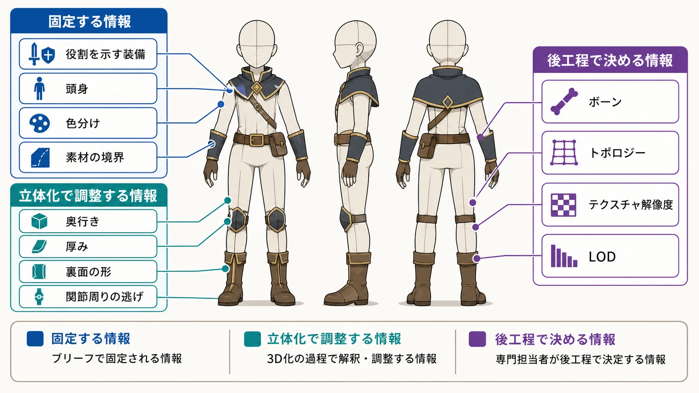
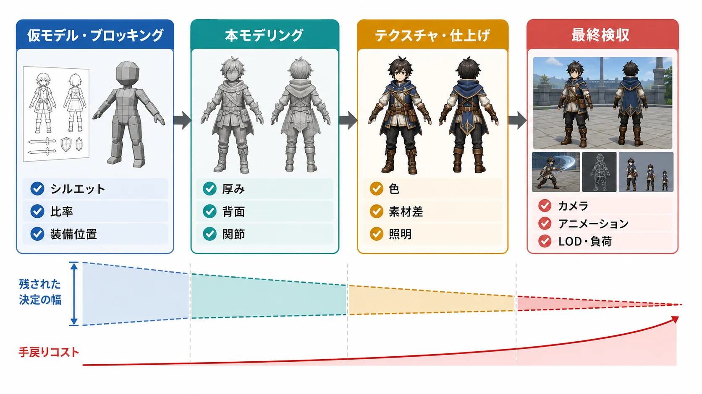
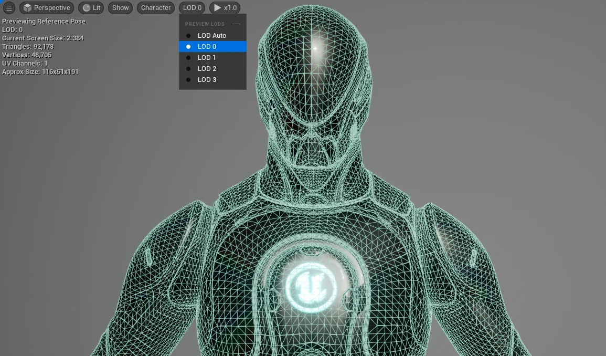
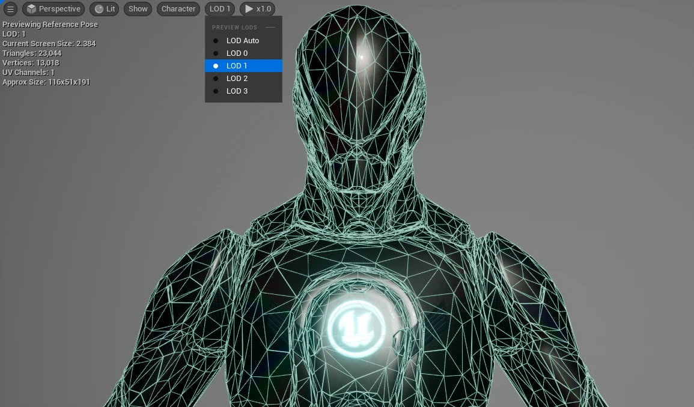
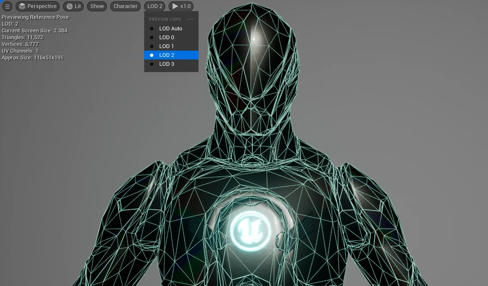
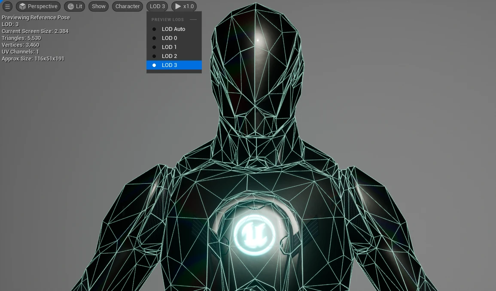

# 2Dデザインから3Dモデルへの立ち上げ・監修基礎
## プランナーが2D資料を立体・可動・実装へ翻訳するための考え方

## はじめに

2D原画は、見る人に向けた一方向からの「読ませ方」を固定できる。正面に顔を置き、武器を画面の外周へ出し、色と明暗で視線を誘導すれば、その一枚の中では狙った印象を成立させられる。

しかし、3Dモデルは一枚の絵の中に留まらない。ゲーム内ではカメラが横や背面へ回り込み、キャラクターは歩き、攻撃し、しゃがみ、倒れる。さらに、モデルは環境や時間帯、カメラ距離に応じたライティングを受ける。正面では完璧に見える形が、側面から見ると薄く潰れていたり、ポーズを取ると装備同士がめり込んだりすることがある。

ゲームエンジンで扱うキャラクターは、見た目のメッシュだけでなく、骨格、アニメーション、制御、物理や衣装などが関係する複数の資産として成立する。Unreal Engineの公式資料でも、Skeletal Meshは視覚形状と骨格を基礎にアニメーションシステムへ接続されるものとして説明されている。[[1](#ref-1)]

したがって、2D原画をそのまま立体化することが目標なのではない。原画が伝えたかったシルエット、プロポーション、役割、素材感を、全方位・可動・実装という条件の中で再現することが目標である。本稿では、絵を描く専門教育も3D制作の専門教育も受けていないゲームプランナーが、2D資料を3D制作へ渡し、モデリングとアニメーションの整合性を検収するための基礎を整理する。

なお、既存の[「プランナーのためのビジュアル発注基礎（コンセプトアート編）」](concept-art-commissioning-basics-for-planners.md)で扱ったシルエット、プロポーション、線の情報量、色数・彩度、視線誘導、余白の使い方は前提とする。本稿では、それらを立体物と動くアセットへどう翻訳するかに焦点を置く。

***

## 1. 2D原画を3D資料へ翻訳する

### 3D化の前に「何を固定し、何を解釈に任せるか」を分ける

2D原画には、見る方向を限定することで成立している表現が含まれる。たとえば、肩幅を広く見せるために奥側の肩を省略する、髪の房を顔の横へ大きく描く、靴を長くして脚を伸ばして見せる、といった処理である。これらは一枚絵としては有効だが、立体化すると別の角度から理由が失われる。

そのため、立ち上げ資料では原画を「正しい形の唯一の答え」として渡すのではなく、次の三種類に分けるとよい。

- **固定する情報** ：役割を示す装備、全体の頭身、顔や手など必ず見せる部位、色分け、素材の境界である。
- **立体化で調整する情報** ：奥行き、厚み、裏面の形、髪や布の分割、関節周りの逃げである。
- **後工程で決める情報** ：ボーンの本数、細かなトポロジー、テクスチャの解像度、LODの段階など、専門担当が設計する情報である。

ここを分けずに「原画通り」とだけ伝えると、モデラーはどの部分を守り、どの部分を補うべきか判断できない。結果として、原画の一部を厳密に守ったために、別の角度やポーズが破綻することもある。

### 三面図は形状の答えではなく、解釈の幅を狭める基準である

モデラーへ渡す基本資料は、正面・側面・背面を同じ基準線とスケールで並べた三面図である。必要に応じて、斜め前、斜め後ろ、上面、足元、顔、武器などの補足図を追加する。

三面図で重要なのは、三枚の絵がそれぞれきれいに見えることではない。頭頂、肩、腰、膝、接地面などの高さが揃い、正面と側面の幅・奥行きが矛盾しないことである。正面図だけでは、胸当ての厚み、髪の後ろ側、背負い物の張り出し、靴底の高さは決められない。

コンセプトアートだけで制作を始める場合、見えていない部分をモデラーが補うことになる。これは専門家の創造性を活かす余地でもあるが、補う箇所が多いほど、担当者ごとの解釈が分かれる。後から背面のデザインや素材の切り替わり位置を変更すると、形状、UV、テクスチャ、リグ、アニメーションまで修正範囲が広がる。

資料には、次の情報を明記するとよい。

- 基準となる身長、武器の全長、足の接地面などのスケール情報である。
- 正面・側面・背面のどこまでが同じ形状として対応するかである。
- 見えない面の厚み、裏面、内側、留め具、縫い目などの処理である。
- 金属、布、革、髪、肌など、素材が切り替わる位置である。
- 左右対称か、非対称ならどちら側に何があるかである。
- ゲーム中に常に見せる部位と、見えなくても成立する部位である。

ターンアラウンドが未整備なら、いきなり本制作へ進めず、まずモデラーに仮の側面・背面案を出してもらい、発注側が解釈を確定する工程を置くべきである。これは制作を遅らせる作業ではなく、曖昧なまま進んだ形状を後で全工程から戻すリスクを抑える作業である。

*図：正面・側面・背面の三面図を基準に、2D資料で固定する情報、立体化の解釈に委ねる情報、専門担当が後工程で決める情報を整理したもの。*

### 可動を前提に、資料の中へ「動く条件」を埋め込む

立ち絵の資料とゲーム用モデルの資料では、必要な情報が違う。ゲーム用モデルでは、関節がどの方向へ動くか、何が身体に追従し、何が別パーツとして取り外せるかを早い段階で共有しなければならない。

最低限、次のような補足を添えるとよい。

| 補足項目 | 資料に書く内容 |
|---|---|
| 関節 | 肩、肘、手首、股関節、膝、足首などの可動方向と、避けたい干渉である。 |
| 装備 | 身体に固定するのか、手で持つのか、ソケット（装備を取り付けるための基準点）から着脱するのかである。 |
| 衣装 | 身体と一体で変形させるのか、布として揺らすのか、別モデルへ分けるのかである。 |
| 顔 | 口の開閉、まばたき、表情差分などを想定するかどうかである。 |
| ゲーム内用途 | 通常移動、戦闘、イベント、カットシーン、遠景表示のどこで使うかである。 |
| 禁止事項 | 破綻してもよい演出上の範囲、絶対にめり込ませたくない部位である。 |

たとえば「大きな肩飾り」は、正面絵の必須要素であると同時に、腕を上げる動作の障害にもなる。資料には「肩飾りは大きく見せる」だけでなく、「腕を水平以上に上げる」「両手で武器を構える」「回避で身体をひねる」といった代表ポーズを添える方が、制作側は判断しやすい。

### 分解可否を先に決める

装備を一枚のメッシュにまとめるか、身体・衣装・武器・装飾へ分けるかは、見た目だけの問題ではない。着せ替え、破壊表現、武器交換、アニメーション、LOD、当たり判定に関係する。

全身を一体化すると、継ぎ目が目立ちにくい反面、装備の交換や部分的な表示切り替えが難しくなる。逆に分割しすぎると、境界の隙間、マテリアル（光の受け方や質感を設定する情報）の数、管理対象が増える。Unreal EngineのFBXパイプラインでも、Skeletal Meshを複数のメッシュで構成し、部品ごとにLOD（距離に応じて切り替える簡略モデル）を変えたり、別々に扱ったりする構成が説明されている。[[2](#ref-2)]

プランナーが決めるべきなのは、メッシュを何個にするかという数値ではない。次のような利用条件である。

- 武器や盾を差し替えるかである。
- 衣装を着せ替えるかである。
- ダメージで一部を外すかである。
- 背中の装備をイベント中だけ非表示にするかである。
- 同じ骨格を別衣装や別キャラクターで共有するかである。

この条件が決まれば、モデラー、リガー、アニメーターが分割方法を相談できる。

***

## 2. モデリング段階でプランナーが確認すること

### シルエットは一枚ではなく、アングルとポーズの組で確認する

仮モデルが上がったら、正面のターンテーブル画像だけで合否を決めてはいけない。少なくとも正面、側面、背面、斜め前、斜め後ろを回し、直立、歩行、戦闘姿勢、しゃがみ、腕を上げた姿勢を確認する。

見るべきなのは、すべての角度で原画と同じ輪郭になることではない。原画で担っていた認知上の役割が、立体のどの角度でも失われていないことである。たとえば、正面で大きく見える武器が側面で身体へ重なり、遠景では「武器を持つ人物」ではなく「腕の横に塊がある人物」へ見えるなら、シルエットの翻訳に失敗している。

レビューでは、カメラを自由に回すだけでなく、ゲームで想定するカメラ位置と画角でも確認する。プレイヤーが見る時間の長い角度を優先し、背面をほとんど見ないゲームであっても、背面が破綻してよいとは限らない。カメラが一瞬回り込む、倒れた状態を映す、イベントで別アングルを使う、といった例外があるからである。

### 2Dのデフォルメは、立体になると比率の問題へ変わる

2Dでは、頭を大きくする、脚を長くする、手を小さくする、肩を広げるといったデフォルメを、画面内の見え方として調整できる。3Dではその比率が全方向に持続するため、ポーズやレンズによって印象が変わる。

確認するときは、「原画より似ているか」だけでなく、次のように観察する。

- 側面で頭部だけが前へ出て、首や胸との接続が不自然になっていないかである。
- 斜め上から見たとき、脚の長さと胴の厚みの関係が変わっていないかである。
- 腕を下ろしたときは細く見えるのに、構えたときだけ肩と腕が一つの塊になっていないかである。
- 画面の縮小表示で、顔・武器・衣装のどこが主役なのかが変わっていないかである。
- 原画で大きく描かれた装飾が、立体では身体の可動を奪うほど張り出していないかである。

「頭身を正確に合わせる」という指示だけでは足りない。重要なのは、通常ポーズと代表ポーズの両方で、原画が作った役割や重心が残っているかを確認することである。

### トポロジーとポリゴン数は、数字よりも変形箇所を見る

トポロジーは、メッシュの面や頂点がどのようにつながっているかを指す。プランナーが面の流れを設計する必要はないが、可動部分に頂点の余裕が必要だという感覚は持っておくべきである。

肘、膝、肩、股関節、口元など、曲がる場所を少ない面だけで直角に折ろうとすると、体積が潰れたり、輪郭が急に変わったりする。逆に、動かない装飾へ細かい面を使いすぎると、見た目の効果に対してデータや処理の負担が増える。Unreal Engineの公式資料でも、リギングは骨格がメッシュの頂点へ影響し、スキンウェイト（各頂点がどの骨にどの程度追従するかを示す重み）を調整して変形を決める工程として説明されている。[[2](#ref-2)]

レビューで使える質問は、次の程度で十分である。

- ここはどの骨に追従する部分であるか。
- 曲げたときに、輪郭を保つ頂点の余裕があるか。
- ここは固定装備か、身体と一緒に変形する衣装かである。
- 変形で破綻した場合、形状を直すのか、別パーツや補助ボーンで逃がすのかである。
- この細部は、想定カメラ距離で見える効果に見合っているかである。

「ポリゴンを増やしてほしい」と一律に言うのではなく、「肘を曲げると袖の外周が潰れる。肘周りの変形を確認し、必要なら面の流れか袖の分割を見直してほしい」と伝える方が、担当者が適切な解決策を選びやすい。

### テクスチャと質感は、ニュートラルな光と実ゲームの光で見る

2D原画の色は、原画内の光と構図によって整えられている。3Dモデルでは、マテリアルの設定、テクスチャ、ライト、環境反射、ポストプロセス、カメラ距離が組み合わさって色と質感が決まる。原画の色コードをそのまま貼っても、金属が布に見えたり、顔の明暗が強くなりすぎたりすることがある。

検収では、少なくとも次の三種類の見方を分けるとよい。

1. **ニュートラルな光** で、形状と素材の差が読めるかを確認する。
2. **ゲーム内の代表照明** で、想定シーンの色と明暗が成立するかを確認する。
3. **極端な照明** で、暗所や逆光でも重要な識別情報が消えないかを確認する。

Unreal EngineのSkeletal Mesh Editorには、メッシュ、マテリアル、スキニング、LODを確認し、プレビューアニメーションやターンテーブル、異なるライティングで見るための機能が用意されている。[[3](#ref-3)] ここで重要なのは、ツールを使いこなすことではなく、固定照明の美しいレンダーだけで合否を決めないことである。

たとえば、黒い革を原画に合わせて暗くしすぎると、ゲーム内の暗所で輪郭が消える。金属の反射を強くしすぎると、ライトの位置によって武器の形が読めなくなる。テクスチャ検収では、「色が違う」ではなく、「通常照明では布と金属の差が読めるが、逆光では肩装備と髪が同じ塊に見える」と、条件と現象を記録する。

***

## 3. 可動域とアニメーションの整合性を見る

### リギングは、動かすための骨格と変形ルールを作る工程である

リギングとは、メッシュにボーンと呼ばれる骨格を組み込み、ボーンの動きに合わせて頂点を変形させる仕組みを作ることである。Blenderの公式マニュアルでは、アーマチュアをメッシュへ関連付け、ボーンの動きで頂点を変形させるスキニングが説明されている。[[4](#ref-4)]

Unreal Engineの公式資料でも、スケルトンはボーンの階層としてアニメーションデータを保持し、複数のメッシュで共有される場合はボーン名や階層の整合性が必要になると説明されている。[[5](#ref-5)] プランナーがボーンの設計図を作る必要はないが、モデルの形状が後からアニメーションの前提を変える可能性は理解しておくべきである。

検収時には、モデル単体ではなく、仮リグと代表アニメーションを組み合わせて見る。確認対象は、たとえば次の通りである。

- 腕を前・横・上へ動かしたとき、肩、胸、襟、肩装備が互いにめり込まないかである。
- 肘と膝を深く曲げたとき、袖やズボンの体積が潰れすぎないかである。
- 手を握る、武器を持つ、武器を振る動作で、指とグリップの位置が合うかである。
- 走る、しゃがむ、着地する動作で、足底が地面から浮いたり沈んだりしないかである。
- 身体をひねったとき、ベルト、鞘、背負い物、髪が身体を貫通しないかである。
- 顔を動かしたとき、髪や装飾が目・口・表情を隠さないかである。

Unityの公式資料では、スキンウェイトに関係するボーン数が増えるほど変形の表現力が上がる一方、計算資源にも影響すると説明されている。[[6](#ref-6)] ここからプランナーが学ぶべきことは「何本なら正解か」ではない。可動の品質と実行時のコストは同時に管理する対象であり、見た目の要望を出す時点で代表動作と対象プラットフォームを示す必要があるということである。

### 衣装や装備が可動を妨げる典型例

「絵としてはかっこいいが動かせない」形状には、いくつかのパターンがある。

#### 肩や腰を覆う硬い装備

大きな肩当て、長い襟、腰を一周する硬いベルトは、腕上げや胴体のひねりを妨げやすい。回避策は、関節の内側に必要な隙間を設ける、装備を複数パーツへ分ける、補助ボーンで追従方向を制御する、動作中だけ形状を変える仕組みを検討することである。

#### 長い布や髪が脚・武器に絡む形状

長いマント、帯、髪、スカートは、走る・回る・倒れる動作で脚や武器へ入りやすい。回避策は、固定部分と揺れる部分を分け、揺れ方の優先順位を決め、必要なら簡易な物理やアニメーション専用の制御を使うことである。すべてを物理演算へ任せると、重要なポーズで形が安定しない場合があるため、見せたい動きを先に決める必要がある。

#### 背負い物や翼がカメラ・武器と干渉する形状

大きな翼、バックパック、長い鞘は、背面のシルエットを強くする一方で、カメラや腕の軌道へ入りやすい。装備の接続点を決め、武器を抜く側の空間を空け、戦闘中のカメラ位置で確認する。装備を固定する骨と、身体の動きに追従する骨を分ける方法もある。

#### 関節をまたぐ鋭い装飾

肘や膝を横切る鋭い板、装飾の尖った靴、手首を覆う突起は、静止画では輪郭を強めるが、曲げたときに身体や地面へ刺さりやすい。関節の可動範囲を狭めるのか、装飾を分割するのか、アニメーション側でポーズを制限するのかを、見た目の優先度と一緒に決めるべきである。

### 可動域の確認は「最大」より「代表動作」で行う

人間の関節が何度動くかを暗記しても、ゲーム中の正解にはならない。重要なのは、そのキャラクターが実際に使う動作で、形状と演出が成立することである。

最低限、次の代表動作を用意する。

- 待機姿勢と通常移動である。
- 攻撃、ガード、被弾、回避である。
- 武器を構える、振る、しまう動作である。
- しゃがむ、着地する、倒れる動作である。
- イベントやカットシーンで使う表情・手振りである。

各動作について「変形破綻がない」「重要装備が読める」「武器や衣装が身体を貫通しない」「カメラを遮らない」という合否条件を置く。完璧な最大可動域を求めるのではなく、ゲームデザイン上必要な動作を先に守る考え方である。

***

## 4. 検収段階ごとに見るポイントを変える

制作工程が進むほど、見た目の問題が別の資産へ波及する。仮モデルで発見できるプロポーションの問題を、本モデリング後に初めて指摘すると、テクスチャやリグの作り直しまで発生する。各段階で「今決めるべきこと」を限定することが、監修の基本である。

*図：仮モデル・ブロッキングから最終検収までの各段階で、主な確認対象と手戻りコストの変化を整理したもの。*

| 段階 | 主に見るポイント | その段階で決めないこと |
|---|---|---|
| 仮モデル・ブロッキング | シルエット、プロポーション、身長や武器とのスケール感、主要装備の位置である。 | 微細な面の流れや最終的な色である。 |
| 本モデリング | 厚み、背面、接続部、関節周りの構造、装備の分割、代表ポーズでの形状である。 | 仕上げの光沢や小さな汚れ表現である。 |
| テクスチャ・仕上げ | 色、素材差、継ぎ目、UV（テクスチャを貼るための座標）由来の見え方、ニュートラル光と代表照明での読みやすさである。 | 大きな形状変更である。 |
| 最終検収 | ゲームエンジン内のカメラ、ライティング、アニメーション、LOD、メモリや描画負荷との兼ね合いである。 | 制作意図と無関係な好みの微調整である。 |

### 仮モデル・ブロッキング

ここでは、箱や簡略形状であっても判断できることを優先する。確認項目は、全体の頭身、肩幅と腰幅、武器の長さ、装備の張り出し、キャラクター同士の身長差、ゲーム内でのスケール感である。

「顔がまだ作り込まれていないから判断できない」と考えがちだが、顔の造形が不要という意味ではない。頭部の大きさ、首の長さ、肩との接続が変われば、後の表情や髪の設計にも影響する。仮モデルでは、細部の完成度ではなく、後で直しにくい大きな比率を決める。

### 本モデリング

本モデリングでは、正面と側面の対応、背面の処理、厚み、装備の接続、関節の逃げを確認する。モデラーが提示したターンテーブルに加えて、代表ポーズでのスクリーンショットを提出してもらうと、静止した直立姿勢では見えない問題を発見しやすい。

この段階の差し戻しでは、「腰の装飾を少し小さくする」だけでなく、「しゃがみで太ももに当たるため、腰の前側だけ逃がす」「武器を抜くときに鞘が腕の軌道へ入るため、接続位置を背面へ移す」のように、動作条件を添える。

### テクスチャ・仕上げ

形状が合っていても、素材の境界や色のコントラストが崩れると、ゲーム画面では別のデザインに見える。確認対象は、顔や武器などの焦点、肌・髪・布・金属の区別、テクスチャの継ぎ目、左右反転や繰り返しの違和感、暗所での輪郭である。

光沢の強さを一律に上げるのではなく、「金属として読ませる場所」と「形を読みやすくするために反射を抑える場所」を分けて検討する。原画の色を守ることと、ゲーム内で色が読めることが衝突した場合は、プレイヤーが識別すべき情報を優先する。

### 最終検収

最終検収は、DCC（デジタルコンテンツ制作）ツールの美しいプレビューを承認する場ではない。実際のゲームエンジンで、想定カメラ、解像度、ポストプロセス、ライト、アニメーション、他キャラクターとの同時表示を確認する場である。

パフォーマンスでは、ポリゴン数だけを見て判断しない。メッシュ数、マテリアル数、テクスチャのメモリ、スキニングや物理、LODの切り替え、同時表示数が組み合わさって負荷になる。LODはカメラから遠いほど形状の細かさを下げ、描画コストを抑える仕組みである。Unreal Engineの公式資料では、LOD番号が上がるほどジオメトリ数を減らし、場合によってはボーン数も減らす構成が説明されている。[[7](#ref-7)]

*画像出典（引用）：Epic Games, [Per-Platform LODs](https://dev.epicgames.com/documentation/en-us/unreal-engine/per-platform-lods?lang=en-US) / 同ページ掲載のMannequin LOD 0〜3を、本文のLODによる形状簡略化の説明に必要な範囲で引用。図像は改変せず、形式のみWebPに変換。*

ただし、LODを軽くしすぎると、遠景で顔の輪郭、武器の先端、特徴的な装飾が消える。検収では「ポリゴン数が少ないから良い」ではなく、画面上で残す情報と、削ってよい情報が一致しているかを確認する。

***

## 5. 差し戻しを観察可能な言葉へ変換する

### 「目的・観察・依頼・確認基準」の順で伝える

3Dモデルへのフィードバックでも、感想をそのまま投げず、目的、観察、依頼、確認基準の順に整理するとよい。2D原画で使っていた語彙を捨てる必要はないが、観察対象へ奥行き、可動、接触、ライティング、実装条件を加える。

| 曖昧な言い方 | 観察可能な言い方 |
|---|---|
| もっとかっこよくしてほしい。 | 正面では武器の外周が読めるが、側面では身体に重なって短く見える。側面でも武器の長さが残る形を確認したい。 |
| もう少し自然に動かしてほしい。 | 肘を曲げると袖の外周が潰れ、前腕が細く見える。肘周りの面の流れか袖の分割を見直したい。 |
| 装備が邪魔に見える。 | 待機では問題ないが、両手で武器を構えると肩装備が頬と重なる。構えポーズで顔が隠れない位置へ逃がしたい。 |
| 色が違う気がする。 | 参照色は合っているが、代表照明では髪と黒い布が同じ明度になり、頭部の輪郭が消える。髪と布の明度差を確保したい。 |
| 仕上げが甘い。 | 斜め後ろから見ると、背中のテクスチャの継ぎ目が一直線に見える。カメラが回り込む距離で継ぎ目を目立たせない処理を確認したい。 |
| もっと軽くしてほしい。 | 遠景の同時表示数が多い場面で、LOD0のまま表示されている。画面占有率がこの値になったときにLOD1へ切り替わる設定と見え方を確認したい。 |

この書き方なら、モデラーが形状を直すのか、テクスチャを直すのか、リグやアニメーション側で解決するのかを判断できる。発注側が解決策を一つに決め打ちする必要はない。問題が現れる条件と、守りたい見え方を伝えることが役割である。

### 画像への書き込みは「場所・方向・条件」を示す

スクリーンショットを使う場合は、丸で囲むだけでなく、次の三点を添える。

- **場所** ：右肩の外周、左足首の接続部、背面のUV境界などである。
- **方向** ：外へ張り出す、厚みを減らす、上へ逃がす、分割するなどである。
- **条件** ：側面、しゃがみ、逆光、LOD1、武器を構えた姿勢などである。

「ここが気になる」だけでは、静止画の違和感なのか、動作時の破綻なのかが分からない。条件を固定すれば、修正後の再確認も同じ画面で行える。

### 差し戻しのコストが上がることを発注側が理解する

仮モデルの時点で頭身や装備位置を変えるなら、形状の修正で済むことが多い。本モデリング後ならUVやテクスチャへ影響し、リグ後ならウェイトやボーン、アニメーションの確認が追加される。仕上げ後ならマテリアルやライティングの再調整が必要になり、実装後ならLODやパフォーマンス検証まで戻る。

これは「後で直してはいけない」という意味ではない。重大な問題は、段階が進んでいても止めて直すべきである。ただし、細かな好みの修正を終盤まで持ち込むと、必要な修正と不要な修正が混ざる。各段階で、今見つけた問題が次工程へ何を波及させるかを記録し、優先順位をつけることが重要である。

実務では、コメントを次の三つに分けると扱いやすい。

- **必須修正** ：役割が読めない、重要な可動が破綻する、ゲーム内で表示できないなど、次へ進めない問題である。
- **優先修正** ：代表カメラや代表動作で目立ち、品質基準を下げる問題である。
- **検討事項** ：別案と比較したい、特定の演出でのみ気になる、コストと効果を相談したい事項である。

この分類は、モデラーの裁量を奪うためではない。レビューの場で、全員の好みを同じ重さで扱わないための仕組みである。

***

## 6. プランナーが用意する監修チェックリスト

案件ごとに専門的な仕様は変わるが、次の項目は初回の立ち上げ資料へ入れやすい。

### 2D資料の受け渡し前

- 正面・側面・背面の基準図があり、基準線とスケールが揃っている。
- 見えていない面の厚み、背面、内側、素材境界が決まっている。
- 左右非対称の部位と、正面で隠れている装備が記録されている。
- ゲーム内で使う代表カメラ、代表ポーズ、表示距離が示されている。
- 装備の着脱、交換、破壊、表示切り替えの要否が決まっている。
- 固定情報と、モデラーが立体として解釈してよい情報が分かれている。

### 仮モデルの確認時

- 複数アングルでシルエットの役割が保たれている。
- 直立と代表ポーズで頭身、重心、装備の比率が破綻していない。
- キャラクター間の身長差、武器や背景とのスケール感が成立している。
- 大きな形状の問題を、細部や色の好みより先に指摘している。

### 本モデリングとリグの確認時

- 関節周りが代表動作で潰れず、装備が身体へめり込まない。
- 手と武器、足と地面、鞘と武器の位置関係が合っている。
- 衣装や装備の分割が、着せ替え・交換・LOD・物理の要件と合っている。
- 同じ骨格を共有する予定のモデルと、ボーンや接続点の前提が矛盾していない。

### 仕上げと最終検収時

- ニュートラル光、代表照明、暗所や逆光で重要な識別情報が残っている。
- 素材の差、色の優先順位、テクスチャの継ぎ目がゲーム内距離で確認できる。
- 実際のカメラとアニメーションで、髪・衣装・装備・武器が干渉していない。
- LODの切り替えで、顔、武器、役割を示す装備が急に消えたり形を変えたりしない。
- ポリゴン、マテリアル、テクスチャ、スキニング、物理、同時表示数の負荷を確認している。

***

## まとめ

2Dの「絵の正解」と、3Dの「立体・可動の正解」は別物である。2D原画が固定するのは、主に特定の視点から何をどう読ませるかである。3Dモデルが満たすべきなのは、全方位から見た形状、代表動作での変形、ライティング下での素材と色、ゲームエンジン内での表示と負荷である。

プランナーは、モデラーやリガーの代わりに細部を作る必要はない。必要なのは、2D資料のどこが必須で、どこが立体化の解釈に委ねられ、どの動作と画面条件で検証するのかを整理することである。正面の絵を渡して終わるのではなく、側面・背面・代表ポーズ・ライティング・LODまでを一つの受け渡し条件として考える。

立ち上げ工程でプランナーが担うのは、2Dの意図を3Dの制約へ翻訳する橋渡し役である。その翻訳が早く、具体的であるほど、制作側は形状・リグ・アニメーション・実装のどこで解くべきかを判断しやすくなる。監修とは完成品を好みで採点することではなく、プレイヤーが実際に見る立体と動きを、意図した体験へ近づけるための条件を確認する仕事である。

## References

1. [Skeletal Meshes in Unreal Engine｜Epic Developer Community][1] - Skeletal Meshがメッシュと骨格を基礎にキャラクターのアニメーションや制御へ接続されることを説明している。

2. [FBX Skeletal Mesh Pipeline in Unreal Engine｜Epic Developer Community][2] - Skeletal Meshのリギング、複数メッシュ構成、スキニング、LODの基本を説明している。

3. [Skeletal Mesh Editor｜Epic Developer Community][3] - マテリアル、スキニング、LOD、アニメーション、ターンテーブル、ライティングをプレビューする機能を説明している。

4. [Introduction — Blender Manual][4] - アーマチュアとメッシュを関連付け、ボーンの動きでメッシュを変形させるスキニングの考え方を説明している。

5. [Skeletons in Unreal Engine｜Epic Developer Community][5] - スケルトンのボーン階層、アニメーションデータ、メッシュ間で共有する際の整合性を説明している。

6. [Skinned Mesh Renderer component reference｜Unity Manual][6] - スキンウェイトに関係するボーン数と、変形品質・計算資源の関係を説明している。

7. [Per-Platform LODs｜Epic Developer Community][7] - Skeletal MeshのLOD、ジオメトリやボーン数の削減、プラットフォームごとのLOD設定を説明している。

[1]: https://dev.epicgames.com/documentation/en-us/unreal-engine/skeletal-mesh-assets-in-unreal-engine
[2]: https://dev.epicgames.com/documentation/en-us/unreal-engine/fbx-skeletal-mesh-pipeline-in-unreal-engine
[3]: https://dev.epicgames.com/documentation/en-us/unreal-engine/skeletal-mesh-editor-in-unreal-engine
[4]: https://docs.blender.org/manual/en/latest/animation/armatures/skinning/introduction.html
[5]: https://dev.epicgames.com/documentation/en-us/unreal-engine/skeletons-in-unreal-engine
[6]: https://docs.unity3d.com/6000.0/Documentation/Manual/class-SkinnedMeshRenderer.html
[7]: https://dev.epicgames.com/documentation/en-us/unreal-engine/per-platform-lods?lang=en-US

----

この文書は、Perplexity、Claude、OpenAI Codex の3つのAIの支援を受けて著述されたものです。引用画像を除き、MIT License にて提供されています。
