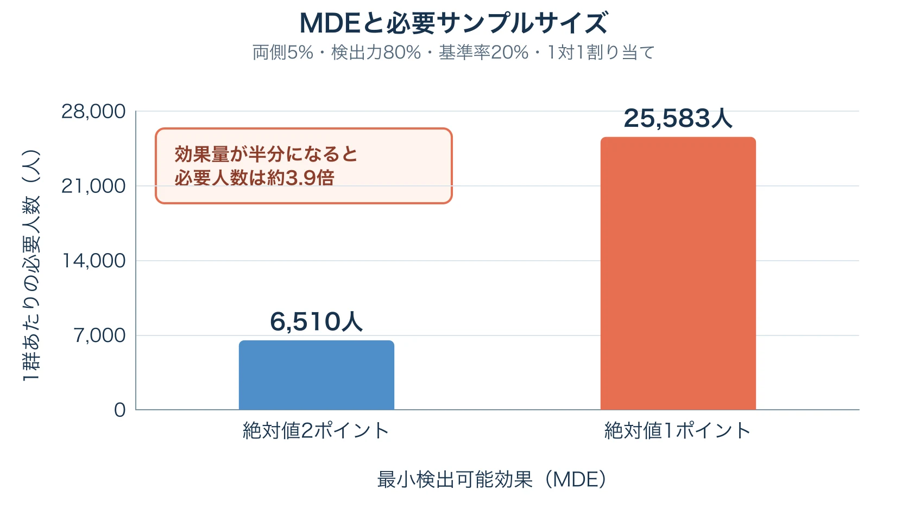
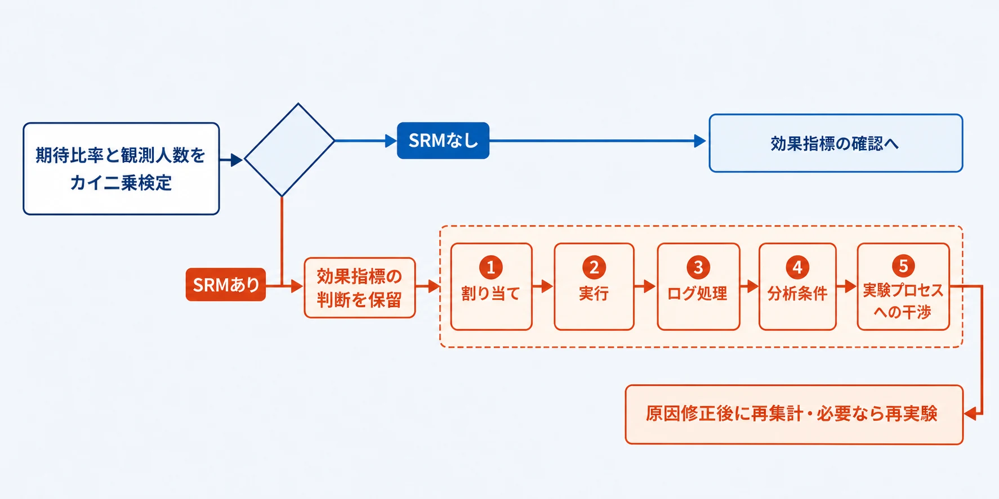
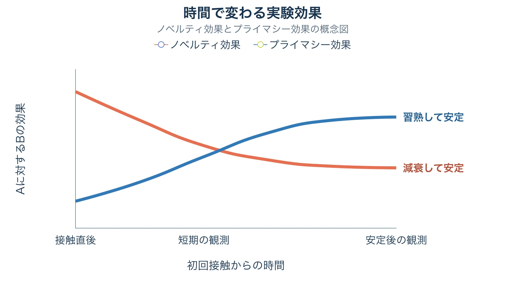
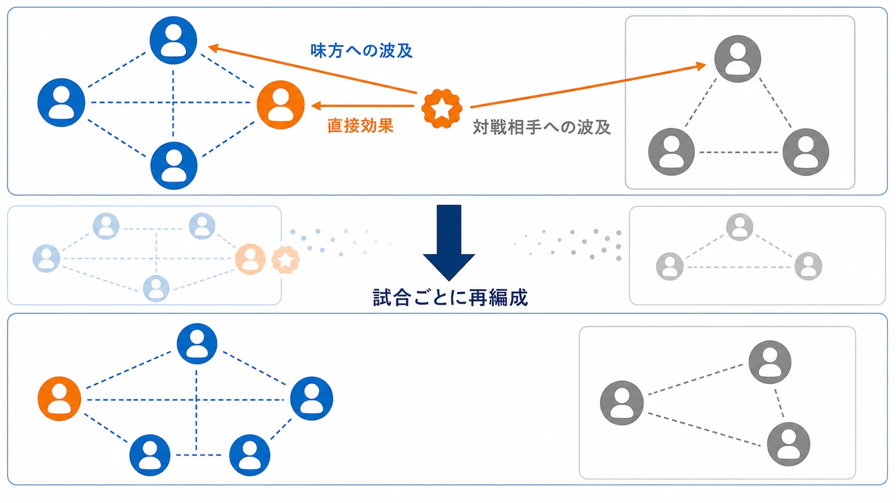
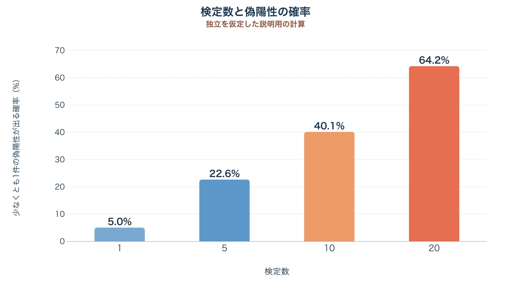
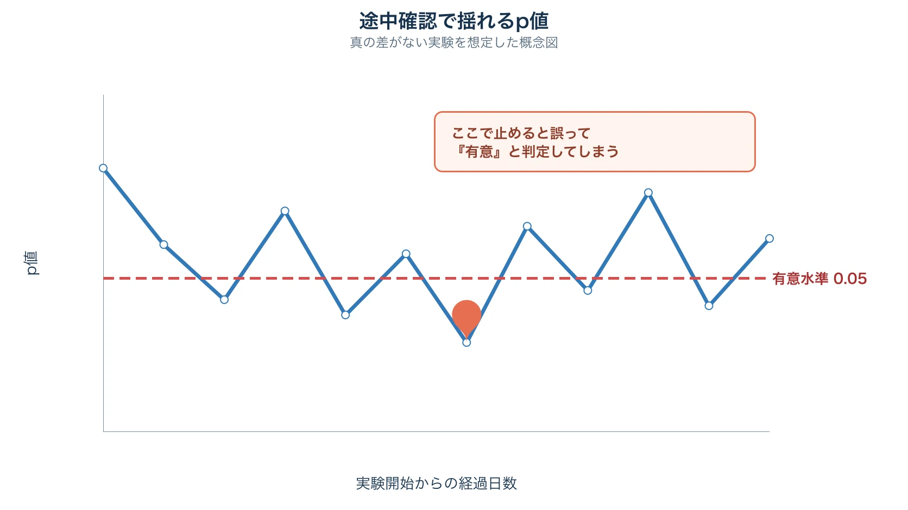

# その「勝った」は本物か――A/Bテストの設計と読み方

## 1. なぜ「Bが勝った」を疑うところから始めるのか

A/Bテストの画面に「Bが有意に高い」と表示された。その瞬間は、施策が成功したように見える。しかし、判断の出発点は祝勝ではなく、 **この差を効果と呼んでよい条件がそろっているか** の確認である。

Tony Twyman に由来する Twyman's Law は、「興味深い、あるいは他と違って見える数字は、たいてい間違っている」という趣旨の警句である。Microsoftのオンライン実験チームは、予想外に大きな指標変化には、良い方向でも悪い方向でも計測不具合や解釈上の問題が潜んでいる可能性が高いとして、この警句を実験結果へ適用している。[[1](#ref-1)]

もちろん、目立つ数字が必ず誤りという意味ではない。 **目立つほど確認の優先度を上げる** という実務原則である。割り当て比率が崩れるSRM、複数指標から都合のよいものを選ぶ多重比較、結果を毎日見て有意になった瞬間に止めるのぞき見があれば、実際には効果がなくても「勝者」を作れてしまう。さらに、正しく有意差が出ていても、差が事業上小さすぎたり、物珍しさによる一時的な変化だったりする。

p値は「Bが本当に優れている確率」ではない。帰無仮説、たとえば「AとBに真の差はない」が成り立つと仮定したとき、今回以上に極端なデータが得られる確率である。したがって `p < 0.05` だけでは、実装、割り当て、ログ、分析、意思決定の全工程が正しかったことまで保証しない。

[テレメトリ・計測設計入門](game-telemetry-and-instrumentation-design.md)の第9章では、イベント定義、実験群の割り当て情報、事前のサンプルサイズ計算がそろわなければA/Bテストは成立しないと説明した。本稿はその次の段階、すなわち **送信されたデータをどう正しく比べ、どう正しく読むか** に範囲を絞る。

***

## 2. サンプルサイズと検出力――差が小さいほど、必要な人数は跳ね上がる

A/Bテストを始める前に、少なくとも次の三つを決める必要がある。

| 用語 | プランナー向けの意味 | 代表的な設定例 |
|---|---|---|
| 有意水準 $$\alpha$$ | 本当は差がないのに「差がある」と判定する誤りを、1回の検定でどこまで許すか | 両側5% |
| 検出力 $$1-\beta$$ | MDE以上の真の差があるとき、それを見つけられる確率 | 80%または90% |
| 最小検出可能効果（MDE） | この実験で見逃したくない最小の差 | D7リテンション率の絶対値1ポイントなど |

MDEは「出そうな差」ではなく、 **実装費、運用リスク、プレイヤーへの影響を踏まえて、採用判断を変える最小の差** から決める。0.1ポイントの改善では採算が合わない施策なら、0.1ポイントを検出する巨大な実験を組む意味は薄い。一方、わずかな悪化でも重大な決済エラー率のような指標では、小さなMDEが必要になる。

必要サンプルサイズの関係は、概略として次の形で表せる。[[2](#ref-2)]

$$
n \propto \frac{(z_{1-\alpha/2}+z_{1-\beta})^2\sigma^2}{\mathrm{MDE}^2}
$$

ここで $$\sigma$$ は指標のばらつきを表し、$$z$$ は設定した有意水準と検出力に対応する値である。

重要なのは分母にMDEの二乗がある点である。 **検出したい差を半分にすると、必要人数はおよそ4倍になる。** 「もう少し細かな差も見たい」という要望は、人数と期間を少し増やす話では済まない。

たとえば基準となるリテンション率を20%、有意水準を両側5%、検出力を80%、AとBを1対1で割り当てるとする。2群の比率差に対する単純な正規近似では、必要人数は次のようになる。

| 検出したい差 | 比較 | 1群あたりの必要人数 | 合計人数 |
|---|---:|---:|---:|
| 絶対値2ポイント | 20% → 22% | 約6,510人 | 約13,020人 |
| 絶対値1ポイント | 20% → 21% | 約25,583人 | 約51,166人 |

差を2ポイントから1ポイントへ半減させると、人数は約3.9倍になる。実際の計算では、指標の分散、片側・両側検定、割り当て比率、離脱や欠測、複数群、ARPUのような偏りの大きい分布も考慮する必要がある。この表は企画初期の直感を作る例であり、そのまま全指標へ流用する計算表ではない。

サンプルサイズは「有意差が出るまで集める人数」でも、「今期に獲得できそうな人数」でもない。事前に決めたMDEと誤り率から算出し、集められないなら、対象割合を広げる、期間を延ばす、より大きな効果を狙う、実験以外の検証方法へ切り替える、という企画判断へ戻す。

***

## 3. SRM（サンプル比率不一致）――結果を見る前に確認すること

SRM（Sample Ratio Mismatch）は、実際に分析へ入ったユーザー数の比率が、設定した割り当て比率から統計的に説明しにくいほどずれている状態である。50対50の設定が5,020人対4,980人になっただけで直ちに異常とは限らない。ランダム割り当てには自然な揺らぎがあるため、期待度数と観測度数の差をカイ二乗適合度検定などで評価する。

たとえば50対50で1万人を割り当てる計画に対し、分析対象が5,200人対4,800人なら、カイ二乗統計量は16、p値は約0.000063となる。目視では「52対48なら大差ではない」と感じても、1万人規模では偶然だけで生じにくいずれである。

MicrosoftのExperimentation Platform（ExP）では、すべてのA/Bテストについて効果指標を開示する前にSRM検査を通す。同社の分析では約6%のA/BテストにSRMがあり、誤警報を抑える保守的な検出基準として `p < 0.0005` を使用している。[[3](#ref-3)] この閾値はMicrosoftの運用例であり、あらゆるチームの固定ルールではない。トラフィック規模、監視頻度、誤警報と見逃しのコストを踏まえ、分析担当者と基準を決める必要がある。

SRMが危険なのは、欠けたユーザーが無作為に欠けているとは限らないからである。Microsoftが紹介したMSNの画像カルーセル実験では、変更群で強く反応したユーザーがボット検出に除外され、当初は変更群が悪化したように見えた。原因を修正すると結論は反転した。[[3](#ref-3)] SRMは結果を少し不正確にする注意書きではなく、 **比較している集団そのものが変わった可能性を知らせる警報** である。

### 原因を五つの段階で切り分ける

SRMを検出したら、効果指標を解釈する前に、次の順で原因を追う。Microsoftの研究は、原因を割り当て、実行、ログ処理、分析、そして実験プロセスへの干渉という五つの段階に分類している。[[4](#ref-4)]

1. **割り当てを確認する**：設定比率、ランプアップ履歴、ハッシュに使うユーザーID、未ログイン時の仮ID、再インストールや端末変更による再割り当て、過去実験の持ち越しを確認する。
2. **実行を確認する**：特定OSやバージョンだけ変更群を受け取れない、片方だけクラッシュする、リダイレクトで離脱する、施策自体が再訪率やログ送信率を変える、といった差を確認する。
3. **ログ処理を確認する**：イベント欠落、重複排除、結合キー、タイムゾーン、集計窓、遅延到着、片群だけに存在するフィールドによる内部結合の脱落を確認する。
4. **分析条件を確認する**：割り当て後の行動で対象者を絞っていないか、変更群でだけ発生しやすいイベントを参加条件にしていないかを確認する。全割り当てユーザー、未到達ユーザー、OS、地域、バージョン、日時別にSRMを再計算し、異常が局所か全体かを調べる。
5. **実験プロセスへの干渉を確認する**：広告キャンペーンのリンク設定ミスなどにより特定の群へ誤って誘導していないか、実験者やユーザー自身がURLパラメータの操作などで意図的に割り当てへ介入していないかを確認する。

最も大切な優先順位は単純である。 **その他の指標を見る前に、まずSRMを確認する。** SRMが出たまま「ただし売上は有意に上がった」と読み進めてはいけない。原因が説明・修正できるまで、勝敗判定を保留する。

***

## 4. ノベルティ効果とプライマシー効果――「勝ち」はいつまで続くか

実験の効果は、開始日から一定とは限らない。新しいUI、演出、報酬導線が目立つことで一時的に操作や利用が増え、その後に差が縮む現象が **ノベルティ効果** である。反対に、最初は使い方が分からず効果が小さいが、学習や採用が進むにつれて関与が増える現象を、オンライン実験の文脈では **プライマシー効果** と呼ぶ。

Microsoft所属のSadeghiらによる2021年の論文は、ノベルティを「新技術を使いたい欲求が時間とともに弱まること」、プライマシーを「技術の採用に伴い関与が増えること」と整理している。事例は特定ゲームではなく、MSN.com上部の導線をOutlook.comボタンからデスクトップのメールアプリを開くボタンへ変更した実験である。当初はクリック数が大きく増えたが、日ごとの差は急速に縮んだ。著者らは、慣れた導線が変わったことによる混乱をノベルティの原因と考察している。[[5](#ref-5)]

ゲームでも、新しいデイリーミッション欄を開く回数が初週だけ増えることと、長期的に遊び方へ定着することは別である。逆に、新しい編成支援機能や複雑な操作は、初週の利用率だけでは価値を過小評価しうる。

期間設計では、次の二つを分けて考える。

- **必要人数へ達するまでの期間**：検出力を確保するための期間である。
- **効果が安定するまでの期間**：ノベルティや習熟、曜日周期、イベント周期、リテンションを観測するための期間である。

必要人数へ3日で達しても、D30リテンションを判断する実験を3日で止めることはできない。日次差だけでなく、初回接触からの日数別に効果を追い、傾きが残っていないかを確認する。ただし、長く接触したユーザーだけを後から抽出すると、継続意欲の高いユーザーへ偏る。時間効果の分析方法は、実験開始前に分析担当者と決めておく。

モバイルゲームの実務例として、Turbine Gamesは製品変更のA/Bテストを行う規模の目安を週1,000インストール以上、または既存ユーザー実験で3,000 WAU以上とし、直接狙う指標に加えてdXリテンションとdX ARPUを確認する運用を紹介している。新規ユーザーは平均ユーザー年齢D30、リテンションリスクを慎重に見る場合はD60まで延長する。[[6](#ref-6)] これらは同社の経験則であり、すべてのゲームへ当てはまる統計的な最低人数ではない。 **人数は検出力計算、日数は効果の成熟と観測窓** から、それぞれ決める必要がある。

***

## 5. マルチプレイヤー特有のネットワーク干渉――前提が崩れるとき

標準的なA/Bテストは、あるユーザーへBを見せても、別のユーザーの結果には影響しないと仮定する。この考え方はSUTVA（Stable Unit Treatment Value Assumption）の一部として扱われる。ソロプレイ中心の機能なら、ユーザー単位のランダム割り当てでこの前提を置きやすい。

対戦・協力プレイでは事情が変わる。たとえば新しいピン機能をB群の1人だけが使い、A群の味方も連携しやすくなれば、処置の効果が対照群へ漏れる。B群の武器調整が対戦相手の勝率、離脱、再戦意欲を変えれば、相手の指標も処置の影響を受ける。マッチメイキング待ち時間を変える施策なら、同じキューにいる非対象者へまで混雑の影響が及ぶ可能性がある。

2024年の研究「Treatment Effect Estimation Amidst Dynamic Network Interference in Online Gaming Experiments」は、オンラインゲームのチームを、試合中だけ形成され終了後に解散する **動的で短命なネットワーク** と捉えている。固定的な友人関係を前提とするネットワーク実験と異なり、誰と接触するかが試合ごとに変わるため、事前にネットワーク構造を固定して群分けしにくい。同論文は特定タイトル名を明記せず、実環境のモバイルゲームデータによる検証として報告している。[[7](#ref-7)]

| 観点 | ソロプレイ中心 | 対戦・協力プレイ |
|---|---|---|
| 主な影響範囲 | 原則として割り当てられた本人 | 味方、対戦相手、キュー、ギルド、共有経済へ波及しうる |
| ユーザー単位割り当て | 採用しやすい | A/B混在試合では効果が漏れうる |
| 最低限残すログ | ユーザーID、割り当て、接触時刻 | 左記に加え、試合ID、チーム、対戦相手、各参加者の割り当て |
| 分析上の問い | 本人に何が起きたか | 本人への直接効果と、周囲への波及効果は何か |

プランナーは実験票に「影響を受ける単位」を書くべきである。本人だけか、同じ試合、固定パーティ、ギルド、マッチメイキング帯、サーバー全体まで及ぶかを洗い出す。そのうえで、チームやマッチ単位の割り当て、A/B混在試合の制限、干渉量を使った事後補正などを分析担当者と検討する。大きな単位で割り当てれば独立性を守りやすい一方、実質的なサンプル数が減り、検出力も落ちる。

干渉が疑われる実験に、通常のユーザー単位検定をそのまま適用してはいけない。差が薄まるだけとは限らず、味方と敵への影響が混ざって方向まで変わりうるからである。ソロプレイとマルチプレイヤーでは、同じA/Bテスト画面を使えても設計思想は異なる。

***

## 6. 多重比較問題――指標を並べるほど「有意」は増える

1回の実験でD1、D7、D30リテンション、セッション数、プレイ時間、クリア率、継続率、ARPU、購入率など20指標を並べ、どれか一つでも `p < 0.05` なら「勝ち」とする。この判断では、各検定の有意水準が5%でも、実験全体の誤検出率は5%に収まらない。

20検定が独立で、すべてに真の差がないという単純化した条件なら、少なくとも一つが偶然有意になる確率は次の通りである。

$$
1-(1-0.05)^{20}\approx 0.642
$$

つまり約64%である。ゲーム指標は相関するため実際の確率はこの単純計算と一致しないが、指標を増やして都合のよい結果を選べば誤検出が増えるという問題は残る。

ここで管理したい誤り率には、主に二つの考え方がある。

| 誤り率 | 守りたいもの | 向いている判断 |
|---|---|---|
| FWER（Family-Wise Error Rate） | 一連の検定で、少なくとも一つの偽陽性を出す確率 | 採用・全体展開など、誤った勝者を一つでも出したくない確認的判断 |
| FDR（False Discovery Rate） | 有意と判定した結果のうち、偽陽性が占める割合の期待値 | 多数の指標やセグメントから、次に検証する候補を探索する判断 |

**ホルム・ボンフェローニ法** はFWERを制御する。p値を小さい順に並べ、最小のものを `α÷検定数`、次を `α÷残りの検定数` という段階的な基準と比較する。単純なボンフェローニ法より過度に厳しくなりにくく、少数の主要・副次指標のどれかを根拠に採用判断する場面で使いやすい。[[8](#ref-8)]

**ベンジャミン・ホックバーグ法** はFDRを制御する。有意候補の中へ一定割合の偽陽性が混ざることを許し、その代わり発見力を保つ。多数の指標、地域、進行度、課金有無などを探索し、次の仮説を見つける場面に向く。探索で見つけたセグメントを、そのまま全体展開の確証として扱わず、別データや次の実験で確認する。[[9](#ref-9)]

使い分けは、指標の本数だけでなく **その指標が意思決定を変えるか** で決める。

- 事前登録した主要指標が一つだけで、その結果だけで勝敗を決めるなら、その主要検定について多重比較補正は通常必要ない。
- 主要指標が三つあり、どれか一つが有意なら採用するなら、その三つは同じ検定族としてFWERを管理する。
- 30のセグメントを探索して次の企画候補を得るなら、FDRを管理し、結果を探索的所見と明記する。
- 「参考指標」と呼んでいても、有意だったときだけ採用理由に使うなら、実質的には意思決定へ参加している。

補正対象の検定族を結果閲覧後に組み替えると、補正自体が都合のよい選択になる。主要指標、ガードレール指標、探索指標、それぞれがどの判断に使われるかを実験前に固定することが重要である。指標間の相関が強い場合や階層構造がある場合は、標準的な補正法の前提と実装を分析担当者へ確認する。

***

## 7. 逐次検定とのぞき見問題――「見るたび」に歪む有意性

通常の固定標本の検定は、事前に決めた人数または期間で一度判定することを前提とする。ところが実務では、毎朝ダッシュボードを開き、`p < 0.05` になった瞬間に終了したくなる。差がない実験でもp値は時間とともに上下するため、十分な回数を見れば、一時的に閾値を下回る機会が増える。そこで止めると、最終的なサンプルサイズがデータに依存し、名目上の5%より偽陽性率が高くなる。

Johariらは、従来のp値と信頼区間は、実験者が継続監視しながら標本数を決めると信頼できなくなると指摘し、任意の停止時点でも誤り率を制御するalways-valid p値と信頼区間を提案している。[[10](#ref-10)] 重要なのは「途中経過を見た」という視覚行為ではなく、 **見た結果に応じて終了や採否を変えること** である。

正しい運用は、次のいずれかを実験前に選ぶ。

1. **固定期間・固定人数で一度だけ判定する**：途中はSRM、クラッシュ、重大な悪化など運用上の安全確認に限り、通常の効果p値で採否を決めない。
2. **中間解析のタイミングと境界を事前に決める**：たとえば予定情報量の25%、50%、75%、100%で確認し、それぞれ専用の停止境界を使う。各回で単純に `p < 0.05` を使わない。
3. **α消費関数を使う**：全体で許すαを、実験の進行に応じて中間解析へ配分する。Lan–DeMets型の方法は、累積して使うαを定義し、反復確認を含めても全体の第一種過誤を制御する。[[11](#ref-11)]
4. **常時監視対応の逐次手法を使う**：プラットフォームがalways-valid p値や信頼区間を正式に実装している場合は、その手法の停止規則に従う。「逐次対応」と明記されていない通常のp値を、常時監視対応だと推測しない。

途中で大きな悪化が見えたときにプレイヤー保護のため止めることは必要である。その安全停止と、「有意な改善が出た瞬間に勝ちとすること」は別の意思決定として設計する。停止条件、確認担当者、確認時刻、採否に使う統計量を実験票へ書けば、結果を見てから規則を変える余地を減らせる。

***

## 8. まとめ：新規A/Bテスト実施前の確認表

A/Bテストの勝者は、p値が最小の群ではない。事前に決めた問いに対し、割り当てとデータが信頼でき、時間変化と干渉を踏まえ、許容した誤り率の範囲で、採用に値する大きさの効果を示した群である。

実験開始前に、次の項目を確認する。

### 仮説と人数

- [ ] 変更する要素を一つの仮説として説明できる
- [ ] 主要指標、ガードレール指標、探索指標を分けた
- [ ] 採用に値する最小差としてMDEを決めた
- [ ] 有意水準、検出力、基準値、割り当て比率からサンプルサイズを計算した
- [ ] 必要人数を期間内に集められない場合の代替案を決めた

### データ品質とSRM

- [ ] 期待する割り当て比率とランプアップ計画を記録した
- [ ] SRMを効果指標より先に自動確認できる
- [ ] SRMの閾値、監視頻度、異常時の責任者を決めた
- [ ] ユーザーID、割り当て、接触時刻を追跡できる
- [ ] 割り当て後の行動を対象者条件に使う場合、選択バイアスを検討した

### 期間と長期効果

- [ ] 曜日、イベント、アップデートなど必要な周期を含めた
- [ ] 必要人数へ達する日と、D7・D30・D60など指標が成熟する日を分けた
- [ ] ノベルティ効果やプライマシー効果が疑われる機能かを確認した
- [ ] 初回接触からの日数別に、効果の傾きを確認する方法を決めた

### 干渉

- [ ] 施策の影響が本人以外の味方、対戦相手、ギルド、キュー、共有経済へ及ぶかを確認した
- [ ] ユーザー、チーム、試合、ギルドなど適切な割り当て単位を検討した
- [ ] マルチプレイヤー実験では試合構成と全参加者の割り当てを記録できる
- [ ] A/B混在による波及がある場合、通常のユーザー単位分析をそのまま使わない

### 多重比較と途中確認

- [ ] どの指標群にFWERまたはFDRを適用するかを決めた
- [ ] 主要指標のどれか一つが有意なら採用する場合、ホルム・ボンフェローニ法などで補正する
- [ ] 探索結果にはベンジャミン・ホックバーグ法などを検討し、次の実験で再確認する
- [ ] 最終判定の人数・日時、または中間解析のタイミングを事前に決めた
- [ ] 逐次判定を行うなら、α消費関数または常時監視対応の手法を選んだ
- [ ] 安全停止と成功判定の規則を分けた

この確認表を、結果が出てから埋めても意味は薄い。実験票、分析クエリ、ダッシュボード、意思決定会議のすべてが、開始前に合意した同じ規則を参照できる状態を作る。そこで初めて「Bが勝った」は、偶然目立った数字ではなく、再現を期待できる判断材料になる。

## References

1. [A Dirty Dozen: Twelve Common Metric Interpretation Pitfalls in Online Controlled Experiments][1] - Microsoftの実験チームが、Twyman's Lawを含むオンライン実験の代表的な解釈ミスを整理したKDD 2017論文。

2. [Statistical primer: sample size and power calculations—why, when and how?][2] - 有意水準、検出力、効果量、必要サンプルサイズの関係を数式と例で解説する査読論文。

3. [Diagnosing Sample Ratio Mismatch in A/B Testing][3] - Microsoft ExPにおけるSRMの約6%という発生率、カイ二乗検定、`p < 0.0005` の運用例、診断事例を解説する公式記事。

4. [Diagnosing Sample Ratio Mismatch in Online Controlled Experiments: A Taxonomy and Rules of Thumb for Practitioners][4] - SRMの原因を実験工程別に分類し、診断と予防の指針を示したKDD 2019論文。

5. [Novelty and Primacy: A Long-Term Estimator for Online Experiments][5] - SadeghiらMicrosoft所属研究者が、ノベルティ効果とプライマシー効果を定義し、長期効果の推定法を論じた2021年論文。

6. [The A/B Testing Playbook For Mobile Game Growth, Part 1: Structuring the Experiment][6] - Turbine Gamesによる、モバイルゲームの実験規模、指標、D30・D60までの期間設計に関する実務解説。

7. [Treatment Effect Estimation Amidst Dynamic Network Interference in Online Gaming Experiments][7] - マッチごとに形成・解散するネットワーク干渉を扱い、オンラインゲーム実験の処置効果推定を提案した2024年論文。

8. [A Simple Sequentially Rejective Multiple Test Procedure][8] - FWERを制御するホルム・ボンフェローニ法を提案したHolmの1979年論文。

9. [Controlling the False Discovery Rate: A Practical and Powerful Approach to Multiple Testing][9] - FDRとベンジャミン・ホックバーグ法を提案した1995年論文。

10. [Always Valid Inference: Continuous Monitoring of A/B Tests][10] - 継続監視下でも第一種過誤を制御するalways-valid p値と信頼区間を論じた査読論文。

11. [Computations for Group Sequential Boundaries Using the Lan-DeMets Spending Function Method][11] - 中間解析で全体の有意水準を保つα消費関数と逐次境界を解説する論文。

[1]: https://www.microsoft.com/en-us/research/wp-content/uploads/2020/08/2017-08-KDDMetricInterpretationPitfalls.pdf
[2]: https://pmc.ncbi.nlm.nih.gov/articles/PMC6005113/
[3]: https://www.microsoft.com/en-us/research/articles/diagnosing-sample-ratio-mismatch-in-a-b-testing/
[4]: https://www.microsoft.com/en-us/research/publication/diagnosing-sample-ratio-mismatch-in-online-controlled-experiments-a-taxonomy-and-rules-of-thumb-for-practitioners/
[5]: https://arxiv.org/abs/2102.12893
[6]: https://turbine.games/2023/02/10/the-a-b-testing-playbook-for-mobile-game-growth-part-1-structuring-the-experiment/
[7]: https://arxiv.org/abs/2402.05336
[8]: https://www.ime.usp.br/~abe/lista/pdf4R8xPVzCnX.pdf
[9]: https://doi.org/10.1111/j.2517-6161.1995.tb02031.x
[10]: https://doi.org/10.1287/opre.2021.2135
[11]: https://doi.org/10.1016/S0197-2456(00)00057-X

----

この文書は、Perplexity、Claude、OpenAI Codex の3つのAIの支援を受けて著述されたものです。引用画像を除き、MIT License にて提供されています。
