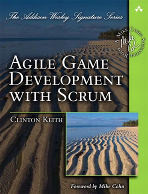
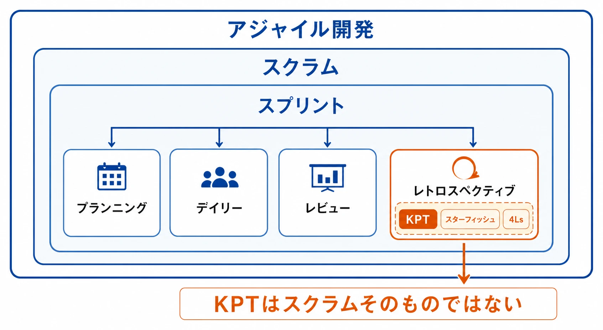
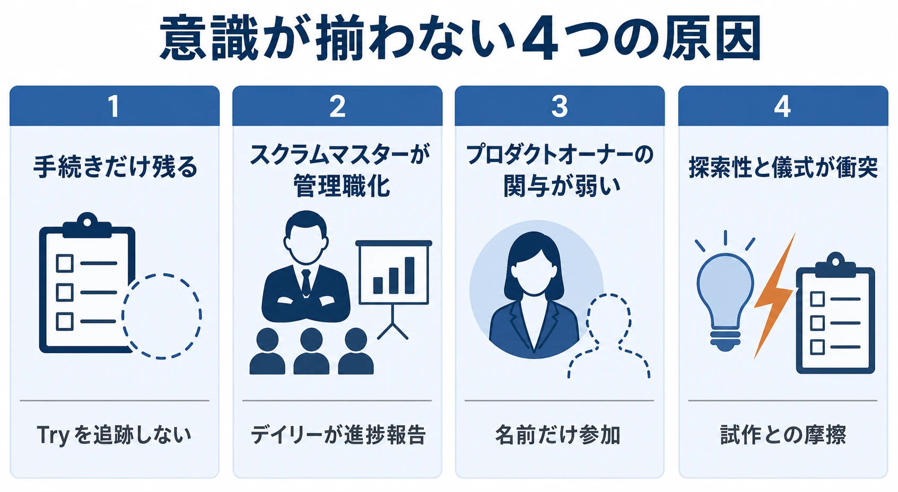
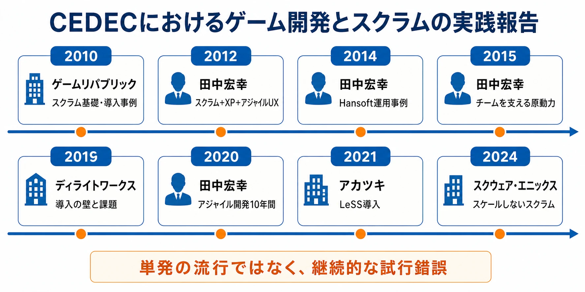
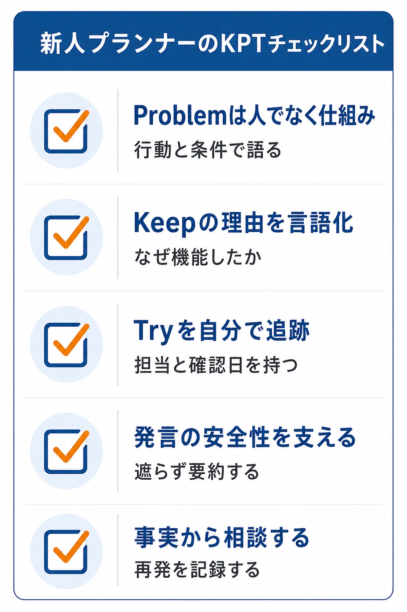

# スクラムの振り返り会で新人ゲームプランナーができること――KPTを「儀式」で終わらせない参加者の実践

配属されたチームでは、毎朝デイリースクラムがあり、スプリントの終わりにはレビューと振り返り会がある。付箋を使った KPT セッションも定期的に開催されている。それなのに、会議室を出ると、メンバーが同じ方向を向いている感じがしない。儀式としては回っているのに、なぜチームの意識はばらばらに見えるのだろうか。

新人ゲームプランナーが、そんな違和感を抱くことは珍しくない。会議の手順を覚えられていないから、専門用語を知らないから、と自分の理解不足だけを疑いがちである。しかし、イベントが予定どおり開かれていることと、チームが同じ目的を見ていることは別問題である。

本稿では、アジャイル開発とスクラムの基本構造、その中で KPT 法を使った振り返り会がどこに位置づくのかを整理する。そのうえで、スクラムや KPT を導入・設計する側ではなく、すでに運用されているチームに参加する新人プランナーが、明日から何を見て、何を発言し、どう行動すればよいかを考える。

***

## 編者の経験――音頭を取る側でも、意識は簡単には揃わない

編者は以前、ディレクターとしてチームでアジャイル開発、具体的にはスクラムを実施した経験がある。スプリント計画を立て、デイリースクラムを行い、成果をレビューし、振り返り会も開いた。予定されたイベントは、少なくとも形式上は回っていた。

それでも、メンバー全員の意識や当事者意識が、ひとつの方向に揃っているとは感じられなかった。会議では意見が出ても、日常の判断では別々の優先順位が働く。振り返りで Try を決めても、次のスプリントでは目の前の作業に押し流される。進行役として場を整えようとするほど、今度はメンバーが「決められた会議に参加する人」になってしまうこともあった。

この経験から分かったのは、スクラムのイベントを置けば自動的にチームになるわけではないということである。アジャイルの源流である宣言も、プロセスやツールより個人と対話を、計画に従うことより変化への対応を重く見る価値観を掲げている。[[1](#ref-1)][[2](#ref-2)]

これは、導入の音頭を取る側であっても簡単に解決できない構造的な問題である。したがって、新人プランナーが「自分だけが分かっていないのではないか」と感じても、その違和感をすべて自分の理解不足のせいにする必要はない。チームの構造、権限、情報の流れ、過去の失敗経験が、会議の空気をつくっているからである。

***

## アジャイル開発とスクラムの関係

### アジャイル開発は、特定の会議名ではない

2001年2月11日から13日、米国ユタ州のスノーバードで、ソフトウェア開発者17名が集まり、アジャイルソフトウェア開発宣言をまとめた。参加者にはケント・ベック、アリスター・コーバーン、ケン・シュエイバー、ジェフ・サザーランドらが含まれていた。[[1](#ref-1)]

宣言は、個人と対話、動くソフトウェア、顧客との協調、変化への対応を、プロセスやツール、包括的な文書、契約交渉、計画への盲従より重視する。ただし、右側を無価値とする宣言ではない。計画も文書も必要だが、それらが目的化して人と学習を縛らないようにする、という優先順位の表明である。[[2](#ref-2)]

つまりアジャイル開発は、毎日立って報告する会議の名前ではない。不確実性の高い開発で、小さく作り、結果を見て、学びを次の判断に反映する考え方である。

### スクラムは、アジャイルな開発を進めるためのフレームワークである

スクラムは、複雑なプロダクトをつくるチームが、短い周期で検査と適応を行うためのフレームワークである。フレームワークとは、すべての作業手順を細部まで決めるマニュアルではなく、チームが共通の見取り図として使う最小限の枠組みである。

スクラムの時間単位であるスプリントは、1か月以内の固定された期間である。スプリントの中に、計画、日々の調整、成果の確認、チーム自身の改善が入る。Scrum Guide は、これらのイベントを作成物の検査と適応のための公式な機会と説明している。[[3](#ref-3)]

| イベント | 何を見る場か | 新人プランナーが見るポイント |
| --- | --- | --- |
| スプリントプランニング | 今回のスプリントでなぜ価値があるか、何をどう進めるか | 作業項目の羅列ではなく、スプリントゴールとユーザー価値が説明されているか |
| デイリースクラム | スプリントゴールに向けた進捗と、これからの計画 | 上司への進捗報告ではなく、開発者同士が今日の作業を調整する場になっているか |
| スプリントレビュー | 作ったインクリメントと、プロダクトの次の方向 | 完成したものを見せるだけでなく、関係者との対話で次の判断が変わっているか |
| スプリントレトロスペクティブ | 人、関係性、プロセス、道具、完成の定義 | 問題を並べるだけでなく、次に変える行動まで決まっているか |

プランニングはスプリントの入口、デイリースクラムは日々の調整、レビューはプロダクトへのフィードバック、レトロスペクティブはチームの仕事の仕方へのフィードバックである。四つのイベントは別々の会議ではあるが、学習と適応という一本の流れでつながっている。

***

## ゲーム開発にスクラムが紹介されてきた経緯

ゲーム開発では、ハードウェアの世代交代とともに、グラフィック、オンライン機能、コンテンツ量、専門職の数が増えた。Xbox 360／PlayStation 3世代と重なる2000年代半ばには、ゲームの複雑化と大型化が開発上の危機として意識されるようになった。クリントン・キース氏は、ゲーム業界にアジャイルやスクラムを紹介する活動を2005年に始め、GDC 2006では、ゲームを小さな反復の中で作り、実際に遊べるものを見ながら判断する考え方を紹介している。[[4](#ref-4)][[5](#ref-5)]

その後、キース氏の著書『Agile Game Development with Scrum』は、スクラムをゲーム開発の計画、チーム、アート、オーディオ、デザイン、QA、プロダクションにどう接続するかを扱う参照点になった。書籍の紹介でも、ゲーム開発の複雑さや、分野をまたぐチームづくり、反復の負荷、スクラム導入時の課題が主要な論点として挙げられている。[[4](#ref-4)]

*画像出典（引用）：O'Reilly Media, [Agile Game Development with Scrum](https://www.oreilly.com/library/view/agile-game-development/9780321670311/), Clinton Keith 著、Addison-Wesley Professional、2010年。書影を無改変でWebP化し、本文の書籍紹介に従属させて掲載。*

日本国内での紹介の起点としては、CEDEC 2010のゲームリパブリックによる「アジャイル開発手法スクラムの基礎とゲーム開発導入事例」が重要である。この講演は、スクラムの概要から、デイリースクラム、スプリント計画、レビュー、振り返り、実際の導入事例までを扱っていた。[[6](#ref-6)]

同じ田中宏幸氏の CEDEC 登壇歴を追うと、2012年にはスクラムに XP やアジャイル UX などを組み合わせた事例、2014年にはコンシューマ開発でのマネジメントツール運用、2015年にはチームを支える原動力、2020年には「アジャイル開発10年間の軌跡」が確認できる。単発の流行紹介ではなく、ゲーム開発の現場で試行錯誤が継続的に共有されてきた流れである。[[7](#ref-7)][[8](#ref-8)][[9](#ref-9)][[10](#ref-10)]

ここで重要なのは、スクラムがゲーム開発にそのまま適用できる完成済みの正解として入ってきたわけではないことである。国内外の講演タイトルや説明に「導入事例」「失敗」「課題」「試行錯誤」が並ぶのは、ゲーム開発の条件に合わせて運用を学び直す必要があるからである。

***

## KPT は、振り返り会の中で使う一つの型である

### スクラムのイベントと KPT を混同しない

スプリントレトロスペクティブは、スクラムのイベントの一つである。その目的は、前のスプリントで仕事がどう進んだかを調べ、品質と有効性を高める方法を計画することである。KPT は、そのレトロスペクティブを進めるときに使える代表的な手法の一つに過ぎない。

関係を図式化すると、次のようになる。

*図：KPTはスプリントレトロスペクティブで使える一つの手法であり、スクラムそのものではない。*

したがって、「KPT をやっているからスクラムをやっている」という関係ではない。逆に、レトロスペクティブは KPT でなければならないわけでもない。チームの状態や扱うテーマによって、別の振り返り手法を選んでもよい。

### KPT の三つの視点

KPT は、振り返る対象を三つに分ける。

- **Keep** ：うまく機能したので、続けたいこと
- **Problem** ：困ったこと、うまくいかなかったこと、改善したいこと
- **Try** ：次のスプリントで試す具体的な行動や仕組み

例えば、ゲームプランナーが「仕様確認の場を毎日短く持ったことで、実装途中の認識違いを早く発見できた」と感じたなら、それは Keep である。「イベント報酬の仕様変更が口頭だけで伝わり、データ入力時に差し戻しが発生した」は Problem になる。「仕様変更が出たら、決定事項と未決定事項をチケットに分け、当日中に担当者を明記する」は Try である。

KPT の起源については注意が必要である。日本のオブジェクト指向・アジャイル開発コミュニティの資料には、アリスター・コーバーン氏の著書に KPT に近い反省会の例があり、日本の実践者コミュニティがそれを土台に KPT という形式へ改良していった経緯が紹介されている。[[11](#ref-11)] 一方、トヨタで行われてきた改善活動が起源だと説明する資料もある。[[12](#ref-12)] 公開資料だけで一方に決めるのは難しいため、本稿では「コーバーン氏の Reflection Workshop に近い形式を日本のコミュニティが KPT として広めた説」と「トヨタの改善文化を源流とみる説」が併存している、と整理する。

***

## イベントをこなしても、意識が揃わない理由

### 手続きだけが残り、背景の考え方が共有されていない

会議の名前、時間、参加者、付箋の置き場所が決まっていても、チームが何を検査し、何を変えるのかが共有されていなければ、イベントは報告会になる。アジャイル宣言が重視するのは、手続きの存在ではなく、対話、動く成果、協調、変化への対応である。Scrum Guide も、イベントを行わなければ検査と適応の機会を失うとする一方、イベントの目的を明確に定義している。[[2](#ref-2)][[3](#ref-3)]

新人が見るべき兆候は、付箋の枚数ではない。前回決めた Try が次の会で確認されるか、レビューで得た情報が次の計画に反映されるか、Problem を出した人が不利益を受けないかである。そこが切れているなら、会議は存在していても学習の循環は切れている。

### スクラムマスターが管理職の代役になる

Scrum Guide でのスクラムマスターは、チームに命令して作業を割り当てる管理者ではない。自己管理型のチームをコーチし、障害物の除去を支援し、イベントが有効に行われるようにする役割である。プロジェクトマネージャー的に、誰が何をいつまでにやるかを一人で決め、デイリースクラムを個人の進捗報告会に変えると、チームの判断力は育ちにくい。[[3](#ref-3)]

この混同は日本語圏でも典型的な失敗として説明されている。既存の役職に当てはめ、スクラムマスターをプロジェクトマネージャーの代わりに任命すると、役割の責任と権限がずれるという指摘である。[[13](#ref-13)] 新人が役割の矛盾を見つけても、すぐに個人を批判するのではなく、「この場で誰が判断し、誰が学び、誰が次の行動を持つのか」を観察するとよい。

### プロダクトオーナーの関与が弱い

プロダクトオーナーは、プロダクトの価値を最大化し、プロダクトゴールとバックログの優先順位を明確にする責任を持つ。会議に名前だけ参加し、優先順位の決定や価値の説明をしない場合、チームは作業項目を消化することに集中し、なぜそれを作るのかを共有しにくくなる。[[3](#ref-3)]

この状態では、振り返り会で「もっと連携しよう」「早めに相談しよう」と決めても、価値判断の基準がないため、Try が精神論になりやすい。新人プランナーにできるのは PO の代わりに優先順位を決めることではないが、作業の背景にあるユーザー価値、リリース条件、未決定事項を質問し、曖昧さを見える形にすることである。

### ゲーム開発の探索性と、固定的な儀式が衝突する

スクラムはソフトウェア開発の複雑なプロダクトを扱うための枠組みであり、ゲーム開発に使うことはできる。しかし、ゲーム開発は「仕様どおりに作る」だけではなく、遊んでみて初めて面白さや操作感が分かる探索的な仕事でもある。GDC のゲーム開発向け講演でも、ゲームが最後の工程まで分からない問題に対して、小さな反復で実際のゲームを見ながら判断する考え方が示されている。[[5](#ref-5)]

そのため、スプリントの境界、完成の定義、レビューの対象を硬直的なルールとして扱うほど、創作上の学習と摩擦が起きやすい。反対に、目的を守りながらイベントの形式を調整するチームは、ゲームの試作、演出、レベルデザイン、バランス調整のような不確実性を扱いやすい。ここでも、重要なのは「スクラムどおりか」だけでなく、「何を学び、次に何を変えたか」である。

*図：意識が揃わない状態を生む4つの原因と、現場で観察できる兆候。*

***

## 国内スタジオの実践報告は、成功談だけではない

国内カンファレンスでは、ゲーム会社によるスクラムの実践報告が継続している。CEDEC 2019では、ディライトワークスが新規プロジェクトへの導入までの壁、実践上の課題、良かった点を「失敗は成功のもと」という題で紹介した。[[14](#ref-14)]

CEDEC 2021では、アカツキがモバイルゲーム事業で大規模スクラム、LeSS を導入するまでの1年間と、実践した半年間を扱った。プロセスが複雑になり、マネジメントコストや遅延原因の不透明さが生まれた組織に対し、導入に時間と工夫が必要だったという内容である。[[15](#ref-15)]

CEDEC 2024では、「ゲーム開発におけるスケールしないスクラムの事例」として、20名以上のメンバーであえてスケールさせない運用、重視することと切り捨てること、本質的なコミュニケーションが取り上げられた。[[16](#ref-16)]

ここから読み取れるのは、国内の実践報告が「導入すれば成功する」という宣伝だけではないことである。うまくいかなかったこと、規模に応じて変えたこと、あえて採用しなかったことも共有されている。新人は、自分のチームの運用を理想形と比べて落ち込むより、「このチームでは、何を守るためにこの形式を選んでいるのか」と聞く方が、現場を理解しやすい。

*図：CEDECで共有されたゲーム開発とスクラムの実践が、単発の流行ではなく継続的な試行錯誤として積み重なってきた流れ。*

***

## 新人プランナーが KPT セッションでできること

### Problem は、人ではなく行動と仕組みに置く

Problem で「Aさんの確認が遅い」と書くと、人格への評価になりやすい。同じ現象を、行動と仕組みに分解する。

- 「Aさんが確認してくれない」ではなく、「確認依頼の期限と返答先が決まっていなかった」
- 「プログラマーが仕様を読んでいない」ではなく、「仕様書の更新通知と、読了を確認する場所が分かれていた」
- 「自分の案が無視された」ではなく、「採用しない理由が共有されず、次の提案に活かせなかった」

この言い換えは、誰かをかばうためだけのものではない。問題を再現可能な形にし、次の Try へ接続するための作業である。KPT の説明でも、個人を攻撃せず、どう改善するかを考えることが重要だとされている。[[11](#ref-11)]

もちろん、ハラスメントや安全上の問題など、個人の行動を明確に扱うべき事案まで仕組みの問題に薄めてはいけない。KPT は人事相談やコンプライアンス通報の代替ではない。新人が場で扱うべき問題と、別の相談経路へ持ち込む問題を分ける判断も必要である。

### Keep は「よかった」で終わらせず、機能した理由を言語化する

「雰囲気がよかった」「順調だった」だけでは、次回も再現できない。Keep では、何が起き、なぜ機能し、どの条件なら続けられるかを具体化する。

例えば、「レビューがよかった」ではなく、「プレイ動画を見ながら、仕様書に書きにくい操作感の問題をその場で共有できた。その結果、修正の優先順位を当日中に決められた」と書く。これなら、次回も「動画を用意する」「優先順位の決定者を呼ぶ」という行動に落とせる。

Keep は、チームの強みを発見する場でもある。新人は経験が浅いからこそ、先輩が無意識に行っている有効な手順に気づくことがある。「この確認方法は以前のチームでも普通だった」と流さず、何が助けになったのかを質問すると、暗黙知が共有される。

### 自分が出した Try は、自分で追いかけて次回報告する

Try は、会議の最後にきれいな言葉を置くためのものではない。次のスプリントで実験する小さな行動である。新人が出した Try なら、担当者を自分にするか、少なくとも自分が進捗を追える形にする。

「仕様変更を減らす」では大きすぎる。「仕様変更が出たら、決定事項・保留事項・影響範囲を一枚のメモに更新し、デイリースクラムで確認する」なら観察できる。次回の振り返りでは、実施したか、何が変わったか、続けるか止めるかを報告する。

Try がうまくいかなかった場合も、失敗を隠さない。「実施できなかった」で終わらせず、なぜ続かなかったかを次の Problem として扱う。改善の主役は、Try を一度決めた人ではなく、チーム全体である。ただし、誰も追跡しない Try は、ほぼ確実に忘れられる。

### ファシリテーターでなくても、発言の安全性を支えられる

新人が会議の進行役でなくても、心理的安全性に貢献できる。心理的安全性とは、無条件に優しい雰囲気のことではなく、疑問、異論、失敗、助けを求める発言をしても、罰や嘲笑を受けないという予測可能性である。

具体的には、次のような小さな振る舞いがある。

- 発言を遮らず、途中で結論を代弁しない
- 先輩の発言に同調する前に、「自分はここまで理解した」と一度要約する
- 声の大きい人だけで議論が進んだら、「まだ話していない人の視点も聞きたい」と提案する
- Problem を出した人にすぐ反論せず、「どの場面で起きたか」「何があれば避けられたか」と聞く
- Try を決めるとき、担当者だけでなく確認するタイミングも記録する

これはファシリテーション技法を披露することではない。会議を、最も立場の強い人の結論ではなく、チームの観察と判断が残る場にする行動である。

### 形骸化に気づいたときは、いきなり制度を変えない

新人が「この KPT は意味がない」と感じても、いきなり会議の形式を変えようとすると反発を受けやすい。まずは、自分が扱える範囲で記録と質問を改善する。

例えば、次のスプリントで自分の Try を一つだけ追跡し、次回に結果を持ち込む。Problem を一つだけ具体化し、事実と解釈を分けて話す。会議後に「今日決まった Try は、次回どこで確認しますか」と確認する。それでも Try が毎回消えるなら、「前回の Try が継続しなかった理由を、次回の Problem にしてよいですか」と提案する。

それでも構造的な障害があるなら、スクラムマスター、リード、直属の上司など、相談すべき相手に事実を添えて伝える。「意識が低い」ではなく、「3回連続で Try の担当と確認日が決まらず、同じ問題が再発した」と言う。新人の役割は、チーム全体を一人で改革することではない。観察可能な事実を持ち込み、改善の入口をつくることである。

  

*図：新人プランナーがKPTセッションで明日から実践できる5つの行動。*

***

## 日々のスクラムイベントで身につける視点

振り返り会だけを特別な改善の場と考えると、日常のイベントとのつながりが切れる。新人プランナーは、次の四つを意識するとよい。

1. **プランニングでは、作業の意味を確認する。** 「何を作るか」だけでなく、「誰のどんな体験を改善するのか」「今回のスプリントで検証したい仮説は何か」を聞く。
2. **デイリースクラムでは、困りごとを早く出す。** 完了報告をきれいにするより、仕様の不明点、素材待ち、レビュー待ち、依存関係を早く見えるようにする。
3. **レビューでは、完成度を守りながら反応を集める。** 見せるものが未完成なら、その未完成さを隠さず、何を検証したいデモなのかを説明する。
4. **レトロスペクティブでは、次の行動に接続する。** 感想を述べたら、誰が、いつ、どのように試すかまで小さくする。

これらを続けると、イベントは会議の集合ではなく、観察、判断、実験、学習の循環になる。もちろん、新人一人の振る舞いだけでチーム構造が変わるわけではない。それでも、情報を早く出し、具体的な言葉で話し、決めた行動を追跡する人が増えれば、チームの当事者意識が見える形で蓄積される。

***

## まとめ――スクラムと KPT を「参加者の技能」として捉える

アジャイル開発は、変化に対応しながら小さく学習するための考え方である。スクラムは、その学習をスプリント、プランニング、デイリースクラム、レビュー、レトロスペクティブという枠組みで支える。KPT は、その中のレトロスペクティブで使える一つの振り返り手法であり、スクラムそのものでも、振り返りそのものでもない。

イベントが開かれているのに意識が揃わないことはある。手続きだけが残る、スクラムマスターが管理者になる、プロダクトオーナーの判断が見えない、ゲーム開発の探索性と固定的な運用が衝突する。こうした原因は、参加者一人の努力だけでは解消できない場合がある。編者自身も、ディレクターとしてチームの運用を担いながら、その難しさに直面した。

だからこそ、新人プランナーが最初に身につけるべきものは、KPT のボードをきれいに埋める技術ではない。Problem を人ではなく行動と仕組みで語ること、Keep が機能した理由を言葉にすること、自分の Try を追跡すること、発言を遮らず場の安全性を支えること、形骸化に気づいたら観察可能な事実から相談することである。

明日のデイリースクラムで、一つだけ早く困りごとを出す。次の KPT で、Keep を「なぜ機能したか」まで説明する。出した Try の確認日を自分で覚えておく。その小さな行動が、スクラムを外から評価する人ではなく、チームの学習に参加するプランナーをつくっていく。

## References

1. [History: The Agile Manifesto][1] - 2001年2月のスノーバード会合、17名の参加者、アジャイルソフトウェア開発宣言の成立経緯。

2. [Manifesto for Agile Software Development][2] - アジャイルソフトウェア開発宣言の四つの価値と署名者一覧。

3. [Scrum Guide 2020 日本語版][3] - スクラムの役割、イベント、スプリント、プロダクトオーナー、スクラムマスターの責務。

4. [Agile Game Development with Scrum - About the Author][4] - クリントン・キース氏のゲーム業界へのスクラム紹介と書籍の構成。

5. [Agile Methodology in Game Development: Year 3 - GDC Vault][5] - GDC 2006におけるゲーム開発へのスクラム・XP適用の概要。

6. [アジャイル開発手法スクラムの基礎とゲーム開発導入事例 - CEDEC 2010][6] - ゲームリパブリックによるスクラム基礎と導入事例の講演情報。

7. [アジャイル開発はスクラムだけじゃない！－スクラム＋XP＋アジャイルUX＋ゲーム最適化 - CEDEC 2012][7] - スクラム、XP、アジャイル UX、ゲーム最適化を扱った田中宏幸氏の講演情報。

8. [ゲーム向けマネジメントツール「Hansoft」の概要と、コンシューマ開発で1年間運用した事例 - CEDEC 2014][8] - 田中宏幸氏のゲーム開発における運用事例と過去の登壇歴。

9. [最高のゲームを目指すチームを支える原動力とは？ - CEDEC 2015][9] - 田中宏幸氏の継続的なアジャイル実践と試行錯誤に関する講演情報。

10. [CEDEC2020 セッション一覧][10] - 「アジャイル開発10年間の軌跡」の講演情報。

11. [プロジェクトファシリテーション実践編：ふりかえりガイド][11] - KPT に近い反省会の例、コーバーン氏の著書、日本での KPT 実践の経緯。

12. [How to run a Keep, Problem, Try retrospective][12] - KPT の三つの視点と、トヨタ発祥と説明する説。

13. [DXで直面するカベを突破せよ ITのシステムアジリティー向上を阻むカベを突破せよ][13] - 日本企業でのプロダクトオーナー、スクラムマスターの役割誤認に関する説明。

14. [ゲーム開発におけるスクラムのすゝめ ～失敗は成功のもと～ - CEDEC 2019][14] - ディライトワークスによるスクラム導入の壁、課題、良かった点の講演情報。

15. [モバイルゲーム事業で大規模スクラム（LeSS）を導入するまでの1年間とその後 - CEDEC 2021][15] - アカツキによる LeSS 導入までの1年間と実践半年間の報告。

16. [ゲーム開発におけるスケールしないスクラムの事例 - CEDEC 2024][16] - 大規模ゲーム開発でスケールしないスクラムを選んだ理由と、イベント・コミュニケーションの実践例。

[1]: https://agilemanifesto.org/history.html
[2]: https://agilemanifesto.org/
[3]: https://scrumguides.org/docs/scrumguide/v2020/2020-Scrum-Guide-Japanese.pdf
[4]: https://www.oreilly.com/library/view/agile-game-development/9780321670311/pr05.html
[5]: https://www.gdcvault.com/play/1013415/Agile-Methodology-in-Game-Development
[6]: https://cedec.cesa.or.jp/2010/program/BM/C10_P0187.html
[7]: https://cedec.cesa.or.jp/2012/program/BM/C12_P0226.html
[8]: https://cedec.cesa.or.jp/2014/session/BP/14539.html
[9]: https://cedec.cesa.or.jp/2015/session/PRD/14645.html
[10]: https://cedec.cesa.or.jp/2020/session.html
[11]: https://objectclub.jp/download/files/pf/RetrospectiveMeetingGuide.pdf
[12]: https://nulab.com/learn/project-management/run-keep-problem-try-retrospective/
[13]: https://www.pwc.com/jp/ja/knowledge/journal/break-through-the-walls-you-face-in-dx/vol06.html
[14]: https://cedec.cesa.or.jp/2019/session/detail/s5d1f175f53606.html
[15]: https://cedec.cesa.or.jp/2021/session/detail/s6060835d3088f.html
[16]: https://cedec.cesa.or.jp/2024/session/detail/s6608205d3a6db/

----

この文書は、Perplexity、Claude、OpenAI Codex の3つのAIの支援を受けて著述されたものです。引用画像を除き、MIT License にて提供されています。
