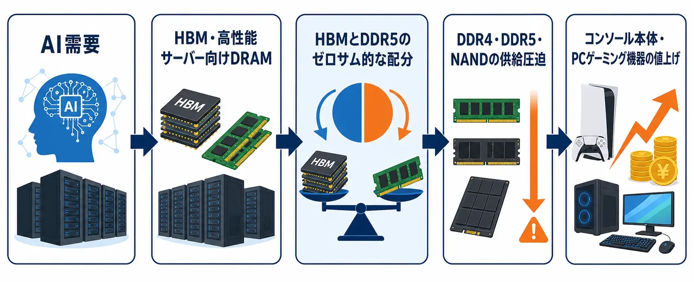
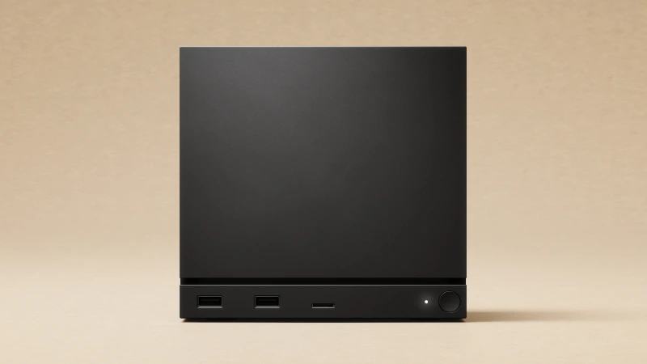
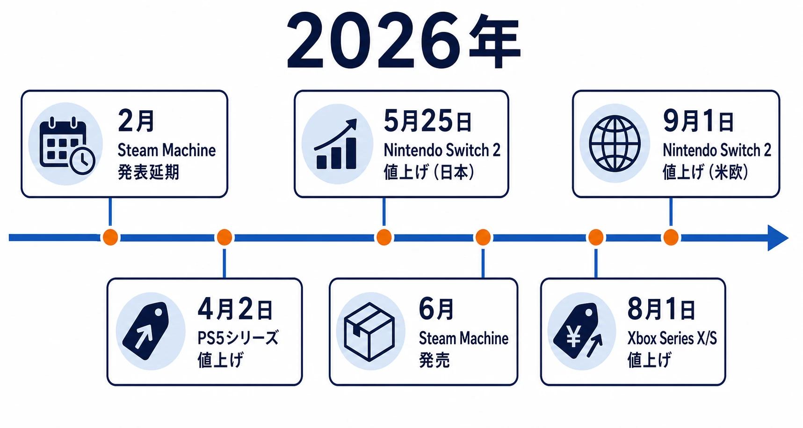
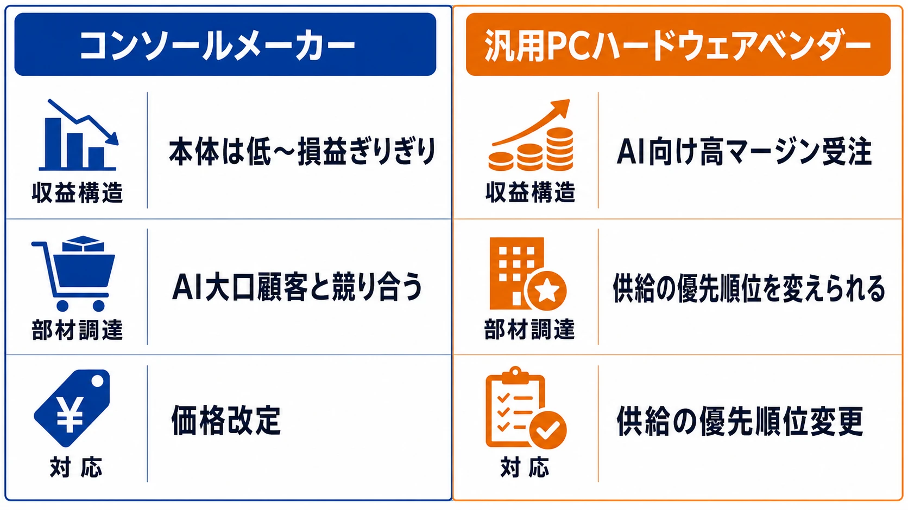
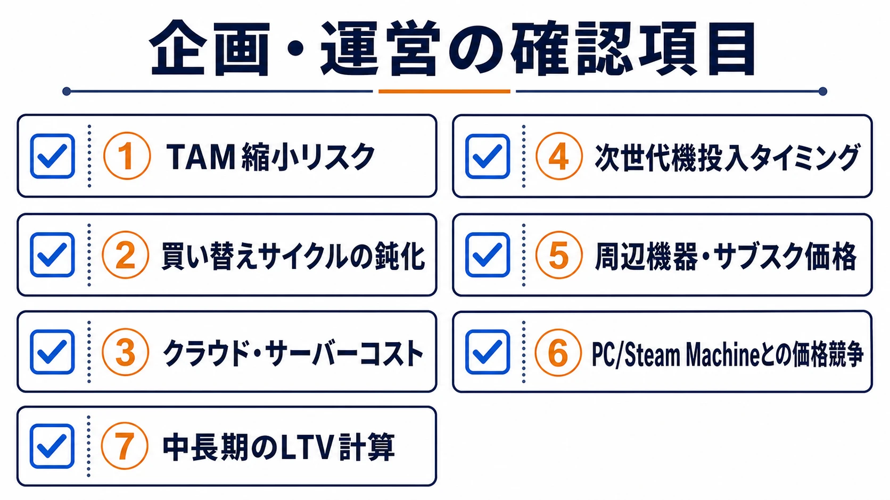

# AI需要による半導体価格高騰がコンソールゲーム業界に与える影響

## 概要

2025年後半から2026年にかけて、AIデータセンター投資の急拡大がDRAM・NAND・HBM(広帯域メモリ)の価格を歴史的なペースで押し上げ、コンソール本体からPCゲーミング機、クラウドサーバーコストまでゲーム業界全体に波及している。任天堂・ソニー・マイクロソフトは2026年に相次いで現行機の値上げを発表し、Valveの「Steam Machine」は発表時想定の約2倍近い価格で発売された。次世代機であるPS6や次期Xboxについても、発売時期を2028〜2029年まで後ろ倒しする可能性が報じられている。[[1](#ref-1)][[2](#ref-2)][[3](#ref-3)][[4](#ref-4)][[5](#ref-5)][[6](#ref-6)][[7](#ref-7)][[8](#ref-8)][[9](#ref-9)]

***

## DRAM・NAND・HBM価格高騰の構造的背景

まず、価格が上がっている3種類のメモリの役割を整理しておきたい。DRAMはゲーム機やPCが処理中のデータを一時的に置く「作業用のメモリ」、NAND Flashはゲーム本体やセーブデータを保持するSSDなどに使われる「保存用のメモリ」である。HBM（広帯域メモリ）は、AI向けGPUの近くに配置し、大量のデータを高速に受け渡すための高性能メモリを指す。用途は異なるが、いずれも限られた生産設備・材料・投資計画のなかで作られるため、AI向けHBMの急増はゲーム機向けDRAMやNANDの価格にも波及する。

現在の価格高騰がコロナ禍の物流混乱に起因した2020〜2022年の需給ひっ迫と異なるのは、一時的な輸送停滞ではなく、メーカーがAI向け製品へ生産能力を振り向ける構造的な変化が中心にある点だ。マイクロソフト、Google、Metaなどの大規模クラウド事業者（ハイパースケーラー）は2026年も大規模なデータセンター投資を継続しており、AIサーバー1台が消費する高性能メモリの量はコンシューマー向け機器とは桁違いに大きいとされる。[[9](#ref-9)]

価格上昇のペースを見ると、TrendForceの調査ではDRAM契約価格が2026年第1四半期に前四半期比90〜95%、NAND Flashが55〜60%上昇すると予測され、その後も第2四半期にDRAM 58〜63%・NANDが70〜75%、第3四半期にも13〜18%(DRAM)・10〜15%(NAND)の上昇が続く見通しだ。BBCが引用したCounterpoint Researchのデータでは、32GB DDR5部品は2025年9月までの3カ月間の94ドルから翌四半期に127ドル、2026年第1四半期には282ドル(122%上昇)まで跳ね上がった。[[10](#ref-10)][[11](#ref-11)][[12](#ref-12)][[9](#ref-9)]

構造的な要因の核心は「HBMとDDR5のゼロサム的な配分」にある。ここでいうゼロサムとは、短期間では工場の生産能力を急に増やせないため、HBMに割り当てる生産枠を増やすほど、DDR4・DDR5など別の製品に使える枠が減る関係を指す。厳密にすべての製造工程が共通という意味ではないが、限られた設備・材料・人員・投資をどの製品へ優先配分するかという局面では、一方の取り分の増加が他方の供給減少につながる。

しかも、HBM 1GBを生産するには、半導体チップの土台となる円盤状の基板（ウェーハ）上の生産容量を、標準的なDDR5の約3〜4倍消費するとされる。Samsung・SK hynix・Micronの「メモリ三強」が、利益率の高いHBMや高性能サーバー向け部材へ生産ラインを優先的に振り向ければ、コンシューマー向けDDR4・DDR5の供給はそれだけ圧迫されやすい。HBMは2026年分がすでに複数年契約で実質完売の状態にあり、SamsungとSK hynixはHBM3E供給価格を2026年に約20%引き上げた。Micron幹部もCES 2026で「メモリ需要はこれまでの供給能力を上回っており、2026年分は完全に売り切れている」と述べている。この構造は少なくとも2027年、場合によっては2028年まで続くと見込まれている。[[11](#ref-11)][[13](#ref-13)][[14](#ref-14)][[1](#ref-1)]

***

## Steam Machineの延期・値上げの経緯

Valveは2025年11月にSteam MachineとSteam Frameを発表し、「2026年前半」の発売を目指していた。当時、Steam Machineの価格は700ドル前後と想定され、600ドル台になるとの推測もあった。しかし2026年2月、Valveは価格と発売日の確定発表を延期した。理由は、メモリやストレージの価格が急上昇し、量産に必要な部品を予定どおり確保できるかも読みにくくなったためである。[[15](#ref-15)][[16](#ref-16)]

Valveが用いた「コンポーネントコストのボラティリティと供給不確実性」という表現を分解すると、問題が見えやすい。「コンポーネントコスト」はメモリやSSDなど本体を構成する部品の仕入れ価格、「ボラティリティ」はその価格が短期間に大きく上下することを指す。「供給不確実性」は、必要な数量を、必要な時期までに、想定した価格で調達できる保証がない状態である。つまりValveは、1台当たりの部材原価と量産開始時期の両方を固められず、販売価格と発売日を確定して公表しにくい状態に置かれていた。[[15](#ref-15)][[16](#ref-16)]

ゲームプランナーの立場で見ると、これは単なるハードウェア部門の調達問題ではない。本体価格が決まらなければ想定ユーザー数や普及速度を置きにくく、発売日が決まらなければローンチタイトル、販促、運営イベントの計画も固定しにくい。部材価格の変動は、ハードウェアの原価だけでなく、そのプラットフォーム向けに組む企画全体の前提を揺らす。

最終的にValveは2026年6月、512GBモデルを1,049ドル、2TBモデルを1,349ドルと発表し、6月30日に発売した。コントローラー付きは1,128〜1,428ドルで、当初想定を大きく上回る価格となった。Valve自身も、これは「2026年の製造業を取り巻く実情を反映したもの」であり、当初から1,000ドルを超える価格にする意図はなかったと説明している。[[17](#ref-17)][[18](#ref-18)][[19](#ref-19)][[8](#ref-8)]

主な構成は、Zen 4の6コアCPU、RDNA3世代のGPU（演算ユニット数を示す28CU）、処理中のデータを置く16GBのDDR5、映像処理用の8GB GDDR6 VRAM、保存領域となる512GBまたは2TBのNVMe SSDである。また、転売目的の注文集中を抑えるため、先着順ではなく抽選制の予約方式が導入された。[[20](#ref-20)][[21](#ref-21)]

*画像出典（引用）：Valve, [Steam Machine](https://store.steampowered.com/hardware/steammachine/)。Steam Machineの筐体デザインを示す資料として引用。WebP変換。*

***

## 現行機の価格改定状況

2026年に入り、主要3社すべてが現行世代機の値上げに踏み切った。以下は各社の主な改定内容である。

| メーカー・機種 | 改定内容 | 実施時期 | 主因 |
| --- | --- | --- | --- |
| PS5/PS5 Digital/PS5 Pro | 米国で最大150ドル上昇(PS5 Pro: 749.99→899.99ドル等)、日本・欧州・英国も同時実施(2度目の値上げ) | 2026年4月2日 | メモリ・世界経済情勢[[3](#ref-3)][[22](#ref-22)][[23](#ref-23)] |
| Nintendo Switch 2 | 日本49,980円→59,980円、米国449.99→499.99ドル、カナダ・欧州も上昇 | 日本5月25日、米欧9月1日 | メモリ価格・関税、通期で約1,000億円の影響見込み[[2](#ref-2)][[24](#ref-24)][[25](#ref-25)][[26](#ref-26)] |
| Xbox Series X/S | Series S 512GB 399.99→499.99ドル、Series X 1TBディスク版649.99→799.99ドルなど、2TBモデル廃止 | 2026年8月1日(1年強で3回目の値上げ) | ストレージ・メモリ価格が2.5倍超に上昇、2027年秋までに再倍増の見通し[[7](#ref-7)][[27](#ref-27)][[28](#ref-28)][[29](#ref-29)] |

任天堂は今回の値上げに加え、Switch 2本体の年間販売見通しを1,986万台から1,650万台に下方修正し、通期純利益予想も前年比27%減の3,100億円とするなど、業績への実害も明らかになっている。マイクロソフトは公式発表で「コンシューマー向け電子機器業界全体がこの部材危機に苦しんでいるが、コンソールへの影響は特に深刻だ」と表明しており、Nintendo Switch Onlineの利用料金も日本で7月1日から値上げされた。[[2](#ref-2)][[24](#ref-24)][[26](#ref-26)]

***

## PS6・次期Xbox:発売時期・価格への影響

Bloombergの報道によれば、ソニーは当初2027年後半とみられていたPS6の発売を2028年、場合によっては2029年まで延期する可能性を検討している。この延期は「PS5からPS6への丁寧に設計された移行戦略」に大きな影響を与えるとされ、ソニー・マイクロソフト双方が2027〜2028年を予定していた発売時期の見直しを議論していると報じられている。[[4](#ref-4)][[5](#ref-5)][[6](#ref-6)]

次世代機を巡る根本的な問題は、高性能GPU・大容量メモリを前提とするハードウェア設計そのものがAI需要とバッティングする点にある。NVIDIAやAMDのGPU価格上昇観測(RTX 5090が年内5,000ドルに達するとの憶測を含む)は、次世代機のGPUコスト構造にも直結しかねない。業界アナリストはコンソール価格が今後1〜2年でさらに10〜15%、PCは最大30%上昇する可能性を指摘しており、次世代機の投入判断はメモリ価格の正常化タイミングに大きく左右される状況だ。[[30](#ref-30)][[31](#ref-31)][[16](#ref-16)]

***

## コンソールメーカーとPCハードウェアベンダーの対応余地の差

コンソールビジネスは伝統的に「本体を低〜損益ぎりぎりの価格で販売し、ソフトウェア・サブスクリプションで回収する」モデルを取ってきたため、部材コストの急騰に対する価格の吸収余地が乏しい。Omdiaのアナリストは、2026年に「プラットフォームホルダーの1stパーティコンテンツ・周辺機器・サービス全般の価格再評価」が避けられないと指摘している。[[32](#ref-32)][[16](#ref-16)]

一方、NVIDIAやAMDなど汎用PCハードウェアベンダーは、AI向けデータセンター需要という高マージン・大口の受注先を確保しているため、コンシューマー向けゲーミング製品の供給を後回しにしつつ収益全体を維持できる立場にある。NVIDIAは「もはやゲーマー向けに主眼を置いていない」とされ、AI・エンタープライズ向け大口顧客はコスト吸収力があり高マージンの一括購入が可能なため、供給の優先順位が入れ替わっている。BBCの報道でも、AI投資に前のめりな米国大手4社(いわゆるハイパースケーラー)が2026年に数百億ドル規模のデータセンター投資を行う予定であることが、メモリメーカーに長期・大口契約を優先させる強い動機を与えていると分析されている。つまりコンソールメーカーは自社製品向けの部材を「他のAI大口顧客と直接競り合う」立場に置かれており、PC向けGPUベンダーのように高付加価値のAI向け製品ラインで収益を補うオプションを持たない。[[31](#ref-31)][[16](#ref-16)][[9](#ref-9)]

***

## 開発者側のサーバー・インフラコスト対応

メモリ価格高騰の影響はハードウェア調達だけでなく、開発・運営インフラのコストにも及んでいる。欧州最大級のホスティング事業者Hetznerは2026年2月、クラウドサーバー・専用サーバー・オブジェクトストレージの価格を25〜37%引き上げると発表し、4月から適用した。OVHcloudも同様にハードウェアコストが15〜35%上昇すると警告している。[[33](#ref-33)]

AWSもGameLiftを含むクラウドサービスについて、2026年中に大幅な価格改定を顧客に通知したと報じられており、ゲームスタジオのサーバーホスティングコストが跳ね上がる事態となっている。Omdiaのゲーム業界動向レポートも、「データセンター容量を巡る競争の激化」により、開発者のゲームサーバー費用がさらに増加すると明記している。この結果、マルチクラウド分散やコンテナ化によるコスト最適化サービスへの需要が高まっており、既存のクラウド一本足打法から複数プロバイダーへの分散を図る動きが加速している。[[32](#ref-32)]

***

## プランナーが企画・運営で見ておくべき論点

以下は、今回のメモリ危機を踏まえて企画・運営担当者が意識すべき実務的な論点である。

- **本体価格上昇によるTAM(市場規模)縮小リスク**：任天堂自身がSwitch 2の年間販売見通しを1,986万台から1,650万台へ下方修正したように、値上げは新規購入層の裾野を狭める可能性が高く、新作タイトルの初動販売計画やF2Pタイトルの新規インストール想定に反映すべきだ。[[24](#ref-24)][[26](#ref-26)]
- **既存機の長期化・買い替えサイクルの鈍化**：本体価格が上がるほど買い替えサイクルは伸び、旧世代機(PS5、Switch有機EL等)向けサポート期間の延長やクロスプラットフォーム設計の重要性が増す。
- **クラウド・サーバーコストのオペレーション予算への直撃**：AWSやHetznerなどのクラウドサービスの値上げは、ライブサービス運営中のタイトルの月次コスト構造を直接圧迫するため、マルチクラウド化やインフラの効率化(コンテナ化、オンデマンドスケーリング見直し)を運営計画に組み込む必要がある。[[33](#ref-33)]
- **次世代機投入タイミングの不確実性**：PS6・次期Xboxの発売が2028〜2029年へ後ろ倒しされる可能性がある以上、現行機向けの長期コンテンツロードマップを前提とした企画設計が現実的になる。[[5](#ref-5)][[6](#ref-6)][[4](#ref-4)]
- **周辺機器・アクセサリー価格への波及**：PlayStation PortalやSwitch Onlineサービス料金も既に値上げされており、周辺機器・サブスクリプション事業の収益モデルの再評価が必要だ。[[3](#ref-3)][[2](#ref-2)]
- **PC/Steam Machine型ハードウェアとの価格競争構造の変化**：Steam Machineが1,049ドルという高価格帯で登場したことで、コンソールとゲーミングPCの価格差が縮小しつつあり、プラットフォーム選定における企画上の前提(PC専用機能、クロスセーブ設計など)を見直す契機となる。[[9](#ref-9)][[17](#ref-17)]
- **原材料コスト上昇の中長期化を前提としたLTV計算**：メモリ市場の正常化は早くても2027年後半以降とみられるため、単発の値上げ対応ではなく、複数年にわたる原価上昇を前提にした収益モデル・マネタイズ設計の再構築が求められる。[[14](#ref-14)][[11](#ref-11)][[1](#ref-1)]

## References

1. [Global Memory Shortage Crisis: Market Analysis and the Potential Impact on the Smartphone and PC Markets in 2026][1] - AI需要によるDRAM価格高騰の全体像を分析。

2. [Notice Regarding Price Revisions for Nintendo Products and Services][2] - Switch 2・Switch・Switch Onlineの価格改定金額と実施日を公式発表。

3. [PS5 Price Increase Confirmed: Sony Raises Console Prices][3] - PS5価格改定の概要を報道。

4. [PS6 and next Xbox could be delayed due to memory crisis][4] - PS6・次期Xboxの発売延期観測を報道。

5. [The AI-Fueled Memory Crisis Might Delay The PS6 By Two Years][5] - PS6発売延期の観測を報道。

6. [Sony considering PlayStation 6 delay to 2029, while Nintendo could hike Switch 2 price][6] - PS6の2029年延期検討とメモリ・ストレージ価格高騰の影響を報道。

7. [Updated XBOX Console Prices][7] - Xbox公式によるコンソール価格改定発表。

8. [Valve Launches Steam Machine at $1049, Says Price Reflects Cost of Components][8] - Steam Machineの発売価格とValveの説明を報道。

9. [Why tech firms are raising PC and console prices][9] - 半導体部材価格高騰とハイパースケーラー投資の関係を分析。

10. [Memory price surge begins to cool as consumers hit affordability limit][10] - DRAM・NAND価格上昇の四半期推移を報道。

11. [DRAM prices expected to nearly double in Q1][11] - 2026年第1四半期のDRAM・NAND価格上昇率をTrendForce調査から報道。

12. [AI Server Demand to Drive Memory Contract Price Increases in 2Q26 as CSPs Secure Supply via Long-Term Agreements][12] - TrendForceによる2026年第2四半期のDRAM・NAND契約価格見通しの公式発表。

13. [AI memory is sold out, causing an unprecedented surge in computer prices][13] - Micron幹部発言などHBM需給ひっ迫の実情を報道。

14. [Memory Chip Shortage 2026: Sourcing DRAM & DDR4][14] - HBMとDDR5の生産能力配分構造を解説。

15. [Valve Delays Steam Frame and Steam Machine Pricing as Memory Costs Rise][15] - Steam Machineの価格・発売日確定発表延期を報道。

16. [How AI boom is pressuring video game consoles in race for memory chips][16] - AI需要とコンソール業界の部材競合を分析。

17. [The Steam Machine finally has a price and date: $1,049, June 25th][17] - Steam Machineの最終価格・構成・発売日を報道。

18. [Steam Machine: Release Date, Price, and Full Specs][18] - Steam Machineの価格・スペック詳細をまとめ。

19. [Valve's Steam Machine ships June 29 for $1,049][19] - Steam Machineの出荷日と供給制約を報道。

20. [Valve Confirms Steam Machine Launches June 30 at $1,049 to $1,349][20] - Steam Machineの発売日と抽選制予約方式を報道。

21. [Valve's Steam Machine Costs Between $1049 And $1428][21] - Steam Machineの価格帯とコントローラー付きオプションを報道。

22. [PS5 Prices Are Shooting Up In April 2026][22] - PS5シリーズの価格改定額と2度目の値上げという経緯を報道。

23. [Sony Announces Gigantic PS5 Price Increases, Effective from April 2026][23] - ソニー公式発表によるPS5価格改定を報道。

24. [Nintendo Switch 2 price hike, sales forecast cut][24] - Switch 2の値上げとメモリ・関税による通期業績への影響額を報道。

25. [Nintendo Switch 2 price increase: thank the AI data center boom][25] - Switch 2値上げの背景にあるAIデータセンター需要を報道。

26. [Nintendo hikes Switch 2 prices, expects console sales to fall][26] - Switch 2の値上げ額と販売台数見通し下方修正を報道。

27. [Here We Go Again: Microsoft Raises Xbox Prices Amid Memory Shortage][27] - Xbox価格改定とマイクロソフトの公式コメントを報道。

28. [Microsoft lifts price of Xbox consoles due to soaring component costs][28] - Xbox価格改定の詳細を報道。

29. [Xbox Series X/S Consoles Are Going Up in Price Again Thanks to a 2.5x Increase to Storage and Memory Prices][29] - Xbox Wire公式声明の直接引用を含む価格改定の詳細を報道。

30. [Leaks Predict $5000 RTX 5090 GPUs in 2026 Thanks to AI Industry Demand][30] - GPU価格高騰の観測をまとめ。

31. [4 Nvidia Graphics Card Trends That Should Worry Gamers][31] - NVIDIA GPU価格・供給動向の分析。

32. [How a surge in memory prices will affect the game industry][32] - Omdiaアナリストによるコンソールメーカーとハードウェアベンダーの対応余地の違いに関する分析。

33. [Cloud Hosting Prices Surging Up to 50% as AI Drains RAM Supply][33] - Hetzner・OVHcloud等のクラウドインフラ価格改定を報道。

[1]: https://www.idc.com/resource-center/blog/global-memory-shortage-crisis-market-analysis-and-the-potential-impact-on-the-smartphone-and-pc-markets-in-2026/
[2]: https://www.nintendo.co.jp/corporate/release/en/2026/260508.html
[3]: https://www.shanethegamer.com/esports-news/ps5-price-increase-2026/
[4]: https://metro.co.uk/2025/12/29/ps6-next-xbox-delayed-due-memory-crisis-25907802/
[5]: https://kotaku.com/ps6-delay-memory-price-ai-switch-2-2000669410
[6]: https://www.tomshardware.com/video-games/console-gaming/sony-considering-playstation-6-delay-to-2029-while-nintendo-could-hike-switch-2-price-according-to-report-memory-and-storage-chip-shortage-now-impacting-products-outside-of-ram-storage-and-gpus
[7]: https://news.xbox.com/en-us/2026/06/25/xbox-console-price-update/
[8]: https://www.gadgets360.com/games/news/steam-machine-launched-price-usd-1049-valve-cost-of-components-specifications-11674578
[9]: https://www.bbc.com/news/articles/cd95k584pzqo
[10]: https://www.tomshardware.com/pc-components/ram/memory-price-surge-begins-to-cool-as-consumers-hit-affordability-limit-ai-demand-still-keeps-dram-and-nand-prices-climbing-through-q3-2026
[11]: https://www.theregister.com/on-prem/2026/02/02/dram-prices-expected-to-nearly-double-in-q1/4179710
[12]: https://www.trendforce.com/presscenter/news/20260331-12995.html
[13]: https://www.cnbc.com/2026/01/10/micron-ai-memory-shortage-hbm-nvidia-samsung.html
[14]: https://globx.eu/blog/supply-chain-insight/memory-chip-shortage-2026
[15]: https://www.cnet.com/tech/gaming/valve-delays-steam-frame-and-steam-machine-pricing-as-memory-costs-rise/
[16]: https://www.straitstimes.com/business/companies-markets/how-ai-boom-is-pressuring-videogame-console-industry-in-race-for-memory-chips
[17]: https://www.pcworld.com/article/3172143/the-steam-machine-finally-has-a-price-and-date-1049-june-25th.html
[18]: https://allthings.how/steam-machine-release-date-price-and-full-specs/
[19]: https://arstechnica.com/gaming/2026/06/valves-steam-machine-ships-june-29-for-1049-but-you-probably-wont-be-able-to-buy-one-yet/
[20]: https://www.ghacks.net/2026/06/23/valve-confirms-steam-machine-launches-june-30-at-1049-to-1349-with-random-reservation-queue/
[21]: https://gameinformer.com/2026/06/22/valves-steam-machine-costs-between-1049-and-1428-the-option-to-sign-up-for-potential
[22]: https://www.slashgear.com/2133749/ps5-price-increase-april-2026-how-much-more-cost/
[23]: https://www.pushsquare.com/news/2026/03/sony-announces-gigantic-ps5-price-increases-effective-from-april-2026
[24]: https://qz.com/nintendo-switch-2-price-hike-memory-costs-profit-051126
[25]: https://www.fastcompany.com/91538975/nintendo-switch-2-price-increase-ai-data-center-boom-ram-memory-shortage
[26]: https://www.cnbc.com/2026/05/08/nintendo-switch-2-price-hike-sales-fall-memory-crunch.html
[27]: https://www.cnet.com/tech/gaming/microsoft-raises-xbox-prices-memory-shortage/
[28]: https://www.cnbc.com/2026/06/25/microsoft-lifts-price-of-xbox-consoles-due-to-soaring-component-costs.html
[29]: https://wccftech.com/xbox-series-x-s-price-hike-august-2026/
[30]: https://www.techpowerup.com/344578/leaks-predict-usd-5000-rtx-5090-gpus-in-2026-thanks-to-ai-industry-demand
[31]: https://www.bgr.com/2075107/nvidia-gpu-trends-worrying-2026/
[32]: https://www.gamedeveloper.com/business/how-a-surge-in-memory-prices-will-affect-the-games-industry
[33]: https://www.365i.co.uk/news/2026/02/27/cloud-hosting-prices-surging-ai-ram-shortage/

----

この文書は、Perplexity、Claude、OpenAI Codex の3つのAIの支援を受けて著述されたものです。引用画像を除き、MIT License にて提供されています。
