# アーケードゲーム／ゲームセンターの歴史大全：黎明期から現代まで

## はじめに

本稿は、アーケードゲームとゲームセンターの歩みを、黎明期から現代まで一本の通史としてたどるものである。エレメカ・ピンボールに始まり、『スペースインベーダー』が起こした社会現象、黄金時代の名作群、対戦格闘ブーム、音楽ゲームやネットワークサービスの登場、そして市場の縮小と再編まで、日本のゲームセンター文化を軸に、その前提となった海外の動向も交えて整理する。

単なる年代記にとどまらず、風営法による規制、JAMMA規格による筐体の共通化、インカム設計やロケーションテストといった運営ビジネスの実務にも踏み込んでいる。これらは、ゲームがどのような制約と論理のなかで設計・運営されてきたかを示すものであり、新人ゲームプランナーが「場のビジネス」としてのアーケードを理解する手がかりとなるはずだ。次章以降では時代ごとに節を分けて詳述するが、まずは全体像をつかむための年表を以下に示す。

***

## 年表

| 年 | できごと |
|---|---|
| 1931 | 松屋浅草屋上「スポーツランド」開設。日本初のアミューズメント施設とされる[[1](#ref-1)] |
| 1950年代後半 | 旅館・ホテル・ドライブインにゲームコーナー（エレメカ中心）が拡大[[1](#ref-1)] |
| 1966 | セガ「ペリスコープ」（エレメカ）リリース[[3](#ref-3)] |
| 1971 | 世界初のアーケードビデオゲーム「Computer Space」（米Syzygy/Nutting）発売。生産台数約1,500台[[3](#ref-3)][[4](#ref-4)] |
| 1972 | タイトー・セガがPongクローンを展開[[4](#ref-4)] |
| 1973 | タイトー「エレポン」・セガ「ポントロン」発売。日本の業務用ビデオゲーム勃興[[4](#ref-4)] |
| 1978 | タイトー「スペースインベーダー」稼働開始（6月16日発表、8月稼働）。社会現象化[[5](#ref-5)][[6](#ref-6)] |
| 1980 | ナムコ「パックマン」稼働。世界累計約40万台[[3](#ref-3)] |
| 1981 | 任天堂「ドンキーコング」稼働。大ヒットを記録し宮本茂デビュー作[[7](#ref-7)] |
| 1983 | 任天堂「ファミリーコンピュータ」発売 |
| 1984 | 風俗営業法改正（ゲームセンターを規制対象に追加）[[9](#ref-9)] |
| 1985 | 改正風営法施行（2/13）。セガ「ハングオン」「UFOキャッチャー」「スペースハリアー」稼働[[10](#ref-10)][[11](#ref-11)] |
| 1986 | JAMMA規格制定。業界共通ハーネス規格が誕生し、汎用筐体の基板入れ替えが容易に[[12](#ref-12)][[13](#ref-13)] |
| 1990 | SNK「MVS」「NEO・GEO」発売。花と緑の博覧会にナムコ「ギャラクシアン³」出展[[50](#ref-50)][[52](#ref-52)] |
| 1991 | カプコン「ストリートファイターII」稼働（3/7）。対戦格闘ブーム勃発[[14](#ref-14)][[15](#ref-15)] |
| 1992 | SNKほか各社が対戦格闘ゲームを続々投入。格ゲー黄金期へ[[16](#ref-16)] |
| 1993 | ゲームセンター店舗数が約8万7,000店でピーク[[17](#ref-17)][[18](#ref-18)] |
| 1997 | コナミ「beatmania」稼働。音楽ゲームジャンル誕生[[3](#ref-3)] |
| 1998 | コナミ「Dance Dance Revolution（DDR）」稼働[[3](#ref-3)] |
| 2002 | コナミ「e-AMUSEMENT」サービス開始。アーケードのネット接続が本格化[[19](#ref-19)] |
| 2010 | コナミがレベニューシェアモデル「e-AMUSEMENT Participation」を発表[[20](#ref-20)] |
| 2016 | 改正風営法施行。保護者同伴なら16歳未満でも22時まで入店可能に[[11](#ref-11)] |
| 2018 | コナミ・バンダイナムコ・セガの3社が「アミューズメントICカード」共通規格を開始[[21](#ref-21)][[22](#ref-22)] |
| 2020 | コロナ禍でゲームセンター店舗数が前年比18.1%減（約9,998店）[[23](#ref-23)] |
| 2021 | ゲームセンター市場規模が4,492億円に回復。プライズゲーム売上が3,062億円で過去最高水準[[24](#ref-24)] |
| 2023 | ゲームセンター倒産・廃業が2年連続増（計18件）。10年間で約8,000店が減少[[25](#ref-25)][[26](#ref-26)] |

***

## 第1章：エレメカ・ピンボールの黎明期（〜1970年代前半）

### コイン投入式娯楽の源流

日本でアミューズメント施設の先駆けとなったのは、1931（昭和6）年に松屋浅草の屋上に開設された「スポーツランド」とされている。バッテリーカーや木馬などを備えたこの施設が、後のゲームセンターへとつながる起点だ。一方、海外では同時期の1931〜1933年に、David Gottlieb・Harry Williamsがピンボールを電気化し、アミューズメント機器としての基盤を整えた。[[2](#ref-2)][[1](#ref-1)]

戦後の復興期、日本では米軍施設でピンボールやガンゲームが使われていた。その後、1950年代後半から全国の旅館・ホテル・ドライブインにゲームコーナー（エレメカ＝電気機械仕掛けのアナログゲーム）が広がり、独立したゲームセンターという業態が芽生えてくる。[[27](#ref-27)][[1](#ref-1)]

**エレメカ（Electro-Mechanical Games）** とは、コンピュータを使わない機械仕掛けのアーケードゲーム総称だ。1966年にセガが出した潜水艦ゲーム「ペリスコープ」が好例で、この時代のアーケードは「音と光と動き」によって非日常体験を売る装置だった。[[3](#ref-3)]

### ピンボールの全盛と社会的摩擦

ピンボールは1933年の電気化以降、欧米を中心に爆発的に普及した。しかし多くの地域でギャンブル的として禁止・規制を受けた経緯を持つ。日本でも1970年代まではピンボールが娯楽施設の定番機種であり続け、その後ビデオゲームへの移行が進むと、多くのメーカーがビデオゲーム製造へ転換を余儀なくされた。[[28](#ref-28)][[29](#ref-29)]

***

## 第2章：ビデオゲームの誕生と海外の黎明（1971〜1977年）

### Computer Space から Pong へ

世界初のアーケードビデオゲームは、1971年11月に Syzygy（後のAtari創業者ノーラン・ブッシュネルとテッド・ダブニー）が Nutting Associates と組んで発売した「**Computer Space**」だ。生産台数は約1,500台と限定的で商業的成功とは言えなかったが、それは筐体・マーキー・コントロールパネル・モニター・コインメカという「アーケードゲーム筐体の設計図」を世界で初めて確立した点で、後世への影響は計り知れない。[[3](#ref-3)][[4](#ref-4)][[30](#ref-30)]

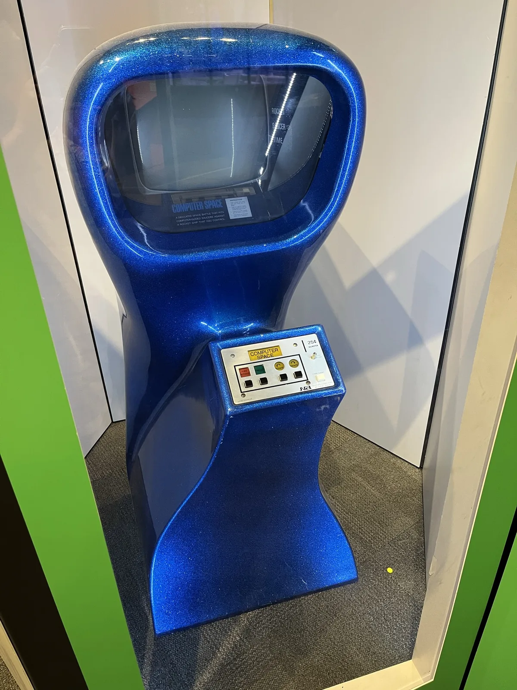
*世界初の業務用ビデオゲーム「Computer Space」（1971年）。湾曲した一体成形筐体は、後のアーケード筐体とは異なる強烈な存在感を放つ。*
*画像出典（引用）：Mbrickn, [Computer Space cabinet.jpg](https://commons.wikimedia.org/wiki/File:Computer_Space_cabinet.jpg), Wikimedia Commons, [CC0 1.0](https://creativecommons.org/publicdomain/zero/1.0/) / WebP変換。*

翌1972年、ブッシュネルとダブニーはNuttingを離れAtariを創業し、卓球をシミュレートした「**Pong**」を発売した。シンプルな操作と競争性が受け、商業的に大成功した最初のビデオゲームとなる。Pongの成功が、ビデオゲームという新業態に多くの参入者を呼び込んだ。[[29](#ref-29)][[4](#ref-4)]

ブッシュネルはここで一つの設計哲学を確立した。後に「**Bushnell's Law**」と呼ばれる「**Easy to learn, difficult to master（すぐ遊べる、でも極めにくい）**」だ。この原則は今日のゲームデザイン理論にも生きている。[[30](#ref-30)]

### 日本への輸入と国産化

日本では1973年、タイトー（当時：太東貿易）が「エレポン」、セガが「ポントロン」という Pong クローンを発売し、業務用ビデオゲーム市場に参入した。当時はゲーム機をコインランドリーや映画館のロビー、駄菓子屋の片隅に置く形態が主流で、現在のようなゲームセンター専業店はまだ少なかった。[[4](#ref-4)]

***

## 第3章：インベーダーブームと喫茶店文化（1978〜1979年）

### 社会現象となった「スペースインベーダー」

1978年6月16日、タイトーが発表し同年8月から稼働を開始した「**スペースインベーダー**」は、日本のアーケード史上最大のヒット作となった。タイトー純正品・許諾品に加え、無許諾コピー品が大量に出回り、ブームの1年半足らずで計30万〜50万台規模が全国に行き渡ったと推計されている。[[5](#ref-5)][[6](#ref-6)]

注目すべきは普及チャネルだ。全国の喫茶店がこのゲームを競うように導入し、本業の飲食売上をゲームが上回る店舗が続出した。また、人気ゆえに「**100円玉不足**」が発生したとも伝えられる。この「**インベーダーハウス**」現象（喫茶店がゲームコーナー化した状態）が、のちの独立型ゲームセンターの急拡大につながった。[[31](#ref-31)]

ナムコ開発陣の遠藤勝利氏によれば、テーブルゲームの普及を背景に、ピーク時に約16万5,000店あった喫茶店のうち約3万5,000店にゲームが導入されたという。[[32](#ref-32)]

### テーブル型筐体の誕生

インベーダーブームが生み出した最大の発明の一つが「**テーブル型筐体**」だ。従来の縦置きアップライト筐体と異なり、飲食しながら座ってプレイできるテーブル型は、喫茶店の客席に自然に馴染んだ。この形態が、ゲームを「スタンドで遊ぶもの」から「腰を落ち着けてじっくり遊ぶもの」へと変えた。

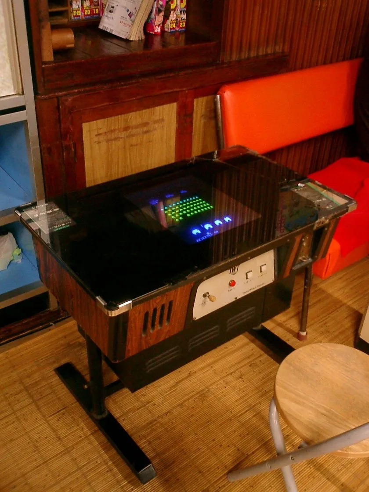
*喫茶店などに普及したテーブル型筐体。座って飲食しながら遊べる形態が、ゲームを「腰を据えて遊ぶもの」へと変えた。*
*画像出典（引用）：Tomomarusan, [Space Invaders.JPG](https://commons.wikimedia.org/wiki/File:Space_Invaders.JPG), Wikimedia Commons, [CC BY 2.5](https://creativecommons.org/licenses/by/2.5/) / WebP変換。*

***

## 第4章：黄金期 ── パックマン・ドンキーコングと帝国の繁栄（1980〜1982年）

### 黄金期を彩ったタイトル群

1978〜1983年ごろはアーケードゲームの「黄金時代」と呼ばれる。この時期のキープレイヤーを以下に示す。[[29](#ref-29)][[3](#ref-3)]

| タイトル | 年 | 開発元 | 意義 |
|---|---|---|---|
| パックマン | 1980 | ナムコ | 世界累計約40万台。女性・子供層を開拓した[[3](#ref-3)] |
| ドンキーコング | 1981 | 任天堂 | 大ヒットを記録。マリオ初登場・宮本茂デビュー[[7](#ref-7)] |
| Asteroids | 1979 | Atari | 『スペースウォー!』の系譜を継ぐベクター宇宙シューティング。大ヒット |
| ギャラガ | 1981 | ナムコ | ギャラクシアンの続編。高い戦略性で人気 |
| フロッガー | 1981 | コナミ | コナミのアーケード参入を知らしめた作品 |

米国のアーケードゲーム市場は1981〜1982年にピークを迎え、コイン投入額換算で推定年間約80億ドル規模に達した。パックマンは日本発でありながら西洋文化にも完全に浸透し、ゲームが初めてグローバルなポップカルチャーになった瞬間だった。[[3](#ref-3)]

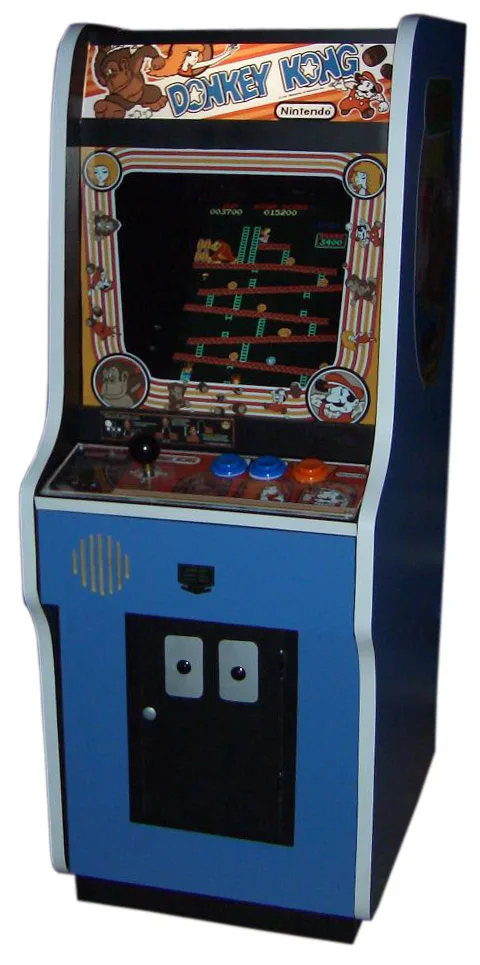
*黄金期を代表する『ドンキーコング』（1981年・任天堂）のアーケード筐体。*
*画像出典（引用）：Joshua Driggs（写真）、Bayo（背景除去）, [Donkey Kong arcade.jpg](https://commons.wikimedia.org/wiki/File:Donkey_Kong_arcade.jpg), Wikimedia Commons, [CC BY-SA 2.0](https://creativecommons.org/licenses/by-sa/2.0/) / WebP変換。*

### デザイン的観点：なぜ黄金期タイトルは今でも面白いか

黄金期のタイトルはいずれも「Bushnell's Law」を体現していた。パックマンは4方向レバーという単純操作で、敵の動きパターンを覚えることで無限に深みが増す。ドンキーコングはジャンプという単一アクションで複数の障害物を乗り越える「プラットフォームゲーム」ジャンルを確立し、ステージクリア型の物語性を初めて強く打ち出した。ゲームプランナーにとっては「シンプルな入力、複雑な出力」という設計原則の原点として学ぶ価値が高い。[[33](#ref-33)]

***

## 第5章：アタリショックと日本独自発展（1983〜1984年）

### 北米市場の崩壊

1982年のクリスマス商戦を発端に、北米家庭用ゲーム市場は急速に収縮し始めた。原因はサードパーティのライセンス管理不在による低品質ゲームの氾濫だ。1982年に約32億ドルあった米国家庭用ゲーム市場は、その後数年で1億ドル規模（1985年）にまで激減した。これが「**アタリショック（Video Game Crash of 1983）**」だ。[[34](#ref-34)][[8](#ref-8)]

しかし重要なのは、この崩壊が **北米の家庭用市場** に限定されたことだ。アーケード市場はさほど直撃を受けず、日本では全く異なる動きが起きた。[[1](#ref-1)]

粗製濫造だけでは説明できない崩壊の構造や、その教訓が任天堂のライセンス管理、さらにPlayStation時代の流通改革へどうつながったかは、関連記事「[アタリショックからプレイステーション流通革命まで：ゲーム市場構造の変遷](atari-shock-market-structure-history.md)」で詳しく整理している。

### 日本の独自発展：ファミコンとゲーセンの分業

任天堂は1981年以降、山内溥社長の「家庭でアーケードゲームを遊べる機械を」という指示のもと、上村雅之率いる開発第二部が独自に家庭用ゲーム機「**ファミリーコンピュータ（ファミコン）**」を開発し、1983年7月に発売した。海外展開では、ファミコン／NESの販売を委託するアタリとの提携交渉が1983年に破談となったが、北米へはのちにNESとして自力で参入した。任天堂はアタリショックの教訓を活かし、サードパーティへの厳格なライセンス管理と発売本数の制限によって品質を担保した。[[35](#ref-35)][[8](#ref-8)]

ここで日本市場は独特の二層構造を形成した。 **家庭用ゲーム＝ファミコン（任天堂主導）、アーケード＝ゲームセンター（タイトー・ナムコ・セガ・カプコンなど）** という棲み分けだ。ファミコンが家庭に普及するほど、アーケードは「家庭では体験できない最先端技術の体験場所」というポジションを強める必要に迫られた。これが1985年以降の体感筐体ブームや大型筐体化の遠因となる。

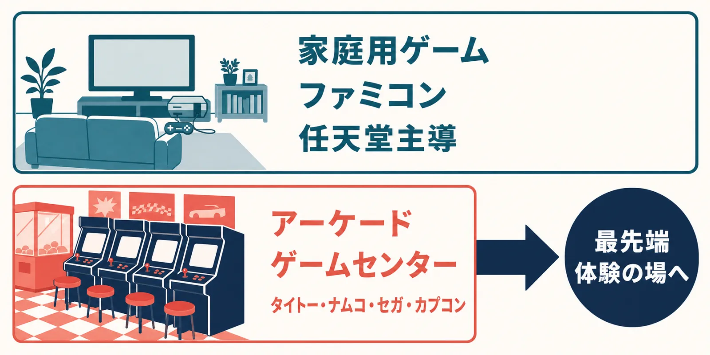
*アタリショックを境に確立した日本市場の二層構造。家庭用とアーケードの棲み分けが、後の体感筐体ブームを生んだ。*

***

## 第6章：体感筐体と多様化の時代（1985〜1990年）

### 風営法規制とゲームセンターの正常化

1984年、ゲームセンターが初めて風俗営業法の規制対象（当時は8号営業、2016年の改正で5号営業に再編）として追加され、1985年2月13日に施行された。これにより夜間の年少者立ち入り禁止、深夜営業禁止、営業地域制限などが適用された。一時的に売上は落ちたが、逆に「悪の巣窟」イメージを払拭する契機にもなり、業界は品質向上に舵を切った。[[11](#ref-11)][[9](#ref-9)][[1](#ref-1)]

### セガが切り開いた体感ゲームの世界

同じ1985年、セガは「**ハングオン**」「**スペースハリアー**」を投入し、「体感ゲーム」という新カテゴリを創出した。ハングオンは全身でバイクを傾けて操作する筐体、スペースハリアーは座席ごと傾く「ムービングシート型」筐体だ。1986年の「アウトラン」、1987年の「アフターバーナー」と続き、これらは家庭用では絶対に再現できない「筐体ごとの体験」というアーケード固有の価値を確立した。[[36](#ref-36)][[10](#ref-10)][[37](#ref-37)]

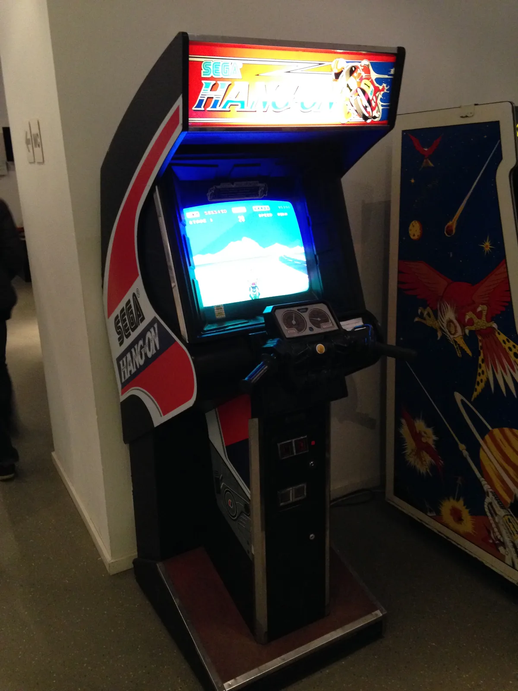
*専用ハンドルを備えた『ハングオン』（1985年・セガ）のアップライト筐体。専用操作部を持つ体感ゲームは、アーケード固有の価値を確立した。*
*画像出典（引用）：joho345, [Sega Hang on Arcade Automat.jpg](https://commons.wikimedia.org/wiki/File:Sega_Hang_on_Arcade_Automat.jpg), Wikimedia Commons, [CC BY-SA 3.0](https://creativecommons.org/licenses/by-sa/3.0/) / WebP変換・向き補正。*

### JAMMA規格（1986年）：基板と筐体の標準化

1986年に制定された「**JAMMA（Japan Amusement Machine and Marketing Association）規格**」は、アーケード業界に革命をもたらした。それまでメーカーごとにバラバラだった基板と筐体の接続コネクタを共通化したことで、 **同一筐体に異なる基板を差し替えるだけで別ゲームとして稼働できる** ようになった。オペレーターにとってはコスト削減、メーカーにとっては普及加速という双方のメリットがあった。[[12](#ref-12)][[13](#ref-13)]

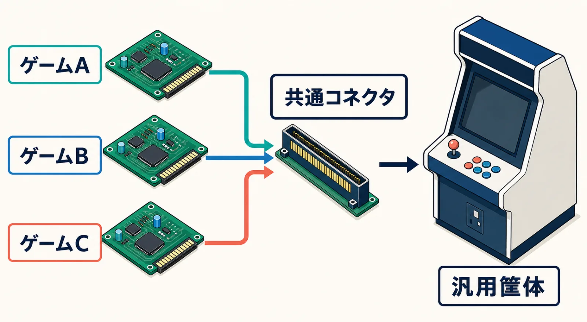
*JAMMA規格（1986年）による標準化。共通ハーネスにより、1つの汎用筐体で基板を差し替えるだけで別ゲームを稼働できるようになった。*

その後、1997年にはシリアル通信を利用した「**JVS（JAMMA Video Standard）**」規格が登場し、入出力の高度化・デジタル化が進んだ。[[38](#ref-38)]

### UFOキャッチャーとプライズゲームの台頭

1985年、セガが「**UFOキャッチャー**」を発売した。当初の仮称は「イーグルキャッチャー」だったが、完成した筐体の形がUFOに見えたため改名されたという。景品にぬいぐるみを採用したことでブームに火がつき、1990年代にかけてプライズゲームはゲームセンターの重要な収益源となった。[[39](#ref-39)][[40](#ref-40)][[10](#ref-10)]

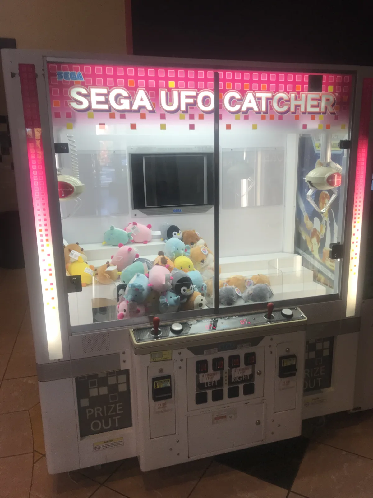
*ぬいぐるみ景品でブームを起こした「UFOキャッチャー」シリーズの筐体。*
*画像出典（引用）：Red Phoenix, [Sega UFO Catcher.png](https://commons.wikimedia.org/wiki/File:Sega_UFO_Catcher.png), Wikimedia Commons, [CC BY-SA 4.0](https://creativecommons.org/licenses/by-sa/4.0/) / WebP変換。*

### コラム：ギャラクシアン³ ── ゲーム機が「建築」になった日

1980年代後半、アーケードゲームは家庭用ゲーム機との性能差だけでなく、筐体そのものを使った体験へ活路を広げていた。セガが可動筐体で身体感覚を揺さぶった一方、ナムコは1988年の「ウイニングラン」などでリアルタイム3DCG技術を育て、画面・音響・座席・空間を一体化した遊びを構想する。その到達点が、1990年の国際花と緑の博覧会に「ハイパーエンターテインメント構想」の大型遊園施設として出展された「**ギャラクシアン³**」だった。[[52](#ref-52)]

花博版は、最大28人が宇宙船ドラグーンの砲手として同時参加する巨大なシューティング・アトラクションである。円形に並んだプレイヤーを16台の120インチプロジェクターによる全周映像が取り囲み、映像に合わせて油圧式の床が動く。1人ずつ別のゲームをするのではなく、全員が同じ船の耐久力と作戦成否を共有する設計だった。対戦格闘ゲームが見知らぬ相手との競争を生んだのに対し、こちらはその場に集まった28人を即席の「乗組員」に変えたのである。[[53](#ref-53)]

体験は着席して照準を動かす時間だけでは完結しない。暗号解読、緊急通信、エアロックの開閉といった乗船前後の演出まで連続させ、待機列から退出までを一つの宇宙任務として構成していた。今日でいうイマーシブシアターやロケーション型VRに近い発想だが、ヘッドマウントディスプレイの代わりに、部屋全体を巨大な表示装置として作り込んだ点が1990年らしい。[[54](#ref-54)]

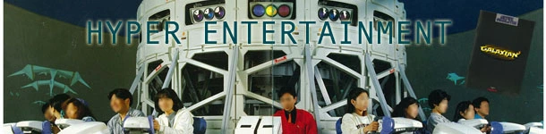
*花と緑の博覧会に設置された『ギャラクシアン³』。筐体というより、一つの建築物に近い規模だった。*
*画像出典（引用）：DragonsLairFans, [Galaxian3 Osaka](https://www.dragonslairfans.com/smfor/index.php?topic=399.30), DragonsLairFans / WebP変換。*

花博閉幕後、28人版は東京・二子玉川へ移され、1992年に開園した都市型テーマパーク「ナムコ・ワンダーエッグ」の中核アトラクションになった。博覧会の一回限りの展示で終わらせず、日常圏に近い都市型施設で継続運営したことは、ゲームメーカーがソフトや筐体の販売だけでなく、空間全体の企画・運営へ進出したことを示している。ワンダーエッグでは2000年まで稼働し、繰り返し攻略するファンを生んだ。[[52](#ref-52)][[53](#ref-53)][[57](#ref-57)]

さらにナムコは、同じ発想を28人版から16人版、そしてゲームセンター向けの6人版「**シアター6**」へ縮小していった。シアター6は「小型版」とはいえ約5メートル四方、高さ約2.5メートルの小型映画館に近い専用筐体で、大型ゲームを導入できる各地のアミューズメント施設へ展開された。1996年開業の大型店「ナムコランド野田店」でも、目玉となる大型ゲームの一つに挙げられている。[[55](#ref-55)][[56](#ref-56)]

ギャラクシアン³の意義は、巨大さそのものより、ゲームの単位を「1台の機械」から「人が入り、物語を共有する場所」へ拡張したことにある。家庭へアーケード品質を持ち込もうとしたNEO・GEOとは正反対に、家庭へは持ち帰れないことを価値へ変えた。超巨大型筐体は多数派にはならなかったが、アーケードが映像ソフトであると同時に、現実空間を設計するメディアでもあることを鮮烈に示したのである。

***

## 第7章：対戦格闘ブームとゲーセン文化の絶頂（1991〜1995年）

### ストリートファイターII がもたらした革命

1991年3月7日、カプコンの「**ストリートファイターII -The World Warrior-**」がアーケードで稼働を開始した。稼働当初は口コミで徐々に広がり、やがて社会現象化した。この作品が生み出したのは単なるゲームジャンルではなく、 **ゲームセンターという空間の社会的再定義** だ。[[14](#ref-14)][[41](#ref-41)]

対戦台（2人が向かい合う筐体設計）の普及で、ゲーセンは「知らない同士が技を競う公共の闘技場」となった。周囲に観客が集まり、勝者が台をキープする「座り待ち」文化、コインを並べる「並びルール」といったローカルな作法が生まれた。[[42](#ref-42)][[43](#ref-43)]

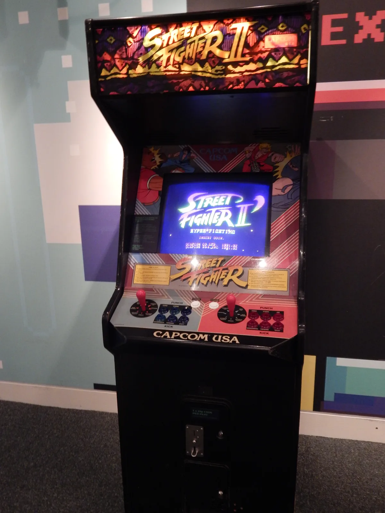
*対戦格闘ブームの起点となった『Street Fighter II』（1991年）のアーケード筐体。*
*画像出典（引用）：John Turner, [Street Fighter II arcade machine.jpg](https://commons.wikimedia.org/wiki/File:Street_Fighter_II_arcade_machine.jpg), Wikimedia Commons, [CC BY 2.0](https://creativecommons.org/licenses/by/2.0/) / WebP変換。*

その後SNK「サムライスピリッツ」(1993)、セガ「バーチャファイター」(1993)など対戦格闘タイトルが続々登場し、格ゲーブームは1992〜93年にかけてゲームセンターの空前のムーブメントへと膨れ上がった。[[16](#ref-16)][[41](#ref-41)]

### ゲームセンター店舗数のピーク（1993年）

この時期の熱狂を示すのが1993年の店舗数データだ。 **全国のゲームセンター等が約8万7,294店** に達し、後にも先にもこれが最大数となった。インベーダーブームが「喫茶店への進出」なら、格ゲーブームは「ゲームセンターという場所そのものへの人々の集中」だった。[[17](#ref-17)]

***

### コラム：NEO・GEO／MVS ── ゲーセンと家庭を一つの市場にする

1990年当時、アーケード版と家庭用移植版の間には大きな性能差があった。色数、音、キャラクターの大きさや動きが削られるのは珍しくなく、「ゲームセンターの興奮を家でそのまま再現する」ことは、業務用基板を個人で購入するような愛好家にしか難しかった。SNKがアルファ電子（後のADK）と開発した「**NEO・GEO**」は、この隔たりを移植技術で埋めるのではなく、業務用と家庭用を同じ設計思想のプラットフォームにすることで解消しようとした。[[50](#ref-50)]

業務用の「**MVS（Multi Video System）**」がまず解いたのは、店舗側の経営課題である。JAMMA規格によって基板交換は容易になっていたものの、新作を入れるたびに基板を購入し、1台の筐体を1作品に割り当てる負担は残っていた。MVSはゲームをROMカートリッジ化し、1台に最大6本を装着して、客が遊びたい作品を選べるようにした。SNKの公式回顧によれば、当時20万円前後だった一般的な基板に対し、MVS用ROMは1本数万円。省スペース性に加えてリースと保守体制も用意され、導入リスクを下げた。[[50](#ref-50)]

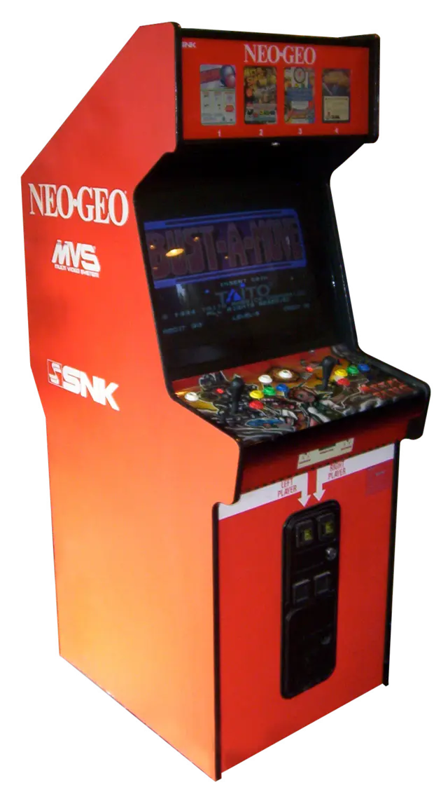
*複数のROMカートリッジを収容し、1台で複数タイトルを提供できたNEO・GEO MVS筐体。*
*画像出典（引用）：EmuGlx, [SNK Neo Geo](https://www.emuglx.org/opisi-sistema/snk-neo-geo/), EmuGlx / WebP変換。*

この仕組みは、大型ゲームセンターだけを相手にしていなかった。本屋、玩具店、駄菓子屋、スーパーマーケットなど、数台しか置けない「小さなゲームコーナー」にもMVSが入り込み、全国で約1万2,000台が導入された。限られた床面積で複数の新作を試せるため、オペレーターは売上の弱いROMだけを交換でき、プレイヤーは繁華街の大型店へ行かなくても新作に触れられた。MVSは基板規格であると同時に、アーケードの商圏を細かなロケーションへ広げる流通システムだったのである。[[50](#ref-50)][[51](#ref-51)]

家庭用のNEO・GEO、通称「**AES（Advanced Entertainment System）**」は、MVSとほぼ同じハード構成とゲーム内容を採用した。MVS用とAES用のカートリッジは形状が異なり、そのまま差し替えられるわけではないが、家庭用向けに内容を縮小する従来型の移植とは一線を画した。さらにメモリーカードを使い、対応作品の進行データを家庭とゲームセンターの間で持ち運べた。現在のクロスセーブや共通アカウントに通じる「場所をまたぐ遊び」を、ネットワーク普及前に実現しようとしたのである。[[50](#ref-50)][[51](#ref-51)]

もっとも、業務用相当の性能は価格にも跳ね返った。AESは当初、レンタルビデオ店などを通じた貸し出しから始まり、一般販売は1991年から。家庭用ゲーム機として大衆的な普及を果たしたとは言い難いが、「凄いゲームを連れて帰ろう」という約束を妥協なく実現した高級機として、熱心な支持者を獲得した。手の届きにくささえ、のちにはNEO・GEOを特別な存在として記憶させる一因になった。[[50](#ref-50)]

そして対戦格闘ブームが、MVSの仕組みを完成させた。「餓狼伝説」「龍虎の拳」「サムライスピリッツ」「THE KING OF FIGHTERS」と新作が続いても、店舗は筐体ごと買い替えずROMを追加・交換できる。SNKは大容量ROMと2D表現を磨き続け、のちには「メタルスラッグ」も生み出した。これらのシリーズは海外でも支持され、NEO・GEO／MVSはSNK作品を長期にわたって世界へ届ける共通の器になった。[[50](#ref-50)][[51](#ref-51)]

NEO・GEOの革新性は、単に「アーケードと同じ画面が家庭で出る」ことだけではない。店舗には低コストで更新できる商品棚を、プレイヤーには場所を越えて続く体験を、メーカーには同じソフト資産を業務用・家庭用・海外市場へ展開できる基盤を与えた点にある。家庭用AESが大ブームにならなくても、MVSを中心とした生態系は長く残った。ハードの販売台数だけでは測れない、プラットフォーム設計の成功例である。

***

## 第8章：音ゲー・メダル・プライズへの多様化（1997〜2005年）

### 音楽ゲームという新ジャンルの誕生

家庭用ゲーム機（PlayStation、セガサターン）が3Dポリゴン性能でアーケードに迫り、格ゲーブームも沈静化し始めた1990年代後半、コナミが新しい波を起こした。1997年の「**beatmania**」と1998年の「**Dance Dance Revolution（DDR）**」だ。[[3](#ref-3)]

DDRは床に設置されたダンスパッドを足で踏む体感型の操作を採用し、「見て楽しい、やって楽しい」ゲームとして、格ゲーとは異なる新しい客層（特に女性）をゲームセンターに呼び込んだ。これ以降コナミはBEMANIブランドとして多数の音楽ゲームを展開し、ギタードラム・パーカッション・歌など多様なインターフェイスを持つジャンルへと育てた。[[3](#ref-3)]

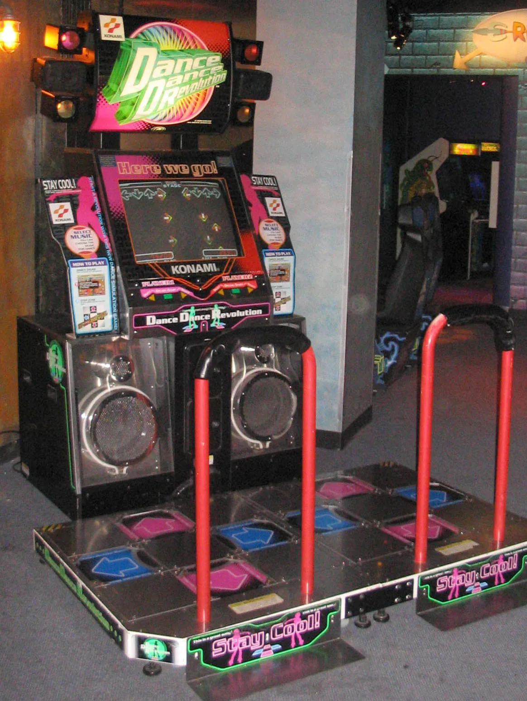
*足でダンスパッドを踏む『Dance Dance Revolution』の筐体。体感型の操作が、新たな客層をゲームセンターに呼び込んだ。*
*画像出典（引用）：SPUI（写真）、Poiuyt Man（編集）, [Dance Dance Revolution North American arcade machine 3.jpg](https://commons.wikimedia.org/wiki/File:Dance_Dance_Revolution_North_American_arcade_machine_3.jpg), Wikimedia Commons, Public Domain / WebP変換。*

### メダルゲームの確立

メダルゲームは1970年代にその起源があるが、1990〜2000年代に独立した巨大ジャンルとして確立した。実際の現金ではなくゲーム専用メダルを使うことで法的にギャンブルと区別され、パチンコホールに近い「長時間の興奮と射幸性」をゲームセンターに持ち込んだ。ホールドコイン方式や配当設定など、オペレーターによる細かい調整が収益性を左右するため、運営ノウハウが重要なジャンルでもある。[[1](#ref-1)][[4](#ref-4)]

***

## 第9章：ネットワーク化とICカード（2000年代〜2010年代）

### e-AMUSEMENT：アーケードのオンライン化

2002年、コナミが「**e-AMUSEMENT**」サービスを開始した。専用カードにプレイデータを記録し、全国どのゲームセンターでも同じデータを引き継いで遊べるようになった。全国ランキング参加、ネット通信対戦、楽曲・キャラクターの開放といった「オンラインゲームの体験をゲーセンに持ち込む」仕組みだ。[[44](#ref-44)][[19](#ref-19)]

この流れはセガ・バンダイナムコも追い、それぞれ「Aime」「Bana Passport（バナパスポート）」「NESiCA」といった独自ICカードを展開した。各社が独自カードを持ち、プレイヤーはゲームごとに複数のカードを使い分ける不便さがあったが、2018年10月に3社が「**アミューズメントICカード**」共通規格を正式スタートさせ、1枚のカードで複数社のゲームに対応できるようになった。[[21](#ref-21)][[22](#ref-22)]

### レベニューシェアモデルへの転換

2010年、コナミは「**e-AMUSEMENT Participation（パーティシペーション）**」という新ビジネスモデルを発表した。従来の「基板買い切り→インカムで回収」モデルから、プレイヤーの投入金額をメーカーとオペレーターで分配する **レベニューシェア型** へのシフトだ。例えばプレイヤーが投入した100円のうち70円がオペレーターに、30円がメーカーに入る仕組みで、オペレーターの初期投資リスクを軽減しつつ、メーカーが継続的なサービス収益を得られる構造となった。[[20](#ref-20)]

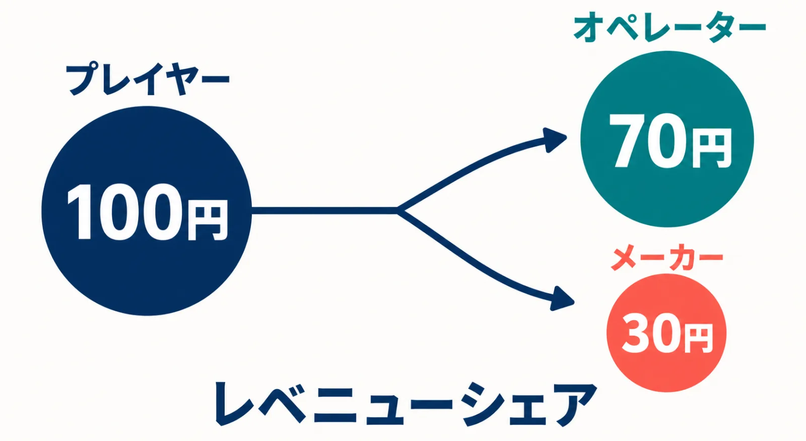
*e-AMUSEMENT Participation（2010年）が導入したレベニューシェア型。投入額をオペレーターとメーカーで分配する（比率は一例）。*

***

## 第10章：運営ビジネスの実務 ── オペレーター・インカム・ロケテ

ゲームプランナーが知っておくべきアーケードゲームの「裏側」をまとめる。

### 用語解説

| 用語 | 意味 |
|---|---|
| **オペレーター** | ゲームセンターを経営する事業者。メーカーからゲーム機を購入またはリースして稼働させる[[45](#ref-45)] |
| **インカム** | ゲーム機に投入されるコイン収益のこと。「インカムが良い」＝コインが多く投入される人気ゲームを指す[[46](#ref-46)] |
| **ロケーションテスト（ロケテ）** | 発売前のゲームを実際のゲームセンターに試験設置し、難易度調整と1プレイあたりの稼働時間データを取得すること[[46](#ref-46)] |
| **基板（PCB）** | ゲームのプログラムや回路が搭載されたプリント基板。JAMMA規格以降は汎用筐体に差し替えて運用[[47](#ref-47)] |
| **レベニューシェア** | プレイヤーの投入金額をメーカーとオペレーターで分配するビジネスモデル[[20](#ref-20)] |

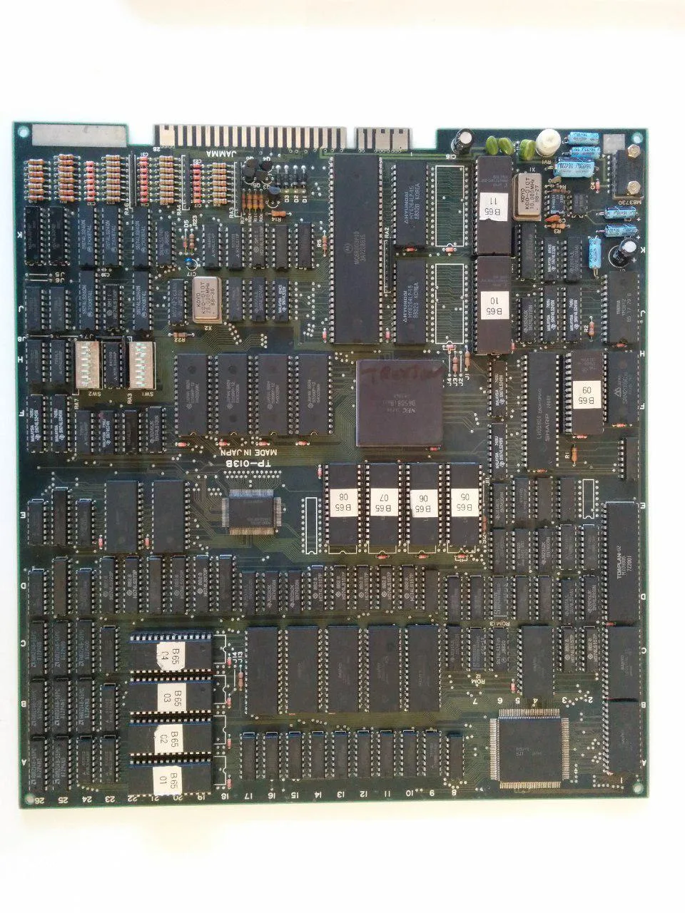
*JAMMA規格に対応するアーケードゲーム基板（PCB）。基板端のカードエッジコネクタを共通ハーネスへ接続する。*
*画像出典（引用）：Carpald, [Carte JAMMA - truxton taito.jpg](https://commons.wikimedia.org/wiki/File:Carte_JAMMA_-_truxton_taito.jpg), Wikimedia Commons, [CC BY-SA 4.0](https://creativecommons.org/licenses/by-sa/4.0/) / WebP変換。*

### インカムから見るゲームデザイン

ロケテで重視されるのは「1プレイあたりの実際の稼働時間」だ。プレイヤーが上手くなりすぎて1コインで長時間遊ばれると、コインが入らずインカムが下がる。一方、ゲームが難しすぎてすぐ死ぬとプレイヤーが定着しない。この「適度な難易度とインカムのバランス」は、純粋な面白さとは別次元の設計課題であり、新人プランナーがゲームセンターの論理を理解する上での核心部分だ。[[46](#ref-46)]

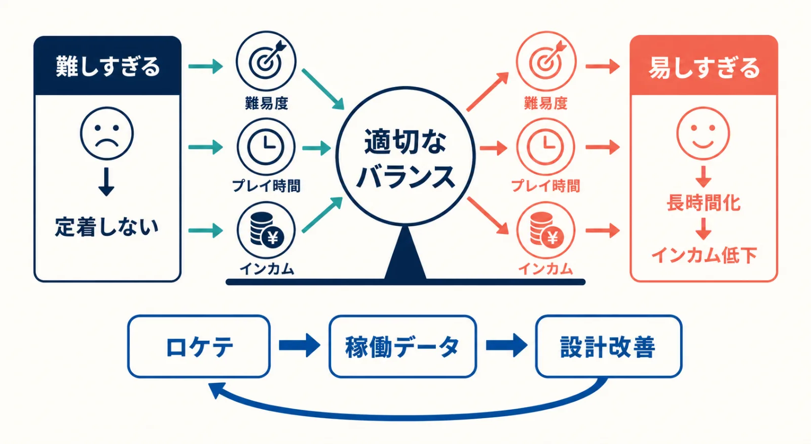
*インカム設計の綱引き。難易度・プレイ時間・収益のバランスが、面白さとは別軸の設計課題となる。*

2024年のデータでは、ゲームセンターの営業利益は売上100円あたり平均 **6円** にとどまり、電気代・人件費・機材コストの高騰により利益率の低さが構造的な課題となっている。[[25](#ref-25)][[18](#ref-18)]

### 開業コスト構造

- **ゲーム機導入コスト**：人気新規機種は数千万円になるものもある[[45](#ref-45)]
- **通信料**：ネットワーク型機器の増加により通信コストが増加[[45](#ref-45)]
- **景品コスト**：クレーンゲームは景品の仕入れコストが収益性を直接左右する[[25](#ref-25)]
- **消費税**：100円単位のプレイ料金が変わらない中、増税は実質収入を目減りさせた[[45](#ref-45)]

***

## 第11章：衰退と再構造化 ── 家庭用の追い上げと現在（1995年〜現在）

### 家庭用ゲーム機の追い上げ

1994〜1995年に登場したPlayStation・セガサターンは3Dポリゴン描画をリビングに持ち込んだ。アーケードが持っていた「技術的優位性」が急速に縮まった。それまではゲームセンターで体験できる映像・音響が家庭用ゲーム機より明らかに高品質だったが、格差が消えたとき、「わざわざゲームセンターに行く理由」の一つが失われた。[[3](#ref-3)]

### 店舗数の長期的減少

1993年の約8万7,000店をピークに、ゲームセンター等（シングルロケを含む設置店舗）の数は一貫して減少してきた。2017年には約1万3,000店、2021年には約1万店まで縮小している。2023年度の倒産・廃業は18件と過去5年で最多を更新した。[[18](#ref-18)][[17](#ref-17)][[25](#ref-25)]

しかし、 **店舗数の減少＝市場の縮小** ではない点に注意が必要だ。

### 市場規模は2014年以降に拡大傾向

アミューズメント施設の売上高は2006年度の約7,029億円をピークに減少し、2014年度の4,222億円を底に反転、2019年度には5,408億円まで回復した。この回復を牽引したのが **クレーンゲーム（プライズゲーム）** だ。[[48](#ref-48)]

プライズゲーム市場は2014年からの5年間で約1.7倍に成長し、2021年度には3,062億円と過去16年で最高水準を記録した（クレーンゲーム単体では約2,810億円規模、10年前比で約7割増）。アミューズメント施設の総売上に占めるクレーンゲームの比率は5割を超えている。「推し活」ブームやアニメ・ゲームIP景品の充実、インバウンド需要も追い風となっている。[[24](#ref-24)][[26](#ref-26)][[49](#ref-49)]

### 大型化・ショッピングモール移転という構造変化

小規模な街角ゲームセンターが消える一方、ショッピングモール内に展開する大型チェーン店は出店規模を拡大している。現在、ゲームセンターの約6割がショッピングセンター内に設置されているとされ、ファミリー層を主要客層とした「**エンターテインメントの総合体験空間**」へと業態が変化している。タイトーステーション・ROUND1・アドアーズなどが代表的なチェーンだ。[[26](#ref-26)][[25](#ref-25)]

### オンラインクレーンゲームという新フロンティア

スマートフォン経由で遠隔操作するオンラインクレーンゲームが近年急成長している。物理的なゲームセンターに来なくても景品を獲得できるこのモデルは、クレーンゲームの体験をデジタル空間に拡張する試みとして業界から注目されている。[[49](#ref-49)]

***

## ゲームプランナーへの設計的示唆

アーケードゲームの歴史が示す設計上の教訓は以下にまとめられる。

- **「Bushnell's Law」の普遍性**：黄金期の名作すべてに「すぐ遊べる、でも極めにくい」設計がある[[30](#ref-30)]
- **インカム設計はゲームデザインと不可分**：難易度・プレイ時間・コイン投入頻度は、楽しさと同時にビジネス要件として設計される[[46](#ref-46)]
- **プラットフォームの特性を活かす**：体感筐体・音ゲーはいずれも「家庭では再現できない体験」をコアに据えることで生き残った[[10](#ref-10)][[3](#ref-3)]
- **ロケテで事実を拾う**：ロケテはデザインの仮説検証であり、観察とデータが設計を修正する[[46](#ref-46)]
- **コミュニティ設計がコンテンツを育てる**：対戦格闘ブームは、ゲームのルール設計だけでなく「対戦台という場の設計」があって初めて爆発した[[16](#ref-16)][[42](#ref-42)]

---

## References

1. [どこに向かうのか ニッポンゲーセン変遷史 - shiRUto](https://shiruto.jp/culture/4787/) - そうした風潮を背景に、ゲームセンターを法的に規制していこうという流れが生まれ、1985年、ゲームセンターは風俗営業法（風営法）の適用対象とされ、 ...

2. [History of Esports - 321 Sports Museum](https://321qosm.org.qa/en/calendar/esports-a-game-changer/more-about-the-exhibition/history-of-esports/) - ... arcade game devices, Computer Space (1971). Atari would later establish itself by releasing icon...

3. [History of arcade video games - Wikipedia](https://en.wikipedia.org/wiki/History_of_arcade_video_games) - The first arcade game, Computer Space, was created by Nolan Bushnell and Ted Dabney, the founders of...

4. [アミューズメントマシンの歴史（1970年代）｜JAIA 日本アミューズメント産業協会](https://jaia.jp/history/pdf/history_1970_02.pdf) - コンピュータースペース（1971年）、ポン、タイトー「エレポン」・セガ「ポントロン」（1973年）、スペースインベーダーなど、業務用ビデオゲーム黎明期を解説した業界団体の史料。

5. [『スペースインベーダー』が誕生した日。インベーダーハウスや ...](https://www.famitsu.com/article/202506/44623) - いまから47年前の1978年（昭和53年）6月16日は、アーケード版『スペースインベーダー』が発表会で初お披露目された日。この日を公式に誕生日として ...

6. [社会現象を巻き起こしたゲーム「スペースインベーダー」の45年の歩み｜ウォーカープラス](https://www.walkerplus.com/article/1121451/) - 開発者・西角友宏氏インタビュー。純正品・許諾品・無許諾コピーが出回り、100円玉不足やインベーダーハウスなどの社会現象に発展した経緯を紹介。

7. [アーケード版『ドンキーコング』が稼動を開始した日｜ファミ通.com](https://www.famitsu.com/news/202107/09226488.html) - 1981年稼働。宮本茂が初めて手掛けたアクションゲームで、マリオが初登場した作品としても知られる大ヒット作。

8. [ゲーム産業の系譜 第3回 ファミコン苦難の船出からブーム爆発へ｜CESA](https://www.cesa.or.jp/genealogy/uemura/uemura03.html) - 上村雅之氏インタビュー。1982年末からのアタリショック以降、北米の家庭用ゲーム機市場が急速に減退した経緯を当事者が証言。

9. [新しい風営法 - 佐藤りょうへい行政書士事務所](https://r-sato-office.com/shinfueihou/) - 1948年に制定された「風俗営業取締法」が、1984年の改正（1985年施行）で「風俗営業等の規制及び業務の適正化等に関する法律」に名称が変更されました。

10. [1985年～1989年 体感ゲームブームの到来 - SEGA セガ](https://www.sega.jp/history/arcade/topics/6483/index.html) - ... 筐体の作品も生まれている。 （左）『スペースハリアー』筐体(1985年)（中）『アウトラン』筐体(1986年) （右）『アフターバーナー』筐体(1987年). そしてこの時代にアーケード .....

11. [【ゲーセンの法規制】マンガで振り返るゲーム業界：改正風営法が ...](https://game.watch.impress.co.jp/docs/kikaku/1660242.html) - 1985年2月13日に、前年に国会で可決された改正風俗営業法（改正風営法）が施行された。 同法によってゲームセンターが新たに規制の対象となり、夜間の ...

12. [【ハンダ付けのススメ】アーケード基板のハーネス、自作してみ ...](https://www.akihabara-beep.com/8790/) - そもそもJAMMA規格とは1986年頃に誕生したアミューズメント機器の業界統一規格で、それまでメーカーや年代、基板の仕様などによってアーケード基板と ...

13. [JAMMAハーネス｜通信用語の基礎知識](https://www.wdic.org/w/MOE/JAMMA%E3%83%8F%E3%83%BC%E3%83%8D%E3%82%B9) - 1986年以降、JVS規格が登場するまでの業務用ゲームの約8割にJAMMA規格（JS規格）のハーネスが使われたと解説する技術用語辞典。

14. [AC『ストリートファイターII』35周年。最新作も絶好調の ... - ファミ通](https://www.famitsu.com/article/202603/67761) - 1991年（平成3年）3月7日は、アーケード版『ストリートファイターII -The World Warrior-』がゲームセンターで稼動を開始した日。今年で35周年を迎えた ...

15. [ストリートファイター II ｜ カプコンタウン - Capcom Town](https://captown.capcom.com/ja/classic_games/22) - 1991年にアーケードで登場し、1992年に家庭用ゲーム機へ移植。これまでにはない魅力的なキャラクターの数々、パンチやキックなどの多彩なモーションや個性あふれる必殺 ...

16. [剣戟対戦格闘ゲームの元祖「サムライスピリッツ」シリーズがもたらしたもの｜4Gamer.net](https://www.4gamer.net/games/433/G043308/20190412123/) - 1991年の「ストリートファイターII」が起爆剤となり対戦格闘ゲームが大ブームを巻き起こし、各社が続々と参入した流れを解説。

17. [「ゲームセンターはオワコン」という大いなる誤解と意外な実態](https://gendai.media/articles/-/68147) - ... ゲームセンターの数は1993年の時点で8万7294店舗あったのが、2017年には1万3103店舗へと落ち込んでおり、この24年間で7万4191店舗が閉店したことに ...

18. [日本人の｢ゲームセンター離れ｣はウソ…30年前から｢大量閉店｣が続い ...](https://news.livedoor.com/article/detail/27060205/) - かつて、どこにでも見られたゲームセンターの姿が消えつつある。1993年の時点で約8万7000店舗あったゲームセンターは、2021年には約1万までその数を減らし ...

19. [商品の歴史 ｜ コナミグループ株式会社 - Konami](https://www.konami.com/corporate/ja/history/product.html) - 2002年. 「e-amusement」(アーケード). アミューズメント施設向け通信ネットワーク。全国の店舗とKONAMIを接続し全国のプレーヤー同士の対戦、記録の閲覧と保管を実現。

20. [アーケード業界のビジネスモデル刷新にまた一歩。KONAMI - 4Gamer](https://www.4gamer.net/games/117/G011746/20101119062/) - 同モデルは，プレイヤーが支払うインカムを，メーカーとオペレーター（アミューズメント施設経営者）との間でシェアするもので，オペレーター側はその分，新規 ...

21. [3社共通「アミューズメントICカード」の対応をスタートします 10 ...](https://prtimes.jp/main/html/rd/p/000000120.000033062.html) - このカードを使うことでゲームのプレイ履歴や成績を確認したり、プレイヤーが保有するキャラクターのカスタマイズやアイテムなどが入手できるなど、 ...

22. [3社共通"アミューズメントICカード"対応開始｜ファミ通.com](https://www.famitsu.com/news/201810/25166447.html) - 2018年10月25日、セガ・コナミ・バンダイナムコの3社がICカードの仕様を統一し、1枚で各社の対応機種を相互利用できるようになった。

23. [ゲームセンター「大変革時代」、老舗が続々閉店…でも実は“成長 ...](https://www.sbbit.jp/article/cont1/111141) - ... 店舗数はここ10年で見ても右肩下がりだ。しかし市場規模で見ると、実は拡大傾向にある。スマホアプリの台頭やコロナ禍の影響などを通して、ゲームセンター ...

24. [第390話 ゲームセンター市場拡大をけん引する”人気ゲーム”とは？](https://www.ichiyoshi.co.jp/topic/kabuto390) - しかし、2023年7月に公表された2021年度の「アミューズメント産業の実態調査」によれば、2021年度の国内ゲームセンターの市場規模は前年度比で7.3％増と ...

25. [「ゲームセンター」倒産・廃業、2年連続増 100円売上で利益「6円 ...](https://prtimes.jp/main/html/rd/p/000000847.000043465.html) - アミューズメント施設「ゲームセンター」の倒産や休廃業などが、2023年度には計18件発生した。前年度（15件）に続いて2年連続で増加したほか、過去5年間で ...

26. [ファミリー層取り込み急成長、「クレーンゲーム関連株」に時代の ...](https://kabutan.jp/news/marketnews/?b=n202410241151) - ゲームセンターの店舗数は10年間で8000店舗近くが減少しているという。 ... ○クレーンゲーム市場は10年間で7割増. アミューズメント施設といえば ...

27. [アミューズメントマシンの軌跡](https://jaia.jp/history/) - 黎明期 【国産ゲーム機が次々と誕生。60年代には景品. 戦後復興期にあった1950年代半ばまで、日本はアメリカ製のピンボールやガンゲームが米軍関係施設の中で使用される ...

28. [Pinball - Wikipedia（英語版）](https://en.wikipedia.org/wiki/Pinball) - 1930年代の電気化以降にピンボールが普及し、賭博性を理由に多くの都市で禁止・規制された歴史を解説。

29. [The Great History of Arcade Machines: See Through the Past](https://arcademania.co.uk/the-great-history-of-arcade-machines/) - The golden age of arcade games (from 1978 to 1983) started with the release of many games such as co...

30. [Computer Space - The Strong National Museum of Play](https://www.museumofplay.org/games/computer-space/) - It established the blueprint for nearly all coin-operated arcade video games that followed it: a cab...

31. [日本人が「宇宙からの侵略者」に熱狂した日。コンピューターを ...](https://intojapanwaraku.com/rock/culture-rock/108688/) - 日本の太東貿易（現・タイトー）が開発したこのアーケードゲームを、全国の喫茶店が競うように導入した。あまりの大人気に、本業の飲食物提供よりもスペース ...

32. [バンダイナムコ知新 第7回『パックマン』誕生秘話【前編】岩谷徹氏 ...](https://funfare.bandainamcoent.co.jp/7116/) - 前編では『パックマン』が誕生するまでの開発・製造秘話や1980年代のゲーム事情について掘り下げていきます。デザイナーの岩谷徹さんを筆頭にこの作品に ...

33. [その他のゲームでのマリオ｜任天堂](https://www.nintendo.co.jp/ngc/sms/history/fms/index.html) - マリオが初登場した『ドンキーコング』は、樽をジャンプでかわすジャンプアクションで、その後のマリオアクションの原型になったと位置づけられている。

34. [ブロックチェーンにアタリショックの再来はあるか - DG Lab Haus](https://media.dglab.com/2017/12/21-atari-01/) - 1983年のビデオゲームクラッシュ、日本ではアタリショックと呼ばれているものだ。1982年には、家庭用ビデオゲームの市場規模は約32億ドルだったが ...

35. [発売35周年"ファミコンの父"上村雅之とは一体何者なのか？｜文春オンライン](https://bunshun.jp/articles/-/7838) - 1981年秋、山内溥社長が上村雅之氏に「家庭でアーケードゲームが遊べる機械を、3年間は他社に真似されない形で」と指示し、独自に開発が始まった経緯を解説。

36. [ゲームとシンクロして動く体感筐体に大興奮！ 『スペースハリアー』](https://igcc.jp/%E3%82%B9%E3%83%9A%E3%83%BC%E3%82%B9%E3%83%8F%E3%83%AA%E3%82%A2%E3%83%BC/) - 『スペースハリアー』が登場した頃はまだ、「体感ゲーム」という言葉は使われておらず、大型筐体ゲームの発展型という位置づけでした。セガはそれ以前から ...

37. [『3Dパワードリフト』配信記念 鈴木裕×堀井直樹スペシャル対談｜ファミ通.com](https://www.famitsu.com/news/201611/02117920.html) - 1985年の『ハングオン』を皮切りに、『スペースハリアー』『アウトラン』『アフターバーナー』『パワードリフト』へと体感ゲームを連発した開発者・鈴木裕氏が当時を語る。

38. [アーケードゲーム機の入出力環境の変遷と進化とは？ タイトーが ...](https://www.famitsu.com/news/201409/05060716.html) - JAMMA規格に続くアーケードゲームI/Oのもうひとつの進化は、1997年から始まった“JVS”という規格だ。こちらの特徴は、I/Oに関する制御をすべてゲーム基板 ...

39. [UFOキャッチャーの歴史・豆知識｜セガプラザ](https://segaplaza.jp/special/ufo/history/) - 1985年に登場した初代UFOキャッチャーは、開発時はメカの動きが鷲づかみに似ていたことから「イーグルキャッチャー」と呼ばれていたとセガ公式が紹介。

40. [クレーンゲームの歴史  UFOキャッチャー エブリデイ行田/サービス](https://ufo-everyday.com/fan_contents_06.html) - 日本のクレーンゲームの歴史は古く、手動でハンドルを操作するタイプのクレーンゲームは、1930年代にはすでに登場していました。その後1965年には、サミーの前身である株式 ...

41. [「ストリートファイターII」が本日で32周年 ... - GAME Watch](https://game.watch.impress.co.jp/docs/kikaku/1483275.html) - 1991年3月7日、カプコンのアーケードゲーム機「ストリートファイターII」の一般稼動が開始された。 本作は、稼働当初は静かな立ち上がりで、ゲーム ...

42. [ゲーセンの常識を破壊した『スト2』キャビネット型対戦台の衝撃 ...](https://fujinkoron.jp/articles/-/8927?page=4) - こうして『スト2』の出現と対戦格闘の流行によって「格ゲー」ブームが興り、ゲームセンターは80年代に続く黄金時代を迎える。 豊かに育つアーケードゲーム ...

43. [ゲームジャンルに「格闘」という新カテゴリを生んだ『ストリートファイター』｜ゲーム文化保存研究所](https://igcc.jp/%E3%82%B9%E3%83%88%E3%83%AA%E3%83%BC%E3%83%88%E3%83%95%E3%82%A1%E3%82%A4%E3%82%BF%E3%83%BC/) - 乱入による見知らぬ者同士の対戦や、それを取り囲む観客といった、ゲームセンター特有の対戦コミュニティが形成された経緯を解説。

44. [コナミ アーケードゲーム製品・サービス情報サイト（e-amusement）｜KONAMI](https://www.konami.com/amusement/) - コナミがアーケード向けに展開するネットワークサービス「e-amusement」の公式情報サイト。全国対戦やプレイデータの保存などのサービスを提供する。

45. [ゲームセンター ｜ 起業支援 ｜ J-Net21（中小企業ビジネス支援サイト）](https://j-net21.smrj.go.jp/startup/guide/service/h034.html) - （1）足元での市場は回復傾向 · （2）フランチャイズ加盟やシングルロケによる開業 · （1）フランチャイズ加盟による開業 · （2）シングルロケ · （1）開業のステップ · （ ...

46. [用語豆知識その1](https://www.ne.jp/asahi/cc-sakura/akkun/mame/yougo1.html) - ゲームセンターで稼がれるお金の事です。投入されるコインが多いゲーム）程 「インカムが良い、又は高い」と言う表現がされます。 ... ではありません。最近のゲームは ...

47. [はじめよう！アーケード基板｜BEEP秋葉原](https://www.akihabara-beep.com/4714/) - JAMMA規格は1986年頃に誕生したアミューズメント機器の業界統一規格で、これにより汎用筐体での基板入れ替えやメンテナンスが容易になったと解説。

48. [10年で2千5百億円減、ゲームセンター業界は低迷も…救世主 ...](https://gentosha-go.com/articles/-/63205) - ゲームセンターの店舗数は1985年の2万6千店から、2021年には3千9百店までに減少しています。実に6分の1以下です。 出所：『集客が劇的に変わる ...

49. [廃業相次ぐゲームセンター業界に光明。リアルとオンラインで進化 ...](https://www.walkerplus.com/article/1126133/) - 日本アミューズメント産業協会が実施した実態調査によれば、ここ10年でゲームセンターの店舗数はほぼ半数に。しかしながら、多くのクレーンゲームを設置 ...

50. [What's “NEOGEO”?｜NEOGEO MUSEUM](https://neogeomuseum.snk-corp.co.jp/whats/index.php) - SNKによるNEO・GEOの公式回顧。MVSの複数ROM方式、価格、省スペース性、リース展開、AESとの関係、メモリーカード連携、格闘ゲーム期の発展を解説。

51. [1978-2024｜株式会社SNK](https://www.snk-corp.co.jp/snk-history/history/index.html) - SNK公式沿革。1990年のMVS・NEO・GEO発売、国内約1万2,000台のMVS導入、家庭用とのメモリーカード連携、各シリーズの海外展開を紹介。

52. [ヒストリー - ナムコ｜バンダイナムコエンターテインメント](https://www.bandainamcoent.co.jp/corporate/history/namco/) - 1990年の国際花と緑の博覧会への「ギャラクシアン³」出展と、1992年の都市型テーマパーク「ナムコ・ワンダーエッグ」開園を記録した公式沿革。

53. [あの「ギャラクシアン3」が遊べる！ ゲームファンの有志が運営する「ビデオゲーム博物館」とは？｜4Gamer.net](https://www.4gamer.net/games/000/G000000/20071213050/) - 28人版の全周スクリーン、16台の120インチプロジェクター、油圧機構、ワンダーエッグでの稼働と6人版の保存活動を紹介。

54. [『エースコンバット7』VR開発TXMセッションレポ―VRは『ギャラクシアン3』から始まる約30年の挑戦｜GameBusiness.jp](https://www.gamebusiness.jp/article/2019/02/28/15488.html) - 開発者講演を基に、28人・16人・6人版の展開と、暗号解読やエアロックを含む乗船前後の体験設計を解説。

55. [平成28年度メディア芸術連携促進事業 連携共同事業](https://mediag.bunka.go.jp/projects/project/rits-gamearchive.pdf) - 立命館大学ゲーム研究センターなどによるアーケードゲーム保存報告。「ギャラクシアン³ シアター6」を約5メートル四方、高さ2.5メートルの6人同時参加型大型ゲームとして記録。

56. [東海エリア最大のAM施設「ナムコランド」11月29日オープン｜ナムコ](https://www.bandainamcoent.co.jp/corporate/press/namco/1996/1996_november/news_november03.html) - 1996年開業の大型アミューズメント施設に「ギャラクシアン³ シアター6」を設置したことを伝えるナムコの公式発表。

57. [岩谷徹第5回インタビュー後半：ゲーム開発から大学教育へ｜一橋大学イノベーション研究センター](https://hit-u.repo.nii.ac.jp/record/2057913/files/070iirWP18-13.pdf) - ナムコで新規事業に携わった岩谷徹氏のオーラルヒストリー。花と緑の博覧会の「ギャラクシアン³」と「ドルアーガの塔」をワンダーエッグへ持ち込む企画経緯を証言。

----

この文書は、Perplexity、Claude、OpenAI Codex の3つのAIの支援を受けて著述されたものです。引用画像を除き、MIT License にて提供されています。
