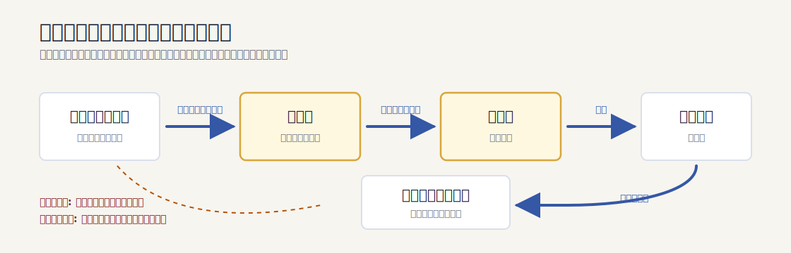

# アタリショックからプレイステーション流通革命まで：ゲーム市場構造の変遷

## はじめに：「アタリショック＝粗製濫造」は半分しか正しくない

日本では「アタリショック＝粗製濫造ソフトのせいで市場が崩壊した」という理解が定着している。確かにそれは要因の一つだが、実際の崩壊は複数の構造的問題が重なった結果だった。加えて「アタリショック」という言葉自体が日本独自の呼び名であり、欧米では **"Video Game Crash of 1983"** （1983年のビデオゲーム崩壊）と呼ばれている。[[1](#ref-1)][[2](#ref-2)]

本稿では崩壊の本当の原因を整理したうえで、ファミコン（および海外版NES）がどのようにその教訓を活かし、さらにプレイステーションがいかに流通の革命をもたらしたかを順を追って解説する。なお本稿では、日本市場における任天堂機を指すときは「ファミコン（ファミリーコンピュータ）」、北米・欧州市場で展開された海外版を指すときは「NES（Nintendo Entertainment System）」と表記を区別する。

***

## 第1章：アタリとその黄金時代（1977〜1982年）

アタリが1977年に発売したVCS（後のアタリ2600）は、家庭用ゲーム機市場を実質的に開拓したハードウェアだった。1980年から1982年にかけて市場は急拡大し、ゲーム機とソフトの小売額は2年間で約4倍に膨れ上がった。1982年のピーク時、北米の家庭用ゲーム市場全体の売上は約32億ドルに達し、アタリは市場シェアの約60%を握る王者として君臨していた。[[3](#ref-3)][[4](#ref-4)][[1](#ref-1)]

この時期のアタリは単純に「ゲームを売る会社」ではなく、**ワーナー・コミュニケーションズ** という大手メディア企業の傘下にあった。このことが後の崩壊に深く関係する。[[1](#ref-1)]

***

## 第2章：崩壊の真相——複数の要因が重なった市場崩壊

### 2-1. ライセンス不在による「ソフトの氾濫」

アタリは自社ハードウェアに対して、**ソフトウェア開発を制限するライセンス制度を持っていなかった**。むしろ初期の元アタリ社員によるアクティビジョン（世界初のサードパーティー）の独立とアタリとの和解を経て、サードパーティーの参入は法的にも道筋が付いた状態だった。その結果、1982年ごろからサードパーティーが雨後の筍のように参入し始め、粗製濫造ソフトが大量に流通した。[[2](#ref-2)][[5](#ref-5)]

消費者はゲームソフトを購入するまで品質の良し悪しを判断できなかった。粗悪な安売りタイトルが棚を埋め尽くし、優れたサードパーティ（アクティビジョンなど）のソフトまでが安値競争に巻き込まれた。特に象徴的だったのがアタリ自身によるミスだった。[[3](#ref-3)]

- **『パックマン』のアタリ2600移植版**：アーケードの完成度とは程遠いクオリティで、当時稼働していた本体台数を数百万本も上回るカートリッジを製造して大量の売れ残りを発生させた[[28](#ref-28)]
- **映画『E.T.』のゲーム化**：開発者ハワード・スコット・ワーショウが **5週間半** でほぼ単独で開発。販売予測を大きく上回る **約400〜500万本** のカートリッジを製造したが、実販売は約150万本にとどまり、約350万本が返品。余剰在庫はニューメキシコ州アラモゴード市の埋立地に埋められた（2014年の発掘調査で確認）[[6](#ref-6)][[7](#ref-7)][[29](#ref-29)]

### 2-2. ハードウェアの飽和と想定外の急落

アタリのCEOは当時、米国の約半数の家庭にゲーム機が行き渡る頃に市場が飽和すると予測していた。しかし実際には **約1500万台が売れた時点** で崩壊が訪れた。当時すでに6〜16歳の子どもがいる3500万世帯に対し、3000万台ものコンソールが出回っていたとされ、「子どもがいる家庭にはもうゲーム機が行き渡っている」という状態になっていた。[[3](#ref-3)]

### 2-3. ホームコンピューターの台頭——見落とされがちな要因

この点は日本ではあまり語られないが極めて重要な背景だ。1983年、**コモドール64** が価格を299ドル（一部小売店ではさらに安価）にまで大幅値下げした。テキサス・インスツルメンツとの価格戦争を経て、コモドール64はホームコンピューターとして爆発的に普及し、ゲームも遊べる多機能製品として家庭用ゲーム機の代替となっていった。当時の日本語技術誌がアタリショックの原因を分析した際も「ホームコンピューター価格下落による産業構造の変化」を主要因の一つに挙げていた。[[8](#ref-8)][[9](#ref-9)]

### 2-4. アタリ自身の経営判断——在庫の過剰生産と値崩れ

アタリの親会社ワーナー・コミュニケーションズは1982年第4四半期の利益下方修正を余儀なくされ、同日（12月9日）に株価が暴落した。厳密にいえば「アタリショック」の原語的な意味は **ワーナー社の株価暴落** を指しており、その後に市場全体が崩壊していったのだ。[[1](#ref-1)]

加えて、前年10月にアタリ社が販売代理店に対し翌年分の一括発注を求めた結果、品切れを避けるために代理店が水増し発注を行い、その誤った需要予測に基づいて生産したアタリは過剰在庫を抱え込んだ。これが値崩れに拍車をかけた。[[28](#ref-28)]

### 2-5. 崩壊の規模

1983年から1985年にかけて、北米家庭用ゲーム市場の規模は **32億ドルから1億ドル以下** へと、わずか2年で **約97%減** という壊滅的な崩壊を遂げた。アタリは1983年中頃までに約3億5600万ドルの損失を計上し、従業員の30%にあたる3000人を解雇、製造拠点を香港・台湾へ移転した。小売業者はビデオゲームへの信頼を完全に失い、「アイスクリームをエスキモーに売るよりも難しい」とまで言われるほど、新しいゲーム機の取り扱いを拒む状況が生まれた。[[4](#ref-4)][[10](#ref-10)][[3](#ref-3)]

***

## 第3章：ファミコンの回答——制御された生態系の構築

### 3-1. ファミコンの誕生（1983年）

任天堂が1983年7月15日にファミリーコンピュータを14,800円で発売した時、北米ではすでに市場崩壊が始まっていた。しかし日本では状況が違った。山内溥社長はアタリの失敗を「サードパーティに自由を与えすぎた結果」と明確に解釈し、それを繰り返さないための仕組みを設計していった。当初任天堂はサードパーティ参入そのものを想定しておらず、ハドソン（1984年7月発売の『ナッツ＆ミルク』『ロードランナー』）やナムコ（独自解析の上、1984年に契約締結）との交渉を経てライセンス制度が形作られていった経緯がある。[[11](#ref-11)][[27](#ref-27)][[3](#ref-3)]

### 3-2. 海賊版対策——日本（ファミコン）と海外（NES）で異なる手法

ここで重要なのは、**日本のファミコンと海外版NESでは海賊版・無許諾ソフト対策の仕組みが異なっていた** 点である。混同されがちだが、両者を区別して整理する必要がある。

**日本のファミコン** には、ハードウェアレベルの認証チップ（ロックアウトチップ）は搭載されていなかった。任天堂はもっぱら以下の方法で対策していた：[[12](#ref-12)][[30](#ref-30)][[31](#ref-31)][[13](#ref-13)]

- 「ファミリーコンピュータ／ファミコン」の **商標権** を盾に、無断で「ファミコン用」と称する製品の販売を不正競争防止法で訴えうる体制を整備
- 内部構造が少しずつ異なる本体を **8種類** 用意し、無許諾ソフトが複数の本体仕様すべてに対応するのを困難にした
- サードパーティとの **ライセンス契約** で正規ルートを管理

それでも極東地域では、ファミコンの海賊版（互換機・無許諾ソフト）がある程度流通したのが実情だ。

**北米・欧州向けのNES** （1985年北米発売）にはこれを反省して、**「10NES」と呼ばれるロックアウトチップ（CIC）** が搭載された。本体側とカートリッジ側の両方にチップを内蔵し、両者の認証が一致しないとゲームが起動しない設計である。これにより：[[12](#ref-12)][[30](#ref-30)][[31](#ref-31)][[14](#ref-14)]

- **非正規ソフトの市場流通を物理的に遮断** できた（ただし後にアタリゲームズ子会社のテンゲンなどが回避を試みた）
- **カートリッジ製造を任天堂が一元管理** できる体制を強化
- 地域ごとに識別番号の異なる10NESを採用することで **リージョンロック（地域制限）** も実現

つまり「ロックアウトチップ＝任天堂機の代名詞」というイメージは正確には **NES以降の海外展開での話** であり、日本のファミコンに最初から備わっていたものではないという点に留意が必要である。

### 3-3. ライセンス契約による「品質と数量の垣根」

サードパーティがファミコン用ゲームを開発・発売するには、任天堂との **ライセンス契約** が必須となっていった。この契約には次のような重要な条件が盛り込まれていた：[[13](#ref-13)][[15](#ref-15)][[37](#ref-37)]

| 条件 | 内容 |
|------|------|
| ゲーム内容の審査 | 任天堂の倫理審査を受ける（宗教・流血・性的要素の規制等） |
| 年間発売本数の制限 | 1社あたり年間1〜5本以下（メーカー規模により協議。後のスーパーファミコン時代にはより厳格化）[[14](#ref-14)][[15](#ref-15)][[37](#ref-37)] |
| カートリッジ製造委託 | 原則として任天堂のみ（初期参入の自社生産許諾組を除く）[[15](#ref-15)][[37](#ref-37)] |
| 費用前払い | 製造委託費は発注時に半額、納品時に残額を支払う[[16](#ref-16)] |

ただしハドソン、ナムコ、タイトー、コナミ、カプコン、ジャレコらいわゆる **初期参入6社** には、本数制限なし・自社生産許諾といった優遇条件が与えられていた（このうちナムコの優遇は1989年のロイヤリティ契約満了をもって他社並みの委託生産契約に統一されている）。[[15](#ref-15)][[37](#ref-37)]

なお、北米向けNESにおいては公式に認可されたゲームに **「Nintendo Quality Seal（任天堂クオリティシール／ゴールドシール）」** の表示が許可され、これが現地の消費者にとって品質の目印となった。これも厳密には **北米NES市場向けの仕組み** であり、日本のファミコンソフトには採用されていない。[[14](#ref-14)]

1986年、任天堂の山内社長は「アタリが崩壊したのはサードパーティに自由を与えすぎたからだ。それに対抗して任天堂はサードパーティの年間リリース本数を制限し、品質基準を設けた」と述べている。[[14](#ref-14)][[3](#ref-3)]

なお、後年になるとファミコン／スーパーファミコン時代の任天堂社内には品質管理組織として **「スーパーマリオクラブ」** （後のマリオクラブ株式会社の前身）が存在し、ソフト評価情報を玩具店向けデータベースとして提供する仕組みも整えられた。ただし、ここで付与される評価点が「○○点未満は発売不可」という絶対的な合格基準として機能したわけではなく、玩具問屋・小売の発注判断の参考値として用いられた。発注数が任天堂の最低生産ロット数に届かなかった結果として発売中止になるソフトもあったが、その閾値は時期によって変動していた。[[16](#ref-16)][[32](#ref-32)][[33](#ref-33)]

### 3-4. 任天堂の北米進出——「おもちゃ」として再定義

アタリショックで火傷した北米小売業者は、ゲーム機に強烈なアレルギーを持っていた。任天堂はこの壁を乗り越えるため、NESを「ロボット（R.O.B.）付きのおもちゃセット」として売り出すという奇策を採用し、家電製品ではなく玩具コーナーに置かせることに成功した。1985年の北米正式上陸後、1986年にはニューヨーク・タイムズが「ビデオゲーム業界が劇的に復活した」と報じる事態となった。[[17](#ref-17)][[10](#ref-10)]

***

## 第4章：ファミコン時代の流通の実態——「初心会」という構造

任天堂がアタリの失敗から学んだのはソフト品質管理だけではない。流通も含めた **垂直統合** こそが任天堂の強みだった。

### 4-1. 初心会による独占的流通網

任天堂は **初心会** と呼ばれる玩具問屋グループと組み、全国の小売店へゲームソフトを供給する独占的な流通ルートを構築した。この仕組みは以下の流れで動いていた：[[16](#ref-16)]

メーカーはカートリッジ製造費を前払いする必要があったため、失敗作を量産するリスクは大きく、自然と慎重なリリース判断が促された。一方、問屋は「原則返品なし」で仕入れた在庫の責任を負い、売れ残りは二次問屋・小売へ抱き合わせで押し付ける構造になっていた。[[18](#ref-18)][[16](#ref-16)]

### 4-2. ROMカセットの高コスト構造とソフト価格の高騰

カートリッジ製造には時間もコストもかかった。ROMの再生産には3ヶ月以上かかることも珍しくなく、需要の変動に素早く対応できない硬直した在庫管理が問題となった。ファミコン期のソフト定価は4,500〜5,500円程度が一般的だったが、スーパーファミコン時代になるとこの構造的コストが積み重なり、定価は7,000〜8,000円台が普通となり、一部タイトルは1万円を超えるようになった。例えば『ファイナルファンタジーVI』（1994年4月発売）は11,400円で発売されている。[[19](#ref-19)][[20](#ref-20)][[16](#ref-16)][[11](#ref-11)][[27](#ref-27)]

この高コスト構造が「中古販売市場」を生み出す一因となった。小売店は過剰在庫のリスクを抱える一方、消費者から安く買い取ったソフトを中古として売ることで利益を確保していた。この中古市場は、メーカー・問屋・小売の「持ちつ持たれつの奇妙な関係」を支える重要な安全弁だったのである。[[16](#ref-16)]

***

## 第5章：プレイステーションの流通革命（1994〜）

### 5-1. ソニーが見た「魔窟」

ソニーが独自のゲーム機（プレイステーション）開発に乗り出すにあたり、徹底的な市場調査を行った。その結果見えたのは、メーカーは実売数を把握できず、問屋は不良在庫を小売に押し付け、小売は中古ソフトで利益を補填するという **複雑怪奇な構造** だった。任天堂の山内社長は離反したソニーに対して「こんな複雑怪奇な流通を制御できるか？無理だろう」と言い放ったとされている。[[16](#ref-16)]

### 5-2. CD-ROMという構造的優位

プレイステーション（1994年12月3日発売、39,800円）がCD-ROMを採用したことは単なる容量問題の解決ではなく、流通革命の根幹だった。[[19](#ref-19)][[22](#ref-22)]

| 項目 | ROMカートリッジ（スーパーファミコン） | CD-ROM（プレイステーション） |
|------|---------------------|---------------------|
| 製造コスト | 高い（半導体依存） | 安い（光ディスク） |
| 再生産リードタイム | 3ヶ月以上[[16](#ref-16)] | 中3〜4日程度[[16](#ref-16)][[36](#ref-36)] |
| ソフト小売価格 | 7,000〜11,400円超[[20](#ref-20)] | 5,800〜6,800円[[19](#ref-19)] |
| データ容量 | 数MB（最大6MB） | 約650MB[[21](#ref-21)] |
| 読み込み速度 | 高速 | 低速（ロード問題が顕在化）[[19](#ref-19)] |

ソニーグループ内に光ディスクのプレス工場（後のソニーDADCジャパン静岡工場）を持っていたため、月曜日に発注したソフトが金曜日には小売店に届く爆速リピートが実現可能だった。[[16](#ref-16)][[36](#ref-36)]

### 5-3. SCEが「問屋そのもの」になった

SCE（ソニー・コンピュータエンタテインメント）の革新的な発想は、**自分たちが問屋になる** ことだった。レコード業界出身のSCE幹部が音楽ソフト流通のノウハウを持ち込み、ソニーミュージック傘下の物流会社「**ジャレード**」（旧ジャパン・レコード配送株式会社、現・ソニー・ミュージックソリューションズ）の全国流通網をそのまま転用した。この新モデルの骨子は以下の通りだった：[[22](#ref-22)][[16](#ref-16)][[36](#ref-36)]

1. ソフト会社は完成したゲームをSCEに収める
2. SCEが全国の特約店へ直接販促・出荷を行う
3. 在庫リスクは最低取引数に満たない場合はSCEが肩代わり
4. メーカーは製造委託費を差し引いた利益を受け取る
5. ソフトの掛け率は75掛け（業界通例の85〜90掛けより厳しいが返品リスクがない）[[16](#ref-16)]
6. 中古販売の禁止と定価販売の維持を契約に盛り込む

中小メーカーにとって最大のメリットは **前払い不要** だった点だ。任天堂流通では製造委託費を前払いする必要があったが、SCEはそれを実質的に肩代わりした。これによって日本一ソフトウェアやフロムソフトウェアといった中小・異業種出身のメーカーが一気にプレイステーション向けに参入した。[[16](#ref-16)]

### 5-4. スクウェアの「離反」が決定打に

**1996年初頭**、当時絶大な人気を誇っていたスクウェアが、次回作 **ファイナルファンタジーVII** をNINTENDO 64ではなくプレイステーションで発売すると発表した。1996年1月に60秒CM「ファイナルファンタジーVII、始動」が放映され、続いて2月14日発売の『電撃PlayStation』Vol.17で初報が掲載されて業界に衝撃を与えた。実際の発売は1997年1月31日となる。[[34](#ref-34)][[35](#ref-35)]

この背景にはNINTENDO 64がカートリッジを堅持し、『ファイナルファンタジーVII』に必要な大容量（CDで3枚組）の3DCGムービーを、NINTENDO 64の最大64MBカートリッジでは到底実現できなかったという技術的事情がある。元SIE社長の吉田修平は後に「スクウェアは任天堂にCD-ROMへの変更を懸命に説得したが、任天堂は耳を貸さなかった」と証言している。[[23](#ref-23)][[24](#ref-24)]

エニックスもスクウェアに続く形でドラゴンクエストシリーズ（『ドラゴンクエストVII』）をプレイステーションに持ち込むことを1997年1月に発表したことで、ゲーム機戦争の雌雄は事実上決した。[[16](#ref-16)][[34](#ref-34)]

***

## 第6章：「流通革命の成功」と「その限界」

プレイステーション（初代プレイステーション／PS one）は世界累計 **1億249万台** を販売（2005年3月時点）し、任天堂一強だったゲーム機市場の勢力図を塗り替えた。「ソフトが安い（5,800〜6,800円）」「中3〜4日でリピート入荷」「在庫リスクが小さい」という三つの訴求は中小小売店と中小メーカーの双方に刺さった。[[25](#ref-25)][[19](#ref-19)][[22](#ref-22)]

ただし、note執筆者の初心カイ氏が詳細に分析しているように、SCEが本来目指した「直販・完全返品なし・中古禁止・定価販売厳守」という理想モデルは完全には実現しなかった。『ファイナルファンタジーVII』の大ヒット以降、プレイステーション人気が過熱するにつれ、SCEも流通業界の圧力に折れ、掛け率を業界通例の85〜90掛けへ引き上げるなど妥協を重ねた。1998年1月には公正取引委員会から「小売業者に対し希望小売価格での販売圧力を加えた」として独占禁止法違反で排除勧告を受け（2001年に審決確定）、定価販売モデルも崩れた。「流通革命は成功したが、その革命の中身はソニーが描いた理想とは異なる形で着地した」というのが実態に近い。[[16](#ref-16)][[22](#ref-22)]

***

## まとめ：アタリから学ぶゲームビジネスの構造原理

| 時代 | 主な課題 | 解決策 |
|------|---------|--------|
| アタリVCS時代（〜1983年） | ライセンス不在による粗製濫造、ホームPCとの競合、市場飽和 | —（解決されず崩壊）[[3](#ref-3)] |
| ファミコン時代（日本、1983〜90年） | 品質管理、無許諾ソフトの排除 | 商標権＋複数本体仕様＋ライセンス制度＋年間本数制限[[14](#ref-14)][[13](#ref-13)] |
| NES時代（北米・欧州、1985〜95年） | 品質管理、海賊版排除、地域制限 | 10NES／CICロックアウトチップ＋クオリティシール＋ライセンス制度[[14](#ref-14)][[31](#ref-31)] |
| スーパーファミコン時代 | カートリッジ高コスト、問屋の硬直、ソフト高騰 | 品質審査強化（スーパーマリオクラブ等）、しかし根本的な流通改革は未着手[[16](#ref-16)] |
| プレイステーション時代（1994〜） | 複雑流通、実売数不可視、ソフト価格高騰 | CD-ROM採用＋SCE直接流通＋低コスト再生産[[22](#ref-22)][[16](#ref-16)] |

アタリショックが残した最大の教訓は、**「プラットフォームホルダーがエコシステム全体の品質とコストをコントロールする仕組みを持てるかどうかが、市場の持続性を決める」** という点だ。任天堂はライセンス契約と年間本数制限（さらに海外NESではロックアウトチップ）でそれを契約・技術両面から実現し、ソニーは流通の内製化とCD-ROMの低コスト性でそれを経済面から実現した。どちらも本質は「プラットフォームの垂直統合」であり、この原理は現代のダウンロード販売・プラットフォーム手数料にまで受け継がれている。[[5](#ref-5)]

---

## References

1. [「アタリショック」観の変遷][1] - アタリVCSがまったく売れなくなった。原因は―――雨後の筍のようにサードパーティが参入し、ゲームソフトは粗製濫造された。

2. [アタリショックとは（ニコニコ大百科）][2] - アメリカの消費者は家庭用ゲームから離れ、市場規模は最終的に30分の1にまで減少し、実質的に消滅してしまった。

3. [Video game crash of 1983 - Wikipedia][3] - 北米ゲーム市場崩壊の経緯と原因の包括的解説。

4. [1983 vs 2025: Lessons from the Biggest Crisis in the Game Industry][4] - 32億ドルから1億ドルへの市場縮小の数値検証。

5. [t50 産業史における特異点、アタリショックの全貌と現代への示唆][5] - 任天堂が北米進出時にアタリの轍を踏まないために構築したシステムの分析。

6. [TIL of the Atari Shock (Reddit)][6] - ゲームの質の悪さや人々が離れていく原因の議論。

7. [The Video Game Crash of 1983: How the Industry Nearly Died][7] - 1983年のビデオゲーム崩壊の完全な物語。

8. [アタリショックの真実(1)「それは暴落から始まった」][8] - 「アタリショック」の起きた原因と市場状態の分析。

9. [A History of Atari's 8-bit Personal Computers][9] - 1983年6月コモドール64の299ドルへの値下げの記録。

10. [Generation Nintendo][10] - 任天堂の北米進出戦略の分析。

11. [任天堂｜ファミリーコンピュータを発売（1983年7月）][11] - ソフトウェアの初期小売価格と任天堂の量産体制の説明。

12. [nlockout.txt][12] - NES 10NESロックアウトチップの技術解説。

13. [Nintendo Entertainment System (DLAB)][13] - 任天堂のサードパーティ認可プロセスの記述。

14. [Nintendo Entertainment System - Wikipedia][14] - NESの制限的ライセンス条件、年間5本制限、クオリティシールの説明。

15. [とてもすごくよくわかる「任天堂チェック」の歴史｜初心カイ][15] - ファミコンのサードパーティ制度（自社生産7社・委託生産他社）の解説。

16. [そして革命は終わった -プレイステーション流通革命の真実- 前編｜初心カイ][16] - プレイステーション流通革命の詳細分析と「ジャレード」の言及。

17. [アタリショックの真実(2)「そして崩壊する北米ゲーム市場」][17] - ソフト粗製濫造と海賊版による市場崩壊の分析。

18. [なぜスーファミ時代、新作ソフトが3割引で売られていたのか][18] - スーファミ時代の初心会流通と価格構造の解説。

19. [平成ゲーム史まとめ。30年間を年表とコラムで振り返る][19] - CD-ROMの読み込み時間問題とプレイステーション時代のソフト価格の記述。

20. [スーパーファミコン価格ランキング][20] - SFC時代の価格設定の実例。

21. [Discussion Paper #99-DOJ-98 家庭用ビデオゲーム産業の構造分析][21] - ROMカセットからCD-ROMへの媒体変化と保護技術の解説。

22. [PlayStation (ゲーム機) - Wikipedia][22] - プレイステーションの仕様、価格、流通史の包括的解説。

23. [Any specific reason why Square decided to leave Nintendo (Reddit)][23] - スクウェアの任天堂離脱の議論。

24. [Nintendo Ignored Square's Pleas To Use Discs Instead Of Cartridges][24] - 吉田修平による『ファイナルファンタジーVII』開発時の証言。

25. [PlayStation - Wikipedia][25] - PSブランドの英語版概説。

26. [E.T. (アタリ2600) - Wikipedia][26] - E.T.のライセンス料、開発、廃棄の経緯の詳細。

27. [ファミリーコンピュータ - Wikipedia][27] - ファミコンの仕様、発売情報、サードパーティ歴史の詳細。

28. [Atari 2600 - Wikipedia][28] - アタリ2600の販売代理店からの水増し発注、E.T.／パックマンの過剰在庫の経緯。

29. [E.T. the Extra-Terrestrial (video game) - Wikipedia][29] - ハワード・スコット・ワーショウによる5週間半の開発、400〜500万本の生産数、約350万本の返品の記録。

30. [日本とアメリカのファミコンはかなり違った！ 北米で大ヒット「NES」とは？][30] - ファミコンとNESの仕様差、10NESロックチップの説明。

31. [10NES - Retro Consoles Wiki][31] - 10NES／CICシステムの詳細技術解説、リージョン識別番号一覧。

32. [スーパーマリオクラブ - Wikipedia][32] - 玩具店向けソフト評価データベースの説明。

33. [マリオクラブ - Wikipedia][33] - 任天堂品質管理部門「スーパーマリオクラブ」分社化の経緯。

34. [PlayStationのゲームタイトル一覧 (1996年) - Wikipedia][34] - 1996年2月のスクウェアPS参入発表の記録。

35. [【電撃PS 20周年】スクウェアが『FFVII』を引っ提げてPSに参入][35] - 1996年バレンタインデー（2月14日）発売の電撃PS Vol.17での『ファイナルファンタジーVII』初報。

36. [プラットフォーム競争と垂直制限 ―ソニー・コンピュータエンタテインメント事件を中心に―（公正取引委員会）][36] - SCEの流通仕組み（CD-ROM特性、3〜4日納品、共同出資設立等）の公的記述。

37. [特別編 ファミコンカセットのライセンスの歴史を調べていったらおかしなことに気がついた｜初心カイ][37] - 初期参入6社のライセンス契約変遷とナムコ独自ラインの問題の解説。

[1]: https://hally.hatenadiary.com/entry/20040523/p1
[2]: https://dic.nicovideo.jp/a/%E3%82%A2%E3%82%BF%E3%83%AA%E3%82%B7%E3%83%A7%E3%83%83%E3%82%AF
[3]: https://en.wikipedia.org/wiki/Video_game_crash_of_1983
[4]: https://www.linkedin.com/pulse/1983-vs-2025-lessons-from-biggest-crisis-game-industry-filatov-mse6f
[5]: https://note.com/isekai_doh_giken/n/n1fe4990920b9
[6]: https://www.reddit.com/r/todayilearned/comments/h9e3gg/til_of_the_atari_shock_where_video_game_revenues/
[7]: https://www.videogameconsolelibrary.com/video-game-crash-1983/
[8]: https://tenten99.hatenadiary.org/entry/20080830/1220105495
[9]: https://lowendmac.com/2015/a-history-of-ataris-8-bit-personal-computers/
[10]: https://www.filfre.net/2016/04/generation-nintendo/
[11]: https://the-shashi.com/tse/7974/d/1983-6/
[12]: https://www.nesdev.org/nlockout.txt
[13]: https://dlab.epfl.ch/wikispeedia/wpcd/wp/n/Nintendo_Entertainment_System.htm
[14]: https://en.wikipedia.org/wiki/Nintendo_Entertainment_System
[15]: https://note.com/syosin_kai/n/n47840b583d9d
[16]: https://note.com/syosin_kai/n/n0dac017aff5e
[17]: https://tenten99.hatenadiary.org/entry/20080906/1220700077
[18]: https://note.com/syosin_kai/n/nf12fa74ed998
[19]: https://www.4gamer.net/games/999/G999905/20190415008/index_3.html
[20]: https://retrogame-blog.com/game/super-famicon-snes/superfamicon-high-price-soft/
[21]: https://www.rieti.go.jp/jp/publications/dp/downloadfiles/m4198-1.pdf
[22]: https://ja.wikipedia.org/wiki/PlayStation_(%E3%82%B2%E3%83%BC%E3%83%A0%E6%A9%9F)
[23]: https://www.reddit.com/r/FinalFantasy/comments/1dm3tbz/any_specific_reason_why_square_decided_to_leave/
[24]: https://www.thegamer.com/playstation-boss-shuhei-yoshida-squaresoft-begged-nintendo-ditch-cartridges-n64/
[25]: https://en.wikipedia.org/wiki/PlayStation
[26]: https://ja.wikipedia.org/wiki/E.T._(%E3%82%A2%E3%82%BF%E3%83%AA2600)
[27]: https://ja.wikipedia.org/wiki/%E3%83%95%E3%82%A1%E3%83%9F%E3%83%AA%E3%83%BC%E3%82%B3%E3%83%B3%E3%83%94%E3%83%A5%E3%83%BC%E3%82%BF
[28]: https://ja.wikipedia.org/wiki/Atari_2600
[29]: https://en.wikipedia.org/wiki/E.T._the_Extra-Terrestrial_(video_game)
[30]: https://magmix.jp/post/218039
[31]: https://retroconsoles.fandom.com/wiki/10NES
[32]: https://ja.wikipedia.org/wiki/%E3%82%B9%E3%83%BC%E3%83%91%E3%83%BC%E3%83%9E%E3%83%AA%E3%82%AA%E3%82%AF%E3%83%A9%E3%83%96
[33]: https://ja.wikipedia.org/wiki/%E3%83%9E%E3%83%AA%E3%82%AA%E3%82%AF%E3%83%A9%E3%83%96
[34]: https://ja.wikipedia.org/wiki/PlayStation%E3%81%AE%E3%82%B2%E3%83%BC%E3%83%A0%E3%82%BF%E3%82%A4%E3%83%88%E3%83%AB%E4%B8%80%E8%A6%A7_(1996%E5%B9%B4)
[35]: https://dengekionline.com/elem/000/000/862/862783/
[36]: https://www.jftc.go.jp/cprc/reports/index_files/cr-0508.pdf
[37]: https://note.com/syosin_kai/n/n4025bee10a56

----

この文書は、Perplexity、Claude、OpenAI Codex の3つのAIの支援を受けて著述されたものです。引用画像を除き、MIT License にて提供されています。
