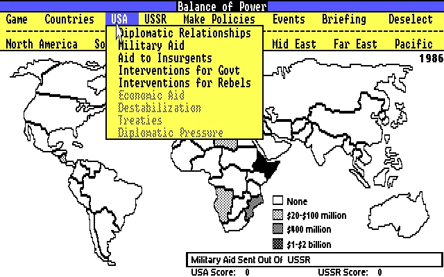
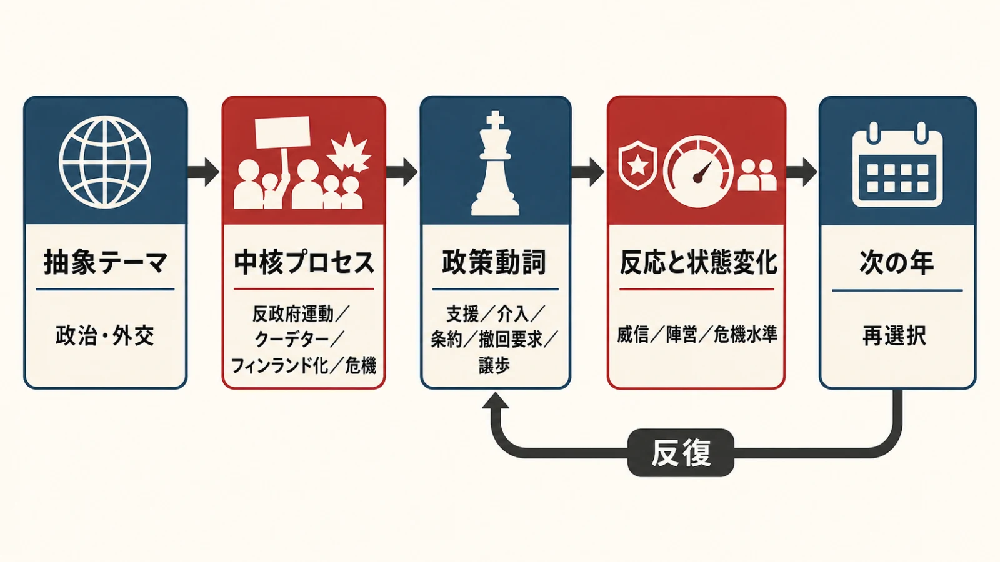
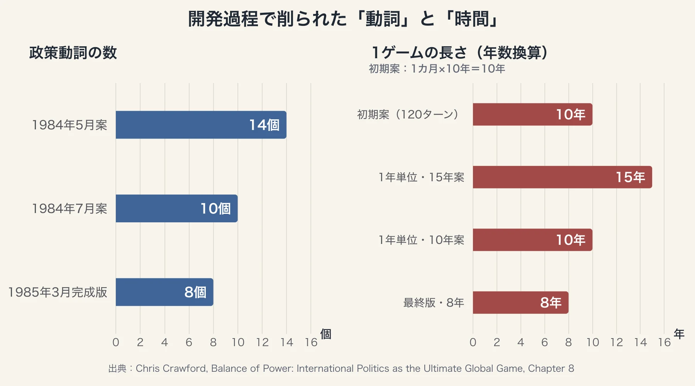
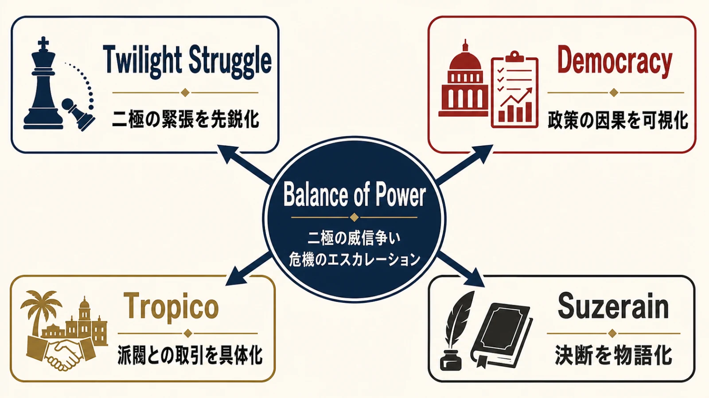
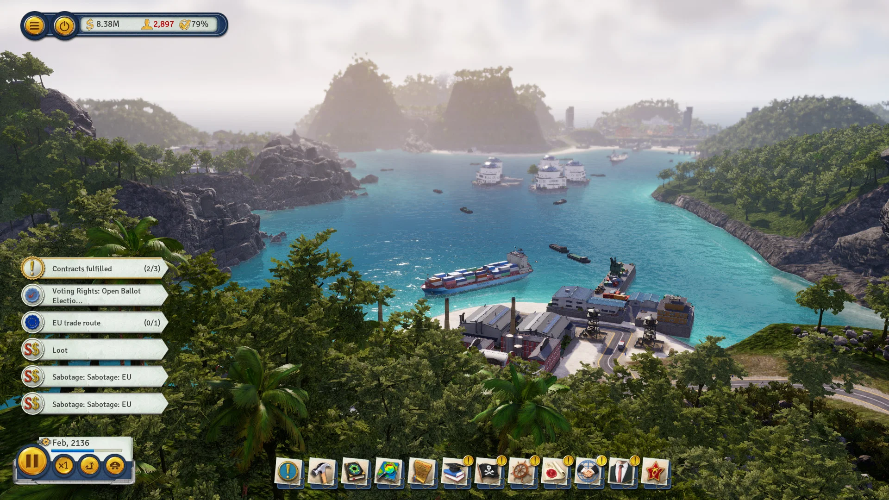

# 『バランス・オブ・パワー』は政治をどう動詞にしたか：抽象システムを遊びへ翻訳する設計

政治を題材にすると、企画書には「外交」「世論」「派閥」「国際緊張」といった名詞が並びやすい。しかし、名詞を増やすだけではプレイヤーの判断は生まれない。プレイヤーが選べる動詞、その選択を受けて状況が変わるプロセス、変化を読んでもう一度選ぶ反復構造が必要である。

Chris Crawford（クリス・クロフォード）が1985年に発表した『バランス・オブ・パワー（Balance of Power）』は、この翻訳を早い時期にやり遂げた作品である。冷戦下の国際政治を網羅しようとせず、二つの超大国、62カ国、8年間、8つの政策動詞、そして危機のエスカレーションへ切り詰めた。Crawford自身も、複雑な現実から明快さを取り出すための単純化こそ、自分の仕事の本質だと説明している。[[1](#ref-1)]

本稿では、政治史の再現度ではなく、抽象的な政治システムを「何をするか」と「何が繰り返されるか」へ変換した設計に注目する。後発作品との比較も、直接的な影響関係を断定するものではない。同じ設計課題に対する別解として横に並べる。

***

## 62カ国と8年間を、二人の威信争いに束ねる

プレイヤーは米国大統領かソ連書記長を選び、コンピューターがもう一方を担当する。舞台は62カ国、任期は8年間である。目的は領土の征服ではなく、自国の「威信」を相手より高めることにある。Crawfordは威信を、各国からどれだけ好意と尊敬を得ているかを、その国の軍事的重要度で重み付けしたものとして説明した。[[2](#ref-2)]

オリジナル版は1985年にMindscapeから発売された。[[3](#ref-3)] 日本語版『バランス・オブ・パワー -核時代の地政学-』もアスキーから発売され、1980年代末にかけて国産パソコンの複数機種へ移植された。

毎年、世界各地で事件が起こる。プレイヤーは反政府勢力への支援、経済援助、軍事援助、軍事介入、条約などの政策を選ぶ。相手の行動を看過できないと判断すれば撤回を要求し、相手は引き下がるか、要求をはねつける。対立が続くと危機の段階が上がり、DefCon 1に達した時点で核戦争となり、双方が敗北してゲームは強制終了する。[[2](#ref-2)]

終了画面は爆発の見せ場を用意しない。黒い画面に核戦争を起こした事実を告げ、最後に「We do not reward failure」と突き放す。これは演出の省略ではなく、核戦争を高得点の破壊イベントへ変えないためのルール表現である。破局へ近づくほど交渉は刺激的になるが、到達そのものは報酬にならない。Crawfordは、プレイテスターが実際には存在しなかった黒画面を記憶違いで説明したことから着想を得て、この演出を実装したと振り返っている。[[3](#ref-3)]

出典：MobyGames「[Balance of Power (DOS) screenshot: Select data to populate the map view (EGA low-res)](https://www.mobygames.com/game/259/balance-of-power/screenshots/dos/581908/)」（vileyn0id_8088提供、© 1985 Chris Crawford / Mindscape）。

この基本ループは、政治という大きな名詞を次の反復へ変換している。

1. 世界の事件を読む
2. 限られた政策動詞から介入の強さを選ぶ
3. 相手と各国の反応を受け取る
4. 威信の変化と危機の水準を評価する
5. 次の年に進み、累積した結果の上で再び選ぶ

核戦争はこの輪の外にある派手なエンディングではない。各周回の判断に上限を与え、「相手を押す」と「破局を避ける」を同時に考えさせる境界条件である。

***

## データの精度より、相互作用するプロセスを選ぶ

Crawfordは本作を、精密な地政学シミュレーションではなくゲームとして位置付けた。彼の整理では、シミュレーションは細部や精度を重視するのに対し、ゲームは衝突を明快にし、広い概念をプレイヤーが扱える形で伝える。国力データを増やすことよりも、プレイヤーが働きかけ、反応を読み、次の手を変えられるプロセスを重視したのである。[[2](#ref-2)]

設計の核に選ばれたのは、次の四つであった。

- **insurgency（反政府運動）**：国内の反政府勢力が成長し、超大国からの支援や介入によって内戦の力関係が変わる
- **coup d'état（クーデター）**：政権が軍事的な転覆にさらされ、成立すれば外交上の立場が変わる
- **Finlandization（フィンランド化）**：小国が強国の軍事的圧力を受け、直接占領されなくても外交姿勢を変える
- **crisis（危機）**：相手の政策に撤回を迫り、譲歩かエスカレーションかを交互に選ぶ

ここで重要なのは、四語が設定資料の分類ではなく、時間と因果を持つことだ。反政府運動は支援によって勢いを変え、クーデターは政権を置き換え、フィンランド化は力の差を外交姿勢へ伝え、危機は両者の選択を一段ずつ不可逆な破局へ近づける。状態を表示する名詞ではなく、入力と反応を結ぶプロセスとして実装されている。[[1](#ref-1)][[2](#ref-2)]

62カ国という数も、当時の世界を完全収録した結果ではない。Crawfordは、対象国を増やせばシミュレーションとしては詳しくなる一方、力の小さい国まで画面に並べると中心的な対立から注意がそれると考えた。そこで、超大国間の競争に意味を持つ国へ意図的に絞った。さらに貿易、多極構造、中立主義、小国間戦争、軍備管理、人権、協調的な外交施策なども候補から外した。メモリー容量の制約だけでなく、対立の明快さと理解しやすさを守る編集判断であった。[[2](#ref-2)][[4](#ref-4)]

***

## 14の動詞を8つへ削り、世界の自律性も切り詰める

完成版の簡潔さは、幾度もの試行錯誤の末にたどり着いたものである。Crawfordは同種の地政学ゲームを過去に3度立ち上げては行き詰まり、1984年に仮題『Arms Race』として再出発した。完成時の題名『Balance of Power』は、MindscapeのRoger Buoyによる提案だった。[[3](#ref-3)]

1984年5月の初期案には、反政府勢力へ武器を供与する、避難場所を与える、経済援助や軍事援助を行う、武器輸出を認める、禁輸する、介入する、相互防衛条約を提案する、首脳会談を開く、軍事的示威を行う、宣戦する、封鎖する、外交関係を結ぶ・断つ、言辞の強さを変えるという14の候補があった。7月の企画書では10まで減り、1985年3月に完成版の8動詞が固まった。[[3](#ref-3)]

期間にも同じ圧縮が起きている。当初案は1カ月を1ターンとする10年間、計120ターンであった。その後、1年単位へ大きく変え、15年、10年を経て最終的に8年へ収斂した。これは現実の時間を細かく刻むほど政治が深くなるとは限らないことを示す。1ターンの情報量と、一つの政策が結果へつながるまでの見通しを揃える方が、判断の意味を読み取りやすい。[[3](#ref-3)]

さらに初期の『Arms Race』では、米ソ以外の国も超大国とほぼ同じ政策を選べる多極的な構造だった。開発が進むにつれて非超大国の行動は減ったが、宣戦する権限だけを残した段階でも、プレイテスターの反応は一貫していた。画面内で自律的に起こる出来事が多すぎて理解しにくく、自分では制御できない世界に放り込まれたように感じたのである。Crawfordは現実らしさを気に入りながらも、最終的には非超大国を受動的な勢力へ縮小した。[[3](#ref-3)]

ここから得られる教訓は、NPCの自律性を高めれば必ず政治らしくなる、というものではない。プレイヤーが観測し、原因を推測し、次の選択を修正できる範囲を超えると、自律性は政治の複雑さではなくノイズとして届く。動詞の数と同様、世界が一度に発する「主語」の数にも注意予算がある。

***

## 後発4作品は、政治を別の反復へ翻訳した

『Balance of Power』の後に登場した政治ゲームは、同じ画面やルールを受け継いだわけではない。二極の緊張、政策の因果、派閥との取引、決断の物語化という別々の軸を伸ばしている。

*図の矢印は、各作品への直接的な影響関係ではなく、本稿で比較する設計上の対応を示す。*

| 作品 | 主な動詞 | 繰り返し構造 | 『Balance of Power』との設計上の対応 |
| --- | --- | --- | --- |
| 『Twilight Struggle』 | カードを事件か作戦として使う、影響力を置く、クーデターや再編を行う | 手札を読み、限られた作戦値を配り、地域得点とDEFCONを管理する | 二極対立と核戦争の上限を、共有カードと盤上の影響力へ変換 |
| 『Democracy』シリーズ | 政策を導入・廃止する、税率や予算を調整する | 政策の効果が経済・社会指標・有権者集団へ伝わり、支持と選挙へ戻る | 国外の威信争いを、国内の因果ネットワークと再選へ置換 |
| 『Tropico』シリーズ | 建設する、雇用する、布告する、派閥を満足させる・抑える | 都市の生産と生活を回し、派閥支持・選挙・権力維持へつなぐ | 抽象的な小国を、生活する住民と利害集団を持つ統治空間へ具体化 |
| 『Suzerain』 | 法案へ署名・拒否する、予算を配る、人事を決める、交渉する | 会話と報告を読み、決断し、その結果を人物関係と国家状況の双方で受け取る | 数値だけでは見えにくい政策の代償を、物語と人物の記憶へ展開 |

### 『Twilight Struggle』――相手の事件まで手札に入れる

GMT Gamesが2005年に発売した2人用ボードゲーム『Twilight Struggle』は、Ananda GuptaとJason Matthewsがデザインし、1945年から1989年までの冷戦を扱う。地図上の影響力、地域得点、宇宙開発競争、DEFCONを、歴史上の事件を記したカードで動かす。核戦争がゲーム終了を招く点と、世界各地を米ソの競争へ束ねる点は『Balance of Power』と対応する。[[5](#ref-5)]

発展点は、カードが自分に有利な作戦値と、相手に有利な歴史事件を同居させることにある。強い行動を選ぶほど、相手側の事件を発生させる可能性がある。緊張は危機専用画面だけでなく、毎回のカード選択へ分散した。Playdekによるデジタル版は2016年4月13日に発売され、コンピューター対戦やオンライン対戦へ同じ2人用構造を移した。[[6](#ref-6)]

### 『Democracy』――政策を因果の網へ接続する

Cliff Harrisが率いるPositech Gamesの『Democracy』は2005年に始まった。Positech GamesはHarrisがプログラムとゲームデザインを担う一人会社として運営されてきた。[[7](#ref-7)][[8](#ref-8)] プレイヤーは大統領または首相として、政策、法律、税、予算を変更し、経済や犯罪、医療などの指標と有権者集団の支持を動かしながら再選を目指す。

このシリーズの中心は、政策を単発の正解選択肢にせず、複数の集団と指標へ異なる強さ・時間差で作用させる因果ネットワークである。外交上の一手に対する相手国の反応を扱った『Balance of Power』に対し、『Democracy』は一つの政策が社会内部へ波及し、支持率として戻る過程を前景化した。最新版『Democracy 4』の公式説明も、政策・法律・行動を選び、国を変えながら再選に足る支持を維持する構造を掲げている。[[9](#ref-9)]

### 『Tropico』――派閥を、島で暮らす人々にする

初代『Tropico』はPopTop Softwareが開発し、Gathering of Developersから2001年に発売された。[[10](#ref-10)][[11](#ref-11)] 現在の旧作販売とシリーズ展開はKalypso Mediaが担っている。[[12](#ref-12)] プレイヤーはカリブ海の島国を治める独裁者El Presidenteとなり、都市建設と産業運営を進めながら、住民の需要、政治派閥、選挙、反乱、軍事力を管理する。

『Balance of Power』では介入対象だった小国の内部を、『Tropico』はプレイ空間そのものにしたと比較できる。政策の結果は抽象的な威信だけでなく、住民がどこで働き、何を不足と感じ、どの派閥を支持するかとして現れる。政治判断と都市運営が同じ住民を介して結ばれるため、道路や住宅の配置さえ権力維持のプロセスに入る。

出典：[Steam『Tropico 6』公式ストアページ](https://store.steampowered.com/app/492720/Tropico_6/)（スクリーンショット、© Kalypso Media）。

### 『Suzerain』――政策の代償を人物に記憶させる

Torpor Gamesが2020年12月4日に発売した『Suzerain』は、架空国家Sordlandの大統領Anton Rayneを主人公とするテキスト主体の政治ドラマである。安全保障、経済、福祉、外交をめぐる決定が、国家指標だけでなく、閣僚、政党、家族との関係へ分岐していく。公式ストアも本作をビジュアルノベル、インタラクティブフィクション、政治シミュレーションとして分類し、分岐する政治物語と影響を持つ選択を中心に掲げている。[[13](#ref-13)]

ここでは「法案に署名する」という同じ動詞でも、会議までに交わした約束や人物への信頼が意味を変える。『Balance of Power』がニュースと数値で政策の反作用を読ませたのに対し、『Suzerain』は会話、沈黙、関係の悪化をフィードバックに加えた。意思決定を物語化するとは選択肢の文章を長くすることではなく、決断を誰が覚え、後の場面でどう返すかを設計することである。

***

## 政治という名詞から、遊べる設計を起こす手順

これらの作品を横に並べると、抽象テーマを具体化する作業を六段階に整理できる。

1. **対立の軸を一文にする**：米ソの威信、政権と有権者、独裁者と派閥など、誰の評価が勝敗や継続を決めるかを定める
2. **題材を動詞へ変える**：「外交がある」ではなく、援助する、介入する、要求する、譲歩するという選択可能な形にする
3. **少数の中核プロセスを選ぶ**：現実の制度一覧ではなく、入力、状態変化、反応が循環する三つから五つ程度の過程へ絞る
4. **結果の戻り道を決める**：数値、地図、住民行動、会話など、プレイヤーが因果を推測できるフィードバックを用意する
5. **時間差と境界条件を置く**：政策の遅効性、選挙、危機水準、破局などによって、目先の利益と将来の危険を競合させる
6. **注意予算に合わせて削る**：動詞、主体、指標を一度に増やさず、プレイテストで「理解できない活動」が何かを特定して切り詰める

この工程で最も難しいのは、正確さを足すことではなく、どの因果を残せば題材の手触りが生まれるかを決めることである。『Balance of Power』は貿易や多極構造を削ったが、支援が政情を動かし、圧力が陣営を動かし、要求が危機を動かす線は残した。その線があるから、62カ国のデータは背景ではなく判断材料になる。

***

## まとめ：テーマを説明せず、プロセスを体験させる

『Balance of Power』が示したのは、政治の複雑さをすべて収録する方法ではない。政治を感じさせる因果を選び、プレイヤーの動詞を絞り、反応を読み直す8年間のループへ束ねる方法である。核戦争の黒画面も、四つの中核プロセスも、非超大国の自律性を削った判断も、同じ目的に向かっている。選択の意味を明快にし、その責任をプレイヤーへ返すことである。

この設計手法は政治ゲームに限らない。企業経営なら採用する、投資する、値上げする。生態系なら保護する、捕獲する、外来種を導入する。人間関係なら約束する、隠す、打ち明ける。題材を代表する動詞を選び、結果が戻るプロセスを作り、次の選択へつなげれば、抽象的なテーマは遊べる構造になる。

企画の出発点は「何を再現するか」だけでは足りない。「プレイヤーは何を繰り返し、そのたびに何を読み直すのか」と問い直すことで、テーマは初めてゲームの時間を持つ。

## References

1. [Chris Crawford, *Balance of Power: International Politics as the Ultimate Global Game* — Introduction][1] - 四つの中心プロセスと、明快さのために現実を単純化する設計方針を説明した著者自身の文章。

2. [Chris Crawford, *Balance of Power: International Politics as the Ultimate Global Game* — Chapter 1: Balance of Power][2] - 62カ国、8年間、威信、危機、ゲームとシミュレーション、データよりプロセスを重視する立場を説明した章。

3. [Chris Crawford, *Balance of Power: International Politics as the Ultimate Global Game* — Chapter 8: How Balance of Power Was Created][3] - 『Arms Race』から完成までの試行、動詞と期間の削減、プレイテスト、黒い終了画面の成立過程を記した開発史。

4. [Chris Crawford, *Balance of Power: International Politics as the Ultimate Global Game* — Chapter 6: The Unincluded Factors][4] - 貿易、多極構造、小国間戦争などを除外した理由を説明した章。

5. [GMT Games「Twilight Struggle」][5] - 2005年発売、デザイナー、2人用の冷戦構造、カード、影響力、核緊張を説明した公式ページ。

6. [Steam「Twilight Struggle」][6] - Playdekによるデジタル版の発売日、開発・発売元、ゲーム内容を掲載したストアページ。

7. [MobyGames「Democracy」][7] - 初代『Democracy』の2005年発売、開発・発売元を収録したゲーム資料。

8. [Positech Games「About」][8] - Cliff Harrisと一人会社としての開発体制を説明した公式ページ。

9. [Positech Games「Democracy 4」][9] - 政策、法律、行動、支持、再選とシミュレーションの構造を説明した公式ページ。

10. [Internet Archive「Tropico Demo」][10] - PopTop Software開発、Gathering of Developers発売、2001年の発売情報を収録したソフトウェア保存記録。

11. [MobyGames「Tropico」][11] - 住民ごとの政治的立場や派閥行動など、初代『Tropico』のゲームシステムを説明した資料。

12. [Steam「Tropico Reloaded」][12] - PopTop Softwareを含む開発元、Kalypso Mediaによる現在の販売を掲載したストアページ。

13. [Steam「Suzerain」][13] - 2020年12月4日の発売日、Torpor Games、政治ドラマ、分岐、政策分野を掲載したストアページ。

[1]: http://www.erasmatazz.com/library/my-books/balance-of-power-the-book/introduction.html
[2]: http://www.erasmatazz.com/library/my-books/balance-of-power-the-book/chapter-1-balance-of-power.html
[3]: http://www.erasmatazz.com/library/my-books/balance-of-power-the-book/chapter-8-how-balance-of.html
[4]: http://www.erasmatazz.com/library/my-books/balance-of-power-the-book/chapter-6-the-unincluded.html
[5]: https://www.gmtgames.com/nnts/main.html
[6]: https://store.steampowered.com/app/406290/Twilight_Struggle/
[7]: https://www.mobygames.com/game/17501/democracy/
[8]: https://www.positech.co.uk/about.html
[9]: https://www.positech.co.uk/democracy4/
[10]: https://archive.org/details/TropicoDemo
[11]: https://www.mobygames.com/game/3937/tropico/
[12]: https://store.steampowered.com/app/33520/Tropico_Reloaded/
[13]: https://store.steampowered.com/app/1207650/Suzerain/

----

この文書は、Perplexity、Claude、OpenAI Codex の3つのAIの支援を受けて著述されたものです。引用画像を除き、MIT License にて提供されています。
