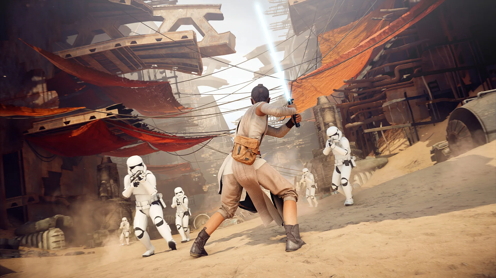

# 「誇りと達成感」の代償：Star Wars Battlefront IIが業界のルールを書き換えた日

***

## はじめに

2017年11月12日、あるコメントがインターネット上に投稿された。ゲーム会社EA（エレクトロニック・アーツ）の公式アカウントによるそのRedditコメントは、やがてギネスブックに「Reddit史上最多の低評価（downvote）を記録したコメント」として掲載される。現在でも683,000件以上の低評価が付いており、2位（約89,000件）に圧倒的な差をつけている。[[1](#ref-1)][[2](#ref-2)]

コメントはこう述べていた。「ヒーローをアンロックすることで、プレイヤーに **誇りと達成感** （a sense of pride and accomplishment）を提供することが私たちの意図です」。[[3](#ref-3)]

これは単なるPR失敗の話ではない。『Star Wars Battlefront II』の炎上は、ゲーム業界のマネタイズ設計に対して各国政府が規制に動く直接の引き金となり、業界がその後のルートボックス（loot box。課金またはプレイで入手・開封し、中身がランダムに決まる報酬箱）設計の指針を根本から見直す契機となった。新米ゲームプランナーがこのケースから学ぶべきことは多い。

***

## 第一章：何が起きたか

### ゲームの構造とマネタイズ設計

『Star Wars Battlefront II』（2017年）は、DICE・Criterion Games・Motive Studiosが共同開発し、EAが発売した60ドル（日本円で7,000〜8,000円台）のフルプライスゲームだ。前作への批判（DLCシーズンパスで課金が必要なコンテンツ追加）を受け、今作では「すべてのマップ・ヒーローキャラクターを無料で追加し続ける」とDICEが約束していた。問題は、その「無料追加コンテンツ」を補う形で設計されたマネタイズ構造にあった。[[4](#ref-4)]

*画像引用: [Steam - STAR WARS™ Battlefront™ II](https://store.steampowered.com/app/1237950/STAR_WARS_Battlefront_II/)（公式ストア掲載スクリーンショット, © Electronic Arts / Lucasfilm Ltd.。本文中の作品紹介・実ゲーム画面の説明に必要な範囲で引用）*

ゲームのマルチプレイヤーにはスターカードと呼ばれる能力強化カードが存在し、これを持つ側が戦闘で有利になる構造だった。スターカードはルートボックス（ゲーム内では「クレート」と呼称）から入手でき、クレートは **ゲームプレイで稼ぐ「クレジット」か、リアルマネーで購入する「クリスタル」のどちらかで開封できた**。[[5](#ref-5)][[4](#ref-4)]

これにより、 **課金した側が競技優位性を持つ「ペイ・トゥ・ウィン（P2W）」の構造** が出来上がっていた。[[5](#ref-5)]

### 炎上の引き金：「1ヒーロー40時間」の試算

炎上の直接の火種となったのは、RedditユーザーTheHotterPotatoによる試算だ。発売前のEA Access版（発売前の10時間限定先行プレイ）のプレイデータを分析した結果、ダース・ベイダーやルーク・スカイウォーカーといった最上位ヒーロー（各60,000クレジット）をアンロックするには **1体あたり約40時間の周回プレイが必要** と算出された。この数字はゲームメディアに取り上げられ、一気に拡散した。[[6](#ref-6)][[5](#ref-5)]

EAの公式Redditアカウントがこれに返答した内容が、冒頭の「誇りと達成感」コメントだ。このコメントは投稿直後から猛烈な低評価を受け始め、その後のギネス記録となる683,000件超の低評価へと積み上がっていった。[[3](#ref-3)][[1](#ref-1)]

EAはその後、ヒーローアンロックに必要なクレジットを **75%削減すると発表した**。しかし「価格を75%下げたのは値段が4倍だったから」と皮肉られ、炎上は収まらなかった。[[7](#ref-7)][[8](#ref-8)]

### タイムライン：発売前後の意思決定の連鎖

| 日付 | 出来事 |
|---|---|
| 2017年10月6日 | オープンベータ開始（先行アクセスは10月4日）、P2W問題が浮上[[9](#ref-9)] |
| 2017年11月9日 | EA Access（早期アクセス）でP2W構造が確認される[[5](#ref-5)] |
| 2017年11月12日 | 「誇りと達成感」コメント投稿、即座に大量の低評価[[3](#ref-3)] |
| 2017年11月13日 | EAがヒーローコスト75%削減を発表[[7](#ref-7)] |
| 2017年11月16日 | ディズニー幹部のジミー・ピタロ氏がEA CEOに連絡、ディズニーの懸念を伝達[[10](#ref-10)][[11](#ref-11)] |
| 2017年11月16日 | 発売直前にEAが少額課金（マイクロトランザクション）を全面停止[[4](#ref-4)][[9](#ref-9)] |
| 2017年11月17日 | 正式発売（少額課金停止状態のまま） |
| 2017年11月19日 | 英国初週物理販売が前作比 **61%減** と報道[[12](#ref-12)][[13](#ref-13)] |
| 2017年11月21日 | ベルギー賭博委員会が調査着手を表明[[14](#ref-14)] |
| 2018年4月 | ベルギー賭博委員会、有料ルートボックスを賭博法違反と結論（『Battlefront II』は対象4タイトル中唯一の非該当）[[20](#ref-20)] |
| 2018年3月21日 | 進行システムを完全刷新。スターカードの課金購入を廃止[[15](#ref-15)][[16](#ref-16)] |
| 2018年4月 | 少額課金を再開（外見変更アイテムのみ）[[17](#ref-17)] |

***

## 第二章：なぜそうなったのか

### 2-1. 「見た目と性能強化を同じ箱に入れた」設計ミスの本質

『Battlefront II』のルートボックスが特に問題視されたのは、 **外見変更アイテム（見た目）と性能に影響するアイテム（スターカード）が同じ箱から出る構造だったからだ**。[[18](#ref-18)]

後に『オーバーウォッチ』（外見変更のみ）や『Apex Legends』（外見変更のみ）が示したように、「見た目の変化のみを売る」モデルなら課金ユーザーと無課金ユーザーの間に競技面での格差は生まれない。『Battlefront II』はこの「見た目と強化の分離」を怠ったことで、P2Wと厳しく批判された。[[15](#ref-15)][[18](#ref-18)]

EAが最終的に採用した解決策はまさにこの分離だ。2018年3月のアップデートでスターカードの課金購入を廃止し、外見変更アイテムのみを課金対象にしたことで騒動は収束に向かった。 **最初からそうすべきだった設計が、炎上後に採用されたという事実** が、この判断のタイミングの問題を端的に示している。[[16](#ref-16)][[15](#ref-15)]

### 2-2. ディズニーが動いた：IPホルダーの圧力

見落とされがちな重要な事実がある。少額課金の撤回判断は、EAがコミュニティの声に自発的に応じたのではなく、 **ディズニーの直接介入が引き金となった可能性が高い** ということだ。

複数の報道によれば、ディズニー傘下で消費財・インタラクティブメディア部門を率いるジミー・ピタロ氏が、EAのアンドリュー・ウィルソンCEOに直接連絡を取り、ディズニーとボブ・アイガーCEOの懸念を伝えたとされる（連絡手段については「電話」と報じた媒体と「書簡」と報じた媒体があり、報道により食い違いがある）。その数時間後に少額課金の撤回が発表された。ルーカスフィルムも、スター・ウォーズは常にファンのためにあるとして、EAが一時的にゲーム内課金を停止する決断を支持するとの声明を発表した。[[10](#ref-10)][[11](#ref-11)][[9](#ref-9)]

『スター・ウォーズ／最後のジェダイ』の公開を1ヵ月後に控えたタイミングで、IPそのものにブランドダメージが及ぶことをディズニーが看過できなかった構図だ。[[11](#ref-11)]

このエピソードはゲームプランナーにとって重要な教訓を含んでいる。 **大型IPを使ったゲームの場合、マネタイズ設計はIPホルダーとの関係性にも直接影響する**。設計段階でIPオーナーが受け入れられないリスクを想定できていたか、という問いは無視できない。

### 2-3. 「無料コンテンツ追加」約束との矛盾が生んだ不信感

前作『Star Wars Battlefront』（2015年）は「DLCをシーズンパスで売る」モデルへの批判が多かった。『Battlefront II』ではこれを廃止し、「すべてのマップ・キャラクターを無料追加する」と発表した。[[4](#ref-4)]

プレイヤーはこの発表を「課金圧力がなくなる」と受け取った。しかし実際のゲームには、基本コンテンツへのアクセスを阻む形でルートボックスが設置されていた。 **「無料にしました」という約束と「でも有利になりたければ課金してください」という構造の矛盾** が、裏切られた感覚を増幅させた。[[19](#ref-19)]

「無料更新」という言葉で期待値を上げた上でP2Wモデルを採用することは、「何も約束していないまま課金を求める」より大きな反発を生む——これはマネタイズ設計が約束管理とセットで考えなければならないことを示している。

***

## 第三章：業界全体への波及効果

### 各国の規制動向

『Battlefront II』の炎上が特異だったのは、ゲーム業界内に留まらず **世界各国の政府・規制機関を動かした** 点にある。

- **ベルギー**：賭博委員会が『Battlefront II』の炎上を契機に、ルートボックスを含む4タイトル（FIFA 18・オーバーウォッチ・CS:GO・『Battlefront II』）を調査し、2018年4月、「ルートボックスへのリアルマネー支払いはギャンブルに相当する」として有料ルートボックスをベルギー賭博法違反と結論づけた。ただし **この4タイトルのうち、『Battlefront II』だけは違反とされなかった**。EAが発売前に有料少額課金を停止していたため、調査時点で問題のルートボックスが存在しなかったからだ。皮肉にも、炎上を受けて自主的に有料要素を撤去した判断が、結果的に唯一の「シロ」判定につながった。委員会はEA・Valve・Activision Blizzardに対応を求め、違反企業には罰金や禁錮刑もありうると警告した。[[14](#ref-14)][[20](#ref-20)]
- **オランダ**：賭博監督機関も同時期に調査を行い、ルートボックスを含む特定ゲームに対し是正を求めた。後にEAはFIFAのルートボックスをめぐり同国で制裁の対象となった（その後、裁判で判断が覆る経緯をたどった）。
- **アメリカ・ハワイ州**：州議員が「スター・ウォーズをテーマにしたオンラインカジノ、子どもに課金させるよう設計されている」と発言し、未成年へのルートボックスを含むゲーム販売を禁止する法案を提出した。[[14](#ref-14)]
- **2025年のベルギー判決**：ベルギーのアントワープ企業裁判所は2025年1月16日、別タイトル（Top War: Battle Game）のルートボックスをめぐる訴訟で、 **当該ゲームのルートボックスをベルギー賭博法上の「賭博」に該当すると認定** した。そのうえで、Apple社がこのゲームをApp Storeで提供・宣伝した行為がベルギー賭博法に抵触するとしつつ、プラットフォーム事業者がeコマース指令の免責（セーフハーバー）を享受できるかという論点をEU司法裁判所（CJEU）に付託しており、Appleの最終的な責任は確定していない（その後、AppleはCJEUの判断を待たず原告と和解したと報じられている）。『Battlefront II』に端を発した「ルートボックス＝賭博」という法的議論が、プラットフォームホルダーの責任という新局面にまで及んだことを象徴する事例である。[[20](#ref-20)]

2026年現在、PEGIはルートボックス（有料ランダムアイテム）を含むゲームを原則として最低PEGI 16に分類する制度改訂を実施しており[別記事：審査レギュレーション]、この流れは『Battlefront II』を大きな契機の一つとする一連のルートボックス論争の延長線上にある。

### EA株価・売上への影響

財務面での被害も明確に記録されている。

| 指標 | 数値 | 備考 |
|---|---|---|
| EAの株価下落（月次） | 8.5%減 | S&P 500が同期間に2%上昇する中[[21](#ref-21)] |
| 時価総額の消失額 | 約31億ドル | 月次累計[[21](#ref-21)][[22](#ref-22)] |
| 英国初週物理販売 | 前作比61%減 | GfK ChartTrackデータ[[12](#ref-12)][[23](#ref-23)] |
| 米国11月販売 | 前作比52%減 | NPD調査[[24](#ref-24)] |
| 目標販売数との乖離 | 約250万本不足の見通し | EAの年間ガイダンス1,400万本に対し、発売直後のアナリスト予測[[24](#ref-24)] |
| 最終的な四半期実績 | 約900万本 | ホリデー四半期。EAの目標1,000万本を下回る（CFO発言） |

***

## コラム：「プレイヤーは不合理なのか、それとも正当だったのか」

『Battlefront II』の炎上は「プレイヤーの過剰反応では？」と見る向きもある。実際、EA側は「ゲームをプレイして稼ぐことでヒーローはアンロックできる。課金は任意だ」と主張していた。[[4](#ref-4)]

しかし問題の核心は「課金できるかどうか」ではなく、 **「課金した側が競技優位性を持つ構造が、フルプライスゲームに存在することの是非」** だ。無料プレイ（F2P）タイトルでのP2W設計と、60ドルを先払いしてから競技場で不平等に置かれることは、プレイヤーの心理的文脈として全く異なる。

また、「誇りと達成感」というコメントが683,000件の低評価を受けた理由は、内容の問題だけではなかった。プレイヤーが訴えているのは「不当なP2W設計」という具体的な問いだったのに対し、EAが返したのは「私たちの設計意図の説明」だった。 **問いにすれ違う形で回答することが、コミュニティの怒りをさらに増幅させた** のだ。コミュニティ管理において「何を言うか」だけでなく「問われていることに答えているか」は、プランナーとしての基礎スキルでもある。[[1](#ref-1)]

***

## ゲームプランナーへの教訓

| 問題の構造 | 『Battlefront II』での現れ方 | 現場への応用 |
|---|---|---|
| **見た目と性能強化の混在** | ルートボックスにスターカード（強化）と外見変更アイテムが同居[[18](#ref-18)] | フルプライスゲームでの課金設計は「見た目のみ」を原則にする。性能強化への課金はP2Wと認定されるリスクを織り込む |
| **約束との矛盾** | 「無料コンテンツ更新」約束とP2W設計が同居[[4](#ref-4)] | マネタイズ設計は「ユーザーへの約束」と整合しているかを必ずチェックする |
| **IPホルダーとの関係** | ディズニーの直接介入で少額課金を撤回[[10](#ref-10)][[11](#ref-11)] | 大型IPを使う場合、マネタイズ設計をIPホルダーにも事前確認する |
| **コミュニティ対応の「すれ違い」** | 「誇りと達成感」コメントが問いに答えなかった[[3](#ref-3)][[1](#ref-1)] | 炎上時の公式コメントは「プレイヤーが何を問うているか」を明確にした上で返答する |
| **規制リスクの見落とし** | ベルギー・米国州議員・PEGI改訂などの動きを呼ぶ契機となった[[14](#ref-14)][[20](#ref-20)] | ランダム課金要素は各国の賭博規制との整合性を法務チームと確認する |

『Battlefront II』の最大の皮肉は、ゲーム自体の品質への評価は決して低くなかった点だ。グラフィック・マルチプレイヤーのゲームプレイ自体は高く評価されていた。 **優れたゲームが、マネタイズ設計の一つの判断ミスによって記録的な炎上の事例として歴史に刻まれた。** 設計そのものと、その収益化の仕組みが分離して評価されることはなく、一体として受け取られる。このことをプランナーは常に意識しておく必要がある。[[25](#ref-25)]

---

## References

1. [EA is in the Guinness World Record book for most downvoted comment on Reddit][1] - EAのRedditコメントが68万件超の低評価を集め、ギネス世界記録に掲載されたことを報じる記事。

2. [EA's Worst Reddit Comment Set a World Record ｜ Tom's Hardware][2] - 当該コメントが『Star Wars Battlefront II』のルートボックス論争への返信だったことを説明する記事。

3. [EA response to Star Wars Battlefront II controversy becomes the most downvoted in Reddit history][3] - 「誇りと達成感」コメントがReddit史上最多級の低評価を受けた経緯を報じる記事。

4. [Star Wars Battlefront 2's Loot Box Controversy Explained - GameSpot][4] - ベータ版の進行システム、無料DLC方針、少額課金停止までの流れを整理した解説記事。

5. ['Star Wars: Battlefront II' Gave EA the Most Downvoted Comment in Reddit History][5] - クレート、スターカード、P2W批判、Redditでの反発を扱うVICE記事。

6. [Most downvoted comment on Reddit? EA Star Wars Battlefront 2][6] - ヒーロー解放時間とEAの返信を扱う動画資料。

7. [Star Wars Battlefront II: Why the new game is proving so controversial][7] - ヒーロー解放コストとEAの75%削減発表を報じるABC記事。

8. [The time that EA got a sense of "pride and accomplishment"][8] - Reddit側で騒動の経緯やミーム化を振り返る投稿。

9. [A Guide To The Endless, Confusing Star Wars Battlefront II Controversy][9] - ベータから発売直前の課金停止までの複雑な経緯を整理したKotaku記事。

10. [Star Wars Battlefront II lockbox controversy prompted Disney intervention][10] - ディズニー側の介入が課金停止判断に影響したと報じる記事。

11. [Did Disney Tell EA to Remove Star Wars Battlefront 2 Microtransactions?][11] - ディズニー、ボブ・アイガーCEO、ルーカスフィルム声明に触れるGameRant記事。

12. [Star Wars Battlefront II physical sales drop 60 percent over first game][12] - 英国初週パッケージ販売が前作比61%減だったことを報じる記事。

13. [UK boxed charts: Disappointing debut for Star Wars Battlefront II][13] - GfK ChartTrackベースの英国パッケージ販売動向を報じるGamesIndustry.biz記事。

14. [Belgium moves to ban 'Star Wars Battlefront 2'-style loot boxes][14] - ベルギーやハワイ州の規制反応を報じるEngadget記事。

15. [EA details huge changes to Star Wars Battlefront II's progression system][15] - 進行システム刷新とP2W批判への対応を扱う記事。

16. ['Star Wars Battlefront II' Officially Ditches Paid Loot Boxes - VICE][16] - 有料ルートボックス廃止と外見変更アイテム中心への転換を報じる記事。

17. [Star Wars: Battlefront 2 Update Restores Microtransactions][17] - 2018年4月の少額課金再開と対象範囲を報じるGameSpot記事。

18. [Opinion: Star Wars: Battlefront 2 Beta Raises Pay-To-Win Fears - IGN][18] - 外見変更アイテムと性能強化が同じ報酬箱に入る設計への懸念を述べる記事。

19. [EA's day of reckoning is here after 'Star Wars' game uproar - CNBC][19] - 騒動がEAの事業慣行や投資家評価に与えた影響を扱うCNBC記事。

20. [Antwerp Court's LS v. Apple Ruling: Loot Boxes & Platform Liability][20] - ベルギーでのルートボックス規制と2025年のTop War訴訟を解説する法律事務所記事。

21. [EA has lost $3 Billion in Stock Value due to Star Wars Battlefront 2][21] - EA株価の月次下落とS&P 500との比較を引用するReddit投稿。

22. [EA Shares Plummet After 'Star Wars: Battlefront II' Loot Box Fiasco][22] - EA株価下落と時価総額減少を報じるForbes記事。

23. [Star Wars Battlefront II first week UK boxed sales are 61% down][23] - 英国初週パッケージ販売の前年比較に触れるChris Dring氏の投稿。

24. [Analyst cuts EA price target after 'Star Wars' game sales plunge][24] - 米国販売減、目標販売数との乖離、アナリスト予測を報じるCNBC記事。

25. [Why Star Wars Battlefront 2 Is Having a Major Comeback!][25] - 発売後の評価変化やプレイヤー数回復を扱う動画資料。

[1]: https://www.kitguru.net/gaming/matthew-wilson/ea-is-in-the-guinness-world-record-book-for-most-downvoted-comment-on-reddit/
[2]: https://www.tomshardware.com/news/most-unpopular-reddit-comment-world-record-ea-downvotes,40354.html
[3]: https://mcvuk.com/business-news/ea-response-to-star-wars-battlefront-ii-controversy-becomes-the-most-downvoted-in-reddit-history/
[4]: https://www.gamespot.com/articles/star-wars-battlefront-2s-loot-box-controversy-expl/1100-6455155/
[5]: https://www.vice.com/en/article/star-wars-battlefront-most-downvoted-comment-on-reddit/
[6]: https://www.youtube.com/watch?v=ynxaKeEz_dE
[7]: https://www.abc.net.au/news/2017-11-14/star-wars-battlefront-most-downvoted-reddit-comment/9147524
[8]: https://www.reddit.com/r/MuseumOfReddit/comments/8ish3t/the_time_that_ea_got_a_sense_of_pride_and/
[9]: https://kotaku.com/a-guide-to-the-endless-confusing-star-wars-battlefront-1820623069
[10]: https://massivelyop.com/2017/11/20/star-wars-battlefront-ii-lockbox-controversy-prompted-disney-intervention/
[11]: https://gamerant.com/disney-electronic-arts-star-wars-battlefront-2-microtransactions/
[12]: https://www.windowscentral.com/star-wars-battlefront-ii-physical-sales-drop
[13]: https://www.gamesindustry.biz/uk-boxed-charts-disappointing-debut-for-star-wars-battlefront-ii
[14]: https://www.engadget.com/2017-11-22-belgium-moves-to-ban-star-wars-battlefront-2-style-loot-boxes.html
[15]: https://www.windowscentral.com/ea-details-huge-changes-star-wars-battlefront-iis-progression-pay-win-gone-good
[16]: https://www.vice.com/en/article/star-wars-battlefront-ii-officially-ditches-paid-loot-boxes/
[17]: https://www.gamespot.com/articles/star-wars-battlefront-2-update-restores-microtrans/1100-6457462/
[18]: https://www.ign.com/articles/2017/10/07/opinion-star-wars-battlefront-2-beta-raises-pay-to-win-fears
[19]: https://www.cnbc.com/2017/11/28/eas-day-of-reckoning-is-here-after-star-wars-game-uproar.html
[20]: https://www.taylorwessing.com/en/insights-and-events/insights/2025/03/an-iphone-a-gambling-problem-and-the-loot-box-debate
[21]: https://www.reddit.com/r/PS4/comments/7g83dg/ea_has_lost_3_billion_in_stock_value_due_to_star/
[22]: https://www.forbes.com/sites/erikkain/2017/11/28/ea-shares-plummet-after-star-wars-battlefront-ii-loot-box-fiasco/
[23]: https://x.com/chris_dring/status/932542228861513729
[24]: https://www.cnbc.com/2017/12/11/analyst-cuts-ea-price-target-after-star-wars-game-sales-plunge.html
[25]: https://www.youtube.com/watch?v=d4NtCOSBVog

----

この文書は、Perplexity、Claude、OpenAI Codex の3つのAIの支援を受けて著述されたものです。引用画像を除き、MIT License にて提供されています。
