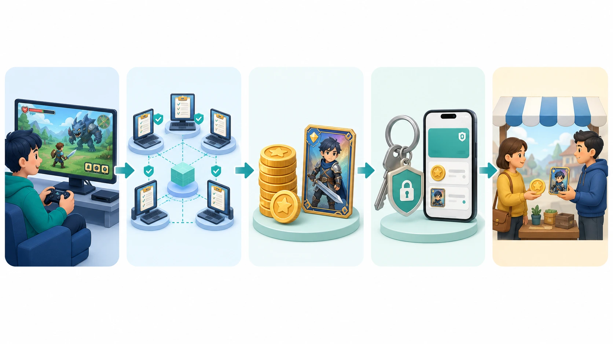
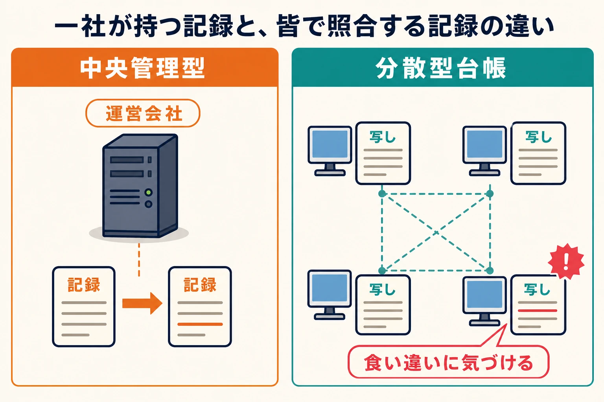
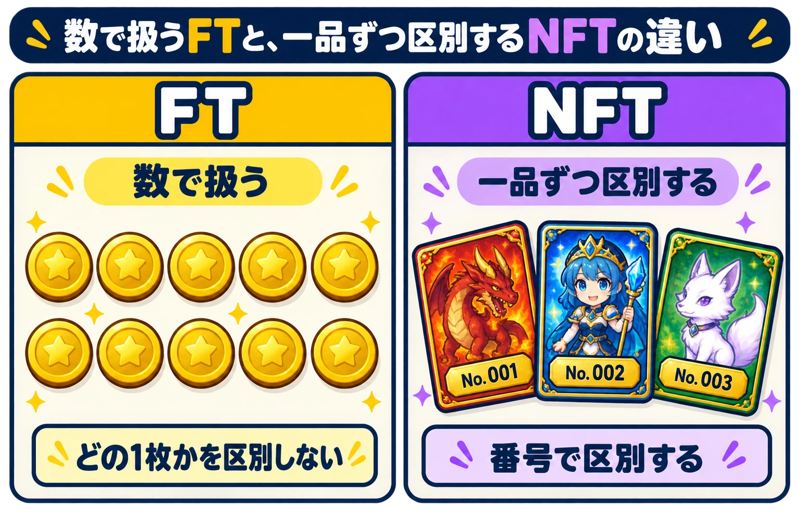

# ブロックチェーンとP2Eとは何か――ゲームプランナーのための基礎知識ガイド

P2Eの記事を読むと、ブロックチェーン、暗号資産、トークン、NFT、ウォレットという言葉が続けて現れる。名前は似ているが、同じものを指す言葉ではない。混乱しやすいのは、ゲーム、記録の仕組み、デジタルな資産、資産を操作する道具、外部の取引が、一つの企画に同時に登場するためである。

本ブログにあるP2Eの企画チェックリスト、『TOKYO BEAST』の事例、NEXT Bayの記事は、それぞれ企画判断、個別タイトル、外部取引を扱っている。本稿はそれらを読む前に、五つの言葉がどの役を担うのかを整理するための土台である。専門用語を暗記する必要はない。まず、ゲームの中で起きることを順に追えばよい。

*P2Eで起こりうる流れ。ゲームを遊ぶこと、記録を共有すること、資産を扱うこと、外部で取引できることは、それぞれ別の役割である。*

***

## 1. まずは、五つの言葉の役割を分ける

この一文だけを先に押さえればよい。

> **ブロックチェーン** は記録帳、**トークン** は記録帳に書かれるしるし、**NFT** は一品ずつ番号が付いたしるし、**ウォレット** はそれを動かす鍵、**P2E** はそれらをゲームの報酬と結び付ける設計である。

**暗号資産** は、こうしたデジタルな価値のうち、外部で売買・交換され、市場で価格が付くものを指す。ゲームに出てくる「コイン」や「ポイント」がすべて暗号資産になるわけではない。ゲーム内だけで使え、外へ送れないコインは、通常のゲーム内通貨として扱える。

ここで大切なのは、順番である。P2Eはブロックチェーンの別名ではない。ブロックチェーンは記録の方法、トークンとNFTは記録する対象、ウォレットは利用者が操作する道具、P2Eはゲーム内の行動と外部価値をつなぐゲーム設計の呼び方である。

***

## 2. ブロックチェーンは、皆で照合する記録帳である

普通のオンラインゲームでは、誰がどのアイテムを持っているかを、運営会社のデータベースに記録する。プレイヤーがクエストをクリアすれば、運営のサーバーが「このアカウントに剣を一つ追加する」と記録する。誤りや不正があれば、運営が記録を調べて直す。この形は、多くのゲームで自然に機能している。

ブロックチェーンは、その記録帳を一社だけが持つのではなく、ネットワークに参加する多くのコンピューターで共有する方法である。新しい記録を追加するときは、参加者が内容を照合し、同じ記録を持つ。Ethereumなどの公開型ブロックチェーンでは、こうして記録を持つコンピューターを「ノード」と呼ぶ。Ethereumはブロックチェーンの一般名ではなく、数ある公開型ブロックチェーンの一つの名前である。この記事では、仕組みを理解するための代表例として使う。[[1](#ref-1)]

たとえば、クラス全員が同じ当番表の写しを持っている場面を考える。一人だけが自分の写しの過去の当番を消しても、ほかの人の写しと比べれば食い違いが分かる。皆で内容を確かめてから新しい予定を書き足すなら、一人だけが後から都合よく書き換えることは難しい。

「ブロック」は、追加する記録をひとまとめにしたページである。「チェーン」は、新しいページが前のページとつながり、順番に並ぶことを表す。過去のページを変えると、その後のページとのつながりが合わなくなり、ほかの参加者の記録とも一致しない。このため、確定後の記録は後から変えにくい。[[1](#ref-1)]

ただし、ブロックチェーンが正しさを自動で保証するわけではない。ゲームの外から入力した情報が間違っていないか、盗まれた鍵をどう扱うか、利用規約に反したプレイヤーをどう判断するかは、別に決めなければならない。ブロックチェーンは、あくまで「誰が何を持つか」という記録の持ち方を変える技術である。

*一社だけが記録を持つ場合と、複数の写しを照合する場合では、書き換えがほかの記録と食い違ったときの見え方が異なる。*

***

## 3. トークンとNFTは、記録帳に書かれる「しるし」である

**トークン** は、ブロックチェーンの記録帳に「このアドレスがこれを持つ」と書くためのデジタルな単位である。ポイントカードのスタンプ、ゲーム内通貨、会員証、入場券のように、何を表すかは企画次第で決められる。

トークンには、初心者がまず区別すればよい二つの型がある。

- **同じ単位を数で扱う型（FT）**：1枚と1枚を取り替えても困らない通貨のような型である。たとえば「報酬コインを10枚受け取る」場合、どの1枚かを区別する必要はない。FTはFungible Tokenの略で、日本語では代替性トークンと呼ばれる。
- **一品ずつを区別する型（NFT）**：シリアル番号付きのカードや座席番号付きのチケットのような型である。同じ見た目の剣を100本作っても、それぞれを別の一本として扱える。NFTはNon-Fungible Tokenの略で、日本語では非代替性トークンと呼ばれる。Ethereumの代表的な仕様では、FTにERC-20、NFTにERC-721という共通ルールが使われる。[[2](#ref-2)]

NFTは「画像そのもの」ではない。多くの場合、記録されるのは「どの種類のNFTの、何番を、どのアドレスが持つか」である。画像、能力値、ゲーム内で使える機能は、その番号を手掛かりにゲーム側が読み取って提供する。NFTの持ち主を記録する処理は、あらかじめ決めた処理を実行するプログラムであるスマートコントラクトが担う。[[3](#ref-3)]

ここから、よくある誤解を一つ外せる。NFTを持つことは、そのNFTを移す記録を持つことと同じではある。しかし、ゲームがずっと動くこと、画像をずっと配信すること、ゲーム内で同じ性能を使えることまでを保証するものではない。プランナーが「所有」と書くなら、何を移せるのか、ゲーム内で何を使えるのかを別々に説明する必要がある。

*FTは同じ単位を数で扱い、NFTはそれぞれの番号を手掛かりに一品ずつ扱う。*

***

## 4. ウォレットは、資産をしまう箱ではなく、動かす鍵である

**ウォレット** は、トークンやNFTを操作するためのアプリや機器である。普段の財布のように見えるため、「資産が入っている箱」と思われがちである。しかし、実際の記録はブロックチェーン側にあり、ウォレットはその記録を見たり、送ったり、取引を承認したりするための道具である。[[4](#ref-4)]

たとえば、住所は荷物の届け先、鍵はその部屋を開けるもの、と分けて考えると分かりやすい。ブロックチェーン上のアドレスは届け先に近く、ウォレットはそのアドレスを操作する鍵を扱う。誰かに見せてもよいアドレスと、絶対に他人へ渡してはいけない秘密の鍵は役割が違う。

この区別は、ゲームの導線に直結する。プレイヤーが自分で鍵を管理する方式では、運営が簡単に復旧できないことがある。反対に、運営やサービスが鍵を預かる方式では、利用者にとっては使いやすくなる一方、預かる側の管理責任が重くなる。どちらが正しいという話ではなく、ゲームの対象年齢、サポート体制、外部取引の有無に応じて選ぶ設計上の問題である。

***

## 5. P2Eは、ゲームの報酬を外部価値へつなぐ設計である

P2EはPlay to Earnの略で、「遊んで稼ぐ」と訳される。より正確には、プレイによって得たトークンやNFTを、ゲームの外へ移したり、ほかの人へ渡したり、外部の市場で売買したりできるようにした設計を指す。

通常のゲームでも、プレイしてコインを得て、装備や育成に使う。この流れだけなら、P2Eとは限らない。P2Eになると、報酬がゲームの外へ出られるため、ゲーム内の面白さに加えて、外での需要や価格が関わる。企画を見るときは、次の三つを順に聞くと整理しやすい。

1. プレイヤーは、どの行動によって報酬を受け取るのか。
2. 受け取るのは、数で扱うFTか、一品ずつ扱うNFTか。
3. その報酬を、ゲーム内で使う以外に、誰がなぜ欲しがるのか。

「稼ぐ」は、給与のように安定した収入が約束される意味ではない。報酬を売却できる設計があっても、買い手がいるか、価格がいくらか、手数料がいくらかによって、実際に手元に残る価値は変わる。

### Axie Infinityを、輪郭だけつかむ

Axie Infinityは、キャラクターを集めて育て、対戦などを行うゲームである。運営は、対戦、トーナメント、マーケットプレイスの利用、育成などを、プレイ報酬につながる行動として示してきた。ゲームを遊ぶことと、デジタルな資産の保有・取引を結び付けた代表例として、P2Eを広く知られる言葉にした。[[5](#ref-5)]

2021年には、暗号資産市場の熱気と感染症流行下の経済状況の中で、フィリピンを含む地域のプレイヤーに大きく注目された。一方で、報酬トークンの価格が下がれば、同じ量を得ても金額としての価値は下がる。Axie Infinityは、P2Eがゲームの外の市場とつながるからこそ広がり、同時にその市場の変化も受けることを示した。[[6](#ref-6)]

***

## 6. 「稼げる」の前に、三つの注意がある

P2Eを企画するとき、ゲーム内の数値だけでは決められないことがある。ここでは存在を知ることにとどめ、詳しい制度や対策は扱わない。

- **価格は変わる**：暗号資産は法定通貨ではなく、価格が急落して損失が出る可能性がある。ゲーム内の報酬量が同じでも、外部での価値は同じではない。[[7](#ref-7)]
- **ゲームの外でも事故は起きる**：2022年には、Axie Infinityを支えるRonin Networkのブリッジで不正な引き出しが起きた。鍵、取引の承認、異なるチェーンをつなぐ仕組みも、プレイヤー資産に影響する。[[8](#ref-8)]
- **規制の確認が要る**：暗号資産の交換や管理に関わるサービスには、国や地域ごとのルールがある。日本でも金融庁は、暗号資産の交換や管理を行う事業者について登録制度を案内している。仕様を決める段階から、法務・財務・セキュリティの担当者に確認する論点である。[[7](#ref-7)]

P2Eを「ゲームの報酬を少し豪華にする仕組み」と見なすと、これらの論点を見落としやすい。外部へ動かせる価値を扱う時点で、ゲーム内経済、利用者保護、外部サービスの設計がつながる。

***

## おわりに――用語を、企画の質問へ戻す

ブロックチェーンは皆で照合する記録帳、トークンはそこに書かれるしるし、NFTは番号付きのしるし、ウォレットはそれを動かす鍵である。P2Eは、これらを使ってゲームの報酬を外部価値へつなげる設計である。

この土台を押さえたうえで、企画段階で確かめるべき問いは「[P2Eゲーム制作を指示されたとき、ゲームプランナーが確認・検討すべきこと](p2e-game-development-planner-checklist.md)」、個別プロジェクトの収支と終了の読み方は「[TOKYO BEASTはなぜ76日で終わったのか――P2Eゲームの大型プロジェクトを読み解く個別事例](tokyo-beast-p2e-game-shutdown-case-study.md)」、外部取引とRMTの規制摩擦は「[NEXT Bayは日本のライブサービスに何を持ち込むか――LINE NEXTのUSDT建てRMT仲介を警戒する理由](next-bay-rmt-crypto-regulatory-friction.md)」を参照するとよい。個々の企画では、まず「何を記録し、誰が操作し、報酬を何に使うのか」を分けて問うことから始める。

## References

1. [Technical intro to Ethereum][1] - 公開型ブロックチェーンにおける記録の共有、ブロックの連結、ノードの合意の説明。

2. [Token Standards][2] - ERC-20のFT、ERC-721のNFTを含む代表的なトークン規格の説明。

3. [What are NFTs?][3] - NFTの個別性、保有記録、スマートコントラクトによる管理の説明。

4. [Ethereum wallets][4] - ウォレット、アカウント、鍵、リカバリーフレーズの役割の説明。

5. [Play and Earn][5] - Axie Infinityが示すプレイ報酬の目的と対象行動。

6. [A Crypto Game Promised to Lift Filipinos Out of Poverty. Here's What Happened Instead][6] - Axie Infinityがフィリピンで注目を集めた背景と、トークン価格変動がプレイヤーに与えた影響を扱う報道。

7. [暗号資産に関するトラブルにご注意ください！][7] - 価格変動、サイバーセキュリティ、暗号資産交換業者の登録に関する金融庁の注意喚起。

8. [Research Report of JFSA Multilateral Joint Research on the Cross-border Impact Analysis of Cyber-attacks in Financial Sector][8] - Ronin Networkのブリッジで発生した不正な引き出しを扱う金融庁の研究報告。

[1]: https://ethereum.org/developers/docs/intro-to-ethereum/
[2]: https://ethereum.org/developers/docs/standards/tokens/
[3]: https://ethereum.org/nft/
[4]: https://ethereum.org/wallets/
[5]: https://whitepaper.axieinfinity.com/axs/allocations-and-unlock/play-to-earn
[6]: https://time.com/6199385/axie-infinity-crypto-game-philippines-debt/
[7]: https://www.fsa.go.jp/policy/virtual_currency/04.pdf
[8]: https://www.fsa.go.jp/policy/bgin/ResearchPaper_Summary_qunie_en.pdf

----

この文書は、Perplexity、Claude、OpenAI Codex の3つのAIの支援を受けて著述されたものです。引用画像を除き、MIT License にて提供されています。
