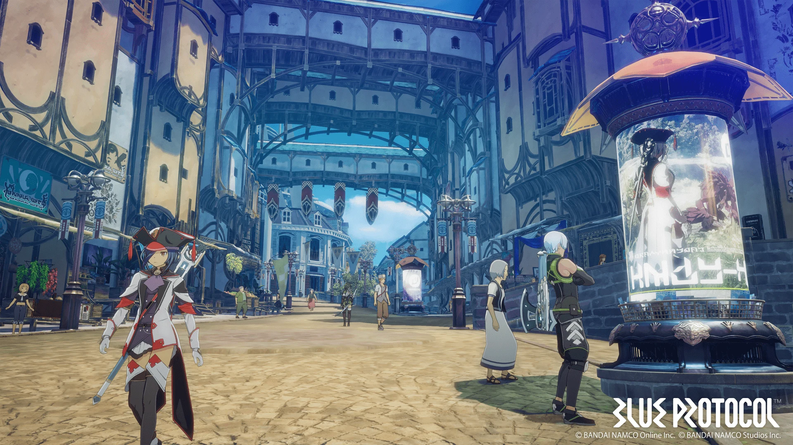
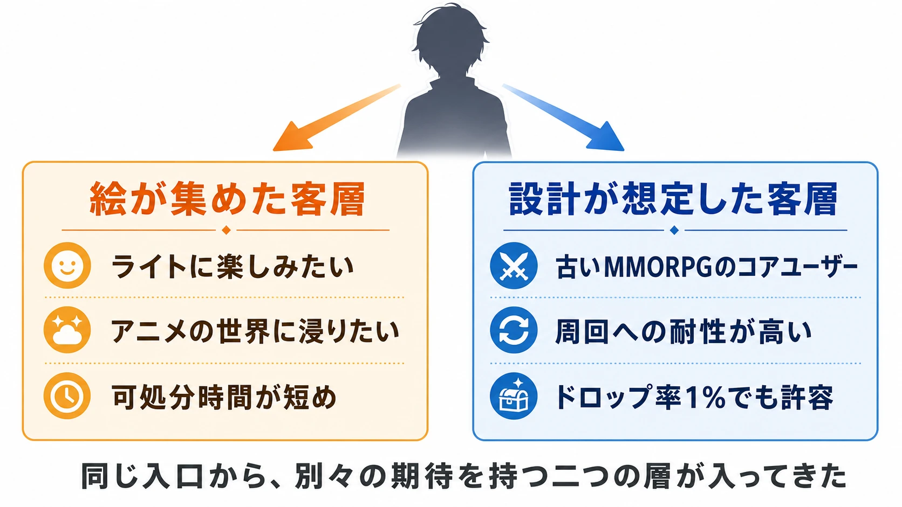
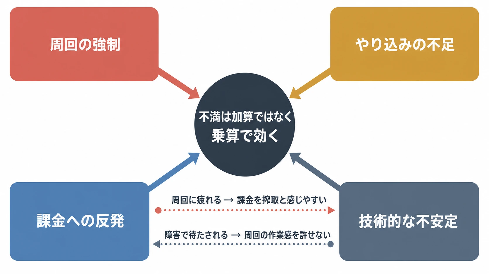
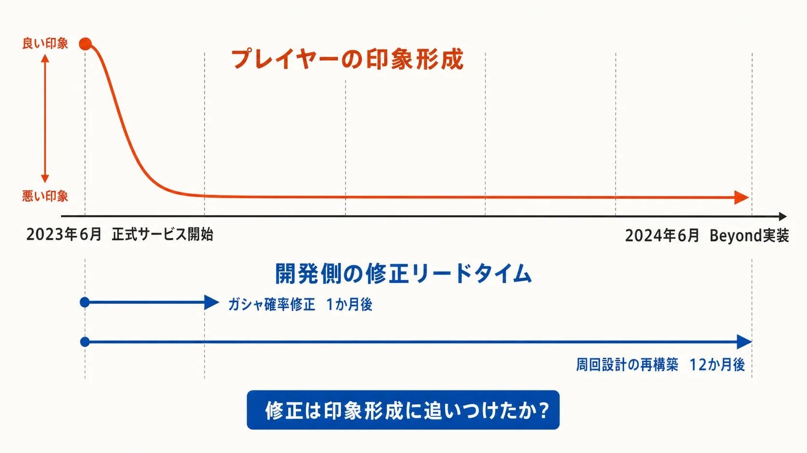

# 『BLUE PROTOCOL』はなぜ美しいまま終わったのか――絵が集めた客層と、設計が想定した客層のずれ

『BLUE PROTOCOL』は、アニメ調のグラフィックに失敗したタイトルではない。開発元のバンダイナムコスタジオ自身が「劇場アニメに入り込んだような圧倒的グラフィック表現」を掲げ[[1](#ref-1)]、再開発中に描画を全面的に見直した開発陣は、Amazon Games版PVへの「絵がきれいになってない？」という反応に「合ってます。きれいになってます」と答えている。[[2](#ref-2)]

それでも、2023年6月14日に始まったPC版正式サービスは、2025年1月18日に終わった。約1年7か月である。公式の終了告知は「今後皆様に満足いただけるサービスを継続的に行うことが困難」と述べるにとどまり、決定打が何だったのかは開示されていない。[[3](#ref-3)]

だが、プレイヤーが何に不満を抱いていたのかは、推測に頼らなくても分かる。開発陣自身が、サービス1周年を前にした取材で「いま『ブループロトコル』は苦戦しているように見受けられます」という問いに「それは事実だと思います」と認め、アンケートで最も多かった不満が「やり込み不足」だったこと、リリース時の設計が「時間をかけさせる意図で作られていた」こと、繰り返し作業に耐えられず離脱したプレイヤーが多かったことを、具体的に語っているからである。[[4](#ref-4)]

本稿の主張は一つに絞られる。 **『BLUE PROTOCOL』では、アートが連れてきた客層と、ゲームデザインが想定していた客層が別人だった。** 美しいアニメ調の画面はライトに楽しみたい層を大量に集めたが、その先に待っていたのは、古いMMORPGを遊び込んだ開発者たちが「これくらいは耐えられる」と感じる周回設計だった。このずれこそが、テストの誤解、課金への反発、改修の遅れという個々の問題を貫く病根である。以下、時系列を整理したうえで、プレイヤーの不満の中身から順に見ていく。

***

## 時系列の整理

| 時点 | 出来事 |
| --- | --- |
| 2019年 | 『BLUE PROTOCOL』発表。アニメ調の高品質な表現とオンラインアクションRPGを前面に出す。[[1](#ref-1)] |
| 2020年4月 | クローズドβテスト（CBT）。サーバー費を踏まえ、利便性を意図的に制限した仕様を含んでいた。[[2](#ref-2)] |
| 2020年11月 | マッチング負荷テスト。公式レポートではCBT時の5倍の負荷でも安定したとされた。[[5](#ref-5)] |
| 2021〜2022年 | 約2年の沈黙。ゲームサイクル・全スキル・全エネミー行動・描画をほぼ作り直す再開発。[[2](#ref-2)] |
| 2023年6月14日 | PC版正式サービス開始。初日にログイン・共通ID・決済を含む障害と緊急メンテナンスが発生。[[6](#ref-6)] |
| 2023年7月 | 衣装ガシャの提供割合を引き上げる変更を発表。サービス開始翌月の大幅修正となった。[[7](#ref-7)] |
| 2023年12月13日 | PS5／Xbox Series X｜S版開始。初日から表示遅延などの問題が公式に告知された。[[8](#ref-8)] |
| 2024年6月26日 | 1周年大型アップデート「Beyond」。ゲームサイクルを再設計。[[4](#ref-4)] |
| 2024年8月28日 | サービス終了を発表。具体的な理由は示されず、海外展開も中止に。[[3](#ref-3)] |
| 2025年1月18日 | サービス終了。[[3](#ref-3)] |

***

## ビジュアルは成功した。そして「誰が来るか」を決めた

2019年の発表時から、本作の訴求の中心はアニメの中に入り込む感覚だった。[[1](#ref-1)] 海外パブリッシングを担ったAmazon Gamesも、アニメから生まれたような美術を前面に出して発表している。[[9](#ref-9)] 再開発期間中には描画全体が見直され、正式サービス前の試遊記事でもグラフィックとキャラクタークリエイトは高く評価された。[[2](#ref-2)][[10](#ref-10)]

*画像出典（引用）：[バンダイナムコスタジオ「BLUE PROTOCOL（ブループロトコル）」公式ページ](https://www.bandainamcostudios.com/products/blue-protocol.html)。©2019 Bandai Namco Online Inc. ©2019 Bandai Namco Studios Inc. / アニメ調のキャラクターと都市空間の調和を示す資料として引用。WebP変換。*

ここで重要なのは、ビジュアルの成功が単なる「入口の獲得」では終わらなかったことである。運営統括ディレクターの鈴木貴宏は1周年時の取材で、本作の見た目もあって「私たちの予想よりも多くライトに楽しみたいという方がいらっしゃった。これはある意味でうれしい誤算」だったと振り返っている。[[4](#ref-4)]

つまり、アニメ調のグラフィックは集客に成功しただけでなく、 **集まる客層の質を決めた** 。アニメのような世界を歩き、自分の分身を作り、物語を追いたい人々である。問題は、ゲームの中身がその人々のために調律されていなかったことだ。

***

## プレイヤーは何に不満だったのか

サービス終了を語る際、「なんとなく不評だった」で済ませては教訓にならない。公開資料から特定できる不満は、大きく四つある。

**周回の強制**：リリース時の設計では、シナリオを進めるにも武器を製作するにも周回が必要だった。鈴木は「時間をかけさせる意図で作られていた部分はたしかにあった」と認め、初動で入ってきたプレイヤーのデータを見ると「くり返しやる行為に否定的というか、耐えられなくて抜けた方も多かった」と語っている。そのうえで「時間をかけさせて、コンテンツを水増ししているように見えるものはやめていった方がいいだろう」とまで踏み込んだ。[[4](#ref-4)]

**やり込みの不足**：一方で、序盤の周回に耐えてエンドコンテンツへ到達したプレイヤーには、今度はやることが足りなかった。エグゼクティブプロデューサーの下岡聡吉は、プレイヤーアンケートで最も重要だったのが「やり込み」であり、2番目が「カジュアルな遊びがもっとほしい」だったと明かしている。[[4](#ref-4)] 序盤は長すぎ、終盤は浅すぎる。ライト層とコア層の双方が、別々の理由で不満を持つ構造になっていた。正式サービス前のネットワークテスト時点でも、試遊記事は序盤の導線や繰り返しの発生を課題として指摘していた。[[10](#ref-10)]

**課金への反発**：収益の柱だった衣装ガシャは、サービス開始直後から提供割合をめぐって不満を集め、開始からわずか1か月後の2023年7月、最高ランクの提供割合を1.2%から3.0%へ引き上げ、一定回数で特典を付与する仕組みを追加し、既存プレイヤーへ補填を行う変更が発表された。[[7](#ref-7)] サービス翌月に確率を2倍以上へ改める判断そのものが、初期の課金設計と受け手の感覚が大きくずれていたことの証拠である。性能に直結する課金を避けるという方針自体は発表当初から一貫しており[[11](#ref-11)][[12](#ref-12)]、ゲームの公正さという点では誠実だった。だからこそ、残された収益源である見た目要素の売り方への不満は、そのまま作品全体への不信につながった。

**技術的な不安定**：PC版正式サービス初日には、アクセス集中、バンダイナムコIDの登録・ログイン問題、一部決済手段のエラーが重なり、緊急メンテナンスに至った。[[6](#ref-6)] 半年後のコンソール版ローンチでも、初日からアイテム所持数に起因するエラーや表示遅延が公式に告知され、フレームレート低下や短時間のフリーズの報告が相次いだ。[[8](#ref-8)] 2年かけて作り直したタイトルの、最初の接点で起きた出来事である。

四つの不満は独立していない。周回に疲れた人は課金の誘いを搾取と感じやすく、障害で待たされた人は周回の作業感を許しにくくなる。不満は加算ではなく乗算で効く。

***

## ずれの正体――作り手の「耐えられる」を基準にした設計

では、なぜ周回中心の設計になったのか。開発統括ディレクターの福崎恵介の説明が率直である。下岡・鈴木・福崎の3人は「けっこう古いMMORPGのコアユーザー」であり、ドロップ率1%の掘りにも耐えられる感覚の持ち主だった。リリース前のテストプレイでは「いけると感じていた」が、いざ蓋を開けると「プレイヤーさんの反応は思った以上にカジュアル」だった。[[4](#ref-4)]

これは怠慢の告白ではない。むしろ、経験豊富な作り手ほど陥りやすい構造的な罠の、教科書的な記録である。テストプレイの合格判定は、テストした人間の耐性を基準に下される。開発チームが時間のかかる反復を「MMORPGとはそういうもの」として愛してきた集団であれば、その反復は社内テストを必ず通過する。そして、アニメ調のビジュアルに惹かれて集まった実際の客層は、その前提を共有していなかった。

思い出してほしいのは、2020年のCBTで同じ型の事故がすでに起きていたことである。CBTでは、バッグがすぐ埋まり頻繁に街へ戻らされる仕様が悪評を呼んだが、開発側はこれをサーバー費とプレイヤー行動の関係を測るための意図的な実験条件として残していた。[[13](#ref-13)] 内部では問題と認識しながら、テストだから許されると判断した。しかし参加者にとってCBTは実質的な製品版であり、「遊びにくい完成品」という評判が先に立った。開発側は後の取材で、当時を「リリースしたら即死」も想像される状況だったと振り返っている。[[2](#ref-2)]

CBTの誤解と正式サービス後の周回不評は、表面上は別の事件だが、根は同じである。 **作り手の中では筋が通っている前提が、受け手には一度も共有されていなかった。** テストの位置づけであれ、周回の位置づけであれ、である。

***

## 作り直しは1回目のずれを直したが、2回目のずれは残った

CBT後、開発チームは経営層の「ちゃんといいものができる確証が出るまで締め切りは決めない」という判断のもと、約2年をかけてゲームサイクル・全スキル・全エネミー行動を作り直した。[[2](#ref-2)] この決断自体は、悪評を抱えたまま強行するより合理的だったと評価できる。

だが、再開発が直したのは主にCBTで可視化された問題、すなわち利便性と快適さのずれだった。客層とチューニングのずれは、正式サービスで実際のプレイヤーが大量に流入するまで表面化しなかった。福崎が「思ってたのと違う」と気付いたのはリリース後1〜2か月の時点であり、そこからすぐ準備に入ったという。[[4](#ref-4)]

しかし、ライブサービスの修正には時間がかかる。ローンチ後の運営はチート対策や進行不能不具合への優先対応に追われ、プレイヤー要望に基づくブラッシュアップへ十分に手を回せなかったことが、後の取材で語られている。[[14](#ref-14)] 周回設計を根本から改める大型アップデート「Beyond」が実現したのは、1周年の2024年6月26日である。下岡はその直前の取材で、月次の改善を積み重ねても「蓄積してきた多くのネガティブな印象を払拭できるレベルには達していなかった」と認めた。「だって『ブループロトコル』ってこういうところがだめじゃん」と言われたとき、「そこはもう直ってますよ」と伝えるのは難しい、とも。[[4](#ref-4)]

これは基本プレイ無料タイトルの時間構造そのものである。F2Pは参入障壁が低いぶん離脱障壁も低く、評判は最初の数週間でほぼ固まる。ガシャの確率是正は1か月で実施されたが、去ったプレイヤーは戻らない。周回設計の是正は12か月後で、その時点で判断材料にする人はさらに少ない。 **修正の速度がどれだけ速くても、最初の印象形成より速くなければ、事業上は間に合っていない。** 下岡自身がCBT後に恐れた「リリースしたら即死」は、即死こそ回避されたものの、緩慢な形で現実になった。

***

## 収益構造は、この全てと連動していた

終了の決定打となった数字は公開されていないため、「売上がいくら足りなかった」とは書けない。[[3](#ref-3)] ただし、構造は指摘できる。

本作は2019年の時点で、基本プレイ無料、武器の直接販売や性能付き衣装は行わず、見た目要素を中心に収益化する方針を示していた。[[11](#ref-11)] ゲームの公正さを守る設計だが、裏を返せば、収益は「この世界に居続けたい」「この姿で遊びたい」という愛着だけに支えられる。周回に疲れて離脱した人は衣装を買わない。障害やフリーズに遭った人も買わない。ガシャへの不信が広がれば、残った人すら買い控える。プレイ体験の不満は、性能非依存の課金モデルにおいてこそ、収益に直撃する。

一方でコストは重かった。CBT後の振り返りでは、αテスト時の仕様のままでは「サーバー費やばくない？」という水準であり、事業として継続性がないのではという現実が見えたことが語られている。[[2](#ref-2)] Amazon Gamesを通じた欧米等での展開も、国内サービス終了とともに中止となり[[9](#ref-9)][[3](#ref-3)]、初期に想定した市場を完遂できないまま、費用構造だけが残った。

***

## プランナーが持ち帰るべき三つの実務判断

**1. アートスタイルはターゲティングである。絵柄が集める客層を、デザインの基準点にする。**

ビジュアルの方向性を決めることは、マーケティング素材を決めることではなく、誰がやって来るかを決めることである。アニメ調の美麗な画面は、アニメのような体験を期待する層を連れてくる。その層の周回耐性・可処分時間・課金感覚を、コアループとマネタイズの前提条件として文書化し、開発チームの肌感覚と食い違う場合はテスト設計で強制的に検証する。「絵はこの層、中身はあの層」という分業の断絶こそ、本事例の最大の教訓である。

**2. テストプレイの合格判定から、開発者の耐性を除外する。**

長時間の反復に耐えられることは、ベテラン開発者の職業病であって、市場の平均ではない。社内テストで「いける」と感じたときほど、想定客層に近い外部テスターの離脱データで裏を取る。また、意図的な不便をテストビルドに残すなら、何が実験条件で何が修正対象かを参加者に明示する。説明されない不便は、すべて完成度の低さとして記憶される。

**3. F2Pの評判は最初の数週間で固まる。修正計画は「速いか」ではなく「間に合うか」で評価する。**

本作の運営は、ガシャ確率を1か月で直し、周回設計を12か月で直した。個々の対応としては誠実だが、印象形成の速度には敗れた。ローンチ前に、初動で不満が出た場合の修正リードタイムを項目別に見積もり、リードタイムが印象形成より遅い項目（コアループ、課金モデル、性能）は、ローンチ後の修正をあてにせず、事前に決着させておく。「運営しながら直す」が許されるのは、最初の評判を生き延びた後だけである。

***

## 結論

『BLUE PROTOCOL』のグラフィックは約束を守った。破られたのは、その絵が観客に暗黙のうちに交わしたもう一つの約束――アニメのような世界を、アニメを見るような気軽さで楽しめるという期待のほうである。ゲームの中身は、別の誰かのために調律されていた。

だからこの事例の教訓は「グラフィックだけでは勝てない」という凡庸な話ではない。 **強いアートは客層を選ぶ力を持つがゆえに、選ばれた客層に中身が応えられないとき、最も鋭い失望を生む** 、という話である。美しい入口を作るなら、その入口をくぐった人が翌週も戻ってくる理由を、同じ人物像に向けて設計しなければならない。絵が呼ぶ人と、遊びが応える人を一致させること。ライブサービスの企画は、そこから始まる。

## References

1. [バンダイナムコスタジオ「BLUE PROTOCOL（ブループロトコル）」][1] - 開発元による作品紹介とグラフィック表現の位置付け。

2. [ファミ通.com「『ブループロトコル』インタビュー。2年間沈黙していたのは、ほぼすべて作り直したから」][2] - CBT後の再開発、サーバーコスト認識、「リリースしたら即死」、描画見直しを開発者が語ったインタビュー。

3. [4Gamer.net「『BLUE PROTOCOL』，2025年1月18日にサービス終了」][3] - 2024年8月28日の終了発表、公式告知の終了理由、海外展開中止。

4. [ファミ通.com「『ブループロトコル』のいまを開発・運営はどうとらえているのか。1周年アップデート“Beyond”前に仕込まれた楽しさへの布石」][4] - 苦戦の自認、アンケート結果（やり込み不足・カジュアルな遊び）、周回設計と離脱の関係、開発陣の客層誤算、Beyondの狙いを語った1周年時の取材。

5. [4Gamer.net「『BLUE PROTOCOL』公式サイトでマッチング負荷テストの実施レポートが公開」][5] - 2020年11月のマッチング負荷テストの目的と結果。

6. [電撃オンライン「『BLUE PROTOCOL』18:00より緊急メンテナンスを実施」][6] - PC版開始日のアクセス、ID、決済に関する障害と対応経緯。

7. [Kultur「『ブループロトコル』ガチャの確率を変更すると発表」][7] - 2023年7月の公式発表（Sランク提供割合1.2%→3.0%、利用回数到達特典の追加、既存プレイヤーへの補填）を伝えた記事。

8. [Game*Spark「『ブループロトコル』PS5/Xbox Series X|S版サービス開始―特定の操作において問題発生中」][8] - コンソール版初日に公式が告知した不具合（所持アイテム起因のエラー・表示遅延）の報道。

9. [Amazon「Amazon Games and Bandai Namco team up for the release of Blue Protocol」][9] - 海外パブリッシングの対象地域とアニメ調美術の訴求。

10. [Game*Spark「グラフィックやサーバー稼働は良好！しかしコンテンツ面では課題アリ…？『BLUE PROTOCOL』ネットワークテストインプレッション」][10] - 正式サービス前の試遊時点でのビジュアル評価と、導線・繰り返しへの課題指摘。

11. [GameBusiness.jp「『BLUE PROTOCOL』開発者インタビュー！目指すのは『アニメの中に入り込む体験』と『コミュニケーションが生まれる楽しさ』」][11] - 基本プレイ無料、武器販売を避け、見た目要素を中心にする方針（2019年）。

12. [4Gamer.net「プロトタイプに3年，開発に5年。『BLUE PROTOCOL』は世界中の人達に楽しんでもらうためにすべきことを徹底的に行った」][12] - プレイヤー性能に直結する課金を抑え、定着を優先する方針。

13. [ファミ通.com「『ブループロトコル』アイテムをあまり持てなくて何度も街に戻る仕様には理由があった」][13] - CBTのバッグ・帰還仕様、サーバーコスト、テストの位置付けについての開発者説明。

14. [4Gamer.net「『BLUE PROTOCOL』は一歩ずつ着実に。ブルプロが1周年を迎えた今の心境と，これからの抱負を顔役たちに聞く」][14] - 運営開始後のチート対策・不具合対応が優先され、ブラッシュアップに手が回らなかったことの説明。

[1]: https://www.bandainamcostudios.com/products/blue-protocol.html
[2]: https://www.famitsu.com/news/202306/10305367.html
[3]: https://www.4gamer.net/games/467/G046741/20240828026/
[4]: https://www.famitsu.com/article/202406/8068
[5]: https://www.4gamer.net/games/467/G046741/20201118109/
[6]: https://dengekionline.com/articles/189821/
[7]: https://kultur.jp/blue-protocol-gacha-rate-change/
[8]: https://www.gamespark.jp/article/2023/12/13/136806.html
[9]: https://www.aboutamazon.com/news/entertainment/amazon-games-and-bandai-namco-online-team-up-for-the-release-of-blue-protocol-in-2023/
[10]: https://www.gamespark.jp/article/2023/04/03/128629.html
[11]: https://www.gamebusiness.jp/article/2019/09/05/16146.html
[12]: https://www.4gamer.net/games/467/G046741/20230613042/
[13]: https://www.famitsu.com/news/202007/31203124.html
[14]: https://www.4gamer.net/games/467/G046741/20240613047/

----

この文書は、Perplexity、Claude、OpenAI Codex の3つのAIの支援を受けて著述されたものです。引用画像を除き、MIT License にて提供されています。
