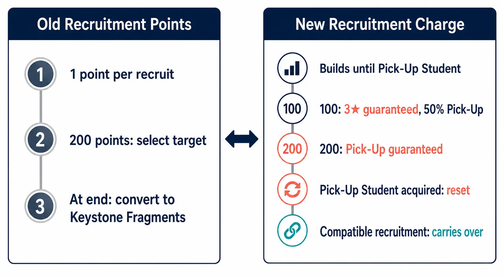
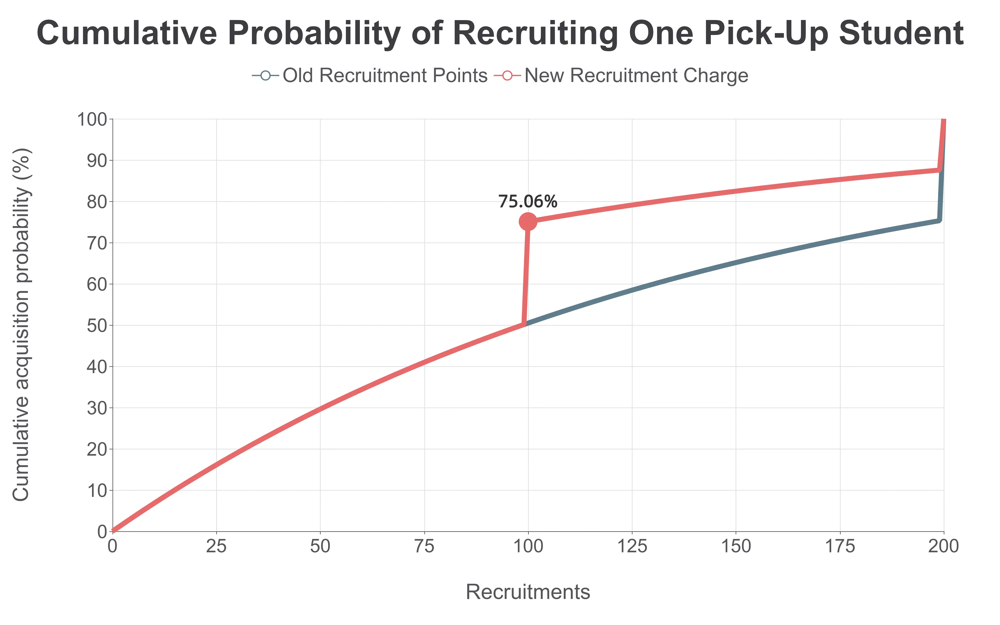
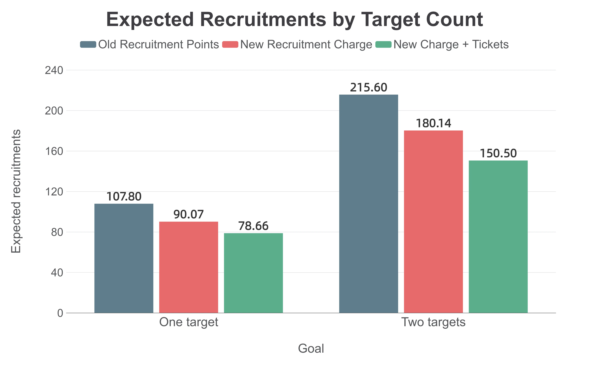
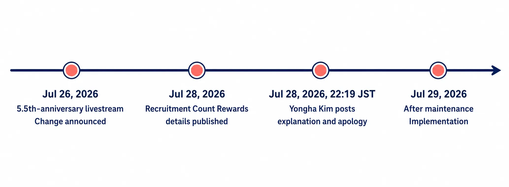

# Why Can Better Expected Value Still Spark a Backlash? — Blue Archive’s Recruitment Charge Change Through Probability and Trust

[日本語](bluearchive-recruitment-charge-probability-player-trust.md) ｜ English

> This English edition was prepared using ChatGPT Work and DeepL. This blog primarily presents practical work and case studies for game planners; it is not written from a player-first perspective. All dates and times in this article are Japan Standard Time (JST).

The Student Recruitment overhaul scheduled for after the July 29 maintenance did more than replace a 200-recruit ceiling with safeguards at 100 and 200 recruits. It replaced a promise—"reach 200 and you can select the student you still haven't recruited"—with one where that safeguard count disappears the moment a Pick-Up Student arrives early. [[1](#ref-1)]

For clarity, this article uses the Global version’s established terms: *Student Recruitment*, *Pick-Up Recruitment*, *Pick-Up Student*, *Recruitment Points*, *Keystone Fragments*, *Pyroxenes*, and *10-Recruitment Tickets*. The Japanese announcement calls the new mechanic *Yobidashi Charge*; “Recruitment Charge” is an explanatory translation used in this article, **not** an official Global-client term. At the time covered here, no official roadmap said that this Japanese change had been applied to Global.

That distinction is easy to miss when looking only at averages. For an ordinary single Pick-Up at 0.7%, the expected number of recruitments falls from 107.80 under the old system to 90.07 under the new one. If limited-time 10-Recruitment Tickets from Recruitment Count Rewards can all be used during the same recruitment period, the expected Pyroxene/paid-recruitment equivalent falls further to 78.66. By the numbers alone, that is an improvement.

Yet the change still prompted backlash. To be clear about scope, this is not an analysis of the May 2026 currency misdistribution and its recovery response; it concerns how a change to recruitment probabilities, guarantees, and carryover alters a player’s ability to make plans, and it does not attribute the reaction to any individual or organization without evidence.

***

## 1. The conclusion first: a better average and a weaker guarantee can coexist

The debate pits “the expected cost is lower, so it is better” against “the 200-recruit exchange is gone, so it is worse.” Neither statement alone describes the system.

- For a player seeking one Pick-Up Student as early as possible, the 50% safeguard at 100, the guarantee at 200, carryover to a compatible recruitment type, and Recruitment Count Rewards all reduce average burden.
- For a player planning to secure two simultaneously released students, the old ability to use 200 accumulated points to select the other student after one arrived naturally was important. Under the new system, recruiting a Pick-Up Student resets the charge, removing that route. [[2](#ref-2)]

The first group is judging the mean of a probability distribution. The second is judging a conditional guarantee: whether a particular roster goal can be achieved with a particular budget. They are comparing different things, so the same equations can lead them to different conclusions.

***

## 2. Old Recruitment Points and the new Recruitment Charge

Under the old system, each recruitment granted one Recruitment Point. At 200 points, a player could select a Pick-Up Student. Unused points did not carry over after the recruitment ended; they were automatically converted to Keystone Fragments at a 1:1 ratio. [[1](#ref-1)]

| Recruit count reached | What the new Japanese system does |
| --- | --- |
| 100 | Guarantees a 3★ student in that recruitment; there is a 50% chance that student is the Pick-Up Student |
| 200 | Guarantees the Pick-Up Student in that recruitment |
| When the Pick-Up Student is recruited | Resets the charge at that point. If this happens during a 10-recruit, the remaining recruitments begin building the next charge |
| When a Pick-Up Recruitment changes | The charge carries over to a compatible Pick-Up Recruitment. Regular and limited recruitment types use separate counts |

The important point is that reaching 100 or 200 does not itself reset the charge. It resets when the Pick-Up Student is actually recruited. Off-banner 3★ students do not reset it. The official notice also says the base rates per recruitment are unchanged. [[1](#ref-1)]

### Recruitment Count Rewards are a separate axis from the charge

The newly added Recruitment Count Rewards advance one square for every 10-recruit. The initial reward set has 20 squares through 390 cumulative recruitments. Limited-time 10-Recruitment Tickets appear at cumulative counts of 70, 130, 150, 170, 270, 330, 350, and 370—eight squares in total. After the initial rewards are collected, rewards for cumulative counts 410 through 590 repeat on a 200-recruit cycle, but those repeats contain no 10-Recruitment Tickets. [[1](#ref-1)]

Unlike the Recruitment Charge, this count resets when the active recruitment period ends. Charge carryover protects the choice to recruit a little now and continue later; Recruitment Count Rewards instead reward making many recruitments during the same period. Calling both simply “pity” obscures how differently they shape player behavior. [[1](#ref-1)]

The established Global terminology for the former system—Recruitment Points, their 200-point selective acquisition, and their conversion to Keystone Fragments—is documented in the Global recruitment guide. [[3](#ref-3)]

***

## 3. Deriving the expected recruitment count for one Pick-Up

Throughout this section, consider an ordinary single Pick-Up Recruitment with a per-recruit probability of $$p = 0.007$$ (0.7%). Let the probability of not recruiting that student on a given attempt be $$q = 1 - p = 0.993$$. These parameters match the standard Pick-Up rate shown on the Recruitment screen; the official notice states that the overhaul does not change base recruitment rates. The calculation does not apply unchanged to recruitment types with different 3★ or individual Pick-Up rates, such as anniversary recruitments.

### Old system: a truncated geometric distribution with a 200-recruit guarantee

Let $$T$$ denote the number of recruitments needed to obtain the Pick-Up Student naturally. Under the old system, a player stopped as soon as the student appeared, or selected the student with 200 Recruitment Points if it had not appeared by then. The total number of recruitments required, $$N_{old}$$, is therefore:

$$
N_{old}=\min(T,200)
$$

After $$n$$ recruitments, the probability that the target is still missing is $$q^n$$. Applying the tail-sum formula for the expectation gives:

$$
\begin{aligned}
E[N_{old}]
&=\sum_{n=0}^{199}q^n\\
&=\frac{1-q^{200}}{p}\\
&=107.80
\end{aligned}
$$

The 200-point exchange capped a single-target attempt at 200 recruitments, regardless of whether the student had appeared naturally.

### New system: a 50% Pick-Up safeguard at the 100th recruitment

Under the new system, a player reaches the 100th recruitment without the target with probability $$q^{99}$$. At that point, the 50% safeguard grants the Pick-Up Student to half of those players. Only the remaining fraction, $$q^{99}/2$$, continues into the second block of up to 100 recruitments.

Let the expected contribution of one such 100-recruit block be:

$$
A=\sum_{n=0}^{99}q^n=\frac{1-q^{100}}{p}
$$

Every player incurs the first block. The second block is incurred only with probability $$q^{99}/2$$, and has the same expected contribution because the target is guaranteed by the 200th recruitment. The resulting expectation is:

$$
\begin{aligned}
E[N_{new}]
&=A+\frac{q^{99}}{2}A\\
&=\frac{1-q^{100}}{p}\left(1+\frac{q^{99}}{2}\right)\\
&=90.07
\end{aligned}
$$

This is 17.73 fewer recruitments than under the old system, a reduction of about 16.4%. The median remains 99 recruitments under both systems, but at 100 recruitments the cumulative probability of obtaining the target rises from 50.46% to 75.06%. In other words, the new safeguard materially improves the upper tail: it no longer leaves the worst outcomes unaddressed until the 200th recruitment.

### “Effective cost” once Recruitment Count Rewards are included

Here, “effective cost” assumes that, once a limited-time 10-Recruitment Ticket is earned, it can be used immediately in the same recruitment period. Each ticket then offsets ten recruitments that otherwise would have used Pyroxenes or paid recruitment. The calculation does not count the exchange value of tickets, other reward value such as Eleph, or tickets the player already owns.

For a single target, the probability of reaching each ticket threshold follows from the new system’s survival probability:

| Cumulative recruitments that award a ticket | Probability the player continues past that count | Expected reduction in paid burden |
| --- | ---: | ---: |
| 70 | 61.16% | 6.12 recruitments |
| 130 | 20.20% | 2.02 recruitments |
| 150 | 17.56% | 1.76 recruitments |
| 170 | 15.25% | 1.53 recruitments |
| Total | — | 11.42 recruitments |

The expected effective cost for a single target under the new system is therefore $$90.07 - 11.42 = 78.66$$ recruitments. A player who reaches 200 receives all four tickets, worth 40 recruitments. In that worst case, the effective payment for reaching the 200-recruit guarantee is the equivalent of 160 recruitments, provided every ticket can be used before it expires. These rewards do not raise the probability; they reduce the payment needed for the same number of attempts. [[1](#ref-1)]

***

## 4. What changes when the goal is two students?

The most readily comparable model is two separate ordinary single Pick-Up Recruitments running in the same period, one target on each. Assume both individual rates are 0.7%, and that the acquisition counts for each target follow the same distribution as the single-target case. Recruitment Count Rewards alone are calculated from the combined number of recruitments for both targets during the same period. In this model, the total is the sum of two independent single-target counts.

| Goal | Old system: expected recruitments | New system: before tickets | New system: effective cost after tickets |
| --- | ---: | ---: | ---: |
| One student | 107.80 | 90.07 | 78.66 |
| Two students | 215.60 | 180.14 | 150.50 |

For two targets, the eight tickets in the initial reward set can become relevant. Let $$M$$ be the total recruitment count, and let the ticket thresholds be $$R = \{70,130,150,170,270,330,350,370\}$$. The expected ticket-based reduction is:

$$
10\sum_{r\in R}P(M>r)=29.64
$$

Thus, $$180.14 - 29.64 = 150.50$$ recruitments. This does not assume that the value of tickets simply doubles for two students; it calculates the chance that the combined count during the same period exceeds each threshold.

Under these assumptions, the median and upper percentiles of total recruitments are also lower under the new system:

| Cumulative probability of securing both students | Old system | New system |
| --- | ---: | ---: |
| 50% | 217 recruitments | 175 recruitments |
| 75% | 283 recruitments | 234 recruitments |
| 90% | 362 recruitments | 300 recruitments |
| 95% | 400 recruitments | 305 recruitments |

This table must not be read as “the new system is always safer for every double Pick-Up.” If two students share one recruitment pool and the old system let a player spend 200 points on either, what players valued was often sequence rather than average.

For example, under the old system, if student A appeared naturally by the 199th recruitment while student B had not, the player could select B at 200. Under the new system, if A arrives on the 199th recruitment, the charge returns to zero. The 200-recruit guarantee for B must then be built again from that point. The 100-recruit safeguard means the new system is not worse on every path. But the old positive relationship—getting A early also brought B’s certain acquisition closer—no longer exists.

An exact expected value for a shared double Pick-Up requires each student’s individual rate, the result rules at 100 and 200, and whether the player may select between the two. These can vary by recruitment and cannot safely be filled in using the ordinary single Pick-Up values. The official notice says that recruiting an out-of-scope Pick-Up Student from another simultaneously running recruitment does not reset this charge, showing that charges can at least be managed independently across separate recruitments. [[1](#ref-1)] This article therefore limits its table to the model of two independent 0.7% single Pick-Ups rather than inventing undisclosed values.

That limitation is also central to the backlash. Even if average burden improves, a probability argument alone cannot replace a planning route players have used: “if one arrives, exchange the remaining points for the other.”

***

## 5. Why opinion divided in Japan

### 5-1. As a recruitment strategy, the improvement is explainable

The 100-recruit peak for a single target, the 200-recruit guarantee, carryover to compatible recruitments, and up to 40 recruitments’ worth of limited-time tickets all lower either expected attempts or payment. Under the old system, players who did not expect to reach 200 had reason to hold back on a few extra attempts, since any leftover points would only become Keystone Fragments. Carryover reduces the psychological loss of recruiting a small amount now. That is an improvement beyond the mean alone. [[1](#ref-1)]

This interpretation is coherent for securing one student at a time, or for participating in multiple ordinary Pick-Up Recruitments over a long period. Both safeguards arrive before the old system’s 200-point selection when the Pick-Up Student has not yet appeared.

### 5-2. “Guaranteed by 200” was a schedule, not an average

The old 200 points were a ceiling on bad luck, but they were also a unit for budgeting Pyroxenes. “At worst I need 400 for these two students; if one arrives along the way, 200 is enough” was a usable plan even for players who never calculate probability in detail.

The new 200-recruit guarantee still provides a ceiling for one target. But when a target arrives early, the charge disappears, so the guarantee for a remaining target is no longer in the same place it was under the old system. Pulling early is welcome, yet the player simultaneously sees that accumulated charge vanish. That design can create dissatisfaction even while it lowers the mean, because success and the visible loss of progress occur at the same moment.

### 5-3. Incomplete explanation can make good numbers look retroactive

The change was announced in the July 26 5.5th-anniversary livestream and scheduled for after the July 29 maintenance. The details of Recruitment Count Rewards appeared in an official notice on July 28. [[1](#ref-1)][[4](#ref-4)] Forty recruitments’ worth of tickets is material information for interpreting expected value, but it was hard to grasp in the initial explanation. That left room for players to read the sequence as announcing the less favorable-looking guarantee change first, then adding the compensating context only after seeing the reaction.

At the same time, paid packages including materials used for duplicate-based growth were also announced. There is no evidence to declare that those packages caused the system change. But when anxiety about certain acquisition rises alongside paid products that support duplicate growth, it is natural for players to interpret both in a monetization context. If the causal relationship is not explained while the products are visible, suspicion can outrun the material offered to explain the improved expected value. [[2](#ref-2)]

### 5-4. The operator’s explanation and apology

Two days after the announcement, at 22:19 on July 28, 2026, *Blue Archive* executive producer Yongha Kim posted an explanation and apology from his personal account rather than the official account. [[5](#ref-5)]

Source: [Yongha Kim (@ysoya), explanation and apology post](https://x.com/ysoya/status/2082093582945779906)

Kim apologized for disclosing a change with a major effect on player experience immediately before implementation, and for carelessly reposting related posts on his personal social account in a way that damaged trust. He explained the team’s intent as reducing the strongest stress point: reaching the Recruitment Point limit without recruiting any Pick-Up Student. The Recruitment Charge, its carryover, and the limited-time 10-Recruitment Tickets were intended to make early acquisition more likely and lower the burden of reaching a certain acquisition. [[5](#ref-5)]

He also acknowledged that, whatever the intention, players had been made to verify whether the change helped or hurt them, to become anxious, and above all to feel that trust built over time had been damaged. This effectively recognizes the perception described in section 5-3: a design intent consistent with the first-party calculations is separate from whether that intent was communicated adequately beforehand. The operating side acknowledged that making players investigate their own disadvantage was itself a source of lost trust.

***

## 6. Why players on Global reacted even though the change was not theirs

The Global version distributed on Steam lists NEXON Korea as publisher and is not available from the Japanese Steam region. At the time of the Japanese editorial review, Steam displayed 4,833 reviews from the preceding 30 days, with 10% positive and an “Overwhelmingly Negative” label. This was not an all-time rating: it was a rolling 30-day window, so the count changes over time. [[6](#ref-6)]

This does **not** establish that the same change had already been implemented in Global. Within the scope of the original review, no official roadmap had announced that the Japanese change would be applied unchanged there. The objection was not only to a player’s current Recruitment screen, but also to the operating policy they feared might reach their region next.

Three factors make a regional rollout a weak firewall against this kind of reaction:

1. Japanese livestreams, notice images, and rate tables are translated and shared within minutes. Silence from a regional version becomes not an information gap but uncertainty about the future.
2. Steam reviews are visible across in-game regions and languages. A player outside Japan can leave a low-cost public objection to a possible future change.
3. Players have experience with delayed regional rollouts through the operator, developer, and the wider IP. Even without a formal announcement, they can price a change in an earlier region into their own future costs.

Regional rollout can delay when a system reaches a player, but it cannot delay when that player evaluates it. Objecting before the system arrives can be a rational effort to protect an option that would otherwise already be gone at implementation.

***

## 7. What game planners can take away

The lesson is not “even an expected-value improvement can cause backlash.” It is that a team must inventory every promise its old system made beyond expected value before changing it.

| Design question | Conflict visible here | What to show first in practice |
| --- | --- | --- |
| Mean versus guarantee | Average burden falls for one target, while a 200-recruit selectable exchange for multiple targets disappears | Show mean, median, 90th and 95th percentiles, and the worst case together |
| Reset | Early acquisition is both relief and loss of progress toward the next target | Show chronological examples of resets, including inside a 10-recruit |
| Free rewards | Forty tickets are substantial but easily confused with a probability increase | State when each ticket is received, when it can be used, and what expires when the Pick-Up Recruitment ends |
| Simultaneous paid products | Nearby paid products can make the design intent look like monetization | Explain the change’s purpose, exclusions, and each product’s role separately |
| Regional rollout | Time delay is not an information delay | State early whether another region is in scope and, if undecided, when that decision will be communicated |

In particular, publishing a probability model cannot stop at expected value. Players need answers in goal-sized terms: “What happens to B if I recruit A before 200?” and “If I miss the 50% result at 100, what is and is not certain over the next 50?” Only then can the operator’s improvement and the option a player loses be placed on the same table.

***

## Conclusion

For an ordinary single Pick-Up, the Recruitment Charge lowers expected recruitments from 107.80 to 90.07. If Recruitment Count Reward tickets can be used before their deadline, it lowers effective cost to 78.66. That is a clear improvement.

But the old 200 Recruitment Points were not merely a probability safeguard. They were an agreement that let players plan around multiple students, available Pyroxenes, and rerun schedules: “at this count, I can secure the student.” The new system replaces that agreement with a different one: better long-run averages, but progress toward another target can vanish when a target arrives early.

To earn acceptance for a design change, presenting the favorable mean is not enough. Teams need to acknowledge lost guarantees first, then present goal-specific distributions, worst cases, carryover, and reward deadlines as one explanation. In an environment where information crosses borders immediately, regional delay offers no extra time for trust. Players judge that trust before the system reaches them.

## References

1. [生徒募集システムのリニューアルについて][1] — *Blue Archive* official notice (July 28, 2026). Announces the removal of Recruitment Points, their 1:1 conversion to Keystone Fragments, the 100- and 200-recruit Recruitment Charge effects, reset and carryover rules, and Recruitment Count Rewards.

2. [『ブルーアーカイブ（ブルアカ）』波紋を呼ぶガチャ新仕様、「募集回数特典」の内容が公開。200連までに計40連分の期間限定募集チケットなどがもらえる][2] — AUTOMATON (July 28, 2026). Reports the old/new-system difference, unfavorable paths near 200 during simultaneous Pick-Ups, contemporaneous paid packages, and the operator’s explanation.

3. [Recruitment][3] — *Blue Archive* Global official forum (January 23, 2025). Defines Global terminology for Student Recruitment, Pick-Up Recruitment, Recruitment Points, selective acquisition, and Keystone Fragments.

4. [ブルーアーカイブ5.5周年生放送 ～これが本当のごー！ごー！！です♪～][4] — Official *Blue Archive* YouTube channel (July 26, 2026). Official livestream that announced the Student Recruitment system renewal.

5. [Yongha Kim (@ysoya), explanation and apology post][5] — X (July 28, 2026, 22:19 JST). The executive producer’s personal-account explanation and apology concerning the Student Recruitment system renewal.

6. [Blue Archive on Steam][6] — Steam. Store listing for the Global version published by NEXON Korea; the review figure in this article is explicitly a historical editorial snapshot.

[1]: https://bluearchive.jp/news/newsJump/679
[2]: https://automaton-media.com/articles/newsjp/20260728-457011/
[3]: https://forum.nexon.com/bluearchive-en/board_view?board=3222&thread=2720669
[4]: https://www.youtube.com/live/tQ4z_gAngHc
[5]: https://x.com/ysoya/status/2082093582945779906
[6]: https://store.steampowered.com/app/3557620/Blue_Archive/?l=english

----

This document was written with the assistance of Perplexity, Claude, and OpenAI Codex. Except for quoted images, it is provided under the MIT License.
