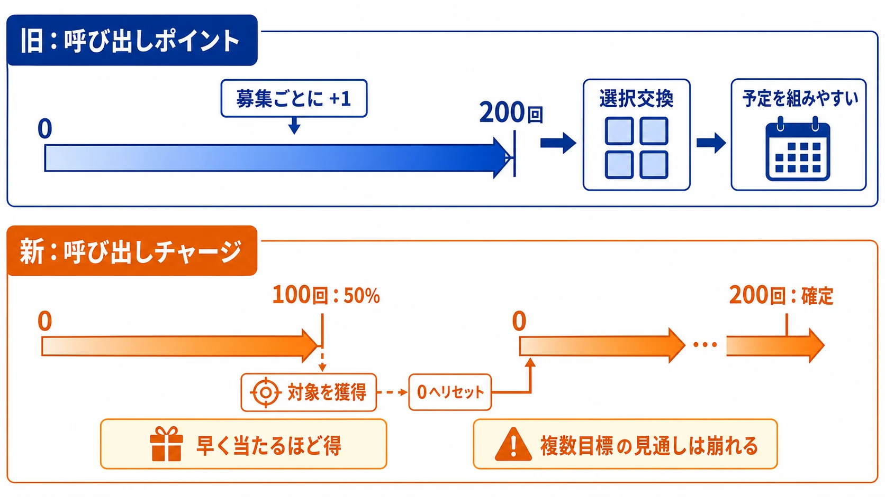
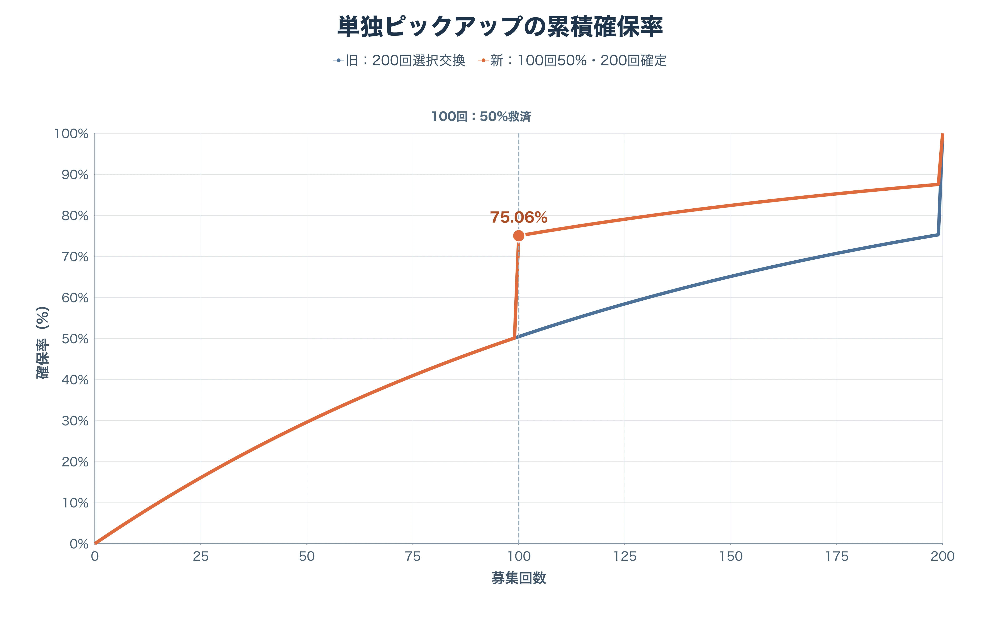
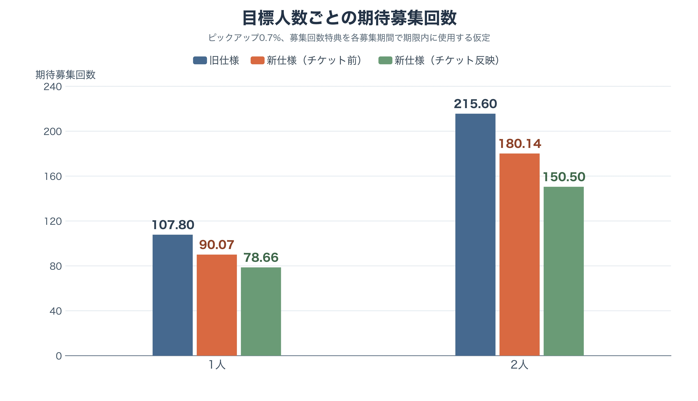
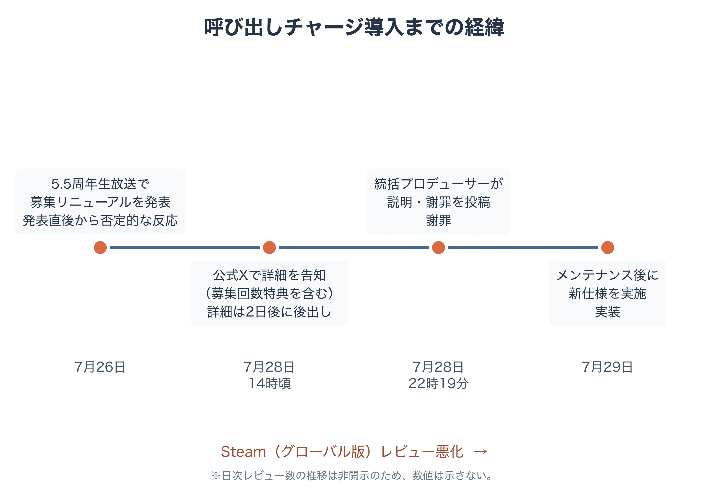
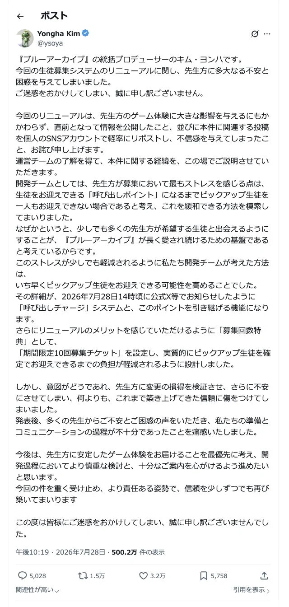

# 期待値が良くても、なぜ燃えるのか――『ブルーアーカイブ』「呼び出しチャージ」への変更を確率と信頼から読む

日本語 ｜ [English](bluearchive-recruitment-charge-probability-player-trust-en.md)

> 本稿に記載する日付・時刻は、すべて日本時間（JST）である。

『ブルーアーカイブ』が2026年7月29日のメンテナンス後に実施する生徒募集のリニューアルは、単に「天井が200回から100・200回の二段階になった」変更ではない。従来の「200回まで回せば、まだ来ていない生徒を自分で選んで確保できる」という約束を、早く当たればカウントが消える救済型の約束へ置き換える変更である。[[1](#ref-1)]

この差は、平均だけを見ると見落としやすい。通常の単独ピックアップを前提に計算すると、必要募集回数の期待値は旧仕様の107.80回から、新仕様では90.07回になる。募集回数特典の期間限定10回募集チケットまで、同じ募集期間中に使い切れるものとして価値を織り込めば、実質的な有償・青輝石消費相当は78.66回まで下がる。数字だけを見れば改善である。

それでも反発は起きた。本稿の主題は、2026年5月の通貨誤配布と回収対応ではない。今回は、確率・天井・持ち越しという募集設計の変更が、プレイヤーの「予定を立てられる」という感覚をどう変えたかを扱う。裏付けのない個人や組織を原因とする説は取り上げない。

***

## 1. 先に結論：平均の改善と、確実性の低下は両立する

今回の議論では、「期待値が下がったのだから改善だ」と「200連で交換できなくなったから改悪だ」が衝突している。どちらか一方だけでは仕様を言い尽くせない。

- 単独の目当てを早く迎えたいプレイヤーにとっては、100回目の50%救済、200回目の確定、同種募集へのチャージ持ち越し、募集回数特典が平均負担を下げる。
- 一方、同時実装の2人を計画的に確保したいプレイヤーにとっては、「200回までの途中で片方が来たら、残りのポイントをもう片方の交換へ使える」という旧仕様の選択権が重要だった。新仕様ではピックアップ獲得時にチャージがリセットされるため、この経路は消える。[[2](#ref-2)]

前者は確率分布の平均値、後者は特定の手持ち・目標・予算で必ず達成できるかという条件付きの保証を見ている。比較対象が違うため、同じ数式を見ても結論が割れるのである。

***

## 2. 旧「呼び出しポイント」と新「呼び出しチャージ」

旧仕様では、1回募集するごとに「呼び出しポイント」を1ポイント得た。200ポイントに達すれば、ピックアップ対象の生徒と交換できる。募集終了時に残ったポイントは持ち越されず、キーストーンのカケラへ1対1で自動変換された。[[1](#ref-1)]

新仕様の「呼び出しチャージ」は、対象のピックアップ生徒を募集で迎えるまで、募集ごとに増える。

| 到達回数 | 新仕様で起きること |
| --- | --- |
| 100 | その募集で必ず★3生徒が登場し、50%でピックアップ生徒を迎える |
| 200 | その募集で必ずピックアップ対象の生徒を迎える |
| ピックアップ獲得時 | その時点でチャージをリセットする。10回募集の途中で獲得した場合、残りの回数は次のチャージとして積み上がる |
| ピックアップガチャ切替時 | 同種のピックアップ募集ならチャージは引き継がれる。通常用と限定用は別カウントである |

ここで大切なのは、100回・200回に達したからリセットされるのではなく、ピックアップを実際に獲得した瞬間にリセットされることだ。★3のすり抜けだけではリセットされない。募集1回あたりの基礎提供割合も変更しないと公式は案内している。[[1](#ref-1)]

### 募集回数特典は、チャージとは別の軸である

同時に新設される「募集回数特典」は、10回募集ごとに1マス進む。初回特典は累計390回までの20マスであり、期間限定10回募集チケットが置かれるのは累計70・130・150・170・270・330・350・370回の8マスである。初回特典を受け取った後は、累計410〜590回相当を200回周期で繰り返す特典へ移るが、こちらに10回募集チケットは含まれない。[[1](#ref-1)]

このカウントは呼び出しチャージとは違い、開催中の募集期間が終わればリセットされる。つまり、チャージの持ち越しは「次に少しだけ引く」行動を守るが、募集回数特典は「同じ期間にまとまった回数を引く」行動に価値を置く仕組みである。二つを同じ「天井」と呼ぶと、プレイヤーの行動への効き方を取り違える。[[1](#ref-1)]

***

## 3. 単独ピックアップの期待値を、式から追う

以下では、通常の単独ピックアップの提供割合を $$p = 0.007$$（0.7%）、外れる確率を $$q = 1 - p = 0.993$$ と置く。これは提供割合が変わらないという公式告知と、募集画面の通常ピックアップの割合を前提にした計算である。周年など、★3全体の割合や個別の提供割合が異なる募集にはそのまま使えない。

### 旧仕様：200回で選択交換できる切断幾何分布

自然にピックアップを引くまでの回数を $$T$$ とすると、旧仕様で必要な回数 $$N_{old}$$ は次の通りである。

$$
N_{old}=\min(T,200)
$$

$$n$$ 回引いてもまだ得ていない確率は $$q^n$$ なので、期待値は「各回数まで続いている確率」の和で求められる。

$$
\begin{aligned}
E[N_{old}]
&=\sum_{n=0}^{199}q^n\\
&=\frac{1-q^{200}}{p}\\
&=107.80
\end{aligned}
$$

200回目には、自然排出の有無にかかわらず、交換によって目当てを1人選べる。よって単独狙いの分布は200回で必ず終わる。

### 新仕様：100回目の50%救済を加えた分布

新仕様では、最初の99回を外した確率が $$q^{99}$$ である。100回目で半分がピックアップを迎え、残り半分だけが101回目以降へ進む。したがって、100回目までの期待値部分を

$$
A=\sum_{n=0}^{99}q^n=\frac{1-q^{100}}{p}
$$

と置けば、新仕様の期待値は次のようになる。

$$
\begin{aligned}
E[N_{new}]
&=A+\frac{q^{99}}{2}A\\
&=\frac{1-q^{100}}{p}\left(1+\frac{q^{99}}{2}\right)\\
&=90.07
\end{aligned}
$$

旧仕様より17.73回、約16.4%少ない。中央値はどちらも99回だが、新仕様は100回目で累積確保率が50.46%から75.06%へ跳ねる。これは「大外れを200回まで放置しない」という設計意図に対して、数式どおりに効いている。

### 募集回数特典まで入れた「実質負担」

ここでいう実質負担は、期間限定10回募集チケットを受け取った後、同じ募集期間内でただちに使えると仮定し、その10回分を石・有償募集で支払わずに済む回数として差し引く値である。チケットの交換価値、神名のカケラなど他の特典価値、すでに持つチケットは計上しない。

単独狙いで初回特典のチケットに届く確率は、新仕様の生存確率から求められる。

| チケットを得る累計回数 | そこを越えて募集を続ける確率 | 期待される負担軽減 |
| --- | ---: | ---: |
| 70 | 61.16% | 6.12回 |
| 130 | 20.20% | 2.02回 |
| 150 | 17.56% | 1.76回 |
| 170 | 15.25% | 1.53回 |
| 合計 | — | 11.42回 |

したがって、単独狙いでの新仕様の実質負担期待値は $$90.07 - 11.42 = 78.66$$ 回となる。200回まで進めば4枚、すなわち40回分のチケットを得るため、「200連の生徒確定」に到達する最悪ケースでは、チケットを期限内に使い切る条件付きで160回相当の支払いで200回の募集を行える。これは確率を上げる特典ではなく、同じ試行回数を得る支払いを減らす特典である。[[1](#ref-1)]

***

## 4. 2人狙いで何が変わるか

まず、同時期にある2本の通常の単独ピックアップ募集をそれぞれ1人ずつ狙う、もっとも比較しやすいモデルを置く。両方の提供割合を0.7%とし、各目当ての確保回数は単独狙いと同じ分布に従うものとする。募集回数特典だけは、同じ開催期間における2人分の合計募集回数で進むものとして計算する。このモデルでは、2人の合計回数は単独狙いの和である。

| 目標 | 旧仕様：募集回数の期待値 | 新仕様：チケット前 | 新仕様：チケットを実質負担へ反映 |
| --- | ---: | ---: | ---: |
| 1人 | 107.80回 | 90.07回 | 78.66回 |
| 2人 | 215.60回 | 180.14回 | 150.50回 |

2人分では、初回特典の8枚を使う可能性が生じる。合計募集回数を $$M$$、チケット到達回数の集合を $$R = \{70,130,150,170,270,330,350,370\}$$ とすれば、チケットによる期待負担軽減は次式である。

$$
10\sum_{r\in R}P(M>r)=29.64
$$

ゆえに $$180.14 - 29.64 = 150.50$$ 回となる。これは「2人ならチケットの価値も単純に2倍」とはせず、同じ開催期間に合算された募集回数が各到達点を越える確率で計算した値である。

この前提での合計募集回数の中央値・上位分位も、新仕様が低い。

| 2人を確保できる累積確率 | 旧仕様 | 新仕様 |
| --- | ---: | ---: |
| 50% | 217回 | 175回 |
| 75% | 283回 | 234回 |
| 90% | 362回 | 300回 |
| 95% | 400回 | 305回 |

ただし、この表を「どのダブルピックアップでも新仕様が常に安全」と読んではならない。同じ募集枠に2人が入り、旧仕様では200ポイントを好きな片方の交換に回せた場合、プレイヤーが重視していたのは平均ではなく順序であった。

例えば旧仕様なら、199回までに生徒Aを自然に迎え、Bが未確保でも、200回目にBを選択交換できる。新仕様ではAを199回目に迎えた時点でチャージが0へ戻る。Bに対する200回到達の保証は、その時点から積み直しになる。新仕様にも100回目の救済があるため、すべての経路で不利になるわけではない。しかし「Aが早く来た結果、Bの確定が近づく」という旧仕様の相関はなくなる。

共有枠のダブルピックアップについて正確な期待値を出すには、各生徒の個別提供割合、100回・200回時に2人のどちらが出るか、プレイヤーが選択できるかを募集ごとに固定しなければならない。これらは通常単独ピックアップと同一とは限らない。公式告知は、ある募集で対象外のピックアップ生徒（別の同時開催募集の対象）を迎えてもチャージはリセットされないと明記しており、少なくとも別募集間ではチャージが独立して管理される場合があることを示している。[[1](#ref-1)] 本稿では非開示または募集依存の値を仮の数値で埋めず、上表を「2本の独立した0.7%単独ピックアップ」のモデルに限定する。

この限定こそ、炎上を読む鍵でもある。平均負担が改善していても、プレイヤーが過去に利用してきた「片方が出たら残りを交換する」手順を、同じ期待値の議論だけで置換することはできない。

***

## 5. なぜ国内で賛否が分かれたのか

### 5-1. 攻略としては、改善を説明できる

単独狙いの100回目の山、200回確定、同種募集への持ち越し、そして最大40回分の期間限定10回募集チケットは、引く回数と支払いの期待値を下げる。特に旧仕様では「200回まで届かなければポイントがカケラへ変わる」ために見送っていた少額の募集も、新仕様ではチャージが次の同種募集へ残る。小さく引く行為の心理的な損失を減らした点も、平均値だけではない改善である。[[1](#ref-1)]

この評価は、目当てを1人ずつ確保する行動や、長期にわたって複数の通常ピックアップへ参加する行動では筋が通る。生徒を迎える前に100・200回へ到達したときの救済も、旧仕様より早い。

### 5-2. しかし「200連で必ず来る」は、平均ではなく予定表だった

旧仕様の200ポイントは、運の悪さを吸収する上限であると同時に、青輝石の予算を組む単位でもあった。「この2人を確保するには最悪400回」「片方が途中で来れば200回で済む」という見通しは、確率を細かく計算しないプレイヤーにも共有できる。

新仕様の200回確定も単独目標には上限を与える。しかし途中で当たればチャージが消えるため、複数目標の残りに対する保証は、旧仕様と同じ位置に残らない。早く当たること自体は喜ばしいのに、直後には「積んだチャージが消えた」という情報も表示される。この成功と損失が同じ瞬間に起きる設計は、平均を下げても体感の不満を作りうる。

### 5-3. 説明不足は、良い数値を「後出し」に見せる

変更は7月26日の5.5周年生放送で発表され、7月29日のメンテナンス後に実施される。募集回数特典の詳細は7月28日に公式告知で示された。[[1](#ref-1)][[3](#ref-3)] 40回分のチケットという、期待値を解釈するうえで大きい情報が初回説明で把握しにくかったことは、プレイヤーに「不利な天井変更だけ先に出し、補助線は反応を見て後から足した」と受け取られる余地を作った。

さらに同じ時期に、凸用素材を含む有償パッケージも告知された。これが仕様変更の動機であると断定する根拠はない。しかし、確定取得への不安が高まる発表と、重複育成を補う有償商品が同じ画面・同じ時期に並べば、プレイヤーが収益化の文脈で読むのは自然である。因果関係を説明しないまま商品だけが見えると、期待値の改善を伝える材料よりも疑念が先に働く。[[2](#ref-2)]

### 5-4. 運営側の説明と謝罪

発表から2日後の2026年7月28日22時19分、『ブルーアーカイブ』統括プロデューサーのキム・ヨンハ氏が、公式アカウントとは別の個人アカウントで説明・謝罪の投稿をおこなった。[[4](#ref-4)]

出典：[Yongha Kim（@ysoya）による説明・謝罪ポスト](https://x.com/ysoya/status/2082093582945779906)

キム・ヨンハ氏はまず、変更がプレイヤーの体験に大きく影響するにもかかわらず実施直前になって情報を公開したこと、および本件に関連する投稿を自身の個人SNSアカウントで軽率にリポストし不信感を与えたことの2点を明示して謝罪した。そのうえで、開発チームの意図を次のように説明している。ピックアップ生徒を一人も迎えられないまま募集ポイントの上限まで到達することが、プレイヤーにとって最も強いストレスだと考え、これを和らげるためにピックアップ生徒を早く迎えられる可能性を高める設計を検討した。その結果が呼び出しチャージとその持ち越し機能であり、募集回数特典の期間限定10回募集チケットも、確定取得までの負担をさらに軽減する狙いで設計したという。[[4](#ref-4)]

そのうえで同氏は「意図がどうであれ、先生方に変更の損得を検証させ、さらに不安にさせてしまい、何よりも、これまで築き上げてきた信頼に傷をつけてしまいました」と述べ、準備とコミュニケーションの過程が不十分であったと認めている。[[4](#ref-4)]

この説明は、5-3で見た「後出しに見える」という受け止められ方を、運営側自身が追認した形になる。設計意図（早期救済の拡大）自体は一次資料の計算と矛盾しないが、意図の正しさは、それを事前にどう伝えたかとは別の問題である。プレイヤーが不利益を検証しなければならない状態を作ったこと自体が、信頼を損なう要因になったとNEXON側も認めている。

***

## 6. なぜ対象外のグローバル版まで反発するのか

Steamで配信されるグローバル版はNEXON Koreaがパブリッシャーであり、日本のストア地域からは利用できない。校閲時点のSteamストア表示では、直近30日間のレビュー4,833件のうち好評は10%で、「圧倒的に不評」と表示された。これは全期間評価ではなく、直近30日という短い窓の指標であり、レビュー件数はローリング集計のため閲覧のたびに変動する。[[5](#ref-5)]

ここから「グローバル版にも同じ仕様変更が実施済みだ」とは結論できない。少なくとも本稿の確認範囲では、今回の日本版の変更をそのまま適用する公式ロードマップは示されていない。反発の対象は、現在の自分の募集画面だけでなく、次に自分の地域へ来るかもしれない運営方針である。

地域別の展開が炎上の防波堤になりにくい理由は三つある。

1. 日本版の生放送、告知画像、確率表は数分で翻訳・共有される。地域版の沈黙は情報の欠落ではなく、将来の不確実性として読まれる。
2. Steamのレビュー欄は、ゲーム内の地域や言語をまたいで可視化される。地域外のプレイヤーでも、低コストで「将来の変更への反対」を残せる。
3. プレイヤーは運営会社、開発元、同一IPの過去の展開から、仕様が地域間で時間差展開される経験則を持つ。正式発表がなくても、先行地域の変更を自分の将来のコストとして織り込む。

つまり地域別ロールアウトは、変更の到達日時をずらせても、評価の到達日時まではずらせない。むしろ「まだ適用されていないのに反対する」ことは、適用後に失う選択肢を先に守ろうとする合理的な行動になりうる。

***

## 7. プランナーが持ち帰るべきこと

この件から得られる教訓は、「期待値を改善しても炎上する」ではない。期待値以外に何を約束していたかを、仕様変更前に棚卸ししなければならないということである。

| 設計上の論点 | 今回見える衝突 | 実務で先に示すべきもの |
| --- | --- | --- |
| 平均と保証 | 単独では平均負担が下がる一方、複数目標の200回選択交換は失われる | 平均、中央値、90%・95%点、最悪ケースを同じ表で出す |
| リセット | 早期入手が救済であると同時に、次の目標の進捗消失になる | 10回募集内を含むリセット例を、実例の時系列で示す |
| 無料特典 | 40回分のチケットは大きいが、確率の改善と混同されやすい | いつ受け取り、いつ使え、ピックアップガチャ終了時に何が消えるかを明示する |
| 商品の同時告知 | 有償商品が近接すると、変更の意図まで収益化として解釈される | 変更の目的、対象外、価格商品の役割を別々に説明する |
| 地域展開 | 時間差は情報差にならない | 先行地域の変更について、他地域への適用有無・判断時期を早く伝える |

とりわけ、確率モデルを公開するなら期待値だけで終わらせてはならない。「200回の前にAを引いたらBはどうなるか」「100回目の50%に外れたら、次の50回で何が確定していて何が確定していないか」を、プレイヤーの目標単位で示す必要がある。ここを示して初めて、運営の改善案とプレイヤーが失う選択肢を同じ土俵に置ける。

***

## 結論

呼び出しチャージは、通常の単独ピックアップについては期待募集回数を107.80回から90.07回へ下げ、募集回数特典を期限内に使い切れるなら実質負担も78.66回まで圧縮する。これは明確な改善である。

しかし旧仕様の200ポイントは、単なる確率救済ではなかった。複数の生徒、所持青輝石、復刻予定を前提に「この回数なら確保できる」と決めるための契約だった。新仕様はその契約を、長期の平均を良くする代わりに、途中の当たりで進捗が消える別の契約へ置き換えた。

設計変更を受け入れてもらうには、得になる平均値を出すだけでは足りない。失われる保証を先に認め、目標別の分布・最悪ケース・持ち越し・特典の期限までを一つの説明として提示する必要がある。地域別の時間差も、情報が即時に越境する環境では沈静化の余白にならない。プレイヤーは仕様が届く前に、信頼を判断するからである。

## References

1. [生徒募集システムのリニューアルについて][1] - ブルーアーカイブ公式（2026年7月28日）。呼び出しポイント廃止、キーストーンのカケラへの1対1変換、呼び出しチャージの100・200回効果、リセット・持ち越し、募集回数特典を告知。

2. [『ブルーアーカイブ（ブルアカ）』波紋を呼ぶガチャ新仕様、「募集回数特典」の内容が公開。200連までに計40連分の期間限定募集チケットなどがもらえる][2] - AUTOMATON（2026年7月28日）。旧仕様と新仕様の差、同時ピックアップ時の200回付近での不利な経路、同時期の有償パッケージ告知、運営側の説明を報道。

3. [ブルーアーカイブ5.5周年生放送 ～これが本当のごー！ごー！！です♪～][3] - ブルーアーカイブ公式YouTube（2026年7月26日）。生徒募集システムのリニューアルが発表された公式生放送。

4. [Yongha Kim（@ysoya）による説明・謝罪ポスト][4] - X（2026年7月28日22時19分）。『ブルーアーカイブ』統括プロデューサー個人アカウントによる、生徒募集システムリニューアルの経緯説明と謝罪。

5. [Blue Archive on Steam][5] - Steam。NEXON Koreaによるグローバル版のストア表示。校閲時点で直近30日レビュー4,833件、好評10%と表示。

[1]: https://bluearchive.jp/news/newsJump/679
[2]: https://automaton-media.com/articles/newsjp/20260728-457011/
[3]: https://www.youtube.com/live/tQ4z_gAngHc
[4]: https://x.com/ysoya/status/2082093582945779906
[5]: https://store.steampowered.com/app/3557620/Blue_Archive/?l=english

----

この文書は、Perplexity、Claude、OpenAI Codex の3つのAIの支援を受けて著述されたものです。引用画像を除き、MIT License にて提供されています。
