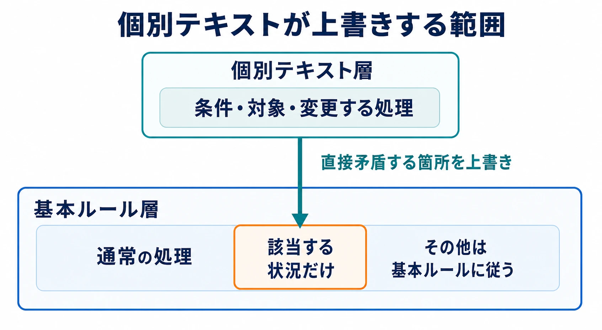
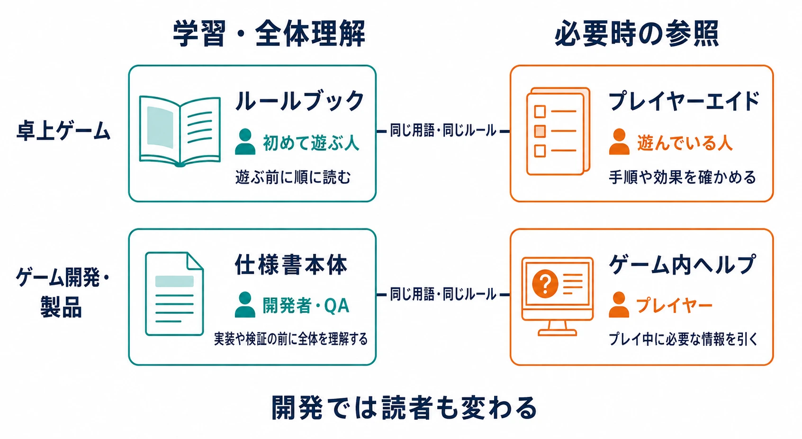
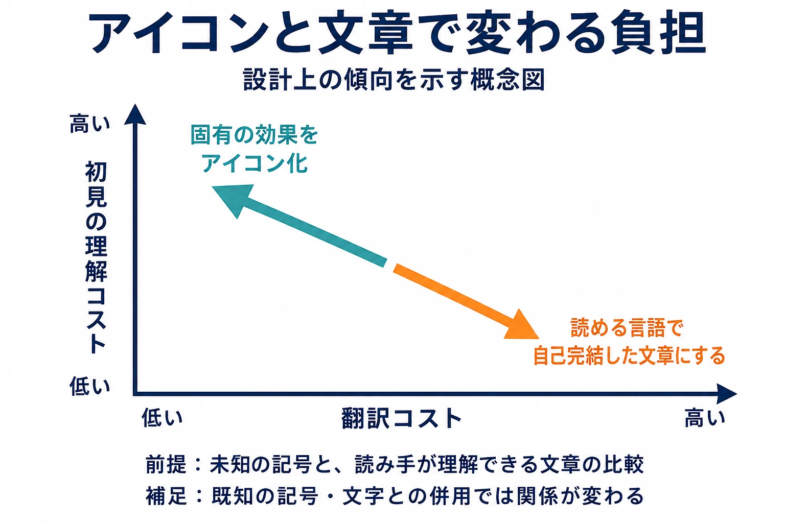

# ボードゲームのルールブックは「書いた人が同席できない仕様書」である

仕様書を書いて隣の席へ渡す。読み手が迷えば、その場で補足する。こうしたやり取りができる開発現場では、文書の足りない部分を会話が支えてくれる。

ボードゲームのルールブックが開かれるのは、作者が会ったこともない誰かの食卓だ。箱の中身を並べ、手番を進め、勝敗を決めるまで、作者が横から説明してくれることは期待できない。読者が自分たちでゲームを動かせるよう、言葉と図と参照先を組み立てる必要がある。

この条件から生まれる文書の工夫は、ゲーム開発にも持ち帰れる。本記事では出版社が公開する規約や実際のルールブックを読み、仕様書への移し方を考える。判断軸は一つだ。

**この仕様書は、書いた自分が休んだ日に読まれても成立するか。**

***

## 第1章　ルールブックは、作者が同席しない場所で読まれる

ルールブックの読み手は、説明を理解したうえで、駒やカードを使ってその内容を実行する。文章として自然でも、準備の途中で手が止まるなら、遊び方を届ける仕事はまだ終わっていない。

その確認に使われるのが **ブラインドテスト** だ。作者による説明や助言を受けず、初めて触れるプレイヤーがルールブックを頼りに遊ぶテストを指す。

クラウドファンディング支援サービスのBackerKitは、卓上ゲームの制作案内で、内部・ローカル・ブラインドという段階を紹介している。ブラインドの段階では、プレイヤーが箱を開け、説明書だけを手掛かりに遊ぶ。作者が同席する場合も観察者に徹し、その場の質問には答えない。文書だけで成立するかを確かめる、制作工程に組み込まれた手段なのである。[[1](#ref-1)]

ボードゲーム出版社Stonemaier Gamesの共同創業者で、同社のルールブックの多くを執筆・改稿するジェイミー・ステグマイアー氏は、ブラインドテストの目的の25%をルールブックの改善に置いていると説明する。これは同社の実務についての本人の目安だ。テスターが規則を見落としたときも、記述をさらに明瞭にしたり、見つけやすい位置へ移したりする機会と捉える。[[2](#ref-2)]

ここでは、書いてあるかに加えて、 **必要なときに見つかり、使われるか** が問われている。「読めば分かる」と説明者が言えても、読み手がそこにたどり着かなければ機能しない。

開発文書に移すなら、担当外の人に一つの処理を読んでもらい、何が起きるか、どの記述を根拠に判断したかを説明してもらう。その間、書き手は補足を控える。質問が出た箇所は、後で文書の表現や配置に戻して直す。

口頭依存の症状は、既刊の[「実装後に炎上する仕様書」の共通点](game-spec-pitfalls-and-how-to-write-clear-specs.md)で扱った。ここで持ち帰りたいのは、 **作者の説明を一時的に外し、文書そのものを使ってもらう** という具体的な確認方法だ。テスト全体の設計については[プレイテストの設計・運用方法論](playtest-design-and-operation-methodology-for-planners.md)に譲り、以降は文書の作りに絞って見ていく。

***

## 第2章　用語を先に決め、順序で守る

Stonemaier Gamesは2019年、デザイナー・文章の編集者・校正者が共有する自社スタイルガイドを公開した。ステグマイアー氏が出版社の制作実務としてまとめたもので、文章の表記だけでなく、ゲーム設計を点検する規約も含む。[[3](#ref-3)]

次の表は、その規約と、本記事で提案する仕様書への読み替えを並べたものだ。

| 同社の規約 | 仕様書へ移すときの着眼点 |
|---|---|
| shouldの全用例を削除する | 動作の確定事項、任意の操作、設計上の推奨を別々に書く。「するべき」で処理を決めない |
| exceptとrememberの全用例を洗い出す | 例外処理と、読み手の記憶に委ねた条件を点検対象として拾う |
| 順序のある手順は番号付きリスト、順序が無関係なら箇条書きにする | 並び順そのものに意味があるかを、書式で伝える |
| 用語は適切に導入してから使う。必要なら記述順序を変える | 読み手が未知の用語を抱えたまま処理説明へ進まないようにする |
| 一般ストックから得るときはtakeではなくgainを使う | 同じ取得処理に同じ動詞を割り当て、呼び名の違いから別処理を連想させない |
| プレイヤー固有の面はmat、全員共有の盤はboardとする | 個人用・共有用という対象の違いを名称にも持たせる |

たとえば、架空の開発文書で「報酬を獲得する」「報酬を取得する」「報酬を受け取る」が混在しているとする。同じ処理なら一語に揃えられる。所持枠へ直接加える処理と、受取箱へ送る処理が異なるなら、その違いを定義してから名前を分ける。用語の統一とは、何でも同じ言葉に丸めることではなく、処理の同一性と違いを言葉で保つことだ。

順序にも同じ働きがある。「予約枠を消費して報酬を確定する」と書くなら、予約枠が何かを先に説明する。用語集へのリンクだけで済ませず、最初に読む経路でも理解できる順番を考える。

同社はexceptやrememberを、設計を見直す手掛かりと位置づけている。例外を避け、ゲームの操作面や参照カードに示されていないことをプレイヤーに覚えさせすぎないためだ。[[3](#ref-3)] 仕様書でも、該当語を検索した後に直す対象は言葉だけとは限らない。処理の分け方や、必要な情報の置き場所にまで戻ることになる。

このように読むと、スタイルガイドは口頭補完が効かない文書を成立させるための規約でもある。作者が指を差して補う関係を、名称、定義、順序、書式に受け持たせている。

***

## 第3章　例外はルール本体ではなく、個別テキストへ書く

カードごとの特殊能力を持つゲームでは、基本の進行を共有しながら、個別の効果で特定の処理を変える。そのためには、どちらの記述を優先し、どこまで変更するかを決めておく必要がある。

『Magic: The Gathering』の総合ルール101.1は、カードのテキストが総合ルールと直接矛盾するとき、カードを優先すると定める。さらに、カードが上書きするのは **その特定の状況に適用されるルールだけ** と範囲を絞る。2026年2月27日発効版では、プレイヤーがいつでも投了できることを、この優先関係の例外として同じ項目に明記している。[[4](#ref-4)]

通称ゴールデンルールの要点は、カードが強いという一言よりも、 **優先順位と適用範囲を一緒に定義していること** にある。個別テキストがあるからといって、無関係な処理まで変わるわけではない。

ゲーム開発で特殊効果をマスターデータ、すなわち効果や条件を登録する共通のデータ表で管理する設計にも、同じ形を作れる。以下は説明のための架空例だ。

| 記述の置き場所 | 書く内容 |
|---|---|
| 基本仕様 | 攻撃時には対象の防御を適用する |
| 特殊効果の個別データ | この効果による攻撃では、対象の防御を無視する |
| 基本仕様と個別データをつなぐ規約 | 個別効果は、指定した攻撃の防御適用だけを上書きする。命中判定など、それ以外は基本仕様に従う |

基本仕様に特殊効果の名前を列挙し続ける代わりに、共通の処理と、個別に変更できる項目を定める。特殊効果側には、発動条件、対象、変更する項目を書く。これなら、新しい効果を追加するときも、担当者はどこへ何を書くかを判断できる。

この類推を実装に使う際には、複数の効果が同時に働く順序も、そのゲームの規約として決める必要がある。カードと基本ルールの優先関係は、複数効果の競合をすべて解決する規則とは役割が異なる。

例外が増えたときに文書を保つ鍵は、その置き場所にある。基本ルールへ際限なく追記する形から、 **基本ルールが個別テキストを受け入れる形** に変える。書き手が休んだ日にも、読み手が同じ優先関係をたどれるようにするのである。

***

## 第4章　複雑さは、文書の量で検知できる

文書を書いていると、説明が一部分だけ膨らむことがある。その長さは、文章力の問題とともに、仕様そのものの負担も映している。

ステグマイアー氏は、小さな概念の説明に丸々1ページ必要なら、その概念がゲームへもたらす価値に対して複雑すぎる兆候と捉える。また、ルールブックにexceptionという語を書いている場合、99%はプレイヤーにとって覚えにくく、取り除くべき要素の兆候だとしている。[[2](#ref-2)]

これは、同氏の設計上の経験則だ。仕様レビューへ持ち帰れるのは、ページ数による一律の合否ではなく、 **説明の分量と例外を示す語から、見直す箇所を具体的に拾う** という発想である。

レビューで「何となく複雑だ」と言われても、書き手は直す場所を選びにくい。「この小さな補助機能だけ説明が長い」「同じ段落に例外条件が集まっている」なら、同じ箇所を開いて検討できる。

### 仕様レビューへ移す手順

以下は、この発想を開発文書に移すための手順案だ。

1. **扱う概念を区切る。** 「戦闘全体」のような大きな単位ではなく、報酬の受取、行動の取消など、読み手が一つの処理として捉える範囲を選ぶ。
2. **説明が膨らんだ箇所を拾う。** 同じ書式で見比べ、本文、条件表、注記、参照先を合わせて、何を説明するために分量が増えたかを読む。
3. **例外を示す語を検索する。** 日本語の仕様書なら「例外」「ただし」「除く」「この場合のみ」などを手掛かりに、条件分岐が集中している箇所へ印を付ける。
4. **文章・配置・設計のどこを直すか決める。** 重複説明なら統合する。個別効果なら所定の欄へ移す。覚える条件が多すぎるなら、条件自体の統合や削除を検討する。
5. **変更後の処理を文書だけでたどる。** 読み手に通常時と条件成立時の結果を説明してもらい、参照先を含めて迷いが減ったか確かめる。

検索語は検査の入口だ。「ただし」を消して同じ条件を別の接続詞で書いても、仕様の負担は減らない。ページ数も文字を小さくすれば減るため、分量を評価する際には同じ表示条件を使う。

たとえば、架空の「報酬の自動受取」に、通常報酬、イベント報酬、再配布報酬ごとの判定が積み重なっているとする。説明が長くなった理由を読むと、本当に異なる受取処理が必要なのか、受取先を決める共通の条件へまとめられるのかを検討できる。

一方、個別の処理がプレイヤーの選択を豊かにしているなら、複雑さを残す判断もある。その場合は、個別データに条件を集めたり、画面上で現在の条件を示したりして、覚える負担を減らす。

レビューの記録には「長いので短縮」ではなく、「受取先の判定を共通化した」「個別効果の条件欄へ移した」と、決めた変更を書く。 **文書の長さを、設計について話し始めるための証拠にする** ことが、この技法の実用的な部分だ。

***

## 第5章　プレイ中に読む文書は、本文から分ける

初めてゲームを覚えるときには、目的から順に読みたい。遊んでいる最中には、今必要な処理だけを探したい。同じ読み手でも、読む時点によって文書への要求は変わる。

**プレイヤーエイド** とは、手順や効果など、プレイ中に繰り返し確かめる情報をまとめた早見表や参照カードである。

ステグマイアー氏は、初期のローカルテストではプレイヤーエイドから作り、ブラインドテストが近づいてからルールブックを書くという。ルールが変わり続ける時期に必要な参照情報を整理することが、最終製品でも各プレイヤーがエイドを持つ形の下地にもなる。完成版のルールブックでは、最終ページをアイコン一覧、ゲームフロー、索引などのために確保する方針だ。[[2](#ref-2)]

同氏が好む判型は180×240mmで、説明や図を置ける大きさと、プレイ中も卓上に置いておける大きさを両立させる。フォントは最低10ptとし、書体によってさらに大きくするという説明も、同じ記事への2026年1月11日の本人のコメントにある。[[2](#ref-2)] 文書設計には、文章を収める容量だけでなく、手元に置けるか、読める大きさかも含まれている。

ウォーゲーム出版社GMT Gamesの『Great Battles of the American Civil War』SERIES RULE BOOK 2023 Editionにも、読む経路を分ける構造がある。説明文に加え、Orders Comparison Chart（命令比較表）やBrigade Coordination Table（旅団連携表）を掲載し、巻末には索引を備える。節番号で細かな規則へ戻れるため、初めから読み直す以外の調べ方ができる。[[5](#ref-5)]

参照用の情報は、同じ冊子の表や最終ページにも、別のカードにも置ける。分ける対象はまず **順番に学ぶ役割と、必要な部分を引く役割** であり、物理的に別冊にすることは、その実現方法の一つだ。

### 開発では、設計の説明とプレイヤーへの案内を分ける

開発用の仕様書本体には、実装・検証に必要な条件や処理の全体像を書く。ゲーム内ヘルプには、プレイヤーがいま判断するために必要な情報を置く。チュートリアルは、そのうち最初に覚える操作を、体験する順序で案内する。

仕様書は開発者向け、ヘルプはプレイヤー向けなので、卓上の学習用・参照用の区分に、開発では読者の違いも重なる。ヘルプは仕様書の全文を縮めたものではなく、同じルールから読む目的に合う内容を選び直したものになる。

たとえば、特殊効果の仕様には適用条件と処理順が必要だが、プレイ中には「この攻撃は防御を無視する」という短い説明が役立つ。用語と効果の意味を共有しながら、必要な詳しさを変える。仕様を変更した際にどのヘルプやチュートリアルが影響を受けるかも、対応づけておくと更新しやすい。

***

## 第6章　アイコンは翻訳費を下げ、初見の理解に負担を移すことがある

短く伝える手段を選ぶ場面では、出版社の優先順位が分かれる。Mindclash Gamesは言語に依存しない図版の利点を強調し、ステグマイアー氏はカードの効果を文章で自己完結させる方針を示す。どちらも、プレイヤーが情報を読み取れることを目指している。[[6](#ref-6)][[2](#ref-2)]

Mindclash Gamesは、図版をアイコンだけで構成すれば、その図版は言語非依存となり、翻訳の時間と費用を大幅に減らせると説明する。同社は明瞭さも重視しており、複雑すぎるアイコンは分かりにくく、縮小すると細線や細部を印刷できなくなる問題も指摘する。文字とアイコンを組み合わせ、意味を学びやすくする方法も挙げている。[[6](#ref-6)]

これに対し、ステグマイアー氏の基本方針は、アイコンの組み合わせを解読させるより、カードに文章を書くことだ。その文章は、別冊の付録を読まなくても意味が通じる程度に自己完結させる。[[2](#ref-2)]

選択の違いは、 **同じ情報を、どの段階で理解してもらうか** にある。固有のアイコンを使うなら、プレイヤーはまずその意味を覚える。読める言語で効果が書かれていれば、その場で文章をたどれる。アイコンを覚えた後の参照の速さと、初めて見たときの理解しやすさは、分けて考えられる。

たとえば、架空の効果「この攻撃は防御を無視する」を独自の記号に置き換えれば、カード面の翻訳対象は減る。プレイヤーがその記号をまだ知らなければ、意味を別の場所で学ぶ必要がある。文章で書けばカード面から効果を読めるが、言語ごとの文章を用意する負担が生じる。

| 文書設計上の選択 | 下げやすい負担 | 別の場所に生じる負担 |
|---|---|---|
| 固有の効果をアイコンへ寄せる | カードや図版の翻訳・言語別管理 | 初見時に記号の意味を学び、参照先を引く負担 |
| 効果を自己完結した文章で書く | 読める言語のプレイヤーが、その場で意味を確かめる負担 | 文章の翻訳・言語別管理と、表示面積の確保 |

この比較は、未知の記号と、読み手が理解できる言語の文章を比べたときの整理だ。共通の意味が十分に知られたアイコンや、文字との併用では、負担の関係も変わる。

翻訳研究者Jonathan Evansは2013年の論文で、ボードゲームを、文章・画像・駒など複数の表現手段が組み合わさる **マルチモーダルなテキスト** として扱った。ゲーム内の不要な文章を避け、画像を使う設計が翻訳にどう関わるかを論じ、『Caylus Magna Carta』を分析している。[[7](#ref-7)] 文章を画像へ置き換えると、意味を伝える仕事の一部が記号とルールブックの関係へ移る、と捉えられる。

仕様書へ移すときも、図やアイコンの多さをそのまま分かりやすさと見なすことはできない。読み手が凡例を知っているか、初見でも意味を読める必要があるか、言語ごとの維持費をどこまで負担できるかで選ぶ。ローカライズ工程全体は[ゲームローカライズの工程と実践](game-localization-guide.md)を参照し、ここでは **翻訳コストと初見の理解コストの配分を、文書設計の判断として明示する** ことを持ち帰りたい。

***

## 第7章　出した後に直す――エラッタ、FAQ、改訂版

出荷後のルールにも、訂正や説明の追加が生じる。 **エラッタ** は、製品やルールブックの誤記・誤りを訂正する正誤情報だ。**FAQ** は、よく寄せられる疑問とその回答をまとめたものである。どちらも読者を助けるが、訂正箇所を探すことと、疑問から答えを探すことでは入口が違う。

**リビングルール** は、改訂や明確化を反映しながら更新されるルール文書を指す。

GMT Gamesの前掲『Great Battles of the American Civil War』2023年版リビングルールには、重要な規則変更と、多数の編集上の変更・明確化を含むと開発者注記がある。重要な規則変更は青字で表示される。訂正事項を別紙で告知するだけでなく、変更を反映した本文の中で、変わった規則を読める形である。[[5](#ref-5)]

これは、初めて読む人が現在の規則をたどり、以前から遊んでいる人が変更箇所に気づくための工夫だ。本文へ変更を統合することと、変更の目印を残すことを両立させている。

日本の出版社にも、直す場所を具体的に示す運用がある。アークライトは公式サイトでタイトル別にエラッタを掲載し、該当カードやルール説明書の箇所に対して「誤」「正」を並べる。読者は手元の記述と訂正後の内容を照合できる。[[8](#ref-8)]

ホビージャパンの正誤表ページは、メーカー、ゲーム名・原題、ページ、誤、正、備考という定型で情報をまとめ、訂正PDFやシール用データへのリンクも載せる。同ページは日本語版ゲームの正誤表を各ゲームのページで案内する旨も示しており、対象に応じて参照先をたどる構造になっている。[[9](#ref-9)] また、同社は2010年、『共和政ローマ（第2版）』について「エラッタ ver.1.05」という告知を出している。製品の版とともに、訂正情報そのものにも版を付ける例だ。[[10](#ref-10)]

### 変更内容を、現行本文と照合できる形にする

仕様書へ移すなら、次の情報をつなげると使いやすい。

| 読み手が知りたいこと | 用意する情報 |
|---|---|
| 現在はどう動くか | 改訂を反映した仕様書本体 |
| どこが変わったか | 対象の節・項目と、変更前／変更後の対比 |
| いつから適用するか | 適用する製品バージョンや更新日 |
| この変更一覧は新しいか | 変更一覧自体の更新日や版 |
| ヘルプなどは追随しているか | 対応する参照文書と更新状況 |

これは卓上の運用形式を開発向けに組み合わせた提案だ。本文は現在の処理を知るために使い、履歴は以前との差をたどるために使う。色による目印を取り入れる場合も、変更対象の項目と記録へのリンクを残せば、表示環境にかかわらず照合しやすい。

既刊が挙げた更新履歴の問題に対して、卓上の実物は、本文への統合、誤／正の対比、訂正情報の版管理という形を示している。どの挙動を修正対象とするかは[バグなのか仕様なのか――「グレーゾーン」の判断プロセス](bug-or-spec-gray-zone-decision-process.md)の領域であり、ここで扱うのは、決めた変更を読み手へ届ける方法である。

***

## おわりに　自分が休んだ日に、文書が仕事を続けられるか

ボードゲームのルールブックは、作者がその場にいなくても、読み手が自分で理解し、判断し、処理を進めるために作られる。そこから仕様書へ移せるのは、具体的な文書の仕組みだ。

- 用語を一元化し、定義を読んでから使える順序にする。
- 基本仕様と個別効果の置き場所を決め、上書きの範囲を示す。
- 説明の分量と例外を示す語から、設計を見直す箇所を拾う。
- 学習と参照を分け、変更を現行本文と履歴の両方へ届ける。

この類推には、修正を届ける方法という境界がある。印刷物やカードは、出荷後に手元の内容を一斉に差し替えることが難しい。その条件が、出荷前の文書検証を重くする。更新可能なデジタルゲームでは、パッチで処理や表示を変えられるため、同じ確定度と検証の重さを、あらゆる開発段階へ持ち込む必要はない。

移植したいのは、用語、例外の配置、複雑さの検知、更新の記録方法である。 **出荷前にすべてを確定させる前提そのもの** を、仕様書の運用へ移す必要はない。試作中なら、現在試す仕様と未決定の箇所が区別でき、次の担当者がその状態から仕事を続けられればよい。

「この仕様書は、書いた自分が休んだ日に読まれても成立するか」。その問いを置くと、今日直すべきものが見えやすくなる。同じ処理の呼び名か、例外の置き場所か、調べたい情報への入口か。卓上の文書技術は、その一か所を直すための具体的な選択肢になる。

## References

1. [The 3 stages of playtesting — Internal, Local, and Blind｜BackerKit][1] — 卓上ゲーム制作の段階と、ブラインドテストにおける作者の関わり方。

2. [What Makes a Great Rulebook?｜Stonemaier Games][2] — ジェイミー・ステグマイアー、2025年11月13日。テスト、複雑さ、参照情報、判型、カードテキストの方針。最小フォント10ptは、同ページの2026年1月11日付の本人によるコメントを参照。

3. [The Stonemaier Games Style Guide｜Stonemaier Games][3] — ジェイミー・ステグマイアー、2019年5月30日。公開中の自社規約にある用語、記述順、リスト形式、設計上の確認語。

4. [Magic: The Gathering Comprehensive Rules｜Wizards of the Coast][4] — 2026年2月27日発効版、101.1。カードと総合ルールの優先関係、適用範囲、投了の扱い。

5. [Great Battles of the American Civil War — Series Rule Book, 2023 Edition / Living Rules v2023｜GMT Games][5] — 開発者注記はp.2、命令比較表はp.8、旅団連携表はp.9、索引はpp.42–43。ページ番号は冊子に印刷されたもの。

6. [Board game iconography: How smart symbols enhance UX and playability｜Mindclash Games][6] — アイコンの言語非依存性、印刷時の明瞭さ、文字との併用。

7. [Translating board games: multimodality and play｜The Journal of Specialised Translation][7] — Jonathan Evans、No.20、2013年、pp.15–32。文章・画像・ゲームの構成物と翻訳の関係。

8. [エラッタ｜ArclightGames Official][8] — タイトルごとの訂正情報と「誤」「正」の対比による案内。

9. [ホビージャパン特選ゲーム サポートページ・正誤表｜ANALOG GAME INDEX][9] — メーカー・原題・該当ページ・誤／正・備考の定型と、訂正データへのリンク。

10. [共和政ローマ（第2版）エラッタ ver.1.05｜ホビージャパンゲームブログ][10] — 2010年5月7日。エラッタ自体に版番号を付けた告知の例。

[1]: https://www.backerkit.com/blog/tabletop-games-crowdfunding-roadmap/playtest/the-3-stages-of-playtesting-internal-local-and-blind/
[2]: https://stonemaiergames.com/what-makes-a-great-rulebook/
[3]: https://stonemaiergames.com/the-stonemaier-games-style-guide/
[4]: https://media.wizards.com/2026/downloads/MagicCompRules%2020260227.txt
[5]: https://gmtwebsiteassets.s3.us-west-2.amazonaws.com/gbacw/GBACW_Series_Living_Rules.pdf
[6]: https://mindclashgames.com/news/board-game-iconography-how-smart-symbols-enhance-ux-and-playability/
[7]: https://www.jostrans.org/article/view/7559
[8]: https://arclightgames.jp/category/errata/
[9]: https://hobbyjapan.games/error/
[10]: https://hobbyjapan.co.jp/game/?p=644

----

この文書は、Perplexity、Claude、OpenAI Codex の3つのAIの支援を受けて著述されたものです。引用画像を除き、MIT License にて提供されています。
