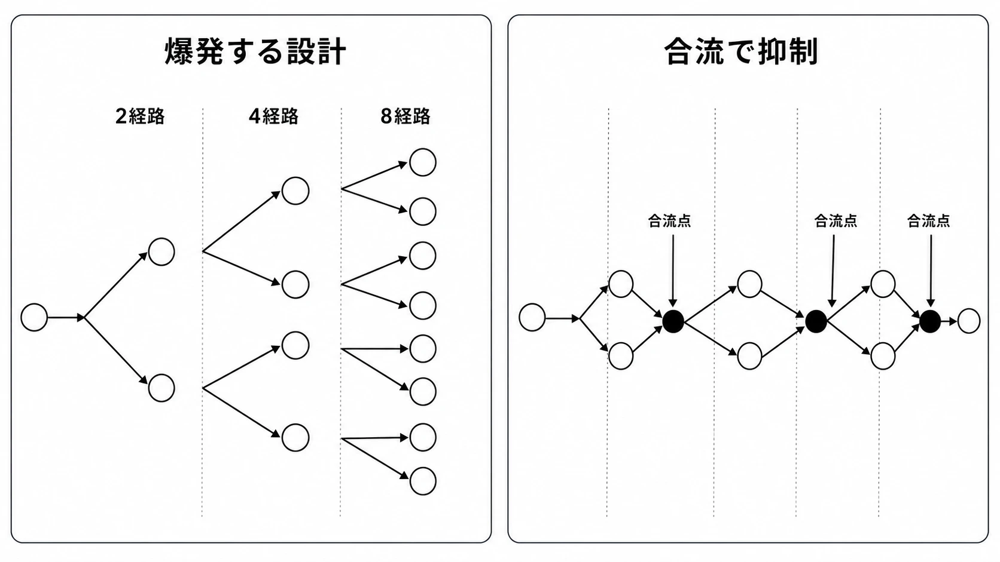
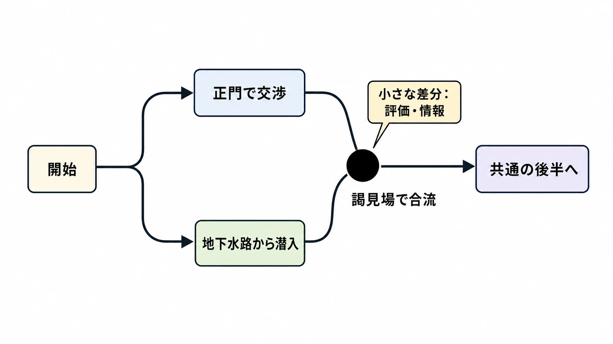

# 分岐シナリオ・マルチエンディング設計の実務——選択肢の裏で増える制作物と状態をどう制御するか

***

**「選択肢を二つ置けば、物語が二通りになってリプレイ性も上がる」。**

分岐シナリオを考え始めた新人プランナーが、最初につまずきやすい発想である。画面に選択肢を置くこと自体は難しくない。難しいのは、その後に増える台詞、演出、フラグ、セーブデータ、ボイス、翻訳、テストケースを、発売まで矛盾なく保つことだ。

しかも、選択肢の価値は分岐の本数では決まらない。プレイヤーが「自分で決めた」と感じ、その判断が後の体験へ読み取れる形で返ってくるかが重要である。GDCの分岐シナリオ講演でも、意味のある分岐を作るには、選択肢を出す時機、不要な枝、結末へ重みを持たせる選択、別経路へ送る選択と人物像を定める選択を区別する必要があると整理されている。[[1](#ref-1)]

この記事では、分岐を「豪華な物語」ではなく、 **制作物とゲーム状態を増やす仕組み** として捉える。何を分け、何を合流させ、何を記録するか。その判断軸を実務の側から見ていこう。

***

## なぜ分岐と複数のエンディングを作るのか

分岐には、一本の物語では得にくい魅力がある。

- プレイヤーの判断を主人公の行動へ反映し、物語への参加感を強める
- 別の選択を試したいという周回動機を作る
- プレイヤーごとに異なる体験を生み、感想交換や考察のきっかけを増やす
- 価値観、人物関係、勢力への態度などを、説明ではなく選択で表現させる

ただし、これらは **狙い** であり、自動的に得られる効果ではない。違う文言を選んでも直後の返事が一語変わるだけなら、周回する理由にはなりにくい。反対に、一つの選択で長大な専用ルートへ入っても、その枝を選ぶ人が少なければ、大量の制作物が一部のプレイヤーにしか届かない。

深く分岐する『As Dusk Falls』を扱ったGDC講演は、複雑なストーリーツリー全体を設計する視点と、一つひとつの枝を人物と感情のある物語として書く視点の両方が必要だと説明している。[[2](#ref-2)] 分岐は本数を増やせば完成する機能ではない。 **枝ごとの体験品質と、全体を完成させる生産能力を同時に成立させる設計** である。

企画の初期には、少なくとも次を言葉にしたい。

1. 選択によって何を感じてほしいのか。
2. 選択の影響を、いつ、どの程度見せるのか。
3. 一周しか遊ばない人にも、どこまでを届けるのか。
4. 見られない可能性のある専用コンテンツへ、どれだけ予算を割くのか。

「エンディングを五つ作る」は体験目標ではない。「誰を信じたかを最後に振り返らせる」「二周目で一周目の判断を読み替えさせる」のように、先に狙いを定める必要がある。

***

## 組み合わせ爆発は、文章量だけの問題ではない

### 枝を合流させなければ、経路は掛け算で増える

毎回二択があり、どの選択も以後の展開を完全に分けるとする。一回目の後は二経路、二回目の後は四経路、三回目の後は八経路になる。一般化すれば、各段階の選択肢数を掛け合わせた数だけ、到達経路が生まれ得る。

これが **組み合わせ爆発** である。ただし、「選択肢を置くと必ず全文量が指数関数的に増える」という意味ではない。後で合流する枝、同じ場面を共有する枝、条件で台詞だけを差し替える枝なら、制作物の増加を抑えられる。爆発するのは、過去の選択の組み合わせごとに異なる内容を最後まで持ち続ける設計だ。

*選択を完全に持ち越す設計では経路数が増え続ける一方、合流点を置くと制作・検証対象を抑えやすくなる。*

分岐によって増えるものは、台本だけではない。

| 増える対象 | 実務で発生する作業 |
|---|---|
| シナリオ | 分岐先の台詞、地の文、イベント、整合性確認 |
| レベル・演出 | 専用マップ、配置、カメラ、モーション、カットシーン |
| 実装 | 条件式、遷移、フラグ更新、例外処理、デバッグ表示 |
| ボイス | 台本整理、キャスト手配、収録、編集、ファイル管理、再収録 |
| ローカライズ | 翻訳、文脈資料、言語別調整、字幕、LQA |
| QA | 到達条件、各経路、セーブ・ロード、更新後の回帰テスト |

ここで重要なのは、 **経路数、固有コンテンツ量、状態数を分けて数えること** である。十通りの経路があっても、九割の場面を共有するなら、固有のマップや台詞は十倍にならない。一方、画面上は同じ場面でも、仲間の生死、好感度、所持品、過去の会話を持ち越すなら、内部状態の検証量は増える。

### 作った量と、一人が見る量は一致しない

一本の直線的な物語なら、完成した主要場面の多くを一周の中で見せられる。排他的な分岐では、プレイヤーが一方を選んだ瞬間、もう一方はその周回では見られない。

開発側は両方を書く。両方を実装し、翻訳し、テストする。しかし、一人のプレイヤーが見るのは片方だけである。周回を前提にしても、全員が最後まで遊び、さらに別ルートへ進むとは限らない。ヨコオタロウ氏（ゲームディレクター、代表作『NieR』シリーズ）も、自作の複数エンディングについて、一つだけ見てやめることも途中でやめることも正当な遊び方だと述べている。[[3](#ref-3)]

だから、分岐の費用対効果を「総プレイ時間」だけで判断すると危ない。次の三つを分けて見たい。

- **制作した総量**：チームが作り、管理し、検証する量
- **一周で届く量**：一人のプレイヤーが通常の進行で体験する量
- **差分として認識される量**：別の選択をしたとき、違いとして気づける量

差分が細かすぎると、コストをかけてもプレイヤーには同じ展開に見える。差分が大きすぎると、見られない専用コンテンツが増える。分岐を置く場所は、この間で決める。

### QAでは「枝」より「状態の持ち越し」が怖い

分岐のQAは、各エンディングへ一度到達すれば終わりではない。たとえば「人物Aを助けた」「鍵を持っている」「会話Bを聞いた」という三条件があると、同じ場面にも複数の状態で入れる。条件の一部だけが成立した状態、直前でセーブして再開した状態、旧バージョンのセーブを読み込んだ状態も考える必要がある。

ISTQB（International Software Testing Qualifications Board、国際ソフトウェアテスト資格認定委員会。ソフトウェアテスト技術者向けの国際資格認定団体）のゲームテスティング向けシラバスは、ゲーム状態を、ある時点のオブジェクトを表す全パラメーターと変数の値として説明している。そこには、物語へ影響するプレイヤーの選択のような隠しパラメーターも含まれる。また、状態のテストはセーブ・ロードと密接に関係するとしている。[[4](#ref-4)]

よく起きる不具合は、派手な誤字より次のようなものだ。

- 助けた人物が、合流後の会話では死亡扱いになっている
- 条件を満たしたのにエンディング判定へ反映されない
- チャプター選択で戻ると、後の周回フラグまで消える
- オートセーブの位置によって、選択前へ戻れたり戻れなかったりする
- 二つの条件を同時に満たすと、イベントが二重再生される
- 翻訳版だけ条件付き台詞の話者や性別が合わない

全組み合わせの総当たりが現実的でないなら、危険な境界を選ぶ。人物の生死、ルート確定、取り返しのつかない選択、エンディング直前、周回開始、セーブ形式の更新は優先度が高い。デバッグメニューから任意のフラグ状態と章へ移動できるようにしておくと、長時間の通しプレイだけに頼らず検証できる。

***

## 分岐地獄を避ける設計

分岐を減らすことと、選択を無意味にすることは同じではない。何を変えれば選択が伝わるかを選び、変えなくてよい制作物を共有する。

### 収束型分岐——枝を分けても、合流点を作る

**収束型分岐（コンバージェンス）** は、一時的に別の経路へ進んだ物語を、後の共通場面へ合流させる構造である。インタラクティブ物語用言語inkの公式文書にも、選択で枝分かれした流れを、プレイヤーに合流を意識させず再結合する例が示されている。[[5](#ref-5)]

たとえば、城へ入る方法を「正門で交渉する」「地下水路から潜入する」に分けても、城内の謁見場で合流できる。入口の体験は変わるが、城内全体を二本作る必要はない。

*大きな後半場面は共有しつつ、合流点の近くに評価や情報の差分を残す。*

合流を雑に行うと、「何を選んでも同じ」に見える。そこで、合流後にも小さな痕跡を残す。

- 侵入方法に応じて、同行者の評価や次の一言を変える
- 入手できた情報や道具を変え、後の攻略方法へ返す
- 同じ事件へ到達しても、誰を信用しているかを変える
- エンディング集計に使う態度や関係値を更新する

大きな地形やカットシーンは共有しつつ、プレイヤーの判断は局所的な反応へ残せる。ただし、合流前に人物が死亡し得るなら、合流後の全場面がその不在へ対応しなければならない。 **合流させるなら、何を共通状態へ戻し、何を持ち越すか** を決める必要がある。

### 選択と結果を離す——枝ではなく、反応を返す

選択の直後に世界を二分しなくてもよい。プレイヤーの態度を記録し、後の会話、支援、演出、結末の一部へ反映する方法がある。

これは「偽物の選択」を作る話ではない。選択の役割を、 **筋書きを変えること** から **主人公を表現すること** や **関係を変えること** へ移す設計である。

たとえば、負傷した仲間への返答を三つ用意しても、次の目的地は共通にできる。その代わり、仲間の反応、後の相談内容、最終局面での協力姿勢を変える。結果を遅らせるときは、プレイヤーが因果を読み取れる手掛かりが必要だ。忘れた頃に数値だけ加算されても、自分の選択が効いたとは感じにくい。

複数の小さな選択を「共感」「規律」「利己性」のような少数の軸へ集約し、しきい値で後の反応を変える方法もある。これなら、選択の全履歴ごとに専用ルートを書く必要はない。ただし、内部の採点基準がプレイヤーの意図とずれる危険がある。重要な結末を点数だけで決めるなら、どの行動をどう解釈するかをシナリオ、企画、QAで共有したい。

### 周回と視点変更——出来事を増やさず、意味を増やす

一周目と二周目で同じ場所や事件を使いながら、視点人物、聞こえる情報、操作能力、目的を変える方法がある。新しいマップを丸ごと増やさなくても、既知の出来事を読み替える体験を作れる。

| 方式 | 主に増やすもの | 共有しやすいもの | 主な危険 |
|---|---|---|---|
| 完全分岐 | 専用場面、専用結末 | 基本システム | 制作量と未体験量が大きい |
| 収束型分岐 | 分岐区間と反応差分 | 後半の場面、マップ | 合流が露骨だと選択が軽く見える |
| 状態反映型 | 条件付き台詞、関係値 | 主筋、演出の骨格 | フラグの相互作用が見えにくい |
| 周回・視点変更型 | 新情報、別視点の台詞や操作 | マップ、敵、事件の骨格 | 反復感が強いと離脱される |

周回型は安価な万能策ではない。同じ区間を遊ばせる以上、移動の短縮、戦闘の変化、既読スキップ、引き継ぎ、早い段階での新情報提示など、反復を負担にしない工夫が要る。再利用するのはアセットであって、プレイヤーの時間を雑に使ってよいわけではない。

***

## ケーススタディ｜NieRシリーズは周回で世界の見え方を変える

ここでは物語の結末には踏み込まず、構造だけを扱う。

ヨコオタロウ氏はGDC 2018で、初代『NieR』について、広いマップを作る予算がなかったため同じマップを複数回巡る構造にしたと説明している。一度エンディングを見た後のプレイでは、それまで理解できなかった側の声が分かるようになり、既知の物語の反対側を見せる。『NieR:Automata』では、同じ「小さなマップを複数回使う」考えを残しつつ、周回ごとに操作する人物と視点を変え、プレイヤーが理解したと思った世界をさらに広げる構造へ変更したという。[[6](#ref-6)]

*画像引用：[Steam - NieR:Automata](https://store.steampowered.com/app/524220/NieRAutomata/)（公式ストア掲載スクリーンショット、© SQUARE ENIX / PlatinumGames。本文中の周回構造・視点変更の説明に必要な範囲で引用。WebP変換）*

別のインタビューでも同氏は、長く、繰り返し遊べるゲームを目指す一方、制作できるレベル数には費用上の制限があったため、場所の数を抑えながら周回したくなる設計を考えたと述べている。[[7](#ref-7)] これは「予算が少なければ周回させればよい」という一般則ではない。 **制約を隠すのではなく、再訪によって情報と意味が変わる構造へ変換した** 事例として重要である。

『NieR Replicant ver.1.22474487139...』の公式紹介も、複数周回と異なるエンディングを持ち、後続の周回に自動戦闘を利用できることを案内している。[[8](#ref-8)] 同じ区間を再び通る可能性があるからこそ、反復時の操作負担をどう下げるかも体験設計の一部になる。

同氏は自作のエンディングAからEについて、先へ進むごとに新しい層や、より深い答えが見える構造だと説明している。[[3](#ref-3)] ここまでが開発者自身の発言から確認できる設計意図である。

そこから「一周目の正しさを二周目が問い直す」「プレイヤーに単一視点の限界を体験させる」と読むことはできる。ただし、これは作品構造に対する **本稿の解釈** であり、開発者発言そのものではない。ファンによる個々の象徴解釈とも分けて扱う必要がある。

実務の観点では、NieR型の構造は次の交換を行っている。

- 新規マップの絶対量を抑える代わりに、周回差分の台詞、演出、条件管理を作る
- 完全に別の物語を並列で作る代わりに、同じ事件へ別の情報層を重ねる
- 一周ですべてを説明する代わりに、先へ進む動機と離脱リスクを抱える

再利用によって消えるのは主に環境制作の一部であり、シナリオ、ボイス、条件分岐、QAが無料になるわけではない。それでも、作品の狙いが「別世界を何本も見せること」ではなく「知っている世界の意味を変えること」なら、コストと体験を同じ方向へ向けられる。

***

## エンディングは本数ではなく役割で設計する

「真エンディング」「バッドエンド」「隠しエンディング」という名前は便利だが、役割を決めずに増やすと、到達条件の違う結果画面が並ぶだけになる。

| 種別 | 期待される役割 | 設計時の注意 |
|---|---|---|
| 通常エンディング | 一周の決着を保証する | 続きを見ない人にも最低限の納得を残す |
| バッドエンド | 判断の代償や失敗条件を示す | 長い巻き戻しだけを罰にしない |
| ルート別エンディング | 人物・勢力・価値観ごとの帰結を返す | 他ルートを選ばないと理解不能にしすぎない |
| 真エンディング | 複数の経験を統合し、最終目標を与える | 他の結末を単なる不正解に見せる危険がある |
| 隠し・おまけエンディング | 探索、実験、ユーモアへの報酬 | 発見条件が理不尽だと攻略情報依存になる |

「真」と名づけた瞬間、ほかの結末は暫定版や失敗に見えやすい。複数の価値観を並べたい作品では、最終到達点を一つに固定しない方が合うこともある。反対に、周回を通して情報を積み上げる作品なら、後のエンディングを統合的な答えとして置く意味がある。

到達条件は、プレイヤーへのインセンティブにもなる。全仲間の生存、特定の収集物、複数ルートの完了を条件にすれば、探索や周回を促せる。しかし条件が作業量だけを要求し、物語上の意味と結びつかなければ、結末を見るための通行料になる。条件を決めるときは、 **その行動を経験した人だからこそ、この結末が響くのか** を考えたい。

### フラグ管理は「真偽値をたくさん置くこと」ではない

**フラグ** は、「人物を助けた」「エンディングBを見た」のような状態を記録する値である。真偽だけでなく、好感度、選択した勢力、周回数、到達段階のような数値や列挙値も使う。

実務では、次を決めておく。

- フラグの一意なID、意味、初期値、更新する場面
- 一周の中だけで有効か、周回後も残すか
- チャプター選択やニューゲームで巻き戻すか
- 複数条件が競合したときの優先順位
- 廃止・改名したフラグを旧セーブからどう移行するか
- エンディング判定後、いつ達成済みとして保存するか

「Aを助けた」と「Aが生存している」は同じとは限らない。原因となる選択、現在の世界状態、報酬の受領済み状態を一つのフラグへ詰め込むと、後から意味が崩れる。状態名は実装都合の省略語だけでなく、シナリオとQAが読んで同じ意味に取れるものにする。

また、エンディング到達を実績・トロフィーへ接続するなら、ゲーム内判定とプラットフォーム側の解除処理を分けて考える。Microsoftの実績実装ガイドでも、実績定義、進行の追跡、解除、非同期処理を組み合わせる手順が示されている。[[9](#ref-9)] エンディング映像が流れたのに実績だけ解除されない、オフライン解除が再接続後に反映されない、といった別の失敗経路が増える。

クラウドセーブでは同期競合も加わる。MicrosoftのGame Saves文書は、端末間同期、オフライン利用、競合処理、アップロード完了を別々の工程として扱っている。[[10](#ref-10)] 特定エンディング到達済みという周回メタ情報が古い端末のセーブで上書きされれば、分岐の解放条件まで失われ得る。どのデータをスロット単位、プロフィール単位、サーバー単位で持つかは、シナリオ仕様の外へ追い出せない問題である。

***

## シナリオライターだけでは分岐を完成させられない

役割分担は会社によって異なる。それでも、シナリオライターが台詞だけを書き、プランナーが後から枝をつなぐ進め方は危険である。文章として自然でも、到達不能な枝、条件の循環、収録後に必要と判明する差分が生まれるからだ。

企画側は、少なくとも次を含む **分岐の構造図** を用意する。

- ノードIDと場面名
- 入るための条件と、出るときに更新する状態
- 選択肢と遷移先
- 合流点、後戻り不能点、ルート確定点
- 専用のマップ、演出、ボイス、報酬
- セーブ可能地点と、再開時の入口
- 各エンディングの判定条件と優先順位

フローチャートは全体像を見るのに強いが、巨大になると更新されなくなる。構造図を正本にするのか、シナリオデータから自動生成するのかを決めたい。理想は、文章、実装データ、QA表が同じノードIDと行IDを参照する状態である。

### ローカライズと収録は、枝が固まるまで待てない

分岐台詞が増えれば、翻訳対象と収録対象も増える。さらに問題なのは量だけではない。台詞一覧を枝から切り離すと、翻訳者や声優には「誰が、誰に、どの過去を踏まえて話しているか」が見えにくくなる。

IGDA Localization SIGのガイドは、音声の見積もりに台詞数、語数、俳優数、各行の時間制約といった詳細な範囲が必要だとしている。また、大量の音声ファイルを追跡できる管理と、収録時の変更を字幕へ反映する運用も求めている。[[11](#ref-11)]

分岐作品では、各行に次の情報を添えると事故を減らせる。

- 一意な行ID、話者、相手、場面
- 直前の選択と感情の方向
- その台詞が出る条件
- 他の行との排他関係
- 口パク・尺合わせの有無
- 画面に出る字幕と、実際に採用した音声テイク

収録後に分岐を変えると、新しい一行だけを録るためにキャスト、スタジオ、音響、翻訳担当を再び動かすことがある。だからといって、台本が完全に固まるまで実装を止めれば、実機で分岐を試す時間がなくなる。仮音声や読み上げ、未収録を検出する自動チェックを使い、 **構造を早く試し、収録対象は段階的に固定する** のが現実的である。

***

## 分岐を企画するときの判断軸

最後に、分岐案をレビューするときの問いをまとめる。すべてに「はい」と答えるためのチェックリストではない。何へ予算を使うかを話す材料である。

1. この選択は、筋書き、人物表現、攻略、関係性のどれを変えるのか。
2. プレイヤーは、結果と自分の選択の因果を読み取れるか。
3. 専用コンテンツを作る価値がある枝と、反応差分で十分な枝を分けたか。
4. 合流後に持ち越す状態を、少数の明確な値へ整理できるか。
5. 一周でやめても物語として成立するか。周回する人には早く新味を返せるか。
6. 分岐追加によって増える台本、演出、音声、翻訳、QAを各部門が見積もったか。
7. 任意の状態から試せるデバッグ導線と、判定根拠を表示する仕組みがあるか。
8. セーブ、チャプター選択、周回、実績、クラウド同期で状態がどう変わるか決めたか。
9. そのエンディング条件は、作品が求める経験と結びついているか。
10. 枝を一本削ったとき、失われる体験を具体的に説明できるか。

分岐シナリオとマルチエンディングは、作品の豪華さを測る本数競争ではない。一つの選択に大きな専用ルートを返す作品もあれば、同じ出来事へ別の意味を重ねる作品もある。テキスト中心の小規模作品と、フルボイスの3D作品では、同じ枝一本の重さも違う。

重要なのは、プレイヤーへ返したい変化と、制作側が維持できる変化を一致させることだ。 **全部を分けるのではなく、何を共有しても選択の意味が残るかを設計する。** そこに、現場で破綻しない分岐シナリオの実務がある。

## References

1. [All Choice No Consequence: Efficiently Branching Narrative][1] - 分岐を効率よく設計する際に、選択の時機、不要な枝、結末へ影響する選択、経路変更と人物定義の区別を扱ったGDC 2016講演概要。

2. [A Narrative Multiverse: The Branching Structure of 'As Dusk Falls'][2] - 複雑なストーリーツリー全体と、個々の枝の感情的な物語を両立する設計を扱ったGDC 2023講演概要。

3. [Nier’s Yoko Taro On Success, Drinking, And Death][3] - 複数エンディングの各段階で新しい層を示す構造、途中でやめる遊び方、選択そのものの意味についてヨコオタロウ氏が述べたインタビュー。

4. [Certified Tester Game Testing Syllabus v1.0.1][4] - ゲーム状態を構成する明示・隠しパラメーター、物語へ影響する選択、セーブ・ロード時の状態テストを説明するISTQBのシラバス。

5. [Writing with ink][5] - 分岐、合流、変数、条件付き内容を記述するインタラクティブ物語用言語inkの公式文書。

6. [How Platinum designed and tuned Nier: Automata to 'feel' good][6] - GDC 2018でヨコオタロウ氏が説明した、初代『NieR』と『NieR:Automata』の周回、マップ再利用、視点変更の設計を報じた記事。

7. [Taro: "If Square Enix gives me money I will create anything"][7] - 制作できるレベル数の予算上の制約と、長く繰り返し遊べる構造の関係をヨコオタロウ氏が述べたインタビュー。

8. [New NieR Replicant gameplay showcases intense 2-on-1 boss fight][8] - 『NieR Replicant ver.1.22474487139...』の複数周回、異なるエンディング、後続周回で利用できる自動戦闘を紹介するPlayStation.Blogの記事。

9. [Implement player achievements in your game][9] - 実績定義、進行追跡、解除、非同期処理を含むMicrosoft GDKの実装ガイド。

10. [Game Saves quickstart][10] - 端末間同期、オフライン利用、競合処理、アップロードを扱うMicrosoft PlayFab Game Savesの公式文書。

11. [Best Practices for Game Localization][11] - 台詞・語数・俳優・時間制約に基づく音声見積もり、収録ファイル管理、収録時変更と字幕同期を扱うIGDA Localization SIGのガイド。

[1]: https://www.gdcvault.com/play/1023409/All-Choice-No-Consequence-Efficiently
[2]: https://www.gdcvault.com/play/1028903/A-Narrative-Multiverse-The-Branching
[3]: https://gameinformer.com/b/features/archive/2017/11/24/yoko-taro-nier-automata-interview-game-informer.aspx
[4]: https://istqb.org/wp-content/uploads/2024/11/ISTQB_CT_GaMe_Syllabus_v1.0.1_LtrKuyi.pdf
[5]: https://github.com/inkle/ink/blob/master/Documentation/WritingWithInk.md
[6]: https://www.gamedeveloper.com/design/how-platinum-designed-and-tuned-i-nier-automata-i-to-feel-good
[7]: https://www.gamereactor.eu/taro-if-square-enix-gives-me-money-i-will-create-anything/
[8]: https://blog.playstation.com/2021/04/16/new-nier-replicant-gameplay-showcases-intense-2-on-1-boss-fight/
[9]: https://learn.microsoft.com/en-us/gaming/gdk/docs/gdk-dev/pc-dev/tutorials/pc-e2e-guide/e2e-services/e2e-achievements
[10]: https://learn.microsoft.com/en-us/gaming/playfab/player-progression/game-saves/quickstart
[11]: https://igda-website.s3.us-east-2.amazonaws.com/wp-content/uploads/2021/04/09142137/Best-Practices-for-Game-Localization-v22.pdf

----

この文書は、Perplexity、Claude、OpenAI Codex の3つのAIの支援を受けて著述されたものです。引用画像を除き、MIT License にて提供されています。
