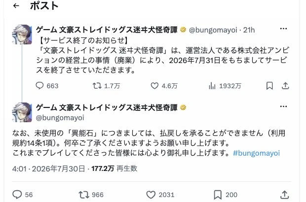
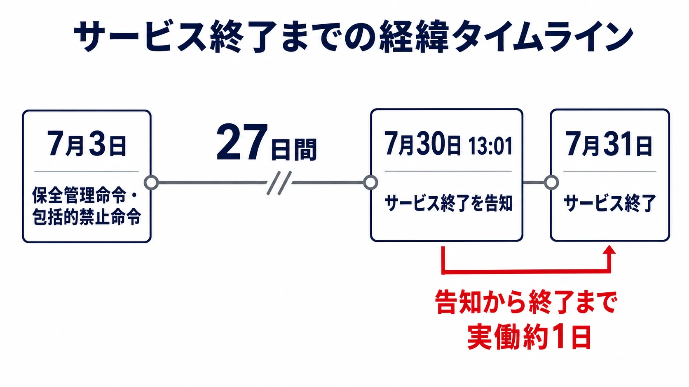
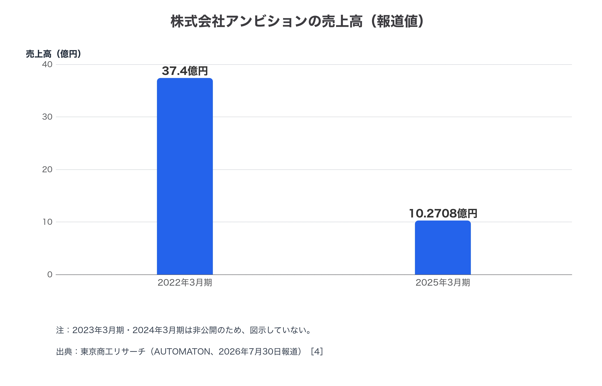
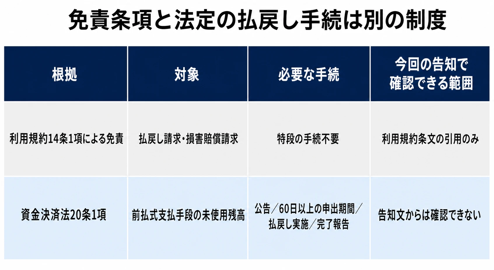
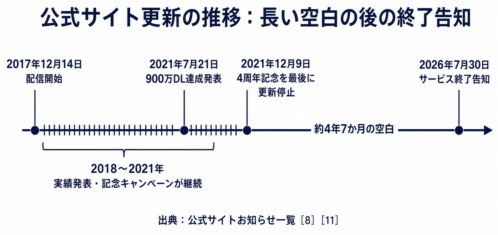

# 『文豪ストレイドッグス 迷ヰ犬怪奇譚』――告知から実質1日、廃業と「異能石」払戻し拒否が突いた法とサービス終了設計の隙間

> **注意：** 本稿は公開情報を基に、サービス終了時の前払式支払手段と利用規約をめぐる論点を整理しています。以下では、通常のサービス終了で求められる手順と照らし、告知と払戻しの説明にどのような隔たりがあるかを確認します。個別の法的助言ではありません。「異能石」が資金決済法上の前払式支払手段に該当するか、払戻義務が実際に生じているか、破産手続との関係を含む具体的な法的判断は、公表されていない契約条件・残高・手続の事実によって左右されます。具体的な権利行使や法的判断は、必ず弁護士・法務部門等に確認してください。資金決済法および関連する内閣府令は改正されることがあるため、最新の条文と公表資料を参照してください。

株式会社アンビションが運営していたスマートフォン向けゲーム「文豪ストレイドッグス 迷ヰ犬怪奇譚」（以下、迷ヰ犬怪奇譚）が、2026年7月31日をもってサービスを終了した[[1](#ref-1)][[2](#ref-2)]。2017年12月14日の配信開始から約8年7ヵ月続いたこのタイトルは、公式X（旧Twitter）でのサービス終了告知が2026年7月30日13時01分になされ、翌31日には終了するという、実質1日というきわめて短いスケジュールで幕を下ろした[[3](#ref-3)][[4](#ref-4)]。未使用の有償アイテム「異能石」は払い戻されないと告知の中で明記されており、この対応の妥当性を巡ってSNS上で疑問の声が上がっている[[2](#ref-2)][[5](#ref-5)]。

通常のサービス終了で必要となる課金停止、未使用残高の処理、終了告知、問い合わせ、データ・インフラ撤去をどの順序で設計するかは、[サービス終了をどう設計するか――オンラインゲームを破綻なく畳む実務](service-shutdown-design-and-practice.md)で整理している。本稿は、そうした終了手順が極端に圧縮されたときに表れた論点を扱う。

本稿は、実名の運営法人を扱う事例として、確認できた事実と、そこから生じる論点を明確に書き分ける。特定の対応を違法と断定することはせず、ゲームプランナーが自分の勤務先やプロジェクトに当てはめて判断できる材料を提示することを目的とする。

***

## 迷ヰ犬怪奇譚とは何だったか

迷ヰ犬怪奇譚は、朝霧カフカ・春河35によるマンガ「文豪ストレイドッグス」を原作とするTVアニメの、初のスマートフォン向けアプリとして位置づけられていたタイトルである[[6](#ref-6)][[7](#ref-7)]。事前登録は2017年8月24日に開始され、同年12月14日にiOS・Android向けに同時配信された[[8](#ref-8)]。ジャンルは公式に「爽快異能スリングパズル」と表記されており、太宰治や中島敦など実在の文豪の名を冠したキャラクターが、それぞれに割り当てられた「異能力」を用いて敵を弾き飛ばす、いわゆるひっぱりアクション（スリングショット型パズル）を基本操作としていた[[9](#ref-9)][[7](#ref-7)]。

運営法人は株式会社アンビション（東京都豊島区）であり、原作サイドである朝霧カフカ、春河35、KADOKAWA、文豪ストレイドッグス製作委員会とは別の法人である点は、本稿全体を通じて重要な前提である[[7](#ref-7)][[8](#ref-8)]。配信からのダウンロード数は段階的に公表され、2021年7月21日発表の「900万ダウンロード突破」が公式サイト上で確認できる最後の実績発表となっている[[10](#ref-10)][[11](#ref-11)]。

***

## 告知の中身を読む

出典：X公式アカウント「ゲーム 文豪ストレイドッグス迷ヰ犬怪奇譚」の[サービス終了告知](https://x.com/bungomayoi/status/2082677933949481016)および[未使用の「異能石」に関する告知](https://x.com/bungomayoi/status/2082677935522398520)（いずれも2026年7月30日投稿、スクリーンショット）。

告知が投稿されたのは2026年7月30日13時01分で、サービス終了は翌31日と定められていた。告知から終了までの実働時間はわずか1日である[[3](#ref-3)][[4](#ref-4)]。告知にはあわせて、問い合わせ用のメールアドレスが公開されているものの、すべての問い合わせに個別回答できるとは限らない旨が記載されていた[[3](#ref-3)]。加えて、版権元・関係各社（原作者、KADOKAWA、製作委員会）はアプリの運営について責任を負っていない旨が明記され、これらへの問い合わせを控えるよう利用者に注意喚起する構成になっている[[2](#ref-2)][[3](#ref-3)]。

告知から終了までの短さについて、専門メディアの取材に対しアンビション担当者が個別事情を説明したという報道は確認できていない。一方で信用調査会社の東京商工リサーチは、アンビションが2026年7月3日付けで東京地方裁判所から保全管理命令および包括的禁止命令を受けていたと報じている[[4](#ref-4)]。保全管理命令は、破産手続開始の申立て後、正式決定までの間に財産を確保するため保全管理人に管理を委ねる制度であり、包括的禁止命令は同じ期間中に債権者による強制執行などを禁止する制度である[[4](#ref-4)]。東京商工リサーチによれば、同社の売上高は2022年3月期の約37億4000万円から、直近の2025年3月期には約10億2708万円まで落ち込んでいたという[[4](#ref-4)]。この売上減少の要因や、廃業に至る意思決定の詳細については、公式資料で裏を取れる範囲を超えるため、本稿では扱わない。

***

## 「異能石」払戻し拒否を、規約の文言から読む

告知が払戻しを行わない根拠として挙げているのは「利用規約14条1項」である[[2](#ref-2)][[5](#ref-5)]。報道によれば、この条項はサービスの全部または一部を廃止した際に、運営会社が払い戻し請求や損害賠償請求から免責される旨を定めた、一般的な免責事項であるとされている[[5](#ref-5)]。つまり、「異能石」の払戻しを個別に禁じる専用の条項ではなく、サービス終了時の会社側の責任範囲を広く限定する条項を、今回の払戻し拒否の根拠として運営が引用した形になる。

これと並べて確認しておく必要があるのが、資金決済に関する法律（資金決済法）第20条の枠組みである。「異能石」のような有償で購入するゲーム内アイテムは、代表的な前払式支払手段（利用者が事前に対価を支払い、後から物品やサービスの提供を受ける権利）に該当しうる。前払式支払手段の発行者が発行業務の全部または一部を廃止したときは、資金決済法20条1項1号により払戻義務が生じ、払戻公告をした日の未使用残高について払戻しを実施することになると、資金決済法に基づく認定資金決済事業者協会である日本資金決済業協会が説明している[[12](#ref-12)][[13](#ref-13)][[14](#ref-14)]。

**ただし、前払式支払手段に該当し、資金決済法20条1項の適用を受ける未使用残高については、同項は発行者に払戻しを「しなければならない」と課す強行規定である。** この範囲では、利用規約の免責条項が法定の払戻義務を排除することはできない。**利用規約が資金決済法を上書きするのではなく、法令に反する限度で規約の効力が制限される。** [[16](#ref-16)]

義務が生じた場合の具体的な手続きも、金融庁の説明では次のように整理されている。

- 財務局長等への「払戻しの手続等に係る報告書」の提出と、発行業務の廃止届出[[13](#ref-13)]
- 官報・日刊新聞紙・電子公告のいずれかによる払戻し実施の公告。60日を下らない申出期間を設けること、期間内に申出のない保有者は払戻し手続から除斥されることなどを明示する必要がある[[13](#ref-13)]
- 営業所や自社サイト等での同内容の掲示、インターネット経由でサービスが提供される場合はメールやウェブページでの情報提供[[13](#ref-13)]
- 60日以上の期間、実際に払戻しを実施すること、完了後の報告書提出[[13](#ref-13)]

この二つを並べると、迷ヰ犬怪奇譚の告知は、利用規約に基づく一般的な免責を根拠として払戻しを行わない結論を示す一方、資金決済法20条1項1号の払戻義務に伴い内閣府令が定める公告・申出期間の設定・払戻し実施といった個別の法定手続を経た形跡は、公表されている告知文からは確認できない。SNS上では、この点を資金決済法20条1項を引いて疑問視する投稿が複数見られた[[4](#ref-4)]。一方で、Android版で購入した仮想通貨には購入日から180日以内の有効期限が利用規約上設けられているとの指摘もあり、有効期限が明確に定められた前払式支払手段は資金決済法の適用対象外となる規定があるため、iOS版とAndroid版とで法的な扱いが異なる可能性がある点も報じられている[[4](#ref-4)]。

なお、iOS版を対象にアンビション自身が公式サイトに掲示している資金決済法に基づく表示では、原則として商品販売後の払い戻しは行わないとしつつも、「各コンテンツの提供を終了する場合は、この限りではありません」との記載があり、今回の「払戻しを承ることができません」という説明と食い違いうる点も報じられている[[4](#ref-4)]。

以上を踏まえると、ここで確認できる論点は「一般的な免責条項の適用と、資金決済法が求める個別の払戻し手続とは、法的性質が異なる別の制度であるにもかかわらず、後者の手続を経た記録が公表されていない中で、前者を根拠に払戻しを行わない結論が示された」という構図である。これが資金決済法違反に該当するかどうかは、実際に前払式支払手段としての登録状況、有効期限の有無、破産手続との関係など、公表されていない事実に左右されるため、本稿では断定を避ける。読者自身が金融庁の資料等[[12](#ref-12)][[13](#ref-13)][[14](#ref-14)]を確認しながら判断してほしい。

***

## なぜ「予兆」に気づけた人がいたのか

サービス終了告知の唐突さとは対照的に、後から振り返ると気づけたはずのシグナルも存在した。公式サイトの「最新情報」欄を確認すると、更新の最後の投稿は2021年12月9日の「4周年記念キャンペーン」であり、それ以降、今回のサービス終了告知が掲載されるまで、新規の投稿が確認できない[[11](#ref-11)]。これは約4年7ヵ月にわたって公式サイトの更新が途絶えていたことを意味する。ダウンロード数の公表も2021年7月の900万ダウンロード発表を最後に途絶えており、実績発表と更新の両面で沈黙が続いていたことになる[[10](#ref-10)][[11](#ref-11)]。

告知後のSNS上には、長く遊んだ思い出への感謝を伝えつつ、突然の終了を惜しむ反応が見られた[[15](#ref-15)]。この点はあくまでSNS上で実際にあった反応の一例として紹介するものであり、事前に廃業や終了が公に確定していたことの証拠ではない。ただし、公式サイトの更新途絶や実績発表の停止といった「運営が対外的な発信をやめる」という行動は、サービスの継続性を外部から推し量る際の一つの手がかりになりうるという点は、事実として指摘できる。

***

## プランナーが持ち帰れる教訓

この事例からゲームプランナーが実務に持ち帰れる論点は、法的な断定の是非とは別に、いくつか具体的に整理できる。

- 事業継続性リスクを経営層と共有する仕組みを持つこと：現場のプランナーが把握できない資金繰りや法人としての存続可否は、サービス終了の意思決定タイミングを直接左右する。運営会社の経営状態が現場に共有されない構造そのものが、告知の急さを生む土台になりうる。
- 規約の終了条項を関連法令の要求と整合させて設計すること：一般的な免責条項を置くこと自体は珍しくないが、前払式支払手段を発行している事業では、資金決済法20条が求める払戻し手続と、規約上の免責がどう関係するのかを、平常時にあらかじめ法務部門・監督官庁対応の担当と確認しておく必要がある[[12](#ref-12)][[13](#ref-13)]。
- 払戻し手続きを事前に設計しておくこと：公告方法、申出期間、除斥の告知、完了報告といった一連の手続は、サービス終了が決まってから急いで組み立てるものではなく、平時の運用ドキュメントに組み込んでおくべき実務項目である[[13](#ref-13)]。
- 原作サイドとのライセンス契約と自社サービスの終了を切り離して考えること：迷ヰ犬怪奇譚は原作サイド（朝霧カフカ、春河35、KADOKAWA、製作委員会）と運営法人（アンビション）が別法人である構造をとっており、運営法人の廃業がそのまま原作サイドの責任を意味しない。告知文が版権元への問い合わせを控えるよう求めた背景には、この法人間の切り分けがある[[2](#ref-2)][[7](#ref-7)]。ライセンスを受けて運営するタイトルを企画する際は、自社の存続可否がライセンサーの責任範囲とは別問題であることを、利用者にも分かる形であらかじめ整理しておくと、終了時の混乱を減らせる。

なお、『文豪ストレイドッグス』を題材とする別タイトル『學園文豪ストレイドッグス』（運営元はNextNinja、2025年12月配信開始）は、今回サービス終了する迷ヰ犬怪奇譚とは運営会社もサービスも異なる別のプロダクトであり、両者を混同しないよう注意されたい[[17](#ref-17)]。

## References

1. [「文豪ストレイドッグス 迷ヰ犬怪奇譚」が運営法人廃業のため7月31日をもってサービス終了][1] - GAME Watch、2026年7月30日。

2. [『文豪ストレイドッグス 迷ヰ犬怪奇譚』7月31日のサービス終了が決定][2] - 電ファミニコゲーマー、2026年7月30日。

3. [「文スト」スマホゲーム、きょう告知→あす終了 突然のサ終にユーザー混乱 運営元の廃業で][3] - ITmedia NEWS、2026年7月30日。

4. [突如サービス終了する『文豪ストレイドッグス 迷ヰ犬怪奇譚』、運営元は“破産申立て済み”か][4] - AUTOMATON、2026年7月30日。

5. [アンビション、『文豪ストレイドッグス 迷ヰ犬怪奇譚』のサービスを2026年7月31日をもって終了][5] - gamebiz、2026年7月30日。

6. [「文豪ストレイドッグス 迷ヰ犬怪奇譚」が運営法人廃業のため7月31日をもってサービス終了][6] - Yahoo!ニュース／GAME Watch、2026年7月30日。

7. [『文スト 迷ヰ犬怪奇譚』運営会社が廃業、サービス終了へ][7] - Yahoo!ニュース、2026年7月30日。

8. [爽快異能スリングパズル 文豪ストレイドッグス 迷ヰ犬怪奇譚｜公式サイト お知らせ一覧][8] - 公式サイトのお知らせ一覧ページ。

9. [爽快異能スリングパズル 文豪ストレイドッグス 迷ヰ犬怪奇譚｜公式サイト FAQ][9] - 公式サイトのFAQページ。

10. [アンビション、『文豪ストレイドッグス 迷ヰ犬怪奇譚』が国内外で900万DL突破][10] - gamebiz、2021年7月26日。

11. [爽快異能スリングパズル 文豪ストレイドッグス 迷ヰ犬怪奇譚｜公式サイト][11] - 最新情報アーカイブ。

12. [コメントの概要及びコメントに対する金融庁の考え方][12] - 金融庁、前払式支払手段の払戻しに関する解説。

13. [前払式支払手段についてよくあるご質問 Q9][13] - 一般社団法人日本資金決済業協会、2026年7月19日更新。

14. [前払式支払手段(商品券・プリペイドカード等)関係][14] - 財務局、廃止に関する届出・報告の説明。

15. [十六夜蓮による「文マヨ」サービス終了への反応][15] - X、2026年7月30日。

16. [資金決済に関する法律（平成二十一年法律第五十九号）][16] - e-Gov法令検索、第20条第1項。

17. [資金決済法に基づく表示｜アプリゲーム「學園文豪ストレイドッグス」公式サイト][17] - NextNinja運営、別タイトル。

[1]: https://game.watch.impress.co.jp/docs/news/2129275.html
[2]: https://news.denfaminicogamer.jp/news/2607302n
[3]: https://www.itmedia.co.jp/news/article/2607/30/2000000310/
[4]: https://automaton-media.com/articles/newsjp/20260730-457471/
[5]: https://gamebiz.jp/news/430236
[6]: https://news.yahoo.co.jp/articles/c3b369074ad6a77ec4c35efa2f4ae357564205e9
[7]: https://news.yahoo.co.jp/articles/7c8c7362613e78cc55265ea75096624886e6300f
[8]: https://bungo-mayoi.jp/pc/
[9]: https://bungo-mayoi.jp/sp/faq.php
[10]: https://gamebiz.jp/news/330075
[11]: https://bungo-mayoi.jp/pc/
[12]: https://www.fsa.go.jp/news/21/kinyu/20100223-1/00.pdf
[13]: https://www.s-kessai.jp/businesses/prepaid/q_and_a/
[14]: https://lfb.mof.go.jp/kantou/kinyuu/pagekthp00400036.html
[15]: https://x.com/yuunagikazuha/status/2082819098594177462
[16]: https://laws.e-gov.go.jp/law/421AC0000000059
[17]: https://www.bunst-gakuen.com/payment_services_act/

----

この文書は、Perplexity、Claude、OpenAI Codex の3つのAIの支援を受けて著述されたものです。引用画像を除き、MIT License にて提供されています。
