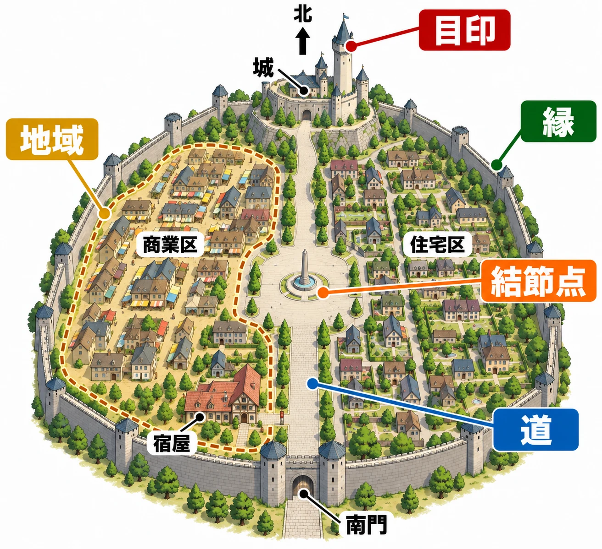

# 地図なしで、その街を覚えられるか――リンチの5要素で拠点の街を点検する

初めて入った城下町で、宿屋に泊まり、武器屋で装備を買い、城で話を聞く。出発前にもう一度宿屋へ寄ろうとしたとき、どちらへ歩けばよいだろうか。

「城から坂を下り、広場を抜けた先」と思い出せれば、そのまま進める。似た建物と曲がり角ばかりが浮かぶなら、地図を開いて宿屋の印を探すことになる。

拠点となる街は、冒険の合間に何度も行き来する場所だ。道を覚えられるかどうかは、買い物や準備のしやすさに関わる。さらに、目的地へ戻れる見通しがあれば、途中の路地にも寄ってみようと思える。

全7回のシリーズ「城と街から拠点をつくる」では、城や街の空間を、ゲームで人を動かすための手がかりとして読み解く。第1回の問いは、 **「プレイヤーは、その街を5つの要素で説明できるか」** である。説明に詰まるところを、迷いが生まれる原因の候補として点検していこう。

***

## リンチは、人の頭に残る街を調べた

都市計画家ケヴィン・リンチは、1960年に刊行した『The Image of the City』で、人が都市をどう捉えるかを論じた。[[1](#ref-1)] 調査したのは、ボストン、ジャージーシティ、ロサンゼルスの3都市である。少数の住民への聞き取りと、訓練を受けた観察者による現地調査を組み合わせた。[[2](#ref-2)]

住民には街の略図を描いてもらい、道順や印象に残る場所も尋ねている。原典の付録Bには、正確な図ではなく、知らない人へ街を説明するつもりで大まかな地図を描くよう求めた質問が載っている。[[1](#ref-1)]

街の各部分を見分け、全体のつながりをつかめることが「わかりやすさ（legibility）」、形や色、配置が頭の中に鮮明な像を生みやすいことが「イメージの浮かびやすさ（imageability）」である。[[1](#ref-1)] ゲームの拠点に引き寄せれば、「景色を覚えている」と「その景色を頼りに移動できる」を一緒に考える視点になる。

この考え方は、レベルデザインの教科書にも登場する。Christopher W. Tottenの『An Architectural Approach to Level Design』第2版（2019年）は、第4章「Basic Gamespaces」でリンチの都市像を扱う節を設けている。[[3](#ref-3)] 以下では、本稿の考察として、5要素を架空の城下町の点検に置き換える。

***

## 街を思い出す5つの手がかり

リンチが整理した5要素は、道・縁・地域・結節点・目印である。次の表の定義は原典第3章に基づく。右列は、それをゲームの拠点に当てはめた用途の例だ。[[1](#ref-1)]

| 要素 | 日常の言葉でいうと | ゲームの拠点で役立つこと |
| --- | --- | --- |
| 道（paths） | 人が移動する筋 | 主な行き先へ迷わず進める |
| 縁（edges） | 二つの領域の境目。隔てる壁にも、つなぐ継ぎ目にもなる | 街の範囲や区画の切り替わりがわかる |
| 地域（districts） | 共通の性格があり、中に入ったと感じられるまとまり | 今どの区画にいるかわかる |
| 結節点（nodes） | 道が交わる、または用途や活動が集中する地点 | 集まる場所・戻る場所がわかる |
| 目印（landmarks） | 外から見て位置を確かめる基準 | 遠くなら方角、近くなら曲がり角や店を見分けられる |

5要素は組み合わさって働く。[[1](#ref-1)] たとえば「市場の広場から、城の塔が見える坂を上る」という道順には、地域、結節点、目印、道がつながっている。ゲームの街でも、このように場所どうしの関係を言葉にできるかを確かめたい。

ここから使うのは、南門から中央広場を通って北の城へ続く大通りがあり、その西側に商業区、東側に住宅区が広がる、架空の城下町である。

城下町とリンチの5要素の関係を示す模式図。距離や縮尺を表すものではない。

***

## まず、道・地域・結節点をつなぐ

### 道――主要な行き先までの筋をつくる

南門から入ると、大通りが広場へ続き、その先に城へ上る坂が見える。この街の道筋は「門から広場を通って城へ」と一言で説明できる。

プランナーが最初に点検したいのは、よく使う施設へ向かう途中で、この筋を見失わないかである。宿屋から武器屋へ行くとき、何度も同じような角を曲がる配置なら、曲がる場所を取り違えやすい。そこで、宿屋の入口を大通りへ向ける、広場へ出る道を広くする、舗装を広場まで続ける、といった調整を考えられる。

基準にするのは、 **プレイヤーの画面で道の続きが読めるか** だ。見下ろした設計図では一直線でも、実際には露店や建物が先を隠していることがある。初めて城へ向かうときと、城から宿屋へ戻るときの両方で歩いてみたい。

脇道には、隠れた店や住民との出会いを置ける。寄り道の先から大通りへ戻る出口がわかれば、探索と日常の移動を両立しやすい。この関係を広く扱った記事として、[レベルデザイン入門](level-design-introduction-practical-guide.md)も参照できる。

### 地域――建物を覚える前に、区画を見分ける

架空の城下町では、西側に露店と開いた店先が続き、東側には庭や塀のある家が並ぶとしよう。店の位置を全部覚える前でも、「こちらは買い物をする区画」「あちらは住まいの区画」と捉えられる。

このまとまりが、施設を探す範囲を絞る手がかりになる。武器屋の正確な場所を忘れても、商業区へ向かうところまでは判断できる。

制作上の区画名は、プレイヤーが見分けるための材料と組み合わせたい。「商業区」と名付けた場所なら、店先の開き方、荷物の置かれ方、人の活動などに共通点を持たせる。隣の住宅区へ入ったときには、それらが変わる。色を変えるだけでなく、建物や使われ方の違いでも伝えるとよい。

点検では、正式名称を覚えているかより、 **「屋台が並ぶところ」のように自分の言葉で呼べるか** を見る。その呼び方と景色が結びついていれば、街の中で自分がいる範囲を説明できる。

### 結節点――戻ってきて、次の行き先を選ぶ

中央広場に依頼掲示板があり、大通りと商業区への道がそこに集まっているとする。冒険から戻ったプレイヤーは、広場で依頼を確認し、買い物へ行くか、城へ向かうかを選ぶ。

この広場は、「いったんここへ戻ろう」と思える場所になる。道の途中に広い空間を作るだけでなく、 **立ち寄る理由と、そこから選べる行き先** を組み合わせるのが設計の要点だ。

広場から出る道がどれも同じ姿なら、戻る場所がわかっても、その先で迷う。城へは坂、商業区へは露店が続く通り、南門へは門が見える大通り、というように出口を見分けられるかを確かめたい。

道は移動の筋、地域は今いる範囲、結節点は移動を組み立て直す場所になる。この三つがつながれば、「商業区から広場に戻り、坂を上って城へ」という説明を作れる。

***

## 縁と目印で、範囲と方角を確かめる

架空の城下町では、外周の城壁が街の範囲を示す縁になる。プレイヤーにとっては、「壁に沿って進めば門を探せる」という手がかりにもなる。区画の境目なら、水路と橋のように、切り替わる場所と渡る場所を一緒に見せる方法も考えられる。

城の塔は、遠くから方角を知る目印にできる。ここでは、宿屋を出たときや広場に着いたときなど、進む方向を決める位置から塔が見えるかを点検する。遠景用の塔に加えて、宿屋の入口に特徴のある看板を置けば、最後に入る建物を見分ける手がかりも作れる。

縁と目印を自然地形に当てはめる考え方は、[山の「目印・壁・眺望」を扱った記事](open-world-terrain-design-mountains.md)で詳しく述べた。本稿の街では、城壁や塔を、日々使う道・区画・広場と結びつけて考えたい。

***

## 本物らしさを、どこまで残すか

現実にありそうな街並みを作ることと、初めて訪れるプレイヤーが覚えやすい街を作ることは、いつも一致するわけではない。古い街らしい細い路地や入り組んだ区画を採用すれば、その複雑さを歩く体験も生まれる。

ここでプランナーが決めるのは、どの移動に、どれだけ迷う余地を持たせるかである。たとえば、日々の買い物が目的なら、宿屋と武器屋を大通りや広場から探しやすい位置に置く。一方、裏通りを調べること自体が遊びなら、曲がり角や行き止まりを残し、出口を探す楽しさを作れる。

架空の城下町であれば、店の生活感や住宅の細部を保ちつつ、大通りの幅や広場からの見通しを調整する案がある。本物らしさとわかりやすさの配分は、街全体で一律に決める必要はない。 **繰り返す用事の経路を覚えやすくし、その周囲に探索の余地を残す** という選び方もできる。

また、「地図なしで覚えられるか」は、空間の手がかりを調べるための問いである。製品の地図や経路案内は、必要な人が使えるように残したうえで、景色からも位置をつかめる街を目指せる。

***

## プレイヤーの説明から、街を点検する

次の手順は、リンチの分類を使った本稿の点検案である。制作側が5要素を説明するところから始め、そのあと実際に遊んだ人の説明と比べる。

1. **用事を決める**：宿屋から武器屋へ行き、城を訪ね、宿屋へ戻るなど、繰り返してほしい移動を選ぶ。
2. **初見の人に歩いてもらう**：想定するカメラと移動方法で遊んでもらい、立ち止まる場所、引き返す場所、地図を開く場所を記録する。地図を開いた理由もあとで聞く。
3. **街を説明してもらう**：移動後に地図を閉じてもらい、「宿屋へ戻るならどう行くか」「どんな区画があったか」を尋ねる。最初から5要素の名前を教えず、覚えている言葉を聞く。必要なら簡単な略図も描いてもらう。
4. **説明と行動を照らし合わせる**：下の表で手がかりを整理し、説明に詰まったところと、実際に進路を選べなかったところが重なるかを確かめる。

| 点検する要素 | プレイヤーに尋ねたいこと | 説明の例 | 詰まったときに見直す場所 |
| --- | --- | --- | --- |
| 道 | 主要な道は、どことどこを結んでいるか | 「門から広場を通って城へ上る道」 | 道の続き、曲がり角、往復での見え方 |
| 地域 | どんな区画があり、何で見分けたか | 「露店の多い区画と、庭のある家の区画」 | 区画内の共通点、隣の区画との違い |
| 結節点 | いったん戻るなら、どこへ行くか | 「掲示板がある中央広場」 | 立ち寄る理由、集まる道、出口の見分け方 |
| 目印 | 遠くから方向を知るには、何を見るか | 「城の塔が見える側へ進む」 | 進路を決める位置からの見え方 |
| 縁 | 街の端や区画の境目は、どこか | 「外側は城壁。水路の橋を渡ると別の区画」 | 境目の連続性、通り抜ける場所の示し方 |

たとえば「塔は覚えているが、広場から宿屋へ行く道がわからない」という結果なら、塔を大きくするより、広場の出口と宿屋へ続く道を見直したい。「店があることは覚えているが、どの区画だったかわからない」なら、地域の見分け方が手がかりになる。

説明できない要素は迷いの原因を探す出発点として使い、不具合かどうかは実際の行動と合わせて判断したい。小さな拠点なら地域を分けなくても用事を済ませられるし、言葉での説明が苦手でも歩けば戻れる人はいる。反対に、5要素を覚えていても、それらを結ぶ道が読めなければ迷う。

目指すのは、 **「プレイヤーが街を5要素で説明できるかを問い、説明に詰まった部分と迷った場所を照らし合わせる」** ことである。これなら「なんとなく歩きにくい」という感想を、道をつなぎ直す、区画を見分けやすくする、広場の出口を整理するといった修正へ結びつけられる。

***

## 次回から、城と街の形を読み解く

第2回以降では、今回の5要素を共通の物差しにして、入口、囲い、人の集まる場所、用途の痕跡、迷う道を見ていく。以下は全7回の予定である。

| 回 | 題材 | 深める要素と問い |
| --- | --- | --- |
| 第1回・本稿 | 街の覚えやすさ | 5要素で拠点を説明できるか |
| 第2回 | 日本の城 | 縁と道――入口の作りは、入り方や進み方をどう変えるか |
| 第3回 | 西洋の城 | 縁――何重もの守りは、内と外をどう段階づけるか |
| 第4回 | 城塞都市と城下町 | 縁と結節点――街を壁で囲うかどうかで、人の出入りはどう変わるか |
| 第5回 | 宿場町・村 | 結節点――なぜ、そこに人が集まるのか |
| 第6回 | 廃墟 | 地域――かつての用途の痕跡から、場所の性格を読めるか |
| 第7回 | 迷宮・地下 | 道――人を迷わせる空間をどう組み立てるか |

次回は日本の城の入口を取り上げる。街へ入る道をたどるだけでも、境目を越える体験は作れる。その道をどう曲げ、どこで立ち止まらせるのかを考えていこう。

## References

1. [Kevin Lynch『The Image of the City』][1] — The Technology Press／Harvard University Press、1960年（現在の刊行元はMIT Press）。第1章pp.2、9、第3章pp.46–49、付録B pp.140–141を参照。リンク先は出版社の書籍案内（ペーパーバック版）。

[1]: https://mitpress.mit.edu/9780262620017/the-image-of-the-city/

2. [MIT Libraries「Year 100 – 1960: The Image of the City by Kevin Lynch」][2] — 150 Years in the Stacks、2011年4月16日。調査対象の3都市と、聞き取り・現地観察という二つの方法を参照。

[2]: https://libraries.mit.edu/150books/2011/04/16/1960/

3. [Christopher W. Totten『An Architectural Approach to Level Design』第2版][3] — A K Peters／CRC Press、2019年。出版社の公式目次、第4章「Basic Gamespaces」内の「Organizing the Sandbox: Kevin Lynch’s Image of the City」を参照。本稿では同節が設けられている事実のみを用いた。

[3]: https://www.routledge.com/Architectural-Approach-to-Level-Design-Second-edition/Totten/p/book/9781351116305

----

この文書は、Perplexity、Claude、OpenAI Codex の3つのAIの支援を受けて著述されたものです。引用画像を除き、MIT License にて提供されています。
