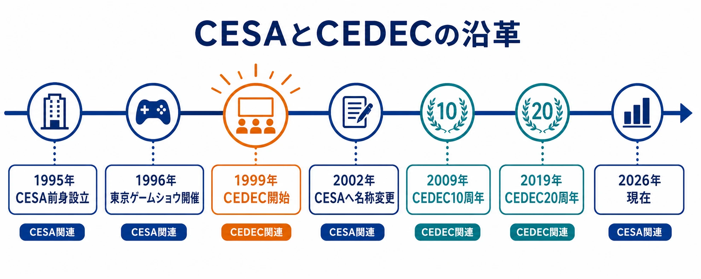
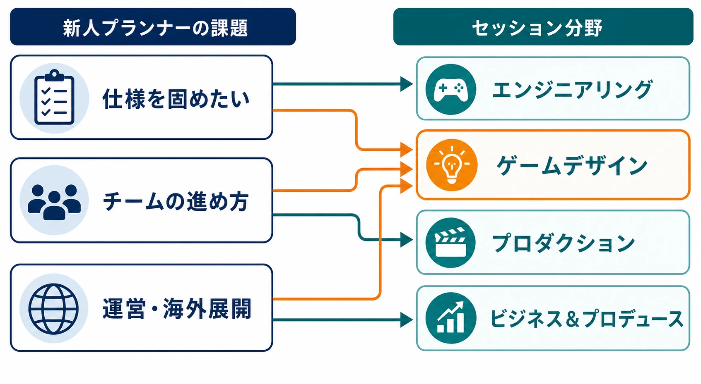
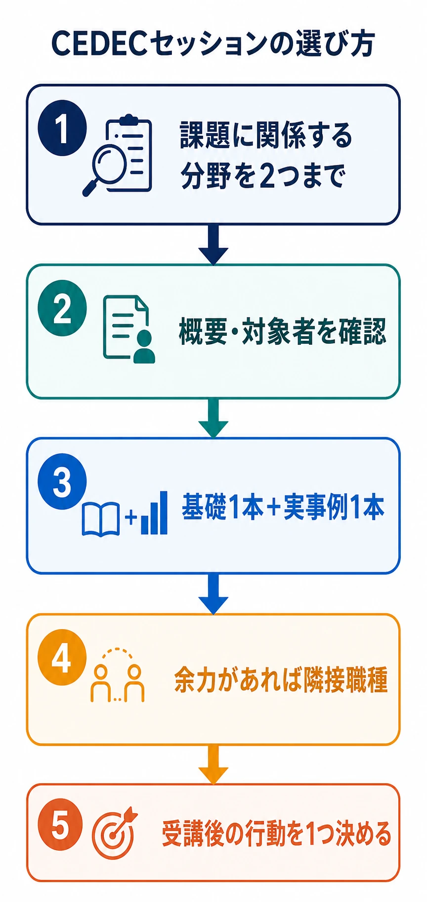

# CEDECとは何か――新人ゲームプランナーとゲームプレイヤーのための場の見取り図

CEDEC（Computer Entertainment Developers Conference）は、ゲームを中心とするコンピュータエンターテインメントの開発者が、技術や知識を共有するカンファレンスである。主催するのは、一般社団法人コンピュータエンターテインメント協会、略称CESAである。現在の公式開催概要では、開発に携わる人、エンターテインメントコンテンツの制作・ビジネスに携わる人、関連技術や機器を研究する人を対象に、毎年3日間、約200のセッションが行われている。[[1](#ref-1)]

ゲームプレイヤーから見ると、CEDECは新作を試遊したり、発売予定タイトルの情報を集めたりする展示会ではない。ゲームがどのように設計され、作られ、運営され、研究されているのかを、開発側の言葉で共有する場である。本稿は個別セッションの内容を先取りする予習記事ではなく、CEDECという場の成り立ち、構造、参加の仕方を整理するものである。

***

## CEDECを一言で説明すると

CEDECは、ゲーム開発の「知識共有」と「交流」を組み合わせた場である。講演者が完成したタイトルの開発事例を説明することもあれば、開発技術の基礎、研究成果、組織運営、失敗を含むプロジェクトの振り返りが扱われることもある。

ここでいうカンファレンスとは、単に有名な作品を紹介するイベントではない。ある問題に対して、どのような制約があり、どんな方法を選び、何がうまくいかなかったのかを、他の開発者が再利用できる知識として共有する場である。したがって、同じ職種の人だけでなく、隣接する職種がどのような判断をしているかを知る機会にもなる。

主催団体であるCESAは、ゲーム産業に関する調査・研究、普及・啓発、人材育成、展示会や研修会などの開催を事業として掲げている。CEDECは、そのなかでも開発者の知見共有と人材育成に近い役割を担う事業と位置づけられる。[[2](#ref-2)]

***

## 東京ゲームショウとの違い

CESAは東京ゲームショウ（TGS）も主催している。両者は同じ団体が運営するため混同されやすいが、来場者が得る体験と、イベントの中心にある情報が異なる。

| 比較項目 | 東京ゲームショウ | CEDEC |
| --- | --- | --- |
| 主な役割 | ゲームや関連サービスを広く見せる展示・発表・商談の場 | 開発技術、制作知識、研究成果、運営知見を共有する場 |
| 主な対象 | 一般消費者、報道関係者、流通、業界関係者 | 開発者、制作・ビジネス関係者、研究者、学生など |
| 代表的な体験 | 試遊、展示、ステージ、製品やサービスの紹介 | 講演、討論、ワークショップ、研究・事例の聴講 |
| 見る対象 | プレイヤーに届く商品やサービス | 商品やサービスを成立させる技術・工程・判断 |
| 開催のイメージ | 一般公開日を含む大規模なゲームイベント | 3日間で約200セッションを聴く専門カンファレンス |

東京ゲームショウはBtoBとBtoCの両方の機能を備え、一般公開日には多くの来場者を集めるイベントである。[[2](#ref-2)] 一方、CEDECの公式説明は「コンピュータエンターテインメント開発者を対象」と明示している。[[1](#ref-1)]

この違いは、ゲームプレイヤーにとっても重要である。TGSで見えるのは「何を遊べるようにするか」という製品側の情報であり、CEDECで見えるのは「なぜその遊び方が成立するのか」「どの問題を解くためにその実装や制作工程を選んだのか」という開発側の情報だからである。

***

## 1999年に始まったCEDECの沿革

CEDECは1999年、東京ゲームショウの併催イベントで行われた、開発者向けの技術・知識共有の勉強会を出発点として始まった。一般向け展示と並行していた開発者向けの勉強会が、CEDECという継続的なカンファレンスへ発展したのである。CEDEC公式の20周年時の説明では、当時は新しい家庭用ゲーム機が次々に発表され、タイトルの開発規模も拡大し、ハードウェア性能を引き出す技術、ゲームデザイン、プロジェクトマネジメントなど、開発環境全体に大きな変化が求められていたと振り返られている。[[3](#ref-3)]

つまりCEDECは、最初から一般向けの祭典として独立していたのではない。東京ゲームショウのように完成したゲームを見せる場とは別に、ゲームを作る側が技術や知見を持ち寄る場が必要になり、開発者向けの勉強会として始まったのである。初期開催については、会場や来場者数の具体的な数字より、開発者向けの勉強会として始まった経緯を押さえるのが適切である。

CESAの沿革は、CEDECの節目を次のように記録している。[[4](#ref-4)]

| 年 | CEDECとCESAに関する節目 |
| --- | --- |
| 1995年 | CESAの前身となるコンピュータエンターテインメントソフトウェア協会を設立 |
| 1996年 | 東京ゲームショウを開催 |
| 1999年 | CEDECを開催 |
| 2002年 | 社団法人コンピュータエンターテインメント協会へ名称変更。英文名もSupplier's Associationへ変更し、略称CESAは維持 |
| 2009年 | CESA沿革上、CEDEC 10周年 |
| 2019年 | CESA沿革上、CEDEC 20周年 |

CESA自体も、ゲーム産業の広がりに合わせて名称を変えてきた。1995年の設立時は「コンピュータエンターテインメントソフトウェア協会」であり、2002年に現在の日本語名称である「コンピュータエンターテインメント協会」へ変更された。英文名はComputer Entertainment Supplier's Associationとなったが、CESAという略称は変わっていない。[[4](#ref-4)]

沿革を見ると、CEDECは単独のイベントとして突然現れたのではなく、CESAが業界の共通課題に取り組み、東京ゲームショウのような一般向けイベントを運営していく流れのなかで生まれたことが分かる。名称の変化は、ゲームソフトだけでなく、ハードウェア、オンラインサービス、研究、教育、ビジネスを含む産業全体を扱う必要が高まったこととも重なる。

***

## セッションは7分野で構成される

CEDECの約200セッションは、テーマを探しやすくするため、エンジニアリング、プロダクション、ビジュアルアーツ、ビジネス＆プロデュース、サウンド、ゲームデザイン、アカデミック・学術研究の7分野に分類されている。[[5](#ref-5)]

分野は職種の所属を完全に分ける壁ではない。たとえば、新人プランナーがエンジニアリングのセッションでゲームAIやUI実装の制約を学び、プロダクションのセッションでQAやチーム運営を学ぶことには実務的な意味がある。分野名は「誰が聞くべきか」を考える入口であり、聴講範囲を狭めるための分類ではない。

### エンジニアリング

プログラマー、テクニカルディレクター、ネットワークやサーバーの担当者、セキュリティ担当者が、実装技術や運用技術を聞きに行く分野である。プログラミング、グラフィックス・レンダリング、ゲームAI、機械学習、シミュレーション、ネットワーク、データベース、品質保証、不正対策、開発環境などが含まれる。[[6](#ref-6)]

プランナーにとっては、仕様が実装可能かを考えるための基礎を得る分野でもある。たとえば、オンライン対戦の仕様、UIの表示制御、サーバー障害への備え、テスト自動化の話を聞けば、「やりたい体験」だけでなく、必要なデータ、通信、負荷、検証工数を企画初期から考えやすくなる。

### プロダクション

プロデューサー、ディレクター、プロジェクトマネージャー、リード職、QA、組織づくりや人材育成に関わる人が、開発工程とチーム運営を聞きに行く分野である。開発プロセス、品質保証、プロダクト管理、ナレッジ共有、採用、教育、キャリア、コミュニケーション、大規模開発のマネジメントなどが対象になる。[[6](#ref-6)]

新人プランナーには、仕様書を書く技術だけでなく、仕様を誰がいつ確認し、どの工程で品質を判断し、問題をどう共有するかを学ぶ場になる。ゲーム開発では、面白いアイデアがあっても、チームが継続的に作れなければ製品にならない。プロダクション分野は、その「作り続ける仕組み」を扱う。

### ビジュアルアーツ

コンセプトアーティスト、キャラクターデザイナー、背景・モデリング担当、アニメーター、エフェクト担当、UIデザイナー、テクニカルアーティストが、視覚表現と制作フローを聞きに行く分野である。レンダリング、シェーダー、ライティング、3Dアセット、モーション、モーションキャプチャ、エフェクト、UI、アートディレクション、アセット管理などが扱われる。[[6](#ref-6)]

プランナーが聞く場合は、絵の描き方そのものより、仕様が画面上の表現へ変換される条件に注目するとよい。たとえば、カメラ距離によるモデルの見え方、アニメーションの量産方法、UIのローカライズ、エフェクトの負荷、アセット差し替えの範囲を理解すると、アート担当へ渡す企画資料の粒度を調整できる。

### ビジネス＆プロデュース

プロデューサー、パブリッシャー、マーケティング、コミュニティ運営、事業開発、法務、ライセンス担当、eスポーツや教育事業に関わる人が、ゲームを事業として成立させる論点を聞きに行く分野である。市場分析、ユーザー動向、コミュニティ、課金やビジネススキーム、権利関係、海外展開、配信・実況、アクセシビリティ、ローカライズなどが含まれる。[[6](#ref-6)]

ゲームデザインの判断は、面白さだけで完結しない。販売地域、運営体制、権利処理、広告、コミュニティとの関係、サービス終了時の対応まで含めて考える必要がある。ビジネス＆プロデュース分野は、企画を市場や組織の条件へ接続するための視点を得る場所である。

### サウンド

作曲家、サウンドデザイナー、音声ディレクター、レコーディング担当、オーディオプログラマー、ローカライズ担当が、音楽・効果音・音声をゲーム内で機能させる方法を聞きに行く分野である。インタラクティブな音響演出、楽曲と効果音の制作、音声収録、実装、アセット管理、ローカライズ、信号処理、空間音響、サウンドツールなどが対象となる。[[6](#ref-6)]

プランナーは、音を最後に付ける演出素材としてではなく、プレイヤーの判断を支える情報として学べる。敵の接近を知らせる音、攻撃の成功を伝える音、場所の違いを示す音、字幕や音量設定と組み合わせたアクセシビリティなど、ゲームデザインとサウンドの境界にある話題は企画にも直結する。

### ゲームデザイン

ゲームプランナー、ゲームデザイナー、レベルデザイナー、シナリオ担当、ディレクター、UX担当が中心に聞きに行く分野である。企画やディレクション、ゲームシステム、ステージ配置、バランス調整、ストーリー、サービス運営、ユーザーテスト、仕様書、プロトタイピングなどが扱われる。[[6](#ref-6)]

新人プランナーにとって最も見つけやすい分野だが、「企画の正解を教えてもらう場所」と考えると学びを取り逃がす。公式の分野定義にも、成功事例だけでなく、ユーザーコミュニティとの共創、ゲーム内経済、サービス終了、仕様書、ポストモーテムなど、条件の違う問題を扱う幅がある。[[6](#ref-6)]

聞くべきなのは、講演者が採用した手法の名前だけではない。どんなプレイヤー体験を目標にしたのか、どの制約があったのか、何を捨てたのか、効果をどう確かめたのかを聞くと、自分の企画へ移植できる部分とできない部分を分けられる。

### アカデミック・学術研究

大学や研究機関の研究者、企業のR&D担当、新しい技術や評価方法を探すエンジニア、将来のゲーム開発を考える学生が聞きに行く分野である。インタラクション、表示技術、コンテンツ制作技術、認知科学、行動心理学、評価手法、人文社会科学、教育・福祉への応用などが含まれる。[[6](#ref-6)]

この分野の内容が、そのまま明日から製品へ入るとは限らない。しかし、プレイヤーの行動をどう測るか、触覚や視線をどう扱うか、体験をどのように評価するかといった、現場だけでは見落としやすい問いを得られる。実用化された事例を探すだけでなく、数年後の企画の種を探す場所と考えるとよい。

***

## セッションの形式も使い分ける

CEDECには、レギュラーセッション、ショートセッション、パネルディスカッション、ラウンドテーブル、インタラクティブセッション、ワークショップ、チュートリアル、ライトニングトークなどの形式がある。レギュラーセッションは講演者が登壇して説明する基本形で、パネルディスカッションは複数の登壇者が議論し、ラウンドテーブルは参加者も含めて意見交換する形式である。ワークショップは参加型の学習、チュートリアルは基礎からの講義、ライトニングトークは短時間の発表に向いている。[[7](#ref-7)]

形式の違いは、同じテーマでも得られるものを変える。初めて触れる技術ならチュートリアル、事例の全体像をつかみたいならレギュラーセッション、複数の立場の違いを知りたいならパネルやラウンドテーブル、手を動かして理解したいならワークショップやインタラクティブセッションが候補になる。

***

## セッション以外にあるCEDECの機能

CEDECは講演を聞くだけのイベントではない。開発者の功績を可視化し、参加者同士をつなぎ、企画を試す場も用意されている。

### CEDEC AWARDS

CEDEC AWARDSは、コンピュータエンターテインメント開発の進歩に貢献した技術や開発者、ゲーム開発に関する書籍やWeb記事などの情報発信を、技術と情報発信の面から表彰する制度である。目的は、功績を称えるだけでなく、開発技術の普及と啓蒙、産業の発展につなげることにある。[[8](#ref-8)]

プレイヤーにとっては、完成したゲームの人気ランキングとは別の評価軸を知る機会になる。ゲームの裏側にある技術、デザイン、サウンド、開発者向けの情報発信が、どのように業界内で価値づけられているかを見られるからである。

### Developers' Night

Developers' Nightは、CEDEC会期2日目の夜に行われる開発者交流パーティーである。公式には参加者同士の交流だけでなく、新しい出会いやビジネスチャンスにつながる機会と説明されている。[[9](#ref-9)]

新人にとっては、著名な講演者へ一方的に挨拶する場というより、同じセッションを聞いた人と感想を交換する場として使う方が現実的である。自己紹介は、所属や肩書を長く説明するより、「どんなゲームの、どんな課題に関心があるか」を一言で伝えられるようにしておくと会話が続きやすい。

### PERACON

PERACONは、事前に設定されたテーマに沿って、企画コンセプトをA4用紙1枚相当の画像にまとめて競う「ペラ企画コンテスト」である。作品は短時間で内容を理解できることが重視され、審査員による評価と結果発表が行われる。[[10](#ref-10)]

PERACONの面白さは、長い企画書を書く前に、企画の核を一枚へ圧縮する点にある。新人プランナーにとっては、アイデアの数を増やすより、誰に何を体験させる企画なのかを短く伝える訓練になる。セッションを聞くだけでなく、自分の企画を外へ出して反応を見る参加方法もある。

***

## 新人プランナーが受講するときの実務的な選び方

CEDECの約200セッションをすべて見ることは現実的ではない。目的を「全部知る」から「次の仕事の判断を一つ改善する」へ置き換えると、選びやすくなる。

### まず自分の課題を一文にする

「ゲームデザインを勉強する」では広すぎる。「仕様書の抜け漏れを減らしたい」「ステージ案をエンジニアへ渡す前に実装条件を知りたい」「ユーザーテストの結果を企画へ戻す方法を知りたい」のように、現在の課題を一文にする。

次に、その課題に直接関係する分野を2つ選ぶ。企画の仕様ならゲームデザインとエンジニアリング、チームの進め方ならプロダクションとゲームデザイン、運営や海外展開ならビジネス＆プロデュースとゲームデザインという組み合わせが考えられる。

### 公式サイトの絞り込みを使う

公式ガイドでは、分野だけでなく、キーワード、難易度、プラットフォームなどを使ってセッションを探せる。2026年のガイドにも、分野、キーワード、難易度の確認方法と、ライブ配信・タイムシフト配信などの案内が掲載されている。[[11](#ref-11)]

タイトルだけで判断せず、次の順番で候補を減らすとよい。

1. 自分の課題に関係する分野を2つまで選ぶ。
2. セッション概要から、扱う問題と対象者を確認する。
3. 難易度を見て、基礎講座を1本、実事例を1本選ぶ。
4. 余力があれば、隣接職種のセッションを1本入れる。
5. 受講後に試す行動を、各セッション一つだけ決める。

  

「有名タイトルだから見る」だけでは、情報が自分の仕事へ結びつかない。タイトル名より、どの問題を、どんな制約のもとで解いた話なのかを見るべきである。

### 現地受講とオンライン受講を選ぶ

CEDECは年度によって細部が変わるが、2026年の受講パスには、現地とオンラインの両方を含むレギュラーパス、現地1日だけのデイリーパス、学生向けのエキスポパス、オンライン3日間とタイムシフトを含むオンラインパスなどが用意されている。参加できるプログラムや配信範囲はパスごとに異なるため、購入前に公式のパス一覧を確認する必要がある。[[12](#ref-12)]

現地受講に向くのは、会場の空気を感じたい人、交流ラウンジや展示、対面の質問機会を重視する人である。Developers' Nightのような交流イベントに参加したい場合も、現地参加可能なパスと別途条件を確認する必要がある。オンライン受講に向くのは、移動時間を抑えたい人、複数セッションを自分のペースで見直したい人、地方や海外から参加する人である。

ただし、すべてのセッションが同じ形で配信されるとは限らない。ライブ配信やタイムシフト配信の有無はセッションごとに確認するのが安全である。[[11](#ref-11)]

### ノートは「方法」より「条件」を残す

新人がセッションを聞くときは、講演者の結論をそのまま自社へ持ち込まない方がよい。次の3点を分けて記録すると、後で企画へ翻訳しやすい。

- 解こうとしていた問題は何か
- その解決策が成立した条件は何か
- 自分のチームで試すなら、最初に何を小さく検証するか

たとえば「自動化が成功した」という話を聞いたとき、重要なのはツール名だけではない。対象データの規模、既存パイプライン、担当者のスキル、導入前にかかった準備、失敗時の戻し方まで確認して初めて、自分のプロジェクトとの距離が分かる。

***

## CEDECをどう見るとよいか

CEDECは、ゲーム開発の最新トレンドを一方的に受け取る場所ではない。技術、制作工程、アート、ビジネス、サウンド、ゲームデザイン、研究を横断し、開発者同士が「何を作ったか」だけでなく「なぜその判断をしたか」を共有する場である。

新人ゲームプランナーにとっての価値は、企画のアイデアを増やすことだけではない。自分の仕様がどの職種へ渡り、どの制約を受け、どのような検証を経てプレイヤーへ届くのかを、具体的な事例から学べる点にある。

ゲームプレイヤーにとっては、普段遊んでいる作品を、完成品としてだけでなく、技術、制作、運営、研究の積み重ねとして見直すきっかけになる。東京ゲームショウが「何が遊べるのか」を見せる場だとすれば、CEDECは「それを成立させるために、どんな知識と判断が必要だったのか」を共有する場である。

個別セッションの予習は、各テーマに応じた別の記事や公式セッション概要で行えばよい。本稿で押さえるべきなのは、CEDECを一つの巨大な講演一覧として見るのではなく、自分の課題に合う分野、形式、受講方法を選び、聞いた知見を開発上の小さな行動へ変換することである。

## References

1. [CEDEC2026「開催概要」][1] - CEDECの対象者、3日間・約200セッション、会場・オンライン、主催者を示す公式情報。

2. [CESA「目的と事業」][2] - CESAの目的と事業、東京ゲームショウの役割を示す公式情報。

3. [CEDEC2018「CEDEC 2018に向けて」][3] - 1999年に東京ゲームショウ併催の開発者向け勉強会として始まった経緯を示す公式説明。

4. [CESA「沿革」][4] - 1995年の設立、2002年の名称変更、CEDECの2009年10周年・2019年20周年を示す公式沿革。

5. [CEDEC2026「セッション分野定義」][5] - 7分野の分類と各分野の対象領域を示す公式情報。

6. [CEDEC2026「セッション分野定義」][6] - エンジニアリング、プロダクション、ビジュアルアーツ、ゲームデザイン、サウンド、ビジネス＆プロデュース、学術研究の詳細な分野定義。

7. [CEDEC2026「セッション形式定義」][7] - レギュラー、ショート、パネル、ラウンドテーブル、インタラクティブ、ワークショップ、チュートリアル、ライトニングトークの定義。

8. [CEDEC AWARDS 2026][8] - 技術、開発者、書籍・Web記事などの情報発信を表彰する制度の目的と概要。

9. [CEDEC2026「Developers' Night」][9] - 開発者交流パーティーの趣旨と参加条件を示す公式情報。

10. [CEDEC2026「PERACON2026 結果発表」][10] - A4用紙1枚相当で企画コンセプトを競うコンテストの説明。

11. [CEDEC2026「受講ガイド」][11] - セッションの絞り込み、難易度、キーワード、オンライン配信の確認方法を示す公式ガイド。

12. [CEDEC2026「受講パスの種類と価格」][12] - 現地・オンライン、レギュラー、デイリー、エキスポ、オンラインなどの受講パスの構成を示す公式情報。

[1]: https://cedec.cesa.or.jp/2026/outline/
[2]: https://www.cesa.or.jp/about/purpose/
[3]: https://cedec.cesa.or.jp/2018/
[4]: https://www.cesa.or.jp/about/history/
[5]: https://cedec.cesa.or.jp/2026/guide/
[6]: https://cedec.cesa.or.jp/2026/session/field/
[7]: https://cedec.cesa.or.jp/2026/session/format/
[8]: https://cedec.cesa.or.jp/2026/event/awards/
[9]: https://cedec.cesa.or.jp/2026/event/developer/
[10]: https://cedec.cesa.or.jp/2026/timetable/detail/s69fdca16035b7/
[11]: https://cedec.cesa.or.jp/2026/guide/enrollment/
[12]: https://cedec.cesa.or.jp/2026/ticket_guide/price/

----

この文書は、Perplexity、Claude、OpenAI Codex の3つのAIの支援を受けて著述されたものです。引用画像を除き、MIT License にて提供されています。
