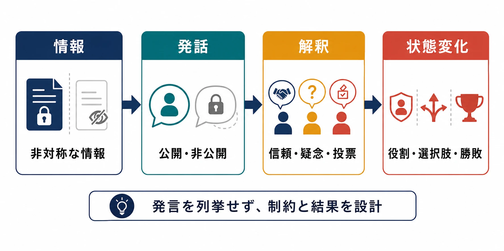
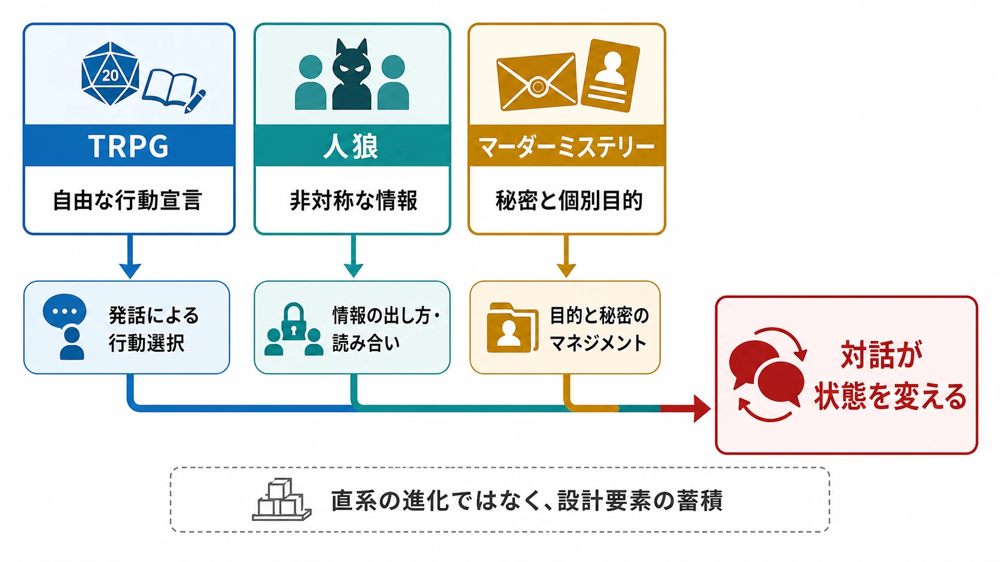
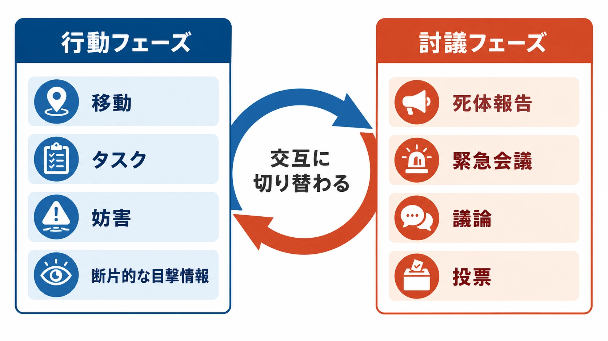
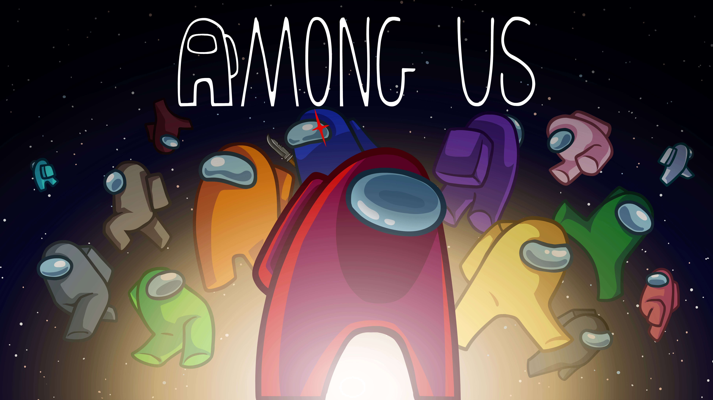
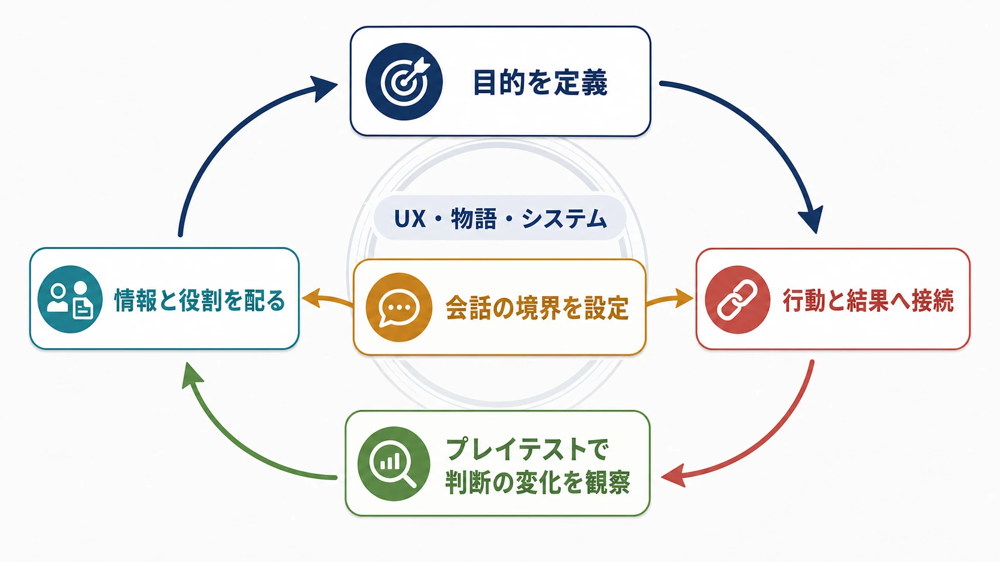

# CEDEC2026予習：対話をメカニクスとして設計する――マーダーミステリー、TRPG、人狼、デジタルゲームの系譜

ゲームの入力といえば、ボタン、レバー、タッチ、コマンド選択を思い浮かべることが多い。しかし、プレイヤーが他のプレイヤーへ何を伝え、何を隠し、どの発言を信じるかも、勝敗を変える入力になり得る。そこでは、対話は物語を見せるための演出ではなく、ゲームの状態を変えるメカニクスになる。

2026年7月22日15時から、CEDEC2026で「コミュニケーションゲームとは ～マーダーミステリーに学ぶ『対話』をメカニクスとして設計する方法～」が開催される。登壇者は日本マーダーミステリー作家協会の水井将太氏、九尾まどか氏、秋山真琴氏である。公式概要は、TRPG、人狼、マーダーミステリーの系譜を追いながら、コミュニケーションに含まれるゲーム要素の分解と設計への応用を扱うとしている。[[1](#ref-1)]

本稿では、講演内容を先取りして断定するのではなく、公開情報から予習できる設計上の問いを整理する。マーダーミステリーやTRPGを遊んだことがない読者にも分かるように、まず対話がゲームメカニクスになる条件を定義し、次にアナログゲームからデジタルゲームへ続く設計の流れを見ていく。最後に、ゲームプランナーが自社企画へ対話を取り入れるときの判断軸と、当日確認したい論点を示す。

***

## 1. コミュニケーションゲームとは何か

### 1-1. 対話は「選択肢の多い入力」である

コミュニケーションゲームという呼び方には、現時点で業界全体が共有する唯一の定義があるわけではない。本稿では、対話や情報交換を、勝敗、進行、役割、報酬、関係性のいずれかを変える中核的な入力として扱うゲームを、コミュニケーションゲームと呼ぶ。

CEDEC2026の公式概要は、コミュニケーションを人間同士が情報を伝え合うプロセスとし、対話はその主な手段の一つだと説明する。そのうえで、ボタンやレバーの操作、コマンド選択と比べ、対話は無限ともいえるバリエーションを持つと整理している。[[1](#ref-1)]

ここでいう「無限」は、制約がないという意味ではない。実際のゲームには、参加人数、制限時間、使用言語、入力方法、発言できる場面、相手の知識、運営ルールがある。それでも、あらかじめ用意されたボタンの集合から一つを選ぶ入力と比べれば、発言の内容、順序、言い方、沈黙、言い直し、質問への回避まで含めた組み合わせは、設計者がすべて列挙できないほど広い。

| 入力 | 設計者が主に決めるもの | プレイヤーが持ち込むもの |
| --- | --- | --- |
| ボタン・コマンド | 選択肢、コスト、結果、受付条件 | 入力のタイミング、選択の意図 |
| 対話 | 話題、公開範囲、時間、役割、結果への接続 | 言葉、順序、説得、嘘、沈黙、解釈 |

対話をゲームに組み込むとき、設計者がすべての発言を作る必要はない。代わりに、何を知っているか、誰に伝えられるか、いつ話せるか、話した結果として何が変わるかを設計する。自由度の高さは、設計の放棄ではなく、プレイヤーの発話をルールの中へ接続する仕事を増やす。

### 1-2. 対話があるだけでは、コミュニケーションゲームにならない

協力プレイにチャット機能を付けても、それだけでは対話がメカニクスになったとは限らない。対話がなくても同じ情報と結果に到達できるなら、対話は便利な補助機能やコミュニティ機能にとどまる。

対話を中核にするには、少なくとも次のどれかを成立させる必要がある。

- 発言によって、他者の行動や投票が変わる
- 発言の真偽や解釈によって、プレイヤーの知識が変わる
- 誰に何を伝えたかによって、利用できる選択肢が変わる
- 役割ごとに、話す目的と隠す情報が異なる
- 発言しないこと、話題をそらすこと、矛盾することにも意味がある

この条件を満たすと、会話は「物語を読む時間」から「次の状態を作る行動」へ変わる。反対に、発言してもしなくても進行が同じ、嘘をついても検証されない、全員が同じ情報と目的を持つという設計では、対話は雰囲気を作れても、勝敗に影響する入力にはなりにくい。

*図：対話をメカニクスとして成立させるには、情報、発話、他者の解釈をゲーム状態の変化へ接続する。*

***

## 2. 半世紀以上続く対話中心のゲーム設計

### 2-1. TRPG――ルールの外側にある会話を、進行へ接続する

TRPGは、参加者が登場人物として行動を宣言し、ゲームマスターが状況を説明し、ルールや判定を使って結果を返す卓上型のロールプレイングゲームである。コンピュータゲームのように、用意されたメニューだけから行動を選ぶのではない。「扉を調べる」「警備員を説得する」「仲間に本当の目的を話す」といった行動を、自然言語で提案できる。

現在のDungeons & Dragonsの権利元であるHasbroは、最初のDungeons & Dragonsが1974年に出版され、2024年に50周年を迎えたと説明している。[[2](#ref-2)] そのため、2026年から見れば、対面の会話や役割演技をゲーム進行へ組み込む文化には半世紀以上の蓄積があるといえる。

TRPGで重要なのは、会話が常に勝敗を直接決めることではない。ゲームマスターとの交渉、プレイヤー同士の相談、キャラクターとしての発話、ルールを確認するメタな会話が、同じ卓上で重なっている点である。設計者は、どこまでを自由なロールプレイに任せ、どこからを判定、資源、時間制限へ接続するかを決める。

この構造は、対話中心のゲームを考える際の最初の教訓になる。自由な発言を許すほど体験は広がるが、結果の扱いが曖昧になる。反対に、発言をすべて選択肢へ変換すると、判定は安定するが、プレイヤーが自分の言葉で状況を動かす感覚は薄くなる。

### 2-2. 人狼――情報の非対称性と公開討議をルール化する

人狼は、参加者の一部が正体を隠す側となり、残りの参加者が会話と推理でその正体を見抜く、いわゆるソーシャル・ディダクションゲームである。ソーシャル・ディダクションとは、各プレイヤーが持つ情報や目的の違いを、会話や観察によって推理するゲーム構造を指す。

公式商品ページで説明されるUltimate Werewolfでは、村人と人狼の二陣営が分かれ、村人は人狼を知らず、人狼は正体を隠す。昼は誰が人狼かを話し合って投票し、夜は人狼が対象を選び、予言者が情報を得る。モデレーターは、どちらの陣営にも属さず進行を担う。[[3](#ref-3)]

この設計では、発言は単なる感想ではない。誰が誰を疑ったか、誰が投票を変えたか、誰が情報を出すのをためらったかが、次の推理材料になる。情報の非対称性、つまりプレイヤーごとに見えている事実が異なる状態があるからこそ、同じ発言が「証言」「誘導」「偽装」「失言」の複数の意味を持つ。

人狼がプランナーへ示すのは、嘘をつかせる方法だけではない。次の四つを組み合わせると、対話を勝敗へ接続できるという点である。

1. 誰が何を知っているかを分ける
2. その情報を公開するかどうかにコストを置く
3. 公開情報を全員で解釈し、投票や行動へ変換する
4. 結果を次のラウンドの情報として残す

### 2-3. マーダーミステリー――役割、秘密、物語上の目的を一体化する

マーダーミステリーは、参加者が事件に関係する登場人物を担当し、それぞれの秘密や目的を持ったまま、会話と証拠によって事件を推理する体験型の推理ゲームである。日本マーダーミステリー作家協会は、参加者へ個別の秘密や目標が書かれたシナリオを渡し、犯人役が嘘を交えながら疑いをかわし、全員で話し合いながら真相を推理すると説明している。[[4](#ref-4)]

ここでは、犯人を当てれば全員が勝つという単純な構造にならないことが多い。犯人には逃げ切り、別の秘密の隠蔽、特定人物への誘導など、別の目的が与えられる場合がある。犯人以外にも、自分の過去を隠したい、誰かを守りたい、証拠を回収したいという目的があれば、真相解明への協力と自己利益が衝突する。

この構造が、推理ゲームとマーダーミステリーの違いを作る。コンピュータが一つの正解へプレイヤーを導く形式では、プレイヤーは設計者が用意した謎を解く。一方、マーダーミステリーでは、プレイヤーが役割の目的に従って情報を出し入れするため、同じシナリオでも場の会話によって体験の輪郭が変わる。

ただし、TRPGから人狼、人狼からマーダーミステリーへ、一本道で進化したと断定するのは適切ではない。三者は異なる成立過程を持つ。それでも、役割を演じる、情報を分ける、他者の発言を解釈する、会話の結果で状態を更新するという設計要素が重なっている。CEDEC2026の公式概要が示す「系譜」は、作品の直接的な血統というより、対話をゲームの中心へ置く設計課題が異なる形式で蓄積されてきた流れとして読むと分かりやすい。[[1](#ref-1)]

| 形式 | 会話の主な役割 | 設計上の中心 |
| --- | --- | --- |
| TRPG | 行動宣言、交渉、役割演技、物語の共同制作 | 自由な発言と判定・進行の接続 |
| 人狼 | 正体の推測、陣営間の説得、投票 | 情報の非対称性と公開討議 |
| マーダーミステリー | 秘密の開示、証拠の解釈、個別目的の達成 | 役割配分と物語上の駆け引き |

*図：TRPG、人狼、マーダーミステリーを直系の進化ではなく、対話を状態変化へ接続する設計要素の蓄積として整理した。*

***

## 3. デジタル側で対話中心のゲームが広がった背景

### 3-1. Among Usは、行動と討議を別フェーズにした

Among Usは2018年に発売された、協力と裏切りを軸にしたオンライン・ローカル対応のパーティゲームである。[[5](#ref-5)][[6](#ref-6)] 公式ページでは、4〜15人で宇宙船のタスクを進め、クルーはタスク完了またはインポスターの排除を目指す一方、インポスターは殺害、偽装、妨害、閉じ込めによってクルーを減らすと説明されている。死体の報告や緊急会議が、疑わしい行動を議論し投票する場になる。[[5](#ref-5)]

Among Usの要点は、対話を常時発生させるのではなく、移動・タスク・妨害の行動フェーズと、報告・会議・投票の討議フェーズへ分けたことにある。行動中は断片的な目撃情報しか得られない。会議では、同じ事実を異なる記憶や立場から説明し、他者の説明と照合する。この切り替えが、会話をプレイの一部として分かりやすくする。

2020年、開発元のInnerslothは、プレイヤーの急増に対応するためサーバーを調整していると説明し、当初予定していた続編ではなく、初代の改善へ集中する方針を示した。[[7](#ref-7)] ここから、対話中心のゲームが突然生まれたというより、既存のルールがネットワーク、配信、友人同士の音声会話と結び付いて大きく可視化されたと捉えられる。

*図：Among Usでは、移動やタスクを行うフェーズと、報告・会議・投票を行うフェーズが交互に切り替わる。*

*画像出典（引用）：Innersloth, [Among Us Press Kit](https://www.innersloth.com/press-kit-among-us/), 無改変・WebP変換。*

### 3-2. Goose Goose Duckは、役割と音声空間を増やした

Goose Goose Duckは、2021年にリリースされたソーシャル・ディダクションゲームである。Steamの開発元掲載ページでは、最大16人が複数の陣営に分かれ、ガチョウはタスク、アヒルは妨害と排除、第三の中立陣営は独自の秘密目標を達成すると説明されている。また、近接ボイスチャット、固有役職、複数の環境が特徴として挙げられている。[[8](#ref-8)]

ここでの近接ボイスチャットは、単に音声で話せる機能ではない。誰の近くで、誰に聞こえる距離で、どのタイミングに話すかが、情報の公開範囲になる。全員へ同じ文章を送るチャットから、空間上の距離や遭遇そのものが情報になる対話へ、設計の単位が広がっている。

### 3-3. 「この10年」の背景を、機能の組み合わせとして読む

CEDEC2026の公式概要は、コミュニケーションを中核要素とするデジタルゲームが10年ほど前から生まれ続けていると説明している。[[1](#ref-1)] この背景を一つの原因で説明するより、次の条件が組み合わさったと考えるほうが、企画上は使いやすい。

- オンライン対戦により、同じ場にいないプレイヤー同士が集まりやすくなった
- ボイスチャットとテキストチャットにより、対面ゲームの討議をデジタル空間へ移せるようになった
- クロスプラットフォームやモバイル対応により、参加者を集める条件が軽くなった
- 役職、タスク、投票、ログなどをシステムが管理し、進行役の負担を減らせるようになった
- 一度の会議、裏切り、誤投票が短い動画や配信の見どころになり、プレイ外へ共有しやすくなった

このうち、配信やコミュニティがどの程度普及を押し上げたかは、タイトルごとの公開データを比較しなければ断定できない。本稿での整理は、公式に示された機能と運営状況から導く設計上の推論である。重要なのは、デジタル化によって対話が自動的に面白くなったのではなく、情報を隠す、公開する、検証する、投票するというアナログの構造を、サーバー、UI、音声、ログが支えられるようになった点である。

***

## 4. マーダーミステリーから学べる対話設計の原理

### 4-1. 情報の非対称性――全員に違う「話す理由」を与える

対話を設計する最初の仕事は、会話の話題を考えることではなく、プレイヤーごとに何が違って見えるかを決めることである。全員が同じ情報を持つと、会話は確認作業になりやすい。逆に、誰かだけが知っている事実、誤った記憶、公開すると不利益になる秘密があれば、発言に判断が生まれる。

情報の非対称性には、少なくとも三つの種類がある。

1. 事実の非対称性――誰かだけが目撃した、所持した、聞いた
2. 目的の非対称性――同じ事件を解決していても、勝利条件が違う
3. 解釈の非対称性――同じ証拠を見ても、立場や知識によって意味が変わる

マーダーミステリーは、この三種類を役割シート、秘密、個別目標、証拠、会話の時間配分へ落とし込む。プランナーが学ぶべきなのは、秘密をたくさん配ることではない。秘密を開示する動機と、隠し続ける動機を同時に設計することである。

### 4-2. 役割配分――能力ではなく、発言のインセンティブを分ける

役割は、能力値や担当作業を分けるだけのものではない。誰が何を言いたく、何を言いたくないかを分ける装置でもある。

例えば、次のような役割を考える。

| 役割 | 公開したいこと | 隠したいこと | 会話上の行動 |
| --- | --- | --- | --- |
| 調査役 | 事実と証拠 | 調査方法の一部 | 質問し、矛盾を照合する |
| 容疑者 | 自分の無実 | 不利な過去 | 証言を選び、他者へ疑いを返す |
| 保護役 | 仲間の安全 | 保護対象との関係 | 情報を遅らせ、話題を誘導する |
| 単独目的役 | 最終条件の達成 | 本当の勝利条件 | 陣営に協力しつつ、別の結末を狙う |

ここで注意したいのは、役割の面白さを設定文の量で作ろうとしないことである。長いプロフィールを読ませても、発言して達成できる目標がなければ、プレイヤーは設定を演じる理由を持てない。役割文は、何を知っているか、何を達成したいか、誰と衝突するか、どの情報が危険かを、プレイ中の行動へ変換できる粒度で書く必要がある。

### 4-3. 疑心と信頼――感情を直接操作せず、判断の履歴を作る

「プレイヤーに疑心を抱かせる」と仕様書に書いても、疑心は直接実装できない。設計できるのは、疑う材料、信じる理由、誤解が解ける機会、疑いを表明したときのリスクである。

疑心をゲーム状態へ接続するための要素は次のように分けられる。

- 行動履歴：どこにいたか、誰と接触したか、何を完了したか
- 証言履歴：誰が何を言ったか、後で矛盾したか
- 公開範囲：全員に聞こえたか、特定の相手だけに伝えたか
- 反証手段：再調査、別証拠、第三者の証言、時間経過
- 決定の重さ：投票、追放、信用低下、勝利条件の変化

この考え方を採ると、感情を演出で押し付けるのではなく、プレイヤー自身が「この人を信じるべきか」と判断する状況を作れる。ストーリーテリングとの接続も、台詞を増やすことではなく、判断の履歴が登場人物の関係と事件の解釈を変えることにある。

### 4-4. 会話の自由度には、時間と空間の境界が必要である

対話の自由度は高いほどよいとは限らない。全員がいつでも誰とでも話せると、情報が一瞬で均質化し、推理の余白が消える。反対に、会話できる時間が短すぎると、発言の速さや声量だけが勝敗を決める。

設計者は、次の境界を決める必要がある。

- 誰と話せるか――全員、近くの相手、指定ペア、個別面談
- いつ話せるか――常時、フェーズ終了後、証拠取得後、投票前
- 何を共有できるか――自由発話、証拠カード、ログ、定型報告
- どれだけ話せるか――時間、回数、文字数、クールダウン
- 話した結果がいつ反映されるか――即時、次ラウンド、最終判定

マーダーミステリーのようなアナログ体験では、ゲームマスターや参加者の合意がこの境界を支える。デジタルゲームでは、フェーズ、UI、ボイス範囲、投票時間、ログ表示が境界を担う。媒体が変わると、自由度の設計だけでなく、ルールを誰が執行するかも変わる。

### 4-5. 結末の数ではなく、情報の流れを設計する

対話型の企画では、分岐エンディングを増やすことが魅力の中心だと考えがちである。しかし、結末が十種類あっても、途中でプレイヤーの発言が状態を変えていなければ、体験は大量の選択肢を読むだけになる。

先に設計すべきは、情報の流れである。

1. 最初に、誰がどの事実と目的を持つか
2. 次に、どの情報が会話で交換されるか
3. 交換された情報を、誰がどのように解釈するか
4. 解釈が、投票、協力、移動、取引、攻撃などへどう接続するか
5. その結果が、次に誰の情報を増やし、誰の選択肢を狭めるか

この流れを作った後で、物語上の結末を配置する。そうすれば、結末の違いが単なるフラグの分岐ではなく、プレイヤーが情報を扱った結果として見える。

***

## 5. プランナーが自社企画へ対話を取り入れるときの着眼点

### 5-1. まず「何を話させたいか」ではなく「何を変えたいか」を決める

企画会議で「対話を入れたい」と言ったとき、最初に問うべきなのは、どんな会話を聞かせたいかではない。プレイヤーの発話によって、ゲームの何を変えたいのかである。

| 変えたいもの | 対話の設計例 | 成功している状態 |
| --- | --- | --- |
| 情報 | 証拠を共有する、嘘を混ぜる、質問で引き出す | 同じ事実が複数の判断材料になる |
| 関係 | 信頼を積む、裏切る、仲裁する | 相手との履歴が次の選択を変える |
| 行動 | 作戦を立てる、役割を割り振る | 発話が移動・戦闘・資源配分へ接続する |
| 物語 | 目的や過去を開示する | プレイヤーの解釈によって人物像と結末が変わる |
| リスク | 発言を公開する、沈黙する | 話すことと話さないことの両方に判断がある |

一つの企画で全てを狙うと、何を評価すべきか分からなくなる。まずは、対話を情報の交換に使うのか、他者の説得に使うのか、物語上の自己表現に使うのかを決める。複数の目的を持たせる場合も、主目的と副目的を分けておくと、UXの検証がしやすい。

### 5-2. UX設計――「話せる」より「話す理由が分かる」を優先する

対話は、ゲームのルールを説明するUX（ユーザー体験）が弱いと、すぐにプレイヤーの経験や社交性の差へ吸収される。新米プレイヤーが置いていかれないためには、発言の自由度を下げるのではなく、発言の目的を読み取れるようにする必要がある。

最低限、次の情報をプレイヤーへ返したい。

- 今、誰に話しかけられるか
- どの情報が公開で、どの情報が非公開か
- 会話や投票の締め切りはいつか
- 発言によって、何が変わる可能性があるか
- 自分の役割の勝利条件と、現在の進捗は何か
- 相手の発言を後から確認できるか、記憶に頼るのか

自由入力を採用する場合でも、目的、制限時間、対象者、結果のフィードバックはUIで補助できる。逆に、会話のすべてをリアルタイム音声へ任せると、聴覚、言語、通信環境、発言速度の差が、そのまま勝敗差になり得る。テキスト、字幕、ログ、定型報告、発言権の可視化などを、ゲームの本質を壊さない範囲で用意する必要がある。

### 5-3. ストーリーテリング――設定文を、会話の動機へ変換する

ゲームの世界設定を説明する長文を用意するだけでは、対話のメカニクスは動かない。物語の情報は、プレイヤーが話す理由へ変換されなければならない。

例えば、「二人はかつて親友だった」という設定を置くだけでは、プレイ中の行動は変わらない。そこへ「片方だけが過去の裏切りを知っている」「公開すると両者の勝利条件が変わる」「沈黙すれば別の人物が疑われる」といった条件を加えると、設定が会話の選択へ接続する。

このとき、物語の秘密は情報量ではなく、行動の分岐として設計する。秘密を開示したときに誰の選択肢が増えるのか、隠したときに何を失うのか、誤って公開したときに反証できるのかを仕様に書く。そうすれば、シナリオとゲームシステムを別々に作って最後に接着するのではなく、役割、情報、会話、結末を同じ設計表で管理できる。

### 5-4. プロトタイプ――会話の量ではなく、判断の変化を観察する

対話を含む企画のプレイテストでは、会話が盛り上がったかだけを評価しないほうがよい。声の大きい人が場を支配しただけかもしれないし、雑談が続いただけかもしれない。見るべきなのは、会話の前後でプレイヤーの認識と行動が変わったかである。

試作段階では、次の観察項目が役に立つ。

- 発言前に、プレイヤーが自分の目的を説明できたか
- どの情報を公開し、どれを隠すかに迷いがあったか
- 発言の後、相手への信頼や疑いが変化したか
- 会話が投票、移動、協力、取引など別の行動へつながったか
- 沈黙したプレイヤーにも、沈黙する理由があったか
- 誤解や嘘が、後から検証可能な履歴として残ったか
- 会話の結果が分からないまま、プレイヤーが疲れていないか

この観察から、情報が足りないのか、役割の目的が弱いのか、会話の時間が長すぎるのか、反証手段がないのかを切り分ける。対話ゲームでは、数値バランスだけでなく、どの情報がいつ誰へ届くかを調整することがバランス調整になる。

*図：対話の目的、情報と役割、会話の境界、行動と結果を定義し、プレイテストで判断の変化を観察する検証ループ。*

***

## 6. CEDEC2025からCEDEC2026へ――当日、確認したい論点

CEDEC2025には、檜木田正史氏による「マーダーミステリーのゲームデザイン」があり、マーダーミステリーとは何か、デジタルの推理ゲームと何が違うのか、現在の動きは何かが公開概要の中心だった。[[9](#ref-9)] 2026年の講演は、同じ日本マーダーミステリー作家協会から複数の登壇者を迎え、マーダーミステリー単体の紹介から、TRPG、人狼、デジタルのソーシャル・ディダクションを含む「コミュニケーションゲーム」の体系へ視野を広げている。

公式に「後継講演」と明記されているわけではない。しかし、2025年にマーダーミステリーのゲームデザインを扱い、2026年にその知見を対話中心のゲーム全般へ拡張する並びから見れば、前回の問題提起を受けた続編的な位置付けとして聴く価値がある。これは公式情報からの推論であり、当日の説明で照合したい。

予習段階で、特に次の問いを持っておきたい。

1. コミュニケーションゲームを分類するとき、対話は「入力」「情報」「関係」「物語」のどの単位へ分解されるのか
2. 発話の自由度を保ちながら、初心者が参加できるルールとUXをどう設計するのか
3. 情報の非対称性と役割配分を、プレイヤー数やプレイ時間に応じてどう調整するのか
4. 嘘、沈黙、話題そらし、誤解を、意図した駆け引きと迷惑行為のどこで分けるのか
5. マーダーミステリーの一期一会性やゲームマスター依存を、デジタルゲームへ移植すると何が失われ、何が増えるのか
6. 対話による盛り上がりを、会話量ではなく、判断の変化や再プレイ時の選択差としてどう評価するのか
7. ストーリーテリングとUXの責任分界を、シナリオ、UI、進行システム、コミュニティ運営のどこに置くのか

この問いを持つと、講演を「マーダーミステリーの紹介」としてだけでなく、会話を制約し、可視化し、結果へ接続する設計論として聴ける。アナログの場で人間が担ってきた進行、記憶、解釈、空気の調整を、デジタルゲームではどのシステムが代替し、どの部分をあえてプレイヤーへ残すのかが、本セッションの実務的な焦点になるはずである。

***

## まとめ――対話を入れるのではなく、対話で状態を変える

コミュニケーションゲームの本質は、チャットやボイスチャットを搭載することではない。プレイヤーごとに異なる情報と目的を与え、話す、隠す、疑う、信じる、沈黙するという行動を、次の情報、選択肢、勝敗、物語の解釈へ接続することである。

TRPGは自由な行動宣言と進行の接続を、人狼は情報の非対称性と公開討議を、マーダーミステリーは役割、秘密、個別目的、事件の物語を一体化する方法を発展させてきた。Among UsやGoose Goose Duckは、これらの構造をネットワーク、フェーズ、空間音声、ログ、UIで支え、対話そのものをデジタルゲームの勝敗へ組み込んだ。

プランナーが自社企画へ応用する際は、「どんな会話をさせるか」より先に、「会話によって何の状態を変えるか」を決めるべきである。情報、役割、公開範囲、時間、反証手段、結果のフィードバックを設計し、プレイテストでは会話の長さではなく判断の変化を観察する。その積み重ねが、対話を雰囲気からメカニクスへ変える。

## References

1. [コミュニケーションゲームとは ～マーダーミステリーに学ぶ「対話」をメカニクスとして設計する方法～｜CEDEC2026][1] - 講演日時、登壇者、対象者、対話の定義、TRPG・人狼・マーダーミステリーの系譜、Among UsとGoose Goose Duckへの言及。

2. [Dungeons & Dragons Celebrates 50th Anniversary in 2024 with More than 50 Million Fans｜Hasbro][2] - Dungeons & Dragonsの初版が1974年に出版され、2024年に50周年を迎えたことを示す公式発表。

3. [Ultimate Werewolf｜Bezier Games][3] - 村人と人狼の情報差、昼夜の討議と投票、モデレーター、役割による情報取得の公式説明。

4. [一般社団法人日本マーダーミステリー作家協会][4] - マーダーミステリーの定義、個別の秘密と目標、犯人役、会話と証拠、一期一会性の説明。

5. [Among Us｜Innersloth][5] - クルーとインポスターの目的、タスク、妨害、死体報告、緊急会議、投票などの公式ゲーム説明。

6. [Among Us｜Steam][6] - Among Usの2018年11月16日の発売日と、オンライン・ローカル対応、タスク、会議、投票などの公式掲載情報。

7. [The Future of Among Us｜Innersloth][7] - 2020年のプレイヤー急増、サーバー対応、続編中止と初代改善への集中に関する開発元の説明。

8. [Goose Goose Duck｜Steam][8] - 最大16人のソーシャル・ディダクション、陣営別の目的、近接ボイスチャット、役職、2021年のリリース情報。

9. [マーダーミステリーのゲームデザイン｜CEDEC2025][9] - マーダーミステリーの定義、デジタルの推理ゲームとの違い、講演者と公開された知見。

[1]: https://cedec.cesa.or.jp/2026/timetable/detail/s696d667043a23/
[2]: https://corp.hasbro.com/news-releases/news-release-details/dungeons-dragons-celebrates-50th-anniversary-2024-more-50
[3]: https://beziergames.com/products/ultimate-werewolf
[4]: https://jmmaa.org/
[5]: https://www.innersloth.com/games/among-us/
[6]: https://store.steampowered.com/app/945360/Among_Us/
[7]: https://www.innersloth.com/new-hotfixes-are-live-2-3/
[8]: https://store.steampowered.com/app/1568590/Goose_Goose_Duck/
[9]: https://cedec.cesa.or.jp/2025/timetable/detail/s67e2b1469be3d/

----

この文書は、Perplexity、Claude、OpenAI Codex の3つのAIの支援を受けて著述されたものです。引用画像を除き、MIT License にて提供されています。
