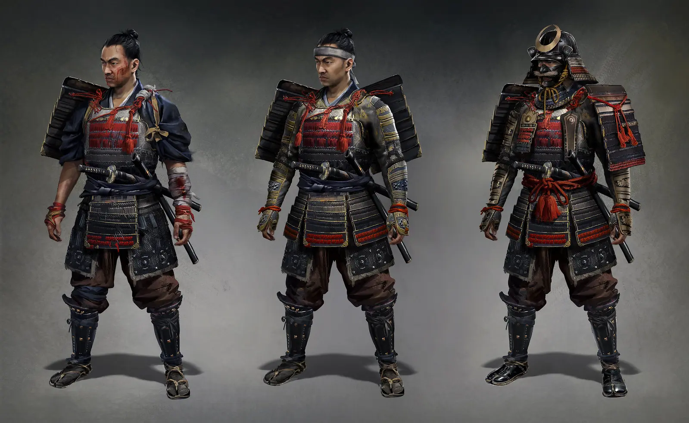
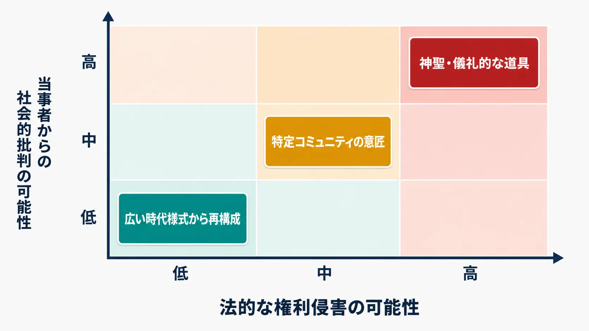
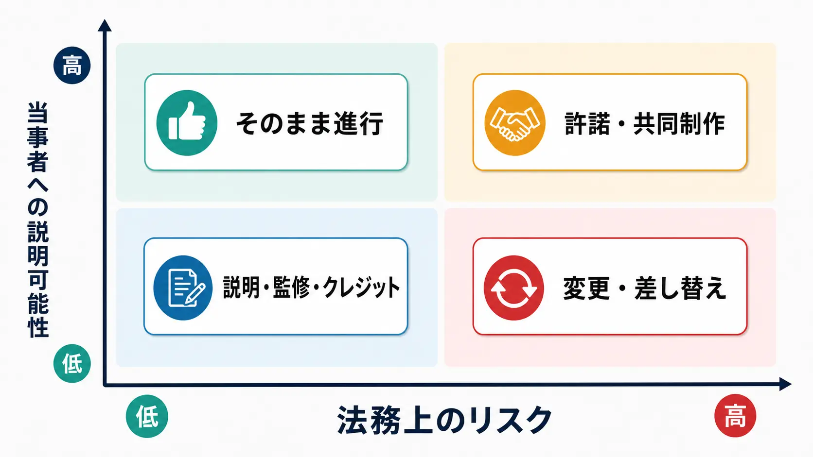
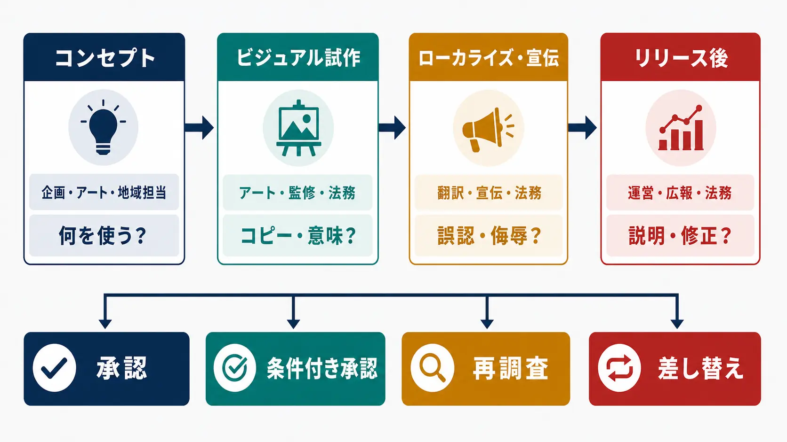

# CEDEC2026予習：ゲーム企画者のための文化盗用リスク管理

2026年7月22日から24日に開催されるCEDEC2026では、7月22日15:00〜16:00に「文化盗用リスクの管理を考える〜想定外のトラブルを避けるためにできること」が予定されている。講演者は、シティユーワ法律事務所の野本新弁護士である。[[1](#ref-1)] セッションは、ゲーム内のキャラクターの服装、アイテムの形状、名称などが他国の文化表現を参照する場面を取り上げ、文化盗用が問題視される背景、法的・社会的リスク、開発者のリスク管理を扱う予定である。[[2](#ref-2)]

本稿はその予習として、文化盗用を「文化を使ったら即座に悪い」と単純化せず、どの要素を、誰が、どの文脈で、どのような利益配分のもとで使うのかを整理する。既存の [ゲームプランナーが知っておくべき法令ガイド](game-planner-japanese-law-guide.md) が日本国内のゲーム関連法令を広く扱うのに対し、本稿の対象は、国境をまたぐ文化表現の参照と、それに伴う法的・社会的リスクの管理である。個別の法律相談ではないため、具体的な企画の可否は対象国の専門家と確認すべきである。

***

## 文化盗用とは何か

「文化盗用」は、国際的に統一された法律用語ではない。議論では、ある文化集団の表現を、外部の個人・企業が商業的または象徴的な利益のために取り込み、歴史的な力関係、表現の意味、当事者の意思、利益の帰属を切り離した状態が問題になることが多い。

ここで重要なのは、文化表現が「誰か一人の所有物か」という問いだけでは足りない点である。音楽、踊り、意匠、名称、記号、儀礼、建築形式、工芸、物語など、世代を超えて受け継がれる表現は、世界知的所有権機関（WIPO）がいう「伝統的文化表現」に重なる。WIPOは、こうした表現が先住民・地域コミュニティのアイデンティティや遺産の一部であると説明している。[[3](#ref-3)]

したがって、企画会議で「著作権が切れているから自由に使える」と結論づけるのは危険である。WIPOの説明では、伝統的知識や伝統的文化表現は、既存の知的財産制度ではパブリックドメインと扱われ、誰でも使えると考えられてきた一方、そのことが不適切な利用や利益の不均衡を招くという批判がある。[[4](#ref-4)] 法的な権利の有無と、当事者が受け入れられる利用かどうかは、同じ問題ではない。

### 文化的参照との境界を決める五つの軸

文化的参照と文化盗用を、単一のチェックボックスで判定することはできない。企画の初期段階では、次の軸でリスクを分解するとよい。

| 判断軸 | 参照として受け入れられやすい方向 | 文化盗用と批判されやすい方向 |
|---|---|---|
| 参照の特定性 | 広い地域史や複数資料から再構成する | 特定のコミュニティの意匠をほぼそのまま使う |
| 文脈 | 表現の意味や使用条件を物語・説明に反映する | 「異国風」「神秘的」などの装飾へ置き換える |
| 当事者性 | 当事者や専門家が企画の早期から参加する | 外部者だけで決め、公開直前に確認する |
| 利益と帰属 | 出典を示し、対価・共同制作・販路などを設計する | 自社の独自発明のように宣伝し、利益を一方的に得る |
| 表現の扱い | 日常的・公開された表現を、目的に合わせて慎重に使う | 神聖・儀礼的・使用制限のある表現を娯楽化する |

これらは法的な判定表ではなく、企画を止めるか進めるかを考えるためのリスク分解である。特に、対象文化と自社の間に植民地支配、差別、経済格差などの歴史がある場合、「同じデザインを使っているだけ」という説明では、なぜ問題が生じたのかを説明しきれない。

***

## 他業界の実例から見る「法的問題」と「批判」のずれ

### メキシコの文化省による衣料ブランドへの説明要求

メキシコ文化省は2021年、Zara、Anthropologie、Patowlに対し、オアハカ州の先住民コミュニティの衣服や意匠を使った商品について、どのような根拠で集団的な財産を自社のものとして扱ったのか、創作コミュニティへどのような利益を還元するのかを説明するよう求めた。文化省は、単に使用を禁止するのではなく、コミュニティとの尊重ある協働、アイデンティティや経済を損なわないこと、公正な取引を呼びかけている。[[5](#ref-5)]

これは、裁判所が著作権侵害を認定したというニュースではない。行政機関が、表現の出所、集団的な帰属、利益還元、取引の公平性を問題にした事例である。ゲームで言えば、アイテムの形状が既存の登録意匠を侵害しているかだけでなく、どのコミュニティのどの表現を参照したのか、商品販売や有料衣装の売上が誰に帰属するのかまで問われる構図である。

また、メキシコ文化省は2020年、フランスのデザイナーであるIsabel Marantに対しても、先住民コミュニティのデザインを使ったコレクションについて説明を求めた。文書では、文化表現の起源が記録されていること、利用が創作コミュニティにどう利益をもたらすかを問うている。[[6](#ref-6)] ここでも争点は、作品の類似性だけでなく、外部のブランドが集団の表現をどのような物語と商業関係の中に置いたかである。

### Navajo Nation対Urban Outfitters

米国では、Navajo NationがUrban Outfittersなどを相手取り、「Navajo」の名称や商品表示の使用について、商標侵害、虚偽広告などを争った事件がある。米国政府の裁判資料データベースに掲載された事件情報でも、事件の性質は商標関係として整理され、原告・被告と請求原因が記録されている。[[7](#ref-7)]

この事例から得るべき教訓は、「文化盗用という言葉が使われたら、文化そのものに対する権利侵害が自動的に成立する」ということではない。裁判では、登録商標、商品表示、消費者が出所を誤認する可能性、広告の真実性など、既存の法律上の要件に分解して争うことになる。一方で、法的主張が既存制度の言葉で構成されていても、消費者や当事者が問題を文化の無断利用として受け止めることはあり得る。

ゲーム側の予防的な例としては、『Ghost of Tsushima』の公式開発記事がある。Sucker Punch Productionsは、鎌倉時代、日本文化、古い時代劇、対馬への侵攻について調査し、キャラクター、衣装、風景、建築のデザインに反映したうえで、日本文化の専門家やJAPAN Studioの協力を得たと説明している。[[8](#ref-8)] これは文化盗用の法的判定例ではないが、外部スタジオが参照先の研究と専門家の関与を制作工程に組み込んだ事例として、予防策を考える材料になる。

*画像出典（引用）：[Sucker Punch Productions／PlayStation.Blog「『Ghost of Tsushima』のコンセプトアートを一挙公開！」](https://blog.ja.playstation.com/2020/10/28/20201028-got/)。©2020 Sony Interactive Entertainment LLC。無改変でWebP変換。*

これらの例は、企画者に「法務確認が通ったか」と「当事者に説明可能か」を別々に問う必要があることを示している。

***

## 法的リスクは「文化盗用罪」ではなく複数の権利で考える

文化盗用という批判に対応するために、まず「文化盗用を直接禁止する世界共通の法律」を探すのではなく、企画の具体的な表現がどの権利や規制に触れ得るかを確認する。国によって制度も要件も異なるため、以下は国際展開を想定した論点の地図である。

### 商標と名称・記号

キャラクター名、地名、民族名、シンボル、ロゴ風の図形は、単なる設定資料ではなく、商品やサービスの出所を示す商標として機能する可能性がある。米国特許商標庁（USPTO）は、商標が音、外観、意味、全体的な商業上の印象において似ており、関連する商品・サービスで使われる場合、消費者が同じ出所だと誤認する「混同のおそれ」が問題になると説明している。[[9](#ref-9)]

ゲームでは、次のような確認が必要である。

- その名称や記号を、文化集団の公式商品、認証、共同制作であるかのように表示していないか
- 現地語の綴りや発音が、侮辱語、宗教語、既存ブランド名になっていないか
- ストアページ、広告、コラボ告知で、出所や監修の有無を誤認させないか
- 日本語版だけでなく、英語版・現地語版で意味や印象が変わらないか

### 意匠・著作権と形状・模様

WIPOによれば、工業デザインは物品の装飾的な外観を指し、三次元の形状だけでなく、二次元の模様、線、色も含み得る。登録意匠やデザイン特許は、商業目的で保護されたデザインのコピーまたは実質的なコピーを使う行為を止めるために機能する。国によっては未登録デザインや著作物としての保護が重なる場合もある。[[10](#ref-10)]

ここで注意したいのは、伝統的な意匠に関する権利者が、個人のデザイナー一人とは限らない点である。現代の作家が制作した具体的な衣装や図案と、長く共有されてきたコミュニティの表現は、調査方法も許諾相手も異なる。資料画像を見つけて左右反転し、色を変えただけでは、調査や独自性の説明にならない。

### パブリシティ権と「それらしい人物」

実在の人物をモデルにしたキャラクター、声、肖像、名前、特定の人物を連想させる表現には、パブリシティ権が関わることがある。これは国・州ごとの差が大きい領域であり、集団の文化表現を扱う問題とは別に、個人の人格的・商業的利益を検討する必要がある。

例えばカリフォルニア州法は、本人の同意なく、氏名、声、署名、写真、肖像を商品や広告・販売目的で使った場合の損害賠償や差止めを定めている。[[11](#ref-11)] ゲーム内キャラクターが特定の俳優や活動家を想起させる場合、文化的なモデル調査をしただけで安心してはならない。誰の人格を、どこまで商業的に利用しているのかを別途確認する必要がある。

### 伝統的文化表現・文化財の保護規定

WIPOは、伝統的文化表現が著作権、商標、地理的表示など既存の制度で保護される場合があるほか、国によってはフォークロアを対象にした特別法があると説明している。[[3](#ref-3)] メキシコでは2022年、先住民・アフリカ系メキシコ人の文化遺産、伝統的知識、伝統的文化表現、集団的知的財産を対象にした連邦法が施行された。官報に掲載された法律は、コミュニティが文化遺産を定義、保存、保護、管理、発展させることを位置づけている。[[12](#ref-12)]

一方、UNESCOの1970年条約は、考古学的・歴史的・民族学的価値を持つ文化財の不法な輸入、輸出、所有権移転を防ぐ枠組みである。[[13](#ref-13)] これはゲーム内で文化的なアイテムを描くことを一律に禁止する条約ではない。しかし、実物の文化財を無断で入手して3Dスキャンする、遺跡から持ち出された物品を資料として利用する、といった制作工程では、単なるデザイン参考では済まない。

UNESCOの2003年条約が扱う無形文化遺産も、コミュニティの参加と保護を重視する枠組みである。[[14](#ref-14)] ただし、条約や登録リストに載っていることだけで、ゲーム内利用の許諾先や商業利用条件が自動的に決まるわけではない。法制度の目的、対象、許諾手続を国ごとに確認しなければならない。

***

## 社会的・レピュテーションリスクの構造

法的リスクは、権利者、対象行為、管轄、証拠、救済手段に分解しやすい。社会的リスクは、そうした要件を満たしていなくても発生する。

SNSでは、ゲーム画面の一部分、キャラクター名、発売前のキービジュアルだけが切り出され、参照元の説明や監修の経緯がないまま拡散されることがある。別言語の投稿、短い動画、スクリーンショット、まとめ投稿が連鎖すると、社内で意図していた文脈よりも、外部から見える一枚の表現が評価の中心になる。そこに「敬意がない」「自分たちの表現を売り物にされた」という受け止めが重なると、法的な判断を待たずに、販売停止要求、出演者や取引先への問い合わせ、レビュー爆撃、広告媒体への抗議へ広がる可能性がある。

このとき危険なのは、最初の説明が事実確認より先に「問題はない」「単なるフィクションだ」と断定することである。法的には利用可能でも、説明が不十分であれば、問題の核心を避けた反応に見える。反対に、事実関係を確認せずに「盗用した」と断定すれば、別の権利・契約・名誉上の問題を生むこともある。

したがって、リリース前には次の二つの質問を分けて記録するべきである。

1. 法務上、利用を止める根拠や許諾が必要な権利はあるか
2. 当事者に見せたとき、利用の目的、出典、利益配分、変更点を説明できるか

前者が低リスクでも、後者が高リスクなら、デザインの変更、共同制作、クレジット、地域別の表現差し替えを検討する余地がある。

***

## プランナーが実行できる予防的リスク管理

### 1. 参照元台帳を企画書の付属物にする

参照元を「画像を貼ったムードボード」で終わらせず、企画書やアセット管理表に次の情報を残す。

- 国、地域、言語、民族・コミュニティ、時代
- 参照した具体的な要素：名称、模様、衣装、頭飾り、武器、儀礼、建築など
- 参照元の一次資料と、その資料が示す意味・使用条件
- 現代の作家やブランドによる具体的な作品か、共有される伝統表現か
- 神聖・儀礼的・使用制限あり・商用利用可などの確認結果
- 誰に、いつ、どの方法で確認したか
- 未確認事項と、未確認のまま発売した場合の代替案

調査の成果は「大丈夫そう」という感想ではなく、後から別の担当者が読み直せる記録にする。検索結果の画像だけでなく、文化省、博物館、大学、当事者団体、現地作家の公式情報を優先し、二次まとめ記事は入口にとどめる。

### 2. 早い段階で文化コンサルタントを入れる

文化コンサルタントは、完成したイラストに赤入れする人ではない。企画の目的、対象地域、キャラクターの役割、販売地域、表現上の制約を理解したうえで、何を調べるべきか、誰に聞くべきか、何を使わない方がよいかを判断する役割である。

起用時には、肩書だけでなく成果物を契約に落とす必要がある。例えば、参照資料のリスト、避けるべき要素、監修コメント、当事者との調整範囲、クレジット表記、公開後の問い合わせ対応、再利用範囲、報酬と利益配分を明確にする。特定の出自のスタッフ一人に「代表して意見を言ってほしい」と負担を集中させるのも避けるべきである。

### 3. レビューを四つのゲートに分ける

レビューは、発売直前の法務確認だけでは遅い。次のように、判断を分けて実施する。

| ゲート | 主な確認者 | 主な問い |
|---|---|---|
| コンセプト | プランナー、アート、シナリオ、地域担当 | 何の文化表現を使う企画なのか。使わない選択肢はあるか |
| ビジュアル試作 | アート責任者、文化コンサルタント、法務 | 特定表現のコピー、誤った意味づけ、名称の問題はないか |
| ローカライズ・宣伝 | ローカライズ、マーケティング、コミュニティ、法務 | 翻訳、広告、ストア文言で誤認や侮辱的な印象が生じないか |
| リリース後 | 運営、広報、法務、地域窓口 | 問い合わせを記録し、説明・修正・差し替えを判断できるか |

各ゲートの結論は、承認・条件付き承認・再調査・差し替えに分けるとよい。「監修済み」というラベルだけで公開するのではなく、どの範囲を確認したのかを残すことが重要である。

### 4. 差し替えコストを企画段階で見積もる

文化表現の問題は、アート1枚の修正で終わらない。キャラクター名、ボイス収録、字幕、イベントシナリオ、広告、グッズ、海外ストア画像、コミュニティ向け説明が連鎖する。アセットに参照元タグを付け、名称・画像・テキスト・音声・広告素材を検索できるようにしておけば、差し替え範囲を短時間で把握できる。

また、コンセプト段階で「この要素が使えない場合の代替デザイン」を一つ用意しておくと、問題発生時に当事者との対話を急いで終わらせる必要がなくなる。リスク管理は、批判を消すための言い訳を用意することではなく、敬意を欠く表現を無理に残さなくて済む制作余力を確保することである。

***

## 当日、CEDEC2026で確認したい論点

野本新弁護士のセッションは、前提知識がなくても参加できる内容として案内されている。[[2](#ref-2)] 予習段階では、次の問いを持って参加すると、講演内容を自社の開発工程へ翻訳しやすい。

- 「文化盗用」という社会的な概念と、商標・意匠・パブリシティ権などの法的論点を、実務上どの順番で切り分けるべきか
- 伝統的文化表現、現代作家の作品、宗教的・儀礼的表現を、企画レビューでどのように分類するか
- 当事者との相談、監修、許諾、共同制作、利益還元は、それぞれどのリスクに対応するのか
- 国際展開するゲームで、発売地域ごとの法制度や社会的受容の差をどこまで確認するか
- 文化コンサルタントを起用した場合、何を成果物として残せば「監修した」という説明が可能になるか
- リリース後に批判が出たとき、販売停止、表現修正、説明、クレジット追加、再発防止を誰が判断するか
- キャラクターの衣装、アイテム形状、名称、広告コピーのうち、どこからレビューを始めると費用対効果が高いか

文化的参照を避ければ、すべての問題が解決するわけではない。ゲームは、異なる地域の歴史や表現を知る入口にもなり得る。だからこそ、参照の有無ではなく、参照の仕方、説明責任、当事者との関係、利益の戻し方を設計に含める必要がある。CEDEC2026の講演では、法的に止めるべき境界だけでなく、法的には止められなくても企画を見直すべき境界を確認したい。

***

## References

1. [CEDEC2026 タイムテーブル][1] - 2026年7月22日15:00〜16:00のセッション掲載。

2. [文化盗用リスクの管理を考える〜想定外のトラブルを避けるためにできること][2] - CEDEC2026公式セッション概要、講演者、対象者、扱う論点。

3. [Traditional Cultural Expressions][3] - WIPOによる伝統的文化表現の範囲と知的財産上の論点。

4. [Frequently Asked Questions][4] - 伝統的知識・伝統的文化表現が既存の知的財産制度で扱われてきたことと、誤用・不正利用をめぐる論点。

5. [La Secretaría de Cultura pide explicación a las marcas Zara, Anthropologie y Patowl por apropiación cultural en diversos diseños textiles][5] - メキシコ文化省による2021年の説明要求と公正な協働への呼びかけ。

6. [La Secretaría de Cultura solicita explicación a Isabel Marant sobre el uso de diseños de comunidades indígenas][6] - メキシコ文化省による2020年の説明要求。

7. [Navajo Nation, The, et al. v. Urban Outfitters, Inc. et al.][7] - 米国政府の裁判資料データベースに掲載された事件情報。

8. [『Ghost of Tsushima』のコンセプトアートを一挙公開！][8] - 公式開発記事による調査と日本文化の専門家・JAPAN Studioの協力に関する説明。

9. [Likelihood of confusion][9] - USPTOによる商標の混同のおそれの説明。

10. [Industrial Designs][10] - WIPOによる工業デザインの定義、保護範囲、登録制度の概観。

11. [California Civil Code Section 3344][11] - 氏名、声、署名、写真、肖像の商業利用に関するカリフォルニア州法。

12. [Ley Federal de Protección del Patrimonio Cultural de los Pueblos y Comunidades Indígenas y Afromexicanas][12] - メキシコ官報に掲載された2022年の連邦法。

13. [Convention on the Means of Prohibiting and Preventing the Illicit Import, Export and Transfer of Ownership of Cultural Property][13] - UNESCO 1970年条約の本文。

14. [Convention for the Safeguarding of the Intangible Cultural Heritage][14] - UNESCO 2003年条約の本文。

[1]: https://cedec.cesa.or.jp/2026/timetable/
[2]: https://cedec.cesa.or.jp/2026/timetable/detail/s69883a0e78c35/
[3]: https://www.wipo.int/en/web/traditional-knowledge/traditional-cultural-expressions/index
[4]: https://www.wipo.int/en/web/traditional-knowledge/resources/faqs
[5]: https://www.gob.mx/cultura/prensa/la-secretaria-de-cultura-pide-explicacion-a-las-marcas-zara-anthropologie-y-patowl-por-apropiacion-cultural-en-diversos-disenos-textiles
[6]: https://www.gob.mx/cultura/prensa/la-secretaria-de-cultura-solicita-explicacion-a-isabel-marant-sobre-el-uso-de-disenos-de-comunidades-indigenas?idiom=es
[7]: https://www.govinfo.gov/app/details/USCOURTS-nmd-1_12-cv-00195/USCOURTS-nmd-1_12-cv-00195-28
[8]: https://blog.ja.playstation.com/2020/10/28/20201028-got/
[9]: https://www.uspto.gov/trademarks/search/likelihood-confusion
[10]: https://www.wipo.int/en/web/designs/
[11]: https://leginfo.legislature.ca.gov/faces/codes_displaySection.xhtml?lawCode=CIV&sectionNum=3344
[12]: https://www.dof.gob.mx/abrirPDF.php?anio=2022&archivo=17012022-VES.pdf&repo=repositorio%2F
[13]: https://www.unesco.org/en/legal-affairs/convention-means-prohibiting-and-preventing-illicit-import-export-and-transfer-ownership-cultural?hub=68184
[14]: https://www.unesco.org/en/legal-affairs/convention-safeguarding-intangible-cultural-heritage?hub=66535

----

この文書は、Perplexity、Claude、OpenAI Codex の3つのAIの支援を受けて著述されたものです。引用画像を除き、MIT License にて提供されています。
