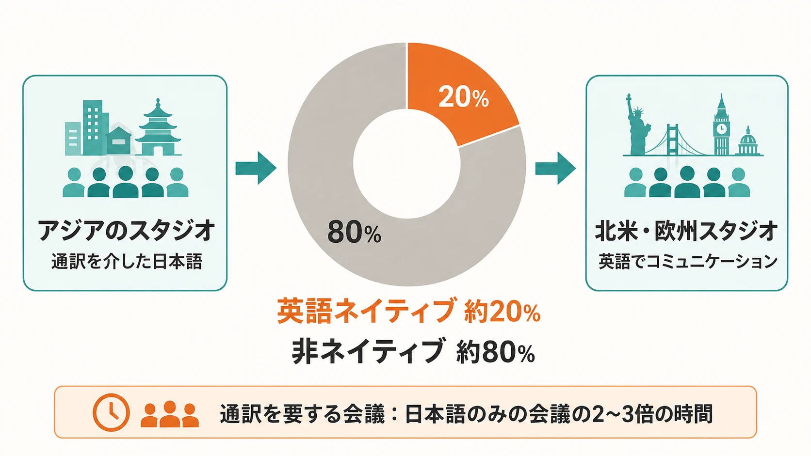
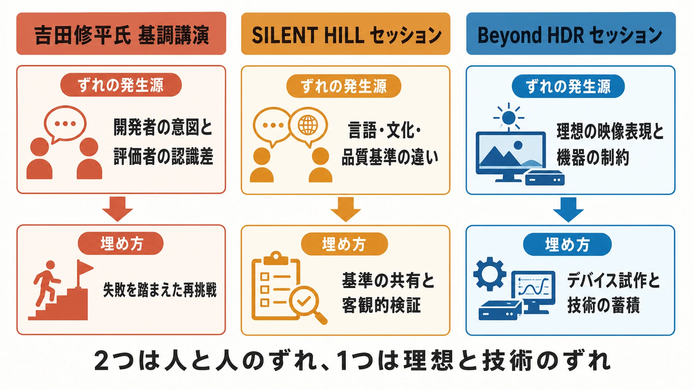

# CEDEC2026初日レポート：3大セッションに見る「作り手とユーザー・技術・海外パートナーのずれ」

CEDEC2026（Computer Entertainment Developers Conference 2026）は2026年7月22日から24日の3日間、パシフィコ横浜ノースとオンラインのハイブリッド形式で開催された。会期初日は、吉田修平氏による基調講演、KONAMIの「SILENT HILL」プロデュース術セッション、ポリフォニー・デジタルとソニーによるグランツーリスモの超高輝度HDR挑戦セッションなど、注目講演が相次いだ。3件はジャンルも技術領域も異なるが、いずれも「作り手が想定していたユーザー体験・技術的前提・海外パートナーとの認識」が、実際のプレイヤーの反応や物理的な制約とどうずれ、それをどう埋めていったかという論点を含んでいる。[[1](#ref-1)][[2](#ref-2)]

***

## 基調講演：吉田修平氏が語る名作誕生秘話

初日9時30分から行われた基調講演「私が出会った素晴らしいゲーム、クリエイター、そしてその創造性について」には、1986年にソニー株式会社へ入社し、1993年からプレイステーション関連の開発に携わり、2008年からSIEワールドワイド・スタジオ プレジデントを務めた吉田修平氏（現yosp代表取締役）が登壇した。「クラッシュ・バンディクー」「ICO」「God of War」から「風ノ旅ビト」「Ghost of Tsushima」まで、約30年のキャリアを80分にわたって振り返った。[[3](#ref-3)][[4](#ref-4)][[5](#ref-5)]

*本節では、講演内容の記録画像を引用しない。*

講演の核心の一つは「Demon's Souls」を巡るエピソードだ。2008年に欧米から帰国した吉田氏は、開発中のテストROMをプレイし「なんて難しいゲームなんだ」とネガティブな印象を持ったという。これは吉田氏自身が「アクションゲームはプレイヤーをスムーズに楽しませる導線設計が必要」という固定観念にとらわれ、フロム・ソフトウェアの宮崎英高氏（現社長）が目指す新しいユーザー体験の真意を、開発中に見抜けなかったためだった。この評価のずれの結果、SIE北米・欧州チームは自社発売を見送ったが、発売後は当時の2ちゃんねるなどを中心に「神ゲー」として評価が爆発。結局、北米はアトラス、欧州はバンダイナムコがパブリッシングを担い、世界的ヒットとなった。[[3](#ref-3)]

この経験から吉田氏は「開発者がどのようなユーザー体験を作ろうとしているのかを正しく理解しなければならない」という教訓を得たと語った。なお、精神的続編にあたる「Dark Souls」の開発でソニー側は再度の協業を打診したが、フロム側からは「あの時サポートしてくれなかったよね」と断られたという経緯があり、その反省を活かして吉田氏が宮崎氏と正面から向き合った結果、PS4時代に共同開発として結実したのが「Bloodborne」だった。「開発者の意図」と「評価者側の物差し」のずれを、痛みを伴う失敗を通じて修正していった過程は、作り手の意図理解がいかに難しく、かつ重要かを示すエピソードといえる。[[3](#ref-3)]

***

## 「SILENT HILL」プロデュース術：グローバル開発と推し活設計

コナミデジタルエンタテインメントは、統括プロデューサーの岡本基氏、アシスタントプロデューサーの松尾泰樹氏、プランナーの杉本絢音氏による基調講演「SILENT HILLのプロデュース術 『推し』の時代に推されるゲームをめざすには？ ユーザーの熱量を重視するプロデュース方針と海外開発を軸にしたグローバルゲーム開発進行」を行った。25年続くシリーズを、2012年の『SILENT HILL: Book of Memories』以降約10年の休止期間を経て『SILENT HILL 2』（2024年）と『SILENT HILL f』（2025年）で復活させた経緯と、グローバル開発の実務ノウハウが語られた。[[6](#ref-6)][[7](#ref-7)]

チーム構成自体が「ずれ」への対応を体現している。15名のチームのうち英語ネイティブは約20%のみで、残り80%は英語を話さない。北米・欧州のスタジオ（Bloober Team〈ポーランド〉、Annapurna〈米国〉、No Code〈スコットランド〉など）とは英語で、アジアのスタジオ（NeoBards〈台湾〉など）とは通訳を介した日本語でコミュニケーションを取り、通訳を要する会議は日本語のみの会議より2～3倍の時間を要するという課題があった。岡本氏は「グローバル開発は英語力を前提としない」と強調し、言語の壁で協業先を狭めるのではなく、実際に作品をプレイして判断すべきだと語った。[[6](#ref-6)]

*図：「SILENT HILL」シリーズのグローバル開発で共有されたチーム構成とコミュニケーション経路。*

技術・品質基準に関するずれも具体的に語られた。ポーランドのBloober Teamとの『SILENT HILL 2』リメイクでは、初期段階でゲームデザイン文書により核心要素を固め、「ヴァーティカルスライス」段階で双方の品質基準を一致させる「開発の標準化」を重視し、この経験は台湾・スコットランドのスタジオとの協業にも応用されたという。一方、マスター提出の品質水準については、コナミが最初のマスターで一定の完成度を求めたのに対し、開発側は必要最小限の実装でマスターを提出し、Day 1パッチで補完するという考え方の違いがあった。ローカライズはコナミが直接担い、シリーズ初の日本語音声追加によるスケジュール遅延はコナミ側がコストを一部負担して調整した。また、日本国内では労働コストの高さからしばしば後回しにされがちな「アクセシビリティ」対応が、海外開発では品質の一部と見なされている点も、協業から得た発見として語られた（同作にはホラーゲームとしては珍しいハイコントラストモードや、ディスレクシアを持つユーザー向けの専用フォントが実装されている）。[[6](#ref-6)][[7](#ref-7)]

日本を舞台にした『SILENT HILL f』では、日本人シナリオライター（竜騎士07氏）と台湾の開発スタジオとの間で方向性がぶれないよう、初期段階からシナリオライター・イラストレーター・コンセプトアート会社・開発スタジオ・コナミの関係者全員が集まって世界設定とゲームデザインの枠組みを固め、岐阜県の1960年代の実際の資料・写真を収集して「場の空気感」の合意形成を図るなど、文化的な認識のずれを埋める工夫が重ねられた。開発後半では、外部コンサルティング会社を通じた元Metacriticレビュアーによる模擬評価や北米ユーザーのモニタリングなど、プロデューサーの直感だけに頼らない客観的な検証プロセスも導入された。岡本氏は現代のエンターテインメントを「考察」と「推し活」の時代と位置づけ、あいまいさや細部の設定がユーザーの分析欲求を刺激し、二次創作を促す構造そのものを設計に取り込んだ点も紹介した（狐面の男「メロ狐」の同人人気などが好例として挙げられている）。[[6](#ref-6)][[7](#ref-7)]

***

## Beyond HDR：グランツーリスモとソニーの超高輝度HDR挑戦

ポリフォニー・デジタルの鈴木健太郎氏（エンジニアリングマネージャー）、内村創氏（画像処理エンジニア）、安冨健一郎氏（テクニカルアーティスト/チームリード）と、ソニーの廣田洋一氏（技術開発研究所）、菅井千尋氏によるセッション「Beyond HDR －きらめきも質感も、見たままに届ける。映像体験への実験的挑戦－」が行われた。ゲームにおけるHDR（ハイダイナミックレンジ）表現の変遷、「グランツーリスモ」シリーズのHDRへの取り組み、ソニーが試作した超高輝度ディスプレイが紹介された。[[8](#ref-8)]

*本節では、試作機またはHDR表示の記録画像を引用しない。*

HDR対応ゲームは2016年前後にゲーム機・テレビ・映像規格がほぼ同時に動き出し、PS4/Xbox One世代の中盤から実用化が進んだ。表示デバイスごとの性能差がゲーム体験に影響するという課題を踏まえ、ゲーム業界とTV・ディスプレイ業界の有志企業による「HDR Gaming Interest Group（HGiG）」が2018年にガイドラインを公開している。「グランツーリスモ」シリーズは2017年発売の『グランツーリスモSPORT』の開発時からHDR対応を始めたが、当時市場に出回っていたHDRテレビの最大輝度は1,000nitsにも届かず、開発者自身がHDRとSDRの映像を見分けられないこともあったという。それでもポリフォニー・デジタルは将来を見据え、「見えない10,000nits」という将来のディスプレイ性能を前提にした画作りを10年近く続けてきた。[[8](#ref-8)]

この「理想と現実のずれ」に動いたのがソニー側だった。HDR規格が視覚のダイナミックレンジをほぼカバーする0.0001～10,000nitsを扱えるのに対し、一般的なHDR対応ディスプレイの最大輝度は1,000nits程度にとどまり、大きなギャップが存在していた。そこでソニーは、サイネージ用途で使われる独立したRGB LED素子による発光方式をベースに、通常のモニターサイズにまで小型化した「10,000nitsを超える超高輝度ディスプレイ」を試作した。白飛びと黒潰れを抑える階調表現技術によって、これまで見えなかった明部・暗部の階調が再現可能になったという。ポリフォニー・デジタル側が「HDRの理想像を見てみたい」という欲求を強めていた時期に、ソニー側も「新しいデバイスの性能を活かすコンテンツを探していた」ことで需要が合致し、今回の協業に至った。[[8](#ref-8)]

10年近く「見えない10,000nits」を前提に画作りを続けてきた「グランツーリスモ」と、実際に10,000nitsを実現した超高輝度ディスプレイが出会ったことで、開発陣は「ようやく現実が追いついた」と振り返っている。コントラストが高まったことで輪郭を捉えやすくなり体感解像度が向上したほか、質感の説得力が増し「触れそうな実在感」を得られたという。一方で、SDR環境を前提とした自動露出補正やポストエフェクトが超高輝度HDR環境では不要になる一方、刺激が強く長時間視聴では疲れやすいといった新たな知見も得られており、「HDRにはHDRの調整作法があるはず」だとして今後のコンテンツ制作に活かす方針が語られた。会場のパシフィコ横浜では、実際にこの超高輝度ディスプレイによる「グランツーリスモ」の展示が行われている。[[8](#ref-8)]

***

## 3つのセッションを貫く共通論点

3つの講演はジャンルも技術領域も異なるが、いずれも「作り手が想定した体験・基準」と「ユーザーの実際の反応、海外パートナーとの価値観の違い、技術的な物理制約」との間に生じるずれを、どう発見し、どう埋めるかという共通のテーマを持つ。

| セッション | ずれの発生源 | 埋め方 |
| --- | --- | --- |
| 吉田修平氏 基調講演 | 開発者の意図（宮崎氏）と評価者（吉田氏・パブリッシャー）の認識差 | 失敗の反省を踏まえた再挑戦、開発者の意図理解の徹底[[3](#ref-3)] |
| SILENT HILLセッション | 言語・文化・品質基準の異なる海外スタジオとの協業 | 開発の標準化、共通言語（バイブル）の整備、客観的検証プロセスの導入[[6](#ref-6)][[7](#ref-7)] |
| Beyond HDRセッション | 理想の映像表現とディスプレイ機器の物理的な輝度・階調制約 | ハードウェア側との協業によるデバイス試作、技術の追いつきを待つ蓄積[[8](#ref-8)] |

吉田氏のケースでは「作り手の狙い」を第三者が正しく評価できなかったことがずれの根であり、SILENT HILLのケースでは「日本と海外、開発側とコナミ」という複数の立場間の基準の違いがずれの根になっている。一方でBeyond HDRのケースは、人間同士の認識のずれではなく「創作意図とハードウェアの物理特性・当時の技術水準」とのずれが軸になる点で対照的だ。前者2件では客観的な仕組み・基準・対話のプロセスを事前に設計しておくことがずれを埋める鍵だったのに対し、Beyond HDRの場合は技術が追いつくまで理想を持ち続け、機会が訪れた瞬間に協業できる体制を保っていたことが鍵だったといえる。ゲームプランナーを目指す読者にとっては、企画段階からユーザーテストや海外パートナーとの共通言語づくりを組み込む重要性と、実現できない技術的理想であっても方向性として持ち続ける価値の両方を示す好例といえる。[[3](#ref-3)][[6](#ref-6)][[7](#ref-7)][[8](#ref-8)]

*図：3つのセッションにおける「ずれ」の発生源と、それぞれの埋め方。*

## References

1. [CEDEC2026公式サイト][1] - CEDEC2026の開催日程・会場に関する公式案内。

2. [CEDEC2026 本日、6月1日(月)より受講登録開始！][2] - CEDEC2026の受講登録開始を伝える公式告知。

3. [GAME Watch「吉田修平氏が語る数々の名作ゲーム誕生秘話【CEDEC2026】」][3] - 吉田修平氏の基調講演を伝えるレポート。Demon's Souls・Bloodborneをめぐる経緯を含む。

4. [gamebiz「吉田修平氏が『CEDEC2026』初日の基調講演で登壇 IPAの登大遊氏が最終日に講演」][4] - 基調講演の登壇決定を伝える記事。

5. [でんふぁみこ通信「『CEDEC2026』基調講演に吉田修平氏、登大遊氏がそれぞれ登壇決定」][5] - 基調講演の登壇決定を伝える記事。

6. [Inven Global「SILENT HILL: A Development Strategy That Rebuilt a 25-Year Legacy」][6] - 「SILENT HILL」プロデュース術セッションの詳細レポート。チーム構成・海外スタジオとの協業体制を含む。

7. [GAME Watch「『サイレントヒル』岡本氏が語る『SH2』『SHf』開発話！ 竜騎士07氏と考察の相性の良さや『メロ狐』が紹介【CEDEC2026】」][7] - 同セッションの国内向けレポート。登壇者の役職・氏名を含む。

8. [GAME Watch「『グランツーリスモ』がこだわった“見えない10,000nits”。ポリフォニーとソニーの超高輝度HDRへの挑戦【CEDEC2026】」][8] - 「Beyond HDR」セッションの詳細レポート。

[1]: https://cedec.cesa.or.jp/2026/
[2]: https://cedec.cesa.or.jp/2026/newslist/pressrelease/0887.html
[3]: https://game.watch.impress.co.jp/docs/kikaku/2126894.html
[4]: https://gamebiz.jp/news/428243
[5]: https://news.denfaminicogamer.jp/news/260622n
[6]: https://www.invenglobal.com/articles/24049/silent-hill-a-development-strategy-that-rebuilt-a-25-year-legacy
[7]: https://game.watch.impress.co.jp/docs/kikaku/2127066.html
[8]: https://game.watch.impress.co.jp/docs/news/2127040.html

----

この文書は、Perplexity、Claude、OpenAI Codex の3つのAIの支援を受けて著述されたものです。引用画像を除き、MIT License にて提供されています。
