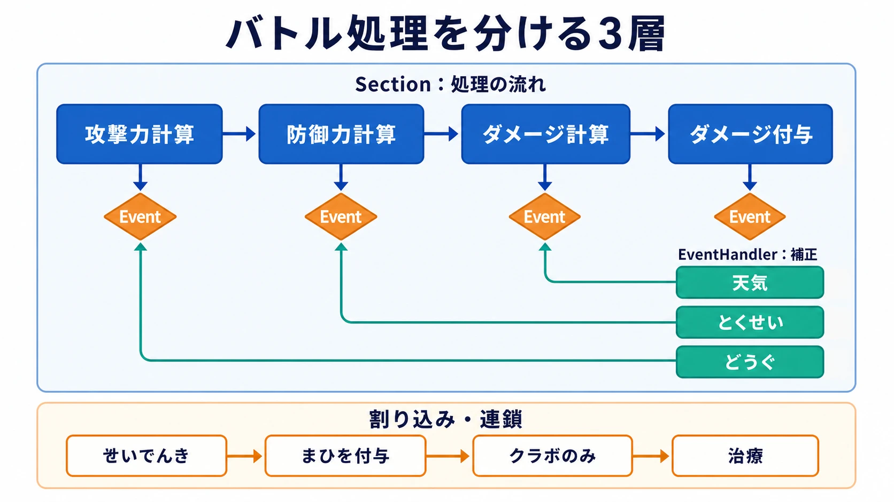
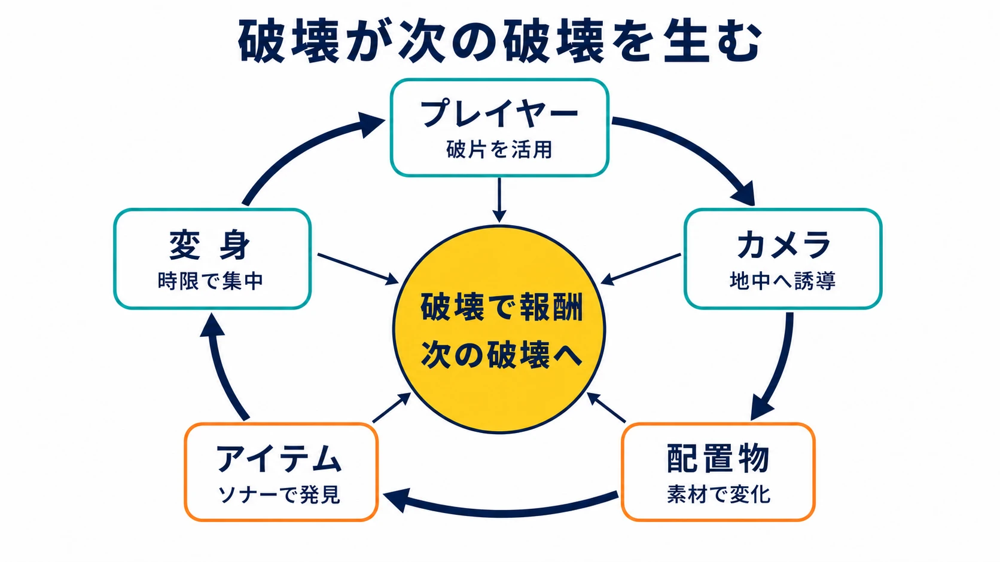

# CEDEC2026中盤レポート：6大セッションに見る「即効性のない投資判断」

CEDEC2026（Computer Entertainment Developers Conference 2026）は2026年7月22日から24日の3日間、パシフィコ横浜ノースとオンラインのハイブリッド形式で開催された、国内最大級のゲーム開発者向けカンファレンスである。テーマは「Co-Create」（共創）。会期中盤にあたる1日目午後から2日目にかけては、ゲームフリークによるポケモンのバトルシステムと描画技術に関する連続講演、産学官連携によるゲーム開発資料保存の議論、任天堂『ドンキーコング バナンザ』の設計思想とCEDEC AWARDS 2026での受賞、カプコン『プラグマタ』のキャラクター表現など、注目セッションが相次いだ。6件はジャンルも技術領域も異なるが、いずれも成果がその場では見えにくい「即効性のない投資判断」――長期シリーズの保守性への投資、収益に直結しない文化資源としての資料保存、レンダリングコストの高い表現へのこだわり――を扱っている点で共通する。[[1](#ref-1)][[2](#ref-2)]

***

## ポケモンバトルシステムの構造的再設計

7月22日午後に行われた「ポケモン勝負の進化を支える、バトルシステムの基盤設計と運用事例」では、株式会社ゲームフリークの宗像快氏、小幡敏宏氏が、シリーズを重ねるごとに複雑化してきたバトルロジックの再構築について語った。2026年時点でポケモンは1000種類以上、わざは900種類以上、どうぐは200種類以上、とくせいも300種類以上存在し、新作を作るたびに約200種類以上のデータが追加され続けるため、データ量は雪だるま式に膨れ上がっていた。[[3](#ref-3)][[4](#ref-4)]

初代『赤・緑』では単純だったバトルシステムは、『金・銀』以降拡張を繰り返す手法で作られてきたが、2016年の『ポケットモンスター サン・ムーン』で追加されたルール「バトルロイヤル」を機に、従来の拡張型の枠組みでは新ルールへの対応も新仕様の追加も限界を迎えたという。これを受け、2019年の『ソード・シールド』でバトルシステムの基盤が全面的に再構築され、「構造化」「拡張性」「柔軟性」「保守性」の4要件が定義された。[[4](#ref-4)]

再構築の核心は「Section」（セクション）という単位である。セクションはわざやとくせいなど個別仕様を含まず、「何をどの順番で計算するか」という処理の流れのみを定義したもので、攻撃力計算やダメージ計算などの単位を階層構造として積み上げることで、全体の見通しの良さを確保した。ここに毎作品増え続ける個別仕様を直接組み込むと保守性が悪化するため、「Event」（イベント）と「EventHandler」（イベントハンドラー）という仕組みが導入された。各セクションは計算の要所でイベントを発生させ、「天気」「とくせい」「どうぐ」などのイベントハンドラーがこれに反応して結果に補正を加える構造だ。[[4](#ref-4)]

この仕組みにより、個別仕様の実装はセクション本体のコードから完全に切り離され、既存コードへの改修なしに新仕様を追加できるようになった。特定タイトルに存在しない仕様はイベントハンドラーを登録しなければ自然に除外されるため、『X・Y』の「メガシンカ」や『スカーレット・バイオレット』の「テラスタル」のようなタイトル固有要素も同じ仕組みで分離実装できる。さらにイベントハンドラー同士が任意のセクションを再帰的に呼び出す設計により、「せいでんき」で状態異常を付与し、「クラボのみ」が反応して治療するといった「割り込み」と「連鎖」も実現している。この構造化の効果は、リアルタイム形式のバトルを採用した『Pokémon LEGENDS Z-A』が内部的には従来のターン制バトルと全く同じ構造で処理されている事実によって裏付けられた。ゲームプランナーの視点では、仕様が積層するタイトルほど、ロジックそのものではなく「イベント発火点の設計」が保守性を左右する好例といえる。[[4](#ref-4)]

***

## 「ポケリグ」による大量モデルの効率描画

7月23日09:30〜10:30には「ミアレシティがメガシンカ!? 『Pokémon LEGENDS Z-A』の描画技術」が行われ、ゲームフリークの前澤圭一氏、スパダフィーナ・アルフレド氏、赤木達也氏が『Z-A』の描画パイプラインを解説した。同じデザインの建物が密集し、遮蔽が多いミアレシティを効率的に描くため、同形の3Dモデルを一括で大量表示する「InstancedDraw」と、画面外オブジェクトの描画を省く各種カリング（フラスタムカリング、DepthPrePassやHierarchical-Zカリングによるオクルージョンカリング）が活用され、『Z-A』はInstancedDrawを最も活用したタイトルになったという。[[5](#ref-5)][[6](#ref-6)]

キャラクター描画面では「ポケリグ」の取り組みが紹介された。1000種類を超えるポケモンと人間キャラクターという圧倒的な物量に対応するための解決策で、リグ（骨組み）の知識がなくても扱えるシステムと、データを効率的に再利用できるモーションリターゲットの仕組みからなる。ポケリグは段階的に導入され、『Z-A』では人物キャラクターへの対応が大きな課題となり、服と顔それぞれのリグを統合し、モーションはポケモンのリターゲット手法の派生で対応することで、過去作からのリターゲットも共通フローで処理できるようになった。開発チームは今後、全ポケモンのポケリグ化を目標に掲げている。同セッションでは、天球モデルと空シェーダーによる空表現、SSPR（Screen Space Planar Reflections）による水面反射、遠景ではリアルタイム影の代わりにベイク影を採用するなど、コストと表現力のトレードオフに関する工夫も多数語られた。[[6](#ref-6)]

***

## ゲーム開発資料を「文化資源」として残す産学官連携

7月22日16:40〜17:40には「ゲーム開発関連資料を『文化資源』としてどう残すか？――公的機関との連携に向けての対話」が開催され、立命館大学の尾鼻崇氏、ZEN大学の細井浩一氏、KADOKAWAの浜村弘一氏、株式会社ミラクルアーツの三津原敏氏、スクウェア・エニックスの三宅陽一郎氏、一般社団法人コトモノラボの小出治都子氏が登壇した。ゲーム開発資料（企画書、ラフ画、ホワイトボードの写真やメモ書きなどの中間生成物）はマンガやアニメと同様に技術と文化を伝える一次資料だが、企業の機密情報そのものであるため体系的に保存されないまま散逸しやすい、という課題認識から議論が始まった。尾鼻氏は、日本のメディア芸術館所蔵マップが海外に比べてマンガ・アニメに偏り、ゲームの所蔵点数がごくわずかにとどまっている現状を紹介し、文化庁が推進する「メディア芸術ナショナルセンター（仮称）」を例に、国や大学も加わった連携の必要性を訴えた。[[7](#ref-7)][[8](#ref-8)]

スクウェア・エニックスでは、社内に眠る開発資料・データを網羅的にサルベージして保存する「SAVE project」が2020年春に発足しており、書類、グッズ、フィルム、ディスクなど多様なメディアを対象に活動を続けている。三宅陽一郎氏は、過去の開発資料が社内に残っていれば新規開発のアイデア創出やリマスター・リメイク制作に役立つと述べ、資料を「外に逃がしていくこと」の重要性を語った。三津原敏氏は、イラストや企画書だけでなく複数人が書き込んだホワイトボードの写真のような何気ない記録こそ捨てられやすく散逸しやすいと指摘し、浜村弘一氏は、開発者から「これ、あげるよ」と資料を個人的に譲られた経験を、資料管理体制が現場依存になっている現状の一例として紹介した。日本のゲーム保存事業に関する年度予算は増加傾向にあり、ニンテンドーミュージアムなど企業側が自社の開発資料を保存・展示する動きも広がっているという。[[9](#ref-9)][[10](#ref-10)][[7](#ref-7)]

***

## 『ドンキーコング バナンザ』を支える「破壊の連鎖」

7月23日には任天堂の高橋和也氏・田中航氏による「破壊の連鎖でつながるゲームサイクル」と、森洋介氏・深山智史氏による「すべてが壊せる世界の構築～破壊を実現するボクセル技術～」が行われた。前者では、ドンキーコングの力強いパンチアクションとボクセル技術による地形の応答性を掛け合わせた「すべてを破壊できる3Dアクションゲーム」というコンセプトを起点に、「破壊が報酬を生み、次の破壊へつながる」連鎖こそが遊びの核心であることが語られた。[[11](#ref-11)][[12](#ref-12)][[13](#ref-13)]

田中氏は、アクションゲームを構成する5つの要素すべてに連鎖の仕掛けを組み込んだと説明した。

| 要素 | 設計思想 |
|---|---|
| プレイヤーキャラクター | パンチによる破壊で得た破片を遠近両用攻撃・2段ジャンプ・スケボー移動に活用でき、破片が壊れると使えなくなるため次の破壊を促すサイクルを構築[[13](#ref-13)] |
| カメラ | 地中を掘る際に視界が狭まる問題を解決する「地中カメラ」を導入し、遠くの空洞をぼかし表現で浮かばせプレイヤーを次の破壊対象へ自然に誘導。地中カメラから「投棄場の階層」という新たな遊びも生まれた[[13](#ref-13)] |
| 配置物 | 敵「クロコイド」や味方「ワレルヤ」もボクセル素材で構成し、素材の硬さ・再生特性ごとに破壊難易度や活用法を変化させ（再生するワレルヤの氷体で溶岩地形を越える、再生しない塩でリソース管理を促すなど）、次々と破壊のきっかけを生む[[13](#ref-13)] |
| コレクションアイテム | パンチアクション「ハンドスラップ」に地中アイテムを可視化するソナー効果を持たせ、プレイヤーに気づきと次なる破壊を自発的に誘発させる[[13](#ref-13)] |
| 変身（バナンザ変身） | ゴールド収集でゲージを満たすと発動し、通常壊せない対象を破壊可能にする一方で制限時間を設定。当初は制約が時間のみで破壊が散漫になる課題があったため、変身中はソナー効果を常時発動させ目的を持った破壊へ改良した[[13](#ref-13)] |

この5要素すべてに「連鎖」の仕組みを持たせたことで、次々と壊したくなる面白さと爽快感が生まれたと結論づけられている。もう一方のセッションでは、ボクセル技術を起点とした地形破壊が敵やNPCにまで応用された技術的側面、破壊に連動するサウンド・エフェクトの制御、レベルデザイナーやアーティストの制作ワークフローが具体的な事例とともに紹介された。[[12](#ref-12)][[13](#ref-13)]

***

## CEDEC AWARDS 2026、任天堂が総なめ

7月23日17時40分より開催されたCEDEC AWARDS 2026発表・授賞式では、エンジニアリング、ゲームデザイン、ビジュアルアーツの3部門を『ドンキーコング バナンザ』開発チームが、サウンド部門を「Nintendo Music」開発・運営チームが受賞し、任天堂が全4部門を総なめにする形となった。[[14](#ref-14)][[15](#ref-15)]

エンジニアリング部門では、ボクセル技術によって物体の内部構造まで表現し地形破壊と物理挙動をリアルタイムに連動させた技術、自由に変化する地形へキャラクターを対応させる専用ツール開発が評価された。ゲームデザイン部門では、地形や敵を自由に破壊しながら地下世界を探索する遊びと、変身や環境変化を組み合わせて破壊という基本行為を多様な体験へ広げた点が選出理由となった。ビジュアルアーツ部門では、完全に破壊可能な3D世界を実現した表現技術と、Nintendo Switch 2での60fps動作を通じて大規模な地形インタラクションと破壊演出を両立した点が評価された。「Nintendo Music」は膨大なゲーム音楽のライブラリ化と継続的な楽曲追加、「ながさチェンジ」「いまの時刻で再生」といった鑑賞機能、ネタバレ防止機能などがサウンド部門での受賞理由に挙げられている。なお特別賞は、PlayStationブランドを長年牽引してきた吉田修平氏に授与された。[[14](#ref-14)][[15](#ref-15)]

***

## 『プラグマタ』のストランドヘアと表現力・コストのトレードオフ

7月23日14:40〜15:40には「『プラグマタ』における髪・表情表現の開発事例」として、カプコンのリードキャラクターアーティスト入江健二氏、リードフェイシャルアニメーター小原芹菜氏が登壇した。同作で好評を得たキャラクター「ディアナ」を魅力的にするため、DCCツールでの制作作業から実際の制作事例、ゲームエンジン側での制御まで、フェイシャルと髪の毛の表現に焦点を当てて紹介する内容だった。[[16](#ref-16)][[17](#ref-17)]

ディアナのストランドヘア（一本一本の毛束をシミュレーションするヘア表現技術）は、髪の質感や動きのリアリティを高める一方でレンダリングコストが高く、表現力とコストのバランスをどう取るかが開発上の焦点となった。セッションでは、DCCツールでの制作からゲームエンジン側の制御に至るまでの過程で実際に生じた課題を交えつつ、キャラクター表現の魅力とコストの両立をどう図ったかが語られた。フェイシャル表現においても、表情ジワなどのディテールと処理負荷のトレードオフが焦点となる分野であり、同時間帯には対照的な事例として『ファイナルファンタジーXIV』チームによるMayaのテンションマップを用いた表情ジワ表現のセッションも行われており、業界的に高品質なフェイシャル表現とコストバランスが共通の技術課題であることがうかがえる。[[16](#ref-16)][[17](#ref-17)]

***

## 6つのセッションを貫く共通論点

6つのセッションはジャンルも技術領域も異なるが、いずれも成果がその場では直接見えず、後年になって初めて評価される「即効性のない投資判断」を扱っている点で共通する。

| セッション | 投資対象 | 回収の形 |
| --- | --- | --- |
| ポケモンバトルシステム | 2019年『ソード・シールド』時点での全面的な基盤再構築 | 新ルール・新仕様追加コストの低減、『LEGENDS Z-A』のリアルタイム戦闘への転用[[4](#ref-4)] |
| ポケリグ | リグ・モーションリターゲットを共通化する基盤への投資 | 『Z-A』での大量アセット効率化、全ポケモンへの展開という将来目標[[6](#ref-6)] |
| 文化資源保存パネル | 機密性の高い開発資料を寄託・アーカイブする体制構築 | 産業史としての保存、公的機関との連携基盤[[8](#ref-8)][[9](#ref-9)] |
| バナンザ「破壊の連鎖」 | 5要素すべてに連鎖の仕掛けを組み込む設計投資 | CEDEC AWARDS 2026でのエンジニアリング・ゲームデザイン・ビジュアルアーツ3部門受賞[[12](#ref-12)][[13](#ref-13)][[14](#ref-14)] |
| プラグマタのストランドヘア | レンダリングコストの高いストランドヘア表現への投資 | キャラクターの訴求力・魅力の向上[[16](#ref-16)][[17](#ref-17)] |

ポケモンの2件は、30年・9世代という長期シリーズが背負う資産の肥大化に対し、目先の新要素追加ではなく、いつ回収されるかも定かでない基盤への投資を選んだ事例だ。文化資源保存パネルは回収の形が最も見えにくく、収益に直結しない社会的・産業的価値への投資という点で際立つ。一方『バナンザ』は、開発時点では成否が見えなかった「すべてを破壊できる」というコンセプトへの投資が、CEDEC AWARDS 2026での3部門受賞という形で早期に可視化された、数少ない事例といえる。プラグマタのストランドヘアも、ハード性能への依存というコストを承知の上でキャラクターの魅力を優先した判断であり、回収は数値化しにくいが「好評を得た」という評価に表れている。新米ゲームプランナーにとっては、目先の効果測定が難しい投資判断であっても、何を狙って投資しているのかを言語化しておくことが、後年の評価や社内外への説明可能性を左右するという教訓が読み取れる。[[4](#ref-4)][[6](#ref-6)][[8](#ref-8)][[9](#ref-9)][[12](#ref-12)][[13](#ref-13)][[14](#ref-14)][[16](#ref-16)][[17](#ref-17)]

## References

1. [CEDEC2026公式サイト][1] - CEDEC2026の開催日程・会場・テーマ「Co-Create」に関する公式案内。

2. [gamebiz「『CEDEC2026』セッション講演者と『CEDEC Lightning2026』の公募について」][2] - CEDEC2026のセッション講演者ラインナップに関する報道。

3. [CEDEC2026公式サイト「ポケモン勝負の進化を支える、バトルシステムの基盤設計と運用事例」][3] - セッションの開催日時・登壇者情報。

4. [でんふぁみこ通信「『ポケモン』の複雑すぎるバトルシステムがどうなっているのか、ゲーフリの“ポケモンバトル”専門家に聞いてみた」][4] - セッションの詳細レポート。Section/Event/EventHandlerの構造、『サン・ムーン』を機とした再構築の経緯を解説。

5. [CEDEC2026公式サイト「ミアレシティがメガシンカ!? 『Pokémon LEGENDS Z-A』の描画技術」][5] - セッションの開催日時・登壇者情報。

6. [でんふぁみこ通信「『1000種類を超えるポケモン＋人間』という圧倒的物量に立ち向かう」][6] - セッションの詳細レポート。「ポケリグ」の仕組みと描画最適化の工夫を解説。

7. [CEDEC2026公式サイト「ゲーム開発関連資料を『文化資源』としてどう残すか？」][7] - セッションの開催日時・登壇者情報。

8. [でんふぁみこ通信「ゲームの企画書やラフ画は、なぜ残らないのか」][8] - セッションの詳細レポート。登壇者6名の発言、日本のメディア芸術館所蔵マップの現状などを詳述。

9. [でんふぁみこ通信「『CEDEC 2024』ゲーム開発過去資料の保存の最前線を語る」][9] - スクウェア・エニックス「SAVEプロジェクト」の2020年春発足を伝える2024年時点のレポート。

10. [ファミ通「スクウェア・エニックスの開発資料保存計画“SAVE”が現在も進行中」][10] - 「SAVEプロジェクト」の活動内容に関する2022年時点のレポート。

11. [CEDEC2026公式サイト「『ドンキーコング バナンザ』破壊の連鎖でつながるゲームサイクル」][11] - セッションの開催日時・登壇者情報。

12. [CEDEC2026公式サイト「『ドンキーコング バナンザ』すべてが壊せる世界の構築～破壊を実現するボクセル技術～」][12] - セッションの開催日時・登壇者情報。

13. [でんふぁみこ通信「『ドンキーコング バナンザ』はなぜ“次々と壊したくなる”のか？」][13] - 「破壊の連鎖」を構成する5要素の設計思想を詳述するレポート。

14. [4Gamer「『CEDEC AWARDS 2026』は任天堂が総なめ」][14] - CEDEC AWARDS 2026の受賞結果を伝えるレポート。

15. [GAME Watch「『ドンキーコング バナンザ』が3部門で最優秀賞受賞」][15] - CEDEC AWARDS 2026の受賞結果を伝えるレポート。

16. [CEDEC2026公式サイト「『プラグマタ』における髪・表情表現の開発事例」][16] - セッションの開催日時・登壇者情報。

17. [Autodesk AREA JAPAN「CEDEC2026」イベントページ][17] - 「『プラグマタ』における髪・表情表現の開発事例」セッションの概要紹介。

[1]: https://cedec.cesa.or.jp/2026/
[2]: https://gamebiz.jp/news/417657
[3]: https://cedec.cesa.or.jp/2026/timetable/detail/s698585436538b
[4]: https://news.denfaminicogamer.jp/kikakuthetower/2607224z
[5]: https://cedec.cesa.or.jp/2026/timetable/detail/s6985921593265
[6]: https://news.denfaminicogamer.jp/kikakuthetower/2607233k
[7]: https://cedec.cesa.or.jp/2026/timetable/detail/s6988e06315b13/
[8]: https://news.denfaminicogamer.jp/kikakuthetower/260723p
[9]: https://news.denfaminicogamer.jp/kikakuthetower/240904m
[10]: https://www.famitsu.com/news/202208/28273686.html
[11]: https://cedec.cesa.or.jp/2026/timetable/detail/s69a7a59588996
[12]: https://cedec.cesa.or.jp/2026/timetable/detail/s69a7a41874204
[13]: https://news.denfaminicogamer.jp/kikakuthetower/2607233e
[14]: https://www.4gamer.net/games/991/G999104/20260723057/
[15]: https://game.watch.impress.co.jp/docs/news/2127420.html
[16]: https://cedec.cesa.or.jp/2026/timetable/detail/s69f305ca68328
[17]: https://area.autodesk.jp/event/autodesk/cedec2026/

----

この文書は、Perplexity、Claude、OpenAI Codex の3つのAIの支援を受けて著述されたものです。引用画像を除き、MIT License にて提供されています。
