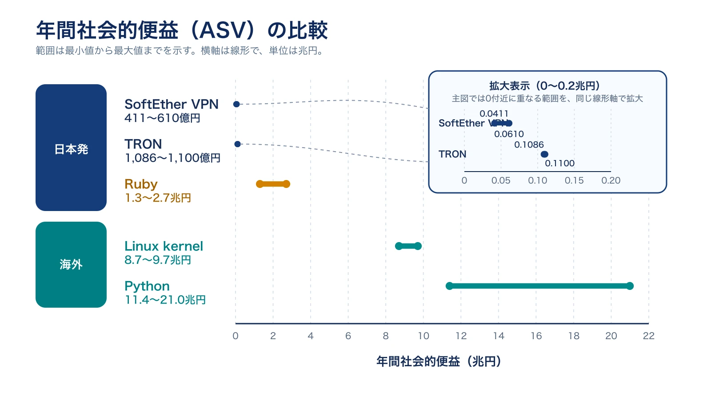
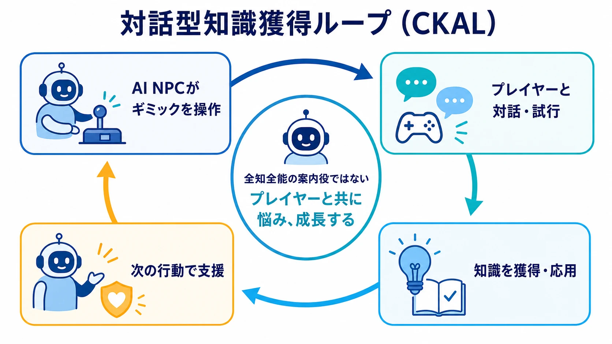
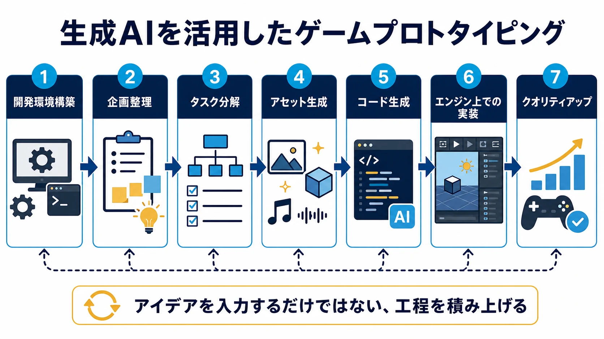
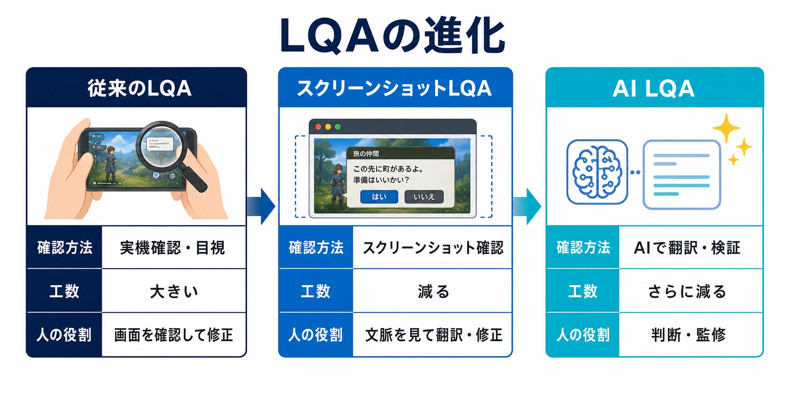

# CEDEC2026最終日レポート：5大セッションに見る「『できるはず』と『できた』のあいだを埋める泥臭さ」

CEDEC2026は2026年7月22日（水）から24日（金）までパシフィコ横浜ノースとオンラインのハイブリッドで開催された、国内最大級のゲーム開発者向けカンファレンスである。最終日となる7月24日には、基調講演から実務セッションまで幅広いテーマが並んだが、通底していたのは景気のいい将来予測やバズワードではなく、地道な検証・泥臭い実装の積み重ねだった。登大遊氏の基調講演が示した日本の基盤技術人材育成論、AI NPCセッションが示した5,000人・31日間という手間のかかる実証、スクウェア・エニックスのセッションが明言した「バイブコーディングとは異なる」地道な工程分解、『NINJA GAIDEN 4』の泥臭い最適化、WOVN.gamesの段階的なAIローカライズ導入――いずれも「できるはず」を「できた」に変えるための手間を扱っている。本稿では、ゲームを深く知りたいプレイヤーから新米ゲームプランナーまでを読者に想定し、最終日の5セッションをこの軸で整理する。[[1](#ref-1)]

***

## 基調講演：登大遊氏「生産手段の確立」

登大遊氏（ソフトイーサ株式会社、IPAサイバー技術研究室長、筑波大学客員教授）による基調講演「世界に普及可能なコンピュータやネットワーク技術の生産手段の確立」は、ゲーム開発に直接関わる内容ではないが、「将来の日本のGDPを上げるには今何をすべきか」という問いに答えを示すものだった。[[2](#ref-2)][[3](#ref-3)]

講演の核となる考え方は「年間社会的便益（ASV）」である。これはオープンソースのように無償提供される技術が社会全体に与える経済的価値を算出する指標で、登氏らが筑波大学と共同開発したVPNソフト「SoftEther VPN」のASVは411億円〜610億円、まつもとゆきひろ氏が開発したプログラミング言語「Ruby」は1.3兆円〜2.7兆円、坂村健氏がプロジェクトリーダーを務めたOS「TRON」は1,086億円〜1,100億円と算出されている。海外に目を向けると、Python（11.4兆円〜21.0兆円）やLinuxカーネル（8.7兆円〜9.7兆円）のように、日本発の技術とは桁違いの価値を生むソフトウェアが存在する。[[2](#ref-2)]

登氏は、日本にはこうした基盤技術を生み出す人材が少なく、多くの企業がクラウドサーバーなど基礎的なインフラを他国から購入する構造にとどまっている点を問題視した。この構造は、データ管理を自国内で行う「ソブリンクラウド」など安全保障上の課題にも直結する。アメリカでは2005年頃にコンピュータ系博士号取得者が急増したが、2014年以降は人材がAI分野に流出し、逆に中国は2016年以降、国策としてIT人材育成を強化しているという対比が示された。[[2](#ref-2)]

解決策として登氏が提唱するのが「遊び部屋（ガレージ）」という発想だ。YahooやGoogleがスタンフォード大学のサブドメインと空きPCから生まれたように、組織の枠外で自由に技術開発できる小規模な物理空間・支援体制を用意することが、人材育成の第一歩になるという主張である。筑波大学が慶應SFCとの交流のために運行したバス「USB（University Serial Bus）」の事例も紹介され、学生同士のバーベキューや技術討論会、ゲーム大会が新しい技術やサービスの種になり得ると論じられた。ゲーム業界は比較的この「ガレージ」的な空間を作りやすい業界だとも指摘されており、ゲーム開発者にも自国発の基盤技術（汎用ゲームエンジンなど）を生み出す探究心への投資が問われる講演内容だった。[[2](#ref-2)]

***

## AI NPCセッション：クラスター×筑波大学

クラスター株式会社メタバース研究所と筑波大学による公募セッション「人と学び、また会いたくなるAI NPC――初心者定着率2倍、5000人実証が示すメカニズムと協力プレイの設計戦略」は、2026年7月24日15:00〜16:00に第7会場で行われ、クラスターメタバース研究所の柳川光理氏とシニアリサーチサイエンティストの廣井裕一氏が講演した。CEDEC2025に続く2年連続の採択セッションである。[[4](#ref-4)][[5](#ref-5)]

本セッションの起点は「ゲームにおける初心者離脱」という業界共通の課題だ。LLM（大規模言語モデル）ベースのAI NPCによる解決策を、商用メタバース「cluster」上での大規模実証（5,000人規模・31日間の調査）を通じて示した点が最大の特徴である。この実証では、AI NPCと接触した新規プレイヤーの滞在時間が約2.2倍に向上し、AIへの累積接触日数が1日増えるごとに翌日ログイン率が+33.5%向上することが明らかになった。AI NPCが繰り返し会う「顔なじみ」として機能することで、定着効果が最大化されるという知見が示された。[[6](#ref-6)][[4](#ref-4)]

技術面では、この知見を踏まえて開発された「対話型知識獲得ループ（CKAL：Conversational Knowledge Acquisition Loop）」が紹介された。AI NPCがゲーム内のギミックを操作し、プレイヤーとの対話を通じて知識を獲得・応用していく仕組みで、AIが「全知全能」の案内役にならず、プレイヤーと共に悩み成長する体験を実現する狙いがある。141名を対象とした比較実験では、AI NPCの操作能力や能動性の違いがプレイヤー体験にどう影響するかが定量的に検証され、プレイヤーの達成感を損なわずに効果的に支援するための設計指針が提示された。プロデューサーやディレクター、AI実装エンジニア・研究者向けの内容として企画された点も特徴で、AI NPCの実務導入を検討する開発者にとって具体的な数値と設計論の両方を得られるセッションだった。[[6](#ref-6)][[4](#ref-4)]

***

## 生成AIによるゼロからのゲームプロトタイピング（スクウェア・エニックス）

「ゲームデザイナーによる生成AIを活用したゼロからのゲームプロトタイピング」は、非エンジニアであるゲームデザイナーが生成AIを用いて自らプロトタイプを作る事例を紹介するセッションである。登壇したのはスクウェア・エニックスの遠矢司氏で、家庭用ゲームのゲームデザイナー（プランナー）およびゲームディレクターとして複数のRPG・アクションRPG開発に携わった経歴を持つ。ゲーム制作の企画立案やプロトタイピング段階では、アイデアを試すために「プレイできる形」に落とし込む工程が必要になるが、従来はプログラマーの協力が前提となり、デザイナー単独では検証速度に限界があった。[[7](#ref-7)]

この課題に対し、生成AIを使うことでコードを書けないデザイナーでも短期間でプレイ可能なプロトタイプを作成できるようになる流れが示された点が論点となる。講演では、開発環境の構築から企画整理、タスク分解、アセット生成、コード生成、エンジン上での実装、クオリティアップまでの一連の工程が具体的に扱われる予定で、イメージやアイデアを入力するだけの、いわゆる「バイブコーディング」とは異なるアプローチである点が強調されている。ゲームデザイナーが自身のアイデアを迅速に「触れる形」にできることは、企画の説得力を高め、開発初期段階での意思決定を速める効果が期待される。新米ゲームプランナーにとっては、コーディングスキルがなくてもアイデア検証の壁を超えられる具体的な手法を学べる内容といえる。[[7](#ref-7)]

***

## NINJA GAIDEN 4の120FPS達成の道（プラチナゲームズ／I. Meisters）

「NINJA GAIDEN 4の120FPS達成の道」は、株式会社I. Meistersの今井星氏と、プラチナゲームズのエンジンチームから大森亘氏・坂本拓也氏・野口容介氏の計4名が登壇し、120FPS対応に向けた最適化の舞台裏を語るセッションである。大森氏はプロジェクトの技術リードや技術部署の統括を経て現在は技術フェローとして現場に関わっており、坂本氏は自社エンジンのVFXシステム、野口氏は最適化領域をそれぞれ担当してきた。『NINJA GAIDEN 4』はコーエーテクモゲームスのTeam NINJAとプラチナゲームズの共同開発によるアクションゲームで、シリーズ13年ぶりのナンバリング作品としてPS5、Xbox Series X/S、PCで発売された。[[8](#ref-8)][[9](#ref-9)][[10](#ref-10)]

論点の核心は、従来の60FPSに留まらず、ハイスピードなアクション体験を最大限伝えるために120FPSという高フレームレート動作を実現した点にある。プラチナゲームズ公式noteによれば、この講演では約4倍の高速化を行った開発の奮闘秘話が語られる予定で、タイトル開発と並行してゲームエンジン自体の開発も進めるという厳しい制約の中で、いかにチームが120FPS対応を「攻略」したかが中心テーマとなっている。同社の開発ブログでは、1フレームあたりわずか8ミリ秒という条件のもと、CPU・GPU両面でのメッシュ最適化（LOD・HLOD・Merged Mesh）や、最適化ツール「InstaLOD」の自社エンジンへの統合が明かされている。[[10](#ref-10)][[11](#ref-11)]

なお、120FPSモードが提供されるのはPS5とXbox Series Xのみで、Xbox Series Sでは120FPSモードが提供されず、30FPS・60FPSの2モードに留まる（Digital Foundryの分析によれば、Series Sの60FPSモードは解像度・テクスチャ品質を大きく落とすトレードオフを伴う）点も、技術的な制約の一例として業界内で知られている。ゲーム開発者にとっては、内製エンジンでの高フレームレート最適化というレアな事例から、レンダリングパイプラインや処理負荷分散の実践知を得られる内容だった。[[12](#ref-12)][[13](#ref-13)]

***

## AIローカライズ：Wovn Technologies×MIXI（STRIKE WORLD）

「AIローカライズ：MIXIが提供する『モンスターストライク』グローバル版『STRIKE WORLD』のLQAを支えたWOVN.games」は、Wovn Technologies株式会社の藤村弘也氏と田所洋氏、MIXIの入口香那子氏が登壇するセッションで、無料ライブ配信対象セッションの一つとして案内されている。『モンスターストライク』は2013年10月のサービス開始から2025年12月時点で世界累計利用者数6,500万人を突破した長期運営タイトルであり、そのグローバル版『STRIKE WORLD』は2026年2月19日のソフトローンチを経て、同年4月16日からインドで本格運用が開始されている。[[14](#ref-14)][[15](#ref-15)][[16](#ref-16)]

論点は、翻訳とLQA（言語品質保証）を一体化する「WOVN.games」のスクリーンショット機能を使ったローカライズ手法である。WOVN.gamesはSDK導入のみでUnityやUnreal Engineなど特殊な開発環境を必要とせず、ゲーム画面を自動でスクリーンショット保存し、翻訳者がその画面を見ながら直接翻訳・修正できる仕組みを提供する。一次翻訳をAI翻訳エンジンで行い、保存されたスクリーンショットを生成AIに送って翻訳・検証（LQA）を行う「AIスクショ翻訳」というフローが特徴で、従来別工程だった翻訳とLQAを一本化することでローンチまでの時間短縮・コスト削減・品質向上を同時に実現する狙いがある。本セッションでは、この手法をグローバル版モンストであるSTRIKE WORLDという実運用タイトルに適用した際の課題と進化が具体的に紹介される。多言語展開を目指すモバイルゲーム運営チームにとって、生成AIを翻訳検証プロセスに組み込む実装知見を得られる内容といえる。[[17](#ref-17)][[18](#ref-18)]

***

## 共通論点

| セッション | 登壇者・所属 | 主な論点 |
| --- | --- | --- |
| 基調講演「生産手段の確立」 | 登大遊氏（ソフトイーサ／IPA／筑波大学） | 年間社会的便益（ASV）で測る基盤技術の価値と、人材育成のための「ガレージ」環境の必要性 |
| AI NPCセッション | 柳川光理氏・廣井裕一氏（クラスター株式会社メタバース研究所） | LLMベースAI NPCによる初心者定着率2倍・5,000人実証と協力プレイ設計 |
| 生成AIプロトタイピング | 遠矢司氏（スクウェア・エニックス） | 非エンジニアのゲームデザイナーが生成AIでゼロからプレイ可能なプロトタイプを作る手法 |
| NINJA GAIDEN 4 120FPS | 今井星氏（I. Meisters）、大森亘氏・坂本拓也氏・野口容介氏（プラチナゲームズ） | 内製エンジンでの徹底的な最適化により120FPS対応を実現した泥臭い工程 |
| AIローカライズ WOVN.games | 藤村弘也氏・田所洋氏（Wovn Technologies）、入口香那子氏（MIXI） | AIスクショ翻訳による翻訳・LQA一本化のSTRIKE WORLD実運用事例 |

5セッションを通じて共通するのは、派手な将来予測やバズワードではなく、「できるはず」を「できた」に変えるための地道な手間だった。登大遊氏は年間社会的便益という定量的な物差しを使って基盤技術の価値を可視化し、長期的な人材育成環境の必要性を説いた。AI NPCセッションは5,000人・31日間という大規模かつ手間のかかる実証を経て初めて「顔なじみ」効果を裏付け、スクウェア・エニックスのセッションは「バイブコーディングとは異なる」具体的な工程分解を通じて生成AIプロトタイピングの実務可能性を示した。『NINJA GAIDEN 4』は120FPSという数値目標に対して泥臭い最適化を積み重ね、WOVN.gamesは従来別工程だった翻訳とLQAを段階的に統合していった。最終日に並んだセッションは、テーマこそ基盤技術からAI、最適化、ローカライズまで幅広いが、いずれも検証済みの手応えを積み上げる作業を扱っていた点で通底している。[[2](#ref-2)][[6](#ref-6)][[7](#ref-7)][[13](#ref-13)][[18](#ref-18)]

最終日である7月24日には、テクニカルアーティスト同士がセッションの内容を持ち帰り語り合う交流会「Artists Meet Technicals 2026」もみなとみらいで開催されており、カンファレンスで得た知見を現場に持ち帰る動きは、会場の外でも続いていた。[[19](#ref-19)]

## References

1. [CEDEC2026公式サイト][1] - CEDEC2026の開催日程・会場・テーマに関する公式案内。

2. [GAME Watch「日本の国富を育てる『遊び部屋』とは？ 登大遊氏基調講演レポート【CEDEC2026】」][2] - 基調講演の内容を詳述するレポート。年間社会的便益（ASV）の具体的数値、USB交流の逸話などを紹介。

3. [CEDEC2026公式サイト「世界に普及可能なコンピュータやネットワーク技術の生産手段の確立」][3] - セッションの開催日時・登壇者情報。

4. [CEDEC2026公式サイト「人と学び、また会いたくなるAI NPC― 初心者定着率2倍、5000人実証が示すメカニズムと協力プレイの設計戦略」][4] - セッションの開催日時・会場・登壇者情報。

5. [koubo.jp「CEDEC2026でAIエージェント研究を2年連続登壇決定」][5] - CEDEC2025からの2年連続採択に関する報道。

6. [PR TIMES「CEDEC2026でメタバースにおけるAIエージェントに関する研究成果を発表」][6] - セッション内容の詳細、5,000人・31日間の実証結果を紹介。

7. [CEDEC2026公式サイト「ゲームデザイナーによる生成AIを活用したゼロからのゲームプロトタイピング」][7] - セッションの開催日時・登壇者情報・内容概要。

8. [ファミ通「『NINJA GAIDEN 4』プラチナゲームズ開発による超忍アクションは、Team NINJAも大絶賛」][8] - 共同開発の経緯に関するレポート。

9. [4Gamer「13年ぶりのナンバリング最新作『NINJA GAIDEN 4』」][9] - シリーズの発売間隔、対応プラットフォームに関するレポート。

10. [PlatinumGames公式note「CEDEC2026に登壇します！！」][10] - セッション登壇の告知、約4倍の高速化に関する言及。

11. [PlatinumGames「ハイスピードアクション実現のための徹底的な最適化｜NINJA GAIDEN 4 開発ブログ」][11] - 120FPS対応のための最適化手法（LOD・HLOD・Merged Mesh・InstaLOD）を解説する公式開発ブログ。

12. [Gamereactor「Ninja Gaiden 4 will be able to run at 120 fps on Xbox Series X and PS5」][12] - PS5・Xbox Series Xでの120FPS対応に関する報道。

13. [Pure Xbox「Ninja Gaiden 4 Performance Is Impressive But Xbox Series S Visuals Suffer, Says Digital Foundry」][13] - Xbox Series Sでは120FPSモードが提供されず、30FPS・60FPSに留まる点を分析した記事。

14. [MIXI「Five MIXI Sessions Accepted for CEDEC 2026」][14] - MIXIのCEDEC2026登壇セッション一覧。

15. [PR TIMES「MIXI、グローバル版モンスト『STRIKE WORLD』2026年4月16日よりインドで本格運用開始」][15] - STRIKE WORLDのインド本格運用開始、ソフトローンチ時期、モンスターストライクの世界累計利用者数に関する公式発表。

16. [CEDEC2026公式サイト「無料ライブ配信セッション一覧」][16] - 本セッションが無料ライブ配信対象であることを示すページ。

17. [CEDEC2026公式サイト「AIローカライズ：MIXIが提供する『モンスターストライク』グローバル版『STRIKE WORLD』のLQAを支えたWOVN.games」][17] - セッションの内容概要。

18. [GameBusiness.jp「コロプラが『WOVN.games』導入でローカライゼーションの課題を解決」][18] - WOVN.games導入の先行事例に関するレポート。

19. [GameBusiness.jp「テクニカルアーティスト交流会『Artists Meet Technicals 2026』、CEDEC最終日の7月24日に横浜で開催」][19] - CEDEC最終日に併催されたTA交流会の開催情報。

[1]: https://cedec.cesa.or.jp/2026/
[2]: https://game.watch.impress.co.jp/docs/news/2127591.html
[3]: https://cedec.cesa.or.jp/2026/timetable/detail/s69d5ba27418bb/
[4]: https://cedec.cesa.or.jp/2026/timetable/detail/s6985d8c1edf51/
[5]: https://koubo.jp/article/98427
[6]: https://prtimes.jp/main/html/rd/p/000000452.000017626.html
[7]: https://cedec.cesa.or.jp/2026/timetable/detail/s6985de82cd9a3
[8]: https://www.famitsu.com/article/202510/54461
[9]: https://www.4gamer.net/games/875/G087562/20251021011/
[10]: https://note.com/platinumgames/n/nc44b06d0031d
[11]: https://www.platinumgames.co.jp/magazine/detail/?id=21_137
[12]: https://www.gamereactor.eu/ninja-gaiden-4-will-be-able-to-run-at-120-fps-on-xbox-series-x-and-ps5-1584333/
[13]: https://www.purexbox.com/news/2025/10/ninja-gaiden-4-performance-is-impressive-but-xbox-series-s-visuals-suffer-says-digital-foundry
[14]: https://mixi.co.jp/en/news/2026/0716/55121/
[15]: https://prtimes.jp/main/html/rd/p/000000795.000025121.html
[16]: https://cedec.cesa.or.jp/2026/timetable/free_lives/
[17]: https://cedec.cesa.or.jp/2026/timetable/detail/s69f2f0a65971b
[18]: https://www.gamebusiness.jp/article/2025/06/23/24472.html
[19]: https://www.gamebusiness.jp/article/2026/06/18/27252.html

----

この文書は、Perplexity、Claude、OpenAI Codex の3つのAIの支援を受けて著述されたものです。引用画像を除き、MIT License にて提供されています。
