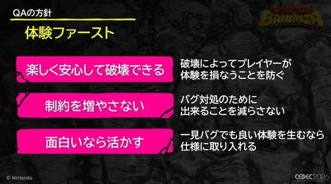
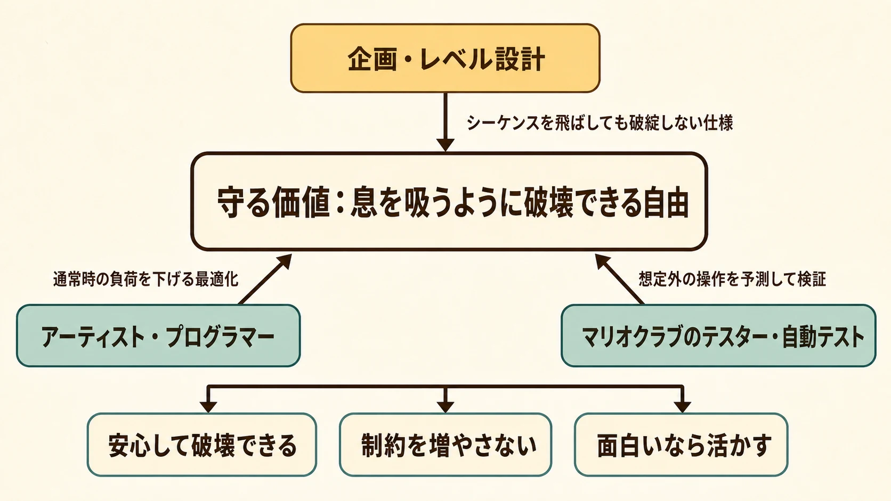
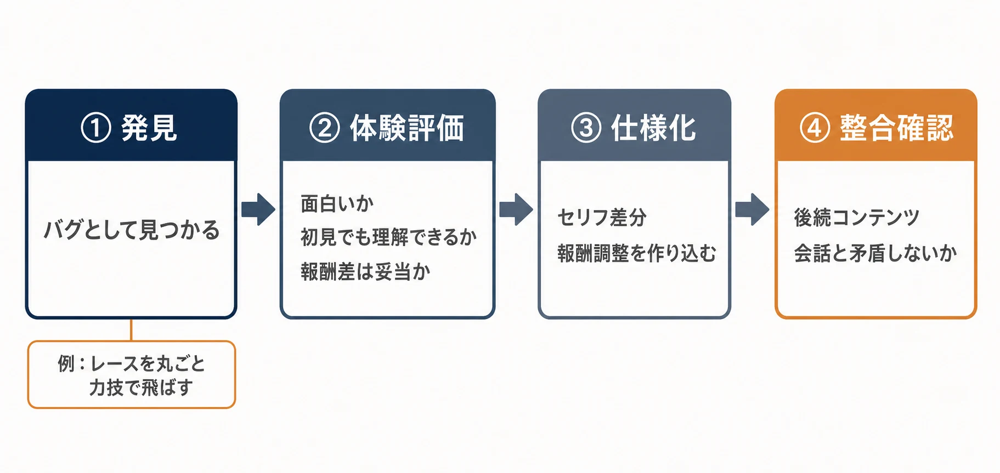
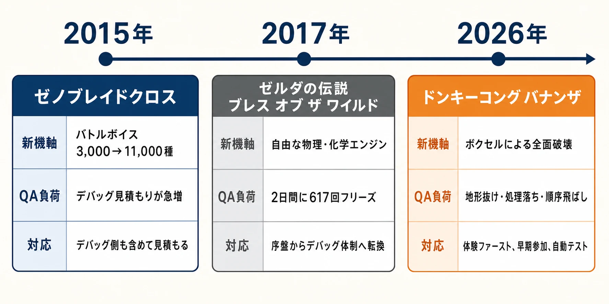

# CEDEC2026フォローアップ：『ドンキーコング バナンザ』が自由な破壊を守るために行ったQA

「息を吸うように破壊できる」ことは、プレイヤーにとっては解放感である。しかしQA（Quality Assurance：品質保証）にとっては、プレイヤーが地形を壊し、道を掘り、想定外の場所へ入り、攻略順を飛び越えるほど、確認すべき状態が増え続けることを意味する。『ドンキーコング バナンザ』の破壊は、単にオブジェクトを消す機能ではない。地形、移動、会話、収集、描画負荷までを連鎖的に変えるため、自由度そのものがQA最大の難所になった。

本作はCEDEC AWARDS 2026でエンジニアリング、ゲームデザイン、ビジュアルアーツの3部門で最優秀賞を受賞した。ボクセル技術で破壊可能な世界を成立させ、破壊を探索へつなげた成果が高く評価されたのである。[[1](#ref-1)] ただし、受賞理由にある「破綻なく実現する」という言葉の裏側には、壊した結果の体験をどこまで守るかという品質保証の仕事がある。CEDEC2026最終日の7月24日13時40分〜14時40分、任天堂の栗原竜矢氏と濱崎福平氏は、この問題に正面から向き合ったQAの取り組みを語った。[[2](#ref-2)]

同じCEDEC2026で扱われた「なぜプレイヤーが次々と壊したくなるのか」という破壊の設計思想については、[「破壊の連鎖」を扱った既存記事](cedec2026-day2-recap-pokemon-bananza-pragmata-investment.md)を参照されたい。本稿の焦点はその対になる問い、すなわち「どう実装し、どう壊れないことを検証したか」である。

***

## QAを「自由度を削る係」にしない三方針

一般に、重大な不具合が生じたときの確実な対処の一つは、問題が起こる操作や進入経路を制限することである。たとえば越えられては困る地形に不可視の壁を置く、特定の順序でしかイベントを起こせないようにする、といった方法だ。これは安全を早く確保するうえで合理的だが、自由な破壊を中核に置く本作では、プレイヤーが感じる「何でも試せそうだ」という魅力を失わせかねない。

そこで本作のQAは、破壊を軸とする自由な体験を守る「体験ファースト」を掲げ、次の三方針を置いた。[[2](#ref-2)]

| 方針 | QAで守る対象 | 企画上の意味 |
| --- | --- | --- |
| 安心して破壊できる | 破壊によって地形外へ抜ける、処理が重くなる、表示が崩れるといった体験の損失 | 壊す行為を、試すほど不安になる操作にしない |
| 制約を増やさない | バグ対処を理由に、壊せる範囲や移動・攻略の選択肢を安易に狭めない | 自由度を仕様の価値として保つ |
| 面白いなら活かす | バグとして見つかった挙動でも、楽しい体験になり得るなら調整して仕様へ組み込む | QAを減点作業で終わらせず、遊びの発見へ接続する |

この三方針の重要な点は、「安全」と「自由」を二者択一にしなかったことにある。QAが終盤に問題を報告し、企画が自由度を引き下げて解決する関係ではない。自由度を製品価値として先に共有し、その価値を傷つけずに不具合を減らす方法を探す関係である。プランナーにとっては、機能要件に「何ができるか」だけでなく、「不具合が出たときにも何をできなくしてはならないか」を早い段階で書き出すことが出発点になる。

出典：[GAME Watch（Impress Corporation）](https://game.watch.impress.co.jp/docs/news/2127714.html)

***

## シーケンスブレイクを「防ぐ」のではなく、体験を破綻させない

地形を変えられるゲームでは、開発者が想定した順序を無視して先へ進むシーケンスブレイク（攻略順序を飛び越える進行）が起こり得る。通常なら、到達条件を厳しくする、必要なボス戦を通らなければ扉を開けない、といった対策で防止したくなる。本作が選んだのは、順番を無視してもゲームを破綻させない方向だった。[[2](#ref-2)]

ここでいう「破綻しない」は、最後までクリアできるという最低条件だけを指さない。先に到達した後のセリフが進行状況と食い違わないか、収集アイテムの取得状態が矛盾しないか、プレイヤーが「本来は来てはいけない場所へ来た」と不自然に感じないかまでが検証対象になる。つまりQAのテストケースは、到達可否の判定から、到達後に連鎖する状態と演出の整合性の確認へ広がる。

この考え方は、自由度の高い企画の仕様書にもそのまま使える。ルートを一本に固定できないなら、プランナーは「先にBへ入った場合」「報酬を先に取った場合」「イベントを見ないまま戻った場合」という状態を洗い出し、会話、報酬、チェックポイント、再訪時の導線にどの差分が必要かをQAと共有すべきである。禁止条件の一覧だけでは、自由な到達を成立させる仕様にはならない。

***

## 最適化をステージ全員の課題にする

栗原氏は、本作の魅力を「息を吸うように破壊できる」ことと表現した一方、破壊には大きな負荷がかかると説明した。ここでも解決策は破壊の自由度を下げることではなく、通常時の負荷を下げ、破壊を繰り返しても処理落ちしにくくすることだった。[[2](#ref-2)]

そのため最適化はプログラマーだけの後処理にせず、ステージごとにチームを組み、アーティストやレベルデザイナーを含めて取り組んだ。ステージの負荷は、コードだけでなく、どこに何を置くか、どの密度で作るか、破壊後に何を残すかという制作判断から生まれるためである。担当の境界でボールを渡すのではなく、体験を作る全職種が同じ問題を見た体制といえる。

進捗については、毎日自動更新される視覚的な確認機能と、他チームの状況も日ごとに伝える「ニュース担当」によって共有したという。[[2](#ref-2)] 数値目標だけを個別チームが追うと、局所的には改善しても、全体の遅れや別チームの工夫が見えにくい。可視化と日次共有は、最適化を専門家の作業から、各ステージが自分事として優先順位を調整できる制作課題へ変える仕組みだった。

## テスターを初期から「ゲームを理解した開発者」にする

発見できるバグの質は、テスト回数だけで決まらない。何が面白さの核で、どの操作の組み合わせが危険かを理解したテスターは、単に手順をなぞるのではなく、破綻しそうな行動を予測して試せる。本作では、任天堂の子会社マリオクラブのテスターを開発初期から開発チームの一員として迎え、開発情報を共有し、開発者ミーティングやレベルエディタを使った仕様確認にも参加してもらった。[[2](#ref-2)]

これはテスターに実装作業を任せたという話ではない。検証する人が設計意図と制作途中の変化を知った状態で、自由な破壊によって起きそうな問題を先回りして探せるようにした体制である。プランナーにとっても、テスト依頼を完成した仕様書の受け渡しにしないことが重要になる。仕様変更の背景、守りたい体験、あえて許容する抜け道を共有して初めて、テスターは「想定どおり動くか」だけでなく「想定外でも体験が成立するか」を見られる。

技術面では、ボクセルを直接操作・復元する機能、表面のマテリアルを変更するデバッグ機能、スクリプトで本筋以外も含めて自動プレイする自動テストが用意された。[[2](#ref-2)] 前者は壊れ方を素早く再現・観察するため、後者は人手だけでは追いにくい進行と状態の組み合わせを繰り返し検証するための支援である。自由度の高いゲームでは「再現しにくい不具合を、再現しやすい状態へ戻す」道具そのものが、QAの生産性を左右する。

***

## バグを削るだけでなく、遊びへ育てる

本作のQAを象徴するのが、レースを丸ごと力技で飛ばして次のマップへ進む、タイムアタック的な操作の例である。発見時にはバグだったが、面白い体験になり得ると判断され、後のセリフ差分まで用意したうえで仕様に組み込まれた。[[2](#ref-2)]

重要なのは、偶然の挙動を無条件で残したわけではない点にある。進行できるから残すのではなく、後続の会話や状態を整え、プレイヤーが自然な成功として受け取れる水準まで作り込んだ。ここには「バグを見つけたら修正する」という一本道ではなく、発見、体験評価、仕様化、後続コンテンツの整合という判断の流れがある。

QAが面白いバグを報告するとき、プランナーは「修正不要」とだけ判断してはならない。何が面白いのか、初見で理解できるか、通常進行との報酬差は妥当か、会話やチュートリアルは矛盾しないかを一緒に検討し、残すなら責任を持って仕様へ昇格させる必要がある。栗原氏・濱崎氏の総括である「マイナスを減らすだけでなくプラスを活かし伸ばすQA」は、この作業までを含む言葉である。[[2](#ref-2)]

***

## 大型タイトルで繰り返される、想定を超えたQA負荷

任天堂の大型タイトルでは、設計上の野心がQAの負荷を従来の見積もりから押し出し、体制を早く変えなければならなくなる場面が繰り返し見られる。『ドンキーコング バナンザ』の取り組みは、単発の工夫というより、この系譜の新しい例として読める。

2017年のCEDECで紹介された『ゼルダの伝説 ブレス オブ ザ ワイルド』では、開発最初のマイルストーンにおけるデモプレイで、2日間に617回のフリーズが発生した。終盤にまとめてデバッグする従来の進め方では間に合わないと判断し、開発序盤からデバッグ体制へ切り替えたという。[[3](#ref-3)] 広い世界でプレイヤーが何を試すかを完全には固定できない設計は、早期からの検証と修正の循環を必要としたのである。

また2015年の『ゼノブレイドクロス』では、バトルボイスが前作『ゼノブレイド』の3,000種から11,000種へ増えた。任天堂公式のインタビューで、当時の岩田聡社長はマリオクラブのデバッグ見積もりを見て「一瞬、身体が凍りついた」と語り、「なんですか、この数字は！」と叫んだと振り返っている。[[4](#ref-4)] 表現の量を増やす決定は、収録や実装だけで終わらず、発生条件、再生の正しさ、組み合わせの確認というQAの対象を大きく増やす。

二つの例に共通するのは、QAを最後に品質を判定する関門として置くと、開発の選択肢が狭くなる点である。自由な探索、膨大な音声、全面的な破壊はいずれもプレイヤー価値を高める一方、その価値に比例して検証の対象空間を広げる。だからこそ、早期参加、開発情報の共有、再現用ツール、自動化、職種横断の可視化といった対策が、後から足す保険ではなく制作設計の一部になる。

***

## 自由度を提案するなら、QAを共同設計者にする

自由度の高い機能を企画するとき、プランナーは「プレイヤーに何を許すか」を考える。同時に、「その自由によってどの状態が増えるか」「順番を飛ばされた後に何を整えるか」「バグの対処で絶対に失ってはならない体験は何か」をQAと一緒に決める必要がある。

『ドンキーコング バナンザ』の事例は、QAが自由度にブレーキをかける交渉相手ではなく、自由度を守りながら安心して遊べる形に変換する共同設計者になり得ることを示す。早い段階で体験の核を共有し、想定外の進行をテストの外側へ追い出さず、面白い発見は仕様へ育てる。その関係を作れたとき、QAは「マイナスを減らす」工程に留まらず、ゲームのプラスを伸ばす工程になる。

## References

1. [GAME Watch「『CEDEC AWARDS 2026』、『ドンキーコング バナンザ』が3部門で最優秀賞受賞【CEDEC2026】」][1] - 『ドンキーコング バナンザ』開発チームのエンジニアリング、ゲームデザイン、ビジュアルアーツ各部門の最優秀賞と評価内容。

2. [GAME Watch「『ドンキーコング バナンザ』破壊支えたデバッグ！ 人海戦術と自動化で初期からバグ探し＆最適化」][2] - CEDEC2026のQAセッションの詳細レポート。三方針、シーケンスブレイク、最適化、デバッグ体制、仕様化されたバグの事例。

3. [GAME Watch「【CEDEC2017】『ゼルダの伝説』作成を裏から支えたエンジニアたち」][3] - 『ゼルダの伝説 ブレス オブ ザ ワイルド』の開発における早期デバッグ体制と、最初のマイルストーンでのフリーズ発生数を紹介。

4. [任天堂「社長が訊く『XenobladeX（ゼノブレイドクロス）』 4. 声もかれるほどに」][4] - バトルボイス数の増加と、マリオクラブによるデバッグ見積もりについての開発者インタビュー。

[1]: https://game.watch.impress.co.jp/docs/news/2127420.html
[2]: https://game.watch.impress.co.jp/docs/news/2127714.html
[3]: https://game.watch.impress.co.jp/docs/news/1078888.html
[4]: https://www.nintendo.co.jp/wiiu/interview/ax5j/vol1/index4.html

----

この文書は、Perplexity、Claude、OpenAI Codex の3つのAIの支援を受けて著述されたものです。引用画像を除き、MIT License にて提供されています。
