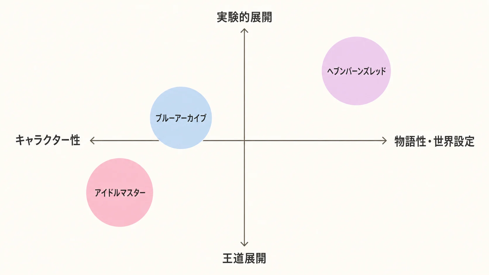
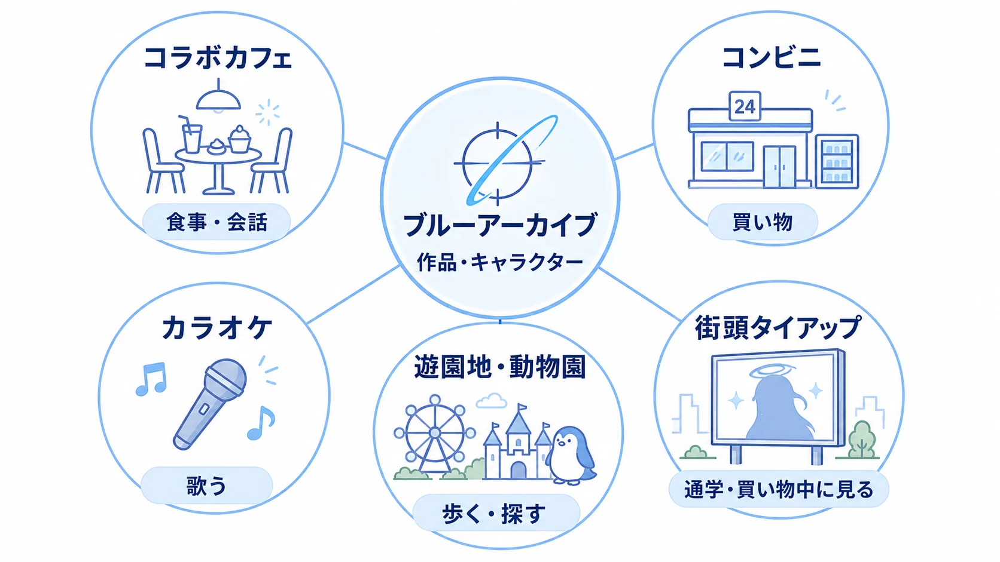
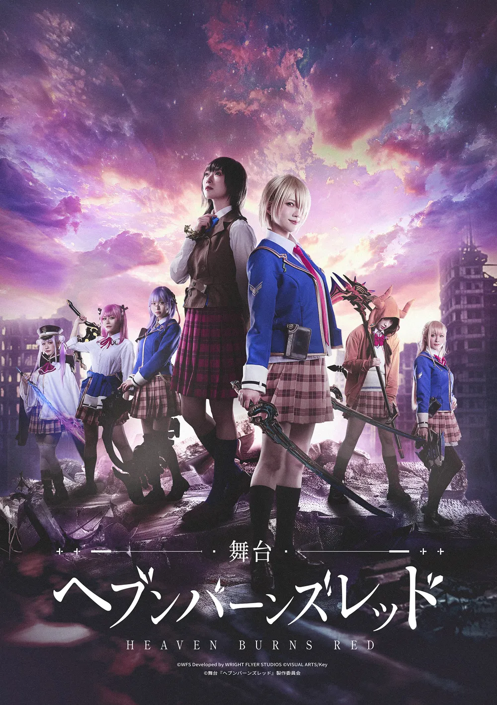
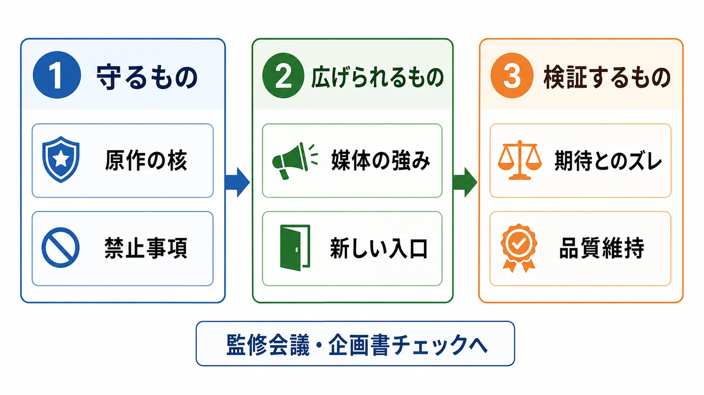

# CEDEC2026予習：ゲーム発オリジナルIPのメディアミックス展開に見る企画論点――『アイドルマスター』『ブルーアーカイブ』、そして『ヘブンバーンズレッド』

ゲームのメディアミックス展開を考えるとき、最初に整理しておきたいのは「誰が最終的に決めるのか」という点である。通常、アニメ化、舞台化、商品化、イベント化などの大きな方針は、ゲームプランナーが単独で決めるものではない。プロデューサーやIPホルダーの事業戦略部門、ライセンシング部門、あるいはそれらを横断する経営判断が、契約、投資、ブランド管理、パートナー選定を含めた最終意思決定を担う。

一方で、プランナーが関与できる接点は大きい。日々、原作のキャラクター性、物語の温度、遊びの前提、ファンが期待する振る舞いを具体的に扱っているからである。プランナーの役割は、メディアミックスの可否を最終決裁することではなく、原作の何を守るべきか、何なら形を変えて広げられるかを、企画の言葉に翻訳して示すことにある。

本稿は、2026年7月24日にCEDEC2026で予定されているWFS（ライトフライヤースタジオ）のセッション「ゲームにおけるメディアミックス展開との向き合い方―『ヘブンバーンズレッド』のメディアミックス企画の立て方―」の予習記事である。CEDEC2026は2026年7月22日から24日に開催される予定である。[[1](#ref-1)] 公開概要では、ASMRや舞台化といった手法による新規層の獲得と、世界設定・物語性を重視したIPのメディアミックスで生じるハードルの解消が紹介されている。[[2](#ref-2)]

ただし、ここで扱うのは『ヘブンバーンズレッド』だけの正解ではない。国内オリジナルIPには、キャラクター、シナリオ、音楽、世界設定、参加感など、異なる核がある。核が違えば相性のよい展開手法も変わる。本稿では、『アイドルマスター』『ブルーアーカイブ』『ヘブンバーンズレッド』を、異なるメディアミックスの実践パターンとして比較する。

***

## 1. メディアミックスの決定権と、プランナーの接点

メディアミックスとは、一つのIP（知的財産）をゲーム、アニメ、音楽、舞台、出版、商品、イベントなど複数の媒体へ展開することである。媒体を増やすこと自体が目的ではなく、接点ごとに異なる体験を設計し、IPとの関係を深めたり、新しい入口を作ったりすることが目的になる。

この判断には、少なくとも次の論点が含まれる。

- どの会社がどの権利を持ち、誰が許諾できるのか
- 新規事業としてどの程度の費用と期間を許容するのか
- 原作ゲームの運営やアップデートと、派生展開のスケジュールをどう合わせるのか
- 作品のブランドを守るため、どこに監修と拒否権を置くのか
- 売上だけでなく、認知、継続率、来場、楽曲再生、ファン同士の交流をどう評価するのか

そのため、最終的な意思決定権は通常、ゲームの一担当者ではなく、プロデューサーやIPホルダーの事業戦略・ライセンシング部門にある。『アイドルマスター』の公式資料でも、シリーズをメディアミックス推進プロジェクトとして扱い、IP軸の戦略やパートナーとの展開を組織的に進めていることが確認できる。[[3](#ref-3)]

では、プランナーは何をするのか。実務では、次の三つを準備することが重要である。

1. **守るもの**：キャラクターの価値観、物語の前提、禁止事項、ファンが「この人物らしい」と感じる行動を定義する。
2. **広げられるもの**：媒体が変わることで強くなる要素を選ぶ。音楽、声、身体表現、場所、触れる商品などが候補になる。
3. **検証するもの**：新規層には届くが既存ファンには別物に見える、というズレがどこで生じるかを仮説化する。

「アニメにするか」「舞台にするか」という媒体名から入るのではなく、「IPの核を別の体験へ翻訳できるか」から考えるのがプランナーの接点である。

*図：IPの核と展開手法の実験度から見た三事例の位置づけ。*

***

## 2. 比較の軸は、IPの核となる魅力である

メディアミックスの比較では、展開した媒体の数だけを数えると本質を見失いやすい。見るべきは、IPの魅力のうち何を別媒体へ移植したのかである。

| IPの核 | 相性のよい手法の例 | 企画上の確認点 |
|:--|:--|:--|
| キャラクターと歌・ダンス | ライブ、音楽商品、配信、舞台 | キャラクターの存在感を誰が、どの身体で表現するか |
| キャラクターの日常性 | コラボカフェ、店舗、交通、遊園地 | 日常の中で接触してもらう理由を作れているか |
| シナリオと感情の起伏 | アニメ、朗読、舞台、音声作品 | 物語の順序や余白を変えても感情が保てるか |
| 音楽 | ライブ、カラオケ、配信、コンサート | 楽曲単体でも入口として機能するか |
| 世界設定と参加感 | 周遊イベント、展示、XR、謎解き | ファンが「見る」だけでなく「関わる」導線になっているか |

この表は媒体の優劣を示すものではない。たとえばキャラクターの声と距離感が核なら、映像を豪華にするより、音声の近さを設計したほうが適切な場合がある。逆に、歌唱と集団の熱量が核なら、ライブは単なる宣伝イベントではなく、作品の中心体験になりうる。

***

## 3. 事例A：『アイドルマスター』――キャラクターと声優のライブパフォーマンス

### 3-1. ゲームから「PROJECT IM@S」へ

『アイドルマスター』は2005年7月にアーケードゲームとして稼働を開始した。プレイヤーが芸能事務所のプロデューサーとなり、アイドルを育成する構造を持った作品である。[[4](#ref-4)]

初期からゲーム外への広がりが意識されていたことは、2006年の1st ANNIVERSARY LIVEにも表れている。公式の記録では、キャラクターを演じる声優がステージに登場し、ミニドラマを挟みながら楽曲を披露している。[[5](#ref-5)] ここで重要なのは、ライブが単なる声優イベントではなく、キャラクターの物語と楽曲を、現実の身体と声で再演する場になっている点である。

その後、シリーズはゲーム、アニメ、CD、ライブ、商品などを連動させる「PROJECT IM@S」として拡大した。2022年12月に発表された「PROJECT IM@S 3.0 VISION」では、2025年のシリーズ20周年とその先を見据え、「アイドルプロデュース体験」と複合現実を組み合わせ、アイドルたちの活動の幅を広げる方針が示されている。[[3](#ref-3)]

### 3-2. 6ブランド体制と、王道パターンの強さ

2024年の20周年イヤー告知では、6ブランドから総勢18名のアイドルが参加する企画が案内された。[[6](#ref-6)] 現在の『アイドルマスター』は、単一のゲーム作品が複数媒体へ展開するというより、複数ブランドが共通のシリーズ文脈を持ちながら、それぞれの入口とファン層を形成する構造に近い。

この事例を「キャラクター＋声優のライブパフォーマンス」を軸にした王道パターンと呼べる理由は、媒体が変わっても核が比較的ぶれにくいからである。キャラクターの歌、台詞、関係性、成長を、楽曲とステージ演出に変換できる。さらに、声優がキャラクターの役名と文脈を背負って登壇することで、ゲーム内の存在と現実のイベントが連続する。

ただし、王道であることは簡単であることを意味しない。ブランド数が増えるほど、楽曲、衣装、出演者、ライブ構成、作品設定の整合性を管理する必要がある。プランナーが見るべきなのは、ステージに何を足せるかだけではない。何を足すとキャラクターの成長や関係性が伝わり、何を足すと単なる演目の羅列になるのかである。

***

## 4. 事例B：『ブルーアーカイブ』――日常への浸透で接点を増やす

### 4-1. アニメ化だけに依存しない入口

『ブルーアーカイブ』は2024年4月にテレビアニメの放送・配信が始まった。公式サイトにはテレビ東京系列などでの放送開始日と、2024年4月7日からの配信情報が掲載されている。[[7](#ref-7)] アニメ化は作品を一度に広く見せる強い手法だが、放送期間と視聴習慣に依存する面もある。

同作の特徴は、アニメ化の前後を含めて、ファンが作品へ触れる場所を生活圏に増やしてきた点にある。2024年の3周年特設サイトでは、秋葉原の街頭フラッグやガイドマップを使ったタイアップ、アニメイトカフェでのコラボメニューとオリジナルグッズが告知されている。[[8](#ref-8)]

さらに、コンビニエンスストアではローソンで一番くじや限定グッズが展開され、[[9](#ref-9)] カラオケではJOYSOUND直営店でコラボルーム、コラボドリンク、オリジナルグッズが実施された。[[10](#ref-10)] 直近では、Yostarの公式記事が東武動物公園とのコラボについて、遊園地・動物園・物販・スタンプラリー・フードを組み合わせた内容を紹介している。[[11](#ref-11)]

これらは、作品を一度深く読ませる展開とは異なる。「通学や買い物の途中で見かける」「友人とカフェへ行く」「カラオケで楽曲を歌う」「施設を歩きながらキャラクターを探す」といった、日常の行動に作品との接点を差し込む展開である。

### 4-2. 「日常への浸透」は何を解決するのか

この方向性は、作品をまだ知らない人への認知だけでなく、既存ファンの接触頻度を高める効果も持つ。ゲームを毎日遊ぶほどではない人でも、店舗や施設でキャラクターを見れば、作品を思い出せる。ファンにとっては、ゲーム内の学園や生徒が、自分の生活圏へ一時的に出てきたように感じられる。

ただし、リアルコラボは場所を借りれば成立するものではない。コラボ先の利用動機とIPの魅力が接続していなければ、描き下ろしイラストを貼っただけで終わる。カフェなら会話や食事、カラオケなら歌唱、遊園地なら周遊や発見というように、場所が本来持つ行動とキャラクター性を組み合わせる必要がある。

*図：生活圏の行動に作品接点を増やす「日常への浸透」の整理。*

***

## 5. ASMRは『ヘブンバーンズレッド』固有の発明ではない

CEDEC2026の公開概要を読む際に、明確に区別しておきたい点がある。ASMRコンテンツの商品化は、『ヘブンバーンズレッド』固有の手法ではない。

Yostarが展開する『ブルーアーカイブ』では、2022年4月時点でキャラクター別のASMR作品が公式に商品化されていた。[[12](#ref-12)] さらに、finalとのコラボレーションによる『ブルーアーカイブ』ASMRイヤホンも展開されており、音声作品だけでなく、ASMRを聴く行為そのものを商品体験へ接続している。[[13](#ref-13)]

ASMRは、音の近さや呼びかけによって、キャラクターとの一対一の距離感を作りやすい。したがって、キャラクター性や声の魅力を核に持つIPとは相性がよい。一方で、商品化に向くからといって、どのIPでも同じ成果が得られるわけではない。キャラクターが何を話すのか、誰に向けて話すのか、ゲーム本編の時間軸とどう関係するのかが、体験の信頼性を左右する。

この前提に立つと、CEDEC2026のセッションで語られる『ヘブンバーンズレッド』の独自性は、「ASMRを初めて使ったこと」にはない。業界で先行していたASMR活用の潮流に、世界設定・物語性を重視するIPとして舞台化を組み合わせ、新規層へ届く入口を設計した点にあると整理できる。

***

## 6. 事例C：『ヘブンバーンズレッド』――物語性の強いIPを別の体験へ翻訳する

『ヘブンバーンズレッド』は、WFSとKeyが関わるスマートフォン向けRPGであり、物語とキャラクターの感情体験が大きな魅力を担う作品である。物語性を重視したIPは、メディアミックスの自由度が高いように見えて、実際にはハードルも高い。

たとえば、ゲームではプレイヤーが操作し、選択し、長い時間をかけてキャラクターを知る。アニメなら編集された映像、舞台なら俳優の身体、ASMRなら声と音の距離へ、同じ魅力を翻訳しなければならない。媒体を変えるほど、物語のテンポ、視点、情報量、キャラクターの解釈が変わるためである。

公式サイトでは、2025年11月1日から9日まで東京ドームシティ シアターGロッソで舞台版を上演することが告知された。[[14](#ref-14)] これは、作品の物語を舞台上の身体表現へ移す試みである。CEDEC2026の公開概要は、ここにASMRを組み合わせ、新規層の獲得と、物語性の強いIPにおけるメディアミックスのハードル解消を扱うものだと示している。[[2](#ref-2)]

*出典：[舞台「ヘブンバーンズレッド」公式サイト](https://officeendless.com/sp/hbr_stage/)（©WFS Developed by WRIGHT FLYER STUDIOS ©VISUAL ARTS/Key / ©舞台『ヘブンバーンズレッド』製作委員会）*

ただし、舞台でどのエピソードをどう再構成したのか、ASMRをどの顧客層へどう届けたのか、企画会議でどんな評価指標を使ったのかは、講演本編で語られる予定の内容である。本稿では、そこを推測で補わない。現時点で言えるのは、ASMRによる近距離のキャラクター体験と、舞台による集団的・身体的な物語体験を組み合わせた点が、他の事例と比較するうえで重要だということである。

***

## 7. 三つの事例から見える企画論点

### 7-1. 定番展開と、IPの核を一致させる

アニメ化、グッズ、ライブは、メディアミックスの定番である。しかし、定番だから採用するのではなく、IPの核との一致を確認する必要がある。

- 『アイドルマスター』では、歌うキャラクターと声優のライブパフォーマンスが、IPの参加感を直接拡張する。
- 『ブルーアーカイブ』では、キャラクターの日常性を、カフェ、店舗、カラオケ、施設へ持ち出すことで接点を増やす。
- 『ヘブンバーンズレッド』では、物語と感情の体験を、声の近さと舞台上の身体へ翻訳する組み合わせが焦点になる。

同じ「ライブ」でも、歌唱が中心なのか、物語の再演が中心なのかで設計は変わる。同じ「グッズ」でも、所有する記念品なのか、音声を聴くための装置なのかで、必要な監修と体験設計は変わる。

### 7-2. IP供給過多の中で、何を入口にするか

IPやコラボ企画が多い環境では、「アニメ化した」「カフェを開いた」という事実だけでは差別化になりにくい。差別化は、媒体名ではなく、その作品でしか成立しない行動から生まれる。

プランナーは、企画書に「新規層を獲得する」と書くだけでなく、次のように具体化したい。

| 問い | 具体化の例 |
|:--|:--|
| 誰に届くのか | ゲームを知らない音楽ファン、舞台ファン、施設来場者など |
| 何が入口になるのか | 声、楽曲、キャラクターの日常、物語の一場面など |
| 入口から原作へどう戻るのか | 楽曲視聴、公式サイト、体験版、ゲーム内イベントなど |
| 既存ファンには何が残るのか | 新規描写、別解釈、参加感、収集、再訪する理由など |

「新規層へ届く」と「既存ファンが喜ぶ」は同じ施策で同時に達成できる場合もあるが、必ず一致するとは限らない。入口を広げる施策と、ファンの理解を深める施策を分けて設計するほうが、評価しやすい場合もある。

### 7-3. 新規層と既存ファンの期待をどう両立するか

メディアミックスの難しさは、新規層には説明が足りず、既存ファンには説明が多すぎるという問題が同時に起こる点にある。新規層はキャラクターを知らない。既存ファンは、知っているからこそ、台詞の一つや衣装の一部に意味を見いだす。

対策として、原作の前提をすべて詰め込むのではなく、媒体ごとに「初見でも理解できる最小限」と「ファンが発見できる深い層」を分ける方法がある。表層は独立した入口として成立させ、深層には原作を知るほど見える関係性や伏線を置く。ただし、後付けの謎解きに見えないよう、原作側の監修と企画側の説明責任が必要である。

***

## 8. プランナーが提案を評価するための実務視点

メディアミックス提案を受けたとき、企画職が確認したいのは「有名な媒体か」だけではない。次の観点を、企画書や監修会議のチェック項目に落とし込むとよい。

### 原作のどの要素なら、形を変えても壊れないか

キャラクターの口調、価値観、関係性、物語の前提、楽曲のテーマ、プレイヤーの役割を分解する。そのうえで、媒体変更によって変えてよい層と、変えると別人になる層を分ける。

たとえば声の距離を変えるASMRでは、情報量を減らしてもキャラクターの親密さが残るかが重要になる。舞台化では、ゲームの操作を俳優の身体や観客の視線へ置き換えたとき、主人公と仲間の関係が伝わるかを確認する。

### ファンの期待とのズレは、どこで生まれやすいか

ズレは、設定の間違いだけで生まれるわけではない。次の箇所でも発生する。

- キャラクターが本来しない言い方をする
- 原作では積み重ねが必要な感情を、短時間で成立させる
- ファンが参加者である作品を、受け手だけの作品に変える
- 新規層への説明を優先し、既存ファンが大切にしてきた余白を消す
- コラボ先の都合で、キャラクターの行動理由が弱くなる

このズレを防ぐには、「原作らしいか」という感覚論を、台詞、行動、視点、時間軸、ファンの参加位置といった項目へ分解することが有効である。

### 企画を通した後、誰が品質を守るのか

メディアミックスは、企画決定後の監修と運用も長い。描き下ろし一枚、録り下ろし音声、イベント限定台詞、会場導線、販売ページの説明文まで、IPの印象を変える要素になる。プランナーは、監修者を置くことだけでなく、何を基準に戻し、どの差分なら許容するのかを文書化しておきたい。

ここで求められるのは、すべてを原作と同じにすることではない。媒体の特性を活かした新しさを認めつつ、変えてはいけない核を守ることである。

*図：メディアミックス企画を評価するための三段階チェック。*

***

## 9. CEDEC2026で確認したい問い

7月24日のWFSセッションを聴く際には、単に「ASMRと舞台化が成功したか」を聞くのではなく、次の問いを持っていると理解が深まる。

- 新規層は、どの接点から作品へ入る想定だったのか
- ASMRと舞台化で、それぞれどのIP要素を担当させたのか
- 世界設定・物語性の強さが、企画の制約になった場面は何か
- その制約を、媒体固有の魅力へどう変換したのか
- 既存ファンの期待を、企画初期にどう把握したのか
- 成果を認知、販売、来場、視聴、ゲーム内行動のどこで測ったのか

講演前の情報からは、企画の細部や成果を断定できない。だからこそ、当日は「どの媒体が正解だったか」ではなく、「IPの核をどのように分解し、誰に届く体験へ翻訳したか」に注目したい。

***

## おわりに

『アイドルマスター』は、キャラクターと声優のライブパフォーマンスを長期的なシリーズ構造へ育てた。『ブルーアーカイブ』は、アニメ化だけに依存せず、カフェ、店舗、カラオケ、施設など日常の接点を高密度に増やしている。『ヘブンバーンズレッド』についてCEDEC2026で紹介されるASMRと舞台化の組み合わせは、ASMR活用の先行例を踏まえながら、物語性の強いIPを異なる身体・音声体験へ翻訳する実践として位置づけられる。

三つの事例に共通するのは、媒体を増やしたことではなく、IPの核に合わせて接点の設計を変えたことである。メディアミックスの最終判断は、プロデューサーやIPホルダーの事業戦略・ライセンシング部門にある。しかし、その判断の質を高めるために、プランナーは原作のどこを守り、どこを広げられるかを具体化できる。

CEDEC2026当日のセッションは、『ヘブンバーンズレッド』単独の事例として聞くより、国内オリジナルIPが積み重ねてきた先行パターンの中に置いて聞くほうがよい。キャラクター、音楽、日常性、物語、世界設定のどれを核にするのか。その核を別媒体へ移すとき、何を変え、何を変えないのか。そこに、ゲームプランナーがメディアミックスへ関与するための実務的な論点がある。

## References

1. [開催概要｜CEDEC2026][1] - CEDEC2026の会期、会場、開催形式を示す公式ページ。

2. [タイムテーブル／セッション一覧｜CEDEC2026][2] - WFSのセッションを含むCEDEC2026の公式セッション一覧。講演前に公開されている概要を確認するためのページ。

3. [「アイドルマスター」シリーズ初のカンファレンス「PROJECT IM@Sカンファレンス」開催！][3] - PROJECT IM@Sをメディアミックス推進プロジェクトとして説明し、2022年発表の3.0 VISIONを紹介する公式発表。

4. [「アイドルマスター」アイドルプロデュース体験ゲーム 7月から稼動開始][4] - 『アイドルマスター』が2005年7月にアーケード向けゲームとして開始したことを示す当時の公式発表。

5. [765プロ通信 第2号][5] - 2006年の1st ANNIVERSARY LIVEについて、キャラクターを演じる声優の登壇、ミニドラマ、楽曲披露を記録した公式資料。

6. [「アイドルマスター」特別生配信 19th→20th Special Party!!!!!! お知らせまとめ][6] - 20周年イヤー企画における6ブランド、総勢18名の参加とシリーズ横断企画を紹介する公式ページ。

7. [ONAIR｜ブルーアーカイブ The Animation][7] - 2024年4月7日からのテレビ放送・配信情報を掲載する公式サイト。

8. [ブルーアーカイブ 3周年記念特設サイト][8] - 秋葉原でのタイアップ、アニメイトカフェとのコラボ、メニュー・グッズ展開を紹介する公式特設サイト。

9. [大人気ゲーム『ブルーアーカイブ』が一番くじに初登場！][9] - 2024年のローソンでの一番くじ展開を紹介する公式ページ。

10. [ブルーアーカイブ -Blue Archive- × JOYSOUND直営店コラボキャンペーン][10] - コラボルーム、コラボドリンク、オリジナルグッズを展開した公式キャンペーンページ。

11. [『ブルーアーカイブ × 東武動物公園』コラボイベント開催！][11] - Yostar公式メディアによる、遊園地・動物園でのコラボフード、グッズ、スタンプラリーなどの紹介。

12. [「ブルーアーカイブ ノノミASMR～ほのかな体温を感じる距離～」プレスリリース][12] - 2022年4月に発表された『ブルーアーカイブ』キャラクターASMR作品の商品化情報。

13. [『ブルーアーカイブ』ASMRイヤホンに第2弾][13] - 『ブルーアーカイブ』ASMRとfinalのイヤホンを組み合わせたコラボ商品を紹介するプレスリリース。

14. [ヘブンバーンズレッド 3.5周年特設サイト][14] - 2025年11月の舞台『ヘブンバーンズレッド』上演決定を告知した公式特設サイト。

[1]: https://cedec.cesa.or.jp/2026/outline/
[2]: https://cedec.cesa.or.jp/2026/timetable/
[3]: https://www.bandainamcoent.co.jp/corporate/press/top/single.html?q=xaXDQ6wFG
[4]: https://www.bandainamcoent.co.jp/corporate/press/namco/51/51-019.pdf
[5]: https://www.bandainamcoent.co.jp/corporate/bnours/vol02/pdf/02_19_21.pdf
[6]: https://idolmaster-official.jp/news/01_11525
[7]: https://sh-anime.shochiku.co.jp/bluearchive-anime/onair/
[8]: https://3rd-anniversary.bluearchive.jp/
[9]: https://www.lawson.co.jp/lab/entertainment/art/20240123_kujibluearchive.html
[10]: https://shop.joysound.com/campaign/bluearchive/
[11]: https://plus.yostar.co.jp/26_tobuzoo_ba/
[12]: https://media.vivion.jp/dev/public/uploads/20220413_ASMR_press.pdf
[13]: https://media.vivion.jp/public/uploads/1752734878827_20250719_BAe2_press.pdf
[14]: https://heaven-burns-red.com/3-half-anniversary/

----

この文書は、Perplexity、Claude、OpenAI Codex の3つのAIの支援を受けて著述されたものです。引用画像を除き、MIT License にて提供されています。
