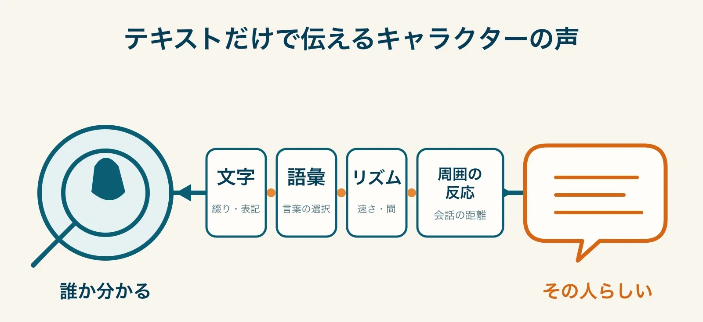
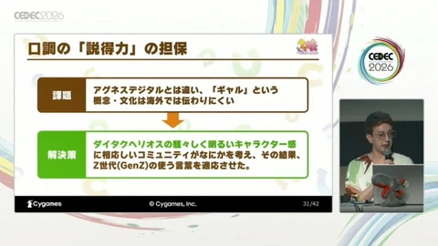
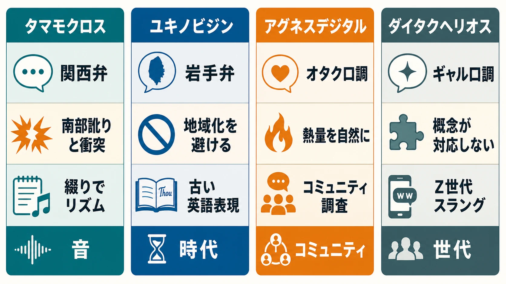
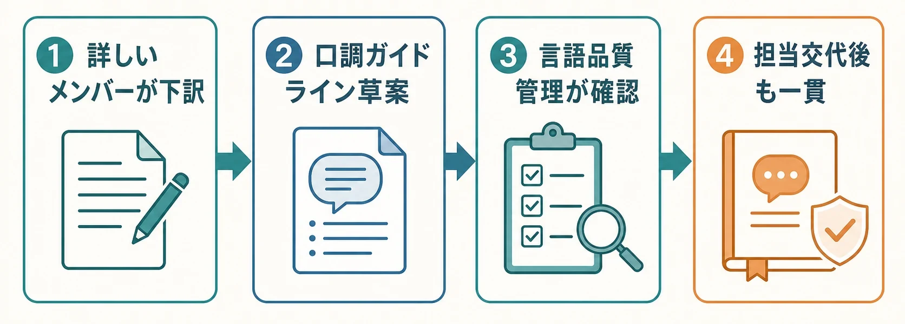

# CEDEC2026フォローアップ：音声なしでキャラクターを再創造する――『ウマ娘』英語版に学ぶ、テキストだけの創造的ローカライズ

「あなたは優秀です。これは贈り物です」とだけ読んでも、誰が話しているのかは分からない。ところが、笑い方や古風な語尾、贈り物を渡す場面を思わせる言い回しが加われば、サンタクロースらしい人物像は姿を見せる。CEDEC2026のCygames講演は、この喩えから始まった。意味が同じ台詞でも、 **話し方のシルエット** が変われば、読み手が受け取る人物は変わるのである。[[1](#ref-1)]

2026年7月24日、CEDEC2026の3日目に、Cygamesローカライゼーション部の英語翻訳者Allison Cottrell氏と英語コーディネーター森田竜平氏は、『ウマ娘 プリティーダービー』英語版における方言・口調のローカライズを題材に、この難題への取り組みを紹介した。[[1](#ref-1)][[2](#ref-2)] 英語版は2025年にリリースされ、初期リリース時には英語ボイスがなかった。つまりプレイヤーへキャラクターの声を届ける媒体は、まずテキストだった。[[3](#ref-3)]

これは声優キャスティングや多言語音声収録を扱う[『声優キャスティングとローカライズ収録の実務』](voice-casting-and-localized-recording-guide.md)とは異なる問題である。また、[CEDEC2026最終日のレポート](cedec2026-day3-recap-garage-ai-npc-prototyping-120fps.md)で扱ったWovn×MIXIのAIローカライズが翻訳・LQAの自動化を中心に据えるのに対し、本稿の焦点は、音声に頼れない条件で翻訳者が文字列を通じてキャラクターの個性を **再創造する** 技法にある。

***

## ローカライズの評価軸は「分かる」と「信じられる」

講演で示された軸は二つである。ひとつは **Recognizability（ひと目でそのキャラクターだと分かること）**、もうひとつは **Authenticity（その人物が実在しそうだと感じられる実在感・説得力）** である。[[1](#ref-1)][[3](#ref-3)]

Recognizabilityだけを急ぐと、特徴を大きく誇張した記号的な話し方になりやすい。反対にAuthenticityだけを追うと、対象言語としては自然でも、原文の人物らしさが薄まる。音声がない以上、アクセントや声質で補うこともできない。読者が画面上の綴り、語順、句読点、語彙の選択から、その人物を認識し、しかも「この人ならこう話す」と納得できる状態を、同時に作らなければならない。

*図：文字、語彙、リズム、周囲の反応を通じて、テキストがキャラクターの「誰か分かる」と「その人らしい」を両立させる。*

重要なのは、これを「日本語の方言を英語の方言へ一対一で置き換える作業」と捉えないことである。方言が担っている機能は、出身地の表示だけではない。テンポ、親しみ、年齢感、周囲との距離、知性や勢いの見え方まで含む。原文の表面ではなく、キャラクター設計のなかでその話し方が果たす役割を切り出し、対象言語で別の材料から組み立てる必要がある。

***

## 4人の事例――課題から「話し方のシルエット」を作る

### タマモクロス：定石の方言変換が設定と衝突する

**課題**：関西弁を米国南部の訛りへ移すことは、ローカライズで使われてきた定石のひとつである。しかし『ウマ娘』には、米国南部出身で南部訛りを話すタイキシャトルがいる。タマモクロスにも同じ対応をすれば、二人の出自や口調の役割が重なり、キャラクターの区別だけでなく作品内の設定まで歪めかねない。[[1](#ref-1)]

**アプローチ**：チームは地域方言への置換を採らず、関西弁のリズム、速さ、音の響きを分析した。崩した発音を英語の綴りで視覚的に示し、台詞を声に出した際のテンポも確認して、文字の並びから勢いが感じられる表現を組み立てた。[[1](#ref-1)]

**結果**：読者は特定地域の英語話者としてではなく、速く歯切れよく話すタマモクロスとして台詞を読める。これは「関西弁だから南部訛り」という対応表より、方言がキャラクターにもたらす機能を優先した結果である。発注側にとっての教訓は明快だ。定石があっても、対象作品内に同じ記号をすでに背負う人物がいないかを、設定表と照らして確かめる必要がある。

### ユキノビジン：地図ではなく時代感から素朴さを作る

**課題**：岩手弁を話すユキノビジンの素朴さを、現代英語の特定地域方言へ直結させると、原文にない地域的な連想を強く与えるおそれがある。方言が抜けないという特徴を保ちつつ、英語圏の読者にも自然に受け取らせる必要があった。[[1](#ref-1)]

**アプローチ**：ここでは地理を移す代わりに、言葉遣いの時代感を使った。1930年代から1960年代に使われた、やや古風な英語表現やスラングを採り入れ、現代の特定地域の方言には寄せなかった。[[1](#ref-1)]

**結果**：若いキャラクターが使う言葉として少し懐かしく、素朴に響く口調を作れた。重要なのは、古い言葉をそのまま飾りとして置くことではない。現代英語として読める範囲を保ちながら、人物の育ちを想像させる語彙を選ぶことで、Authenticityを確保する。翻訳者の個人的な言語感覚が出発点になっても、採用後はなぜその語彙が人物らしさに寄与するかを説明できる形にしておくべきである。

### アグネスデジタル：高いテンションを「実在するコミュニティの言葉」へ寄せる

**課題**：オタク的な口調を、感嘆符や大文字を増やして単に高テンションにするだけでは、誰でも言える台詞になってしまう。アグネスデジタルの高揚は、対象への知識、距離感、言葉選びの細部と結び付いている。[[1](#ref-1)]

**アプローチ**：英語圏のオタクコミュニティで、興奮している人が実際に使う表現をリサーチし、口調へ取り入れた。翻訳者が「オタクらしさ」を外側から模倣するのではなく、その言語圏のコミュニティにある用法を調べて素材にしたのである。[[1](#ref-1)]

**結果**：情報量や熱量を増幅するだけでは得にくい、「この人物が本当にその界隈にいる」感じが生まれる。ここでのAuthenticityは、文法の正しさだけを指さない。実在する話者がどのように熱中を表すかを理解し、キャラクターの熱量と接続できていることを指す。もっとも、コミュニティ由来の言葉は変化も早い。採用時の根拠、避けるべき用法、更新を判断する担当を、口調ガイドラインに残しておくことが重要になる。

### ダイタクヘリオス：「ギャル」を別の文化の若者として設計し直す

**課題**：「ギャル文化」は英語圏にそのまま対応する概念があるわけではない。日本語のギャル語を語ごとに置換しても、なぜその人物が読みにくく、周囲との会話に独特の距離感が生まれるのかまでは伝わらない。[[3](#ref-3)]

**アプローチ**：チームは、もしダイタクヘリオスが英語ネイティブならどのコミュニティにいて、どんな話し方をするかを考え、Z世代のスラングを用いる人物として再定義した。講演では具体例として「Let her cook（いいよそのままで、続けて）」のような最新のスラングが挙げられ、周囲が一瞬戸惑うほどの距離感まで含めて表現したことが紹介されている。[[1](#ref-1)]

*引用画像：ダイタクヘリオスの口調をZ世代の言葉として再定義する講演スライド。*

出典：[GAME Watch「Umazing！『ウマ娘』英語版では方言や口調をいかに再現したか。従来と異なるアプローチのローカライゼーションとは【CEDEC2026】」](https://game.watch.impress.co.jp/docs/news/2127676.html)（Impress Corporation）

**結果**：再現されたのは流行語の一覧ではなく、発言の内容が周囲にすぐ伝わりにくいという会話上の機能である。本人の発話だけを「格好よい若者言葉」にするのでは足りない。相手がどう受け取り、どのように間が生じるかまで書くことで、キャラクター間の関係を含めたRecognizabilityが成立する。

この事例は、文化固有のラベルを安易に輸出しないための問いを示す。「原文の分類名を何と訳すか」ではなく、「この人物を初めて見た対象言語のプレイヤーに、どのような社会的な距離と反応を感じてほしいか」を先に決めるのである。

*図：地域方言へ直訳せず、音・時代・コミュニティ・世代という別の軸から口調の役割を再構成した4事例。*

***

## 閃きを担当者だけのものにしない

こうした表現は、優れた翻訳者ひとりの閃きで終わると危うい。運営型ゲームでは追加シナリオが続き、担当者も変わり得る。新しい担当が「前の訳文に似せる」だけでは、口調は徐々に記号化したり、更新できなくなったりする。

講演で紹介された体制では、たとえばアグネスデジタルの担当でオタク用語に詳しいメンバーを最初の下訳に起用したように、キャラクターや関連文化に詳しいメンバーを起点に方向性を固めていた。その担当者が注意点をまとめた口調ガイドラインのドラフトを作り、言語品質管理チームが校正・確認を行う。これにより、担当交代後にも一貫性を保つ基準を共有する。[[1](#ref-1)]

*図：専門性のある下訳、ガイドライン草案、言語品質管理、継続運用をつなぐ工程。*

さらに、業務外の雑談も投稿できる社内コミュニケーションチャンネルを設け、表現の試行を促した。その場から生まれた「Umazing」という造語は、講演時点でも使われ続けている例として挙げられた。[[1](#ref-1)] これは雑談を成果物として強制する話ではない。評価されるべき案だけが出る場ではなく、未完成の言い回しを出し、知識を持つ同僚が文脈を足せる場を維持することが、創造的な翻訳の母体になるという示唆である。

英語版『ウマ娘 プリティーダービー』は、The Game Awards 2025のBest Mobile GameでWinnerとして掲載されている。[[4](#ref-4)] これは作品全体が海外で受け入れられたことを示す一つの証左であり、ここで紹介した口調ローカライズの技法単体の効果を切り分けて証明するものではない点は踏まえておきたい。

***

## プランナー・発注側が上流で渡すべきもの

翻訳会社や社内ローカライゼーションチームへ「自然な英語にしてほしい」とだけ渡しても、今回のような判断はできない。発注側が用意する資料は、翻訳作業を早くするためだけでなく、定石とキャラクター設計の衝突を発見するためにある。

| 渡すべき情報 | 口調ローカライズでの使い道 | 不足した場合に起きること |
|---|---|---|
| 人物の出自、年齢感、他者との関係 | 方言・語彙が担う機能を特定する | 言葉の特徴だけが過度に一般化される |
| 口調表と台詞の優先順位 | 崩してよい表面と、守るべき人物像を分ける | 「自然さ」と「らしさ」の判断が属人的になる |
| 類似する話し方をするキャラクター一覧 | 方言変換が設定と重なることを事前に検出する | タマモクロスとタイキシャトルのような衝突を後から直す |
| 会話の前後と相手の反応 | 読みにくさ、親密さ、戸惑いまで表現する | 主人公だけが目立ち、関係性が失われる |
| 更新予定と担当範囲 | 口調ガイドラインを保守可能にする | 追加コンテンツで表現がぶれる |

発注時には、口調表を「語尾の一覧」にしない方がよい。キャラクターごとに、少なくとも次のような問いへ答えられる資料にしたい。

- この人物は、初対面の読者にどのような印象を残すべきか。
- その話し方は、出身地、年齢、所属、趣味、相手との距離のうち何を示しているか。
- ほかの人物と混同させてはならない特徴は何か。
- 周囲はその話し方をどう受け取り、どの反応を返すか。
- 対象言語で一対一の対応が見つからない場合、何を残し、何を作り替えてよいか。

翻訳テストも、意味が合っているかだけで完了にしない。音声がない製品なら、担当外の人が台詞だけを読んで人物を識別できるか、相手の返答を含めて関係性が分かるかを確認する。これは翻訳チームだけに品質責任を預ける試験ではない。設定、シナリオ、ローカライズ、品質管理が同じ人物像を参照できているかを確かめる試験である。

***

## 定石を知り、設計に従って外す

今回の講演がプランナーやディレクターへ示したことは、次の三点に整理できる。

第一に、方言を別言語の方言へ変換するような定石は、便利であっても自動的な正解ではない。キャラクターの出自やほかの人物との対比に照らさなければ、翻訳は人物設計そのものと衝突する。タマモクロスの例は、定石を知ったうえで、何を保存すべきかを選び直した例である。

第二に、翻訳の質は発注側が上流でどれだけ人物情報を渡せるかに左右される。口調、設定、相関、会話の前後、更新計画がそろって初めて、翻訳者は言葉を置換するのではなく、対象言語で人物を成立させられる。

第三に、個人の創造性は、ガイドラインとレビューの運用によって初めてチームの資産になる。最初の担当者の知識を尊重しつつ、根拠と注意点を残し、品質管理チームが検証できる形へする。この運用はローカライズに限らない。キャラクター設定、シナリオ、UI文言、ナラティブデザインなど、担当が変わっても「なぜこの表現なのか」を守りたい制作物すべてに応用できる。

ローカライズは、開発の最後で意味を別の言語へ移す工程ではない。テキストだけの画面であっても、プレイヤーが人物の声を頭の中に立ち上げられるようにする、創作工程である。サンタクロースの喩えが示すように、読者が「誰が話しているか」を一読で感じ取れるかどうかは、言葉の意味だけでは決まらない。だからこそ、発注側も翻訳チームも、台詞の背後にある人物の輪郭から共有する必要がある。

## References

1. [Umazing！ 「ウマ娘」英語版では方言や口調をいかに再現したか。従来と異なるアプローチのローカライゼーションとは【CEDEC2026】][1] - Cygamesによる講演の内容を報じ、4人のキャラクターの口調の設計とガイドライン運用を紹介している。

2. [CEDEC2026 セッション詳細][2] - 「『ウマ娘 プリティーダービー』英語版のキャラクターの方言や口調をローカライズするための創造的アプローチ」の公式セッションページ。

3. [電ファミニコゲーマー][3] - 英語版『ウマ娘 プリティーダービー』のリリースとローカライズを扱った記事。

4. [The Game Awards 2025 — Best Mobile Game][4] - 2025年のBest Mobile Game部門のWinner掲載ページ。

[1]: https://game.watch.impress.co.jp/docs/news/2127676.html
[2]: https://cedec.cesa.or.jp/2026/timetable/detail/s697c896ccdd26/
[3]: https://news.denfaminicogamer.jp/kikakuthetower/2607243f
[4]: https://thegameawards.com/winners/best-mobile-game

----

この文書は、Perplexity、Claude、OpenAI Codex の3つのAIの支援を受けて著述されたものです。引用画像を除き、MIT License にて提供されています。
