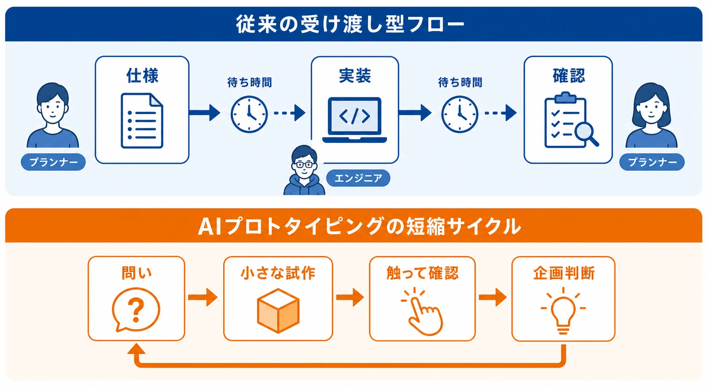
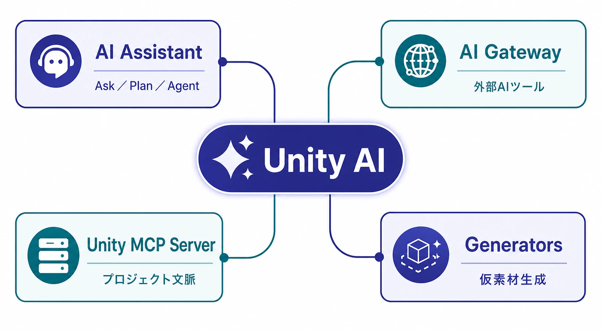
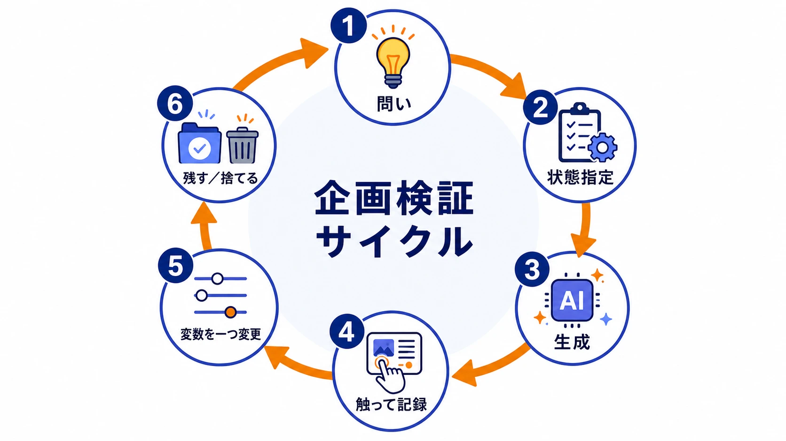
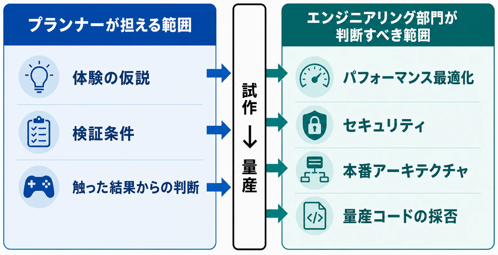

# CEDEC2026予習――Unity AIとバイブコーディングが変えるゲーム企画の検証工程

ゲームの企画は、企画書の中だけでは検証できない。敵がどの距離で反応するのか、数値を変えたときに手応えがどう変わるのか、画面遷移がプレイヤーの意図に沿うのか。最終的には、動くものを触って判断する必要がある。

これまで、この「動くもの」を用意する工程は、プランナーが仕様をまとめ、エンジニアが実装し、プランナーが確認するという受け渡しになりやすかった。Unity AIのようなゲームエンジン内蔵型のAIツールが普及すると、この間にある待ち時間を短くできる可能性がある。重要なのは、プランナーがエンジニアの仕事を置き換えることではない。検証用の小さな試作を自分で動かし、企画判断の材料を早く増やすことである。

*図：プランナーとエンジニアの受け渡しで待ち時間が生じる従来工程と、問いを小さな試作に変えて企画判断へ戻す短縮サイクルの比較。*

本稿は、2026年7月23日に行われるCEDEC2026の講演「Unity AIを活用したゲーム開発の実際」を聴講するための予習記事である。Unity Runtime Fee騒動や他エンジンとの選定比較、QA・デバッグ工程の実装論、生成AIと著作権法の詳細は扱わない。ここでは、Unity AIを使ったプロトタイピングと、ゲームデザインの検証工程にプランナーがどう関与できるかに焦点を絞る。

***

## 1. CEDEC2026講演の概要――公開情報から予習する

講演の基本情報は次のとおりである。

| 項目 | 内容 |
| --- | --- |
| 講演名 | Unity AIを活用したゲーム開発の実際 |
| 日時 | 2026年7月23日（木）13:20〜14:20 |
| 登壇者 | アドボケイト 高橋啓治郎氏 |
| 会場 | CEDEC講演 第11会場（パシフィコ横浜ノース 3F G314＋G315） |
| 公開されている概要 | Unity AIの機能構成と使用方法、Unity AIを活用して開発したゲームのプロトタイピング事例 |

Unity Japanの告知では、Unityの基礎知識があれば受講でき、AIエージェント活用の第一歩を踏み出したい開発者にも適した講演と説明されている。[[1](#ref-1)] ただし、公開情報だけでは、どのゲームをどの工程で試作したのか、生成物をどこまで作り直したのか、AIエージェントの運用上どこで行き詰まったのかまでは分からない。

したがって、この記事では講演内容を先取りして断定しない。公開済みの機能と、企画職がそこから考えられる検証工程を整理し、当日は実例の細部を照合するための問いを用意する。

***

## 2. Unity AIの現状――チャットボットではなくUnityプロジェクトに接続する道具群

Unity AIは、Unity Editorの中で動くAIツール群である。Unityの公式説明では、アクティブなプロジェクトのシーン、GameObject、コンポーネント、パッケージ、対象プラットフォームなどの文脈を参照し、質問への回答、コード生成、シーン編集などを行う仕組みとされている。[[2](#ref-2)]

2026年時点で、企画職が把握しておきたい機能群は次のように整理できる。

| 機能群 | できること | 企画検証との関係 |
| --- | --- | --- |
| AI Assistant | Unityの質問への回答、コード生成、シーンやコンポーネントの編集。Ask、Plan、Agentのモードを持つ | 挙動試作を作る前の相談から、試作の実行までを同じ画面で進められる |
| AI Gateway | ClaudeやGPTなど、利用者が選んだ外部AIツールをUnity Editorへ接続する窓口 | 既存のAI環境をUnityプロジェクトの文脈と組み合わせられる |
| Unity MCP Server | IDEや対応AIから、シーン状態、GameObject、コンポーネント、コンソールログなどを参照し、Editor操作につなぐ仕組み | Unityの外にあるAIツールからも、プロジェクトの状態を見ながら試作できる |
| Generators | スプライト、テクスチャ、アニメーション、音声、マテリアルなどを生成する機能 | 仮素材を待つ時間を短くし、遊びの確認に必要な画面や空間を作れる |

AI AssistantのAskは質問と調査、Planは複数手順の計画、Agentはコードやシーンを変更して処理を進めるモードである。Agentでは権限を読み取り専用、スクリプト作成まで、シーン変更までというように制限でき、変更の取り消しも可能とされている。[[2](#ref-2)] この権限設定は、プランナーが試作を行う際の安全柵として重要である。

*図：Unity AIを中心に、AI Assistant、AI Gateway、Unity MCP Server、Generatorsの4機能群を整理した構成。*

### 2-1. 2026年1月のBeta 2026で広がった生成対象

Unityは2026年1月12日、「Unity AI Beta 2026」を開始した。公式の告知では、従来からのスプライト、テクスチャ、アニメーション、音声、マテリアルに加え、次の生成機能が紹介されている。[[3](#ref-3)]

- **UI Toolkitレイアウト生成：** 自然言語からUXMLとUSSを生成し、プレビュー、編集、利用まで行う機能である。UXMLはUIの構造、USSは見た目の指定を記述するファイルである。
- **キューブマップ生成：** スカイボックスなどに使う、周囲を取り囲む画像を生成する機能である。
- **3Dメッシュとテクスチャ生成：** テキストや参照画像から、キャラクター、プロップ、環境オブジェクトなどの試作に使える3Dアセットを生成する機能である。

ここでの要点は、AIがコードだけでなく、コードが動くための仮素材やUIの外形まで作れることである。例えば「敵が近づくと警戒し、一定距離で攻撃する」試作に、仮の敵モデル、床、体力ゲージ、リトライボタンを同時に用意できれば、企画職は仕様書の文章だけでなく、操作感と情報の伝わり方を確認できる。

ただし、これらはBetaの機能である。Unityは、Unity AIの機能、挙動、提供状況が変更、制限、中止される可能性があると説明している。[[4](#ref-4)] 量産計画の前提にする前に、対象バージョン、利用条件、チームの利用権限を確認する必要がある。

***

## 3. プロトタイピングとバイブコーディングの接点

プロトタイピングとは、アイデアを早く動く形にして検証することである。完成品を作ることが目的ではなく、「このルールは面白さにつながるか」「この数値は難しすぎないか」「この導線で次の行動が分かるか」という問いに答えるための試作品を作ることである。

バイブコーディングは、自然言語による指示でAIにコードを書かせ、コードを一行ずつ深く読み込まずに、実行、観察、修正を繰り返す開発スタイルを指す。本稿では、この言葉を量産開発の方法論としてではなく、検証用プロトタイプを短い周期で更新する手段として扱う。

ここで「コードを深く読み込まない」とは、確認をしなくてよいという意味ではない。目的は、コードの美しさや長期保守性を評価することではなく、定めた検証項目に対して試作品が期待どおりに動くかを確かめることである。入力、期待結果、観察した問題を記録し、次の指示に反映する必要がある。

### 3-1. 企画職の検証サイクル

プランナーがAIツールを使う場合、次のようなサイクルが現実的である。

1. **問いを一つに絞る。** 例は「敵の接近警告は、攻撃予告として読めるか」である。
2. **最小限の状態を言葉で指定する。** 敵の移動速度、警戒距離、攻撃前の待ち時間、プレイヤーの回避手段を指定する。
3. **AIにコード、シーン、仮素材を生成させる。** 生成物は検証用の一時的なものとして扱う。
4. **Unity上で触り、観察結果を記録する。** 面白さ、分かりやすさ、数値の違和感を企画の観点から確認する。
5. **一つの変数だけを変えて再試行する。** 速度と攻撃力を同時に変えるのではなく、何が体験を変えたか追えるようにする。
6. **残すものと捨てるものを分ける。** 検証結果と判断理由は残し、試作コードは量産リポジトリへ無断で移さない。

このサイクルの価値は、プランナーがコードを書くこと自体ではない。問いを動く状態へ変換し、触った結果を次の企画判断に戻せる点にある。

*図：問いの設定から生成、Unity上での確認、変数変更、試作の整理までを反復する企画検証サイクル。*

***

## 4. 意思決定の境界――試作は企画、量産品質はエンジニアリング

AIによってプランナーが試作を作れるようになっても、量産コードの採用判断までプランナーの単独責任になるわけではない。ここを曖昧にすると、「動いたから本番に入れる」という危険な短絡が起きる。

| 論点 | 主にプランナーが担える範囲 | エンジニアリング部門が判断すべき範囲 |
| --- | --- | --- |
| 敵AIの挙動 | 接近、警戒、攻撃、退避などの体験を試す。反応の分かりやすさを確認する | 多数の敵を同時に動かしたときの負荷、ナビゲーション、同期、保守可能な設計を決める |
| 数値バランス | 体力、攻撃間隔、報酬量、クールダウンなどを変更し、手応えを比較する | データの持ち方、セーブ互換性、サーバー権威性、異常値への耐性を決める |
| UIフロー | 仮ボタン、画面遷移、エラー表示、確認ダイアログを作り、導線を触る | 本番UIのアーキテクチャ、入力方式、アクセシビリティ、端末別の性能と保守を決める |
| AI生成コード | 試作の挙動を確認し、必要な仕様や問題点を言語化する | 採用可否、コードレビュー、テスト、パフォーマンス、セキュリティ、アーキテクチャを決める |

プランナーが担当すべきなのは、体験の仮説を作り、検証条件を定め、触った結果から判断することである。パフォーマンス最適化、セキュリティ、本番アーキテクチャ、量産コードとしての採否は、エンジニアリング部門の意思決定領域である。

この境界は、プランナーの権限を狭めるためのものではない。むしろ、プランナーが技術品質の責任まで抱え込まず、検証速度という自分の価値を最大化するための分業線である。試作の段階で「敵が強い」「画面が分かりにくい」「報酬の間隔が長すぎる」と発見できれば、エンジニアが量産実装へ着手する前に企画を修正できる。

*図：プランナーが担う体験仮説・検証条件・操作結果の判断と、エンジニアリング部門が担う量産品質の判断を分ける境界。*

***

## 5. プランナーが実際に試せること

### 5-1. 簡易な敵AIの挙動試作

例えば、次のような検証であれば、プランナーがAI Assistantに指示して試作する価値がある。

- プレイヤーを見つけると、敵が警戒状態へ移行する
- 一定距離まで近づくと、攻撃前の予告モーションを出す
- プレイヤーが離れると、敵が追跡をやめて初期位置へ戻る
- 敵の数を増やしたとき、画面上の情報量が過剰にならないか確認する

ここで見るのは、経路探索アルゴリズムの正しさやフレームレートではない。警戒から攻撃までの間隔がプレイヤーに読めるか、逃げる選択肢が成立するか、敵の存在が画面上で把握できるかというゲームデザイン上の問いである。

### 5-2. 数値調整の即時反映

数値検証では、敵の体力を100、120、150と変え、同じ武器で何回攻撃すれば倒せるかを比較する。クールダウン、移動速度、報酬量、コンボ受付時間なども同じである。重要なのは、単に数値を動かすことではなく、変更前後の条件を記録することである。

AIに「もっと気持ちよく」「初心者向けに」と指示するだけでは、何が変わったのか分からない。「初回攻撃から敵の反撃までを2秒以上にする」「通常攻撃3回で小型敵を倒せるようにする」のように、観察できる条件へ置き換える必要がある。

### 5-3. UIフローのモックアップ

UIでは、タイトル画面からステージ選択、ロード、プレイ、リザルト、再挑戦までの流れを仮ボタンでつなぐことができる。2026年1月のUnity AI Beta 2026では、UI ToolkitのレイアウトからUXMLとUSSを生成する機能が告知されている。[[3](#ref-3)] これは本番UIを完成させる機能ではなく、情報の順番、ボタンの位置、確認の回数、戻る操作の有無を早く触るための足場として見るべきである。

UIの試作で確認する項目は、例えば次のとおりである。

- プレイヤーが次に押すべき操作を迷わないか
- 重要な数値と補足情報の優先順位が伝わるか
- キャンセル、戻る、再挑戦の操作が一貫しているか
- 通信待ちや失敗時に、画面が行き止まりにならないか

この段階で仮素材を使えば、アート制作の完了を待たずに画面構成を判断できる。見た目の品質や最終的な端末対応は、後工程で専門職と詰めるべき論点である。

***

## 6. 使い方を誤ると、試作の速さが負債になる

### 6-1. 生成コードとアセットの権利・ライセンス

生成物を使えるかどうかは、「AIが作ったから自由に使える」とは決まらない。AIサービスの利用規約、モデルや参照素材の条件、社内の利用方針、配信先の申告要件を確認する必要がある。Unityは、AI生成アセットにAI生成物であることを示すメタデータを埋め込み、利用者が利用権限の確認やアプリストアでの申告を管理する責任を負うと説明している。[[4](#ref-4)]

本稿で必要なのは、著作権法の詳細な結論ではない。企画職が試作を始める前に、次の記録を残すことである。

- 使用したAIツール、モデル、生成日
- 入力した参照画像や外部素材の出所
- 生成物を試作限定とするのか、量産候補とするのか
- 社内レビューが必要な素材やコードかどうか

生成コードについても、利用したAIサービス、参照したコード、出力物のライセンス条件を確認する窓口を決めておく必要がある。細かな法的判断は法務や専門家に委ねるとしても、出所を記録しない運用は後から確認できない。

### 6-2. プロトタイプコードが量産環境へ混入するリスク

プロトタイプは、速く試すために一時的な変数、単純化したデータ、例外処理の省略を含みやすい。そこへ本番のセーブ、課金、通信、対戦、公平性などを接続すると、試作時には見えなかった問題が発生する。

対策は、試作と量産を同じ場所で混ぜないことである。例えば、次のような境界を設定する。

- 試作プロジェクトまたは専用ブランチを分ける
- 生成コードと生成アセットに印を付ける
- 試作から量産へ移す場合は、エンジニアによる再実装またはレビューを必須にする
- 試作で確認した企画判断と、量産実装へ引き継ぐ仕様を別の記録にする
- 試作終了時に、残すもの、捨てるもの、作り直すものを決める

AI Assistantには変更の取り消しや権限設定があるが、それだけでリポジトリの責任分界が自動的に解決するわけではない。[[2](#ref-2)] 便利な機能と、チームのレビュー手順は別に設計する必要がある。

***

## 7. 当日の聴講で持っておきたい問い

講演では、Unity AIの機能構成と使用方法に加え、ゲームのプロトタイピング事例が紹介される予定である。[[1](#ref-1)] 聴講時は、機能の多さより、次の問いに答えがあるかを確認すると理解が深まる。

1. **最初に検証した企画上の問いは何か。** AIを使うこと自体ではなく、何を判断するために試作したのか。
2. **プロンプトから触れる状態まで、どの作業が自動化されたのか。** コード、シーン、仮素材、UIのどこまでをAIが担当したのか。
3. **人間は何を決め、何を修正したのか。** AIの出力を採用した基準と、捨てた基準は何か。
4. **試作から量産へ移る境界はどこか。** エンジニアリング部門が引き取る条件、再実装する範囲、コードレビューの方法は何か。
5. **生成物の追跡と撤去はどう行うのか。** 生成コードや仮アセットを後から見分け、量産環境から取り除けるか。
6. **AIエージェントに任せなかった作業は何か。** 任せられない理由が、品質、権限、コスト、再現性のどれにあったのか。
7. **プロトタイピングの成功を何で測ったのか。** 作業時間の短縮だけでなく、企画の取り下げ、仕様変更、判断の早期化に効果があったのか。

これらの問いを持っていれば、講演を「AIがコードを書いた」というデモとしてではなく、「企画の仮説をどのように検証工程へ接続したか」という実務の話として聴ける。

***

## まとめ――プランナーの役割は、コードを書くことではなく判断を早めること

Unity AIとバイブコーディングがゲーム企画にもたらす可能性は、プランナーがエンジニアになることではない。敵AIの挙動、数値バランス、UIフローのような検証用プロトタイプを、AIの支援で早く動かし、企画の判断を前倒しできることである。

一方、量産コードとして採用できるか、性能を満たすか、セキュリティ上安全か、長期運用できるアーキテクチャかは、エンジニアリング部門が責任を持って判断する領域である。試作の速さと量産品質を同じ尺度で扱わないことが、AI活用を現実的にする。

2026年1月のUnity AI Beta 2026では、UI Toolkit、キューブマップ、3Dメッシュとテクスチャなど、企画検証に使える生成対象が広がった。[[3](#ref-3)] CEDEC2026の講演では、これらの機能が実際のプロトタイピングでどのように組み合わされたのか、そして人間の判断がどこに残ったのかを確認したい。

## References

1. [Unity「CEDEC 2026」で Unity AI 活用事例、グラフィックス最新機能、CoreCLR 移行など3セッションを実施][1] - Unity AI講演の日時、登壇者、会場、公開概要を示すUnity Japanの告知。

2. [Unity AI Open Beta: How to get started][2] - AI Assistantのモード、AI Gateway、MCP Server、プロジェクト文脈を利用した操作の公式説明。

3. [Unity AI Beta 2026 is here!][3] - 2026年1月開始のBeta 2026と、UI Toolkit、キューブマップ、3Dメッシュ・テクスチャ生成の公式告知。

4. [Unity AI: AI Game Development Tools & RT3D Software][4] - Unity AIの現行機能、AI生成アセットの識別、権利確認、データ利用、Betaの注意事項に関する公式情報。

[1]: https://unity3d.jp/news/unity-cedec-2026/
[2]: https://unity.com/blog/unity-ai-how-to-get-started
[3]: https://discussions.unity.com/t/unity-ai-beta-2026-is-here/1703625
[4]: https://unity.com/features/ai

----

この文書は、Perplexity、Claude、OpenAI Codex の3つのAIの支援を受けて著述されたものです。引用画像を除き、MIT License にて提供されています。
