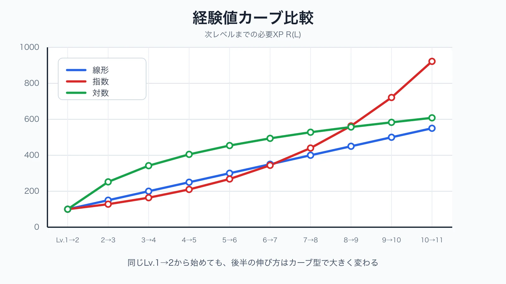
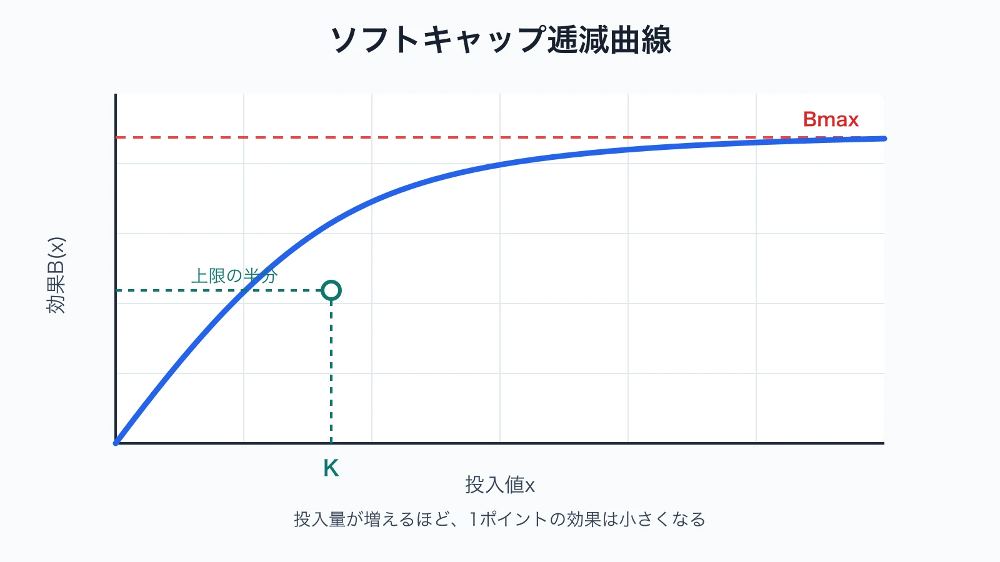
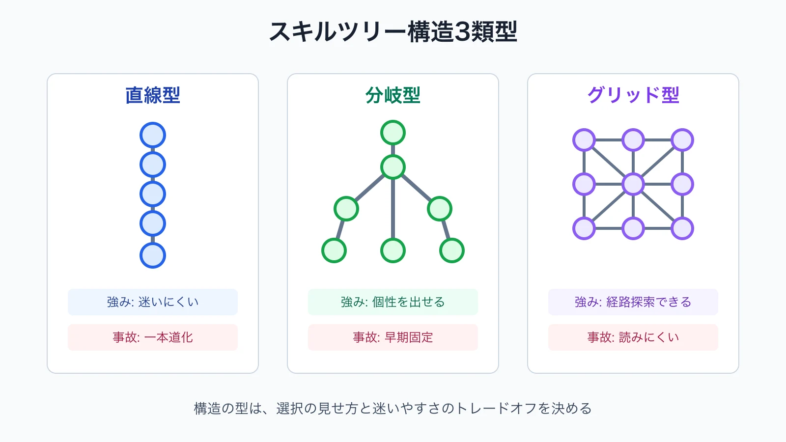
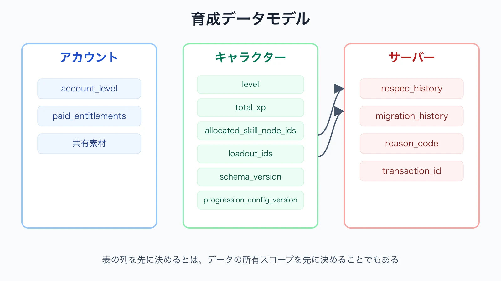
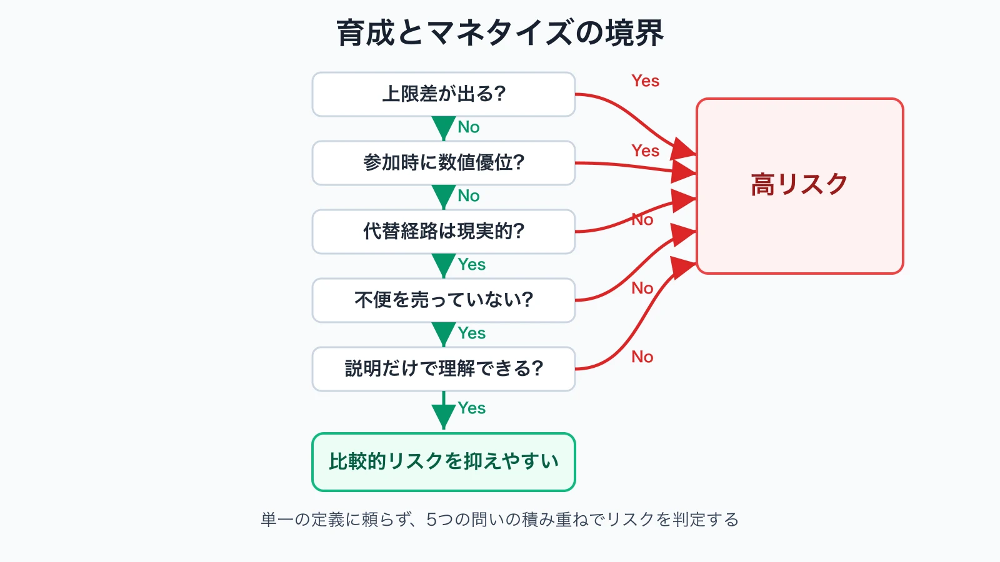
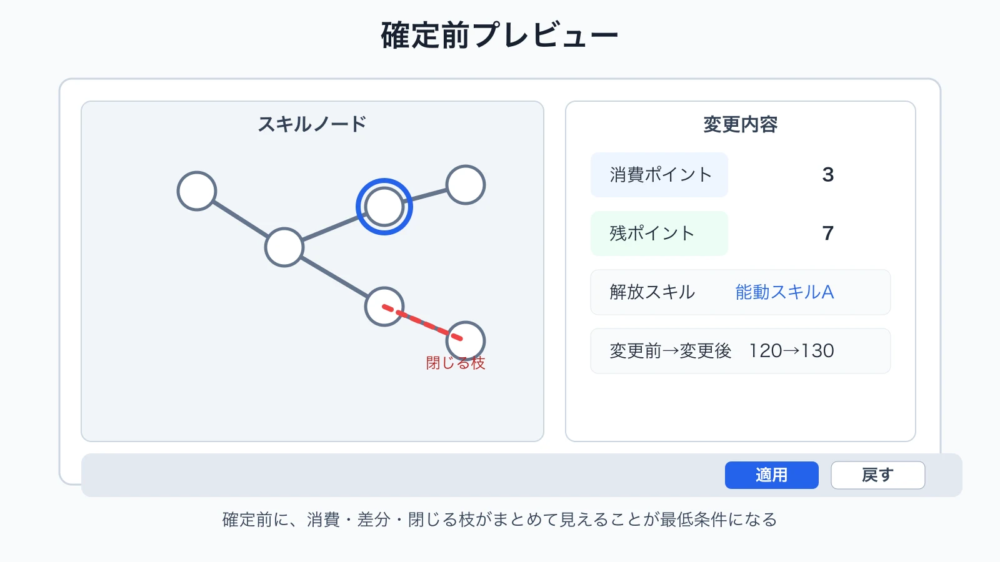
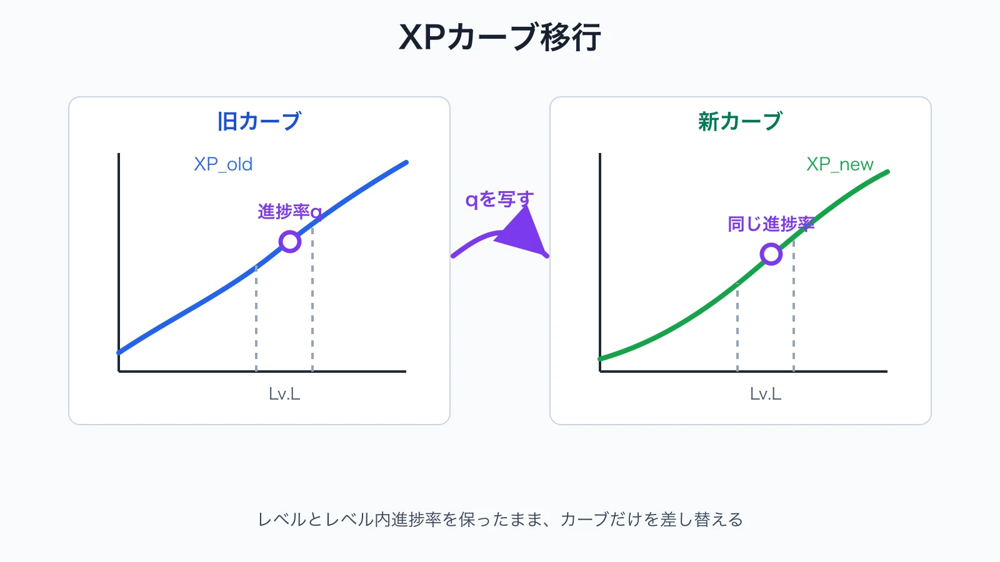

# 育成システム設計の実務――レベル、スキルツリー、リスペックを一つの仕様にする

## はじめに――「経験値が貯まれば成長する」では設計にならない

育成システムの仕様書へ「敵を倒すと経験値を獲得し、一定値でレベルアップする」と書くだけでは、実装の入口しか決まっていない。プレイヤーがいつ強くなり、何を選び、選択をどこまでやり直せるかが未定だからである。

育成設計には、少なくとも三つの仕事がある。

- **選択のアーキテクチャ** ：何を選択肢として見せ、どの順番と前提条件で選ばせるか
- **ペース配分** ：何分、何戦、何章ごとに成長を感じさせるか
- **サンクコスト管理** ：投入済みの時間や資源を理由に、望まないビルドを続けざるを得ない状態をどう避けるか

サンクコスト効果とは、金銭、努力、時間を投じた後ほど、その行為を継続しやすくなる傾向である。ArkesとBlumerの研究は、すでに投じた費用がその後の判断へ影響することを実験とフィールド調査で示した。[[1](#ref-1)] 育成システムでは、弱いノードへ振ったポイント、育て直しに必要な周回時間、入手済みキャラクターへ投じた素材がこれに当たる。

サンクコストをゼロにすればよいわけではない。選択に重みがなければ、ビルドを考える意味も薄れる。重要なのは、 **選択の重みと、誤選択から回復する費用を別々に設計すること** である。

本記事では、敵ステータスとの詳細な相互作用は「RPGバトル設計の落とし穴」に、通貨やアイテム全体の循環は「ゲーム内経済設計」に譲る。対象は、実際に育成仕様書を書くプランナーが決めるべきカーブ、ポイント、保存データ、UI、移行手順である。以下の数値は、特定タイトルの内部値ではなく、すべて説明用の架空例である。

***

## 1. 最初に「成長契約」を一枚へまとめる

個別の表を作る前に、育成システムがプレイヤーと結ぶ約束を一枚にする。

| 項目 | 仕様書で決める問い | 例 |
|---|---|---|
| 成長主体 | 何が育つのか | アカウント、キャラクター、武器、クラス |
| 成長源 | 何をすると進むのか | 戦闘、クエスト、探索、時間経過 |
| 成長頻度 | 何分ごとに変化が起きるか | 序盤10分、中盤30分、終盤90分 |
| 選択単位 | プレイヤーは何を選ぶのか | ステータス、ノード、装備枠、派生先 |
| 不可逆性 | 何が、いつまで戻せないか | 戦闘中のみ固定、章クリアまで固定、常時変更可 |
| 上限 | どこで成長が止まるか | レベル50、スキルポイント40、能力値ソフトキャップ |
| 共有範囲 | 複数キャラクター間で何を共有するか | アカウントランク、素材、経験値倍率 |
| 運用 | 後から何を変更する可能性があるか | 必要XP、ノード接続、効果量、上限 |

この表の目的は、レベル表、スキル表、報酬表、セーブ仕様が別々の思想で作られる事故を防ぐことである。たとえばレベル50までに49ポイントを配る仕様なのに、ツリーの必須経路だけで55ポイント必要なら、表単体が正しくてもシステムは成立しない。

***

## 2. 経験値カーブは「必要量」ではなく「所要時間」で設計する

### 2-1. まず縦軸を明記する

「指数カーブにする」という会話は危険である。縦軸が次レベルまでの必要XPなのか、レベル到達までの累積XPなのかで意味が変わるからだ。本記事では、レベル $$L$$ から $$L+1$$ へ上がる必要XPを $$R(L)$$ とする。

体感を決める基本式は次である。

$$
T(L)=\frac{R(L)}{E(L)}
$$

$$T(L)$$ はそのレベル帯の想定所要時間、$$E(L)$$ は同じ帯での1分あたり想定獲得XPである。必要XPだけを1.5倍にしても、敵報酬も1.5倍なら所要時間は変わらない。したがってXP表には、必ず「標準プレイ1分あたり」「標準戦闘1回あたり」「主要クエスト1件あたり」の獲得量を隣接させる。

### 2-2. 線形・指数・対数の使い分け

代表的な形を、次のように置ける。

$$
R_{linear}(L)=a+b(L-1)
$$

$$
R_{exp}(L)=a\cdot r^{L-1}\quad(r>1)
$$

$$
R_{log}(L)=a+b\ln L
$$

| 型 | 必要XPの増え方 | 作りやすいペース | 注意点 |
|---|---|---|---|
| 線形 | 毎レベル一定量ずつ増える | 見通しがよく、報酬成長も合わせやすい | 長期運用では後半の差が弱くなりやすい |
| 指数 | 現在値へ倍率を掛けて増える | 後半を明確に長くし、到達者を絞りやすい | 報酬側が追従しないと終盤だけ急に停滞する |
| 対数 | 序盤に増え、その後は増分が小さくなる | チュートリアル後に重みを出しつつ、後半の所要時間を暴れにくくする | 「対数だから序盤が速い」とは限らず、係数次第である |

次は $$a=100$$ とした比較例である。指数型は $$r=1.28$$、対数型は $$b=220$$ とし、小数を四捨五入している。

| 遷移 | 線形 $$100+50(L-1)$$ | 指数 $$100\times1.28^{L-1}$$ | 対数 $$100+220\ln L$$ |
|---|---:|---:|---:|
| Lv.1→2 | 100 | 100 | 100 |
| Lv.2→3 | 150 | 128 | 252 |
| Lv.3→4 | 200 | 164 | 342 |
| Lv.4→5 | 250 | 210 | 405 |
| Lv.5→6 | 300 | 268 | 454 |
| Lv.6→7 | 350 | 344 | 494 |
| Lv.7→8 | 400 | 440 | 528 |
| Lv.8→9 | 450 | 563 | 557 |
| Lv.9→10 | 500 | 721 | 583 |
| Lv.10→11 | 550 | 922 | 607 |
| Lv.11到達の累積XP | 3,250 | 3,860 | 4,322 |

*同じLv.1→2の必要XPから出発しても、カーブ型によって後半の伸び方は大きく異なる。*

この表だけを見て採用型を決めてはいけない。各レベル帯の獲得XPを仮置きし、想定プレイ時間へ戻す。さらに、初回クエスト報酬を含む新規プレイヤー、反復コンテンツ中心の継続プレイヤー、上手な最短攻略者の三経路で所要時間を出す。

### 2-3. マイルストーン型カーブ

数式一本では、章ボスや新機能解放の前後を表現しにくい。そこで基礎カーブへ区間補正を加える。

| 遷移 | 必要XP | 意図 |
|---|---:|---|
| Lv.1→2 | 100 | 初回成長を早く見せる |
| Lv.2→3 | 150 | 基本ループを反復させる |
| Lv.3→4 | 200 | 通常区間 |
| Lv.4→5 | 400 | 章ボス前の到達目標 |
| Lv.5→6 | 220 | 新機能解放直後の再加速 |
| Lv.6→7 | 300 | 通常区間へ戻す |
| Lv.7→8 | 350 | 通常区間 |
| Lv.8→9 | 650 | 上位コンテンツへのゲート |
| Lv.9→10 | 400 | ゲート通過後の報酬感 |

節目を重くした次のレベルまで重くすると、達成直後に再び壁が来る。マイルストーン型では、山と谷をセットで設計する。また、節目レベルで新スキルを解放するなら、その直前にスキルポイントを温存させすぎないよう、解放条件とポイント供給も同時に見る。

### 2-4. レベルキャップの決め方

レベルキャップは「RPGらしいから99」では決めない。次の四つから逆算する。

1. メイン進行の想定終了レベル
2. 意味のある解放や成長を何回提示できるか
3. 1レベルの差をUIと計算式で説明できる粒度
4. 運用で上限を拡張する予定と、拡張しない場合の終端コンテンツ

たとえば全30章で、2章ごとに大きな解放を置き、章間に小成長を1回置くなら、30〜40段階でも十分である。キャップ後も経験値を蓄積するなら、次回上限解放時に持ち越すのか、別報酬へ変換するのか、上限で切り捨てるのかをリリース前に決める。

***

## 3. ステータス成長は「基礎値・成長値・補正値」を分離する

レベルアップ後の最終値だけを保存すると、装備、バフ、後日の調整を分離できない。仕様上は少なくとも次へ分ける。

$$
S_{final}=S_{base}+S_{level}+S_{allocation}+S_{equipment}+S_{temporary}
$$

- $$S_{base}$$：キャラクター固有の初期値
- $$S_{level}$$：レベル表から得る恒久成長
- $$S_{allocation}$$：プレイヤーが配分したポイント
- $$S_{equipment}$$：装備由来の補正
- $$S_{temporary}$$：戦闘中のバフなど一時補正

Unreal EngineのGameplay Ability Systemも、属性へ基礎値と現在値を持たせ、Data Tableから初期値を与える構成を説明している。一方、メタデータ上の最小値・最大値だけでは自動クランプされないため、上限処理を別途実装する必要がある。[[2](#ref-2)] エンジンを問わず、表に上限を書いたことと、実行時に上限が保証されることは別問題である。

### 3-1. レベルごとの成長値

成長方式は主に三つある。

| 方式 | 例 | 向く用途 |
|---|---|---|
| 定額 | 毎レベルHP+20 | 説明しやすく、予測しやすい |
| 段階 | Lv.1〜20は+20、21〜40は+30 | 章や昇格で成長感を切り替える |
| 係数 | 前レベル値×1.03 | 大きな数値差を作る長期成長 |

係数型は丸め規則を必ず決める。毎レベル丸めるのか、内部小数を保持して表示だけ丸めるのかで最終値が変わる。仕様書には式だけでなく、計算順、丸め位置、最小保証値を書く。

### 3-2. 逓減と上限

逓減は、投入量が増えるほど1ポイントの効果を小さくする設計である。自由配分ステータスの極端な一点集中を緩和するとき、たとえば次のソフトキャップ式を使える。

$$
B(x)=B_{max}\frac{x}{K+x}
$$

*投入量が増えるほど、1ポイントの効果は小さくなる。*

$$x$$ は投入値、$$B_{max}$$ は理論上限、$$K$$ は効果が上限の半分へ達する投入値である。ただし、表示が「攻撃速度100」なのに実効値が式の裏で大きく減ると理解しにくい。UIでは「次の1ポイントで何が何％変わるか」を表示する。

ハードキャップは、それ以上を受け付けない上限である。ソフトキャップは、投入できるが効率が落ちる境界である。装備込みで上限判定するのか、素の配分値だけで判定するのかを明記する。ダメージ式や敵との相互作用は別記事の領域であり、ここでは成長側が基礎値と各補正の出所を渡せる状態までを責任範囲とする。

***

## 4. スキルツリーは図ではなく、依存関係を持つポイント経済である

### 4-1. ツリー構造の型

| 型 | 構造 | 強み | 主な事故 |
|---|---|---|---|
| 直線型 | 上から順に解放 | 初心者が迷いにくく、導線を制御しやすい | 選択肢に見えて実質一本道になる |
| 分岐型 | 幹から複数の枝へ分かれる | 役割やプレイスタイルを表現しやすい | 序盤の一手で後半が固定されやすい |
| グリッド型 | 多方向へ接続する網 | 経路探索と複合ビルドを作りやすい | 可読性、最短経路、死にノードの管理が難しい |

『Path of Exile』の公式パッシブツリーは、全クラスが同じ大規模な網を共有し、開始位置を変える方式を採る。また通常ノード、効果の大きいNotable、ルールを変えるKeystoneを区別し、公式ページ上で取得前のビルドを試せる。[[3](#ref-3)] これはグリッド型の一例であり、規模をまねるべきという意味ではない。ツリー研究でも、依存関係の論理だけでなく、経路の理解しやすさや提示品質が課題として扱われている。[[4](#ref-4)]

*構造の型は、選択の見せ方と迷いやすさのトレードオフを決める。*

### 4-2. ノード種別

| ノード | 内容 | 設計上の役割 |
|---|---|---|
| 受動強化型 | HP+5％、炎耐性+10など | 小刻みな成長、経路の接続 |
| 能動解放型 | 新しい攻撃、回避、召喚など | 操作と戦術を変える節目 |
| 選択ゲート型 | AかBの一方、取得後に別枝を閉じる | ビルドの個性とコミットメントを作る |

能動スキルは、効果だけでなく、使用コスト、発動条件、入力、クールダウン、付与・剥奪条件を持つ。Unreal EngineのGameplay Abilityも、アビリティがコスト、使用条件、入力、クールダウンを扱い、付与後に剥奪できる構造を提供している。[[5](#ref-5)] 仕様書では「ノードを取得したらスキル解放」だけで終えず、取得、装備、使用可能、発動中を別状態として定義する。

### 4-3. ポイント経済

総取得可能ポイントを先に置く。

$$
P_{total}=P_{level}+P_{quest}+P_{shared}+P_{grant}
$$

次に、以下を機械的に検証する。

- キャップ時に全ノードを取れるのか、取れないことが価値なのか
- 最初の能動解放まで何ポイント必要か
- 各主要ビルドの完成に何ポイント必要か
- 前提ノードへ払う「通行料」が総ポイントの何％か
- 期間限定配布ポイントを逃してもビルドが成立するか
- クエスト由来ポイントが未受領でも、セーブ移行後に再計算できるか

前提条件は、単なる `required_node_id` だけでは足りない。「AかB」「AとB」「同カテゴリを3個」「キャラクターレベル20」「特定クエスト完了」など条件種別をデータ化する。循環参照、到達不能ノード、必要ポイント超過、排他ノードの同時取得は、自動検査対象にする。

***

## 5. リスペックは失敗救済とビルド価値の調整弁である

リスペックは、一度決めた育成配分を組み直す機能である。無料か有償か、部分か全体かを別軸で考える。

| 方式 | 長所 | リスク | 向く場面 |
|---|---|---|---|
| 無料・部分 | 小さな誤選択をすぐ直せる | 戦闘ごとの最適解へ頻繁に着替えられる | ノード数が多い、試行を促したい |
| 無料・全体 | 新規プレイヤーに寛容 | 選択の重みが薄れ、UI操作量も増える | 短編、対戦前ロードアウト |
| ゲーム内有償・部分 | 小修正と大改造の費用を分けられる | 費用が高いと弱いビルドから抜けにくい | 長期RPG、恒常的な資源回収 |
| ゲーム内有償・全体 | 大改造に明確な区切りを作れる | 調整後もプレイヤーへ費用を負わせると不公平 | ビルド保存枠と併用する場合 |
| 現実通貨・チケット | 収益化しやすい | 設計ミスや不便を販売していると受け取られやすい | 慎重な制約と無償経路がある場合のみ |

『Path of Exile』公式ページは、クエストやゲーム内アイテムから返還ポイントを得て小〜中規模の修正を可能にしつつ、大きく異なるビルドは新キャラクターで遊ぶ意図を説明している。[[3](#ref-3)] 重要なのは、この方式が普遍的な正解なのではなく、「キャラクターを育て直すこと自体を遊びにする」という作品方針と一貫している点である。

### クールダウンを置く前に目的を言語化する

リスペックのクールダウンは、次の目的なら候補になる。

- ボスごとに完全な対策ビルドへ切り替える行為を抑える
- サーバー更新やランキング反映の頻度を制限する
- 選択後に一定期間試すことを促す

一方、誤タップ救済に24時間の待ち時間を課す必要はない。確定前プレビュー、確定後数分の無料取り消し、最後の変更だけを戻すUndoを先に検討する。戦闘中は変更不可、拠点では無料という場所制約も、時間制約より説明しやすい場合がある。

運用側がノード効果や接続を変更した場合は、通常のリスペック費用を適用しない。影響ノードだけの無料返還、該当枝の部分リセット、全ポイント返還の順に、変更範囲へ比例した救済を選ぶ。

***

## 6. 複数キャラクターでは「共有すると消える遊び」を確認する

### 6-1. アカウント共有型と個別型

| 項目 | アカウント共有型 | キャラクター個別型 |
|---|---|---|
| 長所 | 新キャラクターをすぐ試せる、周回の重複が減る | 各キャラクターの成長物語と習熟過程を保てる |
| 短所 | 新キャラクターの序盤導線を飛ばしやすい | 追加キャラクターほど同じ作業が増える |
| 向く対象 | 機能解放、恒久利便性、図鑑補正 | レベル、固有スキル、個別熟練度 |

実務ではハイブリッド型が扱いやすい。アカウント側に「コンテンツ参加資格」と「追いつき支援」を持たせ、キャラクター側に「そのキャラクターを理解するための成長」を残す。

バックエンドでもスコープを分ける必要がある。PlayFabのEntityモデルは、タイトル、プレイヤー、キャラクターを別エンティティとして扱い、プレイヤー共有情報とキャラクター固有情報を分離できる。[[6](#ref-6)] 企画書の「共有」という一語を、保存先、更新権限、表示先まで分解する。

### 6-2. ロースター型特有の論点

多数のキャラクターを入手・編成するロースター型では、次を決める。

- 新規加入キャラクターを現行コンテンツへ出せるまでの時間
- 1人を最大育成する費用と、編成全体を実用帯へ上げる費用
- 経験値素材を誰に使うかという選択を残す範囲
- 控えメンバー、派遣、共有レベルなどによる受動的な追いつき
- 限界突破や重複入手が、レベル・スキル・装備のどこへ接続するか
- 編成必須人数が増えたとき、過去の育成投資が無駄にならないか

新キャラクターを引くたびに、同じ序盤素材を長時間集め直させると、入手の喜びと使用可能になる時点が離れる。反対に、加入直後から完全育成済みにすると、育て方を学ぶ過程と選択が消える。実用帯までは共有資源で早く、最終強化は個別目標として長くするなど、二段階に分けると調整しやすい。

***

## 7. 育成データモデル――表の列を先に決める

育成値は、改ざんされると対戦、ランキング、課金資産へ影響する。Unity Cloud Saveは、プレイヤー関連データをキーと値で保存し、クライアントから直接書き換えられないProtectedデータをサーバー権威の処理に使えるとしている。[[7](#ref-7)] オフライン作品を除き、XP付与、ポイント消費、リスペック費用の確定はサーバー側を基本とする。

| データ項目 | 型の例 | スコープ | 用途・注意点 |
|---|---|---|---|
| `schema_version` | int | セーブ | 移行処理の分岐。必須 |
| `progression_config_version` | string | セーブ | どのカーブ・ツリー定義で保存したか |
| `account_level` | int | アカウント | 共有進行。キャラクターレベルと混同しない |
| `character_id` | string | キャラクター | 表示名ではなく不変IDを使う |
| `level` | int | キャラクター | XPから再計算可能でもキャッシュ用途を明記 |
| `total_xp` | long | キャラクター | レベル内XPだけでなく累積値を保持する |
| `xp_source_summary` | map | キャラクター | クエスト、戦闘、補填などの監査集計 |
| `base_stats` | map | マスター参照 | 原則としてセーブへ複製しない |
| `allocated_stats` | map | キャラクター | プレイヤー配分だけを保存する |
| `granted_skill_points` | int | キャラクター | レベル・クエスト・補填の総付与数 |
| `spent_skill_points` | int | キャラクター | 取得ノードから再計算するキャッシュ。整合性検査に使う |
| `allocated_skill_node_ids` | array | キャラクター | 取得済みノードの不変IDだけを保存する |
| `skill_node_states` | map | 派生値 | `locked`、`available`、`allocated` を現在の定義から計算する |
| `loadout_ids` | array | キャラクター | 複数ビルド保存枠 |
| `respec_count` | int | キャラクター | 段階費用や分析に使用 |
| `last_respec_at` | timestamp | キャラクター | クールダウン判定 |
| `respec_history` | array／別ログ | サーバー | 前後差分、費用、理由コード、取引ID |
| `migration_history` | array | サーバー | 適用済み移行ID。二重補填を防ぐ |
| `paid_entitlements` | array | アカウント | 購入権利。育成値と分離して復元可能にする |

*表の列を先に決めるとは、データの所有スコープを先に決めることでもある。*

ポイント消費は、「残ポイントを1減らす」「ノードを取得済みにする」を別々に保存してはいけない。一つのトランザクションとして検証・更新し、失敗時は両方を戻す。履歴には、ユーザー操作、運営補填、移行、管理ツール修正を区別する理由コードを残す。

***

## 8. 育成とマネタイズの境界

ここで扱うのは収益戦略全体ではなく、育成アイテムが競争条件や選択を壊さないための判定である。P2W（Pay to Win）に単一の公的定義があると仮定せず、次の五問で評価する。

1. 購入者だけが到達できる戦力上限があるか
2. 同じコンテンツへ参加する時点で、支払いが恒常的な数値優位を作るか
3. 無課金の代替経路が、名目上ではなく現実的な所要時間で存在するか
4. 不便や誤選択を意図的に強め、その解消を販売していないか
5. 商品説明だけで、効果、対象、期限、重複時の挙動を理解できるか

*単一の定義に頼らず、5つの問いの積み重ねでリスクを判定する。*

| 商品 | 比較的リスクを抑えやすい条件 | 高リスクになる条件 |
|---|---|---|
| 経験値ブースター | 時間短縮のみ、最終上限は同じ、対戦では正規化 | 購入期間だけランキング報酬へ大差が付く |
| スキップチケット | 既クリア区間の反復短縮、報酬量を明示 | 未攻略の高難度報酬を支払いだけで取得 |
| リスペックチケット | 無償の小修正経路があり、全体変更の利便性を売る | 調整で壊れたビルドの救済まで有料 |
| 育成素材パック | 入手先と短縮時間が見える | 有償限定素材で上限突破する |

現実通貨が絡む操作では、確定前に商品、数量、価格、適用対象、適用後の状態を一画面で確認できるようにする。FTCは『Fortnite』の意図しない購入をめぐる申立てで、一貫しないボタン配置や確認不足が不要な請求につながったと説明し、明確な同意を求めている。[[8](#ref-8)] 育成画面とショップが接続するほど、「強化する」と「購入する」を同じ入力で確定させないことが重要になる。

***

## 9. 育成UIは「結果を理解してから確定できる」ことが最低条件である

育成画面では、現在値より **変更後の差分** を中心に見せる。

### 確定前プレビュー

*確定前に、消費・差分・閉じる枝がまとめて見えることが最低条件になる。*

- 消費ポイントと残ポイント
- 解放される能動スキル
- 閉じる排他枝
- ステータスの変更前→変更後
- 次ノードへ進むために不足する条件
- リスペック時に失う依存ノードと返還量

### 比較表示

単に「攻撃力+10」とせず、「現在120→130」「最終ダメージの参考変化」「次の1ポイントの増分」を分ける。逓減がある場合は、取得後に効率が落ちることを確定前に示す。複数ロードアウトでは、変更ノードだけを色と一覧の両方で表示する。色だけに依存しない。

### 取り消し可能性

選択中、確定済み、サーバー保存済みを見た目で区別する。「適用」までは自由に戻せるようにし、適用後も短時間のUndo、直前状態の復元、無料の部分リスペックのいずれかを用意する。大規模ツリーでは検索、カテゴリ絞り込み、取得可能ノードだけの表示、目標ノードまでの必要ポイント表示が必要になる。

UI仕様書には正常系の画面だけでなく、「通信中に閉じる」「別端末で同時更新する」「前提ノードを外す」「所持ポイントがサーバー判定で不足する」場合の表示と復帰先を書く。

***

## 10. 運用開始後の再調整――値を変える前に移行規則を作る

XPカーブやノード効果をリモート設定へ置けば、クライアント更新なしに調整できる。PlayFabのTitle Dataは、ゲーム全体の設定をキーと値で管理し、ビルドを配布せず更新できる仕組みを提供する。[[9](#ref-9)] ただし、変更できることと、安全に変更できることは同じではない。

### 10-1. XPカーブ変更

旧カーブでレベル $$L$$、次レベルへの進捗率が $$q$$ のプレイヤーを、新カーブへ移す例は次である。

$$
q=\frac{XP_{old}-C_{old}(L)}{C_{old}(L+1)-C_{old}(L)}
$$

$$
XP_{new}=C_{new}(L)+\lfloor q\{C_{new}(L+1)-C_{new}(L)\}\rfloor
$$

*レベルとレベル内進捗率を保ったまま、カーブだけを差し替える。*

$$C(L)$$ はレベル $$L$$ 到達に必要な累積XPである。この方法はレベルとレベル内進捗率を保つ。ただし、必要XPを下げた結果、本来なら複数レベル上がる累積値を持つ人をどうするかは別判断になる。

代表的な移行方針は三つである。

- **レベル維持** ：表示レベルを下げず、同レベル内の進捗率を移す
- **累積XP維持** ：獲得済みXPをそのまま新カーブへ当て、レベルを再計算する
- **有利側採用** ：旧レベルと累積XP再計算後の高い方を採用する

下方修正でレベルを下げる方式は、装備条件、コンテンツ解放、実績まで巻き戻す。採用するなら影響範囲を列挙できる場合に限る。

### 10-2. ツリー変更

ノードには表示名ではなく不変IDを付ける。変更を次の種類に分ける。

| 変更 | 基本処理 |
|---|---|
| 効果量だけ変更 | 取得状態を維持し、告知と無料見直し期間を検討 |
| 接続だけ変更 | 新しい前提条件で不正状態になる枝を検出し、影響枝を返還 |
| ノード統合 | 旧ID群から新IDへ対応表で移す。余剰ポイントを返還 |
| ノード削除 | 消費ポイントを返還し、関連ロードアウトを無効表示にする |
| 排他条件追加 | 勝手に一方を選ばず、未確定状態へ戻す |
| 全面改修 | 全返還、再配分導線、変更説明、期限なしの救済を用意 |

『サイバーパンク2077』アップデート2.0ではパークツリーを全面改修し、既存セーブの使用済みパークポイントを返還したうえで、能力値の一度限りの再配分、旧スキル進行の新スキルへの移行を行った。[[10](#ref-10)] 大規模変更では、「セーブを読める」だけでなく、既存投資をどの単位で返すか、プレイヤーが新仕様を理解して再開できるかまでが互換性である。

### 10-3. リリース手順

1. 本番データの匿名化コピーで移行件数と差分を集計する
2. `migration_id` ごとに何度実行しても結果が変わらない処理にする
3. 移行前スナップショットを保持する
4. 対象者数、返還ポイント総数、到達不能ノード数を監視する
5. 段階配信し、問題時に設定とセーブの双方を戻せるようにする
6. ゲーム内で「何が変わり、何が返り、何を選び直すか」を表示する

PlayFab Game Savesの公式文書も、バージョン競合、悪い状態からのロールバック、ストア間で更新時期がずれる場合の互換性を考慮事項として挙げている。[[11](#ref-11)] 複数プラットフォームでは、新クライアントが移行済みデータを書いた後に旧クライアントが接続する状況もテストする。

***

## 11. 実務チェックリスト

### 企画意図

- [ ] 何を育てるシステムか、一文で説明できる
- [ ] 選択の重みと、誤選択からの回復費用を分けている
- [ ] 関連記事へ譲るバトル計算・全体経済の論点を混ぜていない

### 経験値とレベル

- [ ] 必要XPが「次レベル分」か「累積」か明記している
- [ ] レベル帯ごとのXP／分と所要時間を計算している
- [ ] 初回報酬、反復報酬、最短攻略の三経路を試算している
- [ ] マイルストーンの山の後に、再加速する谷がある
- [ ] キャップ到達後のXP処理を決めている

### ステータス

- [ ] 基礎、レベル、配分、装備、一時補正を分離している
- [ ] 計算順と丸め位置を決めている
- [ ] ソフトキャップとハードキャップを区別している
- [ ] 表上の上限が実行時にも保証される

### スキルツリー

- [ ] キャップ時の総ポイントと、主要ビルドの必要ポイントが一致する
- [ ] 受動、能動、選択ゲートの役割が重複していない
- [ ] 循環参照、到達不能、排他違反を自動検査できる
- [ ] ノードへ表示名とは別の不変IDがある
- [ ] 取得、装備、使用可能、発動中の状態を区別している

### リスペックとUI

- [ ] 無料／有償と、部分／全体を別軸で判断している
- [ ] クールダウンの目的を説明できる
- [ ] 確定前に消費、差分、閉じる枝を確認できる
- [ ] Undoまたは現実的な無償修正経路がある
- [ ] 課金操作は別の確定入力と明確な商品説明を持つ

### 複数キャラクターとデータ

- [ ] アカウント共有値とキャラクター固有値を分離している
- [ ] 新規加入キャラクターの実用帯到達時間を測っている
- [ ] XP・ポイント更新は一つのトランザクションで処理する
- [ ] `schema_version`、設定バージョン、移行履歴がある
- [ ] リスペックと補填へ理由コード、前後差分、取引IDが残る

### 運用

- [ ] カーブ変更時のレベル・累積XP・進捗率の扱いを決めている
- [ ] ノード変更種別ごとの返還規則がある
- [ ] 移行処理は再実行しても二重補填しない
- [ ] 移行前スナップショットとロールバック手順がある
- [ ] 旧クライアントと新クライアントの混在を試験している

***

## おわりに――育成は「未来の選択肢」を配るシステムである

レベルは数字の階段、スキルツリーはノードの図に見える。しかし、プレイヤーが実際に受け取るものは、次に何を試せるかという未来の選択肢である。

経験値カーブは、その選択肢を渡す時刻表である。ステータス成長は、投入がどの値へ変換されたかを説明する台帳である。リスペックは、選択を重くしながら失敗を永久化しない安全弁である。共有育成と追いつきは、過去の投資を守りつつ新しいキャラクターを使わせる接続部である。

したがって、育成仕様書で最初に書くべきものは「レベルアップに必要な経験値」だけではない。誰が、いつ、何を選び、どこまで戻せ、その状態をアップデート後もどう守るかである。そこまでつながって初めて、育成は一つの設計になる。

## References

1. [The Psychology of Sunk Cost][1] - 金銭、努力、時間の投資後に継続傾向が強まるサンクコスト効果を、実験とフィールド調査で検討したArkesとBlumerの原著論文。

2. [Gameplay Attributes and Attribute Sets for the Gameplay Ability System][2] - 属性の基礎値と現在値、Data Tableによる初期化、値域制御を説明するUnreal Engine公式文書。

3. [Passive Skill Tree - Path of Exile][3] - 共有グリッド型パッシブツリー、ノード種別、ポイント獲得、返還ポイント、事前のビルド計画を説明する公式ページ。

4. [Quality Measures for Improving Technology Trees][4] - スキルツリーを含む技術ツリーの依存関係、構造、提示品質を分析した査読論文。

5. [Using Gameplay Abilities in Unreal Engine][5] - アビリティのコスト、使用条件、入力、クールダウン、付与と剥奪を説明するUnreal Engine公式文書。

6. [Entities migration information][6] - タイトル、プレイヤー、キャラクターなど、データの所有スコープを区別するPlayFab公式文書。

7. [Cloud Save Player Data][7] - プレイヤーデータのキー・値保存と、クライアントから直接更新できないProtectedアクセスを説明するUnity公式文書。

8. [Fortnite Video Game Maker Epic Games to Pay More Than Half a Billion Dollars over FTC Allegations of Privacy Violations and Unwanted Charges][8] - 意図しないゲーム内購入、ボタン配置、確認、明確な同意をめぐる米国連邦取引委員会の公式発表。

9. [Title Data][9] - ビルドを再配布せず、タイトル全体の設定値を更新するPlayFabの公式文書。

10. [アップデート2.0 - サイバーパンク2077][10] - パークツリー全面改修時のポイント返還、能力値再配分、旧スキル進行の移行を説明する公式パッチノート。

11. [Game Saves overview][11] - セーブの競合処理、バージョンロールバック、複数ストア間で更新時期が異なる場合の互換性を扱うPlayFab公式文書。

[1]: https://www.sciencedirect.com/science/article/pii/0749597885900494
[2]: https://dev.epicgames.com/documentation/en-us/unreal-engine/gameplay-attributes-and-attribute-sets-for-the-gameplay-ability-system-in-unreal-engine
[3]: https://www.pathofexile.com/passive-skill-tree
[4]: https://doi.org/10.1155/2015/975371
[5]: https://dev.epicgames.com/documentation/en-us/unreal-engine/using-gameplay-abilities-in-unreal-engine
[6]: https://learn.microsoft.com/en-us/gaming/playfab/live-service-management/game-configuration/entities/migration-information
[7]: https://docs.unity.com/en-us/cloud-save/concepts/player-data
[8]: https://www.ftc.gov/news-events/news/press-releases/2022/12/fortnite-video-game-maker-epic-games-pay-more-half-billion-dollars-over-ftc-allegations
[9]: https://learn.microsoft.com/en-us/xbox/playfab/live-service-management/game-configuration/titledata/
[10]: https://www.cyberpunk.net/ja/news/49084
[11]: https://learn.microsoft.com/en-us/xbox/playfab/player-progression/game-saves/overview

----

この文書は、Perplexity、Claude、OpenAI Codex の3つのAIの支援を受けて著述されたものです。引用画像を除き、MIT License にて提供されています。
