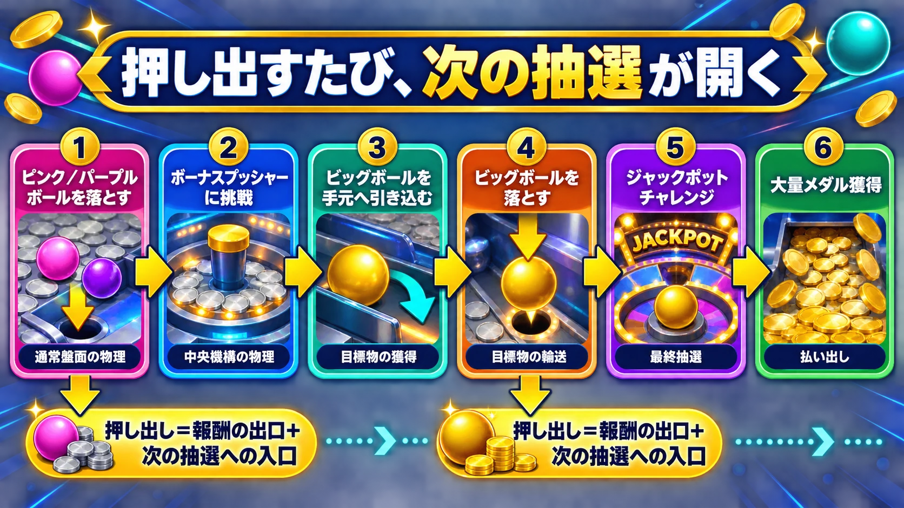
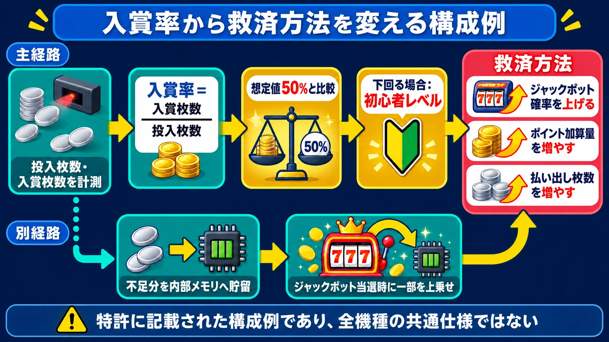

# コインプッシャーは「押し出すだけ」ではない――多段抽選がデジタルへ越境したとき

## はじめに――単純に見える盤面の奥に、抽選が重なっている

コインプッシャーは、往復する板の上へメダルを投入し、手前へ押し出された分を受け取る遊びに見える。目の前でメダルが動くため、入力と結果の因果も分かりやすい。うまく山を崩せば増え、横へ流れれば減る。それだけなら、機械の仕事は物理現象を繰り返すことに尽きる。

現在の大型プッシャーが作っているのは、もっと長い因果の鎖である。メダルがボールを押し、ボールが別の機構を動かし、そこで得た大きなボールがさらにジャックポットへの参加権を開く。途中ではチャッカーが通過を検知し、画面上の抽選、内部ポイント、ネットワークで共有された状態が次の展開を決める。 **押し出しは報酬の出口であると同時に、次の抽選への入口でもある。**

本稿は、パチンコ・パチスロ、クレーンゲーム、プリントシール機、メダルゲームを扱ってきた周辺産業シリーズの最終回である。これまでの4本は、ゲームプランナーが自分では作らない隣接ジャンルを、自分の仕事の言葉へ読み替える構成だった。本稿だけは事情が異なる。コインプッシャーの仕組みは、スマートフォンゲームやオンラインサービスへ実際に持ち込まれてきたからである。

既刊の「[メダルゲームは、なぜ何も持ち帰れないのに50年以上続いたのか](medal-game-no-cash-prize-industry-structure.md)」は、メダルゲームの法的枠組みと店内循環の産業構造を扱い、プッシャーの設計論を本稿へ送った。ここでは風営法の条文解説を繰り返さない。まず物理機が何をしているかを三つの章で分解し、その後に初めて、盤面や抽選過程がデジタルへ移ったときの変化を考える。

***

## 第1章：なぜ盤面はあれほど大きいのか

### 押し出した先に、次の挑戦が待っている

セガ『モグリアテール』の公式サイトは、ゲームの流れを四段階で示している。最初にピンクボールまたはパープルボールを落とし、中央のボーナスプッシャーへ挑戦する。そこでビッグボールを自分の手元へ引き込み、今度はそのビッグボールを盤面から落とす。ようやくジャックポットチャレンジへ進み、大量メダル獲得を目指す[[1](#ref-1)]。

この流れでは、最初のボールを落とした時点で遊びは終わらない。通常盤面での押し出しがボーナスプッシャーを起動し、中央機構での押し出しが次の目標物を供給し、その目標物を通常盤面で再び運ぶことで最上位の抽選へ到達する。ひとつの物体が出口へ落ちるたび、別のルールが始まる。

同じ系列は先行機にも見える。『ホリアテール』では、7種類のボールをフィールドから落とすと色に応じたチャレンジが始まり、3種類のビッグボールはそれぞれ異なるジャックポットチャレンジへつながる。ピンクボールから始まるルーレットは内周へ発展するとボーナスプッシャーの機会を開き、パープルボールは中央フィールドから自席側へボールを引き込む契機になる[[2](#ref-2)]。『JACKPOT CIRCUS』では、通常盤面からボールを落とすと「バルーンチャンス」が始まり、ボールを横一列に並べるほど配当が上がる。5個並べるとSPステージへ進み、そこでも5個を並べて初めてジャックポットへ到達する[[3](#ref-3)]。

三作に共通するのは、メダルの山を崩す技術だけではない。小さな物理達成を、性質の異なる次の抽選へ変換する **段階設計** である。

| 段階 | プレイヤーから見える目標 | 達成後に開くもの |
|---|---|---|
| 通常の押し出し | メダルや小さなボールを手前へ運ぶ | ルーレット、ミニゲーム、中央機構への挑戦 |
| 中間抽選 | ボールを並べる、中央から目標物を引き込む | ビッグボール、上位ステージ、継続抽選 |
| 上位目標の輸送 | 得たビッグボールを自席の盤面で落とす | ジャックポットチャレンジへの参加 |
| 最終抽選 | ルーレットや物理抽選を突破する | 大量メダルの払い出し |

大型筐体の面積は、派手に見せるためだけの空間ではない。通常の盤面、中央の共有機構、ボールの待機位置、ルーレット、ジャックポットの進行状況を、同時に見える状態で並べるための空間でもある。抽選を一枚の画面へ畳み込まず、 **「次へ近づいている状態」そのものを物体の位置として保存する** には、距離と面積が要る。

セガの公式一覧によれば、『ホリアテール』は2023年3月8日、『JACKPOT CIRCUS』は2024年3月14日、『モグリアテール』は2026年7月8日に稼働を開始した[[4](#ref-4)]。三作のゲームフローは同一ではないが、近年の製品でも、押し出しの先へさらに抽選を重ねる設計が更新され続けていることは確認できる。

***

## 第2章：物理と内部処理の境目

### チャッカーは、メダルの軌道をデータへ変える

盤面上で起きたことは、どこかで機械の内部処理へ渡されなければならない。その接点の一例を具体的に記述しているのが、セガを出願人とする特許JP2010088830Aである。この公報が対象とするのはプッシャータイプのメダルゲーム装置だが、以下はあくまで当該出願に記載された構成であり、市場の全機種に共通する仕様ではない[[5](#ref-5)]。

公報の実施形態では、プレイヤーはハンドルで方向を調整しながらメダルを投入する。筐体内には表示ディスプレイと複数の入賞口、いわゆるチャッカーがあり、画面に表示されたアイテムの位置へ対応するチャッカーをメダルが通過すると、センサーが入賞を検知する。その信号を受けて抽選処理が走り、メダルの払い出しやジャックポットポイントの加算が決まる[[5](#ref-5)]。

ここでは、プレイヤーの技量が乱数へ直接入力されるわけではない。狙った場所へメダルを通せたかという物理的な結果が、センサーによって「入賞した」という離散的なデータへ変換される。その後は、データテーブル、抽選処理、ポイントの蓄積がゲームを進める。盤面は内部抽選を覆い隠す装飾ではなく、 **内部処理へ入力を渡す操作装置** でもある。

### 一台の外にある状態が、全員の次の抽選を決める

内部処理の範囲は、自席の筐体だけとは限らない。ダイナ株式会社を出願人、飯田正道氏を発明者とする特許JP2004130119Aは、通信回線で複数のゲーム端末と管理装置をつないだ共有ジャックポットを記述している[[6](#ref-6)]。この公報はゲームの種類をプッシャーに限定していないため、プッシャー全般の標準構造を示す資料ではなく、メダルゲームで成立し得るネットワーク抽選の構成例として読む必要がある。

公報では、各端末へ投入されたメダル等の一部を管理装置がジャックポットとして積み立てる。積立額が一定以上に達し、さらに一定台数以上の端末がプレイ中であることを条件として、払い出し可能な状態だと判断する構成が示される。条件を満たすと、告知とカウントダウンを経て、複数端末で通常ゲームとは別の特別ゲームを実行し、その結果から獲得者を決める[[6](#ref-6)]。

この構造で「次に何が起きるか」を決める状態は、目の前のメダル配置だけにない。全端末から集まった積立値、現在プレイ中の端末数、特別ゲームの結果が管理装置に保持される。セガ特許の構成と並べれば、物理メダルがチャッカーを通るまでを入力層、その通過をイベントへ変換するセンサーを境界層、ポイント・抽選テーブル・参加端末を扱う部分を内部状態層として読める。

プレイヤーからは、メダル、ボール、ランプ、カウントダウンが連続した一つの出来事に見える。しかし設計側では、 **見える物理と、見えないデータが交互にバトンを渡している。** コインプッシャーの多段性は、物理抽選が何段もあるという意味だけではない。物理と内部処理の往復そのものが多段なのである。

***

## 第3章：勝敗を決めているのは盤面だけではない

### 入賞率から腕前を推定し、払い出し側を変える

セガ特許JP2010088830Aは、さらに踏み込んだ調整を記述している。所定のサンプリング時間に投入されたメダル枚数と、チャッカーを通過した入賞メダル枚数から入賞率を算出し、その値でプレイヤーのスキルレベルを判別する仕組みである[[5](#ref-5)]。

実施形態では想定入賞率を50％とし、これを下回るプレイヤーを初心者レベルと判別する例が示される。初心者と判別した場合に変更できるものとして、公報は次の三つを挙げている。

1. ジャックポットの発生確率を引き上げる。
2. 1回の入賞で積み立てられるジャックポットポイントの加算量を増やす。
3. ジャックポット演出時に払い出すメダル枚数を増やす。

三つは介入する場所が異なる。第1は当選の起こりやすさ、第2は上位抽選へ到達する速さ、第3は当選後の報酬量を変える。どれを動かしても期待される払い出しを増やせるが、プレイヤーから見える体験は同じではない。第2なら「ゲージがよく進む」と感じやすく、第3なら当たりまでの苦戦は残したまま、最後の回収を厚くできる。

公報には別案もある。想定値に届かなかった分を「無駄な投入メダル」として内部メモリへ記録し、ジャックポット当選時に、その一部を本来の払い出しへ上乗せする構成である。失敗をその場で返すのではなく、見えない貯留値へ変えて後の成功へ合流させる。プレイヤーの操作結果を無効にしない **遅延型の救済** と整理できる[[5](#ref-5)]。

### 「払い出した」と「手元へ届いた」の間にも、物理がある

払い出しも一段ではない。同公報は、装置内部へメダルを放出する第1の払い出しと、装置からプレイヤーへメダルを渡す第2の払い出しを区別している。実施形態では、当選に応じて内部のスロープへメダルを放出し、プッシャーメカが盤面上のメダルを押す。手前のシュートへ落ちた枚数を数え、その数に応じてペイアウトホッパーから筐体外へ払い出す[[5](#ref-5)]。

内部へ100枚を放出したとしても、その100枚が直ちにすべて手元へ来るわけではない。盤面に残るもの、別のメダルを先に落とすもの、横へ流れるものがある。内部処理が決めた報酬量は、再び物理状態へ渡され、盤面の変化と時間差を伴ってプレイヤーへ届く。デジタルゲームでいえば報酬テーブルの決定後に、受け取り方をもう一つのゲームとして挟んでいる。

この発想は、既刊「[難易度設計とダイナミックディフィカルティ](difficulty-design-and-dynamic-adjustment.md)」が扱った動的難易度調整に近い。固定の難易度を選ばせるのではなく、プレイ中の観測値から苦戦を推定し、資源、進行速度、報酬量のいずれかへ介入するからである。ただし、ここでも特許の記載を市場全体の実装実績へ一般化はできない。重要なのは、物理機の設計案にも、プレイヤーから見えない状態推定と救済制御が明確に存在したことである。

同時に、ジャックポットまでの距離や当選結果が一定でない構造は、既刊「[ガチャはなぜ続けたくなるのか――可変比率強化を約70年の研究から読み解く](variable-ratio-reinforcement-gacha-loot-box-psychology.md)」の論点とも接続する。もっとも、入賞率に応じた救済、物理的な押し出し、確率抽選をすべて一語で「可変比率」と呼ぶことはできない。どの行動の後に、どの結果が、どの規則で返るのかを段ごとに分ける必要がある。

***

## 第4章：盤面がスマートフォンへ移ったとき

### 再現したのは形ではなく、押し出す手応えだった

物理機の構造を理解すると、スマートフォン移植で何を残すべきかが見えてくる。セガの『ドラゴンコインズ』は、コインプッシャーとRPGを組み合わせたタイトルである。開発者インタビューで瀬川氏は、出発点を「セガを代表するようなスマホアプリ」とし、セガが長く手がけてきたメダルゲーム、とりわけ幅広い層に分かりやすいコインプッシャーを題材に選んだと説明している[[7](#ref-7)]。

ここで開発側が持ち込んだのは、実機の寸法を忠実に写した盤面ではない。手前の縁には、実機と同様にコインを盤面へとどめる角度を付けつつ、実機より角度を低くした。角度をなくせば投入分がそのまま落ちてコインが盤面にたまらず、高くしすぎれば押し出しにくく爽快感が弱まる。モンスターへコインを食べさせなければバトルが進まないため、実機より落としやすい側へ調整したという[[7](#ref-7)]。

コイン自体も、アーケードの薄いメダルより厚くした。小さな画面上で一枚ずつを認識しやすくし、狙って落とす操作感を成立させるためである。さらに、コインは一枚ごとに物理計算され、重なれば動きにくくなる。その土台となる重力や摩擦係数も、最も気持ちよく動くバランスを探って調整された[[7](#ref-7)]。

つまり、物理演算を採用することと、現実の物理定数をそのまま採用することは別である。残したのは、コイン同士が干渉し、狙った投入位置が後の動きへ影響する因果である。捨てたのは、実機の材質や縮尺に拘束された抵抗の強さである。スマートフォンの画面、入力頻度、バトル進行に合わせて物理を誇張しなければ、同じ手応えにはならない。

### デジタルは、現実にない物体を同じ法則へ入れられる

物理の土台を残したことで、現実には置けない要素も盤面へ入れられた。インタビューでは、巨大な「ビッグシルバー」、極小の「マメシルバー」、盤面を揺らすスキルなどが挙げられている[[7](#ref-7)]。これらは映像だけの必殺技ではない。既存のコイン群へ大きさ、質量、接触の異なる物体や外力を加え、盤面全体の状態を変える。

実機から受け継いだのは、投入位置を選び、接触の連鎖を観察し、落ちるまでの過程を読む遊びである。デジタル化で加わったのは、RPGの攻撃進行、モンスターごとのスキル、現実には製造・補給できないコイン、物理法則そのものへの一時的な介入だった。 **移植とは、原物を縮小して画面へ入れることではなく、核となる因果を残すために周辺条件を作り替えることである。**

***

## 第5章：実機を配信する、価値を持ち出す

### 物理抽選を見せることが、オンラインでの信頼になる

物理をデジタルで再現する代わりに、現実の物理現象を撮影して配信する道もある。タイトーオンラインメダルの『マーブルレース』は、8色のボールが物理コースを走る順位を予想し、ゲーム内専用メダルをベットするゲームとして、2024年7月29日にサービスを開始した[[8](#ref-8)]。開発にはエクストリームが参加しており、同社はタイトーとの協働として本作の開発事例を公開している[[9](#ref-9)]。

プレイヤーはレース前に予想してベットし、物理的に転がるボールの順位変化を観戦する。カメラの向こうのボールや発射装置を操作する仕組みではなく、実機のクレーンをプレイヤーが遠隔操作するオンラインクレーンゲームとは体験の構造が異なる。

タイトーとエクストリームの公開事例によれば、結果だけでなく抽選過程を見て楽しめることが企画の中心に置かれた。コースの途中に死角ができないよう複数のカメラを配置し、賭けたボールが先頭から最下位へ落ちるような過程も追えるようにした。抽選式ゲームでは「裏で操作されているのではないか」という疑念が生じ得るため、物理的な入れ替わりを一続きの映像として見せることが、納得感と信頼を支える[[9](#ref-9)]。

映像を見せるだけでは運営システムにならない。高速で通過するボールの色と時刻を機械が判定し、カメラ切り替えや実況へつなぐ必要がある。開発事例では、ボール通過時の画像へ色のラベルを付け、何万枚もの写真をAIの学習データとして蓄積したと説明されている。照明、影、コース面の反射で同じ色の見え方が変わるため、当初12色だったボールは、識別の難しさと当選確率の低下を踏まえて8色へ減らされた[[9](#ref-9)]。

ここでも、物理と内部処理の境目が設計の中心にある。実機のチャッカーがメダル通過をセンサー信号へ変えたように、『マーブルレース』ではカメラと画像認識がボールの通過を時刻付きデータへ変える。変わったのはセンシングの方式と、プレイヤーが盤面の前ではなく配信画面の前にいることである。変わらないのは、見える物理過程を内部データへ変換し、そのデータで配当と演出を進める構造である。

### 店内で閉じていた価値に、別サービスへの出口ができる

オンライン化が変えたのは、遊ぶ場所だけではない。タイトーオンラインメダルでは、タイトーコインから交換したゲーム内専用メダルで遊ぶ。ミッション達成やタイトーメダルへの交換時に得るポイントは、タイクレのアシストゲージを進める「アーリーアシストチケット」や、キャラクターのコレクションアイテムへ交換できる[[8](#ref-8)]。メダルゲーム側の活動が、同じプラットフォーム上にあるオンラインクレーンゲームの補助へつながる設計である。

オンラインでの展開は一つではない。コナミの『コナステ メダルコーナー』は、アーケードのメダルゲームをPCやスマートフォンで遊べるようにし、プレイ用メダルを公式のショップで購入できるサービスを提供している[[10](#ref-10)]。サミーネットワークスの『GAPOLI』は、多数のメダルゲーム、ぱちんこ・パチスロ、カジノゲーム等をまとめたオンラインゲームセンターであり、ゲームで得たコインをGAPOLIモールの商品値引きへ使える[[11](#ref-11)]。公式の現行説明は「商品との直接交換」ではなく、100コインを1円相当の値引きに利用する仕組みである。

店舗のメダルは、現金にも景品にも交換できず、店外へ持ち出せない。その境界は既刊のメダルゲーム記事で整理した。オンラインサービスでは、物理メダルをそのまま外へ持ち出すのではなく、アカウント内の専用メダル、別用途のポイント、チケット、モール値引きという複数の単位を組み合わせ、価値に別の出口を与えている。

ただし、オンラインなら店舗の規制を一律に回避できる、という結論にはならない。既刊「[クレーンゲームはなぜ景品を出せるのか](crane-game-prize-regulation-difficulty-online-history.md)」が扱った経済産業省のグレーゾーン解消制度回答も、客が店舗内で遊技しない具体的なオンラインクレーン事業について、5号営業への該当性を回答したものである。サービスごとに、プレイヤーの操作、価値の購入方法、払戻しの有無、物品との関係、適用される規約と法令を分けて確認する必要がある。

設計論として重要なのは、出口が変わるとプレイヤーが残高を見る意味も変わる点である。店舗のメダルは次に遊べる時間を延ばす閉じた価値だった。別サービスのチケットや商品値引きにつながるポイントは、プラットフォーム内を回遊する動機になる。 **同じ「増やす遊び」でも、増えた後にどこへ行けるかが、遊びの目的を変える。**

***

## おわりに――隣の産業から、同じ土俵へ

周辺産業シリーズの4本は、ゲームプランナーが直接作る機会の少ない機械や事業を扱ってきた。パチンコ・パチスロからは抽選と演出の分離を、クレーンゲームからは難易度・景品・場所の境界を、プリントシール機からは変化する美意識と継続課金を、メダルゲームからは閉じた通貨循環を読み替えた。結論はいつも「自分は作らないが、自分の仕事へ持ち帰れる」だった。

コインプッシャーは、その締め方を一歩進める。押し出しの物理、チャッカーによる入力、内部抽選、ジャックポット、救済制御は、比喩として参考にされただけではない。物理演算を使うスマートフォンゲーム、実物の抽選を配信するオンラインサービス、複数サービスをつなぐポイント設計へ、要素ごとに分解されて越境した。

プランナーが持ち帰るべき要点は三つある。

1. **多段の抽選を可視化する。** 最終当選までの距離を、ゲージだけでなく、ボールの位置、盤面の変化、次の機構への移動として見せれば、途中の小さな達成が次の目標を生む。
2. **見えない救済の許容範囲を決める。** 苦戦を観測して確率、進行速度、報酬量を変えるとき、何を守り、何を説明し、どの時点で達成感や公平感を損なうのかを先に定義する必要がある。
3. **価値の出口を、ルールの一部として設計する。** 増えたものが次のプレイにしか使えないのか、別サービスのチケットになるのか、商品値引きへつながるのかで、プレイヤーの目的と事業の循環は変わる。

コインプッシャーは、メダルを押しているように見せながら、実際には期待を次の段へ押し出している。その設計は盤面の大きさから解放されても消えなかった。何を物理として見せ、何を内部状態として隠し、どの価値を次の場所へ運ぶか。周辺産業を巡った最後に残るのは、その三つを同時に扱うことこそゲームプランナーの仕事だという事実である。

## References

1. [モグリアテール｜セガ][1] - ピンク／パープルボール、ボーナスプッシャー、ビッグボール、ジャックポットチャレンジへ進む公式ゲームフロー。

2. [ホリアテール｜セガ][2] - 7種類のボール、色別チャレンジ、ビッグボールからのジャックポット、中央のボーナスプッシャーを紹介する公式製品情報。

3. [JACKPOT CIRCUS｜セガ][3] - 通常盤面からバルーンチャンス、SPステージ、ジャックポットへ進む公式ゲームフロー。

4. [メダルゲーム一覧｜セガ][4] - 『ホリアテール』『JACKPOT CIRCUS』『モグリアテール』の稼働開始日を掲載する公式一覧。

5. [特許JP2010088830A｜Google Patents][5] - セガを出願人とするプッシャータイプのメダルゲーム装置に関する公報。チャッカー、入賞率によるスキル判別、払い出し調整、無駄メダルの内部貯留、二段階の払い出しを記述する。

6. [特許JP2004130119A｜Google Patents][6] - ダイナ株式会社を出願人、飯田正道氏を発明者とするゲームシステムの公報。複数端末からのジャックポット積み立て、稼働端末数の条件、カウントダウンと特別ゲームを記述する。

7. [『ドラゴンコインズ』開発者インタビュー｜GAME Watch][7] - コインプッシャーを題材にした経緯、縁の角度、コインの厚み、重力・摩擦係数、デジタル固有のコインとスキルに関する開発者の説明。

8. [タイトーオンラインメダル 7月29日サービス開始｜タイトー][8] - 『マーブルレース』の内容、開始日時、専用メダル、ポイントからアーリーアシストチケット等への交換を示す公式発表。

9. [緊密な連携から生まれた「見ていて楽しい」オンラインメダルゲーム｜エクストリーム][9] - 複数カメラ、AIによる色認識、何万枚もの学習画像、開発当初12色から8色への変更、リアルタイム観戦と抽選への信頼を扱うタイトー・開発会社の公開事例。

10. [コナステ メダルコーナー 公式サイト｜KONAMI][10] - アーケードのメダルゲームをPCやスマートフォンで提供し、プレイ用メダルを公式ショップで購入できることを示す公式サイト。

11. [GAPOLI プレイガイド｜サミーネットワークス][11] - オンラインゲームセンターで得たコインを、GAPOLIモールの商品値引きへ利用できることを示す公式案内。

[1]: https://moguri-a-tale.sega.jp/
[2]: https://www.sega.jp/arcade/detail/hori-a-tale/
[3]: https://www.sega.jp/arcade/detail/jackpot-circus/
[4]: https://www.sega.jp/arcade/medal/
[5]: https://patents.google.com/patent/JP2010088830A/ja
[6]: https://patents.google.com/patent/JP2004130119A/ja
[7]: https://game.watch.impress.co.jp/docs/interview/626216.html
[8]: https://www.taito.co.jp/taito-prize/topics/26481
[9]: https://www.e-xtreme.co.jp/case/taitoonlinemedal/
[10]: https://p.eagate.573.jp/game/medal/eacloud/p/common/title_medal.html
[11]: https://portal.gapoli.net/playguide/

----

この文書は、Perplexity、Claude、OpenAI Codex の3つのAIの支援を受けて著述されたものです。引用画像を除き、MIT License にて提供されています。
