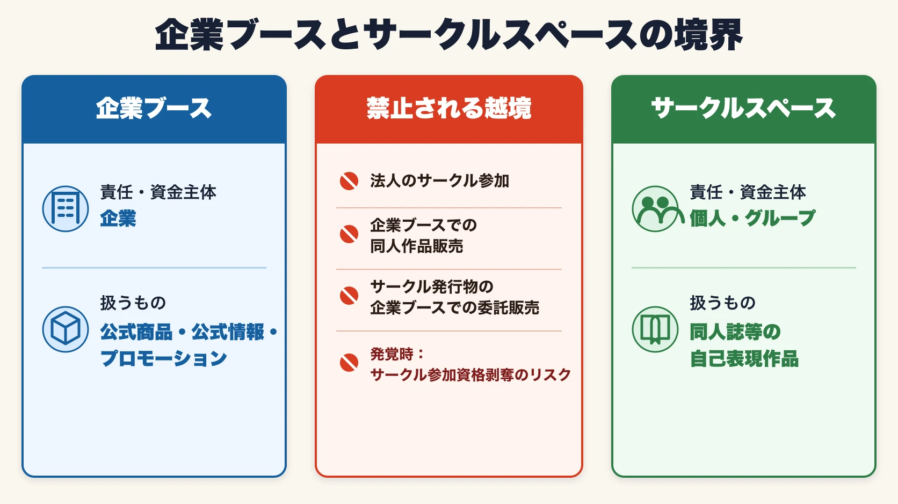
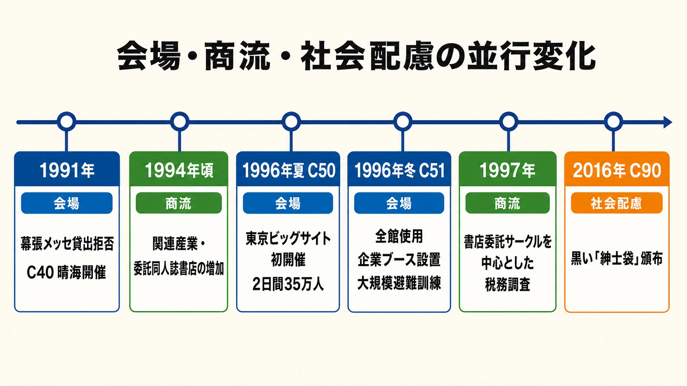

# コミケへの企業ブース参入――理念と流儀、メリットと懸念点

## 1. 企業も「参加者」の一人として場をつくる

コミックマーケット準備会は、サークル、一般来場者、スタッフ、企業をいずれも対等な「参加者」と位置づけている。会場に「お客様」はおらず、参加者が互いに協力して場を成立させるという考え方である。コミックマーケット（以下、コミケ）へ企業ブースを出すことは、大規模な集客イベントへ出店するだけの行為ではなく、この参加者の一人に加わることを意味する。企業にも、事前にルールを理解し、マナーとモラルに基づいて自律し、他の参加者へ配慮することが求められる。[[1](#ref-1)]

この前提を外すと、企画判断を誤りやすい。限定グッズの売上やSNS上の話題量だけを成功指標に置けば、過大な待機列、刺激の強い配布物、会場外へ持ち出される広告表現など、イベント全体へ転嫁した負荷を見落とすからである。企業ブースは公式な商品・情報をファンへ直接届けられる一方、同人誌即売会の文化と運営の中に置かれる以上、一般的な展示会とは異なる流儀を持つ。

本稿では、企業ブースが準備会側の働きかけによって始まった経緯を確認し、企業参加の線引き、会場運営との関係、ファン接点と収益の利点、表現上の懸念を整理する。同人ゲームとコミケの作品史は「[同人ゲームの系譜：日本のコミックマーケット文化が育てたゲームたち](doujin-game-history-comic-market-culture.md)」で扱っているため、ここでは会社所属のゲームプランナーが出展企画を判断するための運営論に範囲を絞る。

***

## 2. 企業ブースの起源――1996年冬のC51で、準備会はなぜ企業を招いたか

### 幕張から晴海へ戻った1991年

企業ブースの成立には、コミケが会場を確保し、社会へ説明しながら継続してきた前史がある。1989年の宮崎勤事件後、漫画やアニメの愛好者を一括して危険視する報道と「有害コミック」問題が広がった。そうした社会状況の中、1991年には無修正の同人誌が千葉県警へ送られ、警察の事情聴取を受けた幕張メッセ側が会場貸出を中止した。コミケは同年夏のC40を急きょ東京国際見本市会場、通称「晴海」へ変更し、見本誌確認などの条件の下で開催した。[[2](#ref-2)][[3](#ref-3)]

この出来事は「宮崎事件だけが直接の理由で追放された」と単純化すべきではない。背景には事件後のバッシングと有害コミック問題があり、会場使用拒否へ至る直接の契機として、無修正同人誌をめぐる通報と警察対応があった、と段階を分ける必要がある。コミケはC40からC49まで晴海で開催を続け、1995年冬のC49が晴海全館を使う最後の通常開催となった。[[2](#ref-2)][[4](#ref-4)]

### C50の混乱を受け、C51で全館使用へ

1996年夏のC50は、東京ビッグサイトへ移って初めてのコミケだった。8月3日・4日の2日間に35万人が参加し、東西の移動や併催イベントとの調整で多くのトラブルが起きたと公式年表は記録している。[[4](#ref-4)] 同年冬のC51は、その経験を受けて会場全体の使い方を組み直した開催となった。東1～6ホールと西1～2ホールをサークルに充て、西展示棟4階の西3ホールへ12社の企業ブースを置き、有明で初めて全館を使用するイベントになった。C51の開催日は12月28日・29日、参加者数は22万人である。[[4](#ref-4)][[5](#ref-5)]

したがって、35万人だったのは企業ブース初設置のC51ではなく、その直前に東京ビッグサイトで初開催したC50である。C50の混乱が運営上の直近の課題となり、C51の全館使用と企業ブース設置へつながった、という順序である。

### 権利者とファンの距離を縮めるための招待

企業ブースの立ち上げを担当した準備会共同代表の安田かほる氏は、2024年のオーラルヒストリーで二つの狙いを語っている。一つは、西展示棟4階が同人誌の搬入に不向きだったため、サークル以外の用途で活用すること。もう一つは、企業にコミケと参加者を理解してもらうことだった。安田氏は、参加者が本を作るだけでなく、映像ソフト、グッズ、ムックも買う人々であり、企業作品の「一番のファンである」ことを知ってもらう必要があったと説明する。[[6](#ref-6)]

当時は、企業が二次創作を「作品を勝手に使う行為」と警戒する距離感もあった。安田氏は、企業と参加者が互いを敵と見続ける状況を変えるため、自ら企業ブースを立ち上げ、出展企業を待つだけでなく、関係先へ声をかけ、コミケとしては珍しい営業にも出向いたと振り返っている。企業ブースは企業側が一方的に同人誌即売会へ進出したものではない。準備会が、権利者とファンの相互理解をつくるために企業を能動的に招き入れた制度だったのである。[[6](#ref-6)]

***

## 3. 企業も参加者の一人にすぎない――ルール、マナー、同人活動との線引き

コミケの理念は、企業参加者にも他の参加者と同じ協力を求める。企業名や出展料は、会場内で優先的に振る舞う権利を与えない。列の形成、スタッフの指示、防災、搬入出、撮影、音量、掲示、年齢区分、頒布物の内容など、開催回ごとの要項と現場判断に従う必要がある。[[1](#ref-1)]

同時に、企業とサークルの活動は明確に分けられている。2026年夏のC108コミケットアピールは、法人がサークルとして参加すること、法人が制作または制作資金を負担した物をサークルスペースで頒布することを認めていない。反対方向にも線が引かれ、企業ブースで同人作品を販売することは禁止されている。サークル発行物を企業ブースで委託販売した場合、その活動を同人活動と認めず、以後のサークル参加を断る場合があるとしている。[[7](#ref-7)]

ここで区別されているのは、作品の上手下手やプロ・アマチュアという肩書ではなく、誰が責任と資金を持ち、どの立場で頒布するかである。企業ブースは、権利者や販売主体が明確な公式商品、公式情報、プロモーションを扱う場所である。サークルスペースは、個人・グループが趣味を基本として自己表現を行う場所である。会社所属のクリエイターが個人活動をしている場合でも、会社の予算、製造、広報、販売経路と接続すれば、この境界を慎重に確認しなければならない。

ゲーム会社が同人作品を「ファンとのコラボ商品」として企業ブースへ持ち込む企画は、特に注意が必要である。著作者の許諾を得たかどうかだけでなく、コミケ上の同人活動と企業活動の区分に合うかを準備会へ事前確認する必要がある。法的に販売できることと、その参加区分で頒布できることは別問題である。

***

## 4. 企業ブースを会場全体の運営ロジスティクスに位置づける

企業ブースが西展示棟4階に置かれた理由は、会場運営上の制約への対応にある。安田氏の説明では、1階と4階を結ぶ搬送手段が限られ、サークルが自力で本を運ぶには負担が大きかった。商品搬入を計画的に組める企業を配置することで、使いにくい上階を活用し、サークルを主とする即売会全体の収容効率を高められた。目立つ場所を企業へ優先配分した結果ではない。[[6](#ref-6)]

C51では、一部サークルも参加する大規模な避難訓練が行われた。全館使用、企業ブースの設置、避難訓練は別々の話ではなく、新会場で数十万人を安全に受け入れる運営再設計の一部だった。準備会の体制図でも、企業ブースの運営と出展企業対応は、館内外の誘導、救護、搬入、公共機関・会場・警備会社との調整などと並ぶ一部署として位置づけられている。[[2](#ref-2)][[5](#ref-5)]

会場外の商流も同時期に変化した。準備会の公式資料は、1994年頃から関連産業が増え、委託販売を中心とする同人誌書店が開店したこと、1997年には書店委託を行うサークルを中心に税務調査が入ったことを記録している。[[2](#ref-2)] 税務調査は企業ブースを対象とした出来事ではない。しかし、趣味の頒布と継続的な商流が接続するほど、売上、経費、在庫、責任主体を外部へ説明できる状態が必要になることを示した。

企業には、この説明責任が初めからある。売上処理、消費税、決済、在庫、警備、スタッフの労務、個人情報、商品事故への対応を、「コミケという祭りだから」という理由で曖昧にできない。さらに、企業ブースの行列や搬入が他地区の避難経路と人流へ影響する以上、自社ブースだけの最適化では足りない。運営ロジスティクスへどう収まるかまで含めて出展計画を作る必要がある。

***

## 5. 企業参加のメリット――ファンとの接点、グッズ収益、広がる参加主体

### 公式がファンの熱量へ直接触れられる

企業ブースの第一の利点は、作品を強く支持する人へ公式が直接接触できることにある。安田氏は、企業ブースでグッズを買った参加者が、後日そのTシャツを着て再訪したという出展者の経験を紹介している。購入者は商品を受け取るだけでなく、自分がその作品のファンであることを行動で示す。企業側も、その反応を売上表だけでは得られない具体的な人物像として受け取れる。[[6](#ref-6)]

ゲームプランナーにとって、この接点はユーザー調査の代替ではないものの、仮説を持ち帰る観察機会になる。どのキャラクターへ列ができるか、実用品と鑑賞品のどちらが選ばれるか、既存ファンが何を説明せず理解するか、初見の人がどこで足を止めるかを、企画、物販、コミュニティ、広報の担当者が同じ場で確認できる。

### グッズ収益は「売上」ではなく貢献利益で見る

限定・先行グッズは、来場理由をつくり、作品との物理的な接点を増やし、直接売上を得られる。ただし、完売をそのまま成功とみなすべきではない。出展料、造作、製造、輸送、決済、警備、スタッフ、事後通販、売れ残り、欠品による機会損失まで含めた貢献利益で評価する必要がある。

数量を絞って行列と希少性をつくる施策は、話題を生む一方で、長時間待った参加者の体験と会場の人流へ負荷を移す。目的が収益なら適正在庫と販売速度を、ブランド接点なら展示・配布・会話の到達数を、ファン理解なら観察項目と振り返り方法を先に決めるべきである。一つのブースへ複数の目的を載せる場合も、優先順位がなければ現場判断が崩れる。

### ゲーム・アニメ会社以外も参加できる

企業ブースの参加主体は、コンテンツ会社に限られない。長野県企業局は2024年、PRキャラクター「水望メグ」を活用してC104へ参加し、企業局の事業認知と高校生・大学生などへの採用広報を目的に、チラシと限定グッズを配布した。自治体の公営企業が、若い層との接点としてコミケを選んだ事例である。[[8](#ref-8)]

ボートレース多摩川も、オリジナルキャラクター「静波まつり」を軸に企業ブースへ継続的に参加している。2015年のC88では、キャラクターグッズ販売、ガールズレーサー撮影会、サンプリングを実施すると公式に告知した。[[9](#ref-9)] これらの事例が示すのは、既存のアニメ・ゲームIPを持つことが参加条件ではないという点である。参加者が関心を持てる表現や物語へ事業を翻訳し、その場に合った公式体験として提示できるかが問われる。

企業ブースを通常のマス広告と同じように使えば、場違いな宣伝になりやすい。長野県企業局はキャラクターと衣装、ボートレース多摩川はキャラクターと物販・出演者を用意した。いずれも、組織名を掲げるだけでなく、参加者が手に取り、見て、語れる形へ変換している。ゲーム会社でも、新作PVを流すだけでなく、ファンがその場で何を発見し、持ち帰り、他者へ話せるかまで設計する必要がある。

***

## 6. 企業ブース特有の懸念点――紙袋問題と「紳士袋」という民間発の解決策

企業ブースや大手サークルでは、購入特典や広告媒体として大型紙袋が配られてきた。紙袋は会場内で繰り返し目に触れるため、ブース外まで届く広告になる。その一方、成人向け作品などの刺激が強い図柄を大きく印刷し、受け取った参加者が隠さずに公共交通機関や市街地を移動することが、周囲への配慮を欠くのではないかと長く問題視されてきた。[[10](#ref-10)]

2016年のコミックマーケット90では、同人誌印刷会社の共信印刷が、紙袋へ上から被せる不透明な保護カバー「紳士袋」を企業ブース内の国際交流コーナーで配布・頒布した。雨や埃だけでなく「人の視線」からも紙袋を守るという発想で、黒い厚手の素材により中の図柄が透けず、上からも見えにくい構造だった。[[10](#ref-10)]

ただし、C90が最初の試みだったわけではない。共信印刷は取材に対し、紙袋持ち帰りの問題を数年前から把握し、約3年前のコミケから紳士袋を扱っていたと説明している。当初の白い素材では図柄が透けたため、黒いビニールへ改良した。2016年の事例は、民間の印刷会社が問題を発見し、運用しながら改善した解決策として捉えるのが正確である。[[10](#ref-10)]

この工夫は有用だが、出展企業が刺激の強い紙袋を作り、参加者や印刷会社へ隠す責任を委ねてよいという意味ではない。企業が検討すべき順序は、まず公共空間へそのまま持ち出されても問題のない外装にすること、必要なら無地の外袋や折りたためるカバーを同時に渡すこと、成人向け商品の年齢確認と売り場表示を整えること、配布物の表裏と持ち歩かれ方まで確認することである。

ここでいう配慮義務は、すべての紙袋へ一律に課された特定の法的義務を指すものではない。公式企業として、会場内外の一般来場者、交通機関、近隣地域、イベント全体の継続へ負う運営上・ブランド上の責任である。企業ブースの表現は「受け取ることを選んだファン」だけに届くのではない。その場へ来ていない人の目にも触れるため、同じ図柄でも商品本体、ブース内掲示、持ち帰り用外装では判断を分ける必要がある。

***

## 7. まとめ――企業参加を判断する確認表

企業ブースは、準備会が企業と参加者の距離を縮め、使いにくい会場区画を運営へ組み込み、コミケ全体を継続するために設けた参加区分である。会社がコミケの外から市場を取りに来るための特設売り場ではない。ブランド接点、グッズ収益、ファンの熱量を体感する機会は大きいが、それらはルール、安全、同人活動との線引き、公共空間への配慮を満たした上で得る成果である。

出展を企画する際は、次の確認表を、企画、物販、広報、コミュニティ、法務、総務・安全管理の共通資料として使うとよい。

| 判断領域 | 確認する問い | 実務上の判断 |
|---|---|---|
| 目的 | 売上、認知、既存ファンとの交流、潜在層への接触、ユーザー理解のどれを優先するか | 主目的を一つ、補助指標を二つ程度に絞り、完売やSNS投稿数だけで評価しない |
| 場との適合 | 参加者が手に取り、見て、語れる体験へ自社の事業・作品を翻訳できているか | 通常の展示会資料を持ち込むだけなら、コミケで行う理由を再検討する |
| 参加区分 | 頒布物は企業が責任を持つ公式商品・公式施策か。同人作品を委託販売しようとしていないか | サークル活動と企業活動を資金、製造、責任主体、販売経路で分離する |
| 要項・現場指示 | 最新回の出展要項、搬入出、列、音量、撮影、年齢区分、防災の条件を確認したか | 過去回の運用を前提にせず、準備会の企業対応窓口と事前に合意する |
| 商品計画 | 製造数、販売速度、決済、在庫、事後通販、返品・不良対応を設計したか | 売上ではなく、全費用と残在庫を含む貢献利益で判断する |
| 人流と安全 | 待機列が避難経路や周辺ブースを圧迫しないか。中断・完売時の案内を用意したか | 整理券、購入上限、列の分割、中止条件、緊急時の権限者を決める |
| 表現と外装 | 商品、掲示、紙袋が、誰の目に、どの場所で触れるかを確認したか | 会場外へ持ち出される外装は公共空間基準で確認し、必要なら無地の外袋を用意する |
| ファンとの関係 | 一方的な広告ではなく、参加者への敬意と還元があるか | 限定性だけで煽らず、説明、交流、事後通販などアクセスの公平性を検討する |
| 社内責任 | 当日の列、安全、商品、広報、苦情、会計について誰が最終判断するか | 部門横断の責任表と連絡網を作り、現場責任者へ中止権限を渡す |
| 振り返り | 売上以外に、接触、反応、混雑、苦情、再訪、運営負荷を記録できるか | 次回出展の可否を、ファン価値と会場へ与えた負荷の両面から判断する |

最終的な問いは、「コミケで何を売れるか」ではなく、「企業参加者として、この場へ何を持ち込み、どの負荷を引き受け、参加者へ何を返せるか」である。この問いに具体的に答えられる企画であれば、企業ブースは短期の物販売上を超え、作品とファンの関係を更新する場になり得る。

## References

1. [コミックマーケットの理念と実相][1] - コミックマーケット準備会による公式説明。企業を含む全員が対等な参加者であり、ルール、マナー、相互配慮の下で場を運営するという位置づけ。

2. [コミックマーケットは何か？][2] - コミックマーケット準備会の公式資料。1989年以降の社会状況、1991年の会場変更、1994年頃の関連産業・委託同人誌書店の増加、1997年の税務調査、準備会の運営体制を収録。

3. [同人誌と表現を考えるシンポジウム――「貧しい漫画」が向き合ってきた自由と責任と][3] - 2007年のシンポジウム報告。無修正同人誌をめぐる通報、警察の事情聴取、幕張メッセの会場貸出中止の経緯。

4. [コミックマーケット年表][4] - コミックマーケット準備会による公式年表。C40、晴海最終期、C50の2日間35万人と混乱、C51の全館使用・企業ブース12社・参加22万人を確認できる。

5. [コミックマーケット30周年史・C50～C57][5] - コミックマーケット準備会による公式記録。C51の企業ブース設置と、一部サークルが参加した大規模避難訓練の記録。

6. [安田かほる・市川孝一 オーラルヒストリー][6] - ZEN大学コンテンツ産業史アーカイブ研究センターによる2024年11月7日のインタビュー。西展示棟4階の活用、企業への働きかけ、参加者を「一番のファン」と伝える狙いを安田氏が証言。

7. [C108コミケットアピール][7] - コミックマーケット準備会による2026年夏開催向けの公式要項。法人のサークル参加と企業ブースでの同人作品販売を禁止する線引き。

8. [長野県企業局「水望メグ」の3次元化による広報について][8] - 長野県公式資料。C104での企業局PR、限定グッズ配布、若年層への認知・採用広報という参加目的。

9. [ボートレース多摩川がコミックマーケット88へ出展][9] - BOAT RACE公式サイト。オリジナルキャラクターを用いたグッズ販売、撮影会、サンプリングの実施内容。

10. [紙袋持ち帰りのマナー問題と「紳士袋」][10] - ねとらぼによる共信印刷への取材。C90での配布・頒布、黒い不透明素材への改良、約3年前からの試行を確認できる。

[1]: https://www.comiket.co.jp/info-c/IdealsAndVision.html
[2]: https://www.comiket.co.jp/info-a/WhatIsJpn201401.pdf
[3]: https://www.itmedia.co.jp/news/article/0705/28/1070528015/3
[4]: https://www2.comiket.co.jp/archives/Chronology.html
[5]: https://www2.comiket.co.jp/archives/30th/30th_187_217.pdf
[6]: https://zen.ac.jp/harc/archives/modern_history/oral_history/contents/05_009
[7]: https://www.comiket.co.jp/info-c/C108/C108Appeal.pdf
[8]: https://www.pref.nagano.lg.jp/kigyo/kensei/soshiki/shingikai/ichiran/kigyo/documents/shingikaisiryou1.pdf
[9]: https://www.boatrace.jp/owsp/sp/site/stadium_info/2015/08/2189/
[10]: https://nlab.itmedia.co.jp/cont/articles/3257288/

----

この文書は、Perplexity、Claude、OpenAI Codex の3つのAIの支援を受けて著述されたものです。引用画像を除き、MIT License にて提供されています。
