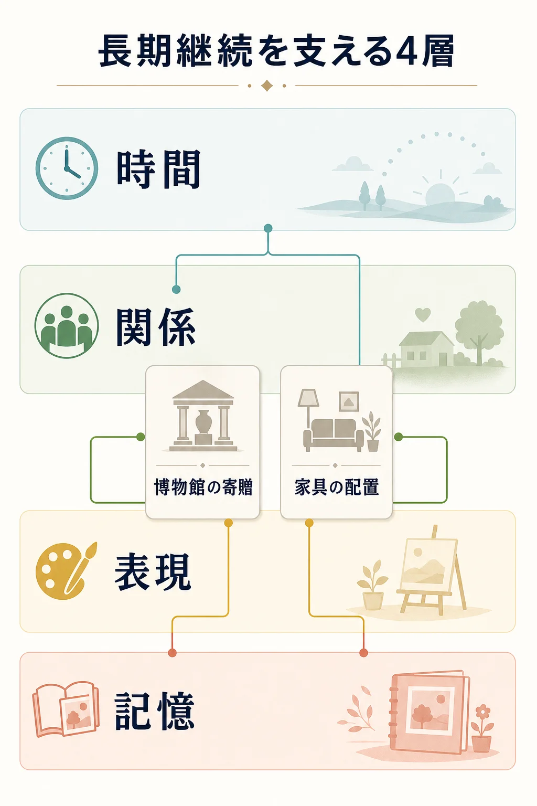
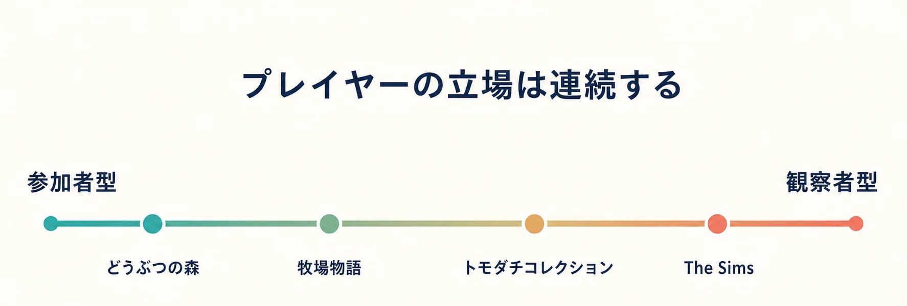
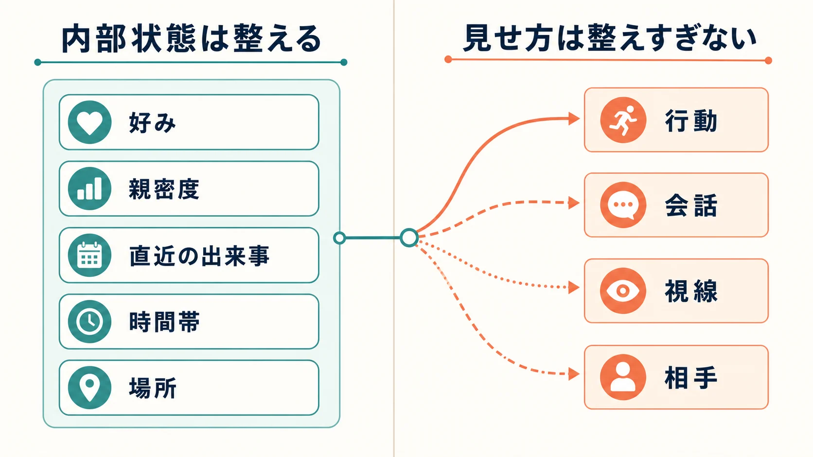
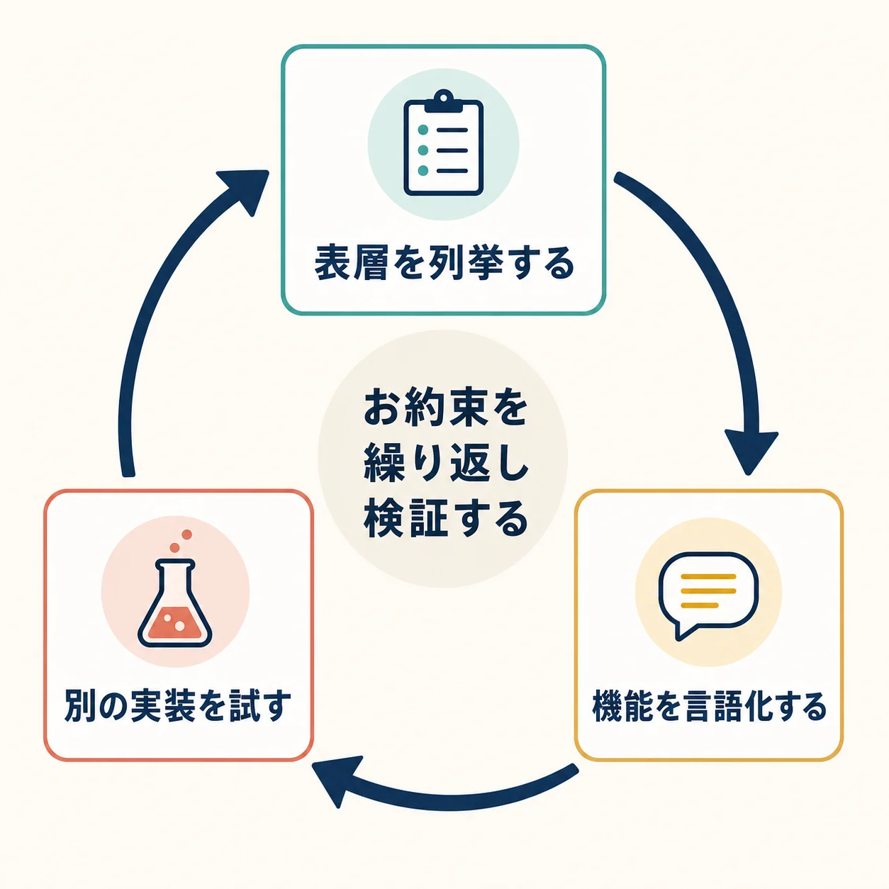

# 勝利条件がない生活シミュレーションはなぜ続くのか――「どうぶつの森」と「トモダチコレクション」から考える長期継続設計

明確なラスボスも、エンディングへ至る一本道の目標もない。それでもプレイヤーは、家具を一つ置き直し、住民の様子を少し見に行き、季節の虫を博物館へ寄贈するために何か月、何年と戻ってくる。生活シミュレーションの長期継続を「終わらないコンテンツ量」で説明すると、いつか物量競争に行き着く。しかし実際に継続を支えるのは、プレイヤーが次に何を達成すべきかではなく、次に **どんな変化を見たいか、どんな暮らしを残したいか** を自分で選べる設計である。

任天堂は「どうぶつの森」をコミュニケーションゲームと案内し、「トモダチコレクション 新生活」には「そっくりトモダチコミュニケーション」という固有のジャンル名を用いている。[[1](#ref-1)][[2](#ref-2)] 本稿ではこの公式呼称を尊重したうえで、両シリーズ、牧場経営を中心とする「牧場物語」、人生を演出する The Sims を比較するための分析上の上位カテゴリを **生活シミュレーション** と呼ぶ。「コミュニケーションゲーム」は任天堂の2シリーズを説明する固有の呼称であり、牧場物語や The Sims にそのまま当てはめない。

***

## 先に結論：終点の代わりに「戻る理由」を積み重ねる

勝利条件のないゲームに必要なのは、無限の作業ではない。プレイヤーが離れている間にも意味が保たれ、再訪時に小さな選択が生まれる状態である。設計を分解すると、長期継続は次の4層で成立する。

1. **時間の層**：季節、店の品ぞろえ、住民の生活、作物の成長が変わり、今ログインする理由をつくる。
2. **関係の層**：住民、家族、フレンド、または自作のキャラクターとの関係に、観察したくなる未確定さを残す。
3. **表現の層**：家具、服、Mii、家、島、牧場を通じて、「自分のデータ」を自分の語りに変える。
4. **記憶の層**：収集物や部屋、写真、出来事が過去の選択を保存し、戻ったときに再解釈できる。

この4層は独立した機能リストではない。たとえば博物館の寄贈は、虫や魚を捕る短期行動を、季節に結びつけ、収集履歴として残し、友人との会話の題材にもする。家具はカタログ上の収集物であると同時に、部屋の演出素材であり、来訪者に見せる自己紹介にもなる。1つの要素に複数の役割を持たせることが、勝利条件を置かずに密度を高める鍵である。

  

***

## プレイヤーは誰として暮らすのか：参加者型と観察者型

生活シミュレーションでは、プレイヤーの立場が反復行動の感情を決める。本稿では、自分の分身の生活を引き受ける設計を **参加者型** 、独立したキャラクター群を見守り、ときどき介入する設計を **観察者型** と呼ぶ。実際の作品は連続体であり、どちらか一方だけではない。重要なのは、プレイヤーの「責任」と「期待」をどちらに寄せるかである。

| 作品・シリーズ | 主な立場 | 継続の中心 | 設計上の強み | 注意すべき失速 |
| --- | --- | --- | --- | --- |
| どうぶつの森 | 参加者型。村・島の住人として家とローンを持ち、暮らしをつくる | 自分の空間、季節の発見、住民との日常 | 所有と居住感が強く、「ここに帰る」が生まれやすい | 義務的な日課が前面に出ると、のんびりした居住感が損なわれる |
| トモダチコレクション | 観察者型。Miiを住まわせる島の管理人 | 人間関係、予測不能な出来事、Miiの反応 | プレイヤー本人を直接の失敗から離し、笑いや会話を生みやすい | 介入が強すぎると、住人が自律して見えなくなる |
| 牧場物語 | 参加者型。牧場主として生産と生活を回す | 作物・動物・加工・町との関係 | 行動の投入が収穫や牧場の成長として見え、手応えが明快 | 最適化が支配すると、生活より作業計画だけが残る |
| The Sims | 演出者・管理者型。Simの人生、家、関係を設計・操作する | 人生の試行、家づくり、自己生成する物語 | キャラクターと空間を横断して仮説を試せる | 統制しすぎると、予想外のドラマが起きにくい |

「どうぶつの森」は、プレイヤーが引っ越してきた住人として、釣り、部屋づくり、家の拡張を自分のペースで選ぶ。任天堂の紹介でも、現実と同じリズムの時間の中で村の生活を自由に組み立てる作品として説明されている。[[1](#ref-1)] つまり観察対象であるどうぶつたちがいても、感情の主語は「自分の暮らし」である。

対して「トモダチコレクション わくわく生活」は、公式に「島の管理人」として住人を見守り、ときどき相談に乗る遊びとして提示される。[[3](#ref-3)] Miiをつくる時点でプレイヤーは強く作者であるが、Mii同士の友情、けんか、恋愛までを完全に脚本化するわけではない。プレイヤーが笑う対象は「自分が失敗した」ことより、「知っている人に似せたMiiが、なぜそんな行動をしたのか」という意外性になる。

The Sims は、Simの外見、性格、願望、家をつくり、人生を操作・演出する幅が大きい。EAも Create-a-Sim と Build を中心に、感情、人生目標、家、関係を形づくるゲームとして説明している。[[4](#ref-4)] これは観察者型に近いが、操作対象の人生へ深く手を入れるため、プレイヤーは管理者であると同時に共同作者でもある。

企画の初期に決めるべき問いは、「プレイヤーに責任を背負わせたいのか、それとも発見者にしたいのか」である。収益や成長の手応えを主軸にするなら参加者型が合う。キャラクターの魅力や出来事を人に話したくなる体験を主軸にするなら、観察者型を基点にし、介入はきっかけづくりへ絞るほうがよい。

***

## 時間を何に使うか：現実のカレンダーと、プレイ中の一日

リアルタイムは単に「待たせる仕組み」ではない。現実のカレンダーとゲーム内の変化を結び、プレイヤーの記憶に日付の文脈を与える仕組みである。「おいでよ どうぶつの森」は、現実と同じリズムの時間、四季の景色、季節ごとのイベントを明記している。[[1](#ref-1)] 「トモダチコレクション わくわく生活」も、現実と同じ時間が流れ、見ていない間にも住人が生活を続けると案内する。[[3](#ref-3)]

この時間軸では、平日の帰宅後に夜の島を歩く、休日の午前に店をのぞく、といった現実の習慣がゲームへの入口になる。全要素を一気に回収できない制約はあるが、その代わり「今日は何が変わったか」を確かめる余地が残る。プレイしない時間も、住民が暮らしていたと感じられることが、居住感を支える。

一方で「牧場物語」の牧場生活は、ゲーム内の一日をプレイの中で回す時間設計である。公式サイトが示す一日の例では、午前6時の起床から動物の世話、畑仕事、加工、住人との交流を経て、午後9時59分の就寝へ進む。[[5](#ref-5)] この設計の報酬は、短いセッションの中で「今日の作業計画を立て、どこまでやり切るか」を考えられる点にある。作物の世話と町への外出が同じ一日に競合するため、時間は没入感だけでなく、選択のコストとして働く。

どちらが優れているかではなく、約束する体験が違う。

| 時間設計 | プレイヤーの問い | 向く体験 | 主要な設計リスク |
| --- | --- | --- | --- |
| 現実連動 | 「今日は何が起きているだろう」 | 生活への帰還、季節感、他者と同じ日付を共有する会話 | 欠席の不安、特定時間に遊べない人の取りこぼし |
| プレイ時間進行 | 「今日のうちに何を優先しよう」 | 計画、段取り、成長の圧縮、短い達成感 | 最適解の反復、作業量による疲労 |

現実連動を採用するなら、欠席を罰しないことが特に重要である。限定品を逃した損失ばかりを強調すると、生活を写すはずの時間が不安の装置になる。代替入手、後日の再会、イベントの思い出を残す仕組みを用意し、「取り逃し」より「次に会える」を感じさせたい。逆にプレイ時間進行なら、一日の終わりに小さな区切りをつくり、無限の最適化ではなく、明日の選択が変わる状態を残すべきである。

***

## 会話がゲームの外へ伸びるとき

「どうぶつの森」のコミュニケーションは、同期マルチプレイだけを指さない。初代から、同じ村に住む複数のプレイヤーが手紙や掲示板を使い、同時に遊べないこと自体を非同期の伝言へ変えていた。[[6](#ref-6)] 任天堂の開発者インタビューでは、帰宅の遅い父親と子どもが、ゲーム内の手紙と欲しかった品を介してやり取りした事例が語られている。開発者は、遊ぶ人の環境や時間を想像していたと振り返る。[[7](#ref-7)]

2014年のGDC講演を報じた記事でも、シリーズ開発陣は、現実と同じ時間軸、手紙、プレゼントを、現実世界のコミュニケーションの種として設計し、重要なのはその連鎖を生むことだと説明した。[[8](#ref-8)] ここでの「種」は、会話そのものを強制する機能ではない。相手に「この家具が出た」「あの住民が引っ越した」「この服を贈った」と言いたくなる、具体的な対象をゲーム内に置くことだ。

「トモダチコレクション」も同じ方向を、別の手段で実現する。身近な人に似せたMiiを入れることで、出来事は最初から現実の関係と接続している。開発者は、出来事を「あの人、こんなことしていたよ」と家族や友人との話題にしてほしいと語っている。[[9](#ref-9)] ここでは贈り物の交換よりも、観察結果の共有が会話の種になる。

プランナーは、ソーシャル機能を「フレンド招待数」で設計し始める前に、次を確認したい。

- 単独プレイの最中に、誰かへ報告したくなる一文や一場面は生まれるか。
- 共有しなくても完結して楽しいか。共有は体験の前提ではなく、余韻になっているか。
- 贈る、見せる、相談する対象は、プレイヤー固有の選択から生まれているか。
- 他者の進行速度や所有物が、比較による焦りを生む構造になっていないか。

***

## 全部を説明しないことで、キャラクターは「生きもの」になる

観察者型の核は、キャラクターの行動がプレイヤーの予測を少しだけ外すことにある。予測不能はランダム性の量ではない。プレイヤーが行動の意味を補いたくなる余白である。

「トモダチコレクション わくわく生活」の開発者は、Mii同士が同じレストランで話していても、関係性によってプレイヤーの想像が変わること、そして「あえて正しく整えすぎず」予想外が起きるバランスに力を入れたことを明かしている。さらに、ボケに対するツッコミをゲーム側で完結させず、観察するプレイヤー自身に反応してもらう意図も述べている。[[10](#ref-10)] Miiを、単なるパラメータの束ではなく、意思と人格を持つ「いきもの」と位置づける考え方である。[[10](#ref-10)]

これは実装上、「関係値が高ければ必ず仲良し演出」という整然としたルールを否定するものではない。関係値は必要だが、表示と演出を一対一で固定しない。たとえば次のように、説明可能性と余白を分ける。

- **内部状態は整える**：好み、親密度、直近の出来事、時間帯、場所などを明確に管理する。デバッグ可能性と再現性を確保する。
- **見せ方は整えすぎない**：同じ内部状態でも、複数の行動、会話、視線、相手を選べるようにする。プレイヤーが意味を読み取る余地を残す。
- **介入は決定ではなく提案にする**：出会いを後押しする、相談に答える、贈り物を渡す。関係の結末までプレイヤーが保証しない。
- **意外性に救済を持たせる**：好ましくない結果が起きても、取り返しのつかない破綻ではなく、新しい観察や関係の変化へつなげる。

The Sims の公式説明にある、感情が他のSim、行動、出来事、記憶、服や物から影響を受けるという設計も、状態と出来事を結びつけて人生の物語を増やす手法として読める。[[4](#ref-4)] ただし生活シミュレーションで必要なのは、複雑な状態機械そのものではない。プレイヤーが「あの子らしい」と受け取れる反応の一貫性と、ときどきそこから外れる驚きの配分である。

***

## コレクションとカスタマイズは、終わらない目的をどうつくるか

家具、服、虫、魚、化石、料理、Miiの顔パーツは、単に収集数を増やす報酬ではない。よいコレクションは、入手後に少なくとも一度、別の意味へ変換される。

| 変換先 | 例 | プレイヤーが得るもの |
| --- | --- | --- |
| 記録 | 博物館の寄贈、図鑑、アルバム | 「見つけた」という過去の保存 |
| 表現 | 家具で部屋をつくる、服を組み合わせる、島を整える | 自分の好みを形にする素材 |
| 関係 | 住民に似合う贈り物を選ぶ、Miiへプチ個性を渡す | 相手を観察した結果を返す行為 |
| 会話 | 珍しい物、変わった部屋、意外な出来事を見せる | 他者へ話すきっかけ |

収集品が数値の空欄を埋めるだけなら、コンプリートした瞬間に目的を失う。博物館コンプリートのような明快な中期目標は有効だが、長期継続では「収集後にどう使うか」がより重要である。家具が一度飾られて終わりではなく、季節、来訪者、気分、部屋のテーマによって再編集されるなら、同じ所持品でも次の選択が生まれる。

「トモダチコレクション わくわく生活」の開発では、アイテムを増やす物量勝負だけでは、いつか遊び尽くされるという認識から、プレイヤーがゲーム内で遊ぶ内容をつくる UGC（User Generated Contents）を活用する方針が採られた。[[11](#ref-11)] UGCは無制限の自由を提供すればよいわけではない。テンプレート、組み合わせやすい素材、見せたときに反応が返る場所を用意し、つくることが目的化しないよう、住人の生活や人間関係へ接続する必要がある。

***

## 長期シリーズは「お約束」を残すために、いったん疑う

シリーズ作品では、前作の好評要素を増やし続けるほど、安全に見える。しかし、長期シリーズにおける飽きは、コンテンツ不足だけでなく、プレイヤーが次の展開を先回りできることからも生じる。

2014年のGDC講演で「どうぶつの森」開発陣は、既存の定番を変えなさすぎた閉塞感を課題として捉え、全てを変えるのではなく、シリーズの核を探した。その結果として、コミュニケーションの連鎖を生むことを本質に据え、新しい「種」をまく考え方を示した。[[8](#ref-8)] これは「ローン」「商店」「特定のキャラクター」といった表層の継承より、プレイヤー同士や現実の生活へ話題が連鎖するという機能を守る発想である。

この見直しは、企画書では次の3段階に落とせる。

1. **表層を列挙する**：定番の施設、導線、アイテム、口調、成長順を洗い出す。
2. **機能を言語化する**：各要素が、居住感、安心、会話、収集、驚きのどれを担っているかを書く。
3. **別の実装を試す**：同じ機能を、新しいプレイヤーの立場、時間、共有方法、カスタマイズで成立させられるか検証する。

  

この過程では、古参の記憶と新規プレイヤーの入口が衝突する。だからこそ「何を戻すか」ではなく、「どんな感情を再現するか」を合意の単位にする。トモダチコレクションの開発チームが、Miiの見た目を高精細化するだけでなく、Miiらしさを保つために動きや声のリアルさを調整した例は、技術的な更新とシリーズの感触を分けて考える参考になる。[[12](#ref-12)]

***

## KPIへ落とす：滞在時間ではなく、継続の約束を測る

勝敗のない企画で、KPI（Key Performance Indicator、目標に近づいているかを測る指標）を「平均プレイ時間を増やす」だけにすると、日課の義務化や過剰な通知へ流れやすい。先に、プレイヤーが何のために戻る作品なのかを定義し、その仮説に対応する行動を見るべきである。

| 企画上の約束 | 観察したい指標の例 | 解釈時の注意 |
| --- | --- | --- |
| 自分の場所へ帰る | 週・月単位の再訪、模様替えや配置変更の継続、保存データの長期利用 | ログイン回数だけでは、通知への反応か自発的な帰還かを区別できない |
| 住人を見守る | 住人への接触、相談への反応、観察画面から起きる次の行動 | 接触回数を強制すると、観察の自発性を壊す |
| つくって見せる | カスタマイズの完成・再編集、共有前の閲覧、受け取った反応 | 公開数だけで評価すると、静かに楽しむプレイヤーを見落とす |
| 集めて残す | 図鑑・博物館などの寄贈、収集後の展示・利用 | 所持数だけでは、表現や記憶への転換が見えない |

定性調査も同じくらい重要である。プレイテストでは「何を達成しましたか」だけでなく、「誰かに話すならどの出来事か」「次に開くとしたら何を見に行くか」「自分の場所だと思えた瞬間はあったか」を聞く。とりわけ観察者型は、予測不能な出来事をログの分類だけで評価しにくい。プレイヤーが出来事に意味を与えたかを、発話や日記的な記録で確かめたい。

また、KPIは制作チームの会話を揃える道具でもある。任天堂のGDC講演では、仕様の共有だけでなく考え方の共有を重視し、担当を問わず提案を出せる体制が、多様なアイデアにつながったと報じられている。開発組織の年齢や性別などの多様性を意識し、スタッフの多様性をゲームの多様性へつなげる考えも示された。[[8](#ref-8)] さらに「トモダチコレクション わくわく生活」でも、職種を越えて投稿できるアイデア掲示板と、熱意あるスタッフが実現まで担う流れが紹介されている。[[13](#ref-13)]

生活を扱うゲームでは、作り手が想像できる生活だけを収録すると、出来事もアイテムも均質になりやすい。多様な生活経験を持つ人が、アイデアを提案し、実装へ接続できる組織設計は、表現上の配慮にとどまらない。観察したくなる出来事、地域や家族によって異なる「身近さ」、複数の遊び方を増やすための制作上の要件である。

***

## 2026年の新作から見える、生活を更新する二つの方向

2026年には、『あつまれ どうぶつの森 Nintendo Switch 2 Edition』が1月15日に発売され、マウス操作、内蔵マイク、最大12人のオンラインプレイなどを追加した。[[14](#ref-14)] 『トモダチコレクション わくわく生活』も4月16日に発売され、Miiを管理人として見守る核を保ちながら、島づくりやアイテムづくりへ表現の幅を広げた。[[15](#ref-15)] この発売時期の近さは、市場規模を直接示すものではない。しかし、生活シミュレーションが「昔ながらのゆったりした遊び」に留まらず、ハードの新しい入力・通信機能やUGCと結びつきながら再設計されていることは示している。

ここで見える方向は二つある。ひとつは、既存の生活への入口を、通信や入力の改善で広げること。もうひとつは、プレイヤーが自分の経験を持ち込める表現の素材を増やすことだ。どちらも、勝利条件を追加することではない。プレイヤーが自分の時間、関係、好みをゲームへ持ち込み、ゲームで起きたことをまた現実へ持ち帰る回路を太くする。

生活シミュレーションの企画書で最後に書くべき一文は、「プレイヤーは何をクリアするか」ではない。 **このゲームを閉じたあと、何が少し気になって、また開きたくなるのか** である。その答えが、時間、関係、表現、記憶のどこにあるかを決めれば、観察者型か参加者型か、リアルタイムかプレイ時間進行か、収集かカスタマイズかという選択も、機能の足し算ではなく一貫した設計判断になる。

## References

1. [おいでよ どうぶつの森｜任天堂][1] - 公式のジャンル表記、現実と同じ時間、自由な村の生活。

2. [トモダチコレクション 新生活｜任天堂][2] - 「そっくりトモダチコミュニケーション」という公式ジャンル表記。

3. [トモダチコレクション わくわく生活：住人とふれあう｜任天堂][3] - 管理人としての距離感、現実と同じ時間、住人への贈り物と相談。

4. [The Sims 4｜Electronic Arts][4] - Simの作成、家づくり、感情、人生目標に関する公式説明。

5. [ほのぼの牧場生活｜牧場物語 Let's！風のグランドバザール 公式サイト][5] - 牧場の一日と、世話・畑仕事・加工・交流の進行例。

6. [その1／「どうぶつの森」とは？｜任天堂][6] - 初代の掲示板、手紙、村ごとの違いを介したコミュニケーション。

7. [社長が訊く ゲームセミナー2008～『どうぶつの森』ができるまで～｜任天堂][7] - 手紙と贈り物を通じた、家族間のやり取りに関する開発者の発言。

8. [「どうぶつの森」は“シリーズの飽き”をどう克服したのか？｜GAME Watch][8] - 2014年GDC講演の報道。コミュニケーションの連鎖、シリーズの見直し、組織の多様性に関する発言を参照。

9. [開発者に訊きました：トモダチコレクション わくわく生活（第3回）｜任天堂][9] - Miiの出来事を家族や友人との話題にする意図。

10. [開発者に訊きました：トモダチコレクション わくわく生活（第1回）｜任天堂][10] - Miiを意思と人格のある「いきもの」と捉え、予想外を残す設計。

11. [開発者に訊きました：トモダチコレクション わくわく生活（第1回）｜任天堂][11] - 物量勝負を避け、UGCを活用する開発方針。

12. [開発者に訊きました：トモダチコレクション わくわく生活（第1回）｜任天堂][12] - 技術更新の中でMiiらしさを保つための試行錯誤。

13. [開発者に訊きました：トモダチコレクション わくわく生活（第3回）｜任天堂][13] - 職種を横断するアイデア掲示板と、ボトムアップの制作過程。

14. [あつまれ どうぶつの森 Nintendo Switch 2 Edition｜任天堂][14] - 2026年1月15日発売と、Nintendo Switch 2向け追加機能。

15. [トモダチコレクション わくわく生活｜任天堂][15] - 2026年4月16日発売と、島の管理人として住人を見守る基本設計。

[1]: https://www.nintendo.com/jp/titles/20010000023019.html
[2]: https://www.nintendo.co.jp/3ds/ec6j/index.html
[3]: https://www.nintendo.com/jp/switch/blfga/enjoy/index.html
[4]: https://www.ea.com/games/the-sims/the-sims-4
[5]: https://www.bokumono.com/grabaza/farm/
[6]: https://www.nintendo.co.jp/n01/n64/software/nus_p_nafj/what/index.html
[7]: https://www.nintendo.co.jp/etc/seminar2008/doubutsu/04.html
[8]: https://game.watch.impress.co.jp/docs/news/640749.html
[9]: https://www.nintendo.com/jp/interview/blfga/03.html
[10]: https://www.nintendo.com/jp/interview/blfga/index.html
[11]: https://www.nintendo.com/jp/interview/blfga/index.html
[12]: https://www.nintendo.com/jp/interview/blfga/index.html
[13]: https://www.nintendo.com/jp/interview/blfga/03.html
[14]: https://www.nintendo.com/jp/games/switch2/acbaa/index.html
[15]: https://www.nintendo.com/jp/switch/blfga/index.html

----

この文書は、Perplexity、Claude、OpenAI Codex の3つのAIの支援を受けて著述されたものです。引用画像を除き、MIT License にて提供されています。
