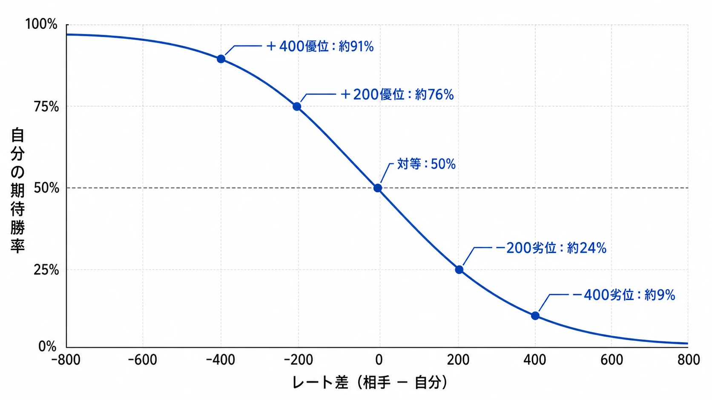
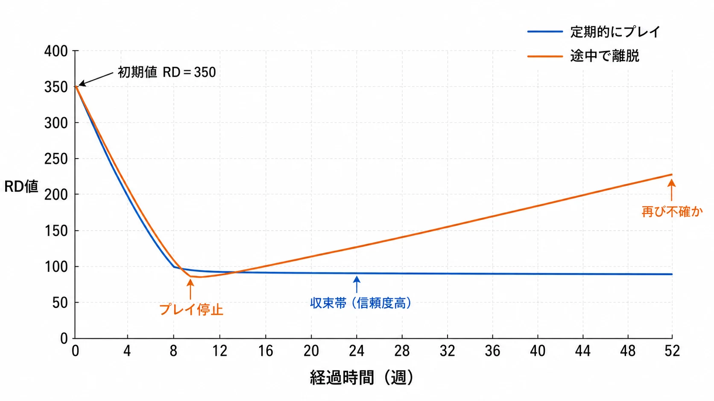
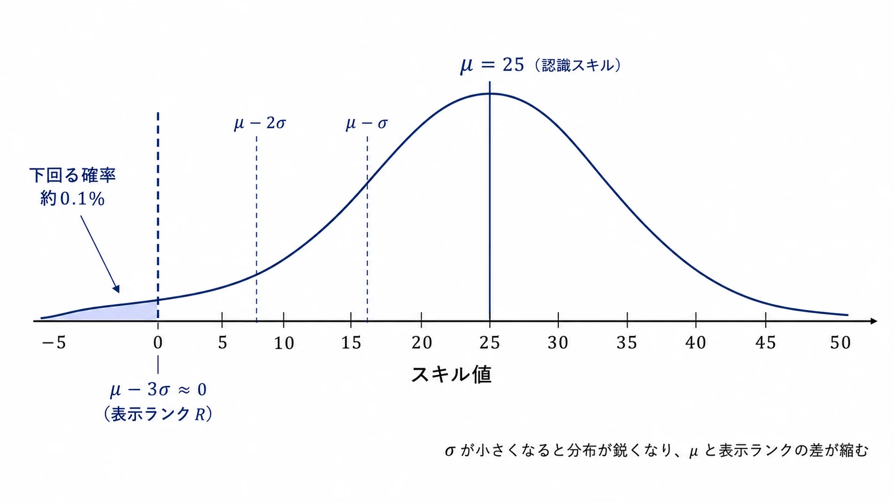
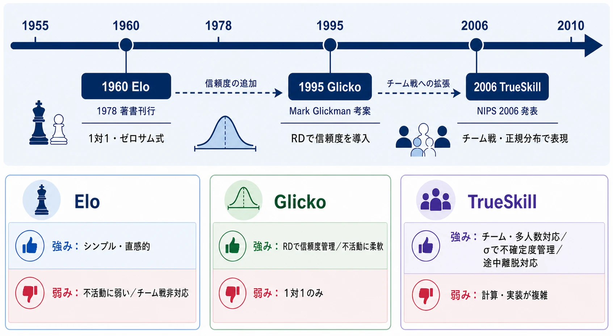
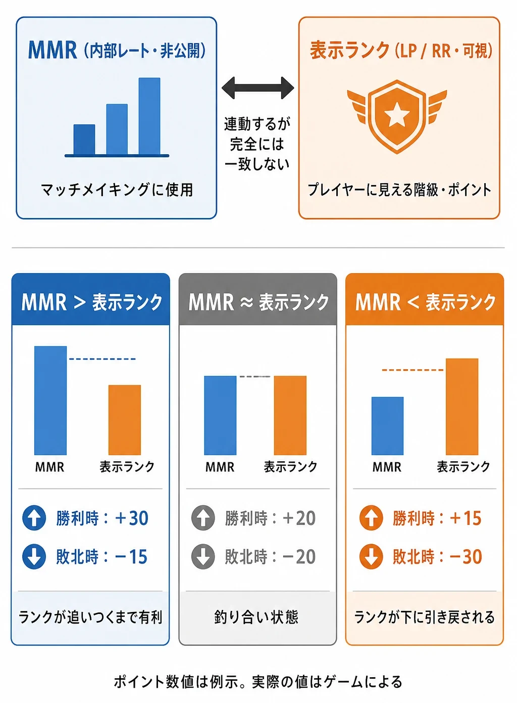
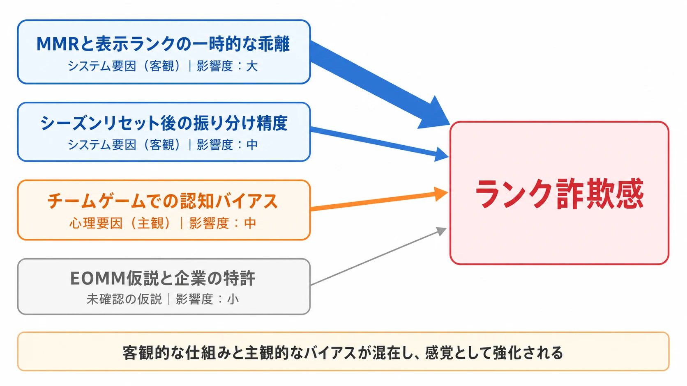
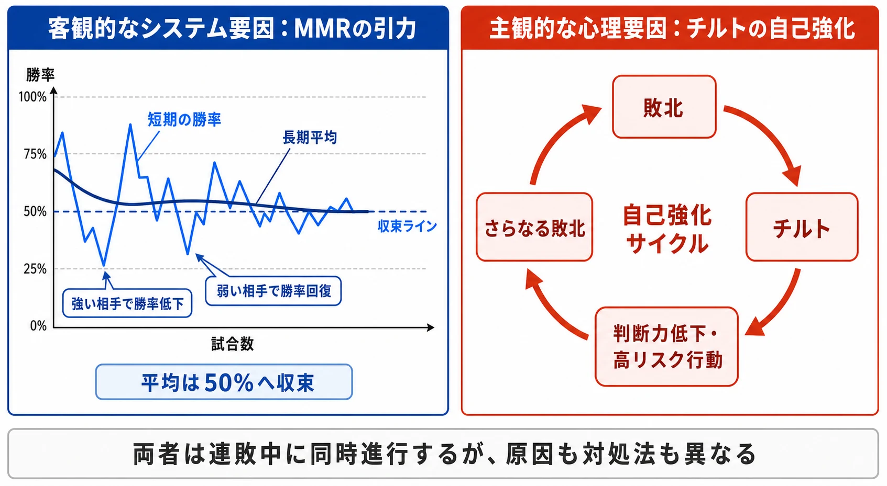
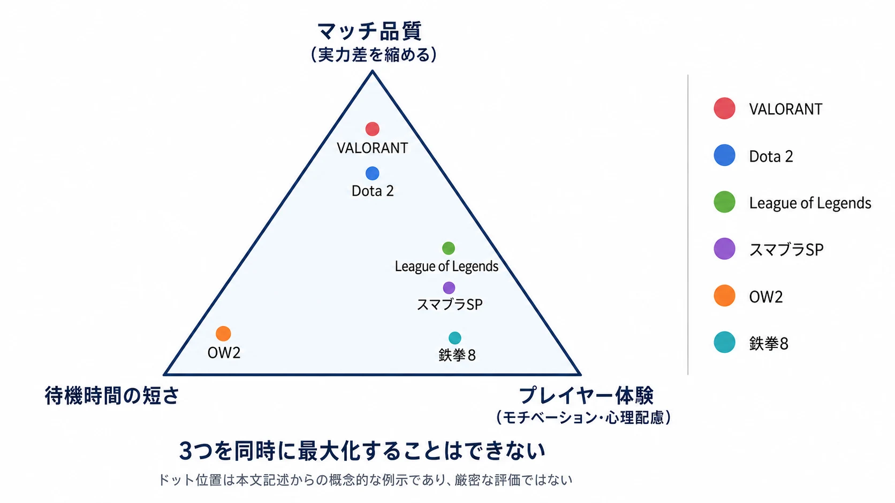

# 対戦ゲームのマッチメイキングとレーティング――仕組みと設計トレードオフ
### ──「ランク詐欺感」「連敗の沼」の正体まで踏み込む

***

## 1. はじめに：なぜマッチメイキングが重要なのか

オンライン対戦ゲームにおいて、マッチメイキングは「楽しい体験」と「ストレスフルな体験」を分ける最も重要なシステムのひとつだ。完全な実力差のある相手と戦わされ続けたり、逆に格下ばかりとマッチングしてゲームが退屈になったりすれば、プレイヤーはそのゲームから離脱する。マッチメイキングの本質的な目的は、公平で緊張感ある試合を継続して提供することにある。

ランクマッチ（ランキングバトル、レーティングバトル、段位戦など、呼び方はゲームによって異なる）が対戦ゲームに導入されている理由は、大きく2つある。

1. **自分の現在の実力を可視化し、ゲームプレイの動機とする**
2. **近い実力帯の相手とマッチングすることで、均衡した対戦を提供する**

この2点を同時に達成するために、各ゲームは複数の数値・アルゴリズムを組み合わせたシステムを構築している。

***

## 2. レーティングシステムの基礎：3大アルゴリズム

### 2-1. Eloレーティング（最も古典的な手法）

元々チェスのために考案されたEloレーティングは、現代の多くのゲームレーティングの原型となっている。米国チェス連盟（USCF）が1960年に採用し、世界チェス連盟（FIDE）も1970年に採用、考案者アルパッド・イロの著書は1978年に刊行された。基本的な考え方は以下の通りだ。[[1](#ref-1)]

$$
\text{新レート} = \text{旧レート} + K \times (\text{実際の結果} - \text{期待勝率})
$$

- **K値**：レートの変動幅を決める定数（通常10〜40程度）
- **実際の結果**：勝ちなら1、負けなら0
- **期待勝率**：両者のレート差から計算される勝つ確率

期待勝率の計算式は以下の通り：[[1](#ref-1)]

$$
\text{期待勝率} = \frac{1}{1 + 10^{(\text{相手レート} - \text{自分レート}) / 400}}
$$

これにより、 **強い相手に勝てば大きくレートが上がり、弱い相手に負ければ大きく下がる** という直感に合った動作をする。ポイントのやり取りは「ゼロサムゲーム」であり、一方が増えた分だけ相手が減る。

### 2-2. Glickoレーティング（信頼性を加味した進化版）

Glickoは、Eloの弱点である「しばらく試合をしていないプレイヤーの信頼性が不明確になる」という問題を解決するために、1995年にマーク・グリックマンが考案した。最大の特徴は **レーティング偏差（RD：Rating Deviation）** の導入だ。[[2](#ref-2)]

- RDはレートの「信頼度」を表す数値
- 対戦から時間が経つほどRDは増加し、「このプレイヤーの実力は不確か」という状態になる
- RDが大きい（信頼度が低い）状態で勝負すると、レートの変動量が大きくなる
- 新規プレイヤーの初期値は $$(R, RD) = (1500, 350)$$ で、試合を重ねるごとにRDが減少（信頼度向上）する[[2](#ref-2)]

これにより、久しぶりに戻ってきたプレイヤーが急激にレートを動かせる（実力が変化している可能性を考慮する）という柔軟性を持つ。

### 2-3. TrueSkill（チーム戦・多人数ゲーム向けの最先端）

TrueSkillはMicrosoftがXbox Liveのマッチング用に開発したアルゴリズムで、 **NIPS 2006** で発表された学術論文ベースの手法だ（プロシーディングス巻の刊行は2007年）。[[3](#ref-3)]

Eloが「1対1」を前提としているのに対し、TrueSkillは **チーム戦・多人数戦にも対応** している。プレイヤーのスキルは以下の正規分布で表現される：[[3](#ref-3)]

$$
\mathcal{N}(\mu, \sigma^2)
$$

- **$$\mu$$**：認識されているスキル（公表される数値）
- **$$\sigma$$**：スキルの不確定度（信頼性）

Xbox Liveでは新規プレイヤーの初期値は $$\mu = 25, \sigma = 25/3$$ で設定される。プレイヤーの表示ランクは、控えめな見積もりとして $$R = \mu - 3\sigma$$ で表示される。これは「実際のスキルが高い確率で表示ランク以上である」ことを担保するための設計だ（正規分布で $$\mu - 3\sigma$$ を下回る確率は約0.1%）。[[3](#ref-3)]

また、TrueSkillは **チームメンバーのスキルが異なる状況でも公平性を計算でき**、さらにプレイヤーが途中で抜けた不完全なマッチにも対応できるという高い汎用性を持つ。[[3](#ref-3)]

| 特徴 | Elo | Glicko | TrueSkill |
|------|-----|--------|-----------|
| 対応形式 | 1対1 | 1対1 | チーム・多人数 |
| 信頼度管理 | なし | RDで管理 | σで管理 |
| 不活動対応 | 弱い | 強い（RD増大） | 強い（σ増大） |
| 主な用途 | チェス・格闘ゲーム | 各種オンラインゲーム | Xbox Live・Halo |
| 論文・確立年 | 1978年（著書） | 1995年 | NIPS 2006 |

***

## 3. MMRとランクの二重構造：現代ゲームの核心

現代の主要な競技ゲームの多くは、 **「MMR（マッチメイキングレーティング）」と「表示ランク」を意図的に分離** している。この二重構造こそが、後述する「ランク詐欺感」の根本原因となる。

### 仕組みの概要

- **MMR（内部レート）**：マッチメイキングに実際に使用される隠し数値。プレイヤーからは直接見えない[[4](#ref-4)]
- **表示ランク（LP/RPなど）**：プレイヤーが目に見える形で確認できる階級やポイント。MMRと連動しているが、完全には一致しない[[4](#ref-4)]

VALORANTのシニアコンペティティブデザイナーEvrMoar氏は、ランクとMMRは別物であり、公平な対戦を組むために使われるMMRはプレイヤー自身からは確認できない、と公式に説明している。[[4](#ref-4)]

### MMRが表示ランクに与える影響

この二重構造では、MMRと表示ランクの「ズレ」が勝利・敗北時のポイント増減に影響する：[[4](#ref-4)]

- **MMRが表示ランクより高い**　→　勝利時の獲得RR量 ＞ 敗北時の喪失RR量（ランクが追いつくまで有利）
- **MMRと表示ランクが同等**　→　獲得量と喪失量がほぼ同じ（釣り合い状態）
- **MMRが表示ランクより低い**　→　敗北時の喪失RR量 ＞ 勝利時の獲得RR量（ランクが下に引き戻される）

この仕組みを理解することが、「ランク詐欺感」の正体を解き明かす鍵となる。

***

## 4. 主要タイトルのランク・レーティングシステム

### 4-1. VALORANT（FPS）

VALORANTのランクは「アイアン」「ブロンズ」「シルバー」「ゴールド」「プラチナ」「ダイヤモンド」「アセンダント」「イモータル」、そして最上位の「レディアント」の9つで構成され、最上位（レディアント）以外はそれぞれ3ティアに分かれる。なお「アセンダント」は、ダイヤモンドとイモータルの間に2022年6月に追加されたランクである。[[5](#ref-5)]

表示ランクに影響するRR（ランクレーティング）とは別に、隠しMMRがマッチメイキングを制御する。コンペティティブ（ランクマッチ）の解除には、アカウントレベル20への到達（＝一定数のアンレートマッチのプレイ）が必要だ。Riot Gamesは **「Losers Queue（敗者専用キュー）」の存在を公式に否定** しており、不公平に操作されたマッチメイキングよりも公平なマッチメイキングの方がプレイヤーはゲームを長く遊び続ける、と説明している。[[5](#ref-5)][[4](#ref-4)]

### 4-2. League of Legends（MOBA）

League of Legends（LoL）のランクはアイアン・ブロンズ・シルバー・ゴールド・プラチナ・ダイヤモンド・マスター・グランドマスター・チャレンジャーの9段階で構成され、上位3ランク（マスター以上）以外はさらに4つのディビジョンに分割される。[[6](#ref-6)]

試合の勝敗によってLP（リーグポイント）が増減し、一定のLP（おおむね100LP）で次のディビジョンへ昇格する。Riot Gamesは、MMRは試合の勝敗によって変動し、個人のパフォーマンスはMMRに直接影響しない（LoLをチームとして勝敗を分かち合うゲームと位置づけているため）と説明している。MMRが高いほど獲得LPが多く、負けで失うLPが少ない仕組みになっている。[[7](#ref-7)]

LoLには「0LP以下で連敗しても、一定数の連敗までは降格しない」設計があり、降格の判定にもMMRが用いられる。[[6](#ref-6)]

### 4-3. Dota 2（MOBA）

Dota 2は、かつてEloを改変したアルゴリズムでMMRを管理していたが、2023年4月の大型アップデート「New Frontiers」（パッチ7.33）で **Glicko系のアルゴリズムへ移行** した。現在のMMRは「Rank（実力の推定値）」と「Rank Confidence（その推定に対する信頼度）」の2つで構成され、1試合あたりの増減量は固定ではなく、両者の値などに応じて変動する。[[8](#ref-8)]

MMRから「ヘラルド」「ガーディアン」「クルセイダー」「アーコン」「レジェンド」「エンシェント」「ディバイン」「イモータル」の8ランクが決まり、イモータルのみリーダーボード制で明確な順位が公開される。各ランクの具体的なMMR閾値（例：イモータルは約5620以上）は公式には非公開で、コミュニティによる推定値である。[[8](#ref-8)]

キャリブレーション（再評価）は、かつての固定試合数方式から、Rank Confidenceが一定の閾値を超えた時点で「確定」とみなす方式へ変わった。長期間プレイしていないとRank Confidenceが低下し、復帰後しばらくは増減が大きくなる。[[8](#ref-8)]

### 4-4. オーバーウォッチ 2（FPS・チーム戦）

オーバーウォッチ 2（OW2）のMMR分布は「0.0」を中央とする釣鐘曲線で、システムはまず同じMMR値のプレイヤーを探し、一定時間内に見つからなければ探索範囲を前後に広げる（例：MMR2.0なら1.9〜2.1へ拡大）。 **「ロール・デルタ」** と呼ばれる機構が存在し、両チームのプレイヤーの実力をロール単位で揃える（例：一方のタンクがMMR1.5なら、相手のタンクにも近いMMRを割り当てる）ことで、直接交戦する相手の実力差を抑える設計になっている。[[9](#ref-9)] Blizzardは、あらかじめ勝ち負けが約束されたマッチングは存在せず、プレイヤーの勝率が50%となるように調整することもない、と明言している。[[10](#ref-10)]

### 4-5. ストリートファイター6（格闘ゲーム）

ストリートファイター6（SF6）のランク構成はROOKIE・IRON・BRONZE・SILVER・GOLD・PLATINUM・DIAMOND・MASTERの8段階で、各ランクはさらに5段階の☆に細分化される。最初の10試合（認定戦）の結果で初期ランクが決定する。[[12](#ref-12)] MASTERランクに到達するとLPとは別の **MR（マスターレート）** が適用され、CAPCOMが2025年2月に追加した上位称号により、MR1600でHIGH MASTER、1700でGRAND MASTER、1800でULTIMATE MASTERへ昇格する（具体的なMR閾値は大手解説記事による）。MASTERからの降格がない設計により、「降格フラストレーション」を防いでいる。[[11](#ref-11)][[12](#ref-12)]

### 4-6. 鉄拳8（格闘ゲーム）

鉄拳8は、基本の30段（入門生〜破壊神）に加え、シーズン2で最高段位「破壊神」の上位に8段（破壊神 壱〜漆、および破壊神∞）が追加され、計38段の段位構成を持つ。初級〜中級帯（剛拳まで）は負けても段位ポイントが減らず、降格なしで段位を上げられる。[[13](#ref-13)]

シーズン3（Ver.3.00）では段位システムが大きく見直され、マッチングの参照基準を「自分の使用キャラクターのうち最も高い段位」から **「使用中のキャラクターの段位」** へ変更した。これにより、高ランクプレイヤーが低段位のサブキャラクターで格下と当たる、いわゆる「サブキャラ狩り」の緩和が図られている。[[13](#ref-13)]

同アップデートでは、昇格ボーナスを昇格のたびに付与する方式へ変更し、連勝ボーナス（武神までの段位帯で、3連勝以降に連勝数に応じて増加）やリベンジ（再戦勝利）ボーナスを調整した一方、連敗による追加ペナルティは設けられていない。また、降格圏に達しても2連敗するまでは降格しないよう降格条件が緩和された。マッチングの既定のランク制限も広げられ（破壊神以上では段位差±1までを同段扱い）、深夜帯などでもマッチングが成立しやすくなっている。[[13](#ref-13)]

***

## 5. 大乱闘スマッシュブラザーズ SPECIALの「世界戦闘力」

大乱闘スマッシュブラザーズ SPECIAL（スマブラSP）が採用する「世界戦闘力」は、他タイトルのMMRシステムとは設計思想が大きく異なるユニークな仕組みだ。

### 数値の意味

世界戦闘力は **自分より下にいるプレイヤーが世界に何人いるか** を表す、絶対人数ベースの指標だ。例えば世界戦闘力が10万であれば「10万人より上の実力がある」ことを示す。これはEloやMMRのような相対的なレート差ではなく、プレイヤー数という実数に基づいているため、 **プレイヤー総数が増えるほどボーダーラインも上昇する** という特徴がある。[[14](#ref-14)][[15](#ref-15)]

### VIPマッチの仕組み

世界戦闘力が一定以上のプレイヤーのみが参加できる「VIPマッチ」は、本作のディレクター桜井政博氏が、VIP入りできればスマブラの腕前を誇れる、という趣旨で語った上級者向けモードだ。VIP入りの目安は、かつては上位3%程度とされたが、2020年8月のアップデート以降は上位5〜6%程度へ拡大したとされる（いずれも非公式の推定値であり、公式には発表されていない）。[[14](#ref-14)][[15](#ref-15)]

### 世界戦闘力の種類と対象モード

世界戦闘力には「ファイター別」と「総合」の2種類があり、複数のモードで独立した値が設定されている：[[15](#ref-15)]

| モード | 上げ方 |
|-------|-------|
| オンライン対戦（だれかと） | 勝利することで上昇 |
| 勝ちあがり乱闘 | 高いホンキ度で一度も負けずクリア（スコア連動） |
| 100人組み手 | 残りタイムが多いほど上昇 |
| オールスター/情け無用組み手 | 倒した数が多いほど上昇 |

### スマブラSPの特異性と問題点

スマブラSPの世界戦闘力はVIP入りという明確なゴールを提供する一方で、 **フレンドや専用部屋での対戦は反映されない** という設計上の制限がある。また、プレイヤー人数依存の特性から、具体的なVIPボーダーは公式には発表されておらず、参入直後はボーダーが不透明で、上位プレイヤーとマッチングして連敗しやすいという指摘もある。[[15](#ref-15)]

***

## 6. 「ランク詐欺感」が生まれるメカニズム

「ランク詐欺感」とは、 **「表示されているランクが実際のマッチング実力と乖離しているように感じる現象」** だ。この感覚はなぜ生まれるのか。

### 原因①：MMRと表示ランクの乖離

MMRと表示ランクは別物であるため、表示ランク上では「ゴールド」であってもMMRが「プラチナ相当」のプレイヤーがいる。逆も然りで、急速に昇格した直後はランクが実力より高い状態（MMR＜表示ランク）が発生しやすく、この場合は **勝利しても得るポイントが少なく、負けると大きく失う** という状態になる。[[4](#ref-4)]

これをプレイヤーが体験すると「このランク帯に来たのにポイントが全然増えない」「圧倒されるような相手と当たる」という印象を抱きやすい。

### 原因②：振り分け精度の問題（シーズンリセット後）

多くのゲームはシーズン開始時にランクリセットや降格処理を行う。しかし、MMRは直ちにはリセットされないか、または別のペースでリセットされる。結果として「表示ランクはシルバーなのに、対戦相手はMMRがゴールド〜プラチナ相当のプレイヤー」という状況が生まれる。これはシステムが適切なランクに収束させようとする過程で避けられない現象であるが、プレイヤー体験としては「不当なマッチング」に映る。[[10](#ref-10)]

### 原因③：チームゲームでの「自分だけ足を引っ張られる感」

LoLやVALORANTのような5v5のチームゲームでは、同じMMR帯でも個人パフォーマンスのばらつきが大きい。Riot GamesはLoLについて、大半のチームの予測勝率は約50%（±1%）で、データ上は公平な試合が組めていると述べているが、個人の主観では「自分以外の味方が弱い試合」が記憶に強く残るという **認知バイアス** が働く。[[7](#ref-7)]

### 原因④：EOMMの仮説と企業の特許

2016年にElectronic Arts（EA）が「EOMM（Engagement Optimized Matchmaking）」と名付けたマッチング技術の特許を申請していたことが後に報じられ、プレイヤーのプレイスタイルやゲームへの取り組み方、ゲーム内購入額などを元にマッチングを最適化する、という内容が論争を呼んだ。ただし、この特許の実装は確認されておらず、Activisionも同様の特許（課金促進を目的としたマッチング）を申請していたものの、主要タイトルの開発元はいずれも「意図的な操作は行っていない」と公式に否定している。[[16](#ref-16)]

***

## 7. 「連敗の沼」の正体

連敗の沼とは、「一度連敗が始まると抜け出せない状態が続く」という体験だ。これには複数の要因が絡み合っている。

### 要因①：MMRの統計的な引力（収束効果）

これが最も重要なメカニズムだ。連勝するとMMRが上がり、より強い相手とマッチングされるため、次の試合から勝つ確率が下がる。逆に連敗するとMMRが下がり、より弱い相手と対戦できるようになるため、再び勝てる状況に戻る。これは「操作」ではなく、 **マッチメイキングが「適切なランクへの収束」を目指した結果として自然に発生する均衡現象** だ。[[7](#ref-7)]

長期的に見れば、大多数のプレイヤーの勝率は50%付近に収束する。これが統計的な「自然な平均への回帰」だ。ただし、確率の問題として、勝率50%の試行では連敗ストリークが一定の頻度で発生するのも当然であり、プレイヤーがそれを「強制されている」と感じるのは人間心理の自然な反応だ。

### 要因②：チルトによるパフォーマンス低下

連敗するとプレイヤーは心理的に「チルト（感情的に不安定な状態）」に陥りやすくなる。チルト状態では判断力が低下し、リスクの高いプレイやコミュニケーション問題が増加する。これが実際のプレイ品質を落とし、さらなる敗北を招くという **自己強化のサイクル** を生む。連敗後半の敗北は「システムのせい」よりも「チルトによるパフォーマンス劣化」である場合が多い。

### 要因③：疲労とプレイ品質の低下

同日に長時間プレイを続けると、後半の試合では疲労によるパフォーマンス低下が起きる。これも連敗を助長する要因だが、プレイヤーはこれを「システムの悪意」として解釈しがちだ。

### 要因④：チームゲームの確率論的な問題

5人チーム対5人チームのゲームでは、「良い試合ができるか」がチームメンバーの状態にも大きく依存する。MMRが近い10人を集めても、それぞれのプレイヤーの「その日の状態（調子・集中度）」は均一ではなく、確率論的なばらつきが連続してしまうことが「連敗の沼」として体験される。

### 要因⑤：降格保護システムの逆機能

多くのゲームは降格直前に「降格保護（シールド）」を設けており、連敗しても即座にランクが下がらないようにしている。これは一見親切に見えるが、 **「本来の実力よりも高いランクに留まり続ける」状態を生む** 可能性がある。LoLでは0LPで連敗が嵩んでも一定数の連敗がないと降格しない設計になっており、この間も「強すぎる相手と戦い続ける」という体験が生まれる。[[6](#ref-6)]

***

## 8. マッチメイキングの設計トレードオフ

マッチメイキングは「マッチ品質」「待機時間」「プレイヤー体験」の3つを同時には最大化できないトレードオフの問題を抱えている。

### 品質 vs. 速度のジレンマ

厳密にMMRが近いプレイヤーだけでマッチングすれば試合の公平性は高まるが、特に人口の少ない時間帯や高ランク帯では待機時間が非常に長くなる。そのため、実際のシステムでは **一定時間内にマッチが成立しない場合、MMR許容範囲を徐々に広げる** 設計を採用している。[[9](#ref-9)]

OW2の例では、最初はMMR2.0±0で探索し、時間が経過するとMMR1.9〜2.1のプレイヤーまで対象を拡大するという段階的拡張アルゴリズムを採用している。この「時間経過による条件緩和」が、プレイヤー人口が少ない時間帯や高ランク帯での「強すぎる相手とのマッチ」を生む原因にもなっている。[[9](#ref-9)]

### パーティマッチングの複雑性

フレンドとパーティを組んでランクマッチに参加する場合、メンバー間のMMR差が問題になる。Apex Legendsはシーズン17（2023年）から、表示ポイント（RP）ではなく非公開のMMRを基準とするマッチメイキングを導入し、プリメイドパーティのサイズに応じてスキル評価を補正する設計にアップデートした。これにより、高スキルのプレイヤーが低スキルのフレンドを連れてきた場合などに全体のマッチ品質が歪むという問題の軽減を図っている。[[17](#ref-17)]

***

## 9. ゲームプランナーへの示唆：設計上のポイント

### 可視化と透明性のバランス

MMRを完全に公開すると、プレイヤーが「最適なポイント稼ぎ行動（例：有利なときだけ試合に出る）」を取るようになり、システムが壊れるリスクがある。一方で完全非公開にすると「詐欺感」が高まる。VALORANTのように「MMRの存在と大まかな仕組みを説明しつつ、具体的数値は非公開にする」というアプローチが、信頼性とゲーム性の両立として有効だ。[[4](#ref-4)][[5](#ref-5)]

### 降格保護の設計

降格保護は短期的なフラストレーション軽減に有効だが、長期的には「実力より高いランクへの居座り」を生む。鉄拳8のように「連敗ペナルティを設けず、連勝ボーナスで上昇を促す」という非対称設計も、降格不安を軽減しながらランクの流動性を保つ選択肢として参考になる。[[13](#ref-13)]

### プレイヤーへの「成功体験の提供」

スマブラSPの「VIPマッチ」のように、単なるポイント増減だけでなく **明確な「目に見えるゴール」を設定する** ことで、ゲームへのモチベーションを維持しやすくなる。このゴールは上位5〜6%程度（非公式推定）というアクセシビリティの課題もあるが、「明確な達成感」という点でプレイヤーの継続的なエンゲージメントに貢献している。[[14](#ref-14)][[15](#ref-15)]

### サブキャラ問題への対応

マルチキャラクターゲーム（格闘ゲームなど）では、高ランクプレイヤーのサブキャラクターが格下帯を荒らす問題がある。鉄拳8シーズン3の「使用キャラの段位を参照するマッチング」への変更は、この問題への直接的な解答として参考価値が高い。ただし、この変更は「メインと同等以上にサブを育てる動機の低下」というトレードオフも内包している。[[13](#ref-13)]

***

## 10. まとめ

対戦ゲームのマッチメイキングとレーティングは、単純なポイントの増減に見えて、実は複数の数学的アルゴリズム（Elo・Glicko・TrueSkill）と、二重構造のMMR/表示ランクシステムが絡み合った複雑な仕組みだ。

「ランク詐欺感」の正体は主に **MMRと表示ランクの一時的な乖離** であり、「連敗の沼」の主因は **MMRの収束効果による統計的な現象＋チルトによるパフォーマンス低下** である。大半の主要タイトルの開発元は「意図的な勝率操作は行っていない」と公式に否定しているが、プレイヤーが感じる不公平感を完全に解消することはシステム設計上難しく、透明性の提供と心理的な配慮の双方が求められる。

ゲームプランナーにとって重要なのは、「公平な試合の提供」「短い待機時間」「プレイヤーのモチベーション維持」という3つの目標がトレードオフの関係にあることを前提として設計し、プレイヤーがシステムを理解しやすいよう情報開示の方針を明確にすることだ。

***

## References

1. [アルパッド・イロのレーティングシステム（FIDE公式）][1] - Eloシステムの歴史。USCFが1960年に採用、FIDEが1970年に採用、考案者の著書は1978年刊行。

2. [The Glicko system（Mark Glickman 公式）][2] - 1995年に考案されたGlicko。レーティング偏差（RD）と、新規プレイヤーの初期値R=1500・RD=350の解説。

3. [TrueSkill(TM): A Bayesian Skill Rating System（Microsoft Research）][3] - NIPS 2006で発表されたベイズ的スキルレーティング論文。μ・σによるスキル表現。

4. [Ask VALORANT ─ ランクレーティング エディション（Riot Games）][4] - MMRと表示ランクの違い、勝敗時のRR増減の仕組み。

5. [『VALORANT』のランクとコンペティティブ・マッチメイキング（Riot Games）][5] - ランク構成と競技公正性。Losers Queueの否定。

6. [『リーグ・オブ・レジェンド』ランクシステム解説（Red Bull Japan）][6] - ティア・ディビジョン構成とLPによる昇降格。

7. [/dev: マッチメイキングの真実（Riot Games）][7] - 大半のチームの予測勝率は約50%。MMRは勝敗ベースで変動。

8. [The New Frontiers Update ─ Gameplay Update 7.33（Valve）][8] - EloからGlickoへの移行。MMR＝Rank＋Rank Confidence、可変な増減、信頼度ベースのキャリブレーション。

9. [1週間を振り返る：マッチメイキングの裏側（Blizzard）][9] - 「0.0」を中央とする釣鐘曲線、ロール・デルタ、MMR探索範囲の段階的拡大。

10. [「オーバーウォッチ 2」開発者ブログ：マッチメイキング（Blizzard）][10] - 勝率50%への調整の否定。MMRは個人成績に影響されない。

11. [マスターリーグに新たなランクや報酬が登場（CAPCOM公式）][11] - マスターの上位ランク（HIGH/GRAND/ULTIMATE MASTER）追加。MRが一定値に達して昇格。

12. [『ストリートファイター6』ランクシステム解説（Red Bull Japan）][12] - ランク構成・認定戦、MR1600/1700/1800の閾値。

13. [シーズン3／Ver.3.00 アップデート（鉄拳 公式）][13] - 使用中キャラの段位を基準とするマッチングへの変更、連勝ボーナス・降格条件の調整、上位段位（破壊神 壱〜）。

14. [スマブラSPの世界戦闘力とVIPマッチ（ITmedia）][14] - 世界戦闘力＝自分が何人より上かを示す指標。桜井政博氏のVIPに関する言及。

15. [大乱闘スマッシュブラザーズ SPECIAL 公式サイト（任天堂）][15] - オンライン対戦・VIPマッチ・世界戦闘力の仕様。

16. [EAが「ユーザー離脱防止」目的のマッチング技術の特許を申請（AUTOMATON）][16] - EOMMの特許（2016年3月申請）と、Activisionの課金促進型マッチング特許の報道。

17. [How Apex Legends™ Ranked works（EA公式）][17] - シーズン17以降の非公開MMRによるマッチメイキングと、プリメイドサイズに応じたスキル補正。

[1]: https://www.fide.com/anniversary-of-arpad-elo-rating-system-that-changed-chess-world/
[2]: https://www.glicko.net/glicko/glicko.pdf
[3]: https://www.microsoft.com/en-us/research/publication/trueskilltm-a-bayesian-skill-rating-system/
[4]: https://playvalorant.com/ja-jp/news/dev/ask-valorant-rank-rating-edition/
[5]: https://playvalorant.com/ja-jp/news/dev/valorant-ranks-and-competitive-matchmaking/
[6]: https://www.redbull.com/jp-ja/league-of-legends-ranked-system-explained
[7]: https://www.leagueoflegends.com/ja-jp/news/dev/dev-matchmaking-real-talk/
[8]: https://www.dota2.com/newfrontiers
[9]: https://overwatch.blizzard.com/ja-jp/news/24224365/
[10]: https://overwatch.blizzard.com/ja-jp/news/23910161/
[11]: https://www.streetfighter.com/6/buckler/ja-jp/information/detail/master20250205
[12]: https://www.redbull.com/jp-ja/street-fighter-6-ranked-system
[13]: https://www.tekken-official.jp/tekken_news/?p=2427
[14]: https://nlab.itmedia.co.jp/cont/articles/3286763/
[15]: https://www.smashbros.com/ja_JP/
[16]: https://automaton-media.com/articles/newsjp/20170109-60551/
[17]: https://help.ea.com/en/articles/apex-legends/ranked/

----

この文書は、Perplexity、Claude、OpenAI Codex の3つのAIの支援を受けて著述されたものです。引用画像を除き、MIT License にて提供されています。
