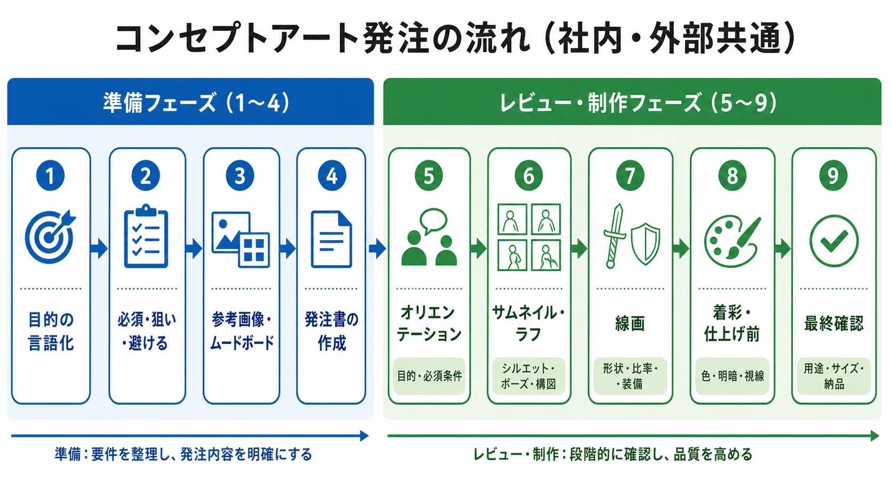
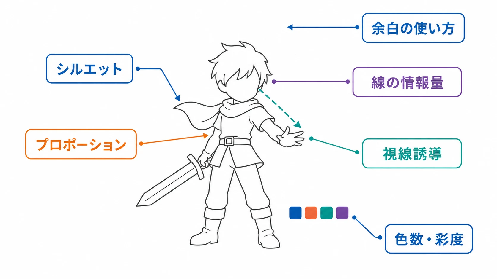

# プランナーのためのビジュアル発注基礎――コンセプトアート編
## 社内デザイナー・外部クリエイターに共通する発注とディレクションの考え方

***

## はじめに

コンセプトアートの発注は、「絵がうまい人に頼めば済む話」ではない。画力の高いデザイナーに依頼しても、何を見せたいのか、何に使うのか、どこを譲れないのかが伝わっていなければ、完成した絵は発注者が期待したものから外れる。

この問題は、相手が社内の同僚デザイナーであっても、外部の業務委託クリエイターであっても共通する。社内なら会話で補える部分が多い一方、口頭で補った前提は後から失われやすい。外部なら文書化が必要になる一方、最初からすべてを細かく決めすぎると、相手の専門性を活かせない。

コンセプトアートとは、完成品を一枚納品して終わる絵ではなく、キャラクターや舞台、衣装、色、光、画面の方向性を試し、開発チームが次の判断をするための視覚資料である。本稿では、絵を描く専門教育を受けていないゲームプランナーが、発注の準備から段階別レビューまでを設計するための考え方を整理する。

***

## 1. 発注前に「何を決める絵か」を言語化する

### 目的を一文にする

発注前に最初に書くべきなのは、絵の見た目ではなく、その絵で何を決めたいかである。

例えば、次のような一文を用意する。

> このコンセプトアートは、プレイヤーが初見で「遠距離から味方を支援する人物」だと理解できるキャラクターシルエットと衣装の方向性を決めるための資料である。

この一文があると、レビューで「好みの絵か」だけを議論せずに済む。シルエットで役割が伝わるか、ゲーム画面の縮小表示でも識別できるか、後続のモデル制作や立ち絵に展開できるか、といった判断に接続できるからである。

目的には、少なくとも次の要素を含めるとよい。

- **役割** ：キャラクター、敵、背景、衣装、武器など、何の方向性を決めるか
- **利用場面** ：ゲーム内の実装、社内の仕様検討、宣伝用のキービジュアルなど、誰がどこで使うか
- **受け手の認知** ：プレイヤーに何を感じ、何を読み取ってほしいか
- **決定範囲** ：今回決めるものと、後工程に残すもの

「強そうにする」「かわいくする」といった形容詞だけでは、意図が絵の判断に変換されにくい。「強そう」を、肩幅を広くする、重心を低くする、直線的な装備を増やす、視線を正面から外して余裕を見せる、というように観察可能な特徴へ分解することが重要である。

### コンセプトを「必須・狙い・避ける」に分ける

発注資料では、すべての要素を同じ強さで指定しない方がよい。次の三層に分けると、作り手が判断しやすくなる。

- **必須** ：年齢帯、武器の種類、所属を示す記号、画面上で見せる部位など、外せない条件
- **狙い** ：軽快さ、異質さ、親しみやすさなど、実現したい印象
- **避ける** ：過度に現代的な形、読めない細部、他作品を直接想起させる装飾など、避けたい方向

「必須」は数を絞るべきである。必須条件が増えすぎると、クリエイターは条件の帳尻合わせに追われ、試行錯誤の余地がなくなる。逆に、避ける方向がなければ、発注者が想定していない解釈へ進んだときに初めて手戻りが発生する。

### 参考画像とムードボードの役割を分ける

参考画像は、完成形を指定するためだけのものではない。質感、色、光、衣装の構造、ポーズ、画面の密度など、言葉だけでは共有しにくい方向性を示すための材料である。ムードボードも、抽象的な感情や雰囲気を視覚的に共有し、チーム内の認識をそろえる道具として使える。[[1](#ref-1)]

集めるときは、画像を並べるだけで終わらせず、各画像に「何を参考にするか」を短く添える。

| 参考にする要素 | 注記の例 |
|---|---|
| シルエット | 外周が大きく、遠目でも装備の役割が読める |
| 色 | 低彩度の本体に、警告色を一点だけ置く |
| 光 | 顔より手元の道具に視線が集まる |
| 質感 | 金属と布の差が一目でわかる |
| 構図 | 上部に余白があり、文字を重ねやすい |

ここで避けるべきなのは、「この画像と同じキャラクターにしてほしい」「この作品の絵柄で描いてほしい」という一対一の模倣指示である。参考画像は方向性の共有に使い、最終的な表現は複数の参照軸を組み合わせて独自に設計する。参照元のURLや作品名も記録しておけば、後で資料の出所を確認しやすい。

### ゲームの世界設定とすり合わせる

キャラクター単体の発注資料だけで完結させず、ゲームの世界設定に関係する最低限の情報を添える。ただし、設定資料をそのまま大量に渡すのではなく、今回の絵に影響する情報を抜き出す。

例えば、次のような確認が必要である。

- その人物が属する組織や文化は何か
- 技術水準や素材にどのような制約があるか
- 既存キャラクターと並べたとき、どの差を見せたいか
- プレイヤーがゲーム画面で見る時間と距離はどの程度か
- 設定上は存在しても、絵では見せなくてよい情報は何か

設定上の正しさと、画面上の読みやすさは同じではない。設定を守るために細部を増やしすぎると、縮小時に一つの塊へ見えることもある。発注前に「設定として必要な情報」と「絵として見せる情報」を分けておくべきである。

***

## 2. 発注書とオリエンテーション資料を設計する

### 依頼資料は「背景・目的・成果物・進め方」で組む

クリエイティブ発注のブリーフには、背景、目的、対象、依頼範囲、成果物、予算や期間、評価方法などを含めると、受け手が判断しやすい。特に、発注側が何を担当し、作り手に何を期待するのかを分けて書くことが重要である。[[2](#ref-2)]

コンセプトアート用なら、次の順番が扱いやすい。

1. **背景** ：どのゲームの、どの場面で使う資料か
2. **目的** ：今回の絵で何を決めるか
3. **対象** ：プレイヤー、社内の制作チーム、宣伝担当など、誰が見るか
4. **必須・狙い・避ける** ：発注者の意図を三層に分けたもの
5. **参考資料** ：画像、設定、既存アセットと、その参照理由
6. **成果物** ：枚数、サイズ、形式、レイヤーの要否、納品時点の状態
7. **進行** ：確認段階、提出日、フィードバック方法、最終納期

資料の目的は、作り手の考えを奪うことではない。解決すべき課題と判断基準を渡し、具体的な解決方法は専門家が提案できる余白を残すことである。

### 用途範囲を明記する

同じ一枚の絵でも、用途によって必要な設計は変わる。ゲーム内の設定資料だけなら検討用のラフで足りる場合があるが、ストアページ、SNS、広告、映像、グッズなどに展開するなら、構図の余白、解像度、トリミング、背景の扱い、別サイズの派生などを初期に確認しなければならない。

発注資料には、少なくとも次を分けて書く。

- 今回の納品物を使う媒体
- 将来の展開を想定するかどうか
- 縦横比やトリミングの可能性
- 背景を含むか、分離できる形にするか
- 企画検討用か、そのまま公開できる仕上げか

用途が未確定なら、「未確定」と書いたうえで、確定が必要な期限を設定する。曖昧なまま進めて、完成後に「宣伝にも使いたい」と言うと、構図や納品形式の変更が追加作業になりやすい。

### 修正回数ではなく、修正の種類を決める

「修正二回まで」とだけ書くと、何を一回と数えるのかが曖昧になる。ラフ段階での方向転換と、仕上げ後の色味調整では作業量が違うからである。

発注前に、次のように修正の範囲を段階ごとに決めておく。

- ラフ：シルエット、ポーズ、構図の大きな変更を確認する
- 線画：形状、プロポーション、装備の配置を確認する
- 仕上げ：色、光、質感、視線誘導の微調整を行う

また、「発注側の新しい要望」と「合意した条件に対する修正」を区別する。発注資料に書かれていなかった要素を後から足す場合は、修正回数の内側に押し込まず、納期や作業量を含めて改めて相談する。契約や権利処理の詳細は本稿の範囲外だが、制作範囲と変更範囲を発注時点で明文化することは、社内外を問わず必要である。

### チェックポイントを先に置く

最終納期だけを置くと、発注側が初めて絵を見るのが遅すぎる。次のように、判断が変えやすい順にチェックポイントを設ける。

| 段階 | 発注側の主な判断 |
|---|---|
| オリエンテーション後 | 目的、必須条件、参考資料の解釈が合っているか |
| サムネイル・ラフ | シルエット、ポーズ、構図、画面内の重心が合っているか |
| 線画 | 形状、プロポーション、装備の構造、線の密度が合っているか |
| 着彩・仕上げ前 | 色、明暗、視線誘導、背景との分離が合っているか |
| 最終確認 | 用途、サイズ、表記、納品形式、派生展開に問題がないか |

レビューの目的と、レビューする人を段階ごとに決めることも大切である。全員が全段階で好みを述べる運用にすると、判断が遅くなり、誰の意見を採用すべきか不明になる。発注側で意見をまとめる責任者を一人置き、必要な専門担当者だけを各チェックポイントに参加させるとよい。


*コンセプトアート発注の流れ（社内・外部共通）。準備段階で要件を整理し、オリエンテーション後に段階的なレビューを行う。*

***

## 3. 「もっとカッコよく」を分解するフィードバック

### 目的・観察・依頼の順に書く

良いフィードバックは、相手の人格や才能を評価する言葉ではなく、作品上の課題を扱う。デザイン批評でも、コメントを具体的で実行可能なものにし、デザイナー本人ではなくデザインへ向けることが基本とされている。[[3](#ref-3)]

実務では、次の順番にすると書きやすい。

1. **目的** ：何を伝えたいか
2. **観察** ：現在の絵のどこで目的が弱まっているか
3. **依頼** ：どの要素を、どの方向へ動かしたいか
4. **確認基準** ：修正後に何が読めればよいか

例えば、次のように書く。

> 目的は、初見で支援役だと読めることである。現在は武器と肩まわりの横幅が大きく、近接攻撃役に見えやすい。武器を身体の外周から少し離し、脚まわりを軽くして、上半身から手元へ視線が流れる形を試してほしい。縮小表示でも武器と人物の間に隙間が見えれば確認完了とする。

「もっとカッコよく」は、発注側の感想として口に出ること自体が悪いわけではない。ただし、そのまま修正指示にせず、何が不足しているのかを観察可能な言葉へ翻訳する必要がある。

### 使える語彙を持つ

| 観点 | 見るもの | 指示の例 |
|---|---|---|
| シルエット | 外周、塊、抜け、識別性 | 肩と武器の外周が重なるため、武器を外側へ出して一つの塊に見えないようにする |
| プロポーション | 身体や装備の比率、重心 | 頭部に対して胴が長く見えるため、腰位置を少し上げて軽快さを出す |
| 線の情報量 | 線の本数、太さ、密度、強弱 | 顔周辺の線が多く視線が止まるため、目立つ線を輪郭と目元に絞る |
| 色数・彩度 | 色の種類、明度、鮮やかさ | 全身の彩度が高く焦点が分散するため、警告色は手元だけに残す |
| 視線誘導 | 明暗、コントラスト、向き、配置 | 顔から道具へ流れないため、顔の明度を少し落とし、手元との明暗差をつける |
| 余白の使い方 | 空き、呼吸、文字やUIの置き場 | 上部に文字を置くため、髪と武器の先端を画面端から離す |

この語彙は、絵を描けるようになるためではなく、観察した現象を共有するためのものである。専門用語を無理に増やす必要はない。「右肩の輪郭と槍の先端が重なって、遠目に形が読めない」のように、場所と見え方を伝えられれば十分に機能する。

### 段階ごとに見るものを変える

#### ラフで見るもの

ラフでは、細部よりも大きな判断を優先する。

- キャラクターや物体のシルエットが識別できるか
- ポーズが役割や感情を伝えているか
- 画面の重心と視線の流れが目的に合っているか
- 必須条件が画面内に現れているか
- 後から直すと高コストになる構図上の問題がないか

この段階で装飾の好みを細かく指摘すると、本来直すべき構図の問題が埋もれる。ラフは「細部を決める絵」ではなく、「どの案を進めるかを決める絵」である。

#### 線画で見るもの

線画では、形状と構造の整合性を確認する。

- 身体と装備のプロポーションに無理がないか
- 立体として見たとき、関節や接続部が成立しているか
- 線の太さや密度が、重要な部分を埋もれさせていないか
- 装備の用途や持ち方が読み取れるか
- 仕上げで色を置いたとき、形の区切りが保てるか

「線をきれいにしてほしい」ではなく、「顔の周辺だけ細い線が集中し、視線がそこから動かない。輪郭線を少し強くし、内側の補助線を減らしたい」と書くと、修正の方向が明確になる。

#### 仕上げで見るもの

仕上げでは、色を足すことより、画面全体の読みやすさを確認する。

- 明度差で主役と背景が分離しているか
- 色数や彩度が目的に対して多すぎないか
- 材質の違いが、細部を拡大しなくてもわかるか
- 最初に見てほしい場所へ視線が誘導されるか
- ゲーム内の表示サイズやトリミングでも情報が残るか
- 余白が用途に対して足りているか

仕上げ段階で構図を大きく変えると、前の工程へ戻ることになる。だからこそ、チェックポイントを設け、ラフで構図、線画で形、仕上げで色と視線誘導を確認するのである。

### テキスト、書き込み、参考画像を使い分ける

文章だけでは伝わりにくいときは、簡易な手描き、円、矢印、トリミング枠を使う。絵の上手さは必要ない。重要なのは「どこを」「どちらへ」「何のために」動かしたいかがわかることである。

例えば、次のような補助が有効である。

- シルエットの外周を太い線で囲む
- 視線の流れを矢印で示す
- 余白を残したい場所に半透明の帯を重ねる
- 色を変えたい部分を塗りつぶす
- 参考画像の中で見る箇所を円で囲む

レビュー資料には、修正後の完成予想図を無理に描かず、「現状」「問題の箇所」「狙う方向」を一枚にまとめるとよい。参考画像を添付する場合も、「形を借りる」のではなく「この画像の低彩度だけを参照する」のように、採用する属性を指定する。

### 社内と外部で変えるのは、距離ではなく記録の密度である

社内デザイナーには、その場の会話や過去の共有知識を使って短く伝えられることがある。一方で、口頭のやり取りだけに依存すると、後から参加した人や別工程の担当者が判断できない。外部クリエイターには、文書、画像への書き込み、優先順位、回答期限を明確にする必要がある。

しかし共通する原則は同じである。目的を示し、観察可能な課題を伝え、相手が提案できる余地を残し、合意した内容を記録することである。発注後のレビューでは、背景とフィードバックしてほしい点を先に説明し、コメントの形式を決め、時間を区切ると議論が散らかりにくい。[[4](#ref-4)]

外部向けの文書では、次のような見出しを固定するとよい。

- 今回のレビューで決めること
- 変更必須の項目
- できれば改善したい項目
- 判断保留の項目
- 次回提出物と提出期限

社内の口頭レビューでも、この見出しを使って最後に要点を記録すれば、外部発注と同じ精度へ近づけられる。


*シルエット、プロポーション、線の情報量、色数・彩度、視線誘導、余白の使い方を、汎用的なキャラクターの線画で確認する。*

***

## 4. よくある失敗パターンと回避策

### 既存作品へ寄せすぎる

「この作品のような髪型」「このキャラクターの雰囲気」といった指定は、発注者の頭の中では手早い。しかし、参照先が一つに集中すると、構図、衣装、配色、ポーズまで似てしまう危険がある。文化庁も、著作権の対象は具体的に表現された創作であり、他人の作品の単なる模倣は保護される新しい表現とは扱われないと説明している。[[5](#ref-5)]

実務上の回避策は、作品名ではなく、採用したい特徴を分解することである。

- 作品Aからは、低彩度の配色だけを参照する
- 作品Bからは、肩まわりのシルエットだけを参照する
- 作品Cからは、奥行きを感じさせる光だけを参照する
- それぞれを自分のゲームの設定、役割、用途に合わせて再構成する

「何を参考にしたか」だけでなく、「何は参考にしていないか」も説明できる状態にする。特定作品への類似が疑われる場合は、制作途中で社内の法務や責任者へ確認する。ここで重要なのは、法的な境界をプランナー一人で断定することではなく、模倣を指示する資料になっていないかを早期に点検することである。

### 発注側の言語化不足で手戻りが起きる

「何となく違う」「思ったより地味」「もっとゲームらしく」といった言葉だけでは、作り手は修正の原因を特定できない。発注者自身が目的を決めきれていない場合、修正を重ねるほど指示が変わり、絵が迷走する。

回避策は、発注前に三つの問いへ答えることである。

1. この絵を見た人に、最初に何を理解してほしいか
2. その理解を邪魔している現在の要素は何か
3. 今回の段階で決めることと、次の段階へ残すことは何か

さらに、オリエンテーションの最後に、クリエイターから「今回の目的と必須条件をどう理解したか」を短く言い返してもらうとよい。これは試験ではなく、発注側の説明に抜けがないかを発見するための確認である。

### 好みと品質基準を混同する

発注者が青を好むことと、画面内で主役が背景から分離して見えることは別の話である。前者は個人の好み、後者は用途や目的に結びついた品質基準である。クリエイティブのフィードバックでは、具体的な例を共有しつつ、作り手の自由度も残すことが成果につながる。[[6](#ref-6)]

レビューでは、コメントを次の三つに分けるとよい。

- **目的に関わる指摘** ：役割が読めない、画面で見えない、用途に合わない
- **設定に関わる指摘** ：所属や技術水準と矛盾する、既存アセットと意味が重なる
- **好みの指摘** ：個人的に好きではない、別案も見たい

好みを述べること自体は禁止しなくてよい。ただし、目的に関わる指摘と同じ強さで扱わず、「必須」「提案」「参考意見」とラベルを付ける。多数決で絵を決めるのではなく、最終目的に対して誰が判断するかを明確にすることが重要である。

### フィードバックが多すぎて矛盾する

レビュー参加者が多いほど、コメントの数は増える。しかし、全員の意見をそのまま作り手へ渡すと、「細くしてほしい」と「存在感を出してほしい」が同時に届くことがある。

会議後に発注側でコメントを整理し、同じ問題について一つの依頼にまとめる。優先順位は、目的への影響、後工程への影響、修正コストの順に検討すると決めやすい。作り手に渡す文書には、採用した意見だけでなく、保留した意見と理由も残すと、次回レビューで同じ議論を繰り返さずに済む。

***

## 5. 発注を反復的なプロセスとして運用する

コンセプトアートの発注は、資料を一度渡して完成品を受け取る一回限りの取引ではない。目的を共有し、複数案を見て、早い段階で方向を絞り、段階ごとに判断し、次の工程へ知見を渡す反復的なプロセスである。修正と改善を前提に、発注資料へフィードバックの時間を含めておくことが、結果として制作の手戻りを減らす。[[6](#ref-6)]

実務で使える最小限の発注メモは、次の形である。

```
目的：この絵で何を決めるか
必須：外せない設定・役割・用途
狙い：見た人に与えたい印象
避ける：起こしたくない解釈・表現
参考：各画像から何を参照するか
段階：今回見るのはラフ・線画・仕上げのどこか
基準：修正後に何が読めればよいか
次回：提出物、確認者、期限
```

このメモを社内のデザイナーにも外部クリエイターにも使い、相手に合わせて説明の細かさだけを調整する。発注者が評価すべきなのは、絵の上手さだけではない。意図を正確に受け取り、必要な問いを返し、目的に合う視覚的な解決案へ変換できるかという、意図の伝達精度である。

発注側もまた、最初から完璧な言葉を持っている必要はない。曖昧な感想を観察できる特徴へ分解し、参考資料の役割を説明し、段階ごとに判断を記録する。その反復によって、プランナー自身の発注能力も、チームの制作基準も育っていくのである。

## References

<a id="ref-1"></a>1. [ムードボードを活用して豊かなユーザー体験をデザインしよう｜アドビ UX 道場][1] - ムードボードを抽象的な感情や方向性の共有に使う考え方を解説している。

<a id="ref-2"></a>2. [Appointing communications agencies: writing effective briefs｜GOV.UK][2] - クリエイティブ発注のブリーフに背景、目的、対象、依頼範囲、成果物、マイルストーンなどを含める考え方を示している。

<a id="ref-3"></a>3. [What are Design Critiques?｜Interaction Design Foundation][3] - デザインへの具体的で実行可能なフィードバックと、作り手本人ではなく作品へ向ける批評の原則を解説している。

<a id="ref-4"></a>4. [Quality and assurance｜Department for Education][4] - レビュー前に文脈と求めるフィードバックを示し、コメント方法や時間配分を設計する実務例を示している。

<a id="ref-5"></a>5. [よくあるご質問｜文化庁][5] - 著作物の要件、アイデアと表現の区別、他人の作品の単なる模倣に関する基本的な説明を掲載している。

<a id="ref-6"></a>6. [Giving good feedback: 7 ways to get the most from your designer｜Design102][6] - 参考例の共有、修正の進め方、具体性と作り手の自由度の両立について解説している。

[1]: https://blog.adobe.com/jp/publish/2023/10/16/cc-web-how-to-enhance-ux-design-with-mood-boards
[2]: https://www.gov.uk/guidance/appointing-communications-agencies-writing-effective-briefs
[3]: https://www.interaction-design.org/literature/topics/design-critiques
[4]: https://design.education.gov.uk/content-design/quality-and-assurance
[5]: https://www.bunka.go.jp/seisaku/chosakuken/kaizoku/faq.html
[6]: https://design102.blog.gov.uk/2021/11/05/giving-good-feedback-7-ways-to-get-the-most-from-your-designer/

----

この文書は、Perplexity、Claude、OpenAI Codex の3つのAIの支援を受けて著述されたものです。引用画像を除き、MIT License にて提供されています。
