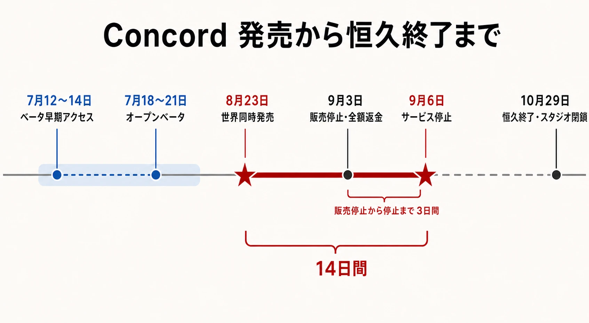
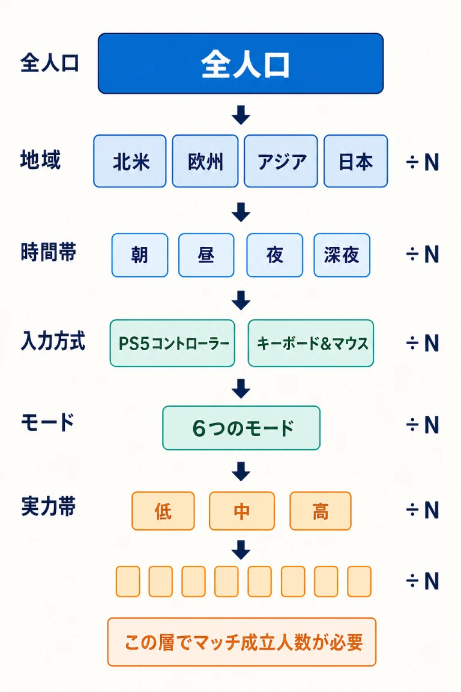
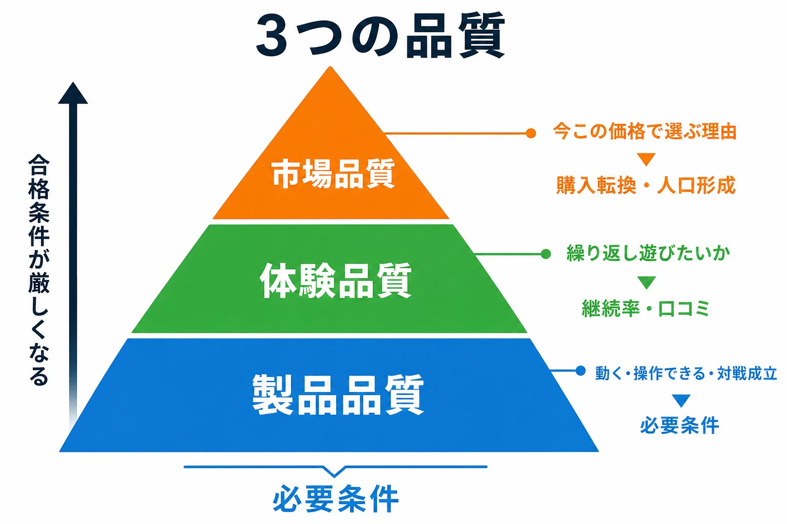
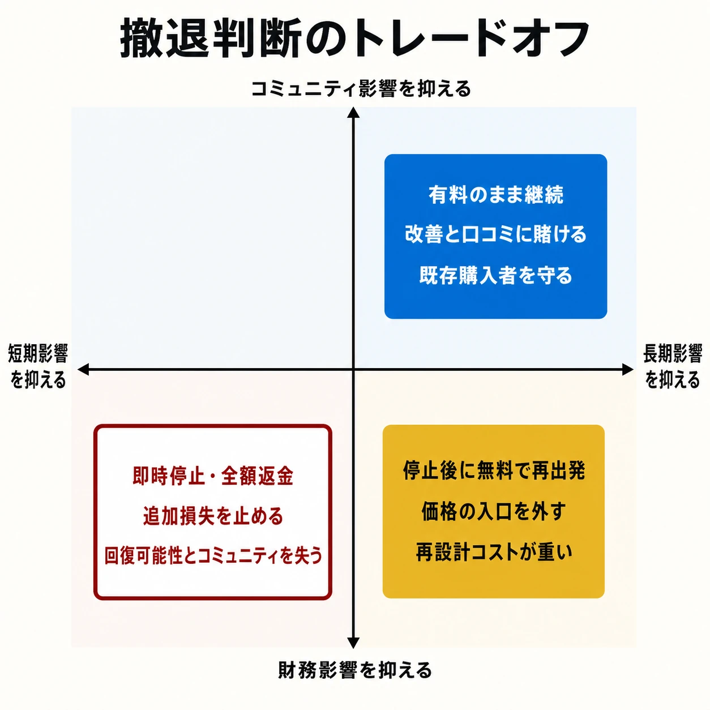

# Concordはなぜ2週間で終わったのか――市場適合と「超短命サービス終了」の実務

## はじめに：完成していても、サービスは始まらないことがある

2024年8月23日に発売された対戦シューター『Concord』は、9月6日にオンラインサービスを停止した。発売から停止まで14日である。

この事例を「出来の悪いゲームがすぐ消えた」と片づけると、実務上の重要な部分を見落とす。評価は割れたが、操作感や基礎的な対戦設計を評価する声もあり、深刻な不具合だけで説明できる失敗ではない。

新人プランナーが誤解しやすい点は三つある。

- 品質が一定水準に達すれば、発売後の口コミで挽回できる
- 有料で売れなければ、基本プレイ無料に変えればよい
- 大きな費用を投じた作品は、長く運営して回収すべきである

どれも条件次第では正しい。しかしオンライン対戦ゲームは、参加者が集まって初めて成立する。人が少ないと待ち時間、回線品質、実力差、遊べるモードが一緒に悪化する。

本記事では事実と分析を分け、企画、販売、運営、撤退をどこで検証するかを考える。

***

## 1. 何が起きたのか

### 5対5の有料オンラインシューター

Concordは、Firewalk Studiosが開発し、Sony Interactive Entertainment（SIE）が販売したPlayStation 5、PC向けの5対5対戦型FPSである。固有の武器や能力を持つ「Freegunner」を選び、チームで戦う。2024年5月30日にゲーム内容が本格公開され、8月23日に世界同時発売された。[[1](#ref-1)]

標準版は39.99ドル、日本では4,480円だった。発売時点で16人のFreegunner、12マップ、6モードを収録し、発売後に追加するキャラクター、マップ、モードは追加料金なしと案内されていた。販売側は、最初に代金を払い、まとまった内容を受け取る「完全なマルチプレイ体験」として位置づけていた。[[2](#ref-2)]

これは買い切り型の長所を狙った設計でもある。無料ゲームに多い有料バトルパスや、対戦要素に関わる追加販売を避け、購入者を同じ条件から始めさせやすい。ただし、価値を体験する前に支払いが必要になる。

### 発売から恒久終了まで

| 日付 | 確認できた出来事 | 実務上の意味 |
|---|---|---|
| 2024年7月12日〜14日 | PS5・PCでベータ早期アクセス | 予約者に加え、PS5ではPlayStation Plus会員も参加可能 |
| 2024年7月18日〜21日 | PS5・PCでオープンベータ | 購入不要で市場の反応を確認できる機会 |
| 2024年8月23日 | PS5・PCで世界同時発売 | 有料サービスとして正式運用を開始 |
| 2024年9月3日 | 販売停止、全額返金、9月6日の停止を発表 | 発売11日後に撤収を公表 |
| 2024年9月6日 | オンラインサービス停止 | 発売14日後。購入者への返金処理を実施 |
| 2024年10月29日 | SIEが恒久終了とFirewalk Studios閉鎖を発表 | 無料化や再発売を含む復活の検討も終了 |

9月3日の公式発表は、発売時の体験について「意図した形で届かなかった側面がある」と説明した。販売を即時停止し、PlayStation Store、PlayStation Direct、Steam、Epic Games Storeの購入者には全額返金するとした。店頭で物理版を買った人には、各小売店の手続を案内した。[[3](#ref-3)]

この時点では「より多くのプレイヤーに届く方法」を含む選択肢を検討するとされていた。つまり、9月6日の停止は当初から恒久終了と明言されたわけではない。しかし10月29日、SIEはConcordを恒久的に終了し、Firewalk Studiosを閉鎖すると発表した。影響を受ける一部の従業員については、他のPlayStation Studiosで配置先を探す方針も示した。[[4](#ref-4)]

開発費、買収額、正確な販売本数は公表されていない。

***

## 2. ローンチ前に見えていたシグナル

### ベータは品質確認だけの場ではない

Firewalkは、7月に早期アクセスとオープンベータを実施した。オープンベータはPS5とPCの全プレイヤーに開放され、クロスプレイにも対応していた。[[5](#ref-5)]

ベータの役割は、不具合とサーバー負荷の確認だけではない。ライブサービスでは、次の仮説も検証する。

- 告知を見た人が、実際にダウンロードするか
- 一度遊んだ人が、翌日も戻るか
- 友人を誘う理由があるか
- 無料体験後に、製品価格を払うか
- 人口を地域、入力方式、モード、実力帯に分けても対戦が成立するか

PC版ベータについて、SteamDBを基にした報道では最大同時接続数が2,388人だった。ただし、これはSteamの同時接続であり、ベータ参加者の累計でも、PS5を含む総参加者数でもない。PS5側の人数は公開されていない。したがって「全体で2,388人しか遊ばなかった」とは書けない。[[6](#ref-6)]

それでも、PC市場での関心を測る警報にはなる。製品版のSteam同時接続も発売直後の最大が700人未満だったと報じられた。こちらも全機種の販売本数ではないが、正式発売でベータから強い転換が起きなかったことは読み取れる。[[7](#ref-7)]

### 数字を見るだけでは遅い

重要なのは、低い数字を見つけたかではなく、数字ごとに意思決定が結びついていたかである。

たとえばオープンベータの参加が目標を下回ったとき、選択肢は一つではない。

1. 発売日を維持し、広告と配信者施策を増やす
2. PlayStation Plusなど、定額サービスへの組み込みを検討する
3. 価格を下げる、または基本プレイ無料向けに再設計する
4. 差別化が伝わる導入、モード、映像へ作り直す
5. 発売を延期する、対象地域を絞る、あるいは中止する

どれにも費用と副作用がある。発売約1か月前に無料化を決めても、ショップ、ゲーム内経済、不正対策、サポート計画はすぐには作り直せない。延期すれば契約、広告枠、他作品との発売時期がずれる。重要なのは、ベータ後に慌てて正解を探すことではない。企画段階で「この数値なら誰が何を止めるか」を決めておくことである。

SIE自身も、2024年度第2四半期の決算説明会で、ユーザーテストと社内評価を行う時期をもっと早めるべきだったこと、企画・開発・販売の連携が常に円滑ではなかったことを反省点として挙げた。[[8](#ref-8)]

***

## 3. 市場適合を四つに分ける

市場適合とは、単に「流行のジャンルを選ぶ」ことではない。Concordでは、タイミング、価格、差別化、人口形成を分けて考えると見通しがよい。

### タイミング：競合はソフトではなく、習慣である

SIEは後に、対人FPSを「競争が激しく、継続的に変化する市場」と表現し、Concordが目標に届かなかったと認めた。[[4](#ref-4)]

後発作品が争う相手は新作だけではない。プレイヤーがすでに持つ次の資産である。

- 使い慣れた操作とキャラクター知識
- フレンド、クラン、配信者を含む人間関係
- スキン、ランク、戦績などの蓄積
- 毎週遊ぶ時間と習慣

既存作から移ることは、学習と人間関係をやり直すことでもある。新作には「面白い」に加えて、既存の習慣を中断するほど強い理由が必要になる。

### 価格：4,480円は金額以上の壁になる

Concordの価格は、一般的な大作のフルプライスより低かった。それでも、基本プレイ無料の競合作品と比べれば、試す前の負担はゼロ対4,480円になる。加えてPS5でオンライン対戦を行うにはPlayStation Plus加入が必要であり、実質的な参入コストはさらに高い。

VGCのレビューは、銃撃感やキャラクターごとの差を評価しながらも、すでに複数のライブサービスを遊ぶ人に対して、40ドルを払い乗り換えるほど強く勧められないと評した。また、FortniteやApex Legendsなど、無料で遊べる既存作がある市場で価格が大きな障害になると論じている。[[9](#ref-9)]

有料モデル自体が誤りなのではない。先に代金を受け取れば、無料プレイヤーを大量に集めて一部の課金者で支える設計に頼らずに済む。過度な継続課金を避けるメッセージにもなる。

ただし対戦ゲームでは、購入者数がそのまま対戦相手の母数になる。価格は売上単価であると同時に、マッチング人口への入場ゲートでもある。ここが一人用ゲームとの大きな違いだ。

### 差別化：独自要素が「遊ぶ理由」になるとは限らない

Concordに独自要素がなかったわけではない。役割の異なるキャラクターへ交代すると、リロード速度などのボーナスが同じ試合中に引き継がれる「Crew」設計があった。Game Developerはベータ時点で、この仕組みを対戦シューターに戦略性を加える創造的な要素として取り上げている。[[10](#ref-10)]

毎週の映像エピソードで世界とキャラクターを描く構想もあった。ところが、独自性には少なくとも三段階ある。

1. 実際に他作品と違う
2. 映像やストア説明を見ただけで違いが分かる
3. その違いのために、時間と代金を払いたくなる

第1段階を満たしても、第2、第3段階へ届くとは限らない。GamesRadar+は、基礎部分とビジュアルを評価する一方、モードの薄さとキャラクターの印象の弱さを指摘した。[[11](#ref-11)] VGCも、反応のよい銃撃と物語への工夫を認めながら、既存のライブサービスを置き換える決め手には弱いと評価した。[[9](#ref-9)]

キャラクター表現をめぐっては、発売前後にイデオロギーを含む議論も起きた。しかし、それを販売不振の検証済み原因とする公開データはない。実務で扱えるのは、テスト参加、継続、購入意向、キャラクター認知など、観測可能な指標である。「SNSで強い言葉が多かった」ことと「売れなかった原因が確定した」ことは同じではない。

### 人口形成：プレイヤーが減るほど、商品価値も下がる

5対5のゲームでも、10人いれば運営できるわけではない。実際には人口が分割される。

`全人口 ÷ 地域 ÷ 時間帯 ÷ 入力方式 ÷ モード ÷ 実力帯`

人口が少ないと、待ち時間を守るために実力差を広げる。実力差を守れば待ち時間が延びる。モードを統合すれば選択肢が減る。どの調整も商品価値の一部を削る。

ここでは悪循環が起きる。人が少ないから体験が悪くなり、体験が悪いから人が減る。一定の完成度があっても、人口の最低ラインを割ると、通常の改善速度では追いつけないことがある。

***

## 4. なぜ「完成度」だけでは救えなかったのか

Concordの評価は一枚岩ではない。VGCは「よいシューター」としつつ5点満点中3点を付け、GamesRadar+は基礎とビジュアルを長所に挙げた。一方、PC Gamerは操作の重さ、モードの単調さ、既視感を強く批判し、100点中45点とした。[[12](#ref-12)]

ここから言えるのは「本当は傑作だった」でも「品質は無関係だった」でもない。品質を三つに分ける必要がある。

| 品質の軸 | 問い | Concordで見えたこと |
|---|---|---|
| 製品品質 | 動くか、操作できるか、対戦が破綻しないか | 基礎的な操作感や映像を評価するレビューがあった |
| 体験品質 | 繰り返し遊びたいか、学習が報われるか | モード、速度、導入、キャラクターへの評価は割れた |
| 市場品質 | 今この価格で、競合より優先する理由があるか | 価格と差別化を疑問視する評価が複数あった |

製品品質は必要条件だが、十分条件ではない。しかもライブサービスでは、発売後の更新で体験品質を上げる前に、人口を確保しなければならない。

「長く続ければ改善できた」という反論にも一理ある。ただし、その間の対戦相手と運営費を誰が支えるかという問題が残る。反対に「初動が弱ければ即終了でよい」と決めると、口コミで伸びる作品、長期テストが必要な作品、少人数でも採算が合う作品を切ってしまう。必要なのは一律の日数ではなく、その作品が成立する最低人口、回復施策の費用、回復までの時間である。

***

## 5. 長期開発と大きな組織投資が生むリスク

Concordについては「8年開発」という数字が広く流通した。しかし、期間の定義には注意が要る。

Firewalk Studiosは2018年に設立され、2021年にはSIEと新規AAAマルチプレイ作品の販売提携を公表していた。[[13](#ref-13)] SIEは2023年に同スタジオの買収を発表し、その時点で従業員は約150人と説明している。[[14](#ref-14)] 一方、閉鎖時のFirewalkの声明では、初期は小規模で、フルプロダクション、つまり本制作へ入ったのは2022年とされている。[[15](#ref-15)]

したがって、構想、試作、チーム形成、本制作をすべて同じ「開発年数」で数えるのは正確ではない。それでも、市場投入までに複数年の組織的な賭けが積み上がったことは確認できる。

### 長い開発は、未来の市場を予測する仕事になる

開発開始時に妥当だった企画も、発売時には条件が変わる。

- 競合作品が無料化する
- プレイヤーが複数の継続型ゲームを抱える
- 配信で映える要素やコミュニティ形成の方法が変わる
- プラットフォーム間のクロスプレイが期待される
- キャラクター数、更新頻度、導入品質の基準が上がる

長期開発では、チーム内部が毎日改善を見ているため、外部の人が初見で感じる既視感や価値の弱さに気づきにくい。定期的に「この企画を今日初めて見ても、同じ投資判断をするか」と問い直す必要がある。

### サンクコストは、続行理由にしてはいけない

サンクコスト、または埋没費用とは、すでに支払い、今後の判断では取り戻せない費用を指す。開発費、過去の広告費、買収費用の一部は、発売後の続行判断では戻ってこない。

判断に使うべき比較は、過去の投資額ではない。

`今後得られる価値 × 実現確率` と `今後必要な費用・損失`

大きく投資したから続ける、という判断は損失を広げることがある。一方、大きく外したから即座に全部捨てる、という反応も正しいとは限らない。技術、チーム、IP、運営知識を別の形で再利用できる可能性があるからだ。

公開情報だけでは、Concordの続行判断がサンクコストに歪められたとは断定できない。言えるのは、提携、買収、採用、販売計画が進むほど、中止には説明責任と組織的痛みが伴い、早い検証の価値が上がるということである。

***

## 6. 2週間で畳む判断は合理的だったのか

### 計画的なサ終と緊急撤収は別物

通常のサービス終了は、数か月前に告知し、課金停止、最終イベント、データ保存、問い合わせ、サーバー停止を段階的に進める。既存コミュニティとの別れを設計する仕事である。

Concordは違った。9月3日に販売停止と返金を発表し、3日後に停止した。長期間遊べる商品として提供し続けるのではなく、取引を巻き戻す方向を選んだ。全額返金はプレイヤーの金銭的損失を小さくしたが、遊び続けたい購入者の選択肢と作品へのアクセスは失われた。

この判断は、次の三案を比べると理解しやすい。

| 選択肢 | 得られる可能性 | 主な負担と危険 |
|---|---|---|
| 有料のまま継続 | 改善と口コミを待てる。既存購入者を守れる | 人口不足で対戦体験が悪化。更新、サーバー、サポート費が続く |
| 停止後に無料で再出発 | 価格の入口を外し、再注目を作れる | 課金経済、コンテンツ量、不正対策、再マーケティングの再設計が必要。差別化の弱さは残る |
| 即時停止・全額返金 | 追加販売による被害を止め、今後の損失を限定できる | 回復の可能性、コミュニティ、作品保存、将来の購入者からの信頼を失う |

### 損切りとして合理的になりうる条件

即時停止が合理的になりうるのは、次の条件が重なる場合である。

- 成立に必要な人口を大きく下回り、自然回復の根拠が弱い
- 無料化しても、競合作品から移る理由が増えない
- 回復までに必要な更新費と顧客獲得費が大きい
- 販売を続けるほど、返金、問い合わせ、評判の損失が増える
- 返金原資を確保でき、各ストアと短期間で調整できる

Concordでは、SIEが販売元であり、PlayStation Storeを自ら運営していた。Steam、Epic Games Storeとも返金を調整し、物理版は小売店の手続へ分けた。大手販売元の資金力と流通上の立場が、即時停止と全額返金を可能にしたと考えられる。ただし、契約や社内判断の詳細は公開されていない。

### 「失敗の上塗り」と評価されうる理由

反対側の論点もある。

第一に、2週間では大型な改善施策を試せない。無料化、PlayStation Plusへの提供、モード整理、導入の作り直しなどに、どの程度の効果があったかは検証されないまま終わった。

第二に、短命終了は次の作品にも影響する。プレイヤーが「新しいオンライン作品は、買ってもすぐ終わるかもしれない」と考えれば、次回の初動が弱くなる。個別タイトルの損切りが、販売元のライブサービス全体に対する信用コストを生む。

第三に、返金は金銭を戻すが、時間は戻さない。作品を気に入った人、実績を集めた人、攻略やコミュニティを作った人にとって、アクセス不能は別の損失である。開発者にとっても、最終的にスタジオ閉鎖へつながった影響は重い。

したがって、外部情報だけで「正しい撤退だった」とも「続ければ復活した」とも断定できない。必要な社内情報は、残存率、機種別人口、マッチ成立率、返金率、更新費、無料化費、復帰見込み、契約上の期限である。これらが公開されていない以上、結論より判断条件を示す方が誠実である。

***

## 7. 新人プランナーが持ち帰る判断軸

### 1. 競合表ではなく「乗り換え理由」を書く

機能数の比較だけでは足りない。企画書に次の一文を書く。

> すでに〇〇を遊んでいる人が、フレンドを誘い、今週こちらを優先する理由は何か。

答えが「世界設定」「高品質」「個性的なキャラクター」だけなら、広告を見た人が具体的に想像できるところまで分解する。

### 2. テストごとに、品質と市場の指標を分ける

| 段階 | 品質の問い | 市場の問い |
|---|---|---|
| コンセプトテスト | ルールを理解できるか | 見ただけで試したいか |
| クローズドテスト | 対戦が面白いか | 翌日も戻るか、友人を誘うか |
| オープンベータ | 負荷とマッチングに耐えるか | 無料でも十分な人数が来るか |
| 予約・発売 | 決済と運用が安定するか | 価格を払う人へ転換するか |

不具合が少ないから合格、としない。遊んだ人の評価が高くても、そもそも試す人が少なければ別の問題である。

### 3. 撤退ラインを発売前に決める

撤退ラインは売上だけではない。

- 地域・時間帯別のマッチ成立率
- 待ち時間と実力差の許容範囲
- 初日、7日、30日の継続率
- 無料化や大型更新に必要な費用と期間
- 継続、縮小、再設計、停止を決める責任者
- 返金、ストア停止、問い合わせ、データ保持の手順

数字は作品ごとに変わる。重要なのは、悪い結果が出た後に基準を動かさないことである。

### 4. 「良いゲーム」と「続けられるサービス」を分ける

スタッフが面白いと感じ、レビューで長所を評価され、技術的に安定していても、人口と採算が成立するとは限らない。逆に、大人数向けでなくても、運営費が小さく、濃い顧客に届けば続けられる作品もある。

評価表には、少なくとも次を別々に置く。

- 遊びとしての品質
- 初見で伝わる価値
- 価格への納得
- 人口形成の可能性
- 更新を続ける採算
- 終了時にプレイヤーを守る方法

***

## おわりに：失敗は発売日に始まったわけではない

Concordは、発売から14日で停止した。その短さは目を引く。しかし、実務上の焦点は日数の記録ではない。

一定の製品品質があっても、競合より優先する理由が伝わらず、価格が試遊を妨げ、人口が最低ラインを割れば、オンライン対戦は自ら商品価値を失っていく。長期開発と大きな組織投資は、その変化を見えにくくし、中止判断を重くする。

一方、即時停止と全額返金は、損失を限定し、販売を続ける不誠実さを避ける手段になりうる。だが、改善の可能性、作品へのアクセス、スタッフ、次のサービスへの信頼を失う判断でもある。

ここに万人向けの正解はない。だからこそ、発売前に市場仮説をテストし、悪い数字を受け止めるゲートを置き、撤退時のプレイヤー保護まで設計する。Concordの事例が示すのは、完成させる技術だけではなく、 **続けられる条件と、やめる条件を同時に作ること** もゲーム開発だということである。

## References

1. [Concord gameplay revealed, launching August 23, 2024 on PS5 and PC][1] - 5対5のキャラクター制FPSであること、対応機種、発売日、発売時の構成を発表した公式資料。

2. [Concord is now available to pre-order, Early Access and beta detailed][2] - 標準版の地域別価格、収録キャラクター・マップ・モード、発売後コンテンツの方針を示した公式資料。

3. [An important update on Concord][3] - 2024年9月6日の停止、販売の即時終了、各販売経路での全額返金を告知した公式発表。

4. [An Update from PlayStation Studios][4] - Concordの恒久終了、Firewalk Studiosの閉鎖、対人FPS市場と人員配置について説明したSIE公式発表。

5. [Concord Beta Early Access: Preload and server times, PC specs, and more detailed][5] - 早期アクセスとオープンベータの日程、参加条件、クロスプレイ対応を案内した公式資料。

6. [Sony hero shooter Concord's free open beta peaked at just 2,388 concurrent players][6] - SteamDBに基づくPC版ベータの最大同時接続数と、PS5側の人数が非公開であるという留保を報じた記事。

7. [Sony is shutting down Concord, refunding players after just two weeks][7] - SteamDBに基づく製品版の最大同時接続数と、停止発表までの経緯を報じた記事。

8. [Sony Talks Concord's Failure And The Hard Lessons Learned From It][8] - ユーザーテストと社内評価の時期、企画・開発・販売間の連携を反省点として挙げたTotoki社長のQ&A発言を伝えるGameSpotの報道。

9. [Review: Concord is a good shooter divorced from the reality of its genre][9] - 操作感を評価しつつ、価格、差別化、既存ライブサービスからの乗り換え難度を論じたレビュー。

10. [Multiplayer devs should take a close look at Concord's Crew Building system][10] - Crewシステムの戦略性と独自性を開発者向けに分析した記事。

11. [Concord review: Plenty of characters and little personality][11] - 基礎的な対戦設計と映像を評価しつつ、モードとキャラクターの弱さを指摘したレビュー。

12. [Concord review][12] - 個々の要素には機能する部分があるとしながら、速度、戦術、既視感を厳しく評価したPC Gamerのレビュー。

13. [PlayStation and Firewalk Studios announce publishing partnership for a new, original multiplayer IP][13] - Firewalk Studiosの2018年設立と、2021年時点の新規マルチプレイ作品に関する提携を示す公式発表。

14. [Sony Interactive Entertainment to Acquire Firewalk Studios from ProbablyMonsters Inc][14] - 2023年の買収合意、スタジオ規模、PS5・PC向けAAAマルチプレイ作品の開発を示すSIE公式発表。

15. [Concord Developer Firewalk Studios Shuts Down; Game Permanently Sunsets][15] - Firewalk Studiosの最終声明を引用し、設立初期の規模と2022年の本制作入りを伝えた報道。

[1]: https://blog.playstation.com/2024/05/30/concord-gameplay-revealed-launching-august-23-2024-on-ps5-and-pc/
[2]: https://blog.playstation.com/2024/06/06/concord-is-now-available-to-pre-order-early-access-and-beta-detailed/
[3]: https://blog.playstation.com/2024/09/03/an-important-update-on-concord/
[4]: https://sonyinteractive.com/en/news/blog/an-update-from-playstation-studios/
[5]: https://blog.playstation.com/2024/07/11/concord-beta-early-access-preload-and-server-times-pc-specs-and-more-detailed/
[6]: https://www.techspot.com/news/103912-sony-hero-shooter-concord-free-open-beta-peaked.html
[7]: https://arstechnica.com/gaming/2024/09/two-weeks-after-launch-sony-shooter-concord-goes-offline-and-offers-refunds/
[8]: https://www.gamespot.com/articles/sony-talks-concord-failure-and-the-hard-lessons-learned-from-it/1100-6527647/
[9]: https://www.videogameschronicle.com/review/concord-is-a-good-shooter-divorced-from-the-reality-of-its-genre/
[10]: https://www.gamedeveloper.com/design/multiplayer-devs-should-take-a-close-look-at-concords-crew-builder-system
[11]: https://www.gamesradar.com/games/fps/concord-review/
[12]: https://www.pcgamer.com/games/fps/concord-review/
[13]: https://blog.playstation.com/2021/04/22/playstation-and-firewalk-studios-announce-publishing-partnership-for-a-new-original-multiplayer-ip/
[14]: https://sonyinteractive.com/en/press-releases/2023/sony-interactive-entertainment-to-acquire-firewalk-studios-from-probablymonsters-inc/
[15]: https://mp1st.com/news/concord-developer-firewalk-studios-shuts-down-game-permanently-sunsets

----

この文書は、Perplexity、Claude、OpenAI Codex の3つのAIの支援を受けて著述されたものです。引用画像を除き、MIT License にて提供されています。
