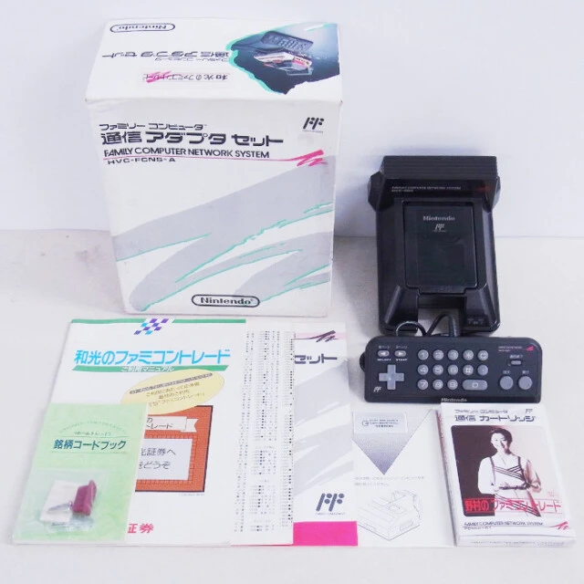
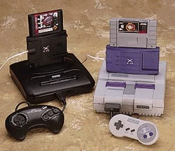
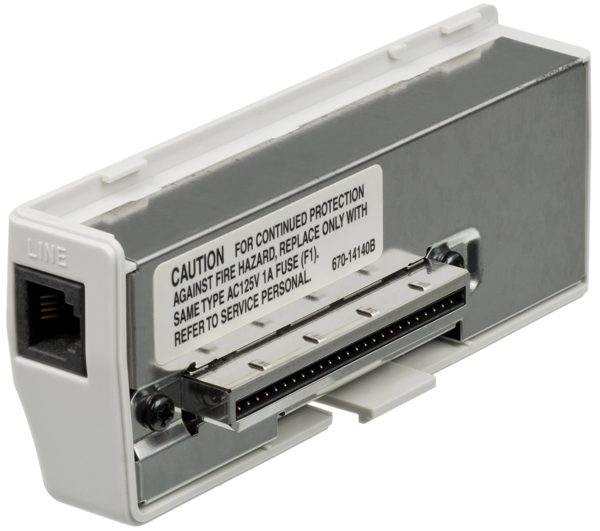
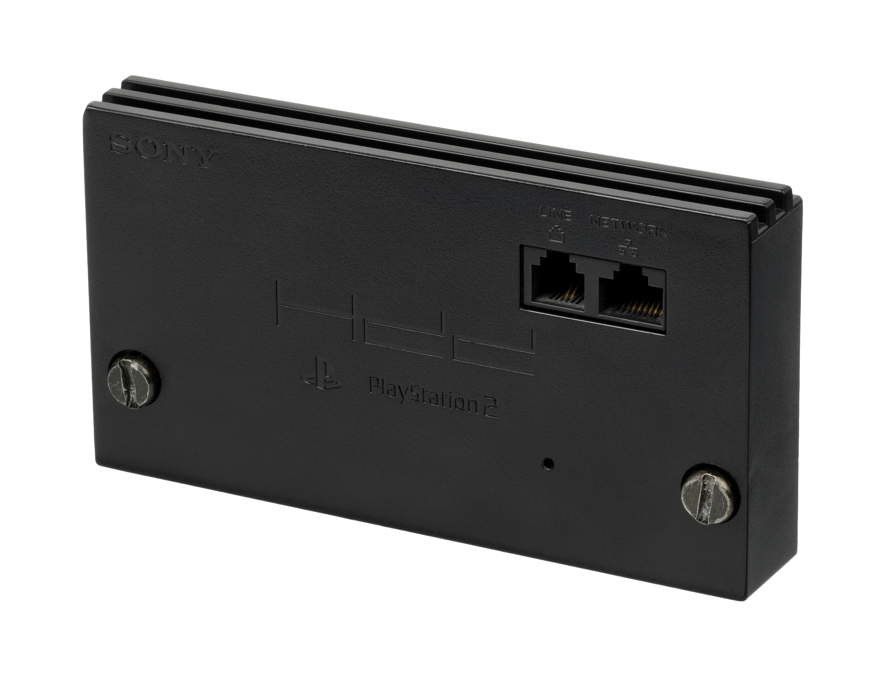
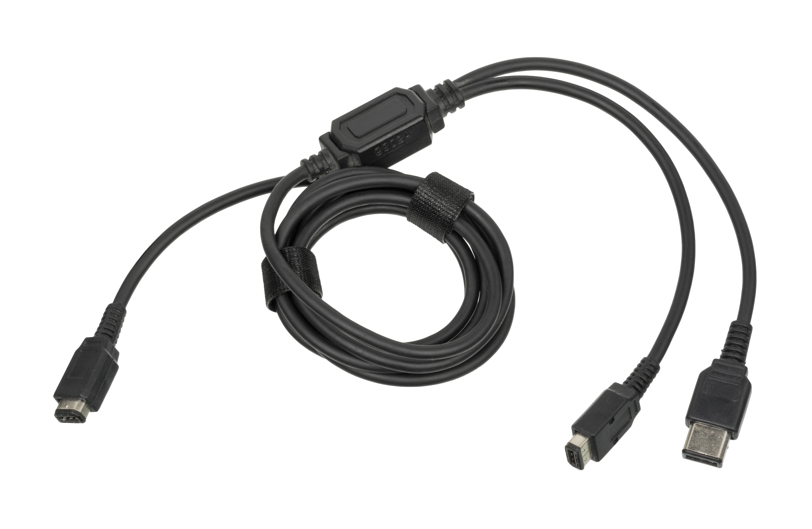

# 家庭用ゲーム機とオンライン環境の歴史

## 概要

家庭用ゲーム機とネットワークの関係は、1980年代後半の電話回線接続から始まり、インターネット普及を経て、現代の常時接続オンラインゲームへと40年近い歴史を持つ。据え置き型ゲーム機と携帯ゲーム機では、ネットワーク活用の方向性が大きく異なる形で発展してきた。

---- 

## 第一章：据え置き機と電話回線の黎明期（1980年代後半〜1990年代中期）

### ファミコン通信アダプタ——ゲームではなく金融から始まった接続

ゲーム機とネットワークを最初に結びつけたのは、意外にも株式取引や銀行業務だった。1988年7月、任天堂はファミリーコンピュータ（ファミコン）に対し、電話回線へ接続するための **通信アダプタセット** （HVC-050）を発売した。このアダプタを使った先行商業サービスとしては、証券会社の山一證券が1987年7月に開始した「サンラインF」（通称「山一のサンライン」）が知られており、ファミコンを電話線に接続することで株式の売買が行えるようになった。翌1988年以降、野村證券・新日本証券・コスモ証券など複数の証券会社が「ファミコントレード」の波に乗り、専用の通信カートリッジを次々と発売した。[[1](#ref-1)][[2](#ref-2)]

*ファミコン通信アダプタ。フリーライセンスの写真が確認できなかったため、BEEP掲載写真を引用。*

ゲームへの転用も試みられた。任天堂公式の通信アダプタに対応した **通信将棋倶楽部** ・ **通信囲碁倶楽部** （コナミ開発）は「幻のゲーム」として知られ、当時の任天堂社長・山内溥氏（囲碁愛好家として知られる）の意向が関わったとも伝えられる。しかし電話回線の帯域と従量課金の壁は厚く、この時代のゲーム向け通信は実用にはならなかった。[[2](#ref-2)]

### XBANDと電話回線対戦——距離が値段になった時代

1995年10月、アメリカのカタパルト社がSNES（スーパーファミコン）とセガジェネシス（メガドライブ）向けのアナログ電話回線通信対戦サービス「XBAND」を米国で開始した。日本では1996年4月1日、カタパルト・エンタテイメント（カタパルト社と日商岩井の合弁）からスーパーファミコン用スターターキット（モデム＋プリペイドカード20度数）が6,800円（税別）で発売され、対応ソフトに『スーパーストリートファイターII』や『パネルでポン』などが名を連ねた。[[3](#ref-3)][[4](#ref-4)]

*Genesis/Mega Drive用・Super Nintendo用のXBANDモデム。*

仕組みはモデムを通じてホストコンピュータへ接続し、マッチングが成立すると対戦相手のモデムへ直接電話をかける方式だった。そのため **市外局番をまたぐ対戦は電話料金が高額** になるという致命的な欠点を抱えており、未成年が遠距離の相手と対戦するには親の許可を要するほどだった。通信費の高さゆえ1ゲームは最長5分に設定され、長距離対戦はハガキでの特別申込制という制約が課せられていた。[[3](#ref-3)]

---- 

## 第二章：ドリームキャストとインターネット接続の幕開け（1998年〜2001年）

### モデム標準搭載という賭け

ゲーム機とネットワークの歴史において最大の転換点は、1998年にセガが発売した **ドリームキャスト** （DC）だった。ブロードバンドが一般に普及していなかったダイヤルアップ接続の時代に、メジャーなゲーム専用機として初めてモデムを **標準搭載** して出荷したのである。「全台モデムを積む」という決断は、当時のセガ会長・大川功氏（親会社CSK会長を兼務、後の2000年6月にセガ社長を兼任。発売時の社長は入交昭一郎氏）の強い意向によるもので、コストを度外視してネットワーク革命を目指すものだったとされる。[[5](#ref-5)][[3](#ref-3)]

*ドリームキャスト用56.6Kダイヤルアップモデム。*

セガはさらにプロバイダ事業「セガプロバイダ」を立ち上げ、利用料を無料にしたうえで専用通信ソフト「ドリームパスポート」の手順に沿えばすぐ接続できる環境を整えた（1999年10月にCSK子会社の株式会社イサオへ「isao.net」として承継）。ゲームのためにインターネット接続するという体験を、初めて一般ユーザーに開いた機器だと言える。既存のISPと契約済みのユーザーはそのままのアカウントでブラウジングやオンラインサービスを利用することも可能だった。[[6](#ref-6)][[3](#ref-3)]

### ファンタシースターオンラインの衝撃

DCのオンライン環境が花開いたのが、2000年12月21日発売の **ファンタシースターオンライン（PSO）** だった。アナログ回線が主流だった当時、家庭用ゲーム機で本格的なオンラインRPGを実現した画期的タイトルであり、ドリームキャスト時代の最盛期には国内同時接続者数2万6,000人・登録者数30万人（国内外）を誇ったとされる。その後PSOはPC・ゲームキューブ・Xboxへと移植され、Xboxの『Xbox Liveスタータキット』にはPSO『エピソード1＆2』が同梱されるなど、戦略的にも重要なタイトルとなった。[[7](#ref-7)][[8](#ref-8)][[9](#ref-9)][[10](#ref-10)]

一方でDCはPS2の登場やDVDプレイヤー機能の欠如などを原因に販売競争で敗北し、セガはハードウェア開発から撤退することになる。しかしDC＋PSOが切り拓いた「家庭用ゲーム機でオンラインゲームをする」という体験は、次世代機が引き継いでいく。[[5](#ref-5)]

---- 

## 第三章：ブロードバンド時代のPS2とXbox（2002年〜2005年）

### PS2とブロードバンドアダプタ

PlayStation 2（PS2）の初期〜中期モデルにはネットワーク機能が備わっていなかったため、オンラインゲームをプレイするには周辺機器「 **PSBBユニット（BB Unit）** 」が必要だった。このユニットにHDD（ハードディスク）とネットワークアダプタを内蔵することでオンライン接続が可能となる仕組みだ。[[11](#ref-11)][[12](#ref-12)]

*初期型PS2用ネットワークアダプター。*

そのPS2のオンライン環境を最大限に活用したのが、2002年5月発売の **ファイナルファンタジーXI（FFXI）** である。FFXIはコンソール向け常時接続型MMORPG（大規模多人数オンラインRPG）という新ジャンルをPS2＋BB Unitで確立し、「ネットカフェではなく家のPS2でMMORPGを遊ぶ」という体験を実現した。FFXIのPS2版サービスは長年継続され、最終章「ヴァナ・ディールの星唄」（2015年実装）の完結を経て、2016年3月31日にPS2版・Xbox 360版の両サービスが終了した（PC版は現在も継続）。[[13](#ref-13)][[14](#ref-14)]

### Xbox Liveの確立——現代オンラインサービスの原型

2002年11月（米国）・2003年1月（日本）に、マイクロソフトの初代Xbox向けオンラインサービス **Xbox Live** （現：Xbox Network）がスタートした。標準のLAN端子だけで接続できる点が最大のセールスポイントで、Xbox Live対応タイトル全てで **ボイスチャット** を共通して利用できる設計は、現代のオンラインゲームの雛型となった。[[15](#ref-15)][[16](#ref-16)][[10](#ref-10)]

Xbox Liveはサブスクリプション制を採用し、後にXbox 360・Xbox One・Xbox Series X/Sへと継承されていく。初代Xboxでのサービスは2010年に終了したが、Xbox 360以降のサービスは「Xbox Game Pass Core」（旧：Xbox Live Gold）として現在も続いている。[[15](#ref-15)]

---- 

## 第四章：WiiとPS3の世代——オンラインが標準装備へ（2006年〜2013年）

### ニンテンドーWi-Fiコネクションの始動

任天堂は2005年11月23日、DS・Wii向けオンラインサービス「 **ニンテンドーWi-Fiコネクション** 」の日本サービスを開始した。対戦や協力プレイに特化したサービスで、無料で利用できる点が特徴だった。フレンドコードを交換した相手のみと通信できる「閉じた」オンライン環境により、見知らぬ相手とのトラブルを防ぐ設計が取られていた（ソフトによっては「世界のだれか」との無差別対戦も選択できた）。[[17](#ref-17)]

Wiiでは **WiiConnect24** という補完サービスも提供されていた（サービス開始：2006年12月2日、終了：2013年6月28日）。本体がスタンバイ状態でも24時間インターネットへ常時接続し、データを自動送受信する機能で、ニンテンドーWi-Fiコネクションとは役割が異なる独立したサービスだった。またWiiでは **Wiiショッピングチャンネル** が2006年にスタートし、バーチャルコンソールでファミコン・スーパーファミコン・NINTENDO64の旧作ソフトをダウンロード購入できるようになった。同サービスは段階的に終了し、コンテンツ購入は2019年1月31日をもって終了した。[[18](#ref-18)][[19](#ref-19)][[20](#ref-20)][[21](#ref-21)]

ニンテンドーWi-FiコネクションはDS・Wii向けサービスとして2014年5月20日に終了した。[[22](#ref-22)]

### PlayStation 3とPlayStation Networkの開設

2006年11月、PS3と同時に **PlayStation Network（PSN）** のサービスが北米・日本でスタートした。PSNはインターネット接続を前提とした本格的なオンラインプラットフォームで、基本サービスは無料だった。2010年には有料サービス「 **PlayStation Plus（PS+）** 」が追加され、毎月無料ゲームの提供や会員限定割引などが始まった。PS3以降、PSNはPS4・PS Vita・PSPにも展開され、PlayStation Storeでのゲーム購入もネット経由が標準化した。[[23](#ref-23)][[24](#ref-24)]

---- 

## 第五章：Nintendo Switch Online と近代オンライン対戦（2017年〜現在）

### Nintendo Switch Online——有料化で整備された任天堂のオンライン環境

Nintendo Switchは2017年のローンチ当初、オンラインプレイが無料の体験期間として提供された。2018年9月に有料化が確定し、 **Nintendo Switch Online** として月額300円・年額2,400円（税込）の料金体系でサービスが正式スタートした。主なサービスは①オンライン対戦・協力プレイ、②ファミコン・スーパーファミコンのクラシックゲーム遊び放題、③セーブデータお預かりなど。[[25](#ref-25)][[26](#ref-26)]

2021年10月には上位プラン「 **Nintendo Switch Online＋追加パック** 」が開始され、NINTENDO 64・メガドライブのタイトルが追加された。現在の追加パックでは、さらにゲームボーイアドバンス・ゲームキューブ・バーチャルボーイのタイトルも対象になっている。[[27](#ref-27)][[28](#ref-28)]

2025年6月発売の **Nintendo Switch 2** では、専用の「 **ゲームチャット** 」機能が追加された。Joy-Con 2（R）のCボタンから起動でき、最大12人でのボイスチャットに対応するほか、ゲーム画面のリアルタイム共有およびビデオチャット（別売USBカメラが必要）は最大4人まで可能。本体に内蔵されたマイクは、ゲーム音や周囲の雑音を自動で除去し、声だけをクリアに届けるノイズキャンセリング機能を備える。[[29](#ref-29)]

### PlayStation PlusとXboxの進化

PlayStation Plusは2022年に「Essential」「Extra」「Premium」の3プランへ再編された。Essentialではオンラインマルチプレイ・毎月無料ゲームを、Extraでは400本以上のゲームカタログ遊び放題を、Premiumでは旧世代クラシック作品のストリーミングを提供している。[[24](#ref-24)]

Xboxでは、Xbox LiveがXbox Liveゴールド→Xbox Game Pass Coreへと名称・内容が変遷し、現在はXbox Game Passとして「月額サブスクリプション＋数百本のゲームが遊び放題」というモデルに進化している。PC・コンソール・クラウド（スマートフォン含む）を横断したクロスプラットフォームゲームプレイも標準化されている。[[10](#ref-10)]

---- 

## 第六章：携帯ゲーム機の通信史

### 有線通信の誕生——ゲームボーイの通信ケーブル（1989年〜）

1989年発売のゲームボーイには、最初から通信機能が組み込まれていた。専用の **通信ケーブル（DMG-04A）** を使って2台のゲームボーイを接続し、対戦や交換ができる仕組みだ。初代ゲームボーイは後継機（ゲームボーイポケット/カラー）と端子の形状が異なるため、「ゲームボーイシリーズ専用変換コネクタ（MGB-004）」を使うことで異機種間の通信も可能になった。最大4台での通信プレイを可能にする「4人用アダプタ（DMG-07）」も発売されている。[[30](#ref-30)][[31](#ref-31)][[32](#ref-32)]

*ゲームボーイ用通信ケーブル。*

この通信ケーブルを「交換」という革新的な使い方で体験に組み込んだのが、1996年発売の『 **ポケットモンスター** 』シリーズだった。開発者の田尻智氏はゲームボーイ入手時から通信ケーブルを使ったデータ交換を構想していたとされ、通信ケーブルを使って友人との交換・対戦を楽しむ文化を広く普及させた。通信ケーブルは爆発的な需要を生み、GBAの『ルビー・サファイア』では同時予約特典として通信ケーブルが付属するほどだった。[[33](#ref-33)][[34](#ref-34)][[35](#ref-35)]

### 赤外線通信——ゲームボーイカラーの実験（1998年〜）

1998年発売の **ゲームボーイカラー（GBC）** には、本体上部に **赤外線通信ポート** が搭載された。本体を近づけるだけでデータのやり取りができる手軽さが売りだったが、転送できるデータ量が少なく通信距離も短い欠点があった。『ポケットモンスター 金・銀』の「ふしぎなおくりもの」機能など、軽量なデータ交換には活用されたが、ポケモンの交換・対戦には依然として通信ケーブルが必要だった。[[36](#ref-36)][[37](#ref-37)][[38](#ref-38)]

赤外線ポートは次世代機のゲームボーイアドバンスには引き継がれなかった。後にニンテンドーDSやPSPで採用されるローカル無線通信（Wi-Fiベース）にその役割を譲り渡すことになる。[[38](#ref-38)][[36](#ref-36)]

### モバイルアダプタGB——携帯電話回線への接続（2001年〜2002年）

2001年1月27日、任天堂はゲームボーイカラー・ゲームボーイアドバンス向けに **モバイルアダプタGB** の販売を開始し、「モバイルシステムGB」サービスをスタートさせた。携帯電話本体（NTTドコモのmova、auのcdmaOne、DDIポケットのαPHSなど、規格別に3種類のアダプタが用意された）にアダプタを接続してゲームボーイに取り付けることで、携帯電話回線を経由したオンラインゲームプレイやデータ通信が可能になった。専属プロバイダはDDI（後のKDDI）の「DIONモバイルGBコース」が担当した。[[39](#ref-39)][[40](#ref-40)][[36](#ref-36)]

しかし2002年12月14日、サービスはわずか約2年で終了した。利用には携帯電話端末・アダプタ・対応ゲームソフトと複数の機器が必要で、携帯電話の通信費も発生するため普及が限定的にとどまった。[[40](#ref-40)][[39](#ref-39)]

### ニンテンドーDSとPSP——無線LAN内蔵で変わった「通信ゲーム」の意味（2004年〜）

2004年12月、 **ニンテンドーDS** と **PSP** （プレイステーション・ポータブル）がほぼ同時に発売された。これら2機種の共通点は、 **本体に無線LAN機能を内蔵** していた点だ。それ以前の携帯ゲーム機で無線通信を行うには別売りのアダプタが必要だったが、DSとPSPは本体だけで無線通信が可能になった初めてのメジャー製品だった。[[41](#ref-41)]

これにより通信ゲームが **実質無料** になった。ゲーム機同士がインターネットを経由せずに直接「ローカル無線通信」を行うため、回線代がかからない。特にPSPの「 **アドホックモード** 」（PSP同士が直接通信するモード）は、『 **モンスターハンターポータブル** 』シリーズを爆発的にヒットさせ、「一狩りいこうぜ」の文化を生んだ。喫茶店やファーストフード店でPSPを持ち寄って4人プレイする光景が日常となった。[[41](#ref-41)]

DSでは「DSワイヤレスプレイ」「DSダウンロードプレイ」「 **すれちがい通信** 」の3つの無線通信機能が用意された。すれちがい通信は『ドラゴンクエストIX 星空の守り人』（2009年）で広く体験され、伝説的な「まさゆきの地図」が秋葉原などに集まるプレイヤーの間で広まる現象を生んだ。[[41](#ref-41)]

PSPは「インフラストラクチャーモード」により無線LANアクセスポイント経由でインターネットへ接続し、オンライン対戦も可能だった。2009年発売のPSP Goは物理メディア（UMD）ドライブを廃止し、ゲームをすべてダウンロード購入する先進的な設計を試みたが、時期が早すぎて市場に受け入れられなかった。[[42](#ref-42)][[41](#ref-41)]

### ニンテンドーWi-Fiコネクションと3DSのオンライン環境

ニンテンドーDSはローカル無線通信（アドホック）だけでなく、Wi-Fiアクセスポイント経由でインターネットに接続する「 **ニンテンドーWi-Fiコネクション** 」にも対応していた。2005年11月23日に開始されたこのサービスにより、世界中のプレイヤーとオンライン対戦が可能になった。無料で利用できたことも特徴で、DS・Wii向けサービスとして2014年5月20日に終了した。[[17](#ref-17)][[22](#ref-22)]

2011年発売の **ニンテンドー3DS** では、すれちがい通信が本体機能として常駐動作するよう強化された。スリープ中でも無線LANを探索して情報を自動受信する「 **いつの間に通信** 」も搭載され、オンラインプレイサービスは2024年4月9日に終了した。ローカル通信は現在も利用可能だ。[[43](#ref-43)][[44](#ref-44)]

---- 

## 総括：電話代の重さから常時接続の当然化へ

| 時代 | 主なネットワーク方式 | 代表例 |
| ------------- | ------------------- | --------------------------------------------- |
| 1987〜1990年代中期 | 電話回線（有線・従量課金） | ファミコン通信アダプタ、XBAND |
| 1998〜2001年 | 電話回線モデム標準搭載 | ドリームキャスト、PSO |
| 2002〜2005年 | ブロードバンド（有線LAN） | PS2 BB Unit + FFXI、Xbox Live |
| 2004〜 | 無線LAN（ローカル・インフラ） | DS/PSPのWi-Fi、モンハンポータブル |
| 2006〜2013年 | 常時接続・プラットフォームサービス | PSN、WiiConnect24、Wii Wi-Fiコネクション |
| 2017年〜現在 | サブスクリプション型オンラインサービス | Nintendo Switch Online、PS Plus、Xbox Game Pass |

家庭用ゲーム機のオンライン環境は、「電話代が怖くて長時間遊べない」時代から、「接続しないとゲームが成立しない」時代へと劇的に変容した。ファミコンで株取引をした1987年から約40年、現在のNintendo Switch 2のゲームチャットに至るまで、「誰かとつながってゲームをする」という体験の進化は止まっていない。[[29](#ref-29)]

---

## 画像クレジット

- ファミコン通信アダプタ: BEEP「ファミリーコンピュータ『通信アダプタ』」掲載写真を引用。[[2](#ref-2)]
- XBANDモデム: Mord3n, [Xbands.jpg](https://commons.wikimedia.org/wiki/File:Xbands.jpg), Wikimedia Commons, GFDL 1.2 or later.
- ドリームキャスト用モデム: Evan-Amos, [Sega-Dreamcast-Modem-Dialup-FL.jpg](https://commons.wikimedia.org/wiki/File:Sega-Dreamcast-Modem-Dialup-FL.jpg), Wikimedia Commons, Public Domain.
- PlayStation 2ネットワークアダプター: Evan-Amos, [Sony-PlayStation-2-Network-Adaptor-Front.jpg](https://commons.wikimedia.org/wiki/File:Sony-PlayStation-2-Network-Adaptor-Front.jpg), Wikimedia Commons, Public Domain.
- ゲームボーイ用通信ケーブル: Evan-Amos, [Nintendo-Game-Boy-Link-Cable-Dual.jpg](https://commons.wikimedia.org/wiki/File:Nintendo-Game-Boy-Link-Cable-Dual.jpg), Wikimedia Commons, Public Domain.

## References

1. [ファミコンのディスクシステムにあった「謎の端子」 幻になりかけ ...][1] - 市場で日の目を見ることがなかったディスクシステム向けの通信アダプターですが、1980年代の後半に差しかかると、ネットワークシステム構想を叶える ...

2. [ファミリーコンピュータ『通信アダプタ』 - BEEP][2] - 1988年に登場した、『ファミコン』を電話線に接続することで様々な通信を可能にするアダプターです。 その用途は多彩で「証券取引」や「馬券購入」、「ホームバンキング」 ...

3. [家庭用ゲーム機備忘録～ドリキャスの挑戦が通信ゲームを変えた ...][3] - そのため、ドリキャス用通信ゲームとして先行した『セガラリー2』（1999年1月発売）は対戦用としてKDDIの専用回線が使われました。当時のKDDI回線は全国一律 ...

4. [オンラインゲーム - Wikipedia][4] - 任天堂はファミリーコンピュータの通信アダプタセットで初めて電話回線をゲーム機に組み込んだ（スーパーファミコンにも少数のモデム機材が配布された）。また ...

5. [g56 夢の終わりと伝説の始まり：セガ・ドリームキャスト総括 - note][5] - ブロードバンドが普及していないダイヤルアップ接続の時代において、モデムを標準搭載するという決断は狂気にも似た英断でした。これは単にネット ...

6. [ドリームキャスト - Wikipedia][6] - 歴史 · 1996年頃から開発が行われ、1997年に『 · 1998年5月21日の朝刊でティーザー広告が掲載された当日午後に「ドリームキャスト」の正式発表が行われた。 · この影響を理由 ...

7. [ファンタシースターオンライン - Wikipedia][7] - 2000年12月21日、ドリームキャスト用ソフトとして初登場した。第5回日本 ... 各種家庭用ゲーム機版の本作ではキーボード入力による日本語変換は独自の物（Xbox ...

8. [DC版『ファンタシースターオンライン』が発売された日。知らない ...][8] - いまから21年前の2000年（平成12年）12月21日は、ドリームキャスト（DC)用『ファンタシースターオンライン』が発売された日。

9. [『ファンタシースターオンライン』全サービス終了、10年の歴史に ...][9] - 『ファンタシースターオンライン』は、2000年にドリームキャスト用ソフトとして発売。一般家庭ではアナログ回線が主流という当時、家庭用ゲーム機での ...

10. [Xbox - Wikipedia][10] - Xbox ネットワーク（旧 Xbox Live）というオンラインサービスを2002年11月に米国、2003年1月に日本、同3月に欧州各国で、それぞれ開始した。標準本体のみでオンライン ...

11. [インターネット老人の思い出話｜我々野クロ - note][11] - ファイナルファンタジーXI（以下FF11）は2002年、当時の最新ハードだったPS2で発売されました。 しかし初期〜中期のPS2にはネットワーク機能が備わっておら ...

12. [PS2にHDを内蔵。そしてネットに FF11 ベータテストに連れてって][12] - やっとプレイステーション2本体にハードディスクを内蔵しました。これもファイナルファンタジー11のベータテストに当選したおかげ？ 更新日：2002年02月28日.

13. [【PS2】『BB Unit』は20年早い周辺機器だった？ PS2とFF11が ...][13] - PlayStation 2の周辺機器「BB Unit」の革新性と、その時代を先取りした機能を解説。FINAL FANTASY XIとの相乗効果や、普及を妨げた要因を分析し、20年 ...

14. [『ファイナルファンタジーXI』の20周年を記念して、開発チーム ...][14] - ... インタビュー！ 構想段階から現在まで──｢ファイナルファンタジー｣シリーズ初のオンラインタイトルの長い歴史を開発チームの皆さんと振り返ります。

15. [Xbox ネットワーク - Wikipedia][15] - Xbox Network（旧称：Xbox Live）とはMicrosoft Gaming（英語版）が提供するオンラインサービス（オンラインコミュニティ）である。

16. [Xbox (ゲーム機) - Wikipedia][16] - ↑ ただし、初代Xboxにおいてもゲーム向けのオンライン機能であるXbox Liveを実装することを想定したため、全モデルにLAN端子が付与されている。 ↑ Xbox 360以降のXbox ...

17. [ニンテンドーWi-Fiコネクション - Wikipedia][17] - ニンテンドーWi-Fiコネクション（ニンテンドーワイファイコネクション）は、任天堂のニンテンドーDS・Wii向けのネットワークサービスである。略称はWi-Fiコネクション ...

18. [任天堂が“Wiiショッピングチャンネル”を2019年1月31日で終了する ...][18] - 2017年9月29日、任天堂はWii、Wii U（Wii互換機能内）で利用できる“Wiiショッピングチャンネル”を2019年1月31日で終了することを発表した。

19. [Wii用ダウンロード購入サービスの「Wiiショッピングチャンネル」が ...][19] - Wii用ダウンロード購入サービスの「Wiiショッピングチャンネル」が2019年1月で終了 ... ただし、これらの機能についても将来にはサービス終了予定とのこと。

20. [WiiConnect24 - Wikipedia][20] - 目次 · 1 概要 · 2 メッセージの送受信. 2.1 ユーザー間のメッセージのやり取り; 2.2 任天堂からのメッセージ配信 · 3 データの送受信. 3.1 ゲームソフトとの連動; 3.2 Wi...

21. [WII CONNECT-24とは？ わかりやすく解説 - Weblio辞書][21] - 「WiiConnect24」は本体機能や対応ゲームソフトでのメッセージやデータの送受信に関するネットワークサービスであるのに対して、「ニンテンドーWi-Fiコネクション」は対応 ...

22. [「ニンテンドーDS」および「Wii」ソフトの「ニンテンドーWi-Fi ...][22] - このたび、2005年11月にサービスを開始しました、「ニンテンドーDS」および「Wii」のインターネット通信サービス「ニンテンドーWi-Fiコネクション」を、 ...

23. [PlayStation Network - Wikipedia][23] - サービスの全容は9月の東京ゲームショウ2006で発表された。 11月 - 北アメリカと日本でPlayStation 3（PS3）向けサービス「PLAYSTATION Network」として開始した。

24. [PS+の料金プラン比較とフリープレイ最新情報｜ゲームカタログ活用 ...][24] - ps+の主な機能は以下のとおりです。 オンラインマルチプレイ：世界中のプレイヤーと対戦や協力プレイが可能; フリープレイ：毎月対象タイトルを無料で ...

25. [「Nintendo Switch Online」詳細公開、月300円から。ファミコンも ...][25] - 「Nintendo Switch Online」詳細公開、月300円から。ファミコンもオンライン対戦できる. 正式スタートまでオンラインプレイは無料. 編集部：押野 由宇.

26. [「Nintendo Switch Online」有料化は9月から - ITmedia NEWS][26] - 「Nintendo Switch Online」は2018年9月に正式スタート・有料化へ。9月までは引き続き無料で使える。

27. [“Nintendo Switch Online+追加パック”が本日よりサービス開始 ...][27] - “Nintendo Switch Online+追加パック”が本日よりサービス開始。ニンテンドウ64やメガドラソフトが楽しめる！ 11/5からは『あつ森』DLCも!!

28. [Nintendo Switch Online ＋ 追加パック][28] - 5つのハードを追加「クラシックゲーム」が遊べる · 追加料金なしで「Nintendo Switch 2 Edition」にアップグレード · 追加料金なしで「有料追加コンテンツ」をダウンロード.

29. [ゲームチャット｜Nintendo Switch 2｜任天堂][29] - 「ゲームチャット」は「Joy-Con 2 (R)」のCボタンから、すぐにはじめることができます。 フレンドからのチャットのお誘いに返事したり、ミュートしたり…… ゲームを中断する ...

30. [ポケット、ライト、カラー）で使える通信ケーブルはどれ？][30] - 初代ゲームボーイにのみ接続が可能だった「ゲームボーイ専用通信ケーブル(DMG-04)」に、この「ゲームボーイシリーズ専用変換コネクタ(MGB-004)」を繋ぐ ...

31. [通信ケーブル (ゲームボーイ) - Wikipedia][31] - ... 通信ケーブルがなくても「2人同時プレイ」を楽しむことができる。ただし、これはスーパーゲームボーイ無印にも存在するシステムかつ通信ケーブルとは関係ないシステム ...

32. [ゲームボーイ - Wikipedia][32] - ... 最大4台での通信プレイが可能。 本アダプタ1台、プレイ人数分の本体と対応ソフト、および(プレイ人数−1)本の通信ケーブルが必要。 公式には初代機のみ使用可能。 DMG-08 ...

33. [GBソフトにおける通信対戦と通信交換の歴史 - BIGLOBE][33] - 例えば通信ケーブルの需要が極めて高いポケモンシリーズにおいては、GBAの『ルビー・サファイア』の同時予約特典として通信ケーブルが付属。 『ファイアレッド・リーフ ...

34. [通信ケーブルが画期的だった みんなでハマったゲームボーイの名作5 ...][34] - 本作の素晴らしさは、本体に通信ケーブルを接続することで、プレイヤー同士で集めたポケモンを交換できるアイデアを取り入れたことに尽きる。通信ケーブル ...

35. [通信ケーブルが繋いだ絆。151匹に夢中になったあの頃の記憶 - note][35] - 当時は今のようにインターネットがなかったので、友達と対戦や交換をするには「通信ケーブル」が必要でした。 これを持ち寄ってゲームボーイ同士を繋ぐん ...

36. [「任天堂・通信機能の歴史」 +GBCLOVER - FC2][36] - 「ゲームボーイカラー」では、初の赤外線通信用のポートが搭載されました。本体を近づけるだけで簡単なデータのやり取りができましたが、通信するためにはかなり近づける ...

37. [若い世代は知らない…「ゲームボーイカラー」にあった「謎の ...][37] - さて、この赤外線通信ポート、2001年に発売された後継機「ゲームボーイアドバンス」では引き継がれず、消えてゆきました。ちなみに、ポケモンなどで大いに ...

38. [1990年代～2000年代: 赤外線無線通信、光芒の時代とその技術的探求][38] - 任天堂 ゲームボーイカラー (1998): 本体上部に赤外線通信ポートを標準搭載。対応ソフト（例: 『ポケットモンスター 金・銀』の「ふしぎなおくりもの」機能 ...

39. [モバイルシステムGB、12月14日でサービス終了 - N-Styles][39] - モバイルアダプタGBの販売はすでに終了、モバイルシステムで使用するプロバイダDIONの「モバイルGBコース」新規申し込みは6月1日以降は受け付けられない。

40. [モバイルシステムGB ｜ 任天堂大辞典 - Nintendo NEXUS][40] - 名称：モバイルシステムGB（モバイルアダプタGB） · サービス開始日：2001年1月27日 · サービス終了日：2002年12月14日 · 対応ハードウェア：ゲームボーイカラー/ゲームボーイ ...

41. [インターネットを使わない「通信」ゲーム～ニンテンドーDSとPSP ...][41] - 前回のラストから少し遡る2004年末、2つの「通信ゲーム機」が登場しました。12月2日に任天堂が発売したニンテンドーDSと、ソニーが送り出したPSP（ ...

42. [インフラストラクチャーモードとは何ですか？/ 設定はどうすれば ...][42] - インフラストラクチャーモードとは、無線LAN通信でアクセスポイントを経由してインターネット環境に接続するモードです。 ※本タイトルのインフラストラクチャーモード ...

43. [ニンテンドー3DS - Wikipedia][43] - ... 3DS本体が必要）; す：すれちがい通信対応; い：いつの間に通信対応; イ：インターネットプレイ対応. 配信開始日, タイトル, 発売元メーカー, 通信機能, 備考. ロ, ダ, す, い ...

44. [ニンテンドー3DSのオンラインサービス終了日が決定！影響と今後 ...][44] - ニンテンドー3DSのオンラインサービスは、2024年4月8日に正式終了しました。 これにより、オンライン対戦やフレンド機能、一部タイトルの通信機能など ...

[1]:	https://magmix.jp/post/216822/2
[2]:	https://www.beep-shop.com/item_entry/73296/
[3]:	https://yourclip.life/post/20200427game/
[4]:	https://ja.wikipedia.org/wiki/%E3%82%AA%E3%83%B3%E3%83%A9%E3%82%A4%E3%83%B3%E3%82%B2%E3%83%BC%E3%83%A0
[5]:	https://note.com/isekai_doh_giken/n/n4df2a9dacd89
[6]:	https://ja.wikipedia.org/wiki/%E3%83%89%E3%83%AA%E3%83%BC%E3%83%A0%E3%82%AD%E3%83%A3%E3%82%B9%E3%83%88
[7]:	https://ja.wikipedia.org/wiki/%E3%83%95%E3%82%A1%E3%83%B3%E3%82%BF%E3%82%B7%E3%83%BC%E3%82%B9%E3%82%BF%E3%83%BC%E3%82%AA%E3%83%B3%E3%83%A9%E3%82%A4%E3%83%B3
[8]:	https://www.famitsu.com/news/202112/21245240.html
[9]:	https://www.gamebusiness.jp/article/2010/12/29/2752.html
[10]:	https://ja.wikipedia.org/wiki/Xbox
[11]:	https://note.com/warewareno96/n/ne7deadadd3e3
[12]:	https://allabout.co.jp/gm/gc/215919/
[13]:	https://sumaholife-plus.jp/pc_it/19116/
[14]:	https://blog.ja.playstation.com/2022/05/31/20220531-ffxi/
[15]:	https://ja.wikipedia.org/wiki/Xbox_%E3%83%8D%E3%83%83%E3%83%88%E3%83%AF%E3%83%BC%E3%82%AF
[16]:	https://ja.wikipedia.org/wiki/Xbox_(%E3%82%B2%E3%83%BC%E3%83%A0%E6%A9%9F)
[17]:	https://ja.wikipedia.org/wiki/%E3%83%8B%E3%83%B3%E3%83%86%E3%83%B3%E3%83%89%E3%83%BCWi-Fi%E3%82%B3%E3%83%8D%E3%82%AF%E3%82%B7%E3%83%A7%E3%83%B3
[18]:	https://www.famitsu.com/news/201709/29143089.html
[19]:	https://gigazine.net/news/20170930-wii-shopping-channel-closing/
[20]:	https://ja.wikipedia.org/wiki/WiiConnect24
[21]:	https://www.weblio.jp/content/WII+CONNECT-24
[22]:	https://support.nintendo.com/jp/information/2014/0227.html
[23]:	https://ja.wikipedia.org/wiki/PlayStation_Network
[24]:	https://t-1.co.jp/media/compare-ps-plus-plans-and-latest-free-play-info/
[25]:	https://www.phileweb.com/news/hobby/201805/08/1893.html
[26]:	https://www.itmedia.co.jp/news/articles/1802/01/news084.html
[27]:	https://www.famitsu.com/news/202110/26238467.html
[28]:	https://www.nintendo.com/jp/nintendo-switch-online/expansion-pack/index.html
[29]:	https://www.nintendo.com/jp/hardware/switch2/gamechat/index.html
[30]:	https://retorotoro.com/2021/04/28/gb14/
[31]:	https://ja.wikipedia.org/wiki/%E9%80%9A%E4%BF%A1%E3%82%B1%E3%83%BC%E3%83%96%E3%83%AB_(%E3%82%B2%E3%83%BC%E3%83%A0%E3%83%9C%E3%83%BC%E3%82%A4)
[32]:	https://ja.wikipedia.org/wiki/%E3%82%B2%E3%83%BC%E3%83%A0%E3%83%9C%E3%83%BC%E3%82%A4
[33]:	http://www2u.biglobe.ne.jp/kakeru/old/gb/connect.htm
[34]:	https://news.yahoo.co.jp/expert/articles/f735f97e692cb325fab6ecb5c8d2eb7575d1aee8
[35]:	https://note.com/3kwstory/n/n7d05699e3100
[36]:	https://gameboy123.web.fc2.com/gbcommu.html
[37]:	https://magmix.jp/post/290364
[38]:	https://note.com/shimifumi/n/n7fbb673d1702
[39]:	https://n-styles.com/blog/%E3%83%A2%E3%83%90%E3%82%A4%E3%83%AB%E3%82%B7%E3%82%B9%E3%83%86%E3%83%A0gb%E3%80%8112%E6%9C%8814%E6%97%A5%E3%81%A7%E3%82%B5%E3%83%BC%E3%83%93%E3%82%B9%E7%B5%82%E4%BA%86/
[40]:	http://mobile-gb.com/lab/mobile-gb
[41]:	https://yourclip.life/post/20200623game/
[42]:	https://www.capcom.co.jp/support/faq/platform_psp_mhp_036957.html
[43]:	https://ja.wikipedia.org/wiki/%E3%83%8B%E3%83%B3%E3%83%86%E3%83%B3%E3%83%89%E3%83%BC3DS
[44]:	https://jitakukeibi-iphone.com/nintendo-3ds-service-end/

----

この文書は、Perplexity、Claude、OpenAI Codex の3つのAIの支援を受けて著述されたものです。引用画像を除き、MIT License にて提供されています。
