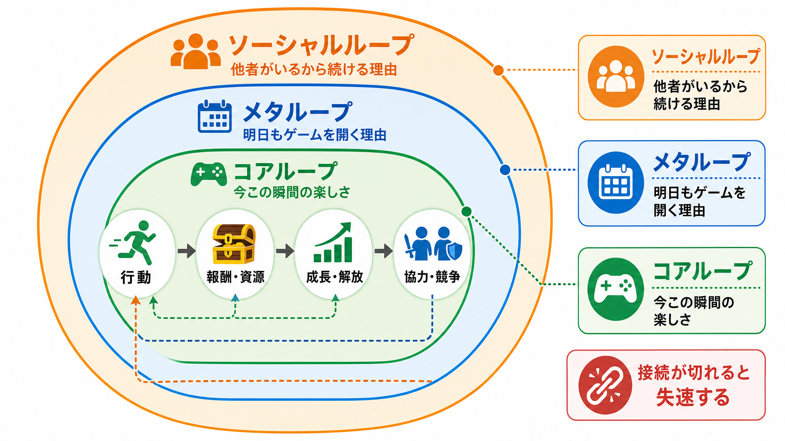

# コアループ・メタループ・ソーシャルループの3層設計——「今この瞬間」から「10年続くゲーム」への設計論

***

## はじめに

「面白いゲームはどのように作られるのか」という問いに対し、現代のゲームデザイン論が出した答えの一つが **ループ構造** だ。

プレイヤーがゲームを続ける理由は一つではない。「今この操作が気持ちいい」という瞬間的な快楽もあれば、「レベルを上げてもっと強くなりたい」という中長期の目標もある。さらに「ギルドメンバーのために貢献したい」「フレンドに勝ちたい」という社会的な動機もある。この三層の動機を **コアループ・メタループ・ソーシャルループ** という構造で設計する考え方が、現代の長寿運営型ゲームの骨格となっている。[[1](#ref-1)][[2](#ref-2)]

この記事では3つのループそれぞれの定義と役割を解説し、実際のタイトルへの当てはめ方、そしてループ間の「接続の断絶」という設計失敗のパターンまでを扱う。


*図：コアループを中心に、メタループとソーシャルループが外側へ重なり、各層が相互に動機と報酬を送り合う構造。*

***

## コアループ——「今この瞬間の楽しさ」

### 定義

コアループとは、 **プレイヤーが秒〜分単位で繰り返す最小の行動サイクル** だ。ゲームの「心拍」とも呼ばれ、すべての設計の起点となる。[[3](#ref-3)][[4](#ref-4)][[1](#ref-1)]

構造はシンプルだ：[[5](#ref-5)][[6](#ref-6)]

> **アクション → チャレンジ（障害）→ フィードバック（報酬） → 次のアクションへ**

| ゲームタイトル | コアループの一文表現 |
|---|---|
| スーパーマリオ | 走る→ジャンプで越える→コインを取る→次の障害へ[[7](#ref-7)] |
| Clash of Clans | 資源収集→施設建設/兵士訓練→バトル→資源収集[[8](#ref-8)] |
| テトリス | ブロックを置く→ラインを消す→次のブロックへ |
| Pokémon GO | 歩く→ポケモンと出会う→捕まえる→進化させる[[9](#ref-9)] |

コアループの判断基準として、次の3問が機能する：[[10](#ref-10)]

- プレイヤーは **何をしているのか？**
- 何が **邪魔しているのか？**（チャレンジの所在）
- **なぜそれをしているのか？**（動機の明示）

この3問に答えられないときは、コアループがまだ定まっていないサインだ。[[7](#ref-7)]

### コアループの条件

コアループの品質を決める要素は3点だ：[[11](#ref-11)][[5](#ref-5)]

1. **即時フィードバックの明確さ**：行動の結果が瞬時に、視覚的・聴覚的に返ってくること。SE・エフェクト・数字の飛び出し（ダメージポップアップ）はすべてフィードバックの一部だ
2. **繰り返しへの耐性**：100回繰り返しても飽きない設計になっているか。単純作業（操作に判断が伴わない）になっていないか[[7](#ref-7)]
3. **スケールの適切さ**：コアループは短く完結すべきだ。モバイルゲームでは1セッション（5〜10分）の中で複数回回ることが理想とされる[[8](#ref-8)][[12](#ref-12)]

**よくある失敗：コアループが「作業化」する**

コアループからプレイヤーの判断が失われると作業になる。「攻撃ボタンを押し続けるだけ」「同じ場所を往復するだけ」の状態になると、メタループやソーシャルループがどれほど優れていても、プレイヤーの動機は持続しない。コアループにリスクとリターンの判断が存在するかどうかが、「遊び」と「作業」の分岐点だ。[[13](#ref-13)][[7](#ref-7)]

***

## メタループ——「明日もゲームを開く理由」

### 定義

メタループとは、 **コアループを複数回繰り返すことで進行する、より大きなサイクル** だ。「なぜコアループを繰り返すのか」という理由を与える構造とも言える。[[14](#ref-14)][[5](#ref-5)][[7](#ref-7)]

> コアループ ×N回 → リソース蓄積 → 成長・解放 → より難しいコアループへ

代表的なメタループの形式：[[2](#ref-2)][[5](#ref-5)]

| 形式 | 内容 | 代表的な実装例 |
|---|---|---|
| **強化・育成型** | コアループで得たリソースでキャラ・装備を強化する | Clash of Clans のベース強化、原神のキャラ育成 |
| **解放・探索型** | コアループを進めると新しいエリア・コンテンツが開く | スーパーマリオの新ワールド解放 |
| **コレクション型** | コアループで得るたびにコレクションが増える | Pokémon GO の図鑑完成[[9](#ref-9)] |
| **ランク・プレステージ型** | 累積の成果としてプレイヤー評価が変化する | バトルロイヤルのリーグ昇格、Clash of Clans のトロフィー |
| **シーズン型（バトルパス）** | 期限付きの報酬トラックで週単位の目標を作る | Fortniteのバトルパス[[15](#ref-15)] |

### メタループの構造的役割

メタループが果たす最大の機能は **「今日より明日の自分を強くする」という期待** を生み出すことだ。プレイヤーは今日のセッションを終える際に「次にログインすると何が進んでいるか」「何ができるようになるか」を予測できる状態にある必要がある。[[16](#ref-16)]

D30以降の長期リテンションを支えるのはコアループの瞬間的な快楽ではなく、このメタループによる「続ける理由」だ。Clash of Clansのような10年以上稼働するゲームが持続できるのは、メタループの進行が常に新鮮な目標を供給し続けるからだ。[[2](#ref-2)][[8](#ref-8)]

### コアとメタの接続

メタループはコアループの **外側にあるが、孤立してはいけない**。以下の双方向の接続が成立しているかを確認する：[[7](#ref-7)][[2](#ref-2)]

- **コアループの成果がメタループを前進させる**（例：バトルで勝つ→トロフィーが増える）
- **メタループの成果がコアループを変化させる**（例：装備が強化された→バトルの戦略が変わる）

この接続が切れているとき、どちらかが「浮いた」状態になる。「バトルに勝っても特に何も変わらない」ならメタループが機能していない。「キャラを育てても戦闘が同じ操作の繰り返しで変わらない」ならコアへの接続が壊れている。

***

## ソーシャルループ——「他者がいるから続ける理由」

### 定義

ソーシャルループとは、 **他のプレイヤーとの関係性が生む行動サイクル** だ。コアループとメタループの外側に位置し、最も強力かつ最も設計が難しい層だ。[[2](#ref-2)]

構造としては3段階で育てるのが有効とされる：[[17](#ref-17)]

> **独りで楽しむ → 他者と協力する → 他者と競争する**

最初から競争を強制するソーシャル設計は、ゲームを習得していないプレイヤーに苦痛を与え、早期離脱を招く。まず「一人でも面白い」コアとメタを体験させ、その後自然な流れでソーシャル要素に引き込むことが重要だ。[[17](#ref-17)]

### ソーシャルメカニクスの3分類

| 種別 | 内容 | 代表的な実装 |
|---|---|---|
| **協力（Collaboration）** | 目標を共有し、共に達成する | ギルドレイド・クランウォー・マルチプレイヤー協力ミッション |
| **競争（Competition）** | 他者と順位・スコアを競う | リーダーボード・ランクマッチ・ギルド間対抗イベント |
| **顕示（Show-off）** | 自分の成果・スキン・カスタマイズを他者に見せる | Fortniteのスキン・マイクラの建築共有 |

Clash of Clansにおけるソーシャルループは：[[2](#ref-2)]
- **クランに参加する**（帰属意識の生成）
- **クランメンバーを援軍で支援する**（協力）
- **クランウォーで他クランと戦う**（競争）
- **クランのランキングを上げる**（集団としての成果の顕示）

というサイクルで構成されており、個人の目標（メタループ）を超えた「クランのために戦う」という社会的動機が、長期的なリテンションを支えている。

### ソーシャルループの設計上の落とし穴

**1. 強制型ソーシャルの弊害**

「フレンドを招待しないとアイテムが手に入らない」「ギルドに入らないと特定の報酬が解禁されない」という設計は、短期的にはK-factor（ユーザー獲得の口コミ係数）を高めるが、長期的にはゲーム体験を損なうとされる。強制された社会的行動は関係性を生まない。[[17](#ref-17)]

**2. コアと切り離されたソーシャル機能**

コアループのゲームプレイと無関係な場所でソーシャル機能が追加されると、プレイヤーはどちらかに集中し、もう一方を無視するようになる。「ギルドチャットはあるが、協力して達成するコンテンツがない」という状態がその典型だ。[[2](#ref-2)]

***

## 3層の「接続」を設計する

3つのループが個別に成立していても、それぞれが切り離されたままでは効果は薄い。重要なのは **ループ間のエネルギーの流れ** だ。

```
[ソーシャルループ]
     ↕ （仲間の行動が動機になる）
[メタループ]
     ↕ （成長の成果がコアを変える）
[コアループ]
```

健全な接続の具体例：[[7](#ref-7)][[2](#ref-2)]

- コアループで得た資源 → メタループの施設強化に使う（コア→メタ）
- メタループで強化された戦力 → コアループの難易度が変わる（メタ→コア）
- メタループの進捗 → ギルドランキングに反映される（メタ→ソーシャル）
- ソーシャルループの協力プレイ → メタループ限定の報酬が解禁される（ソーシャル→メタ）

### ループ間の断絶が生む「失速」

各ループが孤立しているとき、ゲームは特定の時期に突然失速する：[[18](#ref-18)][[13](#ref-13)]

| 断絶の場所 | 現象 | 症状として観測されやすい指標 |
|---|---|---|
| コアループが機能していない | メタを追う義務感だけが残り、苦痛になる | D1リテンションの低さ |
| コア→メタの接続が切れている | コアはやるが「結果が何も変わらない」虚無感 | D7での大幅離脱 |
| メタ→コアの接続が切れている | 育成を続けるが戦闘が変わらない「マンネリ」 | D30以降の自然減 |
| ソーシャルが孤立している | ソーシャル機能を使う人と使わない人に二極化 | 上位ユーザーの集中・下位ユーザーの離脱 |

***

## ジャンル別の3層設計の傾向

ジャンルによって、どのループに重心を置くかは異なる。

| ジャンル | コアの強さ | メタの深さ | ソーシャルの比重 |
|---|---|---|---|
| ハイパーカジュアル | ★★★★★（最優先） | ★★（薄い） | ★（ほぼなし） |
| パズル（キャンディクラッシュ等） | ★★★★ | ★★★（ステージ進行・ライフ制） | ★★（トーナメント・友達ランキング） |
| ミッドコア（Clash of Clans等） | ★★★ | ★★★★★（最優先） | ★★★★（クランが核） |
| MMORPG・ソーシャルゲーム | ★★★ | ★★★★ | ★★★★★（最優先） |
| バトルロイヤル（Fortnite等） | ★★★★★ | ★★★★（バトルパス・スキン） | ★★★★（フレンドとのプレイ） |

**Pokémon GOが示したソーシャルループの特殊解**

Pokémon GOはコアループ（歩く→捕まえる→育てる）の外側に、 **現実世界の場所共有** というリアルワールドソーシャルループを接続した。「今あそこにレアポケモンが出ている」という情報を人と共有することが自発的に起こり、公園や観光地に見知らぬプレイヤーが集まる現象を生み出した。これはゲーム内に実装されたソーシャルメカニクスではなく、コアループ（歩いて捕まえる）の設計が現実世界でのソーシャルループを自然発生させた例だ。[[9](#ref-9)]

***

## 設計の出発点：コアから積み上げる原則

3つのループの設計順序には原則がある。 **コアループを先に固め、そこにメタとソーシャルを積み上げる**。[[13](#ref-13)][[7](#ref-7)]

「失敗するゲームの兆候として最も多いのは、コアサイクルが確定しないまま周辺開発に進むこと」。メタループのガチャや育成システムを先に設計してコアを後回しにすると、コアが「報酬を受け取るための義務作業」に成り下がる。どれほど豪華なメタやソーシャルを用意しても、コアが楽しくなければプレイヤーは戻ってこない。[[19](#ref-19)][[13](#ref-13)]

実践的な設計チェックリスト：[[4](#ref-4)][[7](#ref-7)]

1. **コアループを1文で言えるか？**（「プレイヤーは何をして何を得るか」）
2. **コアループに毎回の「判断」があるか？**（作業ではないか）
3. **コアループの結果が、メタループを具体的に前進させるか？**
4. **メタループで得たものが、コアループに変化をもたらすか？**
5. **ソーシャル機能は強制でなく、「使いたい」設計になっているか？**
6. **コアが楽しくなければ、他の2つは機能しないことを常に念頭に置いているか？**

***

## コラム：コアループのないゲームは「やめどき」が常にある

プレイヤーがゲームをやめるとき、その瞬間は多くの場合「コアループの区切り」に訪れる。戦闘に勝った瞬間、ステージをクリアした瞬間、クエストを終えた瞬間——これらは全員にとって「自然なやめどき」だ。

優れたコアループは「やめどきを迎えた瞬間に次のコアループを始めたくさせる設計」になっている。「もう一戦だけ」「もう一部屋だけ」——このフレーズを引き出せるコアループの設計こそが、セッション時間の延長とD1リテンションに直結する。コアループが終わる瞬間に次のループへの橋が架かっているかどうかを、常に設計の段階で確認してほしい。[[10](#ref-10)]

---

## References

<a id="ref-1"></a>1. [What is a Core Gameplay Loop? How to Design a ... - YouTube][1] - In this video, Om Tandom delves into the concept of a game's core loop, a fundamental element in gam...

<a id="ref-2"></a>2. [How to create a mobile game that runs successfully for a decade?][2] - A meta game loop should not exist outside of core loop. Such meta loops confuse the players on the g...

<a id="ref-3"></a>3. [ゲームデザインのコアループ理論 - soy-software][3] - つまり、そんな感じでコアループのたのしさを最初に追求して、そこから広げていくという作り方が、コアループベースでゲームを作る手法という事でしょう。

<a id="ref-4"></a>4. [Sebastian Kalemba's Post - LinkedIn][4] - The core gameplay loop is the heartbeat of your game. It's the cycle of actions players will perform...

<a id="ref-5"></a>5. [Game Loop Basics: Key Types & Design Tips for 2026 - Hitem3D][5] - Get the full breakdown of game loops: core, meta, onboarding, plus design tips to boost player engag...

<a id="ref-6"></a>6. [What Is a Gameloop in Game Design? Core Loop Explained][6] - What's the difference between a core loop and a meta loop? The core loop is the moment-to-moment gam...

<a id="ref-7"></a>7. [【ゲームプランナー基礎講座】コアループとメタループ｜ UKIUKI][7] - コアループ（バトル）を繰り返すたびに新しいポケモンと出会える設計になっている。 解放・探索系 最初は閉じているエリアやコンテンツが、進めるにつれて ...

<a id="ref-8"></a>8. [Mid-Core Success Part 1: Core Loops - Deconstructor of Fun][8] - In all its simplicity, Clash of Clans' core loop consists of three different actions: resource colle...

<a id="ref-9"></a>9. [Deconstructing Pokemon Go's fun - Prototypr][9] - Core game loop. Pokemon Go is a collectible card game (CCG) at its heart. The core loop of the game ...

<a id="ref-10"></a>10. [Core Loop - Deliberate Game Design][10] - A core loop is a simple diagram that shows the player actions during the game, briefly explaining ho...

<a id="ref-11"></a>11. [The Importance of a Well Defined Core Gameplay Loop][11] - The core gameplay loop is the primary system or set of mechanics that someone is going to spend doin...

<a id="ref-12"></a>12. [What is a Core Loop in a Mobile Game? - Homa Games][12] - The core loop is essentially the very heartbeat of your game. It is a series or chain of actions tha...

<a id="ref-13"></a>13. [失敗するゲーム、開発時の兆候、その対策 - note][13] - 大失敗する多くの例は、プロトタイプ版、または初期段階で、ゲームのコアサイクルが確定しないままに制作を進行するケースが圧倒的に多い。 なので、コア ...

<a id="ref-14"></a>14. [Core Loop vs Meta Loop: Game Design Fundamentals - LinkedIn][14] - Core Loop vs Meta Loop — What's the Difference? Great games keep players engaged not by luck, but by...

<a id="ref-15"></a>15. [Let's Talk Battle Passes - Part 1 - LinkedIn][15] - In this series, we'll specifically take a look at the battle passes found in Fortnite, Call of Duty:...

<a id="ref-16"></a>16. [メタループ - Playdate 非公式 開発まとめ wiki - atwiki（アットウィキ）][16] - メタループは、ゲームという体験を「一過性の遊び」から「生活の一部や習慣」へと昇華させるための、いわば「設計図の骨組み」にあたる部分と言えます。

<a id="ref-17"></a>17. [Mid-Core Success Part 3: Social - GameAnalytics][17] - The kind of social mechanics that add to the gameplay, improve overall player experience and make th...

<a id="ref-18"></a>18. [Core Loop vs Meta Loop: Game Design Fundamentals - LinkedIn][18] - When the meta loop rewards behavior the core loop doesn't make satisfying — or the core loop produce...

<a id="ref-19"></a>19. [Core Loop & Meta Loop Explained: Why Your Game Needs Both ...][19] - Why do some games keep players for years, while others fade in weeks? The answer lies in your core l...

[1]: https://www.youtube.com/watch?v=BXnGV6SuOsw
[2]: https://www.linkedin.com/pulse/how-create-mobile-game-runs-successfully-decade-ramakrishna-reddy-y-l
[3]: https://soysoftware.sakura.ne.jp/archives/3001
[4]: https://www.linkedin.com/posts/skalemba_error-log-27-if-your-core-gameplay-loop-activity-7261996215217618945-srde
[5]: https://www.hitem3d.ai/blog/en-What-is-a-Game-Loop-The-Core-Concept-Every-Game-Designer-Must-Understand/
[6]: https://tonogameconsultants.com/gameloop/
[7]: https://note.com/ukiukiblog/n/n337b1f91eed8
[8]: https://www.deconstructoroffun.com/blog/2013/10/mid-core-success-part-1-core-loops.html
[9]: https://blog.prototypr.io/deconstructing-pokemon-gos-fun-1a20dd459aa8
[10]: https://deliberategamedesign.com/core-loop/
[11]: https://www.gamedeveloper.com/design/the-importance-of-a-well-defined-core-gameplay-loop
[12]: https://www.homagames.com/blog/what-is-a-core-loop-in-a-mobile-game
[13]: https://note.com/ukyousan/n/n0f663d2d5e41
[14]: https://www.linkedin.com/posts/sankurisamith14_gamedevelopment-mobilegames-gamingindustry-activity-7402578158107164673-J57j
[15]: https://www.linkedin.com/pulse/lets-talk-battle-passes-part-1-scott-fine-faulc
[16]: https://w.atwiki.jp/playdate/pages/357.html
[17]: https://www.gameanalytics.com/blog/mid-core-success-part-3-social
[18]: https://www.linkedin.com/posts/muhammad-talha-malik-b1755a260_copied-activity-7413104428217704448-zqt_
[19]: https://www.youtube.com/watch?v=syGDfzLgzCk

----

この文書は、Perplexity、Claude、OpenAI Codex の3つのAIの支援を受けて著述されたものです。引用画像を除き、MIT License にて提供されています。
