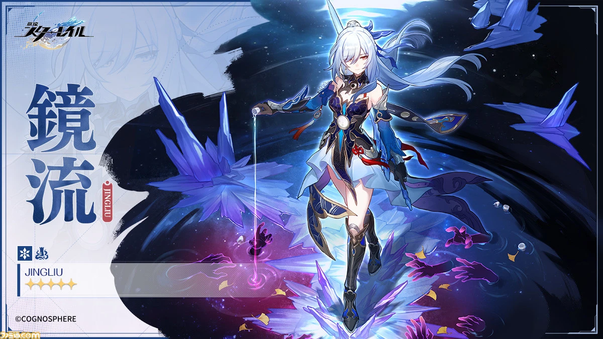
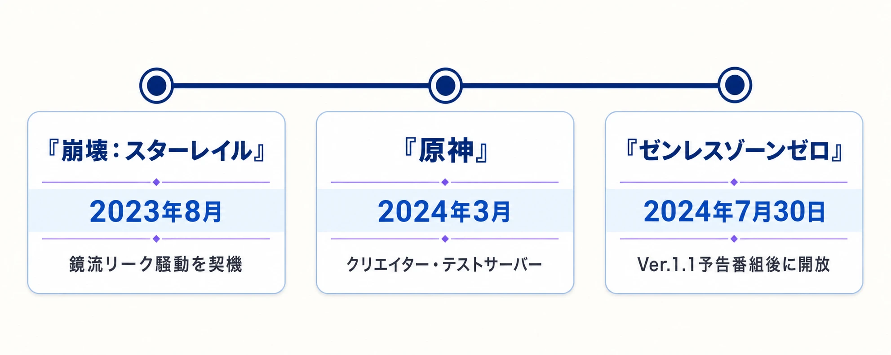
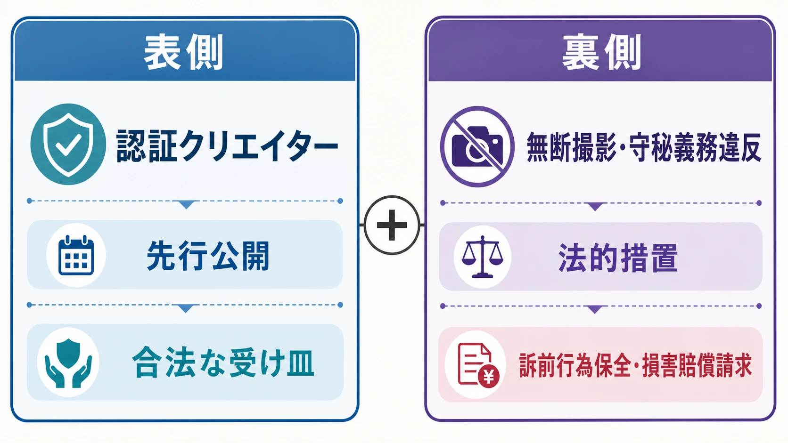

# 「創作体験サーバー」はリーク対策か、先行広告か――HoYoverseの制度を運用型ゲームの設計として読む

> **注意：** 本稿は、クリエイターへの先行プレイ提供と表示規制の関係を扱うものであり、法的助言ではありません。日本で同種の制度を設計・運用する際は、配信地域と提供条件に応じて法務部門または弁護士に確認してください。

『崩壊：スターレイル』の鏡流をめぐる2023年夏の情報流通は、運用型ガチャゲームが抱える矛盾をよく表している。鏡流は2023年8月15日に公式がビジュアルを公開し、10月11日のVer.1.4で正式に実装された。一方、正式実装のはるか前から、技能、戦闘中の挙動、専用光円錐に関する非公式情報が報じられ、プレイヤーは未実装の性能を前提に編成や取得を検討できる状態にあった。[[1](#ref-1)][[2](#ref-2)]

プレイヤーは、将来のキャラクターの性能や編成適性を知ってから、限られたゲーム内通貨をどこに投じるか決めたい。開発・運営側は、未完成の数値や物語上の仕掛けを、意図した順序と品質で届けたい。鏡流のような限定キャラクターでは、その二つが発売前の数週間に正面から衝突する。

HoYoverse／miHoYoが各タイトルへ展開した「創作体験サーバー」は、この衝突に対する情報流通の設計である。認証したクリエイターに限定して先行プレイを提供し、公開内容と時期を管理する。非公式リークに流れていた注目を公式の流通路へ引き寄せる仕組みであると同時に、キャラクターという商品を売る前の先行広告を、クリエイターの発信として流通させる仕組みでもある。

鏡流をめぐる騒動は、その需要構造が最も見えやすく表れた事例である。制度はリークを消滅させる魔法ではない。需要の一部を合法な出口へ導き、残る漏えいには契約と法的措置で対応する。その二段構えを、日本語圏ではまず『崩壊：スターレイル』の動画として目にし、その後『原神』と『ゼンレスゾーンゼロ』でも目にすることになった。

*画像出典（引用）：HoYoverse／COGNOSPHERE、[『崩壊：スターレイル』公式Xの鏡流キャラカード（2023年8月15日）](https://x.com/houkaistarrail/status/1691298829222424576)。[ファミ通.com掲載ページ](https://www.famitsu.com/news/202308/15313359.html)の公式提供画像をWebP変換。*

***

## リークが慢性化するのは、情報需要が先にあるからである

運用型ガチャゲームのキャラクターは、見た目や物語だけで選ばれる商品ではない。役割、属性、戦闘の手触り、既存キャラクターとの相性、必要な限界突破や装備までが、取得判断に含まれる。正式実装後に試用機会を用意していても、実装前に貯蓄を続けるか、直近の別キャラクターを取得するかは決めなければならない。

このため、性能表、モーション、戦闘映像、今後どのキャラクターがいつ登場するかといった情報は、単なる好奇心の対象ではなく、プレイヤーの購買計画に組み込まれる。そこに未完成のテストデータが流入すると、情報を出した者は注目を集め、受け取った者は先回りした判断材料を得る。情報源が無許可であることと、情報への需要があることは別の問題である。

しかし、テスト中の性能は変更される。開発中の映像は、最終品質や体験導線を保証しない。『崩壊：スターレイル』の開発側も2024年3月の公式番組で、Ver.2.0のキャラクター、物語、コンテンツのサプライズがリークされたことに触れ、情報を伝える順序そのものが体験設計の一部だと説明した。[[3](#ref-3)]

ここで重要なのは、リーク対策を「秘密を守る法務施策」だけと捉えないことである。プレイヤーが必要とする判断材料を公式がまったく出さないなら、非公式情報の市場は残る。反対に、すべてを早期に公開すれば、物語の驚きや発表イベントの価値、変更前データによる誤解を失う。創作体験サーバーは、この両極の間に、制御可能な情報の出口を作る試みである。

***

## 日本語圏で見えた導入順――まず『崩壊：スターレイル』

創作体験サーバーは、通常のクローズドテストとは役割が異なる。品質検証だけを目的にするテストでは、参加者に守秘義務を課し、外部公開を禁じる。創作体験サーバーは、選ばれたクリエイターに先行体験と公開を許す代わりに、公開物を運営の管理下に置く。

| 要素 | 創作体験サーバーでの役割 | 設計上の狙い |
| --- | --- | --- |
| 参加者の選定 | 認証・招待したクリエイターだけにアクセスを渡す | 受領者を特定し、説明・契約・失効を可能にする |
| 先行プレイ | 未実装のキャラクター、イベント、戦闘体験を扱える | プレイヤーが求める具体的な判断材料を、公式経路から供給する |
| 事前審査 | 公開前に動画、画像、文章を運営側が確認する | 未確定データ、秘密情報、誤認を招く編集を公開前に止める |
| 公開時刻の管理 | 審査を通した素材を指定の公開ウィンドウで出す | 招待者どうしの早い者勝ちを抑え、発表や実装との順序をそろえる |
| 表示と免責 | 体験サーバーの内容であり正式版と異なる可能性を示す | 先行情報を確定仕様と誤認させない |

日本語圏でこの仕組みを最初に具体的な動画・攻略情報として見せたのは『崩壊：スターレイル』である。2024年3月21日、Ver.2.1で実装される黄泉について、列車運営チームから創作体験サーバーへ招待されたクリエイターが、公開可能なテスト環境で得た数値と検証を用いたガイドを公開した。記事内では、通常のテストサーバーと違って外部公開が可能であること、正式実装時には数値や仕様が変わる可能性があることも説明されている。[[4](#ref-4)]

このうち公開時刻の管理は、運用設計として見落としやすい。審査だけでは、承認を早く得た人が先に投稿し、他の参加者の取材・編集時間を奪う競争が生まれる。公開時刻をそろえることで、希少なアクセス権を持つ者同士の速度競争を、内容の比較可能性へ置き換えられる。発表番組、SNS投稿、攻略記事、動画の公開時期を、一つの流れとしてそろえる考え方である。

次に『原神』へ同じ発想が現れた。2024年3月には、未公開キャラクターなどをクリエイターが画像・動画で紹介できる「コンテンツクリエイター・テストサーバー」が報じられた。公開前にHoYoverseの審査・承認を受け、違反時にはクリエイターとの提携が終了し得ること、性能を一言で切り捨てるよりも長所・短所を挙げる形が推奨されたことが伝えられている。[[5](#ref-5)] 日本語圏では同年8月23日、マグロヘッド氏が★5「ムアラニ」の解説動画を「創作体験サーバーによる先行プレイ」と明記して公開した。[[6](#ref-6)]

『ゼンレスゾーンゼロ』でも、2024年7月30日にVer.1.1予告番組の配信後、クリエイター向けの創作体験サーバーを開放すると告知された。日本語のゲームメディアは、視聴者にクリエイターによる動画・配信も確認するよう案内している。[[7](#ref-7)] 『崩壊：スターレイル』で先行公開の型を見せ、同年の『原神』と『ゼンレスゾーンゼロ』で日本語圏の視聴者にも接点を広げた流れからは、単発の火消しではなく、会社としての恒常的な情報流通戦略が見える。

*日本語圏で見えた導入時系列。各日付と制度名は本文の記述に対応する。*

もっとも、各タイトルで公開対象、公開時期、招待条件まで同一だと考える必要はない。制度の核は「先行情報を許す」ことではなく、「誰が、何を、いつ、どの表示で出すかを運営が設計する」ことにある。

***

## 合法な受け皿と法的措置を組み合わせる

創作体験サーバーの第一の利点は、違法・無許可の情報が満たしていた需要の一部を、合法なチャンネルへ移せる点にある。公式審査済みの映像であれば、少なくとも出所、公開許諾、バージョンの注意書きをそろえられる。プレイヤーは、断片的なデータや出所不明の翻訳だけでなく、実際の操作や編成を見て判断できる。

第二の利点は、法的措置と矛盾せずに併用できる点である。提供すべき情報は公式経路で提供し、それ以外の不正取得・守秘義務違反は追及する。表側ではクリエイターの先行公開を受け皿にし、裏側ではテスト参加者による漏えいを追及する。この二つを併用することで、「公開してよい情報」と「公開してはいけない情報」の境界を運営自身が具体的に示せる。

*創作体験サーバーにおける、先行公開と法的措置の二段構え。*

実際に上海市浦東新区人民法院は2024年3月、『崩壊：スターレイル』の内部テスト参加者が無断で画面を撮影・録画して未公開のゲーム設計を保存したとして、miHoYo側の訴前行為保全を認めた。裁判所は48時間以内に、当該内容を開示・使用・第三者に使用させないよう命じている。[[8](#ref-8)] その後の判決では、当該参加者に侵害の停止、影響を除去する声明の掲載、経済的損失と合理的費用を合わせた50万元の賠償が命じられたと報じられた。[[9](#ref-9)]

miHoYoは2025年2月のゲーム情報の漏えい対策について、200人超の漏えい者を追及し、単独の侵害者に対する最高賠償額が55万元に達したと公表した。刑事強制措置や行政処分に至った関係者もいる。[[10](#ref-10)] ここでの数字は制度の有効性そのものを測るKPIではないが、アクセス権の管理と法的執行が二段構えで運用されていることは示している。

第三の利点は、クリエイターとの関係を「発売後の攻略募集」だけから前へ伸ばせる点にある。正式版が来てから攻略を競うより、先行体験の段階から注意書き、撮影素材、誤認しやすい仕様を共有できる。コミュニティ担当がクリエイターの質問を受け、開発が変更点を説明し、広報が公開日を合わせる。これは宣伝枠の買い付けでは代替しにくい、運用チームの学習回路になり得る。

***

## 先行レビューは、独立したレビューなのか

ここからが制度の本題である。ガチャで取得するキャラクターは、プレイヤーが時間や有償通貨を投じて獲得する商品である。実装前に認証クリエイターが性能、モーション、編成例を動画で見せれば、その動画は購入判断に影響する先行広告として機能する。視聴者にとっては攻略動画に見えても、アクセス権の選定、公開物の審査、公開時刻の指定が加われば、通常の独立レビューとは条件が違う。

原神向けテストサーバーで報じられた「批判してはいけないわけではないが、長所・短所を挙げる」という姿勢は、この境界をよく表している。断定的な酷評を避け、比較可能な説明を促すことには、未確定のテスト仕様を扱うという合理性がある。数日後に修正される数値を前提に「弱い」と言い切る発信は、視聴者にもクリエイターにも損害を与え得る。[[5](#ref-5)]

一方で、何を「断定的すぎる」とし、何を「長所・短所の説明」と認めるかを事業者が審査する以上、表現の境界は事業者の側にある。招待の継続、公開物の審査、視聴回数の価値が結び付くと、クリエイターは明示的に禁止されなくても、次回の招待を失わない言い方を選びやすい。これは個々のクリエイターの誠実さの問題ではなく、継続的な取引関係が生む構造である。

したがって、プランナーや運営担当が問うべきなのは「批判を許すか、禁止するか」だけではない。次のような問いである。

- 仕様変更の可能性を伝えたうえで、低評価・不便さ・相性の悪さをどこまで具体的に話せるか。
- 事実誤認、未公開情報、誹謗中傷を除く審査基準を、クリエイターへ事前に開示しているか。
- 修正依頼の履歴と理由を残し、広報上の好ましさだけで却下していないか。
- 招待を停止する条件と、その判断に異議を申し立てる経路があるか。

先行広告であること自体は悪ではない。問題は、広告・提供関係の表示なしに、独立した第三者の評価と受け取られることである。制度を成立させるなら、先行性と独立性のどちらをどこまで約束するのかを、視聴者にも分かる形で決めなければならない。

***

## 日本で導入するなら、ステマ規制を「表示設計」に入れる

日本では、2023年10月1日から、事業者の広告であることを一般消費者が判別しにくい表示が景品表示法上の規制対象となった。企業がインフルエンサー等の第三者へ依頼・指示するSNS投稿やレビューも対象になり得る。規制の直接の対象は広告主である。[[11](#ref-11)]

先行アクセスを提供し、公開内容を事前審査する動画が日本の消費者に届くなら、この規制は広告主が制度設計に織り込むべき運用条件となる。

創作体験サーバーを日本向けに運用する場合、金銭を支払っていないから広告と無関係だ、と考えるのは危険である。消費者庁は、特定のインフルエンサーを選んで商品を無償提供し、投稿を依頼する場面について、やり取り、提供内容・目的、過去・将来の取引関係などによっては、第三者の自主的な表示とは認められず「事業者の表示」になり得ると示している。事業者の表示に当たる場合は、それを明瞭にしなければならない。[[12](#ref-12)]

先行プレイのアカウント、未公開ビルドへのアクセス、事前に編集できる時間、継続的な招待は、少なくとも発信者に経済的・事業上の利益を与え得る。個別事案で広告表示に当たるかは提供条件や実態で判断されるが、だからこそ制度側が先に表示の基準を持つべきである。「創作体験サーバーで先行プレイ」「HoYoverseから提供を受けた先行情報」「広告・PR」といった表示を、動画の冒頭、概要欄、投稿本文、サムネイル周辺の少なくとも視聴者が見落としにくい位置に統一する。概要欄の末尾だけへ隠す運用は避けたい。

この表示は、クリエイターを縛るための注記ではない。視聴者が、通常の購入済みレビューなのか、先行アクセスを受けて審査を通した情報なのかを区別するためのUIである。広告主はクリエイターへのガイド配布だけで終えず、テンプレート、投稿前チェック、修正ルール、記録保管までを運用に含める必要がある。

***

## プランナーはリーク発生後ではなく、開発初期から設計する

この制度を検討するなら、大規模リークが起きてから広報施策として後付けするより、開発初期から情報流通の設計として置くほうがよい。新キャラクターをどの段階で外部へ見せられるか、性能凍結はいつか、何が未確定か、実装版との差分を誰が告知するかを、開発スケジュールと並べて決める。コンテンツの完成度ではなく「外部公開に耐える完成度」を管理する工程が一つ増えるからである。

運営責任を一部署へ丸投げしても機能しない。広報は公開日と表示を統括し、コミュニティ担当は参加者との継続関係と質問を扱い、法務は契約、守秘、広告表示、違反時の対応を確認する。ゲームプランナーは、テスト版と正式版の差分、比較してよい編成、公開してはいけない物語要素を定義する。最終決裁者は一人に定めつつ、各部門が拒否・差し戻しできる条件を文書化する必要がある。

クリエイター向けのステマ表示ガイドラインも、契約書の末尾に置くだけでは足りない。招待時の説明、動画テンプレート、投稿画面のチェック項目、更新時の再周知までを一つの導線にする。特に先行アクセスの提供、事前審査、継続招待があるなら、広告・PR表示を標準にし、例外を個別に判断するほうが安全である。

批判的意見を許容するルールも、抽象的な「健全なコミュニティ」の語で済ませない。「未確定の数値を確定仕様として断言しない」「他者への攻撃をしない」といった禁止事項と、「操作感が悪い」「低い限界突破では役割を果たしにくい」「特定の編成では価値が薄い」といった評価を許す範囲を分ける。審査者が好意的な言葉だけを求める制度は、短期的には整った宣伝面を作れても、視聴者の信頼とクリエイターの専門性を失う。

創作体験サーバーは、リークとのいたちごっこを根本から終わらせる仕組みではない。非公式情報を求める需要の一部を、公開時期・内容・表示を制御できる合法チャネルへ誘導し、残る不正取得や守秘義務違反には法的措置を組み合わせる対症療法である。それでも、情報を隠すか漏らされるかの二択を、情報を設計して届けるという第三の選択肢へ変える価値はある。運用型タイトルのプランナーに必要なのは、制度をリーク対策の末端に置くことではなく、プレイヤーの判断、クリエイターの自律、広告の透明性を同時に成立させる情報流通の本体として扱うことである。

## References

1. [HoYoverse「Version 1.4 “Jolted Awake From a Winter Dream” Update」][1] - Ver.1.4の更新開始時刻を2023年10月11日として告知した公式コミュニティ投稿。

2. [AreaJugones「Honkai: Star Rail presenta a Jingliu, nuevo personaje para la 1.4: filtradas habilidades y su cono de luz」][2] - 2023年8月15日に、公式発表と併せて鏡流の技能・光円錐のリーク情報を報じたゲームニュース記事。

3. [Game*Spark「『崩壊：スターレイル』開発者が“リーク”にコメント」][3] - 2024年3月の公式番組における、Ver.2.0のリークと情報の伝え方に関する開発側の説明を報じた記事。

4. [真面目にゲームする！「【崩壊スターレイル】黄泉ガイド」][4] - 2024年3月21日、創作体験サーバーへ招待されたクリエイターが、外部公開可能なテスト環境で得た情報を用いて公開した日本語ガイド。

5. [Merlin'in Kazani「HoYoverse is Making Changes to Content Creator Test Server」][5] - 2024年3月に報じられた原神向けコンテンツクリエイター・テストサーバーの公開前審査、提携終了、長所・短所を挙げる運用方針。

6. [マグロヘッド氏のX投稿「★5『ムアラニ』解説」][6] - 2024年8月23日、動画が創作体験サーバーによる先行プレイであることを明記して公開を告知した本人投稿。

7. [インサイド「『ゼンレスゾーンゼロ』Ver.1.1予告番組が8月3日配信決定！」][7] - 2024年7月30日、Ver.1.1予告番組後にクリエイター向け創作体験サーバーを開放すると伝えた日本語ゲームメディアの記事。

8. [浦東法院による政務記事「游戏内测泄密，米哈游紧急申请诉前行为禁令」][8] - テスト参加者による無断撮影・録画と、48時間以内の訴前行為保全決定を説明する公的記事。

9. [新浪財経「测试玩家泄密未公开内容」][9] - 『崩壊：スターレイル』テスト参加者への50万元の賠償判決を報じた記事。

10. [IT之家「米哈游：向游戏泄密行为重拳出击，累计追责200余人」][10] - miHoYoの2025年2月の公表内容を伝える報道。追及人数と最高賠償額を含む。

11. [消費者庁「令和5年10月1日からステルスマーケティングは景品表示法違反となります。」][11] - 規制開始日、広告主が対象であること、第三者への依頼・指示を含むことの公式説明。

12. [消費者庁「ステルスマーケティングに関するQ&A」][12] - 特定インフルエンサーへの無償提供、投稿依頼、将来の取引関係を含む個別判断についての公式Q&A。

[1]: https://www.hoyolab.com/article/22241554
[2]: https://areajugones.sport.es/videojuegos/honkai-star-rail-presenta-a-jingliu-nuevo-personaje-para-la-1-4-filtradas-habilidades-y-su-cono-de-luz/
[3]: https://www.gamespark.jp/article/2024/03/18/139514.html
[4]: https://mazimenigame.com/hsr-acheron-guide-prelerease/
[5]: https://en.merlininkazani.com/hoyoverse-is-making-changes-to-content-creator-test-server/
[6]: https://x.com/magurohead270/status/1826825575098712392
[7]: https://www.inside-games.jp/article/2024/07/30/157915.html
[8]: https://www.thepaper.cn/newsDetail_forward_26821909
[9]: https://finance.sina.cn/2024-08-09/detail-inchzpnn2577776.d.html
[10]: https://m.ithome.com/html/830809.htm
[11]: https://www.caa.go.jp/policies/policy/representation/fair_labeling/stealth_marketing/
[12]: https://www.caa.go.jp/policies/policy/representation/fair_labeling/faq/stealth_marketing/

----

この文書は、Perplexity、Claude、OpenAI Codex の3つのAIの支援を受けて著述されたものです。引用画像を除き、MIT License にて提供されています。
