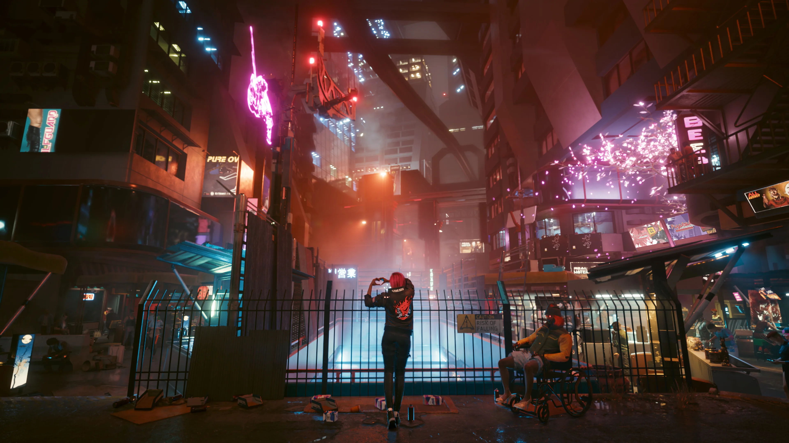

# Cyberpunk 2077 崩壊の構造

**― スコープ肥大・リリース判断・マーケティング乖離の解剖 ―**

***

## はじめに

2020年12月10日、CD Projekt Redが8年間（実質的な開発は2016年から約4年）の歳月と、推定総額約3億1,600万ドル（開発費約1.74億ドル＋マーケティング費約1.42億ドル）の制作費をかけた超大作RPG『Cyberpunk 2077』がリリースされた。800万件のプレオーダーを集め、Keanu Reevesが広告塔を務め、時代を代表する作品になるはずだったこのゲームは、発売直後に業界史上有数の炎上劇を引き起こした。[[1](#ref-1)][[2](#ref-2)][[3](#ref-3)]

この記事では「なぜそのゲームは失敗したのか」を開発側の意思決定の軸で解剖する。Cyberpunk 2077の事例は単なるバグまみれのゲームの話ではない。 **過剰な期待値の管理**、 **プラットフォームとスコープの不整合**、 **クランチ文化と品質の矛盾** （クランチとは、ゲーム開発の終盤などに常態化する長時間の残業・休日出勤を指す）という、ゲームプランナーが直接関与しうる三つの構造的問題が複合した事例である。

*画像引用: [Steam - Cyberpunk 2077](https://store.steampowered.com/app/1091500/Cyberpunk_2077/)（公式ストア掲載スクリーンショット, © CD PROJEKT S.A.。本文中の作品紹介・実ゲーム画面の説明に必要な範囲で引用）*

***

## 第一章：何が起きたか

### 発売直後の崩壊

2020年12月10日のリリース後、ゲームはたちまち批判の渦に飲み込まれた。

- **旧世代コンソール（PS4/Xbox One）のパフォーマンスが壊滅的**：フレームレートが10〜20fps台まで落ち込み、頻繁なクラッシュが発生[[4](#ref-4)][[5](#ref-5)]
- **ソニーがPS4版をPlayStation Storeから削除**：購入済みユーザーへの全額返金を実施。これはPS Storeの歴史上前例のない措置であった[[6](#ref-6)][[7](#ref-7)]
- **MicrosoftもXbox Storeで返金対応を発表**[[8](#ref-8)]
- **CD Projekt Redの株価が発売後約30%下落**。ピーク時から約40%低下し、時価総額換算で10億ドル以上が消えた[[2](#ref-2)][[9](#ref-9)]

CD Projekt Redは公式に謝罪し、「旧世代コンソールへの対応を重視すべきだった」と述べた。一方で800万件のプレオーダーと初日にして開発費を回収する販売数を記録しており、これは「史上最も成功した失敗作」と呼ばれる所以となった。[[10](#ref-10)][[8](#ref-8)]

### 数字で見る炎上の規模

| 指標 | 数値 | 備考 |
|---|---|---|
| 発売時プレオーダー数 | 800万件 | 発売前時点[[1](#ref-1)] |
| 発売後株価下落 | 約30〜40% | 時価総額換算で10億ドル超の消失[[2](#ref-2)] |
| クラスアクション訴訟の和解額 | 185万ドル | 2021年12月に和解合意、2023年に最終承認[[11](#ref-11)][[12](#ref-12)] |
| 推定回収可能損害額 | 最大1,100万ドル | 原告側コンサルタント試算[[11](#ref-11)] |
| 旧世代コンソールの最低フレームレート | 10fps台 | Digital Foundry調査[[4](#ref-4)] |

***

## 第二章：なぜそうなったのか

### 2-1. 開発スケジュールの実態

「8年かけて作ったのになぜ？」という疑問はしばしば語られるが、実際には **本格的な開発は2016年に始まった**。2012年の最初のアナウンス、そして2013年1月に公開されたコンセプトトレーラーは方向性の提示に過ぎず、The Witcher 3の最終DLC『Blood and Wine』（2016年5月）リリース後に開発チームが本格的に移行したものだ。[[13](#ref-13)][[3](#ref-3)]

つまり「4年間の開発で超大作をゼロから作る」というスケジュールに対し、 **対応できるかどうかの実態とは乖離したリリース日を次々と公表し続けた** ことが根幹の問題だ。

リリース日は以下のように変遷した：[[14](#ref-14)][[1](#ref-1)]

1. **2020年4月16日** （第1次発表）
2. **2020年9月17日** （第1次延期）
3. **2020年11月19日** （第2次延期）
4. **2020年12月10日** （第3次延期・最終）

3度の延期をしてなお品質が担保できていなかった背景には、内部的に「管理職が次世代機の発表前に旧世代機向けの版を出荷することを優先した」という判断があったとされる。開発者の間では「2022年まで発売は無理」という声が内部的に上がっていたとも報じられた。[[14](#ref-14)]

### 2-2. クランチ文化と自己矛盾

CD Projekt Redは、2019年のKotakuインタビューで「クランチは強制しない」と公言していた。共同CEOのMarcin Iwinskiが「従業員が残業を断っても誰も眉をひそめない」と発言した記録も残っている。[[15](#ref-15)]

ところが2020年9月、スタジオ長のAdam BadowskiはBloombergを通じて「発売まで週6日勤務を義務化する」と発表。一部の従業員はすでに **1年以上にわたって夜間や週末の勤務を強いられていた**。ポーランドの労働法では「特別なニーズがある場合」に例外的な残業を認めているが、スタジオはこれを「全員に補償を支払う」として適法化した。[[16](#ref-16)][[17](#ref-17)]

公的な「クランチなし」宣言と実態の大きな乖離は、ゲーム業界全体が直面するクランチ文化の問題を象徴する出来事として国際的に報じられた。[[18](#ref-18)][[19](#ref-19)]

### 2-3. マーケティングによる期待値のコントロール失敗

Cyberpunk 2077の炎上を語る上で欠かせないのが、マーケティング戦略の構造的な問題だ。

**レビュー用素材の操作**：発売前のメディアレビューに際し、CD Projekt Redは各メディアに **自分のゲームプレイ映像を使うことを禁止し、CDPRが用意したBロール映像（記事に添える編集用の補足映像）のみの使用を義務付けた**。著名レビュワーのSkillUpはこの条件を拒否し、CDPRが定めたレビュー解禁の取り決め（メディアがレビュー記事を公開してよい日時を定めたルール。報道側はこれに同意しないと発売前の先行レビューを掲載できない）に従わなかった。[[20](#ref-20)]

**コンソール版を隠したレビュー解禁ルール**：多くのメディアはPCコードのみを受け取り、コンソール版は提供されなかった。PC版のMetacriticスコアは90〜91点だったが、これが全プラットフォームの代表値として受け取られた。Xbox OneやPS4で実際に動作するクオリティとは天と地の差であった。[[21](#ref-21)][[5](#ref-5)][[22](#ref-22)][[8](#ref-8)][[4](#ref-4)]

**8年間のブランドハイプ**：2012年の最初のアナウンスから2020年の発売まで、Keanu Reevesのサプライズ出演、Grimes・A$AP Rockyとのコラボ、連続したNight City Wireイベントなど、前例のない規模のマーケティングが展開された。結果として800万件ものプレオーダーが積み上がったが、この「期待値の高さ」そのものが、品質への失望を増幅させる要因になった。[[1](#ref-1)]

***

## 第三章：どこに分岐点があったか

このプロジェクトには少なくとも3つの「防げたかもしれない分岐点」が存在する。

### 分岐点①：旧世代コンソール向けの開発継続判断（2020年初頭）

当時、内部ではPS4/Xbox One版の品質が到達困難な状態であることが認識されていたと言われる。にもかかわらず「次世代機の発表前に旧世代機でも売りたい」という市場戦略上の判断が優先された。[[14](#ref-14)]

**ここでの判断の代替案**：
- 旧世代機向けの発売を明確に後ろ倒しにして分離リリースを宣言する
- 旧世代機版のみ早期アクセス形態で提供し、完成度を明示する

いずれの選択肢も「期待を裏切る」という短期的リスクはあった。しかし「虚偽に近い品質での発売」よりも長期的なダメージははるかに小さかったはずである。

### 分岐点②：レビュー解禁ルールの透明性確保（2020年11月〜12月）

コンソール版のレビューコピーを送付せず、自社映像のみの使用を義務付けたことは、 **本来の役割であるはずの「市場への正確な情報提供」を意図的に遮断する行為** だ。ここで透明性を選択していれば、少なくともPS4/Xbox Oneでの購入を思い留まるプレイヤーが増え、返金騒動の規模は縮小できたはずである。[[22](#ref-22)][[20](#ref-20)]

### 分岐点③：マルチプレイヤーのスコープ管理（2019〜2020年）

CD Projekt Redは発売以前、Cyberpunk 2077のマルチプレイヤーモードを「スタンドアロンのトリプルAタイトルとして開発中」と公言していた。しかし炎上後の混乱の中でこの計画は撤回され、開発エンジン（RED Engine）向けに行われたマルチプレイヤー開発への投資（約490万ドル）も償却処理された。[[23](#ref-23)][[24](#ref-24)][[25](#ref-25)]

シングルプレイヤーゲームを作りながら、同時にマルチプレイヤーのスタンドアロンタイトルも構想していたことは、 **スコープの肥大化を示す典型例** だ。発売前の段階でマルチプレイヤー計画を「将来的な可能性」として曖昧に伝えることなく、シングルプレイヤーの完成に集中する旨を内外に明言できていれば、開発リソースの集中度は上がっていた可能性がある。

***

## 第四章：その後の「復活」と残った傷

### パッチとUpdate 2.0

CDPRは発売後約3年をかけて大規模なリワークを続けた。主な節目は以下の通りだ：[[10](#ref-10)]

- **2021年：** 複数のホットフィックスと大型パッチ（1.1〜1.3）
- **2022年2月：** 大規模パフォーマンス改善パッチ。PS4版が26〜30fps程度を維持できるようになる[[26](#ref-26)]
- **2022年9月：** ネットフリックスアニメ『エッジランナーズ』との連動でプレイヤー数が急回復
- **2023年9月：** **Update 2.0** リリース。パークシステムやAIを全面刷新[[27](#ref-27)]
- **2023年9月：** 拡張パック『Phantom Liberty』発売[[27](#ref-27)]

この努力の結果、Steam上の全期間レビューはおおむね85%前後が好評の「非常に好評」評価まで改善し、直近30日間のレビューは94〜95%が好評に達した（評価は時期により変動する）。2024年11月時点で本編が3,000万本超、拡張パック『Phantom Liberty』が800万本超を売り上げ、合計3,800万本を超えた。2023年はCD Projektにとって「過去2番目の好業績年」となり、純利益は481百万PLN（PLN＝ポーランド・ズウォティ。ポーランドの通貨単位。当時のレートで約1億2,000万ドル）を計上した。[[28](#ref-28)][[27](#ref-27)][[10](#ref-10)]

### 消えた可能性とコスト

しかし「復活」だけで語ることはできない。炎上によって失われたものは数値化しにくい形で残っている。

- **スタンドアロン・マルチプレイヤータイトルの消滅**[[24](#ref-24)][[23](#ref-23)]
- **クラスアクション訴訟への対応費用と和解金185万ドル**[[11](#ref-11)]
- **復旧に要した追加投資：約1.25億ドル（約550百万PLN）**[[10](#ref-10)]
- **社内での信頼失墜**：クランチ問題の公的な矛盾露呈[[18](#ref-18)][[16](#ref-16)]
- **市場での長期的な心理的ダメージ**：「CDPRを信じすぎた」という業界全体の教訓

***

## コラム：「ゲームジャーナリズムも共犯者か？」

Cyberpunk 2077の炎上は、メディアのレビュー体制そのものへの疑問も提起した。

CDPRはPC版のみのレビューコードを配布し、自社映像のみの使用を義務付けた。PC版のMetacriticスコアは91点だったが、これが「コンソール版も90点相当」という誤認を生み出した。[[21](#ref-21)][[20](#ref-20)][[22](#ref-22)]

著名レビュワーのSkillUpは「CDPRが課したレビュー解禁の条件を受け入れられなかった」として参加を辞退した。しかし多くのメディアはこの条件を受け入れてレビューを掲載した。読者の側から見れば、「PC版のレビューを読んでPS4で買った」という構図が成立してしまった。[[20](#ref-20)]

これは **レビュー解禁ルールの設計を通じた情報の非対称性** という、現在もゲーム業界が完全には解決していない問題である。プランナーの立場から見れば、「メディアに有利な条件でのみ先行公開する」という判断が短期的な販売数を守る一方で、長期的な信頼を壊す可能性を孕んでいることを認識しておく必要がある。

***

## 新米プランナーへの教訓

| 問題の構造 | Cyberpunk 2077での現れ方 | 現場での応用 |
|---|---|---|
| **スコープの肥大化** | マルチプレイヤー同時開発の構想[[23](#ref-23)]、旧世代機への対応維持[[14](#ref-14)] | 「作れる」と「作るべき」を分ける。リリース判断には出荷できる最小スコープを定義する |
| **期待値の自己肥大** | 2012年発表〜2020年リリースまでの8年間のハイプ[[1](#ref-1)] | アナウンス時点での公開情報はすべて「約束」として受け取られる。変更コストを意識した情報公開を |
| **プラットフォーム別品質管理の欠如** | PC版と旧世代コンソール版の品質格差を最後まで隠蔽[[4](#ref-4)][[20](#ref-20)] | ターゲットプラットフォームごとに独立した品質基準と検証プロセスを設ける |
| **クランチと品質の矛盾** | 「クランチなし」宣言と週6日勤務義務化[[17](#ref-17)][[16](#ref-16)] | 後半に全てを詰め込む計画は破綻する。プリプロダクション段階でのリスク識別が命綱 |
| **透明性を欠いたレビュー解禁ルール** | コンソール版をメディアに提供せず自社映像のみ許可[[20](#ref-20)][[22](#ref-22)] | 情報の非対称性は短期的には有利に見えても、ユーザーの信頼を長期的に毀損する |

Cyberpunk 2077の事例が示すのは、「技術的な失敗」以上に **「判断の連鎖的な失敗」** がいかにプロジェクトを崩壊させうるかだ。個々の問題はそれぞれ防ぐことができたかもしれないが、それぞれの意思決定が次の意思決定を縛り、最終的に逃げ場のない状況を作り出した。新米プランナーが学ぶべきは、「問題が起きてから対処する」のではなく、 **「問題が起きやすい構造をプリプロダクション段階で潰す」という習慣** である。

---

## References

1. [Cyberpunk 2077 Was Supposed to Be the Biggest Video Game of ...][1] - Nearly a decade of hype led to a troubled release riddled with glitches, a livid fan base, refunds f...

2. [Cyberpunk 2077: CD Projekt Red \[WSE:CDR\] Suffers a 30% Stock ...][2] - CD Projekt Red's stock price took a stunning nosedive. It lost almost 40% of its value — which trans...

3. [Cyberpunk 2077 DID NOT take 8 years to develop : r/cyberpunkgame][3] - The game only entered pre-production in 2016 with 50 staff. And they didn't get a grant from the Pol...

4. [Cyberpunk 2077: how bad is last-gen performance - Digital Foundry][4] - The evidence does suggest that when Cyberpunk 2077 is running at its worst, the lack of CPU grunt is...

5. [Cyberpunk 2077 review addendum: we have to talk about console][5] - Cyberpunk 2077 is a good, frequently great, if troubled, game. Its console performance is frequently...

6. [Sony Pulls Cyberpunk & Offers Full Refund - YouTube][6] - Cyberpunk 2077 just got some really really bad news. Sony and Playstation have decided to pull the g...

7. ['Cyberpunk 2077' has been removed from the PlayStation Store, and ...][7] - Sony is offering refunds to 'Cyberpunk 2077' players who bought the game from the PlayStation Store,...

8. [Cyberpunk 2077: CD Projekt Red offers refunds after console game ...][8] - CD Projekt Red is offering refunds for Cyberpunk 2077, after the game was plagued by poor performanc...

9. [CD Projekt Red's stock fell 25% in two months amid Cyberpunk ...][9] - CD Projekt Red's share price has fallen by 25% since its peak at the end of August, shaving almost €...

10. [What Happened to Cyberpunk 2077: The Stunning Comeback Story ...][10] - Sales reached 20 million units by late September, and the Phantom Liberty expansion pushed daily act...

11. [CD Projekt to settle Cyberpunk 2077 investor lawsuit for $1.85 million][11] - CD Projekt will pay $1.85 million to settle a class-action lawsuit alleging that it misled investors...

12. [CD Projekt Settles Lawsuit That Alleged It Misled Investors Over ...][12] - CD Projekt has finally settled the class action lawsuit that alleged it misled investors over the la...

13. [Cyberpunk 2077 - Wikipedia][13] - Cyberpunk 2077 began development following the release of The Witcher 3: Wild Hunt – Blood and Wine ...

14. [Everything That Went Wrong With Cyberpunk 2077's Development][14] - http://frdr.us/TLB107p... Cyberpunk 2077 was announced back in 2012 by CD Project Rekt, the developm...

15. [CD Projekt Red Responds To Backlash Over Cyberpunk 2077 ...][15] - Remember,they delayed The Witcher 3 and in the end we got the best ... overpromise, sell, underdeliv...

16. [Cyberpunk 2077: Staff to work overtime to finish game - BBC][16] - Developer CD Projekt Red had previously said it would not impose mandatory overtime.

17. [Cyberpunk 2077 Publisher Orders 6-Day Weeks Ahead of Launch][17] - Polish video game developer CD Projekt Red told employees on Monday that six-day work weeks will be ...

18. [Cyberpunk 2077 Head Responds to Crunch Controversy - IGN Now][18] - It's been revealed that CD Projekt Red is requiring members of the Cyberpunk 2077 development team t...

19. [In world of video game development, chronic overtime is endemic][19] - In early 2018, several CD Projekt Red developers had to crunch for months to finish the demo video t...

20. [Cyberpunk 2077 Reviewers Could Only Use Official CDPR ...][20] - Reviewers were only allowed to use b-roll provided by CD Projekt Red as opposed to their own footage...

21. [CD Projekt Red Stocks FALL, Response To Bugs, & MORE! - YouTube][21] - Cyberpunk 2077 Launch Woes CONTINUE - CD Projekt Red Stocks FALL, Response To Bugs, & ...

22. [Many outlets, including IGN, only received the PC version of the ...][22] - Many outlets, including IGN, only received the PC version of the game and weren't allowed to initial...

23. [CD Projekt has cancelled its standalone AAA Cyberpunk multiplayer ...][23] - CD Projekt Red's next triple-A title won't be a multiplayer Cyberpunk game as previously planned, it...

24. [CDPR designer explains why Cyberpunk 2077's multiplayer got cut][24] - CD Projekt Red's Phillip Webber talked about the shelving of Cyberpunk 2077's intended multiplayer m...

25. [Is Cyberpunk 2077 multiplayer cancelled? CD Projekt won't say][25] - CD Projekt has cancelled all future multiplayer development in Cyberpunk 2077's RED Engine and made ...

26. [Cyberpunk 2077 Finally Runs Well on Last Generation Consoles][26] - The PS4 version of Cyberpunk is now able to maintain a reasonably consistent frame rate somewhere be...

27. [CD PROJEKT looks back at 2023][27] - The Group's net profitability in 2023 was 39%. – Update 2.0 and the Phantom Liberty expansion for Cy...

28. [Cyberpunk 2077 and the Phantom Liberty expansion have sold over ...][28] - Cyberpunk 2077 and the Phantom Liberty expansion have sold over 38 million copies. Rich Stanton. Nov...

[1]: https://www.nytimes.com/2020/12/19/style/cyberpunk-2077-video-game-disaster.html
[2]: https://www.wealthmorning.com/2020/12/22/636328/cyberpunk-2077-why-cd-projekt-red-wsecdr-suffered-a-30-shock-stock-drop/
[3]: https://www.reddit.com/r/cyberpunkgame/comments/kg0jzt/cyberpunk_2077_did_not_take_8_years_to_develop/
[4]: https://www.digitalfoundry.net/articles/digitalfoundry-2077-cyberpunk-2077-how-bad-is-last-gen-performance-and-can-it-be-improved
[5]: https://www.rpgsite.net/feature/10586-cyberpunk-2077-review-addendum-we-have-to-talk-about-console
[6]: https://www.youtube.com/watch?v=uGAYtGWFoVo
[7]: https://mashable.com/article/cyberpunk-2077-playstation-refund
[8]: https://www.cnbc.com/2020/12/14/cyberpunk-2077-cd-projekt-red-offers-refunds-after-console-game-bugs.html
[9]: https://www.gamesindustry.biz/cd-projekt-reds-stock-has-fallen-25-percent-in-two-months
[10]: https://thisgengaming.com/2025/06/18/what-happened-to-cyberpunk-2077-the-stunning-comeback-story-nobody-expected/
[11]: https://www.videogameschronicle.com/news/cd-projekt-to-settle-cyberpunk-2077-investor-lawsuit-for-1-85-million/
[12]: https://www.ign.com/articles/cd-projekt-settles-lawsuit-that-alleged-it-misled-investors-over-cyberpunk-2077s-launch
[13]: https://en.wikipedia.org/wiki/Cyberpunk_2077
[14]: https://www.youtube.com/watch?v=F594wlMiiRI
[15]: https://www.youtube.com/watch?v=j0nnKHr4xoc
[16]: https://www.bbc.com/news/technology-54360182
[17]: https://www.bloomberg.com/news/articles/2020-09-29/cyberpunk-2077-publisher-orders-6-day-weeks-ahead-of-game-debut
[18]: https://www.youtube.com/watch?v=aSav7WRawfI
[19]: https://www.japantimes.co.jp/news/2020/10/02/business/video-game-development-crunch-overtime/
[20]: https://screenrant.com/cyberpunk-2077-reviews-gameplay-video-embargo-official-cdpr/
[21]: https://www.youtube.com/watch?v=DQxEBH5KujU
[22]: https://www.facebook.com/IGNDIA/posts/many-outlets-including-ign-only-received-the-pc-version-of-the-game-and-werent-a/1711458922369231/
[23]: https://www.videogameschronicle.com/news/cd-projekt-has-reconsidered-and-possibly-cancelled-cyberpunks-multiplayer-plans/
[24]: https://www.gamedeveloper.com/business/cdpr-designer-explains-why-i-cyberpunk-2077-i-s-multiplayer-got-cut
[25]: https://www.tweaktown.com/news/85638/is-cyberpunk-2077-multiplayer-cancelled-cd-projekt-wont-say/index.html
[26]: https://www.gameindustry.com/reviews/game-review/cyberpunk-2077-finally-drives-good-on-last-generation-consoles/
[27]: https://www.cdprojekt.com/en/media/news/cd-projekt-looks-back-at-2023/
[28]: https://finance.yahoo.com/news/cyberpunk-2077-phantom-liberty-expansion-214021950.html

----

この文書は、Perplexity、Claude、OpenAI Codex の3つのAIの支援を受けて著述されたものです。引用画像を除き、MIT License にて提供されています。
