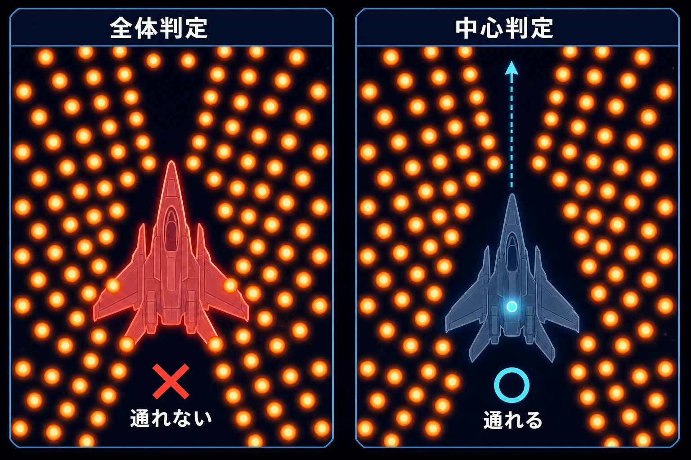
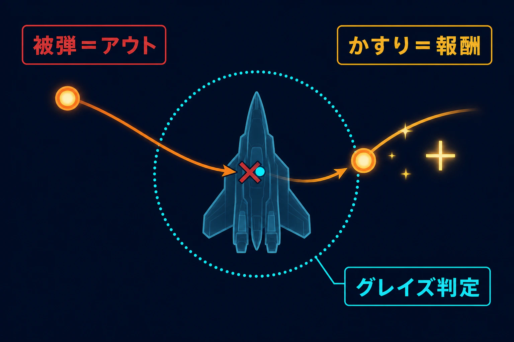
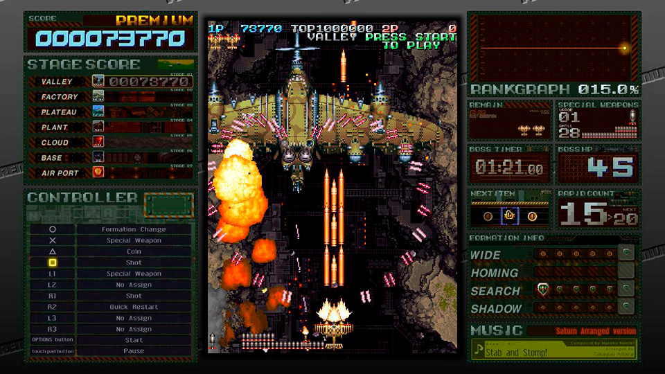
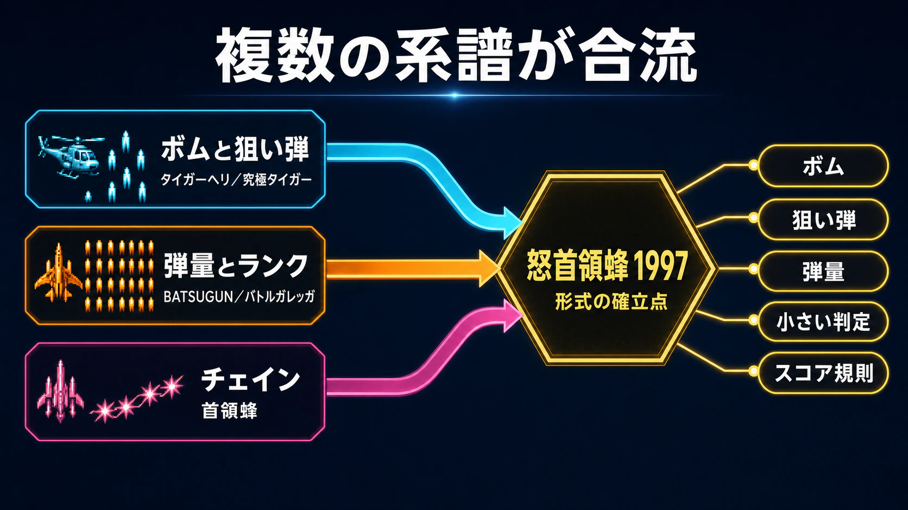
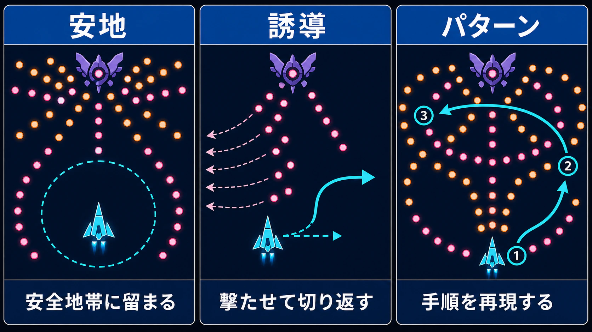
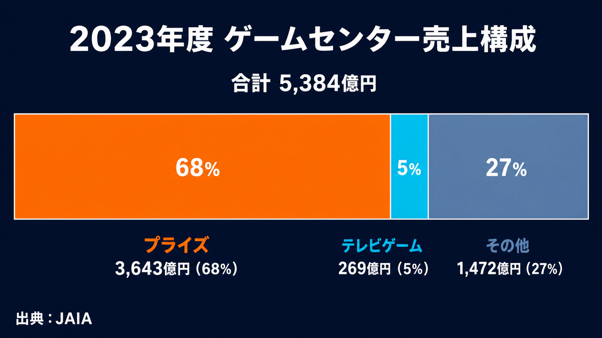
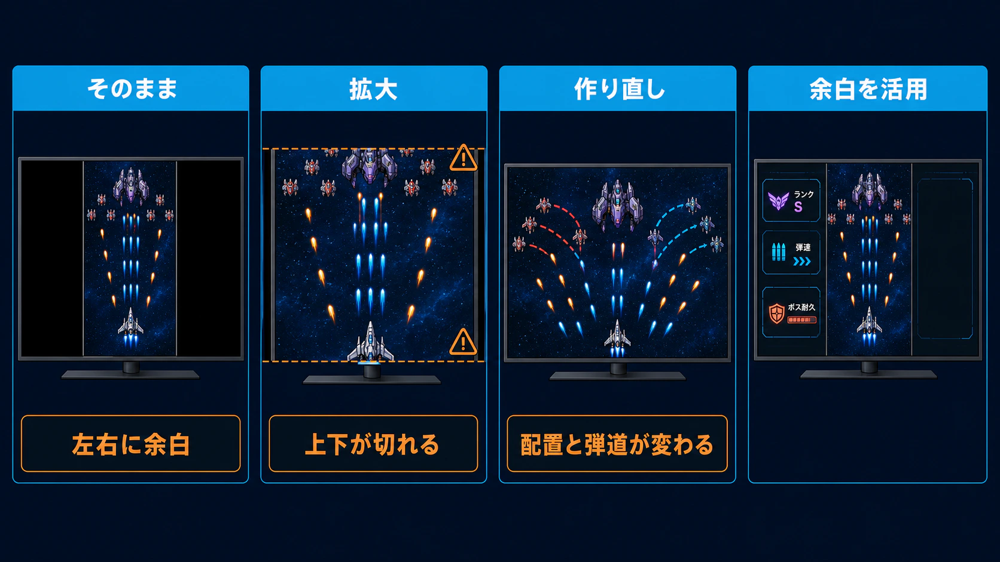
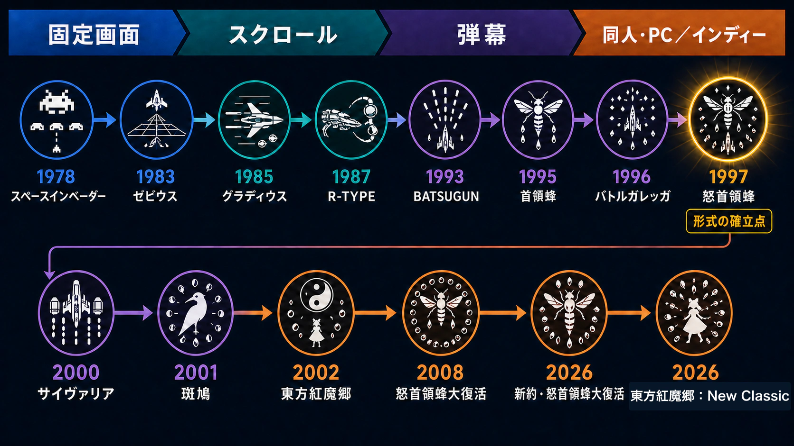

# 弾幕シューティングの歴史：なぜ「撃つゲーム」は「避けるゲーム」へ進化したのか

## はじめに

弾幕シューティング、略して弾幕STG。画面を埋めるほどの敵弾、そのわずかな隙間を抜ける自機、失敗すれば一瞬で終わる緊張感が特徴だ。映像だけを見ると、「弾を増やして難しくしたゲーム」に見えるかもしれない。

しかし、これは新人プランナーが最初に解いておきたい誤解である。弾幕STGは、単に弾数を増やしたものではない。 **大量の弾を、見て、予測して、避けられるように組み立てたゲーム** だ。小さな被弾判定、遅く読める弾、緊急回避、敵配置、スコア規則までが噛み合わなければ、弾幕はすぐに理不尽なノイズへ変わる。

本稿では、固定画面STGから弾幕STGへ連なる流れをたどり、このニッチが生まれ、生き延びた理由を設計と運用の視点から考える。

***

## 1. 前史：シューティングは「何を避けさせてきたか」

シューティングゲームは、画面構成によって大きく三つに整理できる。

| 形式 | 代表例 | 主な空間の使い方 |
|---|---|---|
| 固定画面 | 『スペースインベーダー』『ギャラガ』 | 一画面内で敵集団と撃ち合う |
| 縦スクロール | 『ゼビウス』 | 前方から流れてくる空中・地上の敵を処理する |
| 横スクロール | 『グラディウス』『R-TYPE』 | 地形、装備、敵配置を覚えて突破する |

1978年の『スペースインベーダー』は、左右移動と射撃だけで、敵を撃つことと敵弾を避けることを同じ一画面に成立させた。タイトーの公式沿革でも、同作が同年に発表され、爆発的人気を得たことが確認できる。[[1](#ref-1)]

1980年代には、スクロールによって「次に何が来るか」が時間軸へ広がった。『ゼビウス』は縦スクロールの一つの標準を作り、『グラディウス』はパワーアップ選択と地形攻略を結びつけた。『R-TYPE』はフォースの着脱や溜め撃ちを使い、敵弾だけでなく地形と敵配置を解く比重を高めた。[[2](#ref-2)][[3](#ref-3)]

この時代の中心は、まだ「撃って敵を減らし、安全を作る」ことだった。ただし、高次周や後半面では敵弾が速くなり、出現位置を覚え、撃たれる前に敵を倒す必要が増える。ここに「避けるゲーム」への予兆がある。ただし、速い狙い弾を大量に出すだけでは、人間が反応できない。次の時代に必要だったのは、弾数ではなく **回避を成立させる文法** だった。

***

## 2. 弾幕STGとは何か

本稿では弾幕STGを、 **多数の敵弾を画面上に長く残し、その配置や動きを読みながら回避すること自体を、遊びの主軸にしたシューティング** と定義する。高速弾への反応や地形暗記が中心のSTGとは、遊びの重心が異なる。

### 小さい当たり判定という転換

自機の絵全体に当たり判定があるまま弾を増やせば、通れる隙間が消える。そこで弾幕STGは、機体の中心付近だけを被弾判定にする。プレイヤーは大きな機体画像ではなく、中心の小さな点を隙間へ通す感覚で操作できる。

日本アミューズメント産業協会の業界史資料は、1997年の『怒首領蜂』について、画面を敵弾が覆う「弾幕」の基礎を築き、当たり判定を小さくしたと整理している。[[4](#ref-4)] 小さい判定は難度を下げるだけの救済ではない。弾を増やしても回避可能にするための、ゲーム空間の再定義だった。

見た目と判定の大きさが違うため、自機中心を認識させる表示も必要になる。低速移動時の判定表示や、中心を明るく描く処理は、この情報差を埋めるためだ。

*見た目と被弾判定を分離すると、高密度の弾幕にも通過可能な隙間を設計できる。*

### グレイズは「危険への接近」を報酬に変える

**グレイズ（かすり）** は、敵弾が被弾判定のすぐ近くを通ったことを検出し、得点やゲージを与える仕組みである。通常なら避けたい危険へ、あえて近づく理由を作る。

*被弾判定のすぐ外を敵弾が通ると報酬が発生し、危険へ近づく動機になる。*

2000年にアーケードで登場したサクセスの『サイヴァリア ミディアムユニット』は、かすりを **BUZZシステム** として遊びの主役にした。敵弾へのかすりで経験値がたまり、レベルアップすると攻撃力と短時間の無敵を得る。[[5](#ref-5)]

BUZZは、かすりを成長と無敵へ循環させた。次のレベルアップを見越して弾の渦へ入る判断を生み、グレイズを「ボーナス」から攻略の軸へ押し上げた。

グレイズは必須ではない。撃破順や距離でも危険と報酬は結べるため、「何へ近づかせたいか」から選ぶべきだ。

***

## 3. 「元祖」を一本に決めない：成立までの複数の系譜

弾幕STGの起源には複数の見方がある。これは用語の混乱というより、何を発明とみなすかが違うためだ。

### ボムと狙い弾の系譜

東亜プランの『タイガーヘリ』と『究極タイガー』は、ショットとボンバーを軸にした縦スクロールSTGの基本形を広めた。 **ボム** とは、回数制限のある強力な攻撃で、多くの作品では敵弾消去や一時的な無敵を伴う。レトロゲームの移植・復刻を多く手がける開発会社、M2（有限会社エムツー）も、公式紹介で『タイガーヘリ』をショット＋ボンバーの基本形を生み出した作品と位置づけている。[[6](#ref-6)]

この系譜では、敵の狙い弾を少しずつ誘導し、画面端を切り返す技術が重要だった。後の弾幕STGより弾は速く、隙間を精密に抜けるより、撃たせる方向を管理する比重が高い。弾幕の「パターンを作って避ける」考え方は、すでにここにある。

### 大量の弾を見せる系譜

1993年の東亜プラン『BATSUGUN』は、敵味方を合わせた大量の弾数が特徴で、現在の権利元による公式紹介でも「後の弾幕シューティングを先駆けるような」作品と説明されている。[[7](#ref-7)] これは弾量と派手な自機攻撃の面で重要な橋だが、後年の弾幕STGの定型がすべて揃っていた、とまでは言い切れない。

1996年の『バトルガレッガ』は、プレイ内容に応じて内部難度が上がる **ランク** を、攻略の中心へ押し出した。M2公式は、同作のランク調整が後の弾幕STGに影響を与えたと位置づける。[[8](#ref-8)] 弾の量だけでなく、「強くなるほどゲームも強くなる」という運用思想が、プレイヤーの行動を組み替えた。

*画像出典（引用）：M2「[バトルガレッガ Rev.2016 フィーチャー](https://m2stg.com/battle-garegga/ps4/feature.html)」掲載画面。© 1996 EIGHTING © 2016 M2 Co., Ltd.／WebP変換。*

### 形式を確立した『首領蜂』『怒首領蜂』

ケイブの「蜂」シリーズは、『首領蜂』（1995年）、『怒首領蜂』（1997年）へ続く。年次とシリーズ順はケイブ公式サイトでも確認できる。[[9](#ref-9)]

『首領蜂』は敵を途切れず倒してヒット数をつなぐ **チェイン** を導入し、敵配置を「生き残るため」だけでなく「得点経路」として覚えさせた。『怒首領蜂』は、小さい当たり判定と大量の弾、低速で密度の高い攻撃、上級者向けの周回構造を強く結びつけた。

そのため、『怒首領蜂』は弾幕STGの確立点として扱われることが多い。ただし、これは「大量弾の最初」でも「小さい判定の最初」でもなく、複数の工夫を、後続が参照できる強い形式へまとめたという意味である。起源を一本に決めるより、 **ボム、狙い弾、弾量、当たり判定、スコア規則の合流点** と見る方が実態に近い。

*弾幕STGは単一の発明ではなく、ボム、狙い弾、弾量、ランク、チェインなどの流れが合流して形式化された。*

***

## 4. 1990年代後半から2000年代：黄金期のメーカーと設計思想

この時期、同じ縦・横スクロールSTGでも、メーカーごとに違う回答が現れた。

| メーカー | 代表的な作品 | 設計上の重心 |
|---|---|---|
| ケイブ | 『怒首領蜂』『エスプレイド』『怒首領蜂大往生』『ケツイ～絆地獄たち～』『虫姫さま』 | 小さい当たり判定、密度の高い弾幕、作品ごとに異なるスコア規則 |
| 彩京 | 『戦国エース』『ストライカーズ1945』シリーズ、『ガンバード』シリーズ | 比較的速い弾、短い判断時間、簡潔なルール |
| タイトー | 『ダライアス』シリーズ、『レイフォース』など | 大型筐体、ルート分岐、ロックオン、演出と空間設計 |
| トレジャー | 『レイディアント シルバーガン』『斑鳩』 | 武器選択、属性、色順によるチェインというパズル性 |
| グレフ | 『アンダーディフィート』 | 危険と火力の位置取り、縦画面から横画面への再構成 |

彩京の作品群は公式移植版でも、1990年代アーケードを中心に展開したシリーズとして整理されている。[[10](#ref-10)] タイトーの『レイフォース』は1994年稼働で、2D基板上のロックオンレーザーと演出によって奥行きを作った。[[11](#ref-11)] トレジャー公式の稼働記録では、『レイディアント シルバーガン』が1998年、『斑鳩』が2001年である。[[12](#ref-12)] 『斑鳩』は同属性の敵弾なら吸収する、別系統の回答を示した。グレフの『アンダーディフィート』は、アーケードの縦画面を家庭用の横長画面へ再構成した。[[13](#ref-13)]

これらをすべて弾幕STGと呼ぶのは正確ではない。隣接する流派が競い合い、「避ける」以外にも弾を読む理由を増やしたのである。

### ボムは救済ではなく、資源管理である

ボムは初心者の非常口に見える。しかし実務では、次の調整が必要になる。

- 発動受付を被弾の直前まで許すか、被弾後にも救済するか
- 無敵時間、弾消し範囲、ボスへのダメージをどこまで与えるか
- ミス時に残りボムを失わせるか
- スコア稼ぎに使わせるか、温存を評価するか

強すぎれば通常回避が不要になる。弱すぎれば抱えたままミスするだけの「使えない保険」になる。『怒首領蜂最大往生』の公式操作説明でも、ショット、レーザー、ボム、ハイパーが別の入力と資源として構成されている。[[14](#ref-14)] ボタン数を増やすほど、初心者には判断負荷が増える点も忘れてはいけない。

### ランクは上手な人を苦しめるだけではない

**ランク** は、プレイ内容に応じて敵弾の速さ・量、敵耐久力などを変える内部難度である。残機、パワーアップ、連射速度、ノーミス時間など、何を参照するかは作品ごとに違う。

目的は、単純な自動調整だけではない。プレイヤーに「取りすぎない」「撃ちすぎない」「あえてミスする」といった逆説的な攻略を考えさせることもある。ただし、因果が画面に出ないと、上達したのに急に苦しくなったように見える。『バトルガレッガ Rev.2016』がランクグラフや固定設定を追加したのは、隠れた規則を学習可能にするためだった。[[15](#ref-15)]

### スコアは第二のゲームルール

弾幕STGのスコアは、ただ敵を多く倒した結果ではない。

- **チェイン／コンボ**：撃破を途切れさせず、倍率やヒット数をつなぐ
- **近接撃破**：敵の近くで倒し、高価値アイテムを得る
- **グレイズ**：敵弾へ近づき、危険を得点へ変える
- **弾消し**：画面上の敵弾を得点アイテムへ変える
- **属性・順番**：特定の色や並びで敵を倒す

これらは、同じステージに「クリア経路」と「稼ぎ経路」を重ねる手法である。開発側は少ないステージ数でも長く研究してもらえる。一方、プレイヤーは一度クリアした後も改善余地を見つけられる。ニッチな作品ほど、一本を長く遊ぶ文化と相性がよかった。

### 2周目と真ボスは、全員向けコンテンツではない

アーケードSTGには、一度クリアすると高難度の **2周目** に入り、厳しい条件を満たすと **真ボス** が現れる構造がある。これは上級者へ長期目標を渡し、店舗ではスーパープレイを可視化する。

ただし、開発コストに対して到達者は少ない。現代なら、通常エンディングは広く見せ、真ボスは競技的な追加目標にするなど、報酬の分け方を検討したい。

***

## 5. 「理不尽」ではなく、理詰めで避けられる弾幕を作る

良い弾幕は、毎回同じ場所に立てば必ず安全、という意味ではない。ランダム性を含んでも、プレイヤーが判断に使える情報があり、入力可能な時間が残されている。

攻略では、主に三つの考え方を使う。

- **安地**：攻撃が届かない、または届きにくい安全地帯
- **誘導**：自機を狙う弾を一方向へ撃たせ、空いた側へ切り返す方法
- **パターン**：敵の出現、攻撃順、安全な移動経路を組み立てて再現する方法

*同じ回避でも、安全地帯の利用、狙い弾の誘導、手順の再現では判断の組み立て方が異なる。*

弾幕制作で難しいのは、弾を円や螺旋に並べることではない。敵の出現から弾が危険域へ届くまでの時間、自機速度、画面端での逃げ幅、背景との色差、別の攻撃との重なりを、フレーム単位で検証することだ。

特に危険なのは、単体では避けられる攻撃同士の合成である。自機狙い弾が左へ誘導し、固定弾幕が左の隙間を閉じれば、設計者が意図しない詰みが生まれる。実務では、弾発射器ごとのテストだけでなく、敵を倒す時刻がずれた場合、低火力機体の場合、画面端へ追い込まれた場合まで確認する必要がある。

さらに、被弾理由を読めることが重要だ。敵弾と背景が同系色、爆発で弾が隠れる、自機エフェクトが中心を覆う、画面外から高速弾が来る。これらは難度ではなく視認性の不具合になりやすい。色覚差への配慮、弾の輪郭、危険弾の優先描画、ヒットボックス表示は、競技性を守るための仕様である。

***

## 6. アーケード縮小と、同人・家庭用・PCへの移行

弾幕STGはアーケードの商売と相性がよかった。一回のプレイが短く、上達すれば長く遊べ、ハイスコアが常連同士の競争を生む。反面、一台の筐体で一人しか遊べず、初心者が早くゲームオーバーになる。店舗側から見ると、対戦ゲーム、音楽ゲーム、プライズ機などと設置面積を争うことになる。

現在のアミューズメント市場を、単純に「ゲーセン全体が消えた」と捉えるのも正確ではない。JAIAの集計では、2023年度のゲームセンター（オペレーション）売上は5,384億円で、うちプライズゲームが3,643億円と、売上の約68％を占める。[[16](#ref-16)] 市場の中身が変わり、ビデオゲーム、とりわけ専用客層の小さいSTGが床面積を取りにくくなった、と見るべきだ。

*店舗売上の約68％をプライズゲームが占め、テレビゲームは約5％にとどまる。出典：JAIA『アミューズメント産業界の実態調査』2023年度版。*

### 東方Projectが広げた「弾幕の意味」

同人では、アーケード筐体の製造や全国流通を前提にせず、個人や小規模チームがPC向け作品を直接届けられた。東方Projectは、その代表例である。

2002年の『東方紅魔郷 〜 the Embodiment of Scarlet Devil.』は、Windowsへ移行したシリーズ第6弾の弾幕系シューティングである。[[17](#ref-17)] 東方Projectは、ZUNが主宰する同人サークル「上海アリス幻樂団」の弾幕系STGを中心に、音楽、書籍、二次創作へ広がる作品群として公式公認サイトでも説明されている。[[18](#ref-18)]

東方Projectの意義は、弾幕を難度だけでなく、キャラクターを表す視覚表現へ広げたことにある。攻撃へ名前を付けるスペルカード、音楽と同期する展開、人物像に合った色や形によって、弾幕は「敵の台詞」のように機能する。STGを遊ばない層にも、楽曲、キャラクター、二次創作から入口が生まれた。

これは、ゲーム本体以外の入口も作品世界を支えうることを示した。ただし、設定を足すだけでは再現できない。二次創作の方針やコミュニティとの距離まで含む運用が必要だ。

### 移植は解像度を上げれば終わりではない

縦画面STGのアーケード筐体は、縦長に置いたブラウン管を前提とすることがある。横長テレビへそのまま移植すると、左右に大きな余白ができる。拡大すれば上下が切れ、横へ作り直せば敵出現や弾道まで変わる。

*縦画面を横長画面へ移すと、余白、切り取り、ゲーム内容の変更が生じる。余白を攻略情報へ転用する方法もある。*

そのため現代の移植では、画面回転、縦置き表示、壁紙、余白への攻略情報表示が重要になる。さらに入力遅延、処理落ち、連射速度、音のタイミングを原作に合わせなければ、同じ見た目でも攻略感覚が変わる。

一方、余白は弱点だけではない。M2の移植は、ランク、敵弾速度、ボス耐久力などを「ガジェット」として表示し、オンラインランキングとリプレイ共有も提供している。[[19](#ref-19)] タイトーの復刻版も、セーブ、ロード、リプレイ、ランキングを備え、苦手な場所を反復練習できるようにした。[[20](#ref-20)] 移植は保存作業であると同時に、昔は見えなかった設計を教材へ変える作業でもある。

***

## 7. 初心者お断りをどう解くか

弾幕STGは、動画映えと入口の狭さが同居する。大量の弾は一目で特徴を伝えるが、初見の人には「自分には無理」と思わせる。

有効な対策は、単に敵弾を減らすことではない。

1. **難易度ごとに学ぶ内容を分ける**
   
   EASYでは自機狙い弾の誘導、NORMALでは固定弾との重なり、HARDでは切り返しというように、同じ攻撃を段階的に複雑化する。

2. **練習までの操作を短くする**
   
   ステージ選択、ボス練習、直前からの再開、リプレイの早送りを用意する。一回の失敗ごとに長い道中を繰り返させると、学習より待ち時間が増える。

3. **オート機能の目的を明示する**
   
   オートボムは被弾を減らすが、ボム資源の判断を代行する。通常ランキングと分ける、使用回数を表示するなど、競技条件との衝突を避ける。

4. **スコア規則を可視化する**
   
   倍率が上がった理由、チェインが切れた理由、グレイズ範囲を画面で教える。説明書にだけ書いても、プレイ中には理解しにくい。

5. **入力遅延を予算項目にする**
   
   高密度の回避では数フレームの遅れが体感へ直結する。エンジン、描画同期、コントローラー、ディスプレイを通した実機測定が必要だ。

『Crimzon Clover World EXplosion』はNOVICE、複数のゲームモード、状況を指定できるトレーニングを備える。[[21](#ref-21)] 海外制作の『BLUE REVOLVER』も、適応難度、短いミッション、弾色や背景明度の調整を用意している。[[22](#ref-22)] 入口を広げても、上級者向けの深さを消す必要はない。モードとランキング条件を分ければ、同じ資産で異なる習熟段階を支えられる。

***

## 8. スコアラー文化と、ニッチ市場の経済性

**スコアラー** は、クリア後も得点を突き詰めるプレイヤーを指す。彼らは敵を倒す順序、ボムを撃つ位置、あえて危険へ入る時刻まで研究する。攻略情報、リプレイ、店舗のスコアボードを通じて知識が共有され、作品の寿命を延ばしてきた。

ただし、熱量の高さと市場の大きさは同じではない。弾幕STGは、次の理由で大規模開発と噛み合いにくい。

- 一人用が中心で、継続課金や対戦人口のネットワーク効果を作りにくい
- 高精度な調整とテストに対し、見た目のステージ数は少なく見えやすい
- 上級者の要望へ寄せすぎると、新規購入者が減る
- 初心者向けに変えすぎると、既存ファンが求める競技性を失う
- 移植では入力遅延や処理落ち再現など、売り場から見えにくいコストが大きい

だから「もっと大衆向けにすれば売れる」とは限らない。必要なのは、想定販売数から逆算した規模である。少人数開発、ダウンロード販売、既存基板の高品質移植、サウンドトラックや資料集との組み合わせは、狭いが熱い需要へ合わせた手段だ。

スコアラーだけを顧客と決めつけるのも危険である。世界設定、音楽、実績、ボス練習など、得点以外の目標も滞在理由になる。

***

## 9. 現在と展望：ジャンルは「小さく続く」技術を得た

弾幕STGは主流ジャンルへ戻ったわけではない。しかし、消えてもいない。

国内では、同人発の『Crimzon Clover』が商業プラットフォームへ進み、M2やシティコネクションなどが旧作を現行機へ移している。海外で遊ばれるだけでなく、日本のアーケードSTGを学んだ海外開発者も作り手になった。フィンランドのSystem Erasureは、アーケードの慣習が初心者を遠ざける面を意識して『ZeroRanger』を設計したと説明している。[[23](#ref-23)]

2026年には、ケイブが『怒首領蜂大復活』を基にしたSteam向け『新約・怒首領蜂大復活』の体験版を公開し、独自のアシスト機能を告知した。[[24](#ref-24)] また、『東方紅魔郷：New Classic』も2026年9月10日にNintendo Switch 2、Nintendo Switch、PlayStation 5、Steam向けに発売予定である。[[25](#ref-25)] どちらも、過去の難度を消すのではなく、新しい入口と現行環境への対応を加える方向だ。

今後の課題は、弾数をさらに増やすことではない。視認性、低遅延、練習導線、リプレイ、縦画面対応、多言語化を、限られた予算でどうまとめるかにある。プレイヤー側も、クリアだけでなく配信、研究、二次創作、保存活動など、多様な関わり方を持つようになった。

弾幕STGが生き延びた理由は、万人向けになったからではない。小さい当たり判定で弾の隙間を作り、小さいチームで市場の隙間を見つけ、移植と同人とインディーで流通の隙間をつないできたからだ。

プランナーが学ぶべきなのは、「弾をたくさん出せば弾幕になる」という表層ではない。 **何を見せ、何を予測させ、どこまで失敗を学習へ変えるか** という設計である。弾幕は、制約を無視した物量ではない。制約を読み切ったうえで成立する、精密な交通整理なのだ。

*固定画面、スクロール、弾幕、同人・PC／インディーへと、STGの設計と流通の重心は移ってきた。*

## References

1. [沿革｜株式会社タイトー][1] - 1978年に『スペースインベーダー』を発表し、爆発的人気を得たことを記録している。

2. [Amusement Machine History -1980- ①｜JAIA][2] - 『ゼビウス』を縦スクロールシューティングの標準を築いた作品として紹介する業界史資料。

3. [グラディウス（GRADIUS）｜KONAMI][3] - 1985年発売と、パワーアップを重ねて進む基本内容を確認できる公式商品ページ。

4. [Amusement Machine History -1990- ①｜JAIA][4] - 『怒首領蜂』が小さい当たり判定によって弾幕の基礎を築いたと整理する業界史資料。

5. [サイヴァリア デルタ｜BUZZ SYSTEM][5] - 2000年の初代『サイヴァリア ミディアムユニット』と、かすりによる経験値、レベルアップ、無敵を説明する公式ページ。

6. [究極タイガーヘリ｜M2 Shot Triggers][6] - 『タイガーヘリ』をショット＋ボンバーという縦スクロールSTGの基本形を作った作品として紹介する。

7. [BATSUGUNとは｜BATSUGUN サターントリビュート Boosted][7] - 1993年稼働と、後の弾幕STGを先駆ける大量の弾数について説明する公式ページ。

8. [システム｜バトルガレッガ Rev.2016][8] - 1996年稼働と、ランク調整が後の弾幕STGへ与えた影響を説明するM2公式ページ。

9. [怒首領蜂最大往生とは｜ケイブ][9] - 『首領蜂』『怒首領蜂』から続く蜂シリーズの作品年次を掲載する公式ページ。

10. [彩京 SHOOTING LIBRARY｜PSIKYO PORTAL][10] - 彩京の主要シューティング作品と、1990年代アーケードを中心とする展開を確認できる公式ポータル。

11. [TITLE｜レイズアーケードクロノロジー][11] - 『レイフォース』の稼働年、基板、ロックオンレーザーを使った設計を説明するタイトー公式ページ。

12. [トレジャー アーケード][12] - 『レイディアント シルバーガン』と『斑鳩』のアーケード稼働日を掲載するトレジャー公式ページ。

13. [グレフ、PS3／Xbox 360「アンダーディフィートHD」｜GAME Watch][13] - アーケード版の縦画面と、家庭用の横長画面を使う新モードの違いを説明する。

14. [操作方法／アイテム｜怒首領蜂最大往生][14] - ショット、レーザー、ボム、ハイパーの入力と資源構成を確認できるケイブ公式ページ。

15. [PS4「バトルガレッガ Rev.2016」インタビュー｜GAME Watch][15] - ランク可視化とスーパーイージーモードの調整過程を、移植開発者が説明している。

16. [JAIA PRESS 2025年8月号（2023年度 アミューズメント産業界の実態調査）｜JAIA][16] - 2023年度のオペレーション売上高5,384億円、うちプライズゲーム売上高3,643億円（約68%）などの集計を掲載している。

17. [東方紅魔郷 〜 the Embodiment of Scarlet Devil.｜東方ダンマクカグラ公式][17] - 2002年8月11日発売、Windows移行後初の東方Project作品であることを掲載する原作紹介。

18. [東方やおよろず商店｜博麗神社崇敬会][18] - 東方Projectを上海アリス幻樂団の弾幕系STGを中心とする作品群として説明する公認サイト。

19. [フィーチャー｜弾銃フィーバロン／M2 Shot Triggers][19] - 攻略情報ガジェット、縦画面、オンラインランキング、リプレイなど移植機能を紹介する。

20. [ダライアス コズミックコレクション｜タイトー][20] - 画面外ガジェット、ランキング、リプレイ、任意セーブ・ロードを説明する公式商品ページ。

21. [Crimzon Clover World EXplosion｜Steam][21] - NOVICE、複数モード、条件を指定できるトレーニング機能を掲載するストアページ。

22. [BLUE REVOLVER｜Steam][22] - 適応難度、ミッション、弾色や背景の視認性設定などを掲載する開発元提供のストアページ。

23. [ZeroRanger Press Kit｜System Erasure][23] - フィンランドの開発者2名と、アーケードの慣習が初心者を遠ざける問題意識を説明する公式資料。

24. [『新約・怒首領蜂大復活』Steam弾幕フェス出展・体験版配信｜ケイブ][24] - 2026年6月時点の開発状況とアシスト機能を告知する公式発表。

25. [東方紅魔郷：New Classic 公式サイト][25] - 2026年9月10日の発売予定日と対応プラットフォームを掲載する公式ページ。

[1]: https://www.taito.co.jp/corporate/about/history
[2]: https://jaia.jp/history/pdf/history_1980_01.pdf
[3]: https://www.konami.com/games/jp/ja/products/dl_ps4_gradius_arch/
[4]: https://jaia.jp/history/pdf/history_1990_01.pdf
[5]: https://psyvariar-delta.com/jp/about.html
[6]: https://m2stg.com/kyukyoku-tiger-heli/
[7]: https://city-connection.co.jp/s-tribute/batsugun/about/
[8]: https://m2stg.com/battle-garegga/ps4/system.html
[9]: https://www.cave.co.jp/gameonline/Xbox360/saidaioujou/whats/
[10]: https://psikyo-portal.com/shootinglibrary.html
[11]: https://www.taito.co.jp/rayzarcadechronology/title
[12]: https://treasure-inc.co.jp/products3.html
[13]: https://game.watch.impress.co.jp/docs/news/496761.html
[14]: https://www.cave.co.jp/gameonline/saidaioujou/system/controls-items/
[15]: https://game.watch.impress.co.jp/docs/interview/1024943-2.html
[16]: https://jaia.jp/wp-content/uploads/2025/08/20258.pdf
[17]: https://danmaku.jp/archive/origin/o001/
[18]: https://shop.hakurei-sukeikai.com/
[19]: https://m2stg.com/dangun-feveron/ps4/feature.html
[20]: https://www.taito.co.jp/en/mob/0000002696
[21]: https://store.steampowered.com/app/1718160/Crimzon_Clover_World_EXplosion/
[22]: https://store.steampowered.com/app/439490/BLUE_REVOLVER/
[23]: https://se-made.com/press/sheet.php?p=zeroranger
[24]: https://www.cave.co.jp/news/%E6%80%92%E9%A6%96%E9%A0%98%E8%9C%82%E5%A4%A7%E5%BE%A9%E6%B4%BB%E3%81%8C%E3%83%AA%E3%83%95%E3%82%A1%E3%82%A4%E3%83%B3%E3%82%B7%E3%83%AA%E3%83%BC%E3%82%BA%E3%81%A7%E5%86%8D%E5%A7%8B%E5%8B%95%EF%BC%81-2/
[25]: https://touhou-project.news/shanghai-alice-reprise/

----

この文書は、Perplexity、Claude、OpenAI Codex の3つのAIの支援を受けて著述されたものです。引用画像を除き、MIT License にて提供されています。
