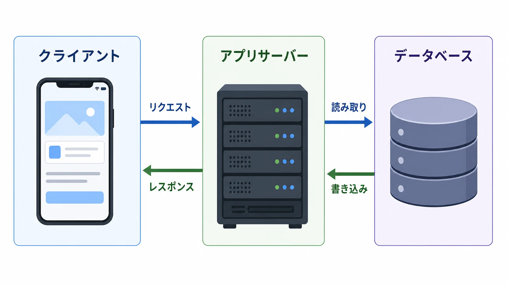
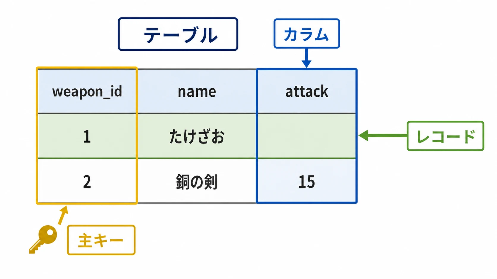
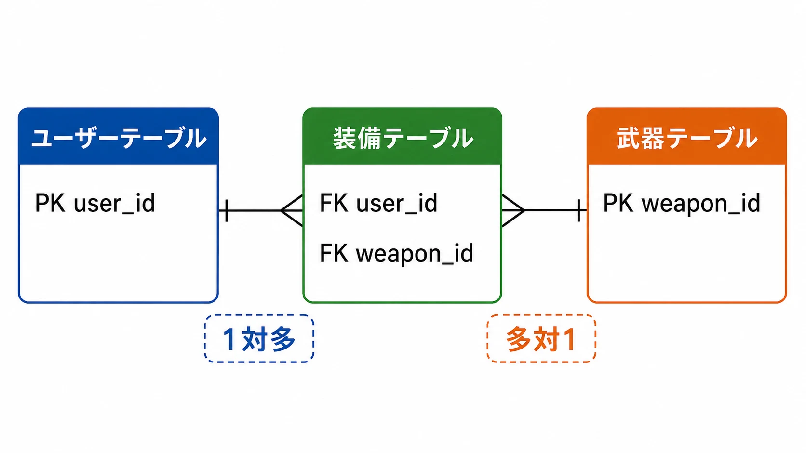
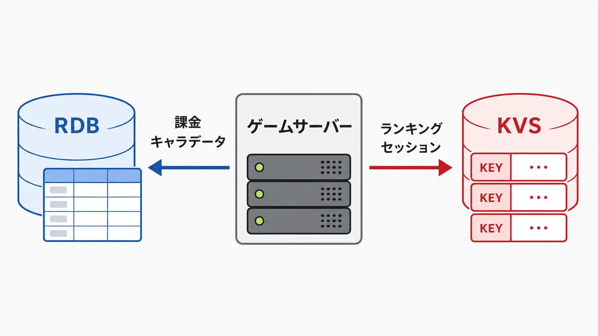
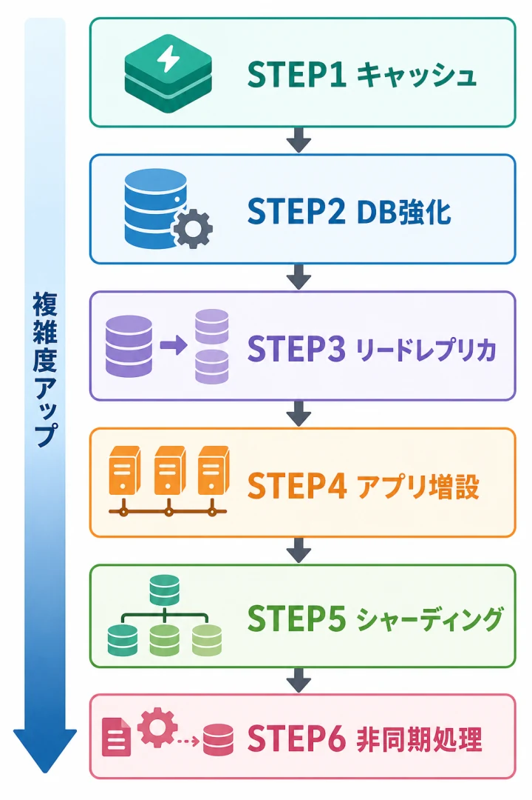

# ゲームプランナーが知っておくべきデータベースの基礎

## はじめに

「セーブデータって、どこに保存されているんだろう？」——そう気にしたことがあるプレイヤーは多いだろう。しかし、ゲームを作る側のプランナーになっても、この問いに明確に答えられる人は意外と少ない。

ゲームには膨大なデータが流れている。キャラクターのレベル、所持アイテム、過去のガチャ結果、ランキングのスコア……これらはすべて「どこか」に保存され、「何らかの方法」で読み書きされている。その「どこか」こそが **データベース（DB）** だ。

プランナーがデータベースを「完全に操作できる」必要はない。しかし、「そのデータは DB にどう入るの？」「同時接続が10万人来たら DB が死ぬんですが」といった会話でエンジニアと噛み合わないと、仕様書が現実から浮いていく。本稿では、コードを書かないプランナーのために、データベースの考え方をゼロから整理する。エンジニアとの共通言語を持つことが最終目標だ。

***

## 1. データはどこに「住んでいる」のか

### 1-1. ゲームのデータには2種類ある

ゲームに登場するデータは、大きく2種類に分類できる。[[1](#ref-1)]

| 種類 | 内容 | 例 |
| ------ | ------ | ----- |
| **マスターデータ** | ゲーム全員で共通して使う設定値 | 武器の攻撃力、モンスターのHP、スキルのテキスト |
| **ユーザーデータ** | プレイヤーごとに異なる状態 | キャラクターのレベル、所持アイテム、ガチャ履歴 |

マスターデータはゲームのルールブック、ユーザーデータはそのプレイヤー専用の記録簿だ。プランナーが仕様書に書く「剣の攻撃力は50」はマスターデータに入り、「プレイヤーAが剣を持っている」はユーザーデータに入る。

### 1-2. クライアントとサーバー

オンラインゲームのデータは「**クライアント**（ユーザーの端末）」と「**サーバー**（開発会社が管理するコンピュータ）」に分かれて保存される。[[7](#ref-7)]

- **クライアント**：スマートフォンやPC。ゲームの画像・音声・3Dモデルなど大容量データを保持する。ただしクライアントのデータはチートツールで改ざんされるリスクがある。
- **サーバー**：セーブデータ・所持アイテム・課金情報など「絶対に壊してはいけないデータ」を保持する。プレイヤーが端末を壊してもデータが消えないのは、サーバーが「正解」を持っているからだ。

サーバー上のデータを管理する仕組みこそがデータベースだ。



### 1-3. ファイルとデータベース、何が違う？

「テキストファイルや Excel で管理すればいいのでは？」という疑問は自然だ。実際、昔の家庭用ゲームはセーブデータをバイナリファイルに書き込んでいた。しかしオンラインゲームのような大規模なデータになると、ファイル管理は限界を迎える。[[7](#ref-7)][[9](#ref-9)]

| 比較 | ファイル（Excel など） | データベース |
| ------ | ---------------------- | ------------ |
| **検索速度** | 全件読み込みが必要 | インデックスで高速検索 |
| **同時アクセス** | 競合・破損リスクが高い | 排他制御・トランザクションで安全 |
| **複雑な絞り込み** | プログラムで自前実装 | SQL で簡潔に書ける |
| **データの整合性** | 保証なし | 制約でルールを強制できる |
| **扱えるデータ規模** | 数万件が現実的な上限 | 数億件でも運用実績あり |

データベースは「検索・更新・整合性保証をまとめて引き受けてくれる専門家」だと思えばよい。

***

## 2. テーブル・カラム・レコード：DB の地図を読む

### 2-1. データは「表」で管理される

代表的なデータベースは **リレーショナルデータベース（RDB）** と呼ばれ、データを **表（テーブル）** の形で管理する。Excel のシートに非常に近いイメージだ。[[4](#ref-4)][[2](#ref-2)]

| 用語 | Excel で例えると | 役割 |
| ------ | ---------------- | ------ |
| **テーブル** | シート | データの種類ごとの表 |
| **カラム（列）** | 列ヘッダー | データの属性 |
| **レコード（行）** | 1行 | 実際の1件のデータ |

以下はゲームにおける「武器テーブル」の例だ：[[4](#ref-4)]

| weapon_id | name | attack | weapon_type | cost |
| ----------- | ------ | -------- | ------------ | ------ |
| 1 | たけざお | 2 | 槍 | 10 |
| 2 | 銅の剣 | 15 | 剣 | 80 |
| 3 | 鉄の斧 | 28 | 斧 | 150 |

`weapon_id` ・`name` ・`attack` などがカラム、各行がレコードだ。

### 2-2. 主キー（Primary Key）：「このデータ」を一意に特定する

テーブルには必ず **主キー（Primary Key, PK）** が必要だ。主キーとは「そのレコードを唯一に特定できる値」であり、テーブル内で絶対に重複しない。[[4](#ref-4)][[5](#ref-5)]

上の武器テーブルでは `weapon_id` が主キーだ。`name` を主キーにしない理由は、「同名の武器が複数存在する」可能性があるからだ（強化前・強化後で同名になるケースなど）。数値IDを使えば、名前が重複しても確実に1件を特定できる。

主キーはエンジニアとの会話でも頻出する。「このデータをどのIDで管理するか」を意識するだけで、仕様議論の質が変わる。



***

## 3. テーブルどうしの「つながり」：リレーションと正規化

### 3-1. テーブルを分けてつなぐ

「1つのテーブルに全部詰め込みたい」——これはプランナーが陥りやすい罠だ。例えばユーザーの装備情報を1つのテーブルに収めようとすると、こうなる：

**悪い例：**

| user_id | name | equip_sword | equip_bow | equip_shield |
| --------- | ------ | ------------ | ---------- | ------------- |
| 1 | アリス | 銅の剣 | — | 木の盾 |

装備の種類が増えるたびにカラムを追加しなければならない。カラムの追加はテーブル設計の変更であり、エンジニアの工数がかかる。[[1](#ref-1)]

**良い例：** テーブルを分けて `user_id` でつなぐ

ユーザーテーブル：

| user_id | name |
| --------- | ------ |
| 1 | アリス |
| 2 | ボブ |

装備テーブル：

| equip_id | user_id | slot | weapon_id |
| ---------- | --------- | ------ | ----------- |
| 1 | 1 | 剣 | 2 |
| 2 | 1 | 盾 | 7 |
| 3 | 2 | 剣 | 3 |

`user_id` という「合言葉」で2つのテーブルをつなぐ仕組みを **外部キー（Foreign Key, FK）** と呼ぶ。[[8](#ref-8)]

### 3-2. 1対多・多対多

テーブル間の関係には典型的なパターンがある：[[8](#ref-8)]

| 関係 | 説明 | ゲームの例 |
| ------ | ------ | ----------- |
| **1対1** | 1行に対して1行が対応 | ユーザー：プロフィール詳細 |
| **1対多** | 1行に対して複数行が対応 | ユーザー：所持アイテム（1人が複数個持てる） |
| **多対多** | 複数行が複数行に対応 | ユーザー：フレンド（AはBとCのフレンドかつ、BはCともフレンド） |

多対多は中間テーブルを使って2つの「1対多」に分解するのが基本だ。

### 3-3. 正規化：「行で増やす、列で増やさない」

正規化の本質は「繰り返すデータを別テーブルに切り出す」ことだ。エネミーのドロップアイテムを例に取ろう：[[1](#ref-1)][[9](#ref-9)]

**悪い例：列で増やす**

| enemy_id | name | drop1 | drop2 | drop3 | drop4 |
| ---------- | ------ | ------- | ------- | ------- | ------- |
| 1 | スライム | 薬草 | — | — | — |
| 2 | ゴブリン | 骨 | 皮 | — | — |

ドロップが5種類に増えたとき、エンジニアにカラム追加を依頼しなければならない。

**良い例：行で増やす（別テーブルに分ける）**

| drop_id | enemy_id | item_name | rate |
| --------- | ---------- | ----------- | ------ |
| 1 | 1 | 薬草 | 50% |
| 2 | 2 | 骨 | 40% |
| 3 | 2 | 皮 | 20% |

100種類のドロップが追加されても、行を追加するだけ。テーブル設計を変える必要がない。「行で増やす、列で増やさない」——この発想がプランナーのデータ設計の基礎だ。[[9](#ref-9)]



***

## 4. SQL でデータを操る

### 4-1. SQL とは

**SQL（Structured Query Language）** は RDB を操作するための専用言語だ。「プランナーが書ける」必要はないが、「読める」と仕様の伝え方が格段に変わる。[[2](#ref-2)][[5](#ref-5)]

### 4-2. 基本4操作（CRUD）

| 操作 | SQL 文 | 意味 |
| ------ | -------- | ------ |
| 作成（Create） | `INSERT INTO` | データを1件追加する |
| 読み取り（Read） | `SELECT` | データを検索・取得する |
| 更新（Update） | `UPDATE` | 既存データを書き換える |
| 削除（Delete） | `DELETE` | データを消す |

[[2](#ref-2)][[3](#ref-3)]

### 4-3. 実際の SQL を読んでみよう

**例1：レベル50以上のユーザーを全員取得する**

```sql
SELECT * FROM users WHERE level >= 50;
```

- `FROM users` → users テーブルから取得
- `WHERE level >= 50` → level が50以上のものだけ絞り込む

**例2：ユーザー1番にアイテムを付与する**

```sql
INSERT INTO user_items (user_id, item_id, quantity)
VALUES (1, 42, 1);
```

**例3：アイテムの数量を1増やす**

```sql
UPDATE user_items
SET quantity = quantity + 1
WHERE user_id = 1 AND item_id = 42;
```

「レベル50以上のユーザー全員にアイテムを配布したい」という企画なら、エンジニアは `WHERE level >= 50` で対象を絞って処理する。「`WHERE` で絞り込める」と知っているだけで、要件の伝え方が変わる。[[6](#ref-6)][[3](#ref-3)]

***

## 5. データを「速く」取り出す仕組み：インデックス

### 5-1. インデックスとは何か

ユーザーが数千万人いるゲームで、「ユーザーID 12345 のアイテムを取得する」処理が毎秒何万回も走るとしよう。DB が毎回全レコードを先頭から順番にスキャンしていたら、到底間に合わない。

**インデックス（索引）** は本の「目次」に相当する仕組みだ。特定のカラムに対して「どこに何があるか」の一覧を事前に作っておくことで、検索を劇的に高速化する。[[20](#ref-20)]

| 状況 | 例え | 速度 |
| ------ | ------ | ------ |
| インデックスなし | 本を1ページ目から全ページ読む | 遅い |
| インデックスあり | 目次で「第3章 → P.87」と直接飛ぶ | 速い |

### 5-2. プランナーへの影響

エンジニアから「このカラムで絞り込みますか？」と確認されることがある。これはインデックスを張るかどうかの判断のためだ。

プランナーとして意識すること：

- **頻繁に検索する条件を仕様に明記する**：「ユーザーIDで検索」「アイテムIDと所持フラグで絞り込む」など
- **不必要な全件スキャンを仕様に入れない**：「全ユーザーの所持アイテムを毎秒チェックする」はDB負荷が爆発する

インデックスは「検索を速くする代わりに書き込みが少し遅くなる」というトレードオフがある。どのカラムに張るかはエンジニアが判断するが、「どんな検索をするか」を明確にするのはプランナーの仕事だ。[[20](#ref-20)]

***

## 6. NoSQL：RDB だけでは足りない場面

### 6-1. RDB の弱点

RDB は「整合性が高く、複雑な検索ができる」という強みがある反面、「数百万ユーザーの単純な高速読み書き」が必要な場面では限界が出ることがある。特に：

- リアルタイムランキング（毎秒スコアが更新される）
- セッション管理（誰が今ログイン中か）
- ログ・行動履歴の大量蓄積

こうした用途には **NoSQL** が適している。[[7](#ref-7)][[14](#ref-14)]

### 6-2. SQL vs NoSQL 比較

| 比較項目 | RDB（SQL） | NoSQL |
| --------- | ----------- | ------- |
| データ構造 | 行・列のテーブル形式 | キーバリュー・ドキュメント・グラフなど柔軟 |
| 操作言語 | SQL（標準化されている） | 製品ごとに異なる |
| 整合性 | **高い**（ACID 保証） | 製品による（結果整合性が多い） |
| スケール方法 | 垂直（スペックを上げる） | **水平**（台数を増やす） |
| 速度 | 複雑なクエリに強い | **単純な読み書きが高速** |
| 向いている用途 | 課金・ガチャ・キャラデータ | ランキング・セッション・ログ・キャッシュ |
| 代表製品 | MySQL、PostgreSQL | Redis、DynamoDB、MongoDB |

[[8](#ref-8)][[10](#ref-10)][[24](#ref-24)]

### 6-3. キーバリューストア（KVS）と Redis

NoSQL の中でゲームに最もよく使われるのが **キーバリューストア（KVS）** だ。`キー（key）：値（value）` の1対1でデータを保存する。辞書やロッカーのイメージだ。[[11](#ref-11)]

```
key: "user:12345:session"
value: "{ token: "abc123", expires: "2026-06-27T00:00:00Z" }"
```

代表は **Redis（レディス）**。メモリ上にデータを置くため極めて高速で、以下のユースケースに使われる：[[12](#ref-12)][[13](#ref-13)]

- **セッション管理**：誰がログイン中かを一時保持
- **リアルタイムランキング**：ソート済みセット（ZSET）でスコアボードを高速更新
- **キャッシュ**：DB への問い合わせ結果を一時保存し、負荷を下げる

**KVS の弱点**：「ユーザーIDで1件取り出す」処理は最速だが、「条件を複数組み合わせて絞り込む」処理は苦手だ。複雑な検索は RDB に任せるのが基本。[[14](#ref-14)]



### 6-4. ACID とトランザクション

課金・ガチャなど「失敗が許されない処理」では **トランザクション** と **ACID特性** が重要だ。[[15](#ref-15)][[16](#ref-16)]

| 特性 | 意味 | ゲームでの例 |
| ------ | ------ | ------------- |
| **原子性（Atomicity）** | 全て成功か、全て失敗か | ガチャ：課金成功・アイテム未付与はNG。両方成功か両方失敗に |
| **一貫性（Consistency）** | ルールに違反するデータは入らない | 残高がマイナスになる更新は拒否される |
| **独立性（Isolation）** | 同時処理が互いに干渉しない | 同じアイテムを2人が同時購入しても在庫が正しい |
| **永続性（Durability）** | コミット後はサーバー落ちでも消えない | 購入後にサーバーが落ちてもデータは残る |

RDB は ACID を標準で保証する。NoSQL は速さと引き換えに ACID を一部緩めることが多い。 **お金やアイテムの授受が発生する処理には RDB** が基本だ。[[15](#ref-15)]

***

## 7. ユーザーが急増・急減したときの対策

オンラインゲームのリリース直後や大型イベント時、アクセスが集中してサーバーが落ちる——これはプランナーも他人事ではない。「このイベントで何人来る想定？」という質問はエンジニアから必ず来る。

### 7-1. スケールアップとスケールアウト

| 手法 | 内容 | メリット | デメリット |
| ------ | ------ | --------- | ----------- |
| **スケールアップ**（垂直スケール） | サーバー1台のCPU・メモリを強化する | 設計変更が不要 | 上限がある・コストが高い |
| **スケールアウト**（水平スケール） | サーバーの台数を増やして負荷を分散する | 理論上無限に拡張できる | 設計が複雑になる |

[[17](#ref-17)][[18](#ref-18)]

### 7-2. 負荷対策の具体的な手順

ユーザー規模が大きくなるにつれて、以下のステップで対応するのが実務での基本順序だ。[[19](#ref-19)][[20](#ref-20)]

**STEP 1：キャッシュの導入（最優先）**

Redis などを使って頻繁に読まれるデータ（ランキング、マスターデータなど）をメモリにキャッシュする。DB負荷を下げる最もコスパの高い手段だ。[[20](#ref-20)]

**STEP 2：DB のスケールアップ**

DB サーバーのメモリを増やし、IOPS を強化する（高速SSD化）。

**STEP 3：リードレプリカの追加**

DB を「書き込み用（Primary）」と「読み取り専用（Replica）」に分ける。ゲームは書き込みより読み取りが圧倒的に多いため、読み取りを分散するだけで大幅に改善する。[[19](#ref-19)]

**STEP 4：アプリサーバーのスケールアウト**

ウェブ／アプリサーバーを増やし、ロードバランサーでリクエストを振り分ける。DB が耐えられる状態になってから行うのがポイントだ。

**STEP 5：DB のシャーディング（分割）**

ユーザーIDなどを元に DB を複数に分割し、書き込み負荷も分散する。設計が複雑になるため最後の手段として検討する。[[21](#ref-21)][[22](#ref-22)]

**STEP 6：非同期処理・キュー化**

アイテム配布・メール送信・ログ集計などを別サービスに切り出し、キュー（待ち行列）で処理する。ピーク時でもメインゲームの動作を守れる。[[19](#ref-19)]

<p align="center">
  
</p>

### 7-3. プランナーがやるべきこと

技術的な対策はエンジニアが行うが、プランナーにも役割がある：[[23](#ref-23)]

- **同時接続数の想定を出す**：過去の類似イベントと比較してどれだけアクセスが増えるか見積もりを持つ
- **段階リリースを提案する**：全ユーザー同時解放でなく、地域・時間帯・抽選でアクセスを分散させる
- **負荷テストをスケジュールに含める**：本番と同等以上の想定負荷でテストする機会を計画に組み込む
- **急減時のことも考える**：サービス縮小やメンテ時にコスト削減のためスケールダウンできる設計か確認する

***

## コラム：FF14「せいとん」コマンドを実装するのがなぜ難しかったのか

> *「できるかできないかで言えば、できる。でも……」*

「せいとん」（アイテム整頓）は、ナンバリングの『ファイナルファンタジー』では古くから当たり前のように備わってきた定番機能だ。[[25](#ref-25)] ところが、MMORPGとして作られた旧『ファイナルファンタジーXIV』——のちに「根性版」と呼ばれる2010年版——には、この当たり前が用意されていなかった。所持品の並び替えはプレイヤーの大きな悩みの種であり、シングルプレイのFFでは当然だった機能が、オンラインゲームになると簡単には実装できなかったのである。[[31](#ref-31)]

「せいとん」が FF14 に実装されたのは、作り直された『新生エオルゼア』のパッチ2.1（2013年12月）でのことだ。所持品やアーマリーチェストを一括で並び替えるソート機能として新規に開発され、テキストコマンド `/itemsort` もこのとき追加された。[[26](#ref-26)][[30](#ref-30)] 旧版にも、さらには新生のサービス開始時点にも存在しなかった機能が、リリースから数か月を経てようやく形になったわけである。

**2020年の開発者セッションで明かされた技術的事情**

2020年10月9日に放送された第60回プロデューサーレターLIVEでは、UIデザイナーの小田切慧氏によるスペシャルトークセッションが行われ、プレイヤーから事前に寄せられた要望への回答が示された。「ミニオンやオーケストリオン譜、カードを取得済みかどうか分かるシステムがほしい」という要望に答えたのは、プロデューサー兼ディレクターの吉田直樹氏だった。[[27](#ref-27)]

吉田氏によれば、プレイヤーのアイテム保有状況は専用のデータベースサーバーに保存されており、「取得済みかどうか調べる」処理は1アイテムごとに DB へ問い合わせが必要だ。数百万人のプレイヤーが自動的に問い合わせを行えばサーバーがパンクしてしまうため、実装は難しいという回答だった。[[27](#ref-27)]

さらに「アイテムを複数選択してまとめて捨てられる機能がほしい」という要望にも吉田氏はその場でNGを出している。理由は、アイテム保有状況を保存する DB への負荷が莫大になり、セーブデータの保全性や安全性が下がってしまうためだという。[[27](#ref-27)]

**本稿の知識で読み解くと**

「アイテムを整頓する」処理の内側では、以下が起きている：

1. 対象アイテムのレコードを DB から全件読み取る
2. 新しい並び順を計算する
3. 変更内容を DB に書き戻す

この「書き戻し」が曲者だ。所持アイテムが100件あれば100件の `UPDATE` が走る。数百万人が同時にこれを実行したら、DB への書き込み負荷は天文学的になる。ACID を保証する RDB は各 `UPDATE` を丁寧に処理するため、大量同時書き込みが最も重い操作なのだ。[[28](#ref-28)][[27](#ref-27)]

またローカル端末にアイテムデータをキャッシュしておく案もあるが、ゲーム内アイテム数が膨大なため現実的ではないと説明されている。[[27](#ref-27)]

なお、FF14ではその後もパッチを重ねながら整頓機能の改善が続けられている。パッチ5.3では、せいとん実行時の並び順が見直され、用途の近いアイテムどうしが近くに並ぶよう改善された。[[29](#ref-29)] 技術的な制約の中でもユーザー体験を磨き続けている姿勢がうかがえる。

**プランナーへの教訓**

「ボタン1つで並べ替えるだけ」に見える機能も、裏では何百万ものDB読み書きが発生する可能性がある。**機能の要件を書くときには「何人のユーザーが同時に使うか」を常に意識すること** ——これがデータベースの知識を持つプランナーと持たないプランナーの差だ。

***

## 8. プランナーが覚えておくべき用語まとめ

| 用語 | 意味 |
| ------ | ------ |
| **マスターデータ** | 全ユーザー共通の設定値（武器の攻撃力など） |
| **ユーザーデータ** | プレイヤーごとに異なる状態（所持アイテム、レベルなど） |
| **RDB / RDBMS** | 表形式でデータを管理するDB。MySQL、PostgreSQL など |
| **SQL** | RDB を操作する言語。SELECT / INSERT / UPDATE / DELETE が基本 |
| **テーブル** | データを格納する「表」。Excel のシートに相当 |
| **カラム / レコード** | カラム＝列（属性）、レコード＝行（データ1件） |
| **主キー（PK）** | レコードを一意に特定するカラム。重複不可 |
| **外部キー（FK）** | 別テーブルの主キーを参照するカラム。テーブル間のつながり |
| **正規化** | データの重複をなくすためにテーブルを分割すること |
| **インデックス** | 検索を高速化するための「目次」 |
| **NoSQL** | RDB 以外のDB。高速・柔軟だが ACID は弱め |
| **KVS（キーバリューストア）** | キーと値の1対1で保存する NoSQL の一種。Redis が代表 |
| **ACID** | データの整合性を保証する4つの特性（原子性・一貫性・独立性・永続性） |
| **トランザクション** | 複数のDB操作を「まとめて1つ」として扱う仕組み |
| **スケールアップ** | サーバー1台のスペックを上げる |
| **スケールアウト** | サーバーの台数を増やして負荷を分散する |
| **シャーディング** | DB をデータの分割基準（ユーザーIDなど）で複数に分割すること |
| **リードレプリカ** | 読み取り専用のDBコピー。読み取り負荷を分散する |
| **キャッシュ** | 高速なメモリ（Redis など）に一時保存してDB負荷を下げる仕組み |

---

## References

<a id="ref-1"></a>1. [ゲームプランナーが『バグの少ないデータを効率的に作る』ため…][1] - マスターデータ・ユーザーデータの分類と正規化の考え方を解説。

<a id="ref-2"></a>2. [SQLとは？データベース言語の基礎知識をわかりやすく解説！][2] - DBMS 上でデータを制御する言語としての SQL の概説。

<a id="ref-3"></a>3. [SQLの書き方をわかりやすく解説！超初心者向け][3] - CRUD など SQL の基本操作を Excel のイメージで解説。

<a id="ref-4"></a>4. [『ドラゴンクエスト』の武器データで SQL を学ぶ記事][4] - RPG の武器データを題材にしたテーブル・カラム・主キーの実践解説。

<a id="ref-5"></a>5. [【初心者向け】SQLとは？データベース言語の基礎知識][5] - RDB のテーブル構造と主キーの概念。

<a id="ref-6"></a>6. [SQL超入門講座！データベース操作の基礎を例文付きで解説][6] - SELECT / WHERE 句を使ったデータ絞り込みの例文解説。

<a id="ref-7"></a>7. [ゲームサーバーで使うデータベースってどんな種類があるの？][7] - クライアント／サーバー構成と RDB・NoSQL の2種類を整理。

<a id="ref-8"></a>8. [RDBとNoSQLの違い・使い分け・併用パターンまで徹底解説][8] - 外部キー・テーブルリレーションと NoSQL の4タイプ、併用パターン。

<a id="ref-9"></a>9. [データベースの種類を3つ紹介！RDBMSとNoSQLの違いも解説][9] - 正規化の概念と RDB・NoSQL の操作方法・整合性の比較。

<a id="ref-10"></a>10. [図解で学ぶシステム設計 〜SQL vs NoSQL編〜][10] - 非リレーショナルDB の考え方を図解。

<a id="ref-11"></a>11. [NoSQL データベースとは（IBM）][11] - キーバリュー型を含む NoSQL の設計手法の解説。

<a id="ref-12"></a>12. [Amazon ElastiCache for Valkey 実践ガイド][12] - セッション管理など Redis のゲーム向けユースケース。

<a id="ref-13"></a>13. [Redisについてまとめてみた][13] - インメモリ KVS としての Redis の特性。

<a id="ref-14"></a>14. [NoSQLとは？RDBMSと比較しながら分かりやすく解説][14] - NoSQL の種類と RDBMS との使い分け。

<a id="ref-15"></a>15. [DBMS における ACID 特性の概要（MongoDB）][15] - ACID トランザクションがデータ整合性を保つ仕組み。

<a id="ref-16"></a>16. [トランザクション処理がデータの整合性を保証してくれる][16] - 障害時のデータ矛盾を防ぐトランザクションの解説。

<a id="ref-17"></a>17. [サーバーのスケールアップとは？スケールアウトとの違い][17] - スケールアップとスケールアウトの違い。

<a id="ref-18"></a>18. [スケールアウト・スケールアップとは？][18] - 複数台構成による負荷分散の解説。

<a id="ref-19"></a>19. [100人から1000万人まで。ユーザー規模によってシステムは変わる][19] - ユーザー規模別のDB負荷対策とリードレプリカの説明。

<a id="ref-20"></a>20. [第7章 スケールアップとスケールアウト戦略の全体像と優先順位][20] - キャッシュ導入を最優先とする対策順序とインデックス最適化。

<a id="ref-21"></a>21. [ゲーム業界のデータベース事情（Qiita）][21] - シャーディングによる負荷分散の課題。

<a id="ref-22"></a>22. [ゲーム業界のデータベース事情（Publickey）][22] - 分散DB／NewSQL による高負荷対応。

<a id="ref-23"></a>23. [ゲーム データベースとして Spanner を使用する場合のベストプラクティス][23] - ゲーム状態を保存するDB設計の指針と負荷試験の重要性。

<a id="ref-24"></a>24. [SQLとNoSQL：決定的な違い5点][24] - テーブル型とドキュメント・KV・グラフ型などの違い。

<a id="ref-25"></a>25. [システム/【せいとん】（ファイナルファンタジー用語辞典 Wiki）][25] - 「せいとん」がFFシリーズで定着した整頓機能であることの背景。

<a id="ref-26"></a>26. [パッチ2.1「覚醒せし者たち」 パッチノート][26] - テキストコマンド `/itemsort` 追加の告知。

<a id="ref-27"></a>27. [『FF14』ゲームUIデザイナー・小田切慧氏スペシャルトークセッション総まとめ（AUTOMATON）][27] - 第60回PLLで、アイテム保有状況の問い合わせ負荷について吉田直樹氏が説明。

<a id="ref-28"></a>28. [第28回よしPレターLIVEのおさらい（前半）][28] - アイテムを置き換える処理のサーバー負荷への言及。

<a id="ref-29"></a>29. [5.3パッチノート公開！][29] - せいとん実行時の並び順改善の告知。

<a id="ref-30"></a>30. [アイテムの表示と整理及び並び替え（ソート）について（スクウェア・エニックス公式フォーラム 開発者投稿）][30] - 新生のせいとんがパッチ2.1 を目指して新規開発されたことを示す開発者の説明。

<a id="ref-31"></a>31. [ファイナルファンタジーXIV(旧版)とは（ニコニコ大百科）][31] - 旧FF14（根性版、2010年発売・2012年サービス終了）と新生（2013年8月27日）の関係。

[1]: https://note.com/daraneko_games/n/n3da78609ca3c
[2]: https://hnavi.co.jp/knowledge/blog/sql/
[3]: https://www.sejuku.net/blog/104588
[4]: https://zenn.dev/nameless_sn/articles/sql_tutorial_by_dragon_quest
[5]: https://products.sint.co.jp/siob/blog/what-is-sql
[6]: https://techtrends.jp/tips/sql-beginner-database-tutorial-part1/
[7]: https://qiita.com/kazutomo/items/7a97fac3f88f513105cd
[8]: https://www.ex-em.co.jp/blog/402
[9]: https://it-trend.jp/database/article/89-0066
[10]: https://zenn.dev/atusi/articles/32a7f229e11387
[11]: https://www.ibm.com/jp-ja/think/topics/nosql-databases
[12]: https://dev.classmethod.jp/articles/aws-elasticache-valkey-intro/
[13]: https://qiita.com/Onzoro/items/c07dde698ad053f9f6a3
[14]: https://academy.gmocloud.com/wp/qa/20160509/2284
[15]: https://www.mongodb.com/ja-jp/resources/basics/databases/acid-transactions
[16]: https://ec-orange.jp/ec-media/?p=17184
[17]: https://www.mc-digitalrealty.com/blog/34
[18]: https://www.ntt.com/business/services/rink/knowledge/archive_86.html
[19]: https://zenn.dev/sakura_internet/articles/the_system_varies_depending_on_the_number_of_users
[20]: https://note.com/noriso3350/n/n0f29fff03fc9
[21]: https://qiita.com/official-columns/event/202401-pingcap/
[22]: https://www.publickey1.jp/blog/23/pr_15.html
[23]: https://docs.cloud.google.com/spanner/docs/best-practices-gaming-database?hl=ja
[24]: https://www.integrate.io/jp/blog/the-sql-vs-nosql-difference-ja/
[25]: https://wikiwiki.jp/ffdic/%E3%82%B7%E3%82%B9%E3%83%86%E3%83%A0/%E3%80%90%E3%81%9B%E3%81%84%E3%81%A8%E3%82%93%E3%80%91
[26]: https://jp.finalfantasyxiv.com/lodestone/topics/detail/1450fdfc85e9fddbd81e6d591ca82f8b92ca6f12
[27]: https://automaton-media.com/articles/newsjp/20201010-139725/
[28]: https://aruhya.net/2016/03/30/post-0-2116/
[29]: https://jp.finalfantasyxiv.com/lodestone/topics/detail/be09de93d501995f197aa688525e6fc2ef9bb246
[30]: https://forum.square-enix.com/ffxiv/threads/63595/?page=3
[31]: https://dic.nicovideo.jp/a/%E3%83%95%E3%82%A1%E3%82%A4%E3%83%8A%E3%83%AB%E3%83%95%E3%82%A1%E3%83%B3%E3%82%BF%E3%82%B8%E3%83%BCxiv(%E6%97%A7%E7%89%88)

----

この文書は、Perplexity、Claude、OpenAI Codex の3つのAIの支援を受けて著述されたものです。引用画像を除き、MIT License にて提供されています。
