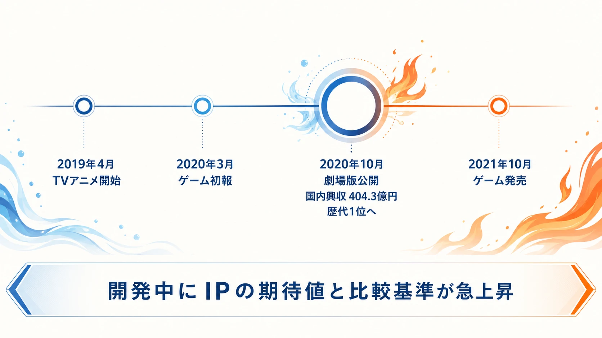
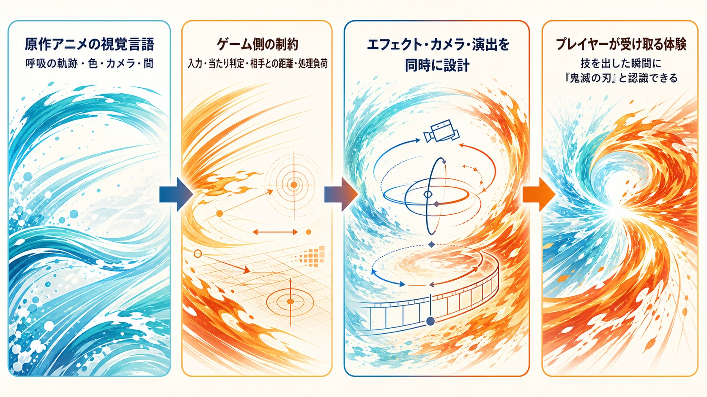
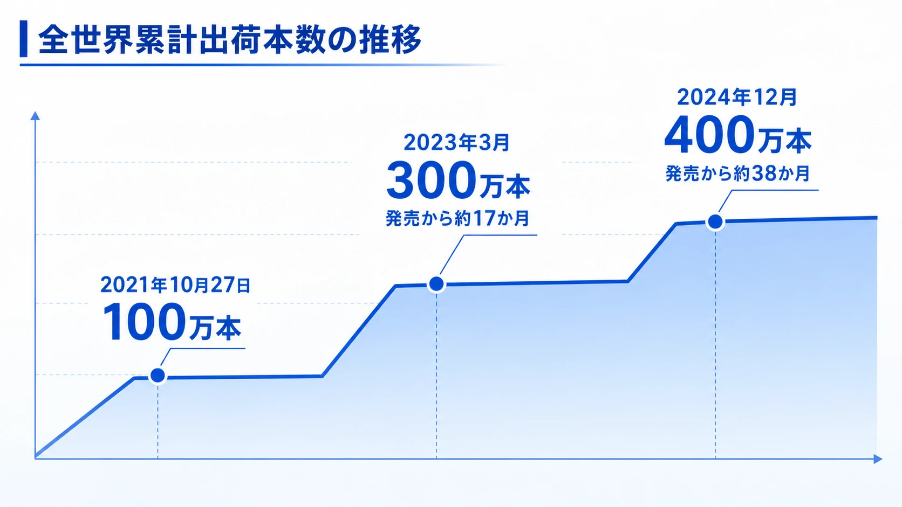

# 『鬼滅の刃 ヒノカミ血風譚』は、なぜ急拡大したアニメIPをゲームへ着地させられたのか――協働とタイミングの成功事例

他メディアIPのゲーム化では、企画を始めた時点の人気だけを前提にすると危険である。開発中に原作の規模、視聴者の期待、象徴的な表現が変われば、完成時に求められるものも変わる。2021年の『鬼滅の刃 ヒノカミ血風譚』は、開発期間中にIPの文化的な重みが急激に膨張した条件で発売され、商業的な成果を得た事例である。本稿は「他メディアIPのゲーム化 成功・失敗事例シリーズ」の一つとして、サイバーコネクトツーの再現設計と、原作アニメとの接続を検証する。

## エグゼクティブサマリー

本作の成功は、人気アニメを高精度で再現したことだけでは説明できない。企画発表の直後に『劇場版「鬼滅の刃」無限列車編』が記録的な興行となり、ゲームは、企画時とは異なる規模の期待を背負うことになった。その条件でサイバーコネクトツーは、原作アニメの特徴であるキャラクターの演技、画面構成、そして「水の呼吸」などのエフェクトを、ゲーム中で操作できる表現へ変換した。

鍵は、アニメを参照資料として眺めるだけでなく、アニメを制作したufotableの描き下ろしビジュアルを商品やプロモーションへ組み込み、原作側が作った視覚言語と接続したことである。もっとも、これはゲーム単体としてあらゆる面で最適解だったという意味ではない。批評は、戦闘演出とアニメ再現を称賛する一方、短いストーリーモードと、対戦アクションとしてのコンテンツ量・深みには留保を置いた。成功の理由は、独立した競技性を最大化したことより、急成長したIPの「顔」を、発売時の期待へ間に合わせたことにある。

***

## 開発中に変わった前提：2019年のアニメ化から、2021年の発売まで

TVアニメ「鬼滅の刃」竈門炭治郎 立志編は2019年に放送され、ufotableがアニメーションを制作した。家庭用ゲーム『鬼滅の刃 ヒノカミ血風譚』の第1弾PVと開発進捗映像が公開されたのは、2020年3月22日である。[[1](#ref-1)] この時点でゲームは、アニメの物語を追体験するソロプレイと、キャラクターを選ぶ対戦を組み合わせる企画として動き始めていた。

その約7か月後、2020年10月16日に『劇場版「鬼滅の刃」無限列車編』が公開された。日本映画製作者連盟の2020年興行統計では、同作の国内興行収入は404.3億円で年間1位である。[[2](#ref-2)] その後の公式発表でも、日本での歴代興行収入1位、世界累計約517億円という到達点が報告されている。[[3](#ref-3)] プランナーがここで押さえるべき事実は、ゲーム開発の途中で、原作が国内史上最大級の映画興行を持つIPへ変化したことである。

この変化は、単に潜在顧客が増えたという話ではない。視聴者の記憶には、特定のキャラクター、声、音楽、カメラ、エフェクトが高い解像度で刻まれた。ゲームは2021年10月14日に発売され、ソロプレイではTVアニメの「竈門炭治郎 立志編」から劇場版「無限列車編」までを扱った。[[4](#ref-4)] つまり、作品の認知を借りるだけでなく、最も新しく強い映像体験と比較される状態で市場へ出たのである。

***

## ufotableの視覚言語を、操作できる画面へ移す

『鬼滅の刃』において、呼吸の技は設定上の能力であるだけでなく、画面を見た瞬間に作品を識別させる視覚的な記号である。水流が刀筋に沿って走る「水の呼吸」、炎や雷の軌跡、奥義の直前に切り替わる構図は、原作アニメの体験そのものに含まれる。ゲーム化では、キャラクターモデルが似ているだけでは足りない。プレイヤー入力から技が出る短い時間に、アニメと同じ期待と見栄えを立ち上げる必要がある。

サイバーコネクトツーは、Unreal Engine 4上でアニメ作品のビジュアルを再現するため、内製ツールを含むエフェクト制作を行った。技術講演の記録では、シネマティクスにUE4標準と内製を合わせた7種類のポストエフェクトを用い、被写界深度やBloomもシーンごとに使い分けたことが示されている。[[5](#ref-5)] 重要なのは、アニメの一枚絵をそのまま貼ることではない。入力遅延、カメラ、ヒット判定、相手との距離、処理負荷がある状態で、技の軌跡と画面の密度を成立させることである。

原作アニメスタジオとの接続も、商品体験の一部になった。公式は、ufotable描き下ろしのイメージビジュアルを公開し、ゲームの早期購入特典や店舗別特典にも使用した。[[6](#ref-6)] アニメ側が提供する視覚資産を、ゲームのプロモーションと商品へ直接組み込むことで、サイバーコネクトツーのゲーム内表現と同じ「アニメ版らしさ」の基準で接続した。これは、受け手の認知を途切れさせない設計だった。

この「エフェクトという名の顔」は、実写IPにおける俳優の顔に近い。ファンが最初に照合するのは、細かな数値バランスより、技を出した瞬間に水、炎、雷が自分の知っている『鬼滅の刃』として見えるかである。本作は、その照合をキャラクターの3Dモデルだけでなく、画面全体のレイヤーとして扱った。

***

## 原作再現を優先したことの利益とコスト

発売時の評価は、肯定一色ではなかった。GAME Watchのレビューは、原作の戦いを再現する特殊アクション、ソロプレイでの物語理解、バーサスモードでの戦略性を高く評価した。[[7](#ref-7)] 一方、海外レビューでは、派手なボス戦とカットシーンはストーリーモードを支えるが、全体としてコンテンツ量と対戦ゲームとしての深みが不足すると指摘された。[[8](#ref-8)]

この評価差は、失敗ではなく、優先順位の結果として読むべきである。本作のソロプレイは、原作の印象的な局面を、探索、会話、ボス戦、演出でつなぐ。そこでは、初見の視聴者にも物語を追わせ、既存ファンには「ここを操作したかった」と思わせることが第一の成果になる。対して長く対戦し続けるアクションには、キャラクター数、読み合い、調整、練習の余地、対戦環境を積み上げる必要がある。

両方を最高水準にするには、それぞれに大きな制作コストと検証期間が要る。本作は、アニメの見せ場を濃く移植する方を優先し、ストーリーの長さや対戦の厚みで制約を受け入れた。その取捨選択は、原作ファンに何を最初に約束するかという意味では合理的だったが、IPに詳しくないアクションゲームの顧客へ、長期的な遊びを保証する設計とは別物である。

プランナーは「忠実さ」と「ゲームとしての深み」を同じ品質指標で採点してはならない。前者は、原作を知る顧客の記憶と新しい画面が一致する確率で測る。後者は、原作を知らなくても繰り返し遊びたい選択と変化があるかで測る。企画初期にどちらを主KPIにするかを決めなければ、両方が中途半端になる。

***

## 商業的結果：初動を継続的なシリーズへつないだ

本作は2021年10月14日の発売から13日後、全世界累計出荷100万本を突破した。[[9](#ref-9)] その後、2023年3月には世界累計出荷300万本突破が報じられ、[[10](#ref-10)] 2024年12月には公式が400万本突破を発表している。[[11](#ref-11)] 作品の規模と発売時の熱量を考えれば、ゲーム内容への批評が割れたとしても、原作の体験を遊べる形へ着地させたことが販売につながったと読める。

続編『鬼滅の刃 ヒノカミ血風譚2』は2024年12月に発表され、2025年の発売が告知された。SEGAの発表は、前作の次に「遊郭編」から「柱稽古編」までを扱うシリーズとして位置づけている。[[12](#ref-12)] これは一作目が、単発の映像再現ではなく、アニメの放送・映画の展開に合わせてゲーム側の範囲を更新できる基盤になったことを示す。

***

## プランナーへの示唆：急成長IPに追随するのではなく、変化を設計へ織り込む

### 1. 原作制作スタジオとの接点を、承認工程だけで終わらせない

アニメ原作では、作品の顔はキャラクター設定表だけに存在しない。エフェクト、撮影、色、音、間の取り方に分散している。ライセンサーから資料を受け、完成物を承認してもらうだけでは、その顔をゲームで再構成するための判断が遅れる。

早い段階で、何をアニメ固有の表現として守るかを原作制作側と共有する必要がある。本作のように描き下ろしビジュアルを受ける場合も、単に販促素材として扱うのではなく、ゲームの画面、トレーラー、特典で同じ視覚言語が連続するように計画する。直接の共同制作範囲、監修の判断者、フィードバックの頻度、エンジン上で再現できない場合の代替案を、契約後に曖昧にしないことが重要である。

### 2. 文化的ピークは、発売日の追い風であると同時に比較基準を引き上げる

IPが急拡大すると、発売を早めたくなる。だが、ピークの直後に出すゲームは、最も記憶に新しい映像体験と比較される。『無限列車編』の後に発売した本作では、単に炭治郎を動かせることではなく、呼吸の技や決戦の見せ場を、アニメ版を見た顧客が受け入れられる密度で示す必要があった。

企画段階では、原作側の放送・映画・大型イベントの複数シナリオを置きたい。IPが伸びない場合の販売計画だけでなく、爆発的に伸びた場合に何が比較対象になるか、追加の演出品質やローカライズ、販促素材にどれだけ余力が要るかを見積もる。人気の上昇は予定どおりの開発を楽にするのではなく、品質の下限を引き上げる。

### 3. 原作の顔とゲームの深みは、意図して優先順位を分ける

本作は、アニメの戦闘を操作できることへ大きく投資した。そのため、初回の体験では強い満足を作れた一方、対戦を深く遊ぶ顧客には不足も残した。これは、どちらかを失敗と呼ぶための比較ではない。顧客層ごとに別の価値を求めるため、どの価値を発売時に確実に届けるかを決める問題である。

もし独立した対戦ゲームとして長く遊ばせるなら、原作再現に必要な演出資産と並行して、対戦の読み合い、モード、キャラクター追加、調整運営へ投資しなければならない。逆に「名場面を自分で動かす」ことを最優先するなら、ゲーム全体の長さや対戦の奥行きに関する期待を、販売前から正確に置くべきである。

***

## おわりに：変化したIPに、変化しない制作原則で応えた

『鬼滅の刃 ヒノカミ血風譚』は、原作の勢いが開発中に爆発した特殊な成功事例である。だからといって、ヒットIPへ乗れば成功するという一般則にはならない。むしろ、急成長によって比較基準が上がるなかで、何を原作の顔として移植するかを定め、アニメ側の視覚資産と接続し、限られた開発資源をそこへ集中させたことが重要だった。

本作は、原作再現とゲームとしての独立した深みが常に一致しないことも示している。大型IPのゲーム化では、すべてを得ようとするより、発売時の顧客に何を最も確実に届けるかを決める方が先である。原作の熱量が変わっても、その判断を支える協働体制と優先順位があれば、ゲームは単なる記念品ではなく、IPの体験を別の入力へ翻訳する作品になり得る。

## References

1. [家庭用ゲーム「鬼滅の刃 ヒノカミ血風譚」第1弾PV＆開発進捗レポート映像を公開！][1] - 2020年3月22日の第1弾PV・開発進捗映像の公式告知。

2. [2020年（令和2年）興行収入10億円以上番組][2] - 日本映画製作者連盟による2020年国内興行統計。

3. [『劇場版「鬼滅の刃」無限列車編』全世界累計来場者約4135万人・総興行収入約517億円記録のご報告][3] - 日本での歴代興行収入1位と世界累計興行の公式報告。

4. [セガ、家庭用ゲーム『鬼滅の刃 ヒノカミ血風譚』のアジア・欧米での発売を決定][4] - 開発元・発売地域、ソロプレイとバーサスモード、収録範囲を説明したセガ公式発表。

5. [サイバーコネクトツーのエフェクト開発事例][5] - UE4上の内製ツールとポストエフェクトを解説したUNREAL FEST 2022講演の記録。

6. [家庭用ゲーム『鬼滅の刃 ヒノカミ血風譚』ufotable描き下ろしイメージビジュアル第2弾公開!!][6] - ufotable描き下ろしビジュアルと特典利用を示すアニプレックス公式告知。

7. [「鬼滅の刃 ヒノカミ血風譚」レビュー][7] - アクション、ストーリーモード、バーサスモードを評価した発売時レビュー。

8. [Demon Slayer: Kimetsu no Yaiba - The Hinokami Chronicles Review][8] - 演出面を評価しつつ、短いストーリーモードとコンテンツ量・深みの課題を指摘したレビュー。

9. [家庭用ゲーム『鬼滅の刃 ヒノカミ血風譚』全世界累計出荷100万本突破！][9] - 2021年10月27日の世界累計出荷100万本突破の公式発表。

10. [鬼滅の刃：ゲーム「ヒノカミ血風譚」世界累計300万本突破][10] - 2023年3月の世界累計出荷300万本突破を報じた記事。

11. [家庭用ゲーム『鬼滅の刃 ヒノカミ血風譚』全世界累計出荷400万本突破！][11] - 2024年12月の世界累計出荷400万本突破と続編発売予定の公式発表。

12. [Demon Slayer -Kimetsu no Yaiba- The Hinokami Chronicles 2 Arrives in 2025][12] - 続編の発表と収録範囲を示すSEGA公式発表。

[1]: https://game.kimetsu.com/hinokami/news/?id=56331
[2]: https://www.eiren.org/toukei/img/eiren_kosyu/2020.pdf
[3]: https://prtimes.jp/main/html/rd/p/000003008.000016356.html
[4]: https://www.sega.co.jp/release/210628_1.html
[5]: https://gamemakers.jp/article/2022_08_11_10558/
[6]: https://www.aniplex.co.jp/lineup/kimetsu_gamehinokami/news/detail/?id=58277
[7]: https://game.watch.impress.co.jp/docs/review/rev1/1356713.html
[8]: https://www.pushsquare.com/reviews/ps5/demon-slayer-kimetsu-no-yaiba-the-hinokami-chronicles
[9]: https://game.kimetsu.com/hinokami/news/?id=58959
[10]: https://mantan-web.jp/article/20230329dog00m200048000c.html
[11]: https://game.kimetsu.com/hinokami/news/?id=66782
[12]: https://sega.prezly.com/demon-slayer-kimetsu-no-yaiba-the-hinokami-chronicles-2-arrives-in-2025

----

この文書は、Perplexity、Claude、OpenAI Codex の3つのAIの支援を受けて著述されたものです。引用画像を除き、MIT License にて提供されています。
