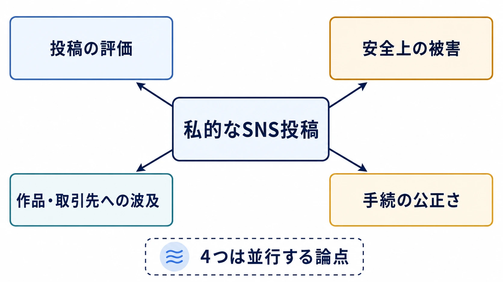
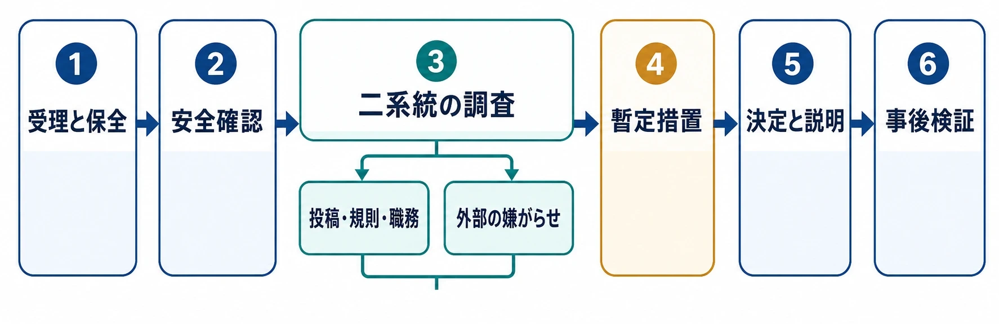

# 開発者個人のSNS発言はなぜスタジオ全体のリスクになるのか：4事例で考える人事・炎上・ガバナンス

***

## はじめに：ゲーム内容への批判とは別の「人に紐づく」危機

ゲームの炎上には、料金設定、アップデート、運営告知、ゲーム内仕様への不満が積み重なる型がある。こうした製品・運営判断をめぐる危機とその信頼回復は、別記事「[プレイヤーと開発元のコミュニケーション：炎上対応と信頼回復の実践知識](player-developer-communication-crisis-response.md)」で扱っている。

本稿の対象はそれとは異なる。開発者個人の私的なSNS投稿が切り取られ、勤務先、作品、同僚、流通先までが批判・不買呼びかけの対象になる型である。ゲームの品質や運営方針に直接の争点がなくても、組織の看板と個人の発言が結び付けられると、広報、人事、法務、現場の安全確保を同時に動かさなければならない。

ここでは、政治的暴力事件自体や投稿内容の是非を論評しない。2025年の *Ghost of Yōtei*、2016年のNintendo of America（NOA）、2018年のArenaNet、2021年の株式会社大遊の公開情報を、リスク管理と人事対応の観点から整理する。個人の主張と会社の説明が異なる箇所は、いずれかを事実認定せず、誰が何を公表したかを分けて記す。

***

## まず押さえるべき構造：一つの投稿が四つの問題へ分岐する

私的な投稿が問題化したとき、組織が向き合う対象は投稿の文面だけではない。少なくとも、投稿そのものの評価、投稿者と他の従業員への安全上の被害、作品・取引先への波及、処分手続の公正さが並行する。これらを一問一答で扱うと、たとえば「批判が来たから解雇した」という印象だけが残り、実際の調査範囲や判断理由が説明不能になる。

プランナーにとっての要点は、SNSを「広報だけの問題」としないことにある。ゲームの企画・開発では、公式Discord、開発者配信、個人の登壇、コミュニティとの日常的な接点が増えている。誰がどの立場で発言し、問題発生時に誰が記録を保全し、誰が人事判断を行うかは、開発運用の設計項目である。

*図：私的なSNS投稿を起点とする四つの論点。いずれも並行して扱う必要がある。*

***

## 事例1：*Ghost of Yōtei*――投稿、圧力、解雇、販売実績を分けて読む

### 時系列

Sucker Punch Productionsは2025年4月、PS5向け *Ghost of Yōtei* を同年10月2日に発売すると発表した。[[1](#ref-1)] 発売前の9月10日、同スタジオのアーティストだったDrew Harrison氏が、Charlie Kirk氏の殺害事件の直後に、犯人名と別の殺人事件をめぐる人物名を掛けた冗談をBlueskyへ投稿したと複数の報道が伝えている。[[2](#ref-2)]

投稿後、解雇を求める連絡や、作品へのボイコットを呼びかける動きが生じた。PC Gamerが後に報じたAftermathの取材では、Harrison氏と他のSucker Punch従業員に脅迫や大量の連絡が向けられたとされる。ここで重要なのは、「不快だとする批判」と、標的を勤務先へ広げて雇用喪失を求める反復的な働きかけとを同じ箱に入れないことである。後者の有無と規模は、投稿の評価とは別に、記録・安全対策・調査の対象になる。[[3](#ref-3)]

解雇後、Sucker Punch共同創業者のBrian Fleming氏はGame Fileへの取材で、Harrison氏がもはや従業員ではないことを認め、殺害を軽く扱うことはスタジオにとって許容できない線だと説明した。これは会社側が公に示した判断理由である。[[2](#ref-2)]

一方、Harrison氏はAftermathへの取材で、投稿を最良の趣味のものとは考えていないとしつつ、解雇の実質的な原因は投稿そのものではなく、会社が調査しなかった組織的なハラスメント・キャンペーンだと主張した。投稿の削除や謝罪を求められず、上級管理職との話し合いもないまま解雇された、というのが同氏の説明である。これは当事者の見解であり、Sucker Punch側の上記説明と一致しない。公開情報だけから、どちらが解雇決定の唯一の原因だったかを断定することはできない。[[3](#ref-3)]

### 「炎上」と販売への影響は別に測る

本作は10月2日に発売された。Sonyは決算説明で、11月2日時点の世界累計販売本数が330万本を超えたと公表している。[[4](#ref-4)] この数字は、少なくとも公開された不買呼びかけが販売を止めたことを示すものではない。ただし、これは「炎上に実害がなかった」ことの証明でもない。広告・採用・従業員の心理的安全性・取引先対応・危機対応の工数は、販売本数だけでは測れない。また、販売本数から投稿やボイコットと売上の因果を直接推定することもできない。

この事例が示すのは、ボイコットの声量と市場での効果を混同しない必要である。同時に、売上が維持された後でも、個人や同僚が受けた攻撃、組織がどの程度保護・調査したかという問題は独立して残る。

***

## 事例2：Alison Rapp氏とNintendo of America――公式理由と当事者の説明が食い違った例

2016年、Nintendo of America（NOA）のTreehouseでプロダクトマーケティングに携わっていたAlison Rapp氏は、フェミニズムに関する発言や日本作品のローカライズをめぐる議論の中で、SNS上の批判・標的化を受けた。報道によれば、同氏は当該ローカライズ業務に直接関与していなかったと説明していたが、過去の投稿や学術論文も掘り起こされ、解雇を求める動きにつながった。[[5](#ref-5)]

NOAは、解雇理由を「第二の仕事を持つことに関する社内方針への違反で、企業文化と相反するもの」と説明し、SNS上の批判とは「まったく関係がない」とした。また、性別、人種、信条を理由とするハラスメントを拒絶すると表明した。[[6](#ref-6)]

これに対してRapp氏は、兼業自体は認められていたとして、会社が問題としたのはその特定の仕事であり、実際には自身の発言やSNS上の標的化が背景にある、という趣旨の発信を行った。[[5](#ref-5)] ここでも、公式の雇用理由と当事者が感じた実質的な理由には隔たりがある。外部からは雇用契約、社内調査、評価記録を確認できないため、記事やSNSの印象だけで真因を決めてはならない。

実務上の教訓は、処分理由が投稿そのものではない場合ほど、説明の根拠と時系列を社内で厳密に保全する必要がある点だ。兼業規定の適用であれば、誰に、いつ、どのように適用してきたかを人事と法務が確認しなければ、外部の圧力への迎合と受け取られる余地が大きくなる。

***

## 事例3：Jessica Price氏とArenaNet――対話の摩擦から即日処分へ進んだ例

2018年7月、*Guild Wars 2* のナラティブデザイナーだったJessica Price氏は、MMORPGでプレイヤーキャラクターを書く難しさについてTwitterで連続投稿した。その投稿にストリーマーが異論を添えて反応し、Price氏は自分の仕事を説明されることへの不満と、女性ゲーム開発者としての経験に触れて応答した。同僚のPeter Fries氏もPrice氏を擁護する投稿を行った。[[7](#ref-7)]

ArenaNetのMike O'Brien氏は7月5日、プレイヤーとのコミュニケーション基準を満たさなかったとして、2人を解雇したと公表した。発端の連続投稿は7月3日であり、公開情報上は同日中の「即日」解雇ではなく、約2日後の公表・処分である。それでも非常に短い間隔であり、コミュニティで解雇要求やボイコットの呼びかけが拡大していた時期と重なったことから、処分の速度自体が議論の対象になった。[[7](#ref-7)]

Price氏は後に、自身が性差別について発言したことへの解雇であり、女性開発者が標的になる結果を会社は予見できたはずだという趣旨で反論した。[[8](#ref-8)] 会社側は顧客とのコミュニケーションを問題とし、当事者側はハラスメントを伴う状況での扱いを問題としたのである。

この事例は、初動の速さが常に安全な選択ではないことを示す。緊急の暴言、脅迫、情報漏えいのように即時の隔離が必要な場合はある。しかし、投稿の文脈、業務上の立場、相手側からの反復的な攻撃、当人の安全を区別しないまま公開処分へ進めば、組織は批判の収束ではなく、次の攻撃の動機づけを生む可能性がある。

***

## 事例4：株式会社大遊「ゲートルーラー」――個人への誹謗中傷と役員の連座辞任

2021年8月、株式会社大遊は、同社の開発スタッフで「ゲートルーラー」の開発ディレクターだった池田芳正氏が、外部運営のDiscordサーバー内で個人への強要・誹謗中傷を含む複数の不適切な発言をしたと公式サイトで公表した。会社は被害を受けた人と関係者に謝罪し、発言を看過できないものと位置付けた。[[9](#ref-9)]

処分は、池田氏を開発、広報、運営、その他の関連業務とプロジェクトから外すというものだった。加えて同社は管理体制の不備を原因として認め、代表取締役2名と取締役1名の辞任を発表した。[[9](#ref-9)]

ここで注目すべきは、問題が抽象的な政治的意見ではなく、特定の個人に向けた強要・誹謗中傷と会社が公表した点、そして組織が管理責任を明示して経営層の交代まで行った点である。この対応を「日本企業ならでは」と一般化する根拠はこの1件だけでは足りない。しかし、担当者の処分だけで完結させず、監督体制の不備を経営責任として扱う選択肢が実在することは確認できる。

この事例でも、発売後の販売本数やブランドへの因果的な影響を示す公開データは確認できない。したがって「騒動が売上をどれだけ損なったか」ではなく、会社が明示した被害、プロジェクトの継続性、再発防止の責任体制を評価対象にするべきである。

***

## 4事例の比較：同じ「SNS炎上」に見えて、判断材料は異なる

| 事例 | 投稿・発言の性質 | 組織的攻撃キャンペーンの公開情報 | 対応の速さ | 公式理由と当事者側の説明 | 売上・ブランドへの公開された実害 |
| --- | --- | --- | --- | --- | --- |
| *Ghost of Yōtei*／Harrison氏 | 政治的殺害事件をめぐる冗談 | 解雇要求、脅迫・大量連絡が報じられ、当事者は組織的キャンペーンと主張 | 投稿後1日以内と報道 | スタジオは殺人を軽く扱うことを理由に説明。本人は調査されなかったハラスメントが実質的原因と主張 | 32日間で世界累計330万本超。ボイコットとの因果は不明 |
| NOA／Rapp氏 | フェミニズム等の私的発言をめぐる標的化 | 継続的なオンライン・ハラスメントと解雇要求が報道 | 公開情報から処分決定までの内部手続は不明 | 会社は兼業規定違反、本人はSNS上の発言・標的化が背景と主張 | 因果を示す公開データは確認できない |
| ArenaNet／Price氏 | ファンとの応酬、職務説明への反発と性差別への言及 | 解雇要求・ボイコット呼びかけが報道 | 数日内、CEOが公表 | 会社はプレイヤーとのコミュニケーション基準、本人は性差別とハラスメント文脈を問題視 | 因果を示す公開データは確認できない |
| 株式会社大遊／池田氏 | 特定個人への強要・誹謗中傷を会社が認定 | 外部からの組織的攻撃ではなく、本人の発言による被害が中心 | 発覚時に公式発表・解職 | 会社の公式説明と反対の当事者説明は本稿で確認できない | 因果を示す公開データは確認できない |

表が示す通り、「発言が問題になった」「会社が処分した」という共通点だけでは、適切な対応は導けない。少なくとも次の三つを切り分ける必要がある。

- **発言の評価：** 政治的・社会的な意見、態度や応酬、特定個人への攻撃、脅迫や差別扇動では、就業規則上の位置付けも被害の直接性も異なる。
- **外部圧力の評価：** 通常の批判、同一人物からの反復連絡、個人情報の晒し、同僚・取引先への接触、雇用を狙った同時多発的な通報は、同じ「反発」ではない。
- **組織の責任：** 個人の行為に対する規律だけでなく、職場が安全に調査できるか、同僚を守れるか、説明に一貫性があるかが、後の信頼を左右する。

***

## 売上が崩れなくても、企業がリスク回避的になる理由

*Ghost of Yōtei* の販売実績は、「SNSで大きく見える不買運動」と「購買行動」は同義ではないことをよく示す。公開された呼びかけの件数、ハッシュタグの表示回数、動画の再生数は、ユニークな購入者数でも、購入取りやめ数でもない。販売本数が出た後も、どの要因が寄与したかを外部から分離することは困難である。

それでも企業は、販売本数が出るまで何もしないという選択を取りにくい。理由は四つある。第一に、従業員や家族への脅迫、ドキシング、取引先への接触には即時の安全対応が要る。第二に、プラットフォーム、販売店、出資者、採用候補者は炎上の内容だけでなく会社の統制を観察する。第三に、開発現場が問い合わせと攻撃に消費する時間は、売上に直結しない運用損失である。第四に、後から「外部の圧力に屈した」と認識される処分は、従業員の発信萎縮と将来の標的化を招きうる。

つまりジレンマは、実害が確定してから対処すると遅く、実害が不明な段階で拙速に処分すると別のリスクを生む点にある。目標は炎上を最短で消すことではない。安全、事実確認、就業規則の一貫性、説明責任を両立させることである。

***

## プランナーとスタジオの実務：投稿を禁止する前に、判断系を設計する

### 1. SNSガイドラインは「禁止語一覧」ではなく、役割と手続を定める

私的発言を広範に禁止する規程は、現実のSNS利用を地下化し、何が起きているかを組織から見えにくくする。反対に「個人の自由だから会社は関与しない」だけでは、公式と誤認される発信や個人攻撃に対応できない。

ガイドラインには、少なくとも次を明文化する。

- 公式アカウント、業務上の個人アカウント、完全な私的アカウントの区分と、それぞれの承認・記録・引き継ぎ方法
- 守秘義務、未発表情報、他者の個人情報、差別・脅迫・標的型の嫌がらせに関する非交渉の基準
- 会社名・作品名をプロフィールに出す場合の期待される配慮。ただし、私的な政治的意見を一律に会社の意見と扱わない原則
- 問題発生時、本人が削除や反論を急がず、誰へ連絡して保全を依頼できるか
- 相談・申告した人が不利益を受けないこと、処分判断の担当者と異議申立ての窓口

IGDAのソーシャルメディア方針資料も、SNSが開発者との接点になる一方で、ハラスメントと虐待への露出を生むと指摘している。規程の目的は沈黙を強いることではなく、公式発信の責任と個人の安全を両立させることに置くべきである。[[10](#ref-10)]

### 2. 公式と個人の境界は、プロフィール文だけでなく運用で作る

プロフィールに「個人の見解」と書くだけでは、勤務先が明記され、作品の発売前後に発信される状況を解消できない。実務では、次のように接点を減らす。

- 公式発表、パッチノート、顧客対応は公式アカウントと承認済みの担当者へ集約する。
- 個人アカウントを業務で起用する場合は、担当範囲、勤務時間外の対応、ログ保全、交代要員を決める。
- 開発者配信・登壇・Discord参加では、批判や挑発を受けたときに即答しない退出手順と、モデレーターへの引き継ぎを用意する。
- 会社の監視対象を必要最小限にし、私的アカウントの常時監視ではなく、通報を受けた際の安全確認と証拠保全に限定する。

### 3. 初動は「投稿の善悪判定」より先に、証拠と安全を確保する

炎上時の最初の数時間に、現場の上長が単独で「削除しろ」「謝罪しろ」「解雇する」と決めない。推奨するエスカレーションは次の順である。

1. **受理と保全：** 投稿のURL、時刻、スクリーンショット、連絡件数、脅迫・個人情報・勤務先への接触を、改変せず記録する。
2. **安全確認：** 投稿者、同僚、家族、施設への具体的危険を確認し、必要なら警備、プラットフォーム通報、専門家・公的機関への相談を行う。
3. **二系統の調査：** 投稿が就業規則や職務にどう関係するかの調査と、外部からの組織的な嫌がらせの調査を、同じ結論ありきで混ぜない。
4. **暫定措置：** 緊急性がある場合は、公開対応の窓口変更、公式権限の一時停止、休務などの可逆的な措置を選び、恒久処分と区別する。
5. **決定と説明：** 処分するなら、外部圧力ではなく確認済みの規程・事実・手続に基づくことを説明可能にする。本人の反論機会、秘密保持、法的助言も確保する。
6. **事後検証：** 攻撃経路、社内連絡の詰まり、規程の曖昧さ、同僚への二次被害を振り返り、改善を残す。

*図：初動の6段階。受理では記録を保全し、安全を確認した上で、投稿と就業規則・職務の関係と外部からの嫌がらせを分けて調査する。暫定措置は可逆的にし、決定の根拠を説明した後に改善点を検証する。*

この順番は、投稿者を免責するためのものではない。会社が規律を行使する場合でも、外部の攻撃を調査せずに処分の根拠と混ぜないための最低限の統制である。

### 4. 「正当な批判」と「組織的な攻撃」を判別する社内プロセス

批判者の政治的立場、好悪、口調だけで攻撃性を決めてはならない。内容への異論、訂正要求、購入見送りの表明は、脅迫や標的化と同じではない。他方で、正当な問題提起の語彙を使いながら、雇用主・同僚・家族へ圧力を広げる行為もありうる。

判別では、発言の立場ではなく行動の証拠を見る。具体的には、同一文面の大量送信、特定人物の連絡先や所在の拡散、同僚や取引先への接触の呼びかけ、脅迫・差別表現、複数アカウントの協調、期間と反復性を記録する。反対に、具体的な投稿への批判、会社への通常の問い合わせ、購入しないという個別の表明は、それだけで組織的攻撃とは呼ばない。

判定には広報だけでなく、人事、法務、情報セキュリティ、コミュニティ担当、必要に応じて安全担当を含める。担当者が当該の政治的争点に強い当事者性を持つ場合は、記録確認を別担当に置くことも有効である。結論と根拠、見送った措置を時系列で残せば、後から処分の一貫性を検証できる。

***

## おわりに：守るべき対象を一人に絞らない

開発者個人のSNS投稿をめぐる危機では、会社は作品のブランド、投稿者、同僚、批判を表明する顧客、攻撃を受ける第三者を同時に扱うことになる。売上が維持されたことだけで対応の成否は測れず、投稿が不適切だったという評価だけでも人事手続の妥当性は決まらない。

プランナーが設計に参加できるのは、炎上後の謝罪文だけではない。公式と個人の接点、コミュニティ運用、通報導線、エスカレーション、記録、復帰可能な暫定措置を、開発の平時から決めておくことである。発言をめぐる意見の対立を消すことはできない。しかし、批判と標的型攻撃を混同せず、外部の声量ではなく確認可能な事実と一貫した規程で判断する体制は設計できる。

## References

1. [PS5®『Ghost of Yōtei』が10月2日発売決定！][1] - Sucker Punch Productionsの担当者が、PS5版の2025年10月2日発売を告知したPlayStation.Blogの記事。

2. [Sucker Punch confirms it fired artist for joking about Charlie Kirk shooting][2] - Brian Fleming氏のGame File取材での説明、投稿内容、解雇までの経緯を伝える報道。

3. [Former Ghost of Yotei artist says she wasn't fired because of a Charlie Kirk joke, but 'because of a harassment campaign'][3] - AftermathによるDrew Harrison氏の取材内容と、同氏が述べたハラスメント・キャンペーンへの問題提起を紹介する報道。

4. [Q2 FY2025 Consolidated Financial Results][4] - Sonyが *Ghost of Yōtei* の世界累計販売本数が2025年11月時点で330万本超と説明した決算資料。

5. [Nintendo denies Alison Rapp firing is linked to harassment campaign][5] - Rapp氏の投稿、標的化の経緯、同氏の主張を伝える報道。

6. [Nintendo Treehouse Product Marketing Specialist Alison Rapp Has Employment Terminated][6] - NOAが示した兼業規定違反とSNS上の批判は無関係であるとの声明を掲載した報道。

7. [Game developer ArenaNet fires two employees following Twitter exchange, spurring controversy][7] - Price氏の投稿から、CEOによる解雇公表、コミュニティの反応までを時系列で伝える報道。

8. [Fired ArenaNet dev calls dismissal 'an active solicitation of harassment'][8] - Price氏が解雇公表とハラスメントの関係について述べた反論を収録する報道。

9. [弊社開発スタッフによるSNS上での不適切な発言についてのお詫びと処分に関するご報告][9] - 株式会社大遊が池田芳正氏の発言、プロジェクトからの解職、役員辞任を公式に公表した文書。

10. [IGDA Social Media Policies [2018]][10] - SNSの利用がハラスメントや虐待への露出を伴うことを踏まえた、IGDAの方針資料。

[1]: https://blog.ja.playstation.com/2025/04/23/20250423-goy/
[2]: https://www.pcgamer.com/gaming-industry/sucker-punch-confirms-it-fired-artist-for-joking-about-charlie-kirk-shooting-making-light-of-someones-murder-is-a-deal-breaker/
[3]: https://www.pcgamer.com/games/former-ghost-of-yotei-artist-says-she-wasnt-fired-because-of-a-charlie-kirk-joke-but-because-of-a-harassment-campaign-that-nobody-at-sony-or-sucker-punch-bothered-investigating/
[4]: https://www.sony.com/en/SonyInfo/IR/library/presen/er/pdf/25q2_sonyspeech.pdf
[5]: https://www.theguardian.com/technology/2016/mar/31/nintendo-denies-alison-rapp-firing-is-linked-to-harassment-campaign
[6]: https://www.nintendolife.com/news/2016/03/nintendo_treehouse_product_marketing_specialist_alison_rapp_has_employment_terminated
[7]: https://www.geekwire.com/2018/game-developer-arenanet-fires-two-employees-following-twitter-exchange-spurring-controversy/
[8]: https://www.pcgamer.com/fired-arenanet-dev-calls-dismissal-an-active-solicitation-of-harassment/
[9]: https://gateruler.jp/news/report/
[10]: https://igda.org/resources-archive/igda-social-media-policies-pdf/

----

この文書は、Perplexity、Claude、OpenAI Codex の3つのAIの支援を受けて著述されたものです。引用画像を除き、MIT License にて提供されています。
