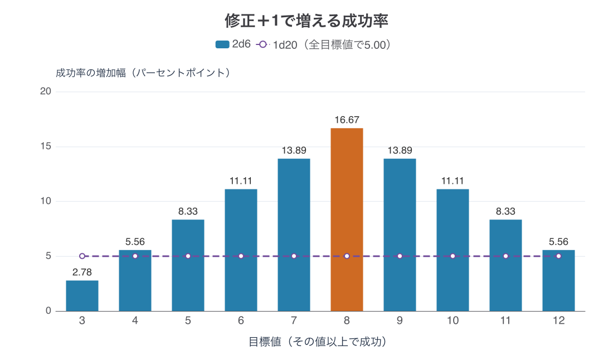
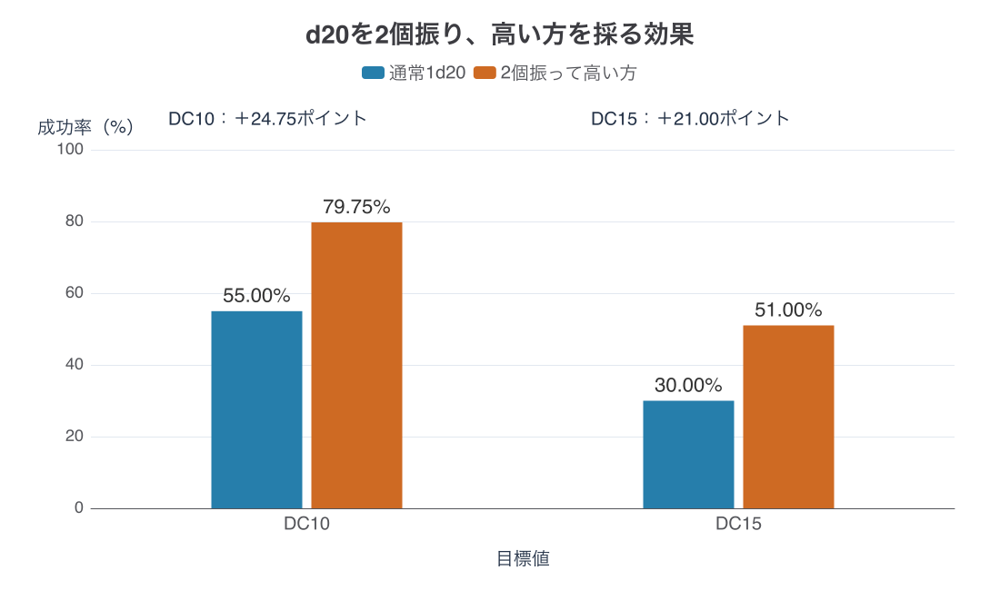

# ダイスの振り方で「＋1」の価値が変わる：成否判定の分布を設計する

## 第1章　ダイスの読み方

ダイスとはサイコロのことである。卓上で遊ぶロールプレイングゲームでは、攻撃が当たるか、鍵を開けられるかといった行動の結果を、ダイスを振って決めることがある。そのときに登場するのが「2d6」「1d20」といった書き方だ。

### dの前は個数、後ろは面の数

基本的な読み方は、dの前が振る個数、後ろがダイスの面の数である。複数個を指定した場合は、通常、それぞれの出目を足し合わせる。大文字のDも同じ意味で使われる。[[1](#ref-1)]

| 記法 | 読み方 | 出る数・合計の範囲 |
|---|---|---|
| 1d6 | 6面ダイスを1個振る | 1〜6 |
| 2d6 | 6面ダイスを2個振り、合計する | 2〜12 |
| 3d6 | 6面ダイスを3個振り、合計する | 3〜18 |
| 1d20 | 20面ダイスを1個振る | 1〜20 |
| 1d100 | 10面ダイス2個を組み合わせ、1〜100のいずれかを出す | 1〜100 |

1d100だけは、dの後ろが面の数ではなく、出る数の範囲を指している。100面のダイスを振るわけではなく、10面ダイス2個で1〜100を作る（読み方は後述する）。[[1](#ref-1)]

たとえば2d6で、一方が3、もう一方が5なら合計は8である。手元に6面ダイスが1個しかなければ、2回振って足してもよい。「2d6＋1」なら、合計した8に1を足して9と読む。[[1](#ref-1)]

### 20面のダイスも実際にある

ゲーム用のダイスには、よく見る立方体の6面ダイスのほかに、4面・8面・10面・12面・20面などがある。20面ダイスは三角形の面が集まった形で、それぞれに1〜20の数字が書かれている。画面上だけの道具ではなく、手に持って転がせる実物だ。D&Dの基本ルールの導入部にも、d4・d6・d8・d10・d12・d20が使うダイスとして並ぶ。[[2](#ref-2)]

### 1d100は10面ダイス2個でも振れる

1d100は、十の位と一の位を担当する10面ダイスを1個ずつ振って表せる。十の位用には00・10・20……90、一の位用には0〜9が書かれている。[[1](#ref-1)]

| 十の位 | 一の位 | 読む数 |
|---|---|---|
| 30 | 5 | 35 |
| 00 | 3 | 3 |
| 70 | 0 | 70 |
| 00 | 0 | 100 |

両方が0のときは100と読む。普通の0〜9の10面ダイスを2個使う場合も、振る前に色などで十の位と一の位を決めておけばよい。2d6では2個の数字を足すが、この1d100では桁として組み合わせる。[[1](#ref-1)]

***

## 第2章　＋1の価値は、振り方で決まる

装備で攻撃＋1、支援魔法で命中＋1。こうした小さな強化が、成功率をどれだけ上げるかは、判定の振り方によって変わる。ここでは「攻撃＋1」を、命中を判定する合計に1を足す効果として考える。

まず、目標値を「成功するための境界の数」としよう。出目に修正値を足して目標値以上なら成功、という判定では、＋1の有無によって次の差が生じる。

| 判定の例 | 強化前の成功率 | ＋1で増える成功率 |
|---|---:|---:|
| 1d20で10以上 | 55.00% | 5.00ポイント |
| 1d20で15以上 | 30.00% | 5.00ポイント |
| 2d6で8以上 | 41.67% | 16.67ポイント |
| 2d6で12以上 | 2.78% | 5.56ポイント |

以下の確率は、各ダイスが公平で、別々のダイスの結果が互いに影響しないとして、出目の全組合せを数えた理論値である。自動成功・自動失敗などの例外を外して比較する。百分率は小数第3位を四捨五入し、小数第2位まで表示する。増加幅も、丸める前の確率の差から計算する。

「ポイント」は、百分率同士を引いた差、すなわちパーセントポイントの略である。55%から60%への変化は5ポイント増であり、「元の成功率の5%分だけ増える」という意味ではない。

1d20では、1〜20のどの数字も同じ確率で出る。これを **一様分布** と呼ぶ。2d6の合計は中央付近が出やすく、端が出にくい。こちらは本稿で **山なり分布** と呼ぶ形だ。

その結果、1d20の＋1は、新しく成功に変わる出目が1つ増える範囲では、どこでも5ポイント分になる。2d6の＋1は、その境界がどこにあるかによって増加幅が変わる。

**振り方を選ぶことは、成長や装備の1点が成功率へどう換算されるかを選ぶことでもある。** 後から分布を変更すること自体は可能だが、その変更は既存の装備や敵の難易度にも及ぶ。個々の＋1を調整する前に置く、判定設計の土台なのである。

***

## 第3章　振り方の四つの型

卓上ゲームの実例を、出目をどう作り、何と比較するかで並べてみよう。ここで扱うのは各作品の基本判定であり、作品内のすべての処理がこの一方式で済むわけではない。

| 作品・参照する規則 | 基本の振り方 | 成功する向き | 出目の分布 |
|---|---|---|---|
| D&D／SRD 5.2.1 | 1d20に修正値を足す | 合計が目標値以上 | 一様 |
| Call of Cthulhu／公式ルール解説 | 1d100 | 出目が技能値以下 | 一様 |
| Traveller／SRD v1.1 | 2d6に修正値を足す | 合計が目標値以上 | 山なり |
| GURPS／第3版対応Lite | 3d6を合計する | 合計が技能・能力の値以下 | 山なり |

### 1d20：高い目に修正値を足す

D&DのSRD 5.2.1は、基本手順を次のように始める。

> “Roll 1d20. You always want to roll high.” [[3](#ref-3)]

1d20を振り、高い目を目指す。そこに関連する能力の修正値、該当する場合の習熟ボーナス、状況によるボーナスやペナルティを加え、合計が目標値と同じか、それ以上なら成功となる。能力判定やセーヴィング・スローの目標値をDC、攻撃の目標値をACと呼ぶ。以下、d20の計算例ではDCを使う。[[3](#ref-3)]

### 1d100：技能値の範囲に収める

Call of Cthulhuの公式解説は、通常の課題について次のように記す。

> “A regular task requires a roll of equal to or less than your skill value on 1D100” [[1](#ref-1)]

1d100で技能値以下を出せば、通常の成功となる。技能値60なら1〜60が成功の範囲だ。技能値が大きいほど、その範囲が広がる。出目に＋1を足すと不利になるので、この方式で有利な「＋1」を考えるときは **技能値を1上げる** と読む。

日本での入口としても、1d100は親しみのある方式だ。Chaosiumは2023年2月11日のMichael O'Brien名義の公式ブログで、Call of Cthulhuを日本で最も人気のあるペン・アンド・ペーパーRPGとする見立てを、Screenrant記事の一文を引いて紹介している。これは版元が紹介した評価であり、国内の遊ばれ方を網羅した統計ではない。ここでは『クトゥルフ神話TRPG』からダイスに触れた読者には、1d100が身近な振り方である、という接点として押さえたい。[[4](#ref-4)]

### 2d6：2個を足してから修正する

TravellerのSRD v1.1は、判定の冒頭で “the player rolls 2d6 and adds any appropriate Dice Modifiers” と説明する。2d6に技能や装備などの該当する修正を加え、目標値以上なら成功である。「Dex 8+」なら、2d6に敏捷性の能力修正を加え、8以上を目指す。[[5](#ref-5)]

足し算の手順はd20方式に似ているが、修正前の合計が均等には出ない点が異なる。ここで参照するのは、Mongoose Publishingが配布した開発者向けパック内の旧版SRDである。

### 3d6：3個の合計を技能値以下に収める

GURPS Liteは “Roll 3 dice and add them together” と説明する。使うダイスは6面だけで、合計が判定する技能または能力の値以下なら成功、超えれば失敗となる。本稿の参照版は **GURPS第3版対応のLite、2003年6月版** である。[[6](#ref-6)]

3個の合計も中央付近が出やすい。2d6と3d6は成功する向きが異なる実例だが、どちらも山なりの出目を境界で区切っている。

大きい目を目指すか、小さい目を目指すか。そして出目が均等か、中央に集まるか。この二つを別々に見ると、作品固有の呼び名に惑わされずに判定を読める。

***

## 第4章　修正値はどこで効くか

### 2d6で7が出やすい理由

6面ダイスを赤と青に分けて考える。赤の1に対して青は1〜6の6通り、赤の2でも6通り、というように数えると、全部で36通りとなる。

合計2を作るのは「1と1」だけだ。一方、合計7は「1と6」「2と5」「3と4」「4と3」「5と2」「6と1」の6通りある。赤と青の役割を区別するので、「1と6」と「6と1」は別の組合せである。

| 2d6の合計 | 組合せ数 | 出る確率 |
|---|---:|---:|
| 2 | 1／36 | 2.78% |
| 3 | 2／36 | 5.56% |
| 4 | 3／36 | 8.33% |
| 5 | 4／36 | 11.11% |
| 6 | 5／36 | 13.89% |
| 7 | 6／36 | 16.67% |
| 8 | 5／36 | 13.89% |
| 9 | 4／36 | 11.11% |
| 10 | 3／36 | 8.33% |
| 11 | 2／36 | 5.56% |
| 12 | 1／36 | 2.78% |

確率は「該当する組合せ数を36で割り、100を掛ける」で求めた。表示は小数第2位までの四捨五入である。2〜12の11種類が出るからといって、それぞれ11分の1にはならない。

### ＋1は、失敗側の境界を1段だけ救う

目標値8の判定を考えよう。修正なしなら8〜12で成功する。出目に＋1を足せるなら、7も成功に変わる。新たに救われるのは合計7の6通りなので、成功率は36分の6、16.67ポイント増える。

目標値12では、＋1によって新しく救われるのは合計11の2通りだけだ。増加幅は36分の2、5.56ポイントになる。

つまり **＋1の増加幅は、「それまで1点足りずに失敗していた出目」の確率と同じ** である。

| 目標値 | 修正なしの成功率 | 出目に＋1を加えたときの増加幅 |
|---|---:|---:|
| 3以上 | 97.22% | 2.78ポイント |
| 4以上 | 91.67% | 5.56ポイント |
| 5以上 | 83.33% | 8.33ポイント |
| 6以上 | 72.22% | 11.11ポイント |
| 7以上 | 58.33% | 13.89ポイント |
| 8以上 | 41.67% | 16.67ポイント |
| 9以上 | 27.78% | 13.89ポイント |
| 10以上 | 16.67% | 11.11ポイント |
| 11以上 | 8.33% | 8.33ポイント |
| 12以上 | 2.78% | 5.56ポイント |

成功率は目標値以上になる組合せを36通りから数えた。増加幅は目標値より1小さい合計の組合せ数から計算し、それぞれ小数第2位まで四捨五入した。

この表では、増加幅は目標値8のとき最大の16.67ポイント、目標値3では2.78ポイントになる。丸める前の値では6倍の差だ。分布の頂点は出目7、＋1の効果の頂点は目標値8と、1つずれることにも注意したい。救われるのは、目標値そのものではなく、その1つ手前の出目だからである。

*条件：公平・独立なダイス、他の修正なしから＋1、例外規則なし。出典：本稿の全36通り（2d6）・全20通り（1d20）の集計。*

### 一様分布では1つ救う重みが同じ

1d20はどの出目も20分の1なので、＋1が新たな1つの出目を救う限り、増加幅は5.00ポイントになる。

| 目標値 | 修正なし | 出目に＋1 | 増加幅 |
|---|---:|---:|---:|
| DC5 | 80.00% | 85.00% | 5.00ポイント |
| DC10 | 55.00% | 60.00% | 5.00ポイント |
| DC15 | 30.00% | 35.00% | 5.00ポイント |
| DC20 | 5.00% | 10.00% | 5.00ポイント |

各欄は20通りのうち成功になる出目の数から求めた。同様に1d100で技能値以下を目指す場合、技能値が1上がれば成功する数字が1つ増え、1ポイント増となる。

この一定性には範囲がある。すでに必ず成功する判定や、＋1でも届かない判定では成功率は動かない。1d20の出目そのものに対し、修正0から＋1を比較するなら、新たな出目が成功に変わる目標値は2〜21である。自動成功・自動失敗があれば、さらにその例外を適用する。

また、一定なのは成功率の「差」である。5%から10%も、80%から85%も5ポイント増だが、元の成功率に対する倍率やプレイヤーが感じる価値まで同じとは限らない。

### 3d6でも、中央の1点は大きい

3d6は6×6×6の216通りで考える。目標値以下になる組合せを数えると、次の成功率になる。

| 目標値 | 3d6の合計がその値以下になる確率 |
|---|---:|
| 5 | 4.63% |
| 6 | 9.26% |
| 7 | 16.20% |
| 8 | 25.93% |
| 9 | 37.50% |
| 10 | 50.00% |
| 11 | 62.50% |
| 12 | 74.07% |
| 13 | 83.80% |
| 14 | 90.74% |
| 15 | 95.37% |
| 16 | 98.15% |

表示は216通りの集計を小数第2位まで四捨五入したものだ。目標値9から10への上昇も、10から11への上昇も、成功率を12.50ポイント動かす。技能値を1ずつ成長させても、中央を通る時期と端へ進んだ時期とでは、成長が成功率へ現れる強さが変わるのである。

***

## 第5章　分布を変えずに、幅を作る

基本判定を一様分布に置いても、成功の質や状況による有利さを表す方法はある。まずは出目の分布を保つ二つの方法を見て、続いて振り方を切り替える方法を考えよう。

### 技能値に割合を掛けて、成功度を作る

Call of Cthulhuでは、通常の成功は技能値以下、Hardは技能値の半分以下、Extremeは技能値の5分の1以下という境界を使う。[[1](#ref-1)]

技能値60なら、境界は次のようになる。

| 要求される成功の水準 | 技能値から作る境界 | 1d100で条件を満たす確率 |
|---|---:|---:|
| 通常以上 | 60以下 | 60.00% |
| Hard以上 | 60の半分＝30以下 | 30.00% |
| Extreme以上 | 60の5分の1＝12以下 | 12.00% |

これは各境界以下の数字の個数を100通りから数えた例である。成功の範囲は入れ子になっている。12以下はHardや通常の条件も満たすため、表の確率を足して100%にするものではない。

出目1〜100は均等なまま、技能値へ1／2や1／5という割合を掛けて境界を作る。技能値60を用いたのは、端数なしで関係を読めるためだ。端数が出る設計では、どこで整数に丸めるかも決める必要がある。

この方式なら、一回の抽選を「成功したか」だけでなく「どの水準まで成功したか」に使える。ただし、技能値＋1が通常成功を1ポイント増やしても、半分や5分の1の境界は整数の段差を持つ。上位の成功率まで毎回1ポイント増えるわけではない。

### 端の出目に、固定の意味を与える

D&Dの攻撃判定では、修正を加える前のd20が20なら修正値や相手のACにかかわらず命中し、クリティカル・ヒットになる。1なら修正値やACにかかわらず外れる。これは攻撃判定の規則であり、すべてのD20 Testへ一律に広げるものではない。[[3](#ref-3)]

どの目も20分の1で出ることはそのままに、両端の解釈を固定している。この場合、＋1で境界を動かしても、出目1の失敗は成功に変わらない。

同じ「端の意味づけ」は山なり分布にも組み合わせられる。GURPS第3版対応Liteでは、3・4は常にクリティカル成功、5は有効技能値15以上、6は16以上でクリティカル成功となる。有効技能値とは、状況による修正を反映した判定用の技能値である。失敗側は18が常にクリティカル失敗、17は有効技能値16以上なら通常失敗、それ未満ならクリティカル失敗となる。さらに、有効技能値を10以上上回る出目もクリティカル失敗だ。[[6](#ref-6)]

ここでは、常に特別な結果になる端と、技能値で特別扱いの範囲が変わる部分が重なっている。成否の確率と、クリティカルになる確率を別々に見る必要がある。

### 2個振って高い方を採ると、有利さが中央で大きくなる

D&DにはAdvantage（有利）という方式もある。追加のd20を振り、原文でいう “Use the higher of the two rolls” に従って高い方を採る。Disadvantage（不利）なら低い方を採る。有利と不利の両方がある場合はどちらもない状態になり、通常の1個振りへ戻る。有利な事情が複数あっても、振る数は2個のままである。[[3](#ref-3)]

この方式を、修正値なし・例外なしで比較すると次のようになる。

| 目標値 | 通常の1d20 | 2個振って高い方 | 増加幅 |
|---|---:|---:|---:|
| DC10 | 55.00% | 79.75% | 24.75ポイント |
| DC15 | 30.00% | 51.00% | 21.00ポイント |

二個振りは20×20の400通りを数え、少なくとも一方が目標値以上なら成功とした。DC10なら1〜9の9種類が失敗なので、両方失敗する組合せは9×9の81通り。残り319通りが成功し、319を400で割って79.75%となる。DC15なら両方失敗するのは14×14の196通りで、残り204通りが成功し、51.00%となる。

＋1は境界直前の目を救う。二個振りは、一方が失敗しても、もう一方が成功する組合せを救う。そのため、もともと成功と失敗が半々に近いほど、救われる組合せが多くなる。ほとんど成功する判定では救う失敗が少なく、ほとんど成功しない判定では二度目も成功しにくい。追加で得られる成功率は、元の成功率が50%のとき最大となる。

*条件：公平・独立なダイス、修正値なし、例外規則なし。出典：本稿の全20通り（通常）・全400通り（二個振り）の集計。*

ここで区別したいのが、 **各ダイスの出目は一様でも、高い方を採った後の出目は一様ではない** という点である。通常判定を一様分布のまま残し、有利な場面だけ採用する出目の分布を変える装置といえる。

また、中央で最大になるのは「通常から二個振りへ切り替えた効果」である。高い方を採った出目自体が中央へ集まるわけでも、二個振り中にさらに＋1した効果が中央で最大になるわけでもない。山なり分布の＋1と似た形で効くのは、通常判定に対して二個振りが上乗せする成功率だ。

成功度の境界を作る、端に固定の例外を置く、条件によって二個振りへ切り替える。この三つは、判定のどの部分を変えているかが異なる。

***

## 第6章　デジタルの戦闘計算式へ翻訳する

### 乱数の範囲と、組み合わせ方を仕様にする

卓上のダイスを画面から消しても、成否の構造は残る。たとえば次のように翻訳できる。

| 卓上の手順 | デジタルでの成否判定の仕様 |
|---|---|
| 1d100で技能値以下 | 1〜100の整数を均等に一つ選び、技能値以下か比較する |
| 1d20に修正値を加える | 1〜20の整数を均等に一つ選び、修正後の値を目標値と比較する |
| 2d6に修正値を加える | 1〜6を独立に二つ選び、合計と修正値で比較する |
| 3d6で技能値以下 | 1〜6を独立に三つ選び、合計を技能値と比較する |
| d20の二個振り | 1〜20を独立に二つ選び、高い方に修正値を加えて比較する |

乱数の幅を1〜20にするか1〜100にするかで、均等な1点の粒度が変わる。さらに山なりにするには、複数の値を足すなど、出方の重みを作る必要がある。 **最小値と最大値だけでは、分布の形は決まらない。** 2〜12を均等に一つ選ぶ処理と、1〜6を二つ足す処理は、同じ範囲でも別の判定になる。

乱数を生み出すアルゴリズムや品質については、既刊の[「ゲームプランナーが知っておくべき乱数の話」](random-numbers-for-game-planners.md)で扱っている。複数の乱数を合計すると中央へ寄る現象から、本稿ではさらに、その形が修正値と成長へどう作用するかを考えている。

### よく使う難易度から、装備の刻みを逆算する

たとえば、基本の命中判定を2d6の8以上に置くなら、＋1は成功率を16.67ポイント押し上げる。第4章の1d20の＋1より、成功率への変化は大きい。安価な装備を何段階も積み上げたい設計では、この1点が望む成長幅に合っているかを先に確かめる必要がある。

敵の目標値が12なら、同じ装備による増加は5.56ポイントになる。中央付近で頼りになった強化が、難敵相手では小さな改善になることも、仕様から予測できる。

設計時には「敵の目標値」から、すでに持つ能力や装備の修正を差し引き、 **実際にダイスだけでいくつ出す必要があるか** を並べるとよい。敵の表示上の数値だけを見ていると、成長後のキャラクターが分布のどこを使っているかを見失いやすい。

ここから、成長の1段階で何ポイント上げたいかを考える。一様分布なら通常域で一定の刻みを作りやすい。山なりなら、中央付近で成長が強く現れる範囲を、普段戦う敵の難易度と合わせて配置できる。どちらを選ぶかは、成長にどのような変化を持たせたいかで決まる。

### 命中と、その後のダメージを別々に確認する

デジタルRPGの「攻撃力＋1」は、命中率を変えずにダメージだけを増やす場合もある。その場合には、本稿の確率表を直接当てはめられない。能力値のどの1点が、どの成否の境界を動かすのかまで仕様に書いて初めて、比較ができる。

命中後に与える量や、引き算式・割合軽減式・係数変換型の選び方は、既刊の[「RPGバトル設計の落とし穴：割合ダメージを軸に学ぶ『萎え』の原因と対策」](rpg-battle-design-pitfalls-percentage-damage.md)へつながる。本稿の対象は、その前段にある「当たるか」「通るか」の境界である。成否の分布とダメージ量をそれぞれ確かめることで、装備の効果がどこから生まれているかを追える。

***

## 第7章　プランナーへの持ち帰り

判定の方式を決めるときには、次の項目を確認したい。

- **成功する向きは明確か**：大きい目を目指すのか、小さい目を目指すのか。＋1を出目へ足すのか、技能値へ足すのかも記載する。
- **実際に使う目標値の範囲を先に決めたか**：能力と装備の修正を反映し、序盤・中盤・終盤で必要な素の出目を並べる。
- **修正値の刻みを分布から逆算したか**：＋1で増える成功率を、よく使う目標値ごとに確認する。山なりなら中央と両端を比較する。
- **成功率の差と、価値の評価を区別したか**：同じ5ポイント増でも、元の成功率や成功時の報酬が異なれば判断も変わる。
- **成功度をどこで作るか決めたか**：出目の分布を変えるのか、技能値に割合を掛けて境界を増やすのか。端数処理も定める。
- **端の例外を別に確認したか**：自動成功・自動失敗、クリティカルの範囲、能力上昇で動く部分を分けて読む。
- **二個振りの効果が中央に依存すると理解しているか**：通常から切り替えたときの改善幅は一定ではない。固定の＋何点かに一律換算せず、有利と不利の重なり方も決める。
- **デジタル化で出方の重みを保っているか**：乱数の範囲、抽選回数、合計か高い方か、境界を含むかまで仕様にする。

装備に「命中＋1」と書き込むとき、その1点が救う失敗の数は、すでに振り方によって形づくられている。分布の選択を先に済ませ、その上で成長と装備を刻む。それが、短い計算式の背後にある成否判定の設計である。

## References

1. [Chaosium「The Game System」（The Call of Cthulhu RPG Wiki）][1] — Chaosium公式のルール解説。Roleplaying Dice、Reading D100 (Percentage Dice)、Skill Rolls and Difficulty Levels。ダイス記法、百分率ダイスの読み方、通常・Hard・Extremeの境界を参照。

[1]: https://cthulhuwiki.chaosium.com/rules/game-system.html

2. [Wizards of the Coast「Introduction」（D&D Basic Rules, 2014）][2] — Game Dice の節。多面体ダイスの種類と記法を参照。

[2]: https://www.dndbeyond.com/sources/dnd/basic-rules-2014/introduction

3. [Wizards of the Coast「System Reference Document 5.2.1」][3] — Creative Commons Attribution 4.0 International License（CC BY 4.0）。冊子pp.6–8、D20 Tests、Attack Rolls、Advantage/Disadvantage。本稿の日本語説明は原文の要約であり、確率表は記載した条件で独自に集計したもの。

[3]: https://media.dndbeyond.com/compendium-images/srd/5.2/SRD_CC_v5.2.1.pdf

4. [Michael O'Brien「D&D Can't Compete With Call Of Cthulhu In Japan – Screenrant」][4] — Chaosium公式ブログ、2023年2月11日。日本での人気について、Screenrantの記事（筆者Derek Garcia）の一文を引用・紹介した投稿。

[4]: https://www.chaosium.com/blogdd-cant-compete-with-call-of-cthulhu-in-japan-screenrant/

5. [Mongoose Publishing「Traveller SRD v1.1」（Traveller Developer's Pack 所収）][5] — Die Roll Conventions を参照。公式配布URL `http://www.mongoosepublishing.com/pdf/travdevpack.zip` のInternet Archive保存版（2016年12月4日）、ZIP内の `Traveller SRD v1.1.doc`。Mongoose Traveller第1版系の資料。

[5]: https://web.archive.org/web/20161204150110/http://www.mongoosepublishing.com/pdf/travdevpack.zip

6. [Steve Jackson Games「GURPS Lite」（第3版対応、JUNE 2003 EDITION）][6] — p.2、Basics、Success Rolls、Critical Success and Failure。第4版対応Liteとは区別して参照。

[6]: https://www.sjgames.com/gurps/lite/3e/gurpslite.pdf

----

この文書は、Perplexity、Claude、OpenAI Codex の3つのAIの支援を受けて著述されたものです。引用画像を除き、MIT License にて提供されています。
