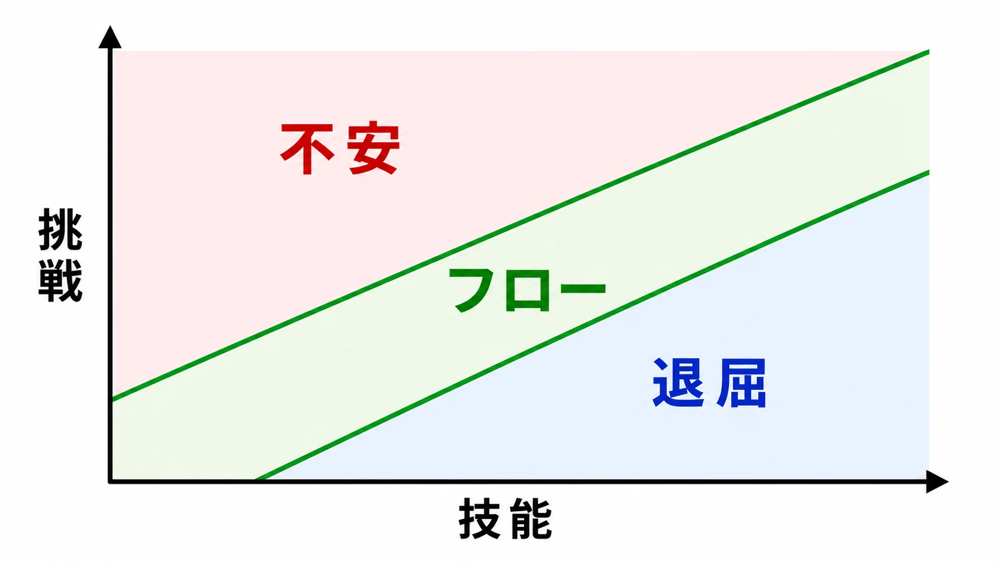
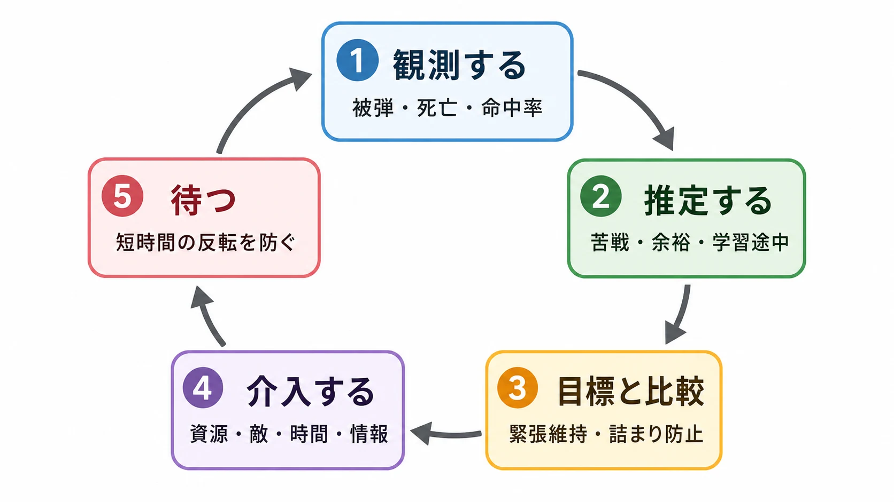
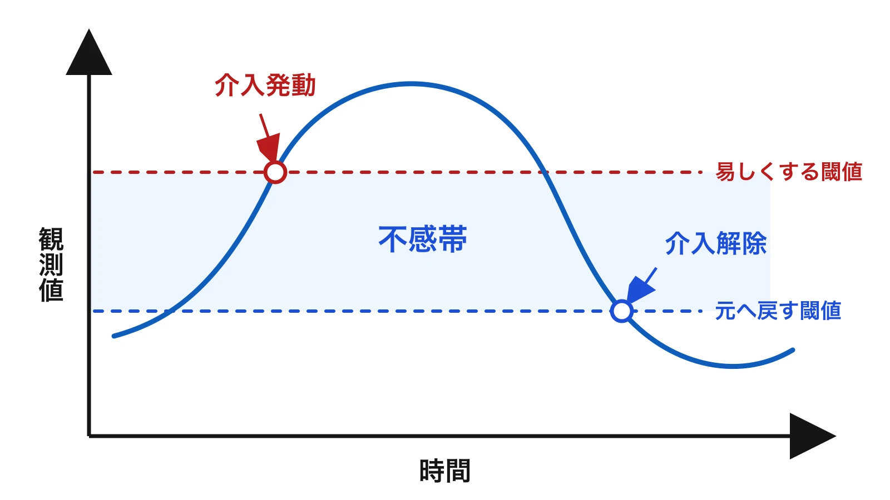
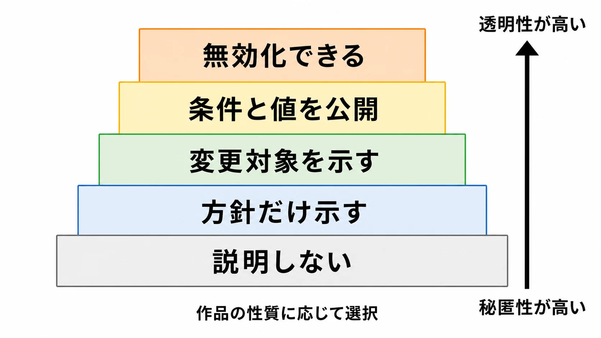

# 難易度設計とダイナミックディフィカルティ――「ちょうどよい挑戦」を壊さず運用する実務

## はじめに――難易度は「敵のHP」ではない

新人プランナーが難易度調整を任されると、まず敵のHPや攻撃力を変えようとしがちだ。しかし、プレイヤーが難しいと感じる理由は一つではない。

- 敵を倒すまでの入力回数が多い。
- 攻撃予兆を読み取る時間が短い。
- 画面上の情報が多く、優先順位を判断しにくい。
- 操作の同時押しや照準精度を要求される。
- 失敗すると長い区間をやり直す。
- 何を間違えたのか分からない。

これらはすべて難しさを生む。つまり難易度設計とは、数値の上下ではなく、 **プレイヤーへ何を、どの精度で、どの時間内に要求し、失敗へどの費用を課すか** を決める仕事である。

本記事では、最初に固定の難易度選択を整理する。そのうえで、プレイヤーの状態に応じて裏側で条件を変えるダイナミックディフィカルティ、以下DDA（Dynamic Difficulty Adjustment）を扱う。

先に結論を言えば、DDAは万能な救済装置でも、プレイヤーを欺く禁じ手でもない。作品が守りたい挑戦と、調整によって失う信頼を比較して採否を決める技術である。

---

## 1. 難易度を分解して考える

難易度は、少なくとも次の軸へ分けられる。

| 軸 | プレイヤーへ要求するもの | 調整例 |
|---|---|---|
| 数値 | ダメージ交換、資源管理、育成量 | 敵HP、被ダメージ、回復量、価格 |
| 認知 | 発見、記憶、状況判断 | 攻撃予兆、目標表示、同時出現する情報量 |
| 操作 | 速さ、精度、複雑な入力 | 入力猶予、照準補助、連打、同時押し |
| 戦術 | ルール理解、優先順位、編成 | 敵の組み合わせ、耐性、AIの選択肢 |
| 時間 | 制限内の判断と実行 | 制限時間、攻撃間隔、ポーズ可否 |
| 損失 | 失敗を受け入れて再挑戦する負担 | チェックポイント、所持品消失、再演出時間 |
| 情報 | 結果から学習する力 | ダメージ表示、失敗理由、再戦前の助言 |

たとえば、敵の攻撃力だけを半分にしても、予兆が見えない人の問題は解決しない。反対に、予兆を長くすれば、敵HPを変えずに攻略可能になる場合がある。

したがって仕様書には「EASYでは敵が弱い」とだけ書かない。どの要求を緩め、作品のどの要求は残すのかを書く。難易度プリセットは、その方針をまとめたパッケージである。

### 難易度とアクセシビリティは重なるが、同じではない

入力の連打を長押しへ変えることや、字幕を読みやすくすることは、障壁を減らす。しかし、必ずしもゲーム内の戦術的な挑戦を下げるわけではない。

MicrosoftのXbox Accessibility Guidelinesは、複数の難易度を用意し、各設定で何が変わるかを説明することを推奨している。さらに、プリセットだけでなく項目ごとの調整も有効だとしている。[[1](#ref-1)] ただし、すべての作品へ同じ設定数を要求する規則ではない。作品の核を守りながら、意図しない障壁を分離するための設計材料と捉えたい。

*画像出典（引用）：Microsoft, [Xbox Accessibility Guideline 108](https://learn.microsoft.com/en-us/gaming/accessibility/xbox-accessibility-guidelines/108) / 複数の難易度と説明文を併記した設定例として引用。WebP変換。*

---

## 2. 静的な難易度選択の強みと限界

イージー、ノーマル、ハードのように、プレイヤーが明示的に選ぶ方式をここでは静的な難易度選択と呼ぶ。途中で変更できても、変更を決める主体がプレイヤーなら、この側に含める。

強みは分かりやすい。

- プレイヤーが自分の望む挑戦を選べる。
- 同じモードなら条件を共有しやすい。
- 攻略、タイムアタック、実績の前提を揃えやすい。
- 何が変わるかを説明しやすい。
- QAで再現条件を固定しやすい。

一方、開始前のプレイヤーは、そのゲームでの自分の腕前をまだ知らない。「アクションゲームは得意」でも、照準中心の作品と回避中心の作品では適性が違う。名称だけでは、ノーマルが想定する経験も分からない。

選び直しにも心理的な負担がある。難易度を下げる操作を「敗北の宣言」と感じる人もいる。逆に、最高難度を選んだまま進めず、作品から離れる人もいる。プレイヤーへ選択権を渡すだけでは、選択の難しさまでは消えない。

実務では、次のような補助が使える。

- 「敵が弱くなる」ではなく、「敵の攻撃頻度が下がる」「照準補助が強くなる」と差分を書く。
- プレイ中の変更と、元へ戻す操作を認める。
- 失敗後に変更を提案しても、自動では確定しない。
- 物語、探索、戦闘などを別項目に分ける。

2023年版『バイオハザード RE:4』の公式マニュアルは、ゲーム開始時に複数モードを説明し、Standardではゲームオーバー画面からAssistedへ変更できるとしている。Assistedで変わる照準補助、弾薬クラフト、体力回復、敵の脅威なども明示される。これは状況に応じた提案ではあるが、最終的にプレイヤーが選ぶため、本記事の狭い定義ではDDAではない。[[2](#ref-2)]

---

## 3. フロー理論は「設計の比喩」として使う

心理学者ミハイ・チクセントミハイは、活動へ深く没入する経験をフローとして論じた。挑戦と技能の釣り合いは、その説明で参照される要素の一つである。原著『Flow: The Psychology of Optimal Experience』は1990年に刊行された。[[3](#ref-3)]

ゲームデザインでは、「挑戦が技能を大きく上回れば不安や苛立ちにつながり、下回れば退屈につながる」という図で紹介されることが多い。難易度曲線を考える入口としては便利だ。

ただし、これを「常にプレイヤーを一本のフロー帯へ入れれば正解」という法則にはしない。

- ホラーは、一時的な無力感や不安を意図して作る。
- 無双型のゲームは、技能が挑戦を上回る爽快感を価値にできる。
- 高難度作品では、停滞後に突破する落差が達成感になる。

さらに、ゲームが観測できるのは入力、被弾、所要時間などであり、プレイヤーの感情そのものではない。挑戦と技能のバランスは判断軸にはなるが、テレメトリから心情を断定する根拠にはならない。

---

## 4. DDAとは何をする仕組みか

DDAは一般に、プレイ中の成績や状態をもとに、ゲーム側が挑戦を動的に変える仕組みを指す。研究上は、変更が見える方式まで含む広い用法もある。本記事ではテーマを明確にするため、 **プレイヤーが毎回選択することなく、気づきにくい形で調整する方式** を狭義のDDAとして扱う。

DDA研究の初期の代表例として、Robin Hunickeは、プレイヤーの能力へ応じてゲーム内システムを変化させる方法を論じた。試作システム「Hamlet」では、戦闘中の死亡確率を推定し、体力などの資源へ介入する実験が行われている。論文は、調整目的、状態推定、介入方法を分けて設計する必要を示している。[[4](#ref-4)]

実装を一つの制御系として見ると、次の循環になる。

1. **観測する** ｜被弾、死亡、命中率、所要時間、資源残量、停滞を記録する。
2. **推定する** ｜苦戦、余裕、学習途中、意図的な稼ぎなどの状態を推定する。
3. **目標と比較する** ｜緊張を保つ、詰まりを防ぐ、練習を促すなど、作品の目標と比べる。
4. **介入する** ｜資源、敵、時間、情報、チェックポイントなどを変える。
5. **待つ** ｜効果を観測し、短時間に反転しないようにする。

難しいのは3番目である。「死亡させない」のか、「ぎりぎりで突破させる」のか、「同じ失敗を学習できるまで再現する」のかで、正しい介入は変わる。DDAは目的を自動で決めてくれない。

また、成績は技能と一致しない。上級者が新しい武器を試している、子どもに操作を渡した、探索のために時間をかけている、といった状況を数値だけで区別するのは難しい。プレイヤーモデルを用いて成績と主観的難易度の関係を予測する研究もあるが、推定はあくまで推定である。[[5](#ref-5)]

---

## 5. 主な実装パターン

### 5-1. 資源を調整する

体力が少ないと回復アイテムを出やすくする。弾薬が枯れた武器種を補う。店の在庫やドロップ候補を変える。こうした供給側の介入は、敵の挙動を突然変えるより因果を隠しやすい。

ただし、資源の乏しさが作品の核なら逆効果になる。サバイバルゲームで弾切れのたびに弾薬が出れば、備蓄する判断が空洞化する。わざと弾を捨てて供給を引き出す攻略も生まれうる。

設計時には次を決める。

- 何を不足とみなすか。現在値か、次の戦闘を含む予測値か。
- 介入した資源をどこへ置くか。不自然な出現にならないか。
- 一度の救済量と、連続介入の上限をどうするか。
- プレイヤーが介入条件を利用しても、経済が壊れないか。

Hamletの研究では、体力、弾薬、武器などの供給と、敵の数、強さ、精度などの需要側を介入対象として整理している。[[4](#ref-4)] これは実装候補の一覧であって、同時に全部を動かす推奨ではない。

### 5-2. 敵の強さや行動を調整する

敵HP、攻撃力、命中精度、同時攻撃数、攻撃間隔、AIが選ぶ行動を変える方式である。画面上の敵が同じなら変更を隠しやすく見えるが、手触りへ直接影響する。

とくに危険なのは、成功への罰に見える調整だ。うまくなるほど敵が入力を読み、攻撃を外すほど敵が待ってくれるなら、上達が攻略の安定へつながらない。プレイヤーは学習結果を予測できず、達成感も比較しにくくなる。

介入は、敵の基礎ルールを変えるより、次の遭遇の編成、増援までの間隔、同時に圧力をかける敵数などへ寄せる方法もある。これなら一回の読み合いを壊しにくい。ただし、同じステージ名でも体験が変わるため、攻略情報との相性は悪くなる。

### 5-3. ペースを調整する

強い敵を弱くするのではなく、高圧の時間と休息の時間を入れ替える方式である。これはDDAと近いが、同じとは限らない。

『Left 4 Dead』のAI Directorについて、Valveの開発講演は、Survivorの被ダメージや戦闘状況から「Intensity」を推定し、脅威の多いBuild Upと、脅威を抑えるRelaxを切り替える仕組みを説明している。敵やアイテムの配置も手続き的に選ばれる。[[6](#ref-6)]

重要なのは、同じ資料が **調整しているのは難易度の振幅ではなく、ペースの頻度である** と明記している点だ。[[6](#ref-6)] AI Directorを「苦戦すると敵が弱くなるDDA」と要約すると、公式説明を越えてしまう。

この境界は実務でも重要である。忙しい時間の後に休ませることと、プレイヤーの能力に合わせて敵性能を下げることでは、守るべきテスト条件が違う。

### 5-4. 追いつき調整を行う

レースや対戦では、先頭と後方の差を縮める仕組みを俗にラバーバンドと呼ぶことがある。速度補正、後方ほど強いアイテムを得やすい抽選、AIの走行目標変更などは、見た目が似ていても別の実装である。

利点は、早い段階で勝負が決まり、残り時間が消化試合になるのを防ぎやすいことだ。初心者を集団へ戻し、最後まで一戦を盛り上げる狙いにも合う。

欠点は、先行する技術の価値が薄く見えることだ。競技性を期待する場では、結果が裏で操作されたという疑念につながりやすい。タイムアタック、ランキング、賞金を伴う対戦では、パーティー向けモードと同じ補正を共有しない方がよい場合もある。

個別タイトルについて「AI車が何％速くなる」などの説明をするには、公式資料、コード解析、再現可能な検証の区別が要る。

### 5-5. 情報と再試行を調整する

数回失敗した後だけヒントを増やす。チェックポイントを近くする。チュートリアルの練習対象を減らす。これらも挑戦へ影響する。

この方式は敵性能を変えず、学習を支えやすい。ただし、答えを発見することが核のパズルでは、早すぎるヒントが体験を奪う。ヒントの段階、表示までの待ち時間、拒否ボタン、再表示の方法を設計したい。

---

## 6. DDAのリスクは「見つかること」だけではない

### 操作されている感覚と達成感

救済が発覚すると、「自力で勝ったのではなく、勝たされた」と感じる人がいる。逆に、好調時に圧力が増えれば、「上達すると罰を受ける」と感じる。

問題は秘密そのものより、プレイヤーが信じていた因果と実際の因果が食い違うことだ。敵の攻撃を覚え、同じ入力なら同じ結果になると期待するゲームほど、この食い違いは大きい。

Hunickeの研究は、調整がプレイヤー体験を損なわずに可能かを実験している一方、プレイヤーが「だまされた」と感じうることを設計上の前提としている。[[4](#ref-4)] 小規模な研究結果を、すべてのジャンルで「気づかれないから問題ない」と一般化してはいけない。

### アクセシビリティと継続性

DDAには、自己申告なしで詰まりを和らげ、物語や協力プレイの流れを保つ利点がある。疲労、経験差、一時的な不調へ滑らかに対応できる場合もある。

しかし、本人が必要とする支援を推定だけに任せるのは危険だ。色覚、入力、認知、聴覚などの障壁は、死亡回数だけでは分からない。DDAがあるから明示的なアクセシビリティ設定を削ってよい、とはならない。

### 噂と検証――DDAは「負けの物語」になりやすい

DDAは裏で動くため、負けた理由を説明する物語としても使われやすい。特許がある、似た挙動を見た、動画で再現した、という情報は、それぞれ証拠の強さが違う。競合調査やコミュニティ対応でこうした情報に接するときは、次のように区別して扱いたい。

| 区分 | 何が確認できているか | 実務での扱い |
|---|---|---|
| (a) 開発者・公式が明言 | 目的、入力、変更対象などを公式資料で説明 | 企画資料やコミュニティ回答で事実として引用できる |
| (b) 解析者が発見 | コード、メモリ、データ、反復試験から挙動を提示 | 解析結果と明記し、対象の版・条件を限定して参照する |
| (c) プレイヤーの考察・噂 | 体感、少数の動画、出典不明の転載 | 事実として扱わない。調査の出発点にとどめる |

(a)であっても、公式が説明した範囲を越えて要約しないことが重要だ。『Left 4 Dead』のAI Directorが調整するのはペースの頻度であり[[6](#ref-6)]、これを「苦戦すると敵が弱くなるDDA」と読み替えれば公式説明を越えてしまう。

特許も同様である。Electronic Artsは、同社がDDA技術の特許を持つ一方、FIFA、Madden、NHLのUltimate TeamではDDAや類似のスクリプトを使用していないと公式に説明している。[[7](#ref-7)] **特許の存在は、特定タイトルへの搭載証拠ではない。** 疑惑が課金や対戦の公平性へ触れる場合ほど、この種の公式説明が求められる場面は増える。

(b)の解析記事を参照する場合は、対象プラットフォーム、バージョン、難易度、オンラインかオフラインか、再現手順を確認する。アップデートで挙動が変われば、過去の解析は現行版の証拠にならない。

### 公平性と説明責任

一人用ゲームでは、同じ人の体験を支える調整として受け入れられる余地がある。協力ゲームでは、チーム全体への調整か、個人だけへの支援かで評価が変わる。対人戦では、勝敗、レート、報酬へ影響するため、疑念の費用が大きい。

競争モードで使うなら、少なくとも次を検討する。

- 全員へ同じ条件か。
- マッチメイキングと試合中補正を混同させない説明ができるか。
- ランキングや大会では無効化できるか。
- リプレイや監査ログから結果を説明できるか。
- 課金や報酬が絡む場で、意図的な不利を疑わせないか。

技術的に公平でも、検証不能なら信頼を失うことがある。透明性は仕様公開の量だけでなく、プレイヤーが結果を納得できる構造でもある。

---

## 7. 実務で決めるべき設計方針

### 7-1. まず「変えてはいけないもの」を決める

DDAのパラメータ表を作る前に、作品の契約を言語化する。

- ボスの攻撃パターンは全員共通にする。
- パズルの正解条件は変えない。
- 敵の命中判定や入力受付はプレイ中に変えない。
- ランク戦では試合中補正を使わない。
- 救済は資源と再試行時間だけに限定する。

高難度を売りにする作品でも、すべてを固定する必要はない。長い再走だけを短縮し、敵の学習は同じ条件で続ける選択もある。反対に物語の連続性が中心なら、戦闘圧力を広く調整する判断もありうる。

### 7-2. 明示設定と裏の調整を分担する

次のように役割を分けると整理しやすい。

| 明示設定に向くもの | 裏の調整を検討できるもの |
|---|---|
| 操作方法、照準補助、字幕、ゲーム速度 | 一時的な資源不足の緩和 |
| 敵HPや被ダメージの大きな差 | 遭遇間の休息時間 |
| パズルのヒント量 | 次に出す敵編成の候補 |
| 実績やランキングに影響する条件 | 失敗後の任意ヒント提案 |
| プレイヤーの尊厳や好みに関わる支援 | 体験を壊さない範囲の小さな補正 |

これは固定ルールではない。判断の中心は、変更がプレイヤーの自己決定、攻略の再現性、作品の作家性へどれだけ影響するかである。

### 7-3. 調整の刻みとヒステリシスを設ける

観測値へ即座に反応すると、難易度が上下に振動する。1回被弾しただけで回復が増え、回復した瞬間に敵が強くなる設計は不自然だ。

そこで、閾値を越えた状態が一定時間続いたら介入する。易しくする閾値と元へ戻す閾値を別にする。この戻りにくさを、制御設計ではヒステリシスと呼ぶ。

実装では次をデータ化する。

- 観測窓｜直近何秒、何戦、何回の再試行を見るか。
- 閾値｜どの状態を苦戦、余裕とみなすか。
- 刻み｜1回にどれだけ変えるか。
- クールダウン｜次の介入までどれだけ待つか。
- 上下限｜どこから先は変えないか。
- 復帰条件｜いつ基準値へ戻すか。
- 除外区間｜ボス、チュートリアル、イベント戦で止めるか。

値をコードへ直書きせず、変更履歴と担当者を追える調整データにする。セーブへ何を保持するかも決める。ロードで毎回推定が初期化されるなら、再試行時だけ挙動が変わることがある。

---

## 8. 動く難易度をどうテストするか

DDAは入力の組み合わせが多い。通常の通しプレイだけでは、同じ状態を再現しにくい。

### 観測・判断・介入をログへ分ける

最低限、次を同じ時刻で記録する。

- 観測値｜死亡、被弾、命中、資源、経過時間。
- 推定値｜現在の苦戦度、信頼度、参照した期間。
- 判断｜どのルールが発火したか。
- 介入｜変更前後の値、対象、継続時間。
- 結果｜突破、再死亡、離脱、設定変更。

「敵が急に強くなった」という不具合報告へ、担当者の体感だけで答えないための土台になる。

### 状態を注入できるデバッグ機能を作る

QAが100回死亡して条件を作る必要はない。苦戦度、資源、連敗数を任意に設定し、各介入を単独で発火できるようにする。固定乱数、敵編成の固定、DDAの完全無効化も用意する。

比較すべきテストは次の三つである。

1. 基準状態で、固定難易度の品質が成立するか。
2. 介入状態で、狙った問題だけが緩和されるか。
3. 復帰後に、値や体験が不自然に跳ねないか。

DDAを切った状態が壊れているなら、DDAがバランス不良を隠しているだけかもしれない。

### 悪用するプレイも試す

わざと被弾する、弾薬を捨てる、直前でロードする、低成績を作ってからボスへ入る。プレイヤーがルールを学習すれば、DDA自体が攻略対象になる。

悪用を完全に防ぐ必要はない。一人用ゲームでは、それを本人の遊び方として許容できる。ただし、経済、ランキング、報酬、他プレイヤーへ影響するなら、上限やモード分離が必要になる。

---

## 9. 仕組みを公表するか

公表には段階がある。

- 調整の存在も説明しない。
- 「体験に応じて一部の遭遇を調整する」と方針だけ示す。
- 変更対象を示すが、閾値は示さない。
- すべての条件と値を公開する。
- オプションで無効化できるようにする。

秘密にすれば、演出上の驚きと滑らかさを守りやすい。公開すれば、自己決定と検証可能性を高められる。ただし、細かな条件の公開は、数字を操作する遊びへ変えることもある。

判断では、次の問いが役立つ。

- プレイヤーは同じ条件で技能を測ることを期待するか。
- 調整を知っても作品の緊張は保てるか。
- 誤解が広がったとき、公式にどこまで説明できるか。
- 無効化すると品質が成立しない設計になっていないか。
- 対戦、課金、ランキングに影響するか。
- アクセシビリティ上、本人が選ぶべき設定を隠していないか。

「気づかれなければよい」だけでは、発覚後のコミュニケーションを設計できない。発売前に、パッチノート、サポート回答、配信者からの質問まで想定しておきたい。

---

## おわりに――DDAは難易度設計の代わりにならない

難易度は、敵の強さだけではない。情報、操作、時間、戦術、失敗の損失、学習の手がかりが組み合わさって生まれる。まず固定状態で、それぞれの要求を説明できるようにする必要がある。

DDAは、その上でプレイヤーの状態を観測し、資源、敵、ペース、情報、再試行へ小さく介入する選択肢である。詰まりを減らし、体験の連続性を守れる。一方で、因果の予測、達成感、公平性、透明性を損なう場合もある。

大切なのは「隠すか、公開するか」を先に争うことではない。作品が守る挑戦を定義し、何を観測し、何を変え、どこでは変えないかを決める。そのうえで、明示設定、任意の支援、裏側の調整を分担させる。

DDAは万能の解決策でも、隠すべき禁じ手でもない。 **プレイヤーへどのような挑戦を約束するか** によって、価値と危険が変わる実装手段の一つである。

---

## References

1. [Xbox Accessibility Guideline 108][1] - 複数の難易度、設定差分の説明、項目ごとの調整など、ゲーム難易度オプションの設計・テスト観点を示すMicrosoft公式ガイドライン。

2. [Game Modes｜Resident Evil 4 Official Web Manual][2] - 2023年版『バイオハザード RE:4』の難易度モード、Assistedで変わる要素、Standardのゲームオーバー画面からの変更を説明するCapcom公式マニュアル。

3. [Flow: The Psychology of Optimal Experience][3] - Mihaly Csikszentmihalyiによるフロー研究の原著。1990年刊行の書誌情報。

4. [The Case for Dynamic Difficulty Adjustment in Games][4] - Robin HunickeがDDAの設計制約、調整目標、状態推定、資源や敵への介入、試作システムHamletの評価を報告した研究。

5. [A Temporal Data-Driven Player Model for Dynamic Difficulty Adjustment][5] - プレイヤーの成績を時間軸で予測し、主観的な難易度との関係を検討したAAAI AIIDE論文。

6. [The AI Systems of Left 4 Dead][6] - AI Directorによる敵・アイテム配置とIntensityに基づく適応的ペース制御を説明し、難易度の振幅ではなくペースの頻度を調整すると明記したValve開発講演資料。

7. [公平なプレイ&動的難易度調整][7] - DDA技術の特許保有と、FIFA、Madden、NHLのUltimate Teamでの不使用を区別して説明するElectronic Arts公式声明。

[1]: https://learn.microsoft.com/en-us/gaming/accessibility/xbox-accessibility-guidelines/108
[2]: https://game.capcom.com/manual/re4/en/ps5/page/1/2
[3]: https://search.worldcat.org/title/Flow-%3A-the-psychology-of-optimal-experience/oclc/61034940
[4]: https://doi.org/10.1145/1178477.1178573
[5]: https://doi.org/10.1609/aiide.v8i1.12504
[6]: https://steamcdn-a.akamaihd.net/apps/valve/2009/ai_systems_of_l4d_mike_booth.pdf
[7]: https://www.ea.com/ja-jp/news/fair-play-and-dynamic-difficulty-adjustment

----

この文書は、Perplexity、Claude、OpenAI Codex の3つのAIの支援を受けて著述されたものです。引用画像を除き、MIT License にて提供されています。
