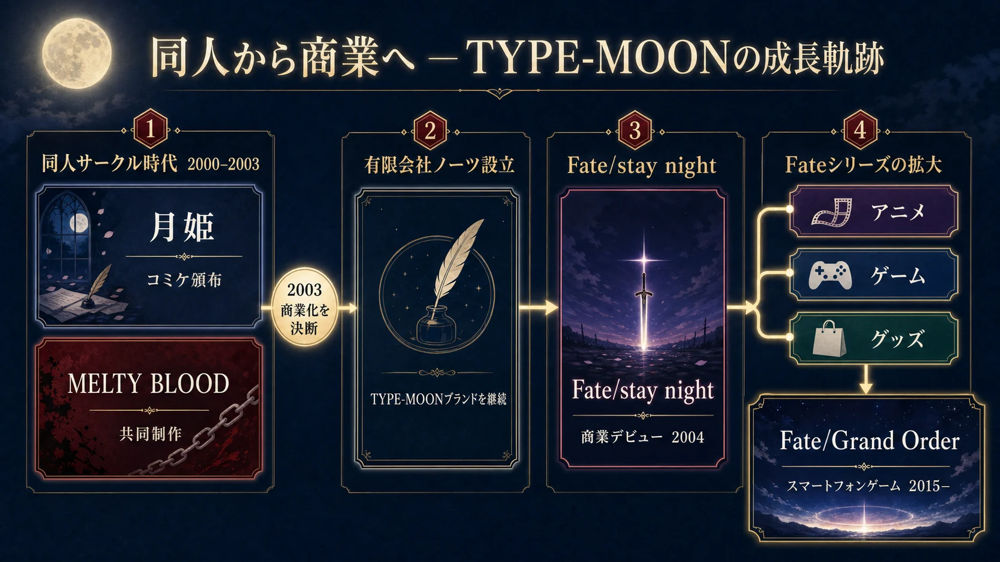

# 同人ゲームの系譜：日本のコミックマーケット文化が育てたゲームたち

***

## はじめに：同人ゲームとは何か

「同人ゲーム」とは、個人や小規模なサークルが自主制作・頒布するゲームの総称である。商業ゲームとの最大の違いは、 **利益よりも「作りたいものを作る」という表現の動機が先行する点** にある。コミックマーケット（通称：コミケ）準備会が理念として掲げる「コミックマーケットは同人誌を中心としてすべての表現者を許容し継続することを目的とした表現の可能性を広げる為の『場』である」という一文が、そのままこの文化の核心を表している。[[1](#ref-1)][[2](#ref-2)]

同人ゲームは「インディーゲーム」と混同されることも多いが、文化的ルーツが異なる。本レポートでは、欧米インディーゲームとは独立した文脈として、日本独自の同人誌文化・コミケから育まれたゲームの歴史を体系的に整理する。特に東方Project、月姫（TYPE-MOON）、黄昏フロンティア、ひぐらしのなく頃にを中心事例として取り上げ、各作品がどのように誕生し、発展し、文化的影響を及ぼしてきたかを分析する。

***

## 第1章：前史——PC-98時代と同人ソフトの揺籃期（1980年代〜1990年代）

### 1-1. パソコン雑誌から生まれた自主制作文化

日本における自主制作ゲームの歴史は、1980年代前半まで遡る。当時は「マイコンBASICマガジン」や「I/O」といった月刊誌にゲームのプログラムコードがそのまま掲載され、読者が手入力することで作品と技術を共有するスタイルが主流だった。フロッピーディスクが普及した80年代中盤以降、自作ゲームを簡易なパッケージにしてコミケで手売りしたり、PC雑誌の通販コーナーで告知したりする流通形態が生まれた。[[3](#ref-3)]

1988年には「パソケット」という同人ソフト専門イベントが開催され、最盛期の1990年代初頭には東京・名古屋・大阪で隔月開催、ソフマップなどの大手販売店も同人ソフトを取り扱うようになった。この時期、400以上の同人サークルが活発に活動し、店に販売を委託しながら各地のイベントを渡り歩いて生計を立てる同人ソフト作家も誕生した。[[3](#ref-3)]

### 1-2. ブームの終焉とコミケへの収束

しかし1990年代後半、Windows PCの普及によってMS-DOS/PC-98時代の開発技術が断絶し、行き過ぎた商業主義による粗製乱造とも相まって、同人ソフトブームは急速に収束した。コミケでの同人ソフト活動は有志によって細々と続くことになり、この「底谷」の時期に、のちに日本を代表する同人ゲームIPの種が静かに蒔かれた。東方Projectと月姫は、いずれもこの時期に生まれた作品である。[[4](#ref-4)][[3](#ref-3)]

***

## 第2章：年代別発展——1990年代から2010年代の変遷

### 1990年代：PC-98という土壌での発芽

| 出来事 | 内容 |
|--------|------|
| 1993年頃 | 同人ソフトブームが収束、PC-98での制作が続く[[3](#ref-3)] |
| 1996年 | 東方靈異伝（ZUN Soft名義）が東京電機大学の学園祭で発表[[5](#ref-5)] |
| 1997〜98年 | 東方封魔録・夢時空・幻想郷・怪綺談（PC-98五部作の完成）[[5](#ref-5)] |
| 1998年 | ZUNが就職に伴い東方の制作を一旦停止[[5](#ref-5)] |
| 2000年 | TYPE-MOONが同人サークルとしての活動を本格化。12月のコミケ59で月姫を頒布[[6](#ref-6)][[7](#ref-7)] |

ZUNが東京電機大学在学中に制作したPC-98版東方Projectは、1996年に「ZUN Soft」名義で第一作『東方靈異伝』を発表したのが始まりである。当初は縦スクロール弾幕シューティングではなく「ブロック崩し」に近いアクションゲームだったが、翌97年の第二作『東方封魔録』で現在の弾幕シューティング形式が確立された。この時期の東方Projectはほぼ同人コミュニティの内輪での頒布であり、広範な認知には至っていなかった。[[5](#ref-5)]

### 2000年代前半：「奇跡の3タイトル」の登場

| 年 | 作品・出来事 | サークル |
|----|-----------|--------|
| 2000年12月 | 月姫コミケ59頒布[[6](#ref-6)] | TYPE-MOON |
| 2002年 | 東方紅魔郷リリース（Windows移行）[[5](#ref-5)] | 上海アリス幻樂団 |
| 2002年夏 | ひぐらしのなく頃に（鬼隠し編）コミケ発表[[8](#ref-8)] | 07th Expansion |
| 2002年12月 | MELTY BLOOD（月姫格闘ゲーム）コミケ発表[[9](#ref-9)] | TYPE-MOON×渡辺製作所 |
| 2003年 | TYPE-MOON、有限会社ノーツを設立し商業化[[7](#ref-7)] | — |
| 2004年1月 | Fate/stay night 商業デビュー[[10](#ref-10)] | TYPE-MOON（商業化後） |

この時期が、日本同人ゲーム文化の「第一次黄金期」である。月姫・東方・ひぐらしの三作はいずれも口コミやウェブコミュニティを通じて爆発的に広まり、同人ゲームを代表する存在としてしばしば並び称される。

**東方Projectのプラットフォーム転換** が特に重要だ。ZUNは2002年にサークル名を「上海アリス幻樂団」と改めてWindowsへ移行し、第6作『東方紅魔郷』を発表した。「スペルカードルール」という概念の導入によって、敵の攻撃パターンにドラマ性と美しさが付加され、弾幕は「攻略対象」から「観賞対象」へと昇華された。このデザイン哲学は、二次創作の爆発的増加を生む土壌となった。[[11](#ref-11)][[5](#ref-5)]

**月姫** は2000年12月のコミケ59で頒布された奈須きのこ脚本・武内崇グラフィックのビジュアルノベル。重厚な世界観と巧みなシナリオがファンの心を掴み、TYPE-MOONは2003年に有限会社ノーツを設立して商業化へ移行した。[[6](#ref-6)][[7](#ref-7)]

**ひぐらしのなく頃に** は2002年夏のコミケ62で「鬼隠し編」が発表されたサウンドノベル。竜騎士07が一人で制作した同作は、選択肢なしの一本道シナリオで村の連続怪死事件を描き、謎が謎を呼ぶ構成でプレイヤーを虜にした。[[12](#ref-12)][[8](#ref-8)]

### 2000年代後半：ニコニコ動画と二次創作の大爆発

| 年 | 出来事 |
|----|------|
| 2006年4月 | ひぐらし原作のテレビアニメ放送開始[[13](#ref-13)] |
| 2006年末 | ニコニコ動画サービス開始 |
| 2007年 | 東方風神録リリース（第10作・新規ファン獲得）[[5](#ref-5)] |
| 2008年頃 | ニコニコ動画で東方アレンジ音楽が「御三家」の一角に[[5](#ref-5)] |

ニコニコ動画の登場は東方Projectにとって「最強の加速装置」となった。IOSYSの「魔理沙は大変なものを盗んでいきました」などのFlash・アレンジ楽曲作品が、ゲームを遊んだことがない層にまでキャラクターを浸透させた。コミケにおける東方ジャンルのサークル数は爆発的に増加し、二次創作の生態系がゲームの枠を大きく超えた。[[5](#ref-5)]

ひぐらし原作がアニメ化（2006年）されたことで、同人ゲームがアニメというメインストリームメディアへ到達する先例が確立された。これはのちの同人→メディアミックスの商業的ルートを開くモデルケースとなった。[[13](#ref-13)]

### 2010年代：Steam・DLsiteによる流通革命と国際化

| 年 | 出来事 |
|----|------|
| 2010年代 | DLsiteなどダウンロード販売による同人ゲームのデジタル流通が拡大[[14](#ref-14)] |
| 2017年 | 東方天空璋がSteamで配信開始、東方Projectが世界展開へ[[15](#ref-15)] |
| 2019〜2020年 | 東方キャノンボール・東方LostWordなど公認二次創作スマホゲームが登場[[16](#ref-16)] |
| 2021年 | 東方憑依華がNintendo Switch/PS4に登場（黄昏フロンティア制作）[[17](#ref-17)] |
| 2026年9月 | 東方紅魔郷：New Classic がSwitch/Switch 2/PS5/Steamで発売予定[[18](#ref-18)] |

2017年のSteam配信は、東方Projectにとって文字通りの転換点だった。それまで物理CDメディアでしか入手できなかったゲームがデジタル配信され、海外のファンが一気に流入した。ZUNはこの決断の背景として、Steamの基準緩和とSteam Directの影響を挙げている。DLsite（全世界会員数900万超）の成長も同人ゲームの流通を根本的に変え、コミケ会場に行かなくてもプレイできる環境が整った。[[14](#ref-14)][[15](#ref-15)][[3](#ref-3)]

***

## 第3章：主要作品の詳細分析

### 東方Project——「一人の宇宙」が生んだコンテンツ帝国

#### サークル構造と制作体制

上海アリス幻樂団は、1977年生まれのZUN（本名：太田順也）が主宰する個人サークルである。シナリオ・プログラミング・キャラクターデザイン・サウンドに至るまで、ゲーム制作に必要な大半の工程をZUN一人が担う。整数タイトル（本編）はZUNが一人で制作しており、外部の制作者が関わるのは一部の「小数点タイトル」に限られる。[[19](#ref-19)][[11](#ref-11)]

この「完全な個人制作」という体制が東方Projectの独自性の核であり、2026年現在に至るまで30年間、一度もその原則が揺らいでいない。2026年6月には『東方紅魔郷：New Classic』発表に際し、コンソール対応作業のために新サークル「上海アリスReprise」を設立したが、「上海アリス幻樂団」としての本来の活動は変わらずに継続されると発表された。[[20](#ref-20)]

#### 二次創作エコシステムの設計

東方Projectの真の革新性は、ゲームそのものよりも **二次創作エコシステムの設計** にある。ZUNは比較的自由度の高いガイドラインを設定し、個人・同人サークルの範囲内であれば営利目的の二次創作活動を認めている。これにより、音楽アレンジ、漫画、小説、ゲーム、コスプレ、MMD動画など多様な派生作品が合法的に生まれ、コミケにおける東方ジャンルのサークル数は、2010年代にはジャンル別1位となるほどの規模に達した。[[21](#ref-21)][[22](#ref-22)]

2018年には、ドワンゴの「ニコニコ書籍」とブックウォーカーの「BOOK☆WALKER」を東方二次創作の公認電子書籍流通プラットフォームとする取り組みが始まり、BOOTHでも公式の東方タグを商品に付与することで二次創作ゲーム・音楽を合法的に販売できる体制が整えられた。同人コミュニティの活動成果が正規の商流に乗るこの仕組みは、知的財産管理の先進的モデルとして注目される。[[23](#ref-23)][[24](#ref-24)]

#### コンソール初登場：東方紅魔郷 New Classic（2026年）

2026年6月9日のNintendo Directで発表された『東方紅魔郷：New Classic』は、東方Projectにとって複数の「初めて」が重なる歴史的作品である。[[25](#ref-25)]

- **東方初の公式リメイク**
- **東方原作のコンソール初登場** （Nintendo Switch / Switch 2 / PS5）
- **ZUN本人による全曲再編曲**
- 配信日：2026年9月10日（ダウンロード配信。販売はアライアンス・アーツが担当）[[26](#ref-26)][[27](#ref-27)]
- 価格：通常版1,990円 / デラックス版2,966円（税込）[[27](#ref-27)]
- 11言語対応（日・英・仏・伊・独・西・葡・露・韓・中（簡体字/繁体字））[[25](#ref-25)]

24年ぶりに公式リメイクとして生まれ変わるこの作品は、PCがなくても遊べる環境を世界中のプレイヤーに提供し、東方Projectの国際展開をさらに加速させる。[[25](#ref-25)]

***

### 月姫とTYPE-MOON——同人から商業帝国へのロールモデル

#### 商業化のプロセス

TYPE-MOONは1999年に武内崇を中心に結成され、2000年から2003年にかけて同人サークルとして活動した。[[7](#ref-7)] 奈須きのこ（シナリオ）と武内崇（グラフィック）を中心としたサークルは、月姫でビジュアルノベルの可能性を示した後、月姫格闘ゲーム『MELTY BLOOD』（渡辺製作所との共同制作）をコミケ63で発表した。[[28](#ref-28)][[9](#ref-9)]

歌月十夜とメルブラが一段落した段階で、サークルは次回作『Fate/stay night』で実現したい内容とクオリティを同人の制約下で達成するのは難しいと判断し、商業化を決意。2003年に有限会社ノーツを設立し、TYPE-MOONはブランド名として継続された。2004年1月30日にリリースされた『Fate/stay night』は商業デビュー作となり、その後テレビアニメ化（2006年）・劇場アニメ化（2010年）へと展開した。[[29](#ref-29)][[30](#ref-30)][[7](#ref-7)][[28](#ref-28)]

月姫リメイク版『月姫 -A piece of blue glass moon-』は2021年にPS4/Nintendo Switchでリリースされ、同時期に最新の格闘ゲーム『MELTY BLOOD: TYPE LUMINA』もコンソール展開した。約20年を経て、同人時代の原点作品が商業プロダクトとして完全リニューアルされたことは、TYPE-MOONの商業化の成功が同人文化の価値を否定したのではなく、同人時代に築いた世界観の深さが商業展開の礎であることを証明している。[[31](#ref-31)][[32](#ref-32)]

***

### 黄昏フロンティア——東方エコシステムの「設計者」

黄昏フロンティアは、主にWindows用ゲームを制作する同人ゲームサークルである。その特徴は「オリジナルではなく版権物を題材とした二次創作を主とし、元ネタとは異なるジャンルアレンジをほどこす作風」にある。具体的には、弾幕シューティングゲームである東方Projectを格闘ゲームやアクションゲームに変換するという、ジャンル横断的なアプローチが特色だ。[[33](#ref-33)]

#### 主要作品一覧

| タイトル | ジャンル | 概要 |
|---------|--------|------|
| 東方萃夢想（2004年） | 2D対戦格闘 | 東方格闘ゲーム第1弾。上海アリス幻樂団との共同制作 |
| 東方緋想天（2008年） | 2D対戦格闘 | 天候システムを導入した格闘ゲーム第2弾 |
| 東方非想天則（2009年） | 2D対戦格闘 | 緋想天のアペンドディスク的性格を持つ拡張作 |
| 東方心綺楼（2013年） | 弾幕アクション | ストーリーモードを強化 |
| 東方深秘録（2015年） | 弾幕アクション | 新キャラクター多数追加 |
| 東方憑依華（2017年） | 2D対戦弾幕アクション | 「完全憑依」システムの導入 |
| 東方剛欲異聞（2021年） | 横画面弾幕水アクション | ジャンル転換の意欲作。2019年に体験版、2021年に製品版を頒布 |

黄昏フロンティアが制作した格闘ゲームシリーズは、いずれもZUN本人の監修・協力を得た公式的な二次創作として展開された。2021年には東方憑依華がNintendo Switch/PS4向けにコンソール移植され、東方Project関連作品のコンソール展開の先行例となった。この実績が、2026年の『東方紅魔郷：New Classic』コンソール展開への道筋を整えたとも言える。[[17](#ref-17)]

黄昏フロンティアの存在は、東方Projectのエコシステムにおいて不可欠な「ジャンル拡張機能」を果たしている。原作が弾幕シューティング一辺倒にとどまらず、格闘・アクション・パズルなど多様なプレイヤー層を取り込めた背景には、このサークルによる公認派生作品の継続的な供給があった。

***

### ひぐらしのなく頃に——口コミ伝播とメディアミックスの教科書

#### 制作体制：一人のビジョン、最小限のリソース

07th Expansionは、竜騎士07（1973年生まれ）が代表を務める同人サークルである。ひぐらしのなく頃には、竜騎士07がシナリオ・プログラム・グラフィック（粗い手書きキャラクター絵）・音楽（フリー素材使用）を一人で担当した状態でコミケ62に発表された。当初のグラフィッククオリティはお世辞にも高いとは言えなかったが、そのシナリオの独創性と謎への引きが口コミで爆発的に広まった。[[8](#ref-8)][[34](#ref-34)]

「選択肢も分岐もない一本道シナリオ」でミステリー・ホラーを構築するという手法は、ゲームのインタラクティビティを逆手にとった発明といえる。プレイヤーは「謎を解く」のではなく「謎に問われる」という受動的かつ能動的な体験をし、真相を求めて次の章をコミケで買い求めた。2002年夏から2006年夏にかけて全8編が頒布されるという連続刊行形式は、読者をコミケに通わせ続けるサブスクリプション的な引力を持っていた。[[12](#ref-12)][[8](#ref-8)]

#### 商業化と広がり

ひぐらしのなく頃には、アニメ化（2006年）を皮切りに漫画化・小説化・実写映画化・舞台化など多方面に展開した。2020〜2021年にはパッショーネが制作した完全新作シリーズ『ひぐらしのなく頃に業・卒』が放送され、20年以上にわたってコンテンツとして生き続けている。07th Expansionは現在も同人サークルとしての活動を維持しながら、竜騎士07名義での商業展開も並行して行っている。[[34](#ref-34)][[35](#ref-35)][[13](#ref-13)]

***

## 第4章：商業化プロセスの比較分析

各作品の商業化プロセスをサークル構造と合わせて整理すると、大きく3つのパターンに分類できる。

| パターン | 代表例 | 特徴 |
|--------|-------|------|
| **完全商業移行型** | TYPE-MOON → ノーツ社 | 同人ブランドを残しつつ法人化し、商業ゲームへ完全移行 |
| **同人維持・公認展開型** | 東方Project（ZUN） | 原作者は同人スタイルを維持したまま、二次創作・コンソール移植は他者や新サークルが担当 |
| **IP商業展開型** | 07th Expansion（ひぐらし） | 原作同人を保持しながら、IPとしてアニメ・漫画・ゲームの商業展開を許諾 |

**TYPE-MOONの完全商業移行** は最も劇的なケースで、同人時代のコアクリエイター（奈須・武内）がそのまま商業スタジオを構成した。同人と商業の橋渡しをする際、「世界観の一貫性」と「クリエイターの独立性」を確保したことが長期的な成功の鍵となった。FGO（Fate/Grand Order）が2015年にスマホゲームとして展開されたことで、TYPE-MOONは商業的に大きな成功を収めている。[[36](#ref-36)][[7](#ref-7)]

**ZUNの戦略は対極的** だ。30年にわたり個人制作スタイルを維持し、法人化も商業展開もしない。しかし二次創作には寛容なガイドラインを設け、二次創作コミュニティの経済活動を認めることで「東方経済圏」を形成した。2026年の東方紅魔郷New Classic発売も、ZUN自身は「上海アリスReprise」という新サークルを通じて行い、同人の文脈を崩さない姿勢を貫いている。[[21](#ref-21)][[20](#ref-20)]

***

## 第5章：コラム——インディーゲームと同人ゲーム、2つの独立精神

同人ゲームとインディーゲームは、どちらも「大手パブリッシャーから独立したゲーム」という点で共通するが、その文化的文脈と指向性は異なる。[[37](#ref-37)][[1](#ref-1)]

### 起源の違い

**インディーゲーム（欧米）** は、シェアウェア文化とゲーム開発の民主化から生まれた。1980年代の「自作ゲームをオンラインで配布する」という発想が発展し、2000年代後半のSteam台頭とともに「商業リリースを前提とした小規模制作」という現在の形が定着した。主にプラットフォームの独立性（パブリッシャーから独立）が概念の核にある。[[38](#ref-38)][[39](#ref-39)][[37](#ref-37)]

**日本の同人ゲーム** は、コミケという「場」の文化から生まれた。「趣味のアウトプットを仲間と共有する」という同人誌の精神が、ゲームにも適用された形であり、コミュニティへの参加意識と二次創作の土壌が強く作用する。[[2](#ref-2)][[40](#ref-40)]

### 傾向の比較

| 観点 | インディーゲーム（欧米中心） | 同人ゲーム（日本中心） |
|-----|---------------------------|------------------|
| **一次/二次創作** | 一次創作が主流 | 二次創作が文化的に重要[[40](#ref-40)] |
| **商業志向** | 商業リリース・利益回収が前提に近い[[39](#ref-39)] | 「頒布」文化。利益は副次的[[1](#ref-1)] |
| **コミュニティ** | ゲームジャム・Kickstarterなどプロジェクト単位[[37](#ref-37)] | コミケ・即売会というリアルの場が核[[2](#ref-2)] |
| **IPの扱い** | 基本的に自社IP | 他者IPの同人的利用が文化的に許容[[21](#ref-21)] |
| **流通** | Steam・App Store等デジタル配信が主[[41](#ref-41)] | コミケ頒布→DLsite→Steamと段階的に拡張[[3](#ref-3)][[14](#ref-14)] |
| **成功の定義** | 販売本数・収益 | ファンコミュニティの形成・継続 |

### 交差点：Steamがつないだ2つの文化

2017年以降、東方Projectや黄昏フロンティア作品がSteamで配信されたことで、「同人ゲーム」と「インディーゲーム」の流通的な境界は薄れつつある。DLsite・BOOTH・Steamといったプラットフォームは、もはや同人とインディーを区別しない。[[15](#ref-15)]

しかし文化的アイデンティティとしての差異は残る。日本の同人ゲームには「コミケに参加する」「同人誌即売会に持っていく」という物理的な行為と紐付いた自己表現の色彩が今なお残り、欧米インディーにはスタートアップ的な独立精神と事業化志向が根強い。ゲームプランナーにとって重要なのは、この違いがユーザーとの関係性の設計にも現れている点だ。同人ゲームのクリエイターはプレイヤーと「仲間」として向き合い、インディーデベロッパーは「顧客」に対してバリュープロポジションを提示する——この設計思想の差が、マネタイズモデルやコミュニティ戦略の根本的な違いを生んでいる。

***

## 第6章：同人ゲームが与えた業界への影響

### ジャンル・デザインの革新

東方Projectの「スペルカード」システムは、弾幕を単なる障害から「演出と攻略が融合したアート」へと変貌させた。この発想は、後のシューティングゲーム設計に少なくない影響を与えている。ひぐらしの「選択肢なしのサウンドノベル」は、インタラクティビティを最小化することで物語没入感を最大化する逆説的な設計として評価され、ADV・ビジュアルノベルジャンルに新たな方向性を示した。[[5](#ref-5)]

### 「一人制作」の可能性の実証

ZUNの東方Project、竜騎士07のひぐらしのなく頃には、いずれも一人の人間が世界観・シナリオ・グラフィック・音楽（または主要要素）を担当しながら巨大なIPを生み出した実例である。これは「ゲームは大規模チームで作るもの」という常識に対する反証であり、のちのインディーゲーム開発ツール（Unity、Godot、RPGツクールMV）の普及とともに、個人制作ゲームへの社会的評価を高めた。[[38](#ref-38)]

### DLsiteとデジタル流通市場の拡大

同人ゲームがDLsiteを通じてデジタル配信されるようになったことで、コミケに行けない地域のプレイヤーにもリーチできるようになった。DLsiteは2020年度に250億円の売上を記録、2022年時点で全世界会員数900万超となり、同人コンテンツの経済的なエコシステムは国内最大のデジタル販売プラットフォームの一つとして確立された。[[42](#ref-42)][[14](#ref-14)]

***

## おわりに：「場」が育てる文化

コミックマーケットが1975年に始まった最初の会場に集まったのは、32サークル・推定約700人だった。[[43](#ref-43)][[44](#ref-44)] 半世紀を経た今、同イベントは年2回開催され、近年では1回の開催に約30万人が参加する世界最大の同人誌即売会へと成長し、その「場」から生まれた東方Project・月姫・ひぐらしのなく頃には、日本のポップカルチャーに消えることのない足跡を残した。[[44](#ref-44)][[43](#ref-43)][[40](#ref-40)]

これらの作品に共通するのは、完成度の高さもさることながら、 **「余白の豊かさ」** である。設定が緻密でありながらあえて語り尽くさないことで、プレイヤーや読者が自らの想像で補完し、それが二次創作となり、コミュニティの熱量となった。ZUNが「東方Project」でやったことは、ゲームを作ることではなく「参加できる宇宙を作ること」だったとも言える。[[45](#ref-45)]

ゲームプランナーにとってこれらの事例が示唆するのは、「完璧な完成品」ではなく「参加の余地を持つ未完のシステム」こそが、長期的なコミュニティと文化的生命力を生む、ということかもしれない。

***

本レポートは、2026年6月現在入手可能な情報をもとに作成した。東方紅魔郷New Classicの詳細はまだ発売前のため、今後の情報に注意されたい。

---

## References

1. [同人ゲームの世界と可能性とは？クリエイターが知っておくべき ...][1] - 同人誌即売会は、同人ゲームの文化が発展してきた歴史的なプラットフォームです。コミックマーケット（コミケ）などの同人イベントでは、作者がブース ...

2. [[PDF] コミックマーケットとは何か？][2] - 今後も、コミケットは同人文化の発展に寄り添い、それを取り巻く環境の変化. に対応し、恒久的な継続を目指します. ▫. コミケットは、いかなる状況になろうとも、表現の ...

3. [インディゲームとは？～第5回 国内同人ソフトの歴史][3] - その後も、コミケットでの同人ソフト活動は有志によって細々と続いていました。 現在でも国産同人ソフトとして広く知られる「東方プロジェクト」や「月姫 ...

4. [インディーズゲームが「同人ソフト」だった時代][4] - この80年代後半から90年代前半にかけて、同人ソフトブームがあったのは間違いない。その後、1994年の『テクノポリス』休刊、Windows95のリリースによる ...

5. [【解説】東方Project 30年史 ― 幻想郷の誕生から世界現象への全記録][5] - 6.2 2017年：Steam配信という大転換. 東方Projectの歴史において、2017年は「鎖国が終わった年」として記憶されるだろう。これまで東方のゲームは ...

6. [月姫 (ゲーム)][6] - 『月姫』（つきひめ）は、同人サークル『TYPE-MOON』（有限会社ノーツの前身であり、現在はそのブランド）制作のビジュアルノベルゲーム。シナリオ担当は奈須きのこ、 ...

7. [TYPE-MOON - Wikipedia][7] - 有限会社ノーツのゲームブランド。前身は2000年から2003年にかけて活動していた同人サークルで、武内崇を中心に1999年結成。2003年に商業移行を発表し有限会社ノーツを設立した。

8. [ひぐらしのなく頃に - ピクシブ百科事典][8] - 『ひぐらしのなく頃に』とは、同人サークル「07th Expansion」のサウンドノベルゲーム、およびそれを原作とするメディアミックス作品群である。

9. [MELTY BLOOD][9] - 2003年12月28日、アップグレードディスク『MELTY BLOOD Re・ACT』の体験版をコミックマーケット65で頒布。2004年5月30日、TYPE-MOON作品限定同人誌即売会「月詠宴」に ...

10. [Fate/stay night][10] - 本作品は、それまで同人サークルとして活躍していたTYPE-MOONの商業デビュー作品である。また、TYPE-MOONによるほかの作品、『月姫』や『空の境界』などと世界観を共有 ...

11. [上海アリス幻樂団 - Wikipedia][11] - 上海アリス幻樂団（しゃんはいアリスげんがくだん）は、同人ゲーム・同人音楽を制作している日本の同人サークルである。上海アリス幻楽団と表記される場合もあるが ...

12. [ひぐらしのなく頃に][12] - 『ひぐらしのなく頃に』（ひぐらしのなくころに、When They Cry）は、同人サークル『07th Expansion』によるコンピュータゲーム作品である。ゲームジャンルはサウンド ...

13. [ひぐらしのなく頃に (アニメ)][13] - 『ひぐらしのなく頃に』（ひぐらしのなくころに）は、07th Expansionによる同名のビジュアルノベル作品を原作とした日本のアニメシリーズ。

14. [DLsite - Wikipedia][14] - ... 同人（同人誌・同人ゲーム）、PCソフト（パソコンゲーム・アダルトゲーム）、電子書籍等のダウンロード販売サイト。「DLsite」は2022年現在、全世界会員数が900万以上 ...

15. [【デジゲー博2017】東方Project、Steamへ―ZUN氏に気になる ...][15] - ZUN氏によれば、今回Steamで東方Projectを出すのにあたっては、Steamの基準緩和と「Steam Direct」の影響が強かったのこと。また、氏は、『東方天空璋』の ...

16. [東方LostWord - Wikipedia][16] - 2020年4月30日サービス開始。東方Projectの公認二次創作スマートフォン向けRPGで、同シリーズの二次創作アプリゲームとしては『東方キャノンボール』（2019年）に続く2作目。

17. [プレスリリース – 株式会社Phoenixx （ フィーニックス ）][17] - 株式会社Phoenixx（東京都千代田区、代表取締役社長：坂本 和則）は、「東方Project」の公式作品第15.5弾、原作者ZUN氏監修の元でストーリーが織り込ま ...

18. [New Classic』発表、9月10日発売へ。「東方Project」初のリメイク ...][18] - 『東方紅魔郷』リメイク『東方紅魔郷：New Classic』発表、9月10日発売へ。「東方Project」初のリメイク、ZUN氏自身が作り直してコンソールにも登場.

19. [ZUN (ゲームクリエイター)][19] - 東京電機大学理工学部卒業。オリジナル同人ゲーム・同人音楽制作サークル「上海アリス幻樂団」主宰。『東方Project』をはじめとした同サークルの著作物において ...

20. [「東方Project」を現環境で遊べるようにする新サークル「上海 ...][20] - 東方Projectのゲームを今の環境で遊べるようにするサークルだという。 なお、ZUN氏による「上海アリス幻樂団」は、これまで通りに活動が続くとのこと。

21. [東方Projectの二次創作ガイドライン - ピクシブ百科事典][21] - この記事では、東方Projectの二次創作ガイドラインに関する補足情報を記述する。 全文ガイドラインの全文は次のリンク先を参照。東方Projectの二次創作ガイドライン ...

22. [「東方Project」人気の秘密 二次創作最大コンテンツの理由 - KAI-YOU][22] - コミックマーケットではジャンルサークル数1位を誇る「東方Project」のオンリーイベント「東方紅楼夢」の第9回目が、10月13日（日）に大阪インテックス ...

23. [『東方Project』の二次創作作品が電子書籍として“ニコニコ ...][23] - ZUN ガイドラインには、“公式の作品が出ている流通で”という話だったんです。 伴 それで言うと、ZUNさん原案のコミックなどは電子書籍として流通して ...

24. [「東方Project」の二次創作作品をBOOTHで販売するには][24] - 現在「東方Project」の二次創作作品の販売については、上海アリス幻樂団さまからの様々な公式アナウンスのもと、一定のルール下で公認されています。

25. [東方紅魔郷リメイク『New Classic』発表まとめ｜Switch・PS5対応 ...][25] - 今回のコンソール版登場で、その状況が大きく変わります。 PCがなくても遊べる（Switch・PS5で購入するだけ）; 互換性設定やパッチが不要; ゲームパッド操作 ...

26. [【東方Project】『東方紅魔郷：New Classic ～ the Embodiment of ...][26] - 東方Projectの金字塔がSteam、Nintendo Switch 2 、PlayStation5向けに、全世界11言語で発売決定. 東方Projectの原作者であるZUNが新たに立ち上げた、上海...

27. [初のリメイク版「東方紅魔郷：New Classic 〜 the Embodiment of Scarlet Devil.」が2026年9月10日に発売決定 - 4Gamer.net][27] - アライアンス・アーツから2026年9月10日に発売。価格は通常版が1,990円、サウンドトラックが付属するデラックス版が2,966円（共に税込）。Nintendo Direct 2026.6.9で発表された。

28. [TYPE-MOON (たいぷむーん)とは【ピクシブ百科事典】][28] - 商業化. 歌月十夜とメルブラが一段落したことで、次回作『Fate/stay night』の制作に取り掛かるものの、実現したい内容やクオリティを実現するには、同人では何かと制限 ...

29. [『Fate/stay night』が発売された日。同人サークルだったTYPE ...][29] - 『Fate/stay night』は同人の伝奇ビジュアルノベル『月姫』で注目を浴びたTYPE-MOONの商業デビュー作。コンシューマへの移植やテレビアニメや劇場アニメ化 ...

30. [TYPE-MOON展 Fate/stay night -15年の軌跡- Presented by ...][30] - 2006年にTVアニメ化、2010年には劇場アニメ化を果たした。 ... 2017年にも劇場アニメが作られるなど、以後も果てしない軌跡を描き続けている。 世代を越え、性別を越え、なお ...

31. [『月姫』リメイク情報総まとめ。ゲーム概要やストーリー、新キャラ、出演声優、原作との違いなどを一挙紹介 - ファミ通.com][31] - 2021年8月26日、2000年にPC用の同人ゲームとして頒布されたビジュアルノベル『月姫』のリメイク版『月姫 -A piece of blue glass moon-』がプレイステーション4、Nintendo Switchで発売された。

32. [『メルブラ』最新作『メルティブラッド︓タイプルミナ』2021年に ...][32] - 『メルブラ』最新作『メルティブラッド︓タイプルミナ』2021年に発売決定。リメイク版『月姫』の世界観をベースに総勢10名以上のキャラクターが登場.

33. [黄昏フロンティア][33] - 黄昏フロンティア（たそがれフロンティア）は、主にWindows用のゲームソフトを製作する同人ゲームサークルである。特徴としてはオリジナルではなく版権物を題材とした ...

34. [竜騎士07][34] - 竜騎士07（りゅうきしぜろなな、1973年11月19日 -）は、日本のゲームシナリオライター、イラストレーター、小説家、漫画原作者、同人作家。同人サークル『07th ...

35. [ひぐらしのなく頃に業 - ピクシブ百科事典][35] - 惨劇の生還者である前原圭一は未だに魅音を忘れる事も、憎む事も出来ずにいた。 悲しみのままに街を彷徨う圭一。そんな彼に、一本の電話が掛かって来る。

36. [【紹介】今さら人に聞けない、「Fate」シリーズの解説【入門 ...][36] - Fateシリーズの歴史は、『Fate/ stay night ステイナイト 』というPCゲーム（ノベルゲーム）から始まります。 当時の同人サークル「TYPE-MOON」によって制作 ...

37. [インディーゲーム][37] - 定義は諸説あるが、原義的には、大規模なパブリッシャー（英語版）の資金援助を受けず、個人や小規模なチームによって開発されたゲームソフトを指す。

38. [平成ゲームメモリアル第5回「2010年代の大変化って？ーSteam ...][38] - 平成のビデオゲームを振り返る連載の第5回。いよいよ現代に近づいてきた今回は、ダウンロード販売プラットフォームの登場や、インディーゲームの台頭 ...

39. [インディーゲーム - ピクシブ百科事典 - pixiv][39] - ... 的には同人ゲームと同義ではあるが、どちらかと言えば商業リリースを前提とした一次創作といったニュアンスが強い。ルーツを辿れば8bitPCの頃のシェアウェア文化の系譜 ...

40. [クリエイターの「ゆりかご」。同人誌とコミックマーケット][40] - サークルが制作した約1000万冊の同人誌が搬入され、約800万冊が頒布される、世界最大級の同人誌即売会でありマンガ・アニメ・ゲームのイベントである。略称：コミケット・ ...

41. [インディーゲーム市場 規模・シェア分析：成長動向と予測 (2025年 ...][41] - インディーゲーム市場は、2000年代後半から2010年代にかけて、デジタル配信プラットフォームの台頭と開発ツールの進化により、急速に拡大しました。特にSteamの成功は ...

42. [現・業界最大手サークル代表が明かす“同人エロゲ界”の実情][42] - 市場規模は年々拡大し、大手販売プラットフォームDLSiteは2020年度に250億円もの売上を記録した。 一つの文化として成長しているといって過言ではないエロ ...

43. [コミックマーケット][43] - コミックマーケット（Comic Market、略称：コミケ、コミケット）とは、コミックマーケット準備会が主催する世界最大の同人誌即売会である。1975年12月21日、批評 ...

44. [コミケ50周年を振り返って、代表が漏らした本音「一人だったら耐えられなかった」 - KAI-YOU][44] - 第1回コミックマーケットには32のサークルが参加、一般参加者は推定で700人。現在は年2回開催され、会場である東京ビッグサイトには30万人（2025年12月開催時）が集結する。

45. [“派生しやすさ”が、コミュニティを渡り新たな流行を生み出していく ...][45] - 東方の二次創作は同人誌や音楽アレンジだけではありません。原作のキャラクターや設定を元に「考察」を深める、という楽しみ方があります。

[1]: https://game-matching.jp/g-job-agent/news_articles/153
[2]: https://www.comiket.co.jp/info-a/WhatIsJpn201401.pdf
[3]: https://indiegamesjapan.com/archives/2021/06/1199/
[4]: https://www.redbull.com/jp-ja/game-creator-onitama-intaview
[5]: https://note.com/nuruberurinn/n/n29a358d4ac5b
[6]: https://ja.wikipedia.org/wiki/%E6%9C%88%E5%A7%AB_(%E3%82%B2%E3%83%BC%E3%83%A0)
[7]: https://ja.wikipedia.org/wiki/TYPE-MOON
[8]: https://dic.pixiv.net/a/%E3%81%B2%E3%81%90%E3%82%89%E3%81%97%E3%81%AE%E3%81%AA%E3%81%8F%E9%A0%83%E3%81%AB
[9]: https://ja.wikipedia.org/wiki/MELTY_BLOOD
[10]: https://ja.wikipedia.org/wiki/Fate/stay_night
[11]: https://ja.wikipedia.org/wiki/%E4%B8%8A%E6%B5%B7%E3%82%A2%E3%83%AA%E3%82%B9%E5%B9%BB%E6%A8%82%E5%9B%A3
[12]: https://ja.wikipedia.org/wiki/%E3%81%B2%E3%81%90%E3%82%89%E3%81%97%E3%81%AE%E3%81%AA%E3%81%8F%E9%A0%83%E3%81%AB
[13]: https://ja.wikipedia.org/wiki/%E3%81%B2%E3%81%90%E3%82%89%E3%81%97%E3%81%AE%E3%81%AA%E3%81%8F%E9%A0%83%E3%81%AB_(%E3%82%A2%E3%83%8B%E3%83%A1)
[14]: https://ja.wikipedia.org/wiki/DLsite
[15]: https://www.gamespark.jp/article/2017/11/14/76810.html
[16]: https://ja.wikipedia.org/wiki/%E6%9D%B1%E6%96%B9LostWord
[17]: https://phoenixx.ne.jp/%E3%83%97%E3%83%AC%E3%82%B9%E3%83%AA%E3%83%AA%E3%83%BC%E3%82%B9-18/
[18]: https://automaton-media.com/articles/newsjp/20260610-448740/
[19]: https://ja.wikipedia.org/wiki/ZUN_(%E3%82%B2%E3%83%BC%E3%83%A0%E3%82%AF%E3%83%AA%E3%82%A8%E3%82%A4%E3%82%BF%E3%83%BC)
[20]: https://news.denfaminicogamer.jp/news/260610a
[21]: https://dic.pixiv.net/a/%E6%9D%B1%E6%96%B9Project%E3%81%AE%E4%BA%8C%E6%AC%A1%E5%89%B5%E4%BD%9C%E3%82%AC%E3%82%A4%E3%83%89%E3%83%A9%E3%82%A4%E3%83%B3
[22]: https://kai-you.net/article/1323
[23]: https://www.famitsu.com/news/201804/25156325.html
[24]: https://booth.pixiv.help/hc/ja/articles/19359971022105--%E6%9D%B1%E6%96%B9Project-%E3%81%AE%E4%BA%8C%E6%AC%A1%E5%89%B5%E4%BD%9C%E4%BD%9C%E5%93%81%E3%82%92BOOTH%E3%81%A7%E8%B2%A9%E5%A3%B2%E3%81%99%E3%82%8B%E3%81%AB%E3%81%AF
[25]: https://www.capriem-touhou.com/touhou-koumakyou-new-classic/
[26]: https://www.famitsu.com/article/202606/77817
[27]: https://www.4gamer.net/games/015/G101548/20260610005/
[28]: https://dic.pixiv.net/a/TYPE-MOON
[29]: https://www.famitsu.com/article/202601/64311
[30]: https://type-moon-museum.com
[31]: https://www.famitsu.com/news/202108/26231377.html
[32]: https://www.famitsu.com/news/202103/26216600.html
[33]: https://ja.wikipedia.org/wiki/%E9%BB%84%E6%98%8F%E3%83%95%E3%83%AD%E3%83%B3%E3%83%86%E3%82%A3%E3%82%A2
[34]: https://ja.wikipedia.org/wiki/%E7%AB%9C%E9%A8%8E%E5%A3%AB07
[35]: https://dic.pixiv.net/a/%E3%81%B2%E3%81%90%E3%82%89%E3%81%97%E3%81%AE%E3%81%AA%E3%81%8F%E9%A0%83%E3%81%AB%E6%A5%AD
[36]: https://7iliferegister.com/fate-introduction/
[37]: https://ja.wikipedia.org/wiki/%E3%82%A4%E3%83%B3%E3%83%87%E3%82%A3%E3%83%BC%E3%82%B2%E3%83%BC%E3%83%A0
[38]: https://www.gamespark.jp/article/2019/04/21/89120_2.html
[39]: https://dic.pixiv.net/a/%E3%82%A4%E3%83%B3%E3%83%87%E3%82%A3%E3%83%BC%E3%82%B2%E3%83%BC%E3%83%A0
[40]: https://artsandculture.google.com/story/lAVhhYnMHGQxLA?hl=ja
[41]: https://www.marketresearch.co.jp/insights/indie-game-market-mordor/
[42]: https://bunshun.jp/articles/-/66354?page=1
[43]: https://ja.wikipedia.org/wiki/%E3%82%B3%E3%83%9F%E3%83%83%E3%82%AF%E3%83%9E%E3%83%BC%E3%82%B1%E3%83%83%E3%83%88
[44]: https://kai-you.net/article/94823
[45]: https://touhougarakuta.com/article/230328a/

----

この文書は、Perplexity、Claude、OpenAI Codex の3つのAIの支援を受けて著述されたものです。引用画像を除き、MIT License にて提供されています。
