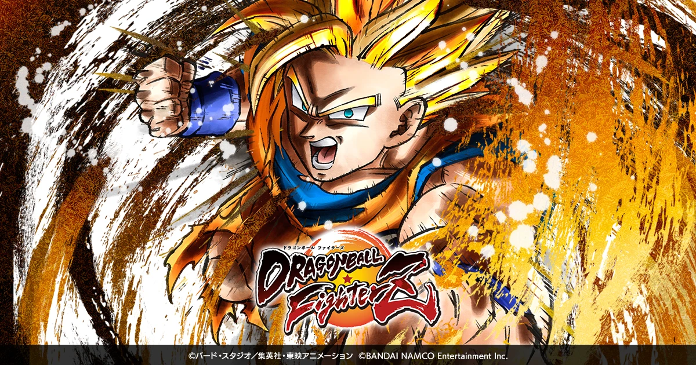
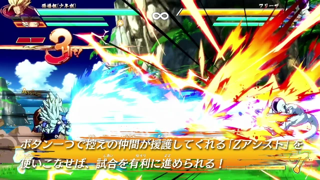
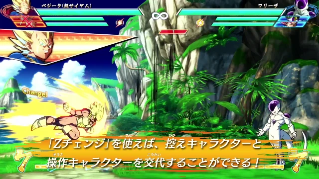
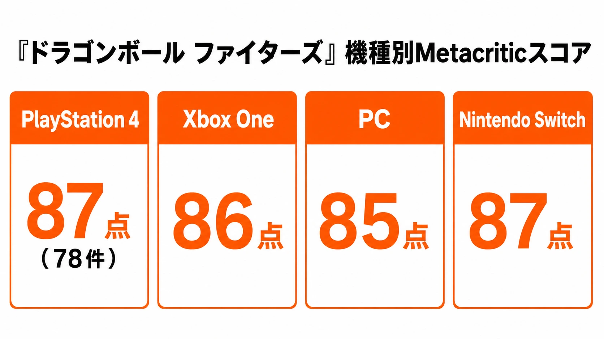
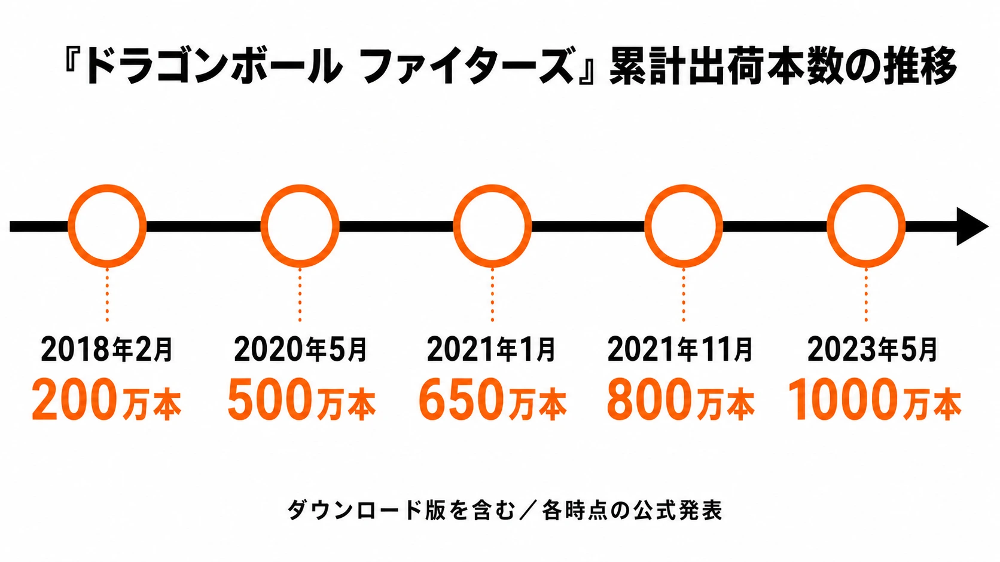

# 『ドラゴンボール ファイターズ』は、なぜ既存の表現基盤を大型IPの成功へ変えられたのか――技術転用と競技性から読む成功事例

他メディアIPのゲーム化では、原作を知っていることと、原作らしく遊べることの間に大きな距離がある。キャラクターを3Dモデル化するだけでは、ファンが記憶している線、影、動き、そして戦いの速さは戻らない。2018年の『ドラゴンボール ファイターズ』（DRAGON BALL FighterZ）は、その距離を、アークシステムワークスが自社作品で積み上げてきた格闘ゲームの表現基盤によって縮めた事例である。

本稿は「他メディアIPのゲーム化 成功・失敗事例シリーズ」の成功事例として、本作を扱う。『鬼滅の刃 ヒノカミ血風譚』が作品ごとのエフェクト制作とアニメ側の視覚資産との接続を重視したのに対し、本作の中心は別にある。『ギルティギア イグザード サイン』で確立した、3Dモデルを手描きセルアニメのように見せる方法を、ドラゴンボールの戦闘へ転用した点である。ただし、この技術と原作愛だけで完成した成功ではない。3対3の競技設計、初心者を入口へ通す操作、そして発売時のオンライン機能に残った課題まで含めて見る必要がある。

*画像出典（引用）：バンダイナムコエンターテインメント「[ドラゴンボール ファイターズ](https://dbfz.bn-ent.net/)」。公式キービジュアルを、作品の題材を示すため必要な範囲で引用。画像内の権利表記を保持したままWebPへ変換。*

## エグゼクティブサマリー

『ドラゴンボール ファイターズ』は、バンダイナムコエンターテインメントが発売し、アークシステムワークスが開発した対戦格闘ゲームである。北中南米・欧州では2018年1月26日、日本・アジアでは同年2月1日に発売された。発売直後に世界累計出荷200万本を突破し、バンダイナムコエンターテインメントは当時、ドラゴンボールゲームシリーズ最速の到達と発表した。[[1](#ref-1)]

成功の核は、借用IPのために表現技術をゼロから発明したことではない。アークシステムワークスは『ギルティギア イグザード サイン』で、手描きアニメーションを3Dで再現する手法を実用化していた。シェーダー、モデル、リグ、手作業のアニメーション調整を一体の制作基盤として持っていたからこそ、原作のカットを想起させる構図と、格闘ゲームに必要な即時入力を同じ画面で両立できた。

その上に置かれたのが、3対3のチーム戦である。プレイヤーは好きなキャラクターを並べ、交代とアシストを使い、空中コンボからかめはめ波や元気玉へつなぐ。初心者にはボタン連打で成立する超コンボを用意しつつ、上級者にはアシスト、交代順、ゲージ、間合いを含むチーム単位の研究余地を残した。原作ファンサービスと競技性を、別モードへ分離せず、一つの対戦ルールに重ねた設計である。

一方、発売時のオンラインロビーと対戦導線には批判もあった。商業的成功や高い批評スコアは、オンライン対戦を含む全体の体験が最初から欠点なく成立していたことを意味しない。IPゲームでは、象徴的な見た目を成功させるだけでなく、長期的に遊ばれる入口と接続品質まで、製品の中核として設計する必要がある。

***

## 『ギルティギア イグザード サイン』で作った基盤を、別IPへ持ち込む

アークシステムワークスは2014年の『ギルティギア イグザード サイン』で、シリーズ伝統の手描きアニメーションを3Dで再現する手法を取り入れた。同社はこの作品を、3Dセルルックの格闘ゲーム表現が自社の代名詞になった転機として位置づけている。[[2](#ref-2)]

ここでいう基盤は、単一のセルシェーダーではない。セルシェーダーは、3Dモデルの明暗を段階的な色面として描き、アニメの塗りに近づける仕組みである。『ギルティギア イグザード サイン』の開発資料では、通常の光源計算だけに任せず、アーティストが法線や陰影を調整して画を作る方針が説明されている。キャラクターの動きも、補間に任せる範囲を絞り、アーティストが手作業で設定した。[[3](#ref-3)]

この手間は、3Dモデルを「どの角度から見ても正しい立体」にするためではなく、「その瞬間にアニメの一枚絵として見える画面」にするためのものだった。アニメでは、動きの全フレームを均等に描かず、ポーズを強調し、必要な箇所だけを動かすリミテッドアニメーションが用いられる。アークシステムワークスはリアルタイム再生の制約下で、この日本的なリミテッドアニメーションを作る方法を研究し、CEDECでも制作手法を共有している。[[4](#ref-4)]

『ドラゴンボール ファイターズ』は、この土台を別の原作へ適用した。3Dのカメラを使えるため、孫悟空のかめはめ波やベジータのファイナルフラッシュで原作を思わせる角度へ寄れる。一方で、対戦中は入力、ヒット判定、画面外への移動、相手との距離が常に変わる。プリレンダー映像を差し込むだけでは、この条件を満たせない。基盤がリアルタイムの格闘ゲームとして既に鍛えられていたことが、IPの見た目を操作可能な体験へ変える前提になった。

開発陣も本作のディレクターに、『ギルティギア イグザード』シリーズのテクニカルアーティストとして評価されていた本村・C・純也氏を据えたと語っている。バンダイナムコエンターテインメントとアークシステムワークスは、アニメファンと格闘ゲームファンの双方へ届くことを企画段階から目標にしていた。[[5](#ref-5)] これは、原作人気に合わせて得意な開発会社を選んだだけの話ではない。既にある表現パイプラインを、原作の何を見せるかという企画判断と接続したのである。

### 『鬼滅の刃 ヒノカミ血風譚』との違いは、作り込む対象にある

同じアニメIPの成功例でも、再現のための投資先は同じではない。『鬼滅の刃 ヒノカミ血風譚』のサイバーコネクトツーは、Unreal Engine 4上で内製ツールと複数のポストエフェクトを組み合わせ、呼吸の技などの画面効果を作品に合わせて作り込んだ。[[6](#ref-6)] 作品固有の水、炎、雷の密度を、ゲーム中のカメラと操作へ合わせ直す解法である。

対して『ドラゴンボール ファイターズ』は、アークシステムワークスが自社の格闘ゲームで培ったセルルック、画面作り、リミテッドアニメーションの生産基盤を転用した。もちろん、孫悟空やフリーザのモデル、必殺技、演出は本作用に制作しなければならない。しかし開発の出発点は「このIPのために表現工程を新設する」ことではなく、「既存の表現工程で、このIPの顔をどこまで正確に出すか」だった。

プランナーにとって重要なのは、どちらが上かではない。原作の象徴が特定のエフェクトや撮影に集中しているなら、作品固有の表現へ制作資源を寄せる必要がある。反対に、開発会社が原作と相性のよい、実戦で検証済みの表現パイプラインを持つなら、基盤の再利用は品質と速度の両方で強い選択肢になる。ただし、再利用は原作への当てはめを省略する免罪符ではない。共通基盤であっても、原作固有のポーズ、カメラ、色、効果音との同期は個別に検証する必要がある。

*画像出典（引用）：バンダイナムコエンターテインメント「[ドラゴンボール ファイターズ道場 其之二](https://dbfz.bn-ent.net/information/?p=165)」。セルルックのリアルタイム対戦画面を示すため必要な範囲で引用。©バード・スタジオ／集英社・東映アニメーション ©Bandai Namco Entertainment Inc.／WebP変換。*

***

## 3対3で、原作の「共闘」と格闘ゲームの研究を重ねる

本作は、各プレイヤーが3人のキャラクターを選んで戦うチーム戦を採用する。バンダイナムコエンターテインメントの公式説明は、交代、アシスト、3人同時の必殺技を含む3対3の戦略性を、2.5D表現と並ぶ特徴に挙げている。[[1](#ref-1)] キャラクターを一人ずつ鑑賞するだけでなく、「誰と誰を並べるか」をプレイヤーの選択にした点が重要である。

原作ファンにとって、この編成は孫悟空、ベジータ、ピッコロを同じチームに置く遊びであり、原作では実現しない組み合わせの会話や共闘を想像する余地でもある。格闘ゲームのプレイヤーにとっては、前に出るキャラクター、援護に回すキャラクター、体力回復のための交代順を考えるシステムになる。開発陣も、キャラクターごとのアシスト性能とチーム全体の戦略を考える研究過程を、本作の醍醐味として説明している。[[7](#ref-7)]

空中で追いかけ、コンボをつなぎ、相手を地面へ叩き付ける流れは、ドラゴンボールらしい高速戦闘の再現である。同時に、コンボの途中で誰を呼ぶか、どこで交代するか、ゲージを何に使うかという競技上の選択にもなる。かめはめ波や元気玉のような必殺技を、単発の鑑賞演出だけにしなかった点に、本作の設計上の強みがある。派手な技は試合の中で撃つ判断を伴い、結果が次の局面へ返ってくる。

キャラクターの採用基準も、単に知名度順ではなかった。開発陣は、人気だけでなく「ほかのキャラクターと差別化しやすいか」「個性的なバトルができるか」を重視したと説明している。[[5](#ref-5)] 大型IPでは、登場人物を多く出すこと自体が目標になりやすい。本作は、原作の顔ぶれを増やす判断を、チーム戦の役割や操作感と結び付けた。IP側の要求と競技側の要求を、キャラクター選定の同じ表に置いたのである。

*画像出典（引用）：バンダイナムコエンターテインメント「[ドラゴンボール ファイターズ道場 其之二](https://dbfz.bn-ent.net/information/?p=165)」。3対3の交代システムを示すため必要な範囲で引用。©バード・スタジオ／集英社・東映アニメーション ©Bandai Namco Entertainment Inc.／WebP変換。*

***

## 簡略操作を「浅い別ルール」にしなかった

格闘ゲームは、原作ファンにとって操作の敷居が高くなりやすい。そこで本作は、ボタン連打で連続技へつながる超コンボ、相手へ接近しやすい超ダッシュ、比較的共通性の高い基本操作を用意した。開発陣は、超コンボが空振りでも次の技へつながり、技を出すたびに前進する仕組みを、初心者同士でも距離が開き過ぎないための工夫として説明している。[[8](#ref-8)]

ただし、この簡略操作は、初心者専用の弱いルールではない。開発陣が目指したのは、全プレイヤーが同じ操作系で遊び、習熟に応じてできることが増える設計だった。アシスト、交代、空中での位置取り、ゲージ運用を理解するほど、同じ操作のなかで選択肢が広がる。[[8](#ref-8)]

ここには、IPゲームでよく起こる二分法を避ける判断がある。原作再現を優先すると、誰でも派手な技が出せる一方で、上達の余地が薄くなりやすい。逆に競技性だけを優先すると、原作を知る新規プレイヤーが最初の一戦まで届かない。本作は、自動連携コンボを「見せ場を出すボタン」に留めず、近づく、当てる、次の判断をするという対戦の流れへ組み込んだ。

この設計の限界も忘れてはならない。簡略操作は、初心者が使える技の数を増やしても、読み合いの理由や敗因を自動的に理解させてはくれない。チュートリアル、練習モード、対戦相手の探しやすさ、負けた直後にもう一戦したいと思わせるオンライン導線まで、入口の設計は続く。本作のオンライン評価は、その後半が別の難題であったことを示す。

***

## 高評価と販売推移、そして発売時オンラインの課題

批評面では、Metacriticの集計でPlayStation 4版が78件の批評に基づく87点、Xbox One版が86点、PC版が85点、Nintendo Switch版が87点となった。[[9](#ref-9)] 発売直後には、同集計における歴代ドラゴンボールゲーム最高評価として報じられた。[[10](#ref-10)] この高評価は、原作再現だけでなく、操作の入口とチーム格闘ゲームとしての深みが同時に受け止められた結果と読める。

商業面の推移も、初週の話だけではない。公式発表では、2018年2月の200万本、2020年5月の500万本、2021年1月の650万本、同年11月の800万本、2023年5月の1000万本と到達点が更新された。いずれもダウンロード版を含む累計出荷本数である。[[1](#ref-1)] [[11](#ref-11)] [[12](#ref-12)] [[13](#ref-13)] [[14](#ref-14)] 1000万本規模は、アークシステムワークスが手掛けた格闘ゲームとして過去最高水準の商業的到達であり、同社の歴代最高売上作として紹介されている。[[15](#ref-15)]

しかし、成功を単純な礼賛へ変えてはならない。発売時のレビューは、ロビーがメニューを兼ねる構成と、地域ごとに最大64人へ分かれる仕組みが待ち時間を長くし、対戦相手の母集団を細かく分断していると批判した。[[16](#ref-16)] この問題は、対戦が面白いことと、対戦へすぐ到達できることが別の品質であると示している。

この指摘は発売時点のオンライン体験に関するものである。後年には、PlayStation 5、Xbox Series X｜S、PC版を対象に、入力予測のずれを巻き戻して補正するロールバックネットコードが導入された。[[17](#ref-17)] したがって、発売時レビューを現在の全機種・全バージョンの評価へそのまま延長するべきではない。それでも、競技性を売りにする作品でオンライン基盤の改善が発売後の課題になった事実は残る。

***

## プランナーへの示唆：IPの顔に合う「蓄積」を見極める

### 1. ライセンス獲得の前に、再利用できる制作基盤を棚卸しする

借用IPで最初に問うべきは、「人気があるか」だけではない。自社のモデル、アニメーション、シェーダー、カメラ、バトル設計の蓄積で、そのIPの最も重要な瞬間を再現できるかである。『ドラゴンボール ファイターズ』では、アークシステムワークスのセルルックとリミテッドアニメーションが、原作の戦闘表現と強く噛み合った。

これは制作を安く済ませるという意味ではない。基盤の再利用で節約できた時間と判断力を、原作固有の技、ポーズ、キャラクター間の掛け合い、バランス調整へ回せるという意味である。基盤とIPの相性が悪ければ、転用はかえって不自然さを増やす。まず「何が既存資産で、何が新規制作なのか」を分ける必要がある。

### 2. 原作再現を、対戦の意思決定へ戻す

名場面をムービーとして再生するだけなら、原作再現とゲームプレイは分離する。本作は、3対3の編成、交代、アシスト、必殺技の連携を通じて、原作キャラクターを選ぶこと自体が勝敗に関わるようにした。ファンサービスは演出の量ではなく、プレイヤーの選択を変えるかどうかで測るべきである。

そのためには、原作上の人気とゲーム内の役割を別々に検討する必要がある。人気キャラクターでも、既存キャラクターと戦い方が重なるなら、アシスト、固有技、交代時の価値のいずれかを設計し直さなければならない。逆に、競技上の役割だけを優先して原作の顔を外せば、IPを借りる意味が薄くなる。

### 3. 初心者向け機能は、上達の道筋まで含めて設計する

自動連携コンボは、初心者に一度だけ勝たせるための救済ではない。同じルールのなかで、最初の成功を作り、次に試すべき選択を見せる導線として機能する。本作のように基本操作を共通化するなら、簡略操作の先にアシスト、交代、ゲージといった理解可能な深みを置く必要がある。

そして、その道筋はオフラインだけで完結しない。特に対戦ゲームでは、対戦相手の見つけやすさ、待ち時間、通信品質、再戦のしやすさが、習熟の継続を左右する。バトルデザインとオンライン機能を別工程の付加要素として扱うと、入口だけを広げて、その先で顧客を失う危険がある。

***

## おわりに：成功したのは、既存技術を原作へ当てたからではない

『ドラゴンボール ファイターズ』の成功は、「有名IP」と「高い技術力」を足せば再現できる公式ではない。アークシステムワークスは、手描きアニメーションの見え方を3Dのリアルタイム格闘ゲームで成立させる基盤を先に持っていた。そして、その基盤がドラゴンボールの高速戦闘、派手な必殺技、三人の共闘という原作の顔と噛み合うと判断し、競技ルールと操作の入口まで一つの製品へ組み込んだ。

『鬼滅の刃 ヒノカミ血風譚』のように作品固有のエフェクトを深く作り込む成功もある。本作が示したのは、もう一つの道である。自社の表現基盤が原作の中心体験と一致するなら、それを転用し、個別制作を原作固有の価値へ集中させられる。ただし、見た目の成功は、オンライン対戦の到達性や長期運用の品質を代替しない。IPゲームを長く遊ばれる製品にするには、再現、競技、接続を同じ優先度で完成させる必要がある。

## References

1. [「ドラゴンボール」ゲームシリーズ最速の累計出荷本数200万本を突破][1] - 発売地域・発売日、開発元、3対3の特徴、累計出荷200万本を記したバンダイナムコエンターテインメントの公式発表。

2. [アークシステムワークス35年の歴史][2] - 2014年の『ギルティギア イグザード サイン』と、手描きアニメーションを3Dで再現する手法を同社が紹介したページ。

3. [GDCの舞台で世界に披露された「GUILTY GEAR Xrd -SIGN-」の「アニメにしか見えない3Dグラフィックス」制作手法][3] - セルシェーダー、法線・陰影、手作業のアニメーション設定を開発者講演に基づき解説した記事。

4. [GUILTY GEAR Xrd におけるリアルタイム・リミテッドアニメーション][4] - CEDEC 2015の講演概要。リアルタイムで日本的リミテッドアニメーションを表現する手法を示す。

5. [「ドラゴンボール ファイターズ」開発陣インタビュー][5] - バンダイナムコエンターテインメントとアークシステムワークスの企画意図、技術体制、キャラクター選定を聞いたインタビュー。

6. [サイバーコネクトツーのエフェクト開発事例][6] - 『鬼滅の刃 ヒノカミ血風譚』におけるUE4の内製ツールとポストエフェクトを解説した技術講演の記録。

7. [「ドラゴンボール ファイターズ」開発陣インタビュー、2ページ目][7] - アシスト、チーム編成、交代を含む3対3の戦略性とバトル設計を開発陣が説明した記事。

8. [「ドラゴンボール ファイターズ」開発陣インタビュー、2ページ目][8] - 超コンボ、共通操作、初心者と上級者を同じ操作系でつなぐ考え方を開発陣が説明した記事。

9. [Dragon Ball FighterZ Reviews][9] - 各プラットフォーム版のMetascoreと批評件数の集計ページ。

10. [Dragon Ball FighterZ is the Highest-Rated Dragon Ball Game Ever][10] - 発売直後のMetacritic集計に基づき、歴代ドラゴンボールゲーム最高評価と報じた専門メディアの記事。

11. [500万本突破記念！ アイテムプレゼント][11] - 2020年5月時点で全世界累計出荷500万本突破を告知した公式サイトの記事。

12. [DRAGON BALL Games Battle Hour発表][12] - 2021年1月時点で全世界累計出荷650万本と記したバンダイナムコエンターテインメントの発表。

13. [「ドラゴンボール ファイターズ」世界累計出荷本数800万本突破][13] - 2021年11月の世界累計出荷800万本突破を告知したバンダイナムコエンターテインメントの公式発表。

14. [1000万本突破記念！1000時間DLC無料開放キャンペーン][14] - 2023年5月時点で累計出荷1000万本突破を告知した公式サイトの記事。

15. [Guilty Gear studio eyeing new crossovers with major Western IPs for next fighting game][15] - 『ドラゴンボール ファイターズ』をアークシステムワークスの歴代最高売上作として紹介したインタビュー記事。

16. [Dragon Ball FighterZ review][16] - 発売時のオンラインロビー、待ち時間、対戦相手の母集団分断を指摘したレビュー。

17. [DRAGON BALL FighterZ Rollback Netcode Update][17] - PlayStation 5、Xbox Series X｜S、PC版へのロールバックネットコード導入を告知した公式情報。

[1]: https://bandainamcoent.co.jp/corporate/press/release/63/pdf/20180201-1.pdf
[2]: https://www.arcsystemworks.jp/35th/history/
[3]: https://www.4gamer.net/games/216/G021678/20150317055/
[4]: https://cedil.cesa.or.jp/cedil_sessions/view/1384
[5]: https://www.4gamer.net/games/384/G038402/20171211079/
[6]: https://gamemakers.jp/article/2022_08_11_10558/
[7]: https://www.4gamer.net/games/384/G038402/20171211079/index_2.html
[8]: https://www.4gamer.net/games/384/G038402/20171211079/index_2.html
[9]: https://www.metacritic.com/game/dragon-ball-fighterz/
[10]: https://www.gamerevolution.com/news/364319-dragon-ball-fighterz-metacritic-is-the-highest-rated-dragon-ball-game-ever
[11]: https://dbfz.bn-ent.net/information/?p=997
[12]: https://www.bandainamco.co.jp/cgi-bin/releases/index.cgi/press/10155?entry_id=7064
[13]: https://www.bandainamcoent.co.jp/corporate/press/top/single.html?q=phgOHLAbM
[14]: https://dbfz.bn-ent.net/information/?p=2557
[15]: https://www.dexerto.com/gaming/guilty-gear-studio-eyeing-new-crossovers-major-western-ips-next-fighting-game-1898541/
[16]: https://www.digitaltrends.com/gaming/dragon-ball-fighterz-review/
[17]: https://www.bandainamcoent.com/news/dragon-ball-fighterz-rollback-netcode-update

----

この文書は、Perplexity、Claude、OpenAI Codex の3つのAIの支援を受けて著述されたものです。引用画像を除き、MIT License にて提供されています。
