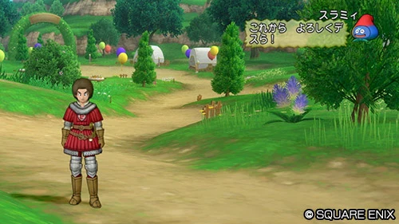
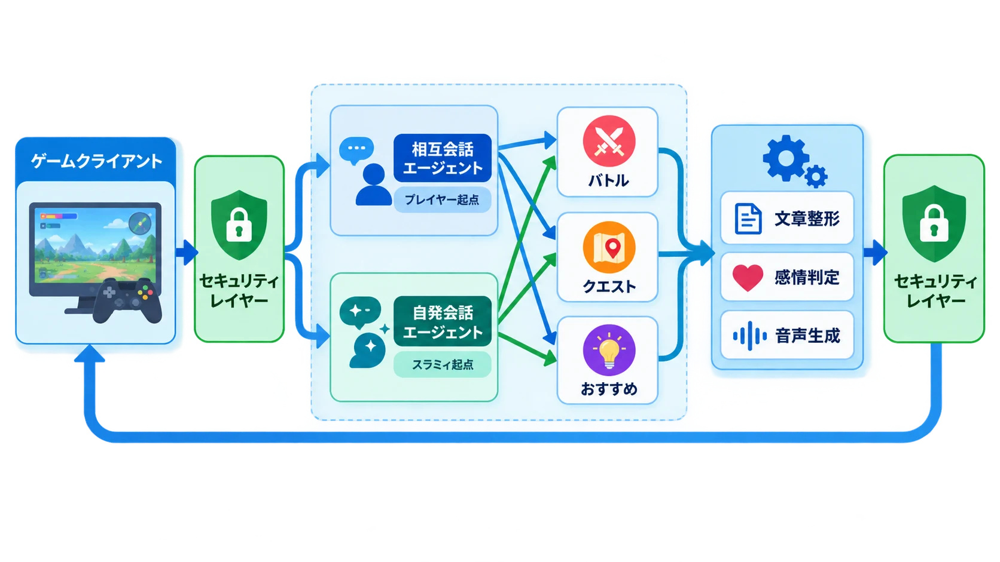
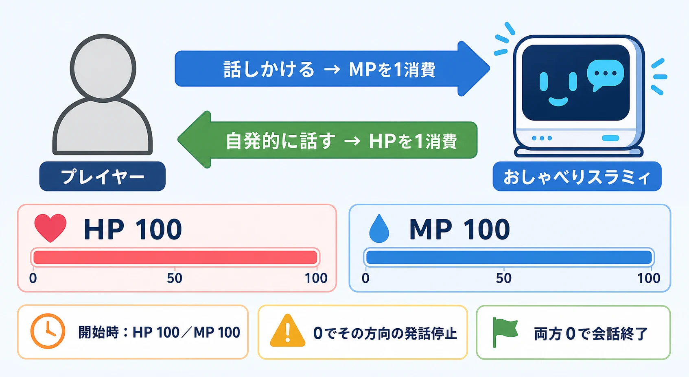
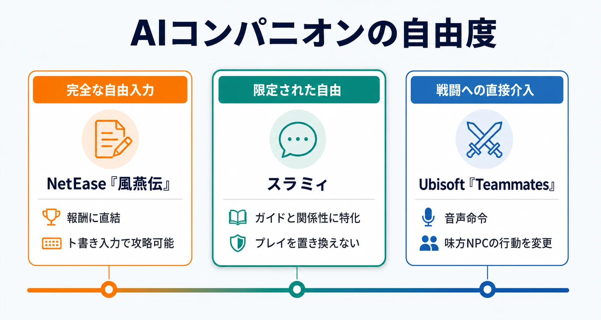

# 『ドラゴンクエストX』おしゃべりスラミィに学ぶ、生成AIコンパニオンの「自由を絞る」設計

生成AIキャラクターの価値は、会話の自由度を体験目的へ結びつけたときに生まれる。『ドラゴンクエストX オンライン』で開発が続く対話型AIバディ「おしゃべりスラミィ」は、この考え方を端的に示す事例である。プレイヤーの質問に答えるだけでなく、装備変更や初めてのボス撃破を見て自分から声をかける。一方で、知識の範囲、発話の入口、会話回数には意図的な境界が置かれている。[[1](#ref-1)][[2](#ref-2)]

出典：[目覚めし冒険者の広場「対話型AIバディ『おしゃべりスラミィ』クローズドベータテスト参加者募集！」][1]（© ARMOR PROJECT/BIRD STUDIO/SQUARE ENIX。画像は引用、MIT License の対象外）。

2026年3月18日の記者説明会では、『ドラゴンクエストX オンライン』ショーランナーの安西崇氏、スクウェア・エニックスAI＆エンジン開発ディビジョンの荒牧岳志氏、Google Cloudでゲーム部門のグローバルディレクターを務めるジャック・ビューザー氏が、その狙いを「真のゲーム内の相棒」という方向性から説明した。4月20日から5月20日11時59分までは当選者を対象としたクローズドベータテストが実施された。正式提供については、8月2日公表（8月6日更新）の中長期展望でも課題への対応と開発継続が示されるにとどまり、執筆時点の2026年8月23日において具体的な時期は明らかにされていない。[[3](#ref-3)][[4](#ref-4)][[5](#ref-5)]

本稿では、スラミィを、堀井雄二氏の設計哲学を技術とルールへ翻訳した例として扱う。焦点は「何でも話せるNPC」ではなく、「いつ、誰が、何のために話すかを設計された相棒」である。

***

## 「1冊の本」に、終わらない会話を入れる難しさ

企画の出発点には、シリーズ生みの親である堀井雄二氏の懐疑があった。安西氏が紹介したところによれば、堀井氏はドラゴンクエストを「1冊の本」と捉えている。従来の村人の台詞には読み終わりがあり、プレイヤーは情報を受け取って次の行動へ移れる。自由会話を生成するAIを各NPCへ載せると、その区切りが消え、「この人といつまで喋ればいいんだろう」という負担が生まれるという考えである。[[3](#ref-3)]

これは会話品質よりも、プレイヤーの注意をどう配分するかという問題である。RPGのNPCは物語、攻略情報、地域の空気を伝えるが、すべての発言を聞く義務があるように感じられると探索のテンポを損なう。生成AIによって台詞の総量をほぼ無限に増やしても、プレイヤーが使える時間と集中力は増えない。書き手側の供給制約が外れた結果、読み手側の選別コストが前面に出るのである。

堀井氏が代わりに示したのが、「一緒に遊んでくれる友達」「一緒に戦ってくれる仲間」へAIを置く案だった。多数のNPCの誰に何を聞くべきかをプレイヤーへ委ねるのではなく、プレイヤー一人にひもづく相手へ役割を集約する。安西氏は、攻略サイトへ離脱せずとも、昔の友人のように「ちょうどいい」助言をくれる存在を目指したと説明している。[[6](#ref-6)]

この転換によって、会話の目的も変わる。案内板なら正解を短く返せばよいが、友達なら冒険の履歴を知り、成功を祝い、ときには相手から話題を振る必要がある。スラミィはプレイヤーの記録を「死神手帳」として参照し、専用チャットの内容も他のプレイヤーには見せない。「自分だけの友達」という設定と、データの参照範囲・表示範囲が一致している。[[3](#ref-3)][[7](#ref-7)]

***

## 相棒を二つに分けるマルチエージェント構成

スラミィの中核には、Gemini 2.5 Flashと、低遅延の音声対話を扱うGemini Live APIが使われている。プレイヤーの発話やゲーム画面を扱えるマルチモーダル性、応答速度、音声を含む表現の調整可能性が選定理由として挙げられた。単一のモデルへ全役割を詰め込むのではなく、Googleのオープンソース開発キットAgent Development Kit（ADK）で複数のエージェントを組み合わせている。[[7](#ref-7)][[8](#ref-8)]

2026年7月末のGoogle Cloud Next Tokyo 26で、スクウェア・エニックスのプログラマー佐久間隆友氏が示した構成では、クライアントからの要求はまずセキュリティレイヤーを通る。その後、プレイヤーが起点となる「相互会話エージェント」と、スラミィが起点となる「自発会話エージェント」のどちらかへ振り分けられ、さらにバトルやクエストなど領域別のサブエージェントが回答を作る。生成結果は文章の整形、感情判定、音声生成などを経て、再度セキュリティレイヤーを通ってゲームへ戻る。[[8](#ref-8)]

二つの会話エージェントを分ける意味は、入力文の違い以上に大きい。相互会話では、プレイヤーが何を尋ねるか予測できないため、意図分類、知識検索、安全性確認が中心になる。自発会話では、装備変更やボス撃破といったゲーム内イベントが先にあり、「初めてこのボスを倒したので褒める」といった目的付きの要求をゲーム側が裏で送る。前者は自由入力を安全に解釈する経路、後者はゲーム状態を関係性の演出へ変換する経路である。[[8](#ref-8)][[9](#ref-9)]

一体のキャラクターとして見せながら、内部では発話の責任を分ける。この設計なら、自発会話の頻度や対象イベントだけを調整しやすく、プレイヤーからの質問対応を変更しても、祝い方や声かけの条件へ影響を広げずに済む。生成AIの人格を一枚岩のプロンプトとして扱わず、体験上の役割ごとに制御面を分離している点が重要である。

***

## 「デスら」を守るのは、出力工程の仕様である

キャラクター性は、システムプロンプトと出力後の工程にまたがって管理されている。システムプロンプトには役割、背景、好きな呪文、語尾などが定義され、親密度に応じて言葉選びや呼び方が変化する。「デスら」という独特の語尾は、テキストに付け足すだけでなく、Gemini Live APIへの演技指示によってイントネーションや感情表現まで調整される。生成後のテキストには、『ドラゴンクエストX』固有の改行や空白、1行当たりの文字数といった表示規則も適用される。[[8](#ref-8)][[9](#ref-9)]

安全性は、キャラクター設定と別の層で担保する。公開された構成では、スラミィとしての振る舞いを指示するSafety Instructions、独自のNG Word Check、Gemini APIのSafety Filter、プロンプトインジェクションなどを検知するModel Armorの4段階が用いられた。設定を厳しくしすぎると、現実の住所だけでなくゲーム内の地名まで話せなくなるため、安全性と有用性の境界は運用中の調整対象となる。[[8](#ref-8)][[9](#ref-9)]

記憶にも時間軸がある。3月の説明会では1日分の会話履歴を保持し、好みや話題の傾向を会話へ反映すると説明された。7月の技術講演では、直近の会話ログをAlloyDB Session Serviceへ短期記憶として保存し、重要な情報をMemory Bankが抽出して長期記憶へ統合する、より具体的な構成が公開されている。さらに、ゲーム知識を広げるRAG（Retrieval-Augmented Generation）の導入も今後の構想に含まれる。[[7](#ref-7)][[8](#ref-8)]

ここで区別したいのは、会話の連続性と、攻略情報の正確さである。前者は「昨日話した好み」を覚える記憶設計、後者は運営が管理する知識から根拠を取得するRAGが担う。長い会話履歴をそのまま渡すだけでは、最新のクエスト条件や固有名詞の正確さは保証できない。相棒らしさを作る記憶と、ガイドとしての信頼性を作る知識基盤は別々に設計する必要がある。

***

## HPとMPは、会話を有限の遊びへ戻す

クローズドベータテストのスラミィにはHPとMPが各100設定されていた。スラミィ側からの発話でHP、プレイヤー側から話しかけて応答を受けるとMPが減る。対応する値が尽きれば、その方向から会話を始められなくなり、両方を使い切れば会話機能全体が終了する。公式案内は会話回数に上限があり、HPとMPがテスト期間中に回復しないことを明記していた。[[1](#ref-1)][[2](#ref-2)]

この二本立ては、単なるAPI利用回数の表示よりも設計上の意味を持つ。MPはプレイヤーが情報を求める量、HPはスラミィがプレイヤーの注意へ割り込む量を表すからである。自発会話を魅力的にしても、頻度が高すぎれば通知と同じ負担になる。反対に、質問だけを許すと便利なチャットボットにはなっても、友達らしい偶発性が生まれにくい。双方向を別々の予算として扱うことで、利便性と存在感を個別に計測・調整できる。

そしてHP・MPという呼び名は、技術上のレート制限をゲーム内の語彙へ変換している。堀井氏が懸念した際限のなさに対し、警告文で利用を抑えるのではなく、使い切りのリソースというドラゴンクエストらしいルールで終点を作ったのである。ベータ時の値や回復条件が正式提供時にも維持されるとは限らないが、「会話にも有限性を設計する」という原則は、運用コスト、プレイヤーの疲労、依存的な長時間利用のすべてに効く。

***

## 自発会話は、ガイドを「検索」から「気づき」へ変える

公式のベータテスト案内では、ログイン時や時間帯に応じた挨拶、写真撮影時の感想、美容院で髪型を変えたときや装備変更時の反応、未撃破だったボスを倒したときの感想、称号獲得への反応などが例示された。おすすめを尋ねれば、進行中の物語やクエストに応じた提案を返すことも想定されている。[[2](#ref-2)]

ここでは、ガイド機能が二種類に分かれている。一つは「次に何をすればよいか」と尋ねる明示的な支援であり、もう一つはプレイヤーの変化を検知して声をかける暗黙的な支援である。長期運営MMORPGでは、コンテンツ量が増えるほど、新規・復帰プレイヤーは質問そのものを作れなくなる。知らない機能の名前は検索できず、取得した称号や装備変更が次の遊びへどうつながるかも判断しにくい。AI側からの発話は、プレイヤーが情報を取りに行く前に、現在の行動を入口として選択肢へ気づかせる。

ただし、自発性は、ゲーム側が検知できるイベントを発火条件として制御されている。その状況に合う役割を自発会話エージェントへ渡している。発話の内容には生成AIの幅を残し、発話の契機はゲームデザイン側が握る構造である。この「トリガーは決定的、表現は生成的」という分担により、案内の必要性と友達らしい言い回しを両立させている。

クローズドベータテストでは、応答に時間がかかる場合、音声が生成されずテキストのみになる場合、覚えていない攻略情報へ正しく答えられない場合なども事前に列挙された。スラミィが事実と異なる発言をする、いわゆるハルシネーションの可能性も明記されている。正式品質ではないこと、関係性を正式提供へ引き継ぐか未定であることまで含めた開示は、プレイヤーへ検証参加者としての判断材料を渡すものである。[[1](#ref-1)][[2](#ref-2)]

生成AI機能では、キャラクターらしい演出が強いほど、誤答もキャラクターの発言として信じられやすい。したがって没入感を高める設計と、限界を説明する設計は対立しない。ゲーム内では定型のフォールバックで体験を守り、ゲーム外の公式案内では不確実性を明示するという二層の伝え方が必要になる。

***

## 自由会話より、限定された自由をどこへ置くか

自由会話型NPCの別の方向性は、NetEase Gamesの『風燕伝：Where Winds Meet』に見られる。一部NPCとのチャットが報酬へ結びつく同作では、兄弟を探すNPCへ「（突然兄弟が目の前に現れる）」のようなト書きを入力し、条件を満たしたとAIに解釈させる攻略法が報告された。自由な言葉で状況を変えられる面白さがある一方、会話が報酬判定器になると、プレイヤーは物語上の説得より、モデルを最短で通す入力を探し始める。[[10](#ref-10)]

自由会話型NPCには、応答までの数秒が煩わしく感じられること、会話そのものが作業になり得ること、報酬を置くと自然な対話より最適化が優先されることという課題がある。没入感も会話量に比例しない。AIへト書きが通ると分かった瞬間、NPCは人物からシステムへ戻って見える。[[10](#ref-10)]

Ubisoft Entertainmentの研究プロジェクト「Teammates」は、スラミィに近い別の答えを示す。音声アシスタントのJasparは敵や物体の強調、物語情報の提示、設定変更などを担い、同行するSofiaとPabloは自然言語の命令に応じて遮蔽物を使い、攻撃対象やタイミングを変える。会話を独立したミニゲームにせず、相棒への指示と支援を既存のゲームプレイへ接続している。Ubisoft側も、NPCが即興できる範囲を人間の作り手が設定する「柵」として説明している。[[11](#ref-11)]

スラミィの特徴は、この限定をガイドへ集中させた点にある。ゲーム内のすべてを自由会話で変えるのではなく、冒険履歴を踏まえた提案、行動への反応、関係性の変化に生成AIを使う。攻略の答えを強制的に渡さず、プレイヤーが次の一歩へ気づく余白を残す。戦闘を直接代行するTeammatesとも、報酬条件へ会話を接続する『風燕伝』とも異なり、スラミィは「プレイを置き換えず、プレイの隣にいる」範囲を選んでいる。

同じLLMベースAI NPCでも、商用メタバース「cluster」で5,000人・31日間の実証から初心者定着を検討した事例は、繰り返し会う「顔なじみ」の効果を中心にしている。詳しくは[CEDEC2026最終日レポート](cedec2026-day3-recap-garage-ai-npc-prototyping-120fps.md)で扱った。スラミィはそれに対し、一人のプレイヤーへ専属する関係性と、いつ話すかを制御する双方向の発話予算に設計の重心がある。

***

## 生成AIコンパニオンを企画するときの確認項目

スラミィの事例から、企画初期に決めるべき項目は次のように整理できる。

| 設計項目 | 決めるべき問い | スラミィの回答 |
| --- | --- | --- |
| 役割 | AIは何を代替・補助するのか | 全NPCの自由会話ではなく、専属の友達兼ガイド |
| 自由度 | どこを生成し、どこをゲーム側が決めるか | 発話表現は生成し、自発発話の契機はゲームイベントで制御 |
| 発話主体 | プレイヤー起点とAI起点をどう分けるか | 相互会話と自発会話を別エージェントへ分離 |
| 知識 | 会話履歴と正確なゲーム情報をどう扱うか | 短期・長期記憶を分け、将来のRAGを想定 |
| キャラクター性 | 口調をどの工程で守るか | システムプロンプト、後処理、音声演技指示を併用 |
| 安全性 | 自由入力をどこで検査するか | 入出力のセキュリティレイヤーと4段階の対策 |
| 有限性 | 会話をどう終わらせるか | HPとMPで双方向の会話量を別々に予算化 |
| 説明責任 | 不確実性をどう伝えるか | ハルシネーションや遅延を公式案内で事前開示 |

特に重要なのは、「プレイヤーにどこまで自由を与えるか」を、ゲームシステムとの接点ごとに判断することである。自由入力が物語、戦闘、報酬、案内のどこへ影響するかによって、必要な安全性と失敗時の損失は変わる。会話が攻略報酬を直接確定するなら厳密な状態照合が必要であり、任意の雑談なら多少の揺らぎを許容できる。生成AIの自由度は、一律のスライダーではなく、ゲームシステムとの接点ごとに設定するものだ。

もう一つは、際限のなさを、プレイヤーが理解できるゲームルールへ変換することである。発話回数、割り込み頻度、記憶期間、参照知識を有限にすれば、コストを抑えるだけでなく、会話の一回ごとに意味を持たせられる。おしゃべりスラミィが示したのは、生成AIキャラクターを生き生きと見せる鍵が、無制限の会話ではなく、役割の明確な自由と納得できる境界にあるということなのである。

## References

1. [目覚めし冒険者の広場「対話型AIバディ『おしゃべりスラミィ』クローズドベータテスト参加者募集！」][1] - 機能概要、テスト募集、会話回数上限、HP・MP、ハルシネーションに関する公式案内。

2. [目覚めし冒険者の広場「対話型AIバディ『おしゃべりスラミィ』クローズドベータテスト レポート」][2] - テスト期間、HP・MPの非回復、自発会話の契機、既知の課題に関する公式報告。

3. [リアルサウンド テック「『ドラゴンクエストX』にAIバディ『おしゃべりスラミィ』登場へ」][3] - 2026年3月18日の説明会、堀井雄二氏の設計哲学、安西崇氏・荒牧岳志氏・ジャック・ビューザー氏の発言を扱った取材記事。

4. [Game\*Spark「『ドラクエX』に対話型AI搭載バディ実装へ！」][4] - 説明会の登壇者、「真のゲーム内の相棒」という方向性、Gemini Live採用理由を報じたイベントレポート。

5. [目覚めし冒険者の広場「『ドラゴンクエストX オンライン』中～長期展望」][5] - ベータテスト後も調整・開発を継続していることを示す公式発表。

6. [ASCII.jp「ドラクエXで冒険の相棒『おしゃべりスラミィ』開発中　なぜGoogleのAI・Geminiが選ばれた？」][6] - 友達・仲間としての位置づけ、双方向会話、Google Cloudを選んだ理由を扱う取材記事。

7. [ITmedia AI＋「『ドラクエX』が生成AIキャラクター導入へ」][7] - Gemini 2.5 Flash、Gemini Live API、処理段階、1日分の会話履歴を報じた記事。

8. [ASCII.jp「『ドラクエXの世界観を壊さない』Gemini実装」][8] - 佐久間隆友氏によるマルチエージェント、ADK、記憶、RAG、セキュリティ設計の技術講演レポート。

9. [ITmedia ビジネスオンライン「『ドラクエ』に“AIキャラ”登場、世界観を守るために張り巡らせた創意工夫」][9] - 自発発話、短期・長期記憶、4層の安全対策、フォールバックを扱う技術講演レポート。

10. [リアルサウンド テック「生成AIはゲームを面白くしているのか？」][10] - 『風燕伝：Where Winds Meet』の自由会話型NPC、報酬、ト書き入力、応答遅延をめぐる分析。

11. [Ubisoft「Ubisoft Reveals Teammates – An AI Experiment to Change the Game」][11] - AI音声アシスタントと同行NPCをゲームプレイへ組み込む研究プロジェクトの公式解説。

[1]: https://hiroba.dqx.jp/sc/topics/detail/b207f5c56605a9d1a22e1e134fe95ba9
[2]: https://hiroba.dqx.jp/sc/topics/detail/47257279d0b4f033e373b16e65f8f089/
[3]: https://realsound.jp/tech/2026/03/post-2339761.html
[4]: https://www.gamespark.jp/article/2026/03/21/164183.html
[5]: https://hiroba.dqx.jp/sc/topics/detail/f569c3d708a7558b3049d2896d2b6ce1/
[6]: https://ascii.jp/elem/000/004/383/4383025/
[7]: https://www.itmedia.co.jp/aiplus/article/2603/21/1260321012/
[8]: https://ascii.jp/elem/000/004/426/4426893/2/
[9]: https://www.itmedia.co.jp/business/articles/2608/12/news012.html
[10]: https://realsound.jp/tech/2026/04/post-2369890.html
[11]: https://news.ubisoft.com/en-us/article/3mWlITIuWuu0MoVuR6o8ps/ubisoft-reveals-teammates-an-ai-experiment-to-change-the-game

----

この文書は、Perplexity、Claude、OpenAI Codex の3つのAIの支援を受けて著述されたものです。引用画像を除き、MIT License にて提供されています。
