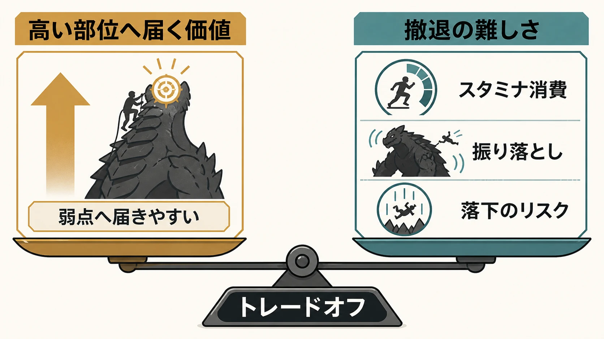
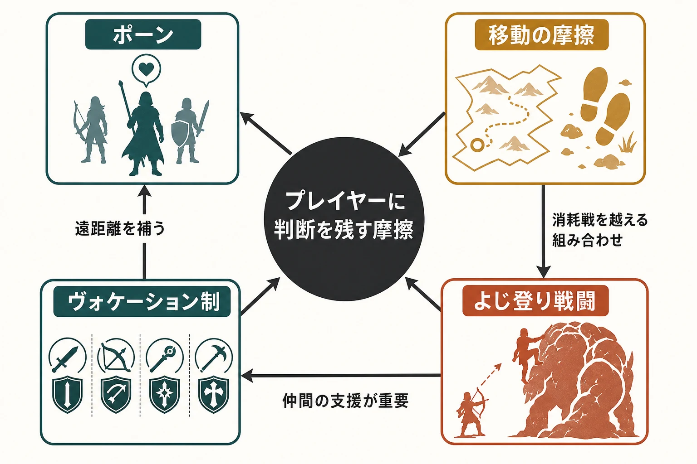

# 『ドラゴンズドグマ』はなぜ「不便さ」を捨てなかったのか――ポーン、移動、よじ登り、ヴォケーションで読む核設計

## はじめに：ジャンル名より先に「冒険の手触り」を決めた作品

2012年5月24日、カプコンはPlayStation 3／Xbox 360向けに『ドラゴンズドグマ』を発売した。カプコンは当時、本作を完全新作ブランドとして位置付け、オープンワールドのフィールドで多様なアクションを行う大型タイトルとして送り出している。[[1](#ref-1)] ディレクターは伊津野英昭である。[[2](#ref-2)]

ただし、遊んだ人が本作を説明するとき、「オープンワールドアクションRPG」という商品ジャンルだけでは足りない。大きな魔物の身体によじ登るアクション、AI制御の仲間と四人で旅をしているように見せるパーティ、他プレイヤーの世界を経由して仲間が知識を持ち帰るオンライン要素、徒歩移動を前提にした距離感が、ひとつの体験として強く結び付いているからである。アクションの気持ちよさだけを求める人にも、物語を急いで進めたい人にも、必ずしも親切な設計ではない。その偏りが、代替しにくい冒険の記憶を作った。

12年後の2024年3月22日、カプコンはPlayStation 5、Xbox Series X｜S、PC向けに『ドラゴンズドグマ 2』を発売した。公式は同作を、AI制御のポーンと共に一人で最大四人の冒険感を味わうオープンワールドアクションと説明している。[[3](#ref-3)] 発売から約10日後の4月2日には全世界販売本数250万本が発表され、シリーズ累計も1,000万本を超えた。[[4](#ref-4)] 初代と『ドラゴンズドグマ：ダークアリズン』を合わせたシリーズ累計は、2015年9月に、同年6月末時点の数字として230万本と報じられていた。[[5](#ref-5)] 数字を単純比較することはできないが、続編は初代のクセを広い市場へもう一度提示する契機になった。

本稿が焦点を当てるのは、**プレイヤーに近道を与え過ぎず、仲間・移動・戦闘の途中で判断を発生させる** という初代の核が、続編でどこが保たれ、どこが深められたかである。迂回路が難所への再挑戦を支える[『ELDEN RING』](elden-ring-open-world-detour-design.md)の設計とは、同じオープンワールドでも異なる角度から比較できる。

***

## 1. ポーンは、知識を「説明文」ではなく同行者の発話に変える

『ドラゴンズドグマ』のポーンは、戦力を増やすだけでなく、知識を運ぶ役割も担うNPCである。伊津野は2012年のインタビューで、従来ならRPGの世界に置かれる何気ないヒントを、ポーンの話す言葉として入れたと説明している。プレイヤーの隣でゲームを説明する友人のような存在、という比喩も用いている。[[2](#ref-2)]

この置き換えが目指すのは、情報を減らすことではなく、受け取り方を変えることである。敵の弱点、地形、クエストの手掛かりといった攻略に有用な情報を、メニューや固定のチュートリアルで受け取るのではなく、冒険の途中にいる仲間の提案として受け取らせる設計である。情報の正確さだけでなく、誰が、どの状況で、どの口調で言うかが体験の一部になる。

さらに初代では、リフトを介して他プレイヤーのポーンを借りられ、自分のメインポーンも他者の世界へ送り出せた。ネットワークに出たポーンは、帰還後に旅先で得た知識や報酬を持ち帰る。[[6](#ref-6)] これは協力プレイそのものではなく、他人の攻略経験をAIパートナーの振る舞いに変換する非同期の共有である。プレイヤーが攻略サイトを読む行為を否定するのではない。世界内では、知識の流通を仲間との会話に変換したのである。

『ドラゴンズドグマ 2』では、この知識の扱いが世界設計へ広がった。伊津野はGame Developerの取材で、文化の異なる二つの国を置くことで、異なる考え方と知識を持つ二つのコミュニティを作ったと語っている。人物ごとの情報をまとめた図鑑も加わり、街の会話、人物情報、ポーンの助言が、調査や行動選択を補助する層になった。[[6](#ref-6)]

プランナーが持ち帰るべきなのは、情報設計で次の三点を分けて決める視点である。「ポーンの台詞を増やす」ことは、その結果の一つに過ぎない。

- 何をプレイヤー自身が観察して発見すべき情報にするか。
- 何を仲間の助言として遅れて渡すか。
- その助言が、誰のどの経験から来たものに見えるべきか。

情報をUIへ集めれば迷いは減る。一方で、情報が仲間の発話として必要な局面に現れれば、パーティの存在理由と世界を歩く理由が同時に強くなる。ポーンは、その交換条件を一つのシステムにまとめた例である。

***

## 2. 移動の「不便さ」は、道中をコンテンツにするための予算である

初代はファストトラベルを積極的に使わせず、最初の周回では冒険へ集中してもらうために制限を設けたと伊津野は説明している。[[2](#ref-2)] ここで設計されているのは、単なる移動時間ではない。出発前に回復や装備をどう整えるか、遠くへ行った後にどこまで踏み込むか、帰路で何に遭遇するかという連続した判断である。

移動を飛ばせば、目的地のクエストやボスへ短く到達できる。だが、道中の危険、消耗、仲間との会話、予定外の戦闘まで一緒に飛ばしてしまう。『ドラゴンズドグマ』において道は、地点Aと地点Bをつなぐ余白ではなく、戦闘と探索を再配置するフィールドだった。移動制限の価値は、歩行時間の長さではなく、移動のたびに異なるリスク判断を要求できるかで決まる。

続編の発売前、伊津野はIGNの取材で、移動が退屈だという問題について「移動が退屈だとしたら、それはゲームがつまらないからだ」と述べた。再掲載したVGCの記事では、発見物の配置、敵の出現方法、先の安全を読めない状況を挙げ、移動を面白くする責任を開発側に置いている。[[7](#ref-7)] 『ドラゴンズドグマ 2』には転移と牛車という複数の移動手段があるが、前者には貴重な消費物が必要で、後者は道中の襲撃で中断されうる。これは「移動を禁止する」設計ではなく、移動の種類ごとに時間、資源、危険を交換させる設計である。

この思想は反発も招いた。発売時には、探索用アイテムを含む追加課金への反発のなかで、設置型の移動先であるポートクリスタルも論点になった。[[8](#ref-8)] 反発を「便利機能を求めるプレイヤーが設計を理解しない」と処理するのは不正確である。限られた可処分時間で繰り返し移動するプレイヤーにとって、道中の出会いが発見ではなく反復になれば、摩擦は冒険の緊張から単なる負担へ転じる。また、便利さをあえて希少にした設計と、希少な補助アイテムを販売する表示が近接すれば、設計意図とは別に疑念を生む。

対立の本質は、**道中で失う時間と資源に見合う発見を、目的地への往復でも更新できているか** にある。ファストトラベルの有無そのものは、この問いの結果として現れる論点の一つに過ぎない。移動を制限する企画では、少なくとも次を仕様として先に確認したい。

- 同じ経路を再訪したとき、敵・地形・資源・会話・目的のいずれが変わるか。
- 遠征を引き返す判断に、回復、荷物、日没、護衛対象など複数の理由があるか。
- 時間短縮手段を渡す局面は、探索の終わりなのか、探索の判断を変える局面なのか。
- その制約と有料アイテム、報酬、クエストの往復頻度が矛盾していないか。

***

## 3. よじ登り戦闘は、巨大な敵を「地形」に変える

巨大な魔物に接近し、身体へしがみついて部位を攻撃できることは、シリーズを印象付ける戦闘の一つである。通常の敵に対する位置取り、武器や魔法の間合い、仲間との役割分担がある一方で、巨敵の前では「どこへ登るか」「いつ離れるか」が新たな操作になる。公式紹介でも、巨大な敵と不安定な足場を組み合わせ、地形や敵のありようを行動へ結び付ける姿勢が示されている。[[9](#ref-9)]

この設計でスタミナは、攻撃の回数を制限するだけでなく、しがみついている時間そのものを有限にするメーターである。高い部位へ到達する欲と、落ちる前に退く安全の間に選択を作る。登れば弱点へ届くかもしれないが、敵の動きに振り回され、足場を失えば通常戦闘の距離へ戻される。巨大な敵のモデルは、見た目だけ大きな標的ではなく、短時間だけ登れる危険な地形になる。

重要なのは、全ての戦いをよじ登りで解かせないことである。小型の敵や遠距離からの妨害が重なれば、巨敵へ張り付くほど安全とは限らない。通常戦闘の間合い管理、仲間が作る隙、地形の利用という基礎の上に、登攀という例外的な接近手段を重ねることで、巨敵戦の緊張が生まれる。

プランナーは、巨大ボスを作るときに部位破壊の報酬だけを先に決めがちである。しかし、よじ登り型では「上へ行くほど価値が上がる」ことと、「上へ行くほど撤退判断が難しくなる」ことを対にしなければならない。攻撃部位、スタミナ消費、敵の振り落とし、周囲の敵、地形のいずれかが欠けると、登る操作は一度見ればよい演出になりやすい。シリーズの特徴は、登ること自体ではなく、登った後にも戦闘の基本判断を残す点にある。

***

## 4. ヴォケーション制は、戦い方を変えて「自分の不便」を選ばせる

『ドラゴンズドグマ』のヴォケーション制は、剣、盾、弓、魔法といった役割を選び、戦い方を組み替える仕組みである。『ドラゴンズドグマ 2』でも、覚者はジョブを選び、冒険を進めると覚者専用を含む複数のジョブへ転職できる。公式案内は、前衛で守るファイターと、距離から弱点を狙うアーチャーのように、ジョブごとの得意な間合いとパーティ内の役割を明確にしている。[[9](#ref-9)]

職業を自由に選べることは、得意と引き換えに不得意も選ぶことである。近接の強さを選べば遠距離への対応が、弓を選べば前線で受ける圧力が、魔法を選べば詠唱中の安全が問題になる。プレイヤーは万能な正解を受け取る代わりに、自分の操作、同行するポーン、敵との距離に合う組み合わせを探す。

この探求が「人を選ぶ」体験につながる。一本の定石を学び、同じ操作精度を上げ続けたい人には、組み合わせを試す時間が回り道に見えることがある。一方で、苦手な敵や遠征の失敗を受けて、自分の役割、仲間の役割、携行品を組み直す過程に面白さを見いだす人には、ビルド変更そのものが攻略になる。

ポーン、移動、ヴォケーションは、互いに影響し合う一つの系である。例えば遠距離を補うポーンを雇えば自分は前へ出やすくなる。遠くへ歩くなら、その組み合わせで消耗戦を越えられるかが問われる。巨敵へ登る役を担うなら、登っている間を仲間がどう支えるかが重要になる。ヴォケーション制は、戦闘画面の選択肢を増やすためだけでなく、旅全体の弱点をプレイヤー自身に引き受けさせる接点なのである。

***

## おわりに：続編が徹底したのは、新しさではなく摩擦の意味である

『ドラゴンズドグマ 2』は、初代の奇妙さを保ったまま広げた続編である。ポーンの知識を二つの文化圏と人物情報へ広げ、移動手段を増やしながらも判断と中断を残し、ジョブと戦闘の組み合わせを旅の問題として保った。[[6](#ref-6)][[7](#ref-7)]

このシリーズの「不便さ」の本体は、UIの省略や移動の遅さそのものではなく、その先にある仕掛けにある。知識を仲間へ預ける。目的地までの道に危険と選択を置く。巨敵へ届く近道にスタミナと落下の危険を伴わせる。職業の自由に、得意と不得意の責任を持たせる。どの仕組みも、プレイヤーに判断をさせるための摩擦である。

したがって、プランナーが模倣すべきなのは、便利さを一つ外した先の空白へ、どんな観察、準備、役割分担、予定外の出来事を置くのかという設計そのものである。ファストトラベルを減らすことは、その一つの現れに過ぎない。『ドラゴンズドグマ』から『ドラゴンズドグマ 2』への深化は、目新しい要素の足し算ではなく、この問いをより広い世界で徹底したことにある。

## References

1. [カプコン「完全新作アクションゲーム『ドラゴンズドグマ』の発売日を2012年5月24日と決定！」][1] — 初代の日本発売日、対応機種、完全新作ブランドとしての位置付け

2. [4Gamer.net「ポーンを使った遊びこそが『Dragon's Dogma』の原点であり一番表現したかったこと――ディレクター 伊津野英昭氏へのインタビューを掲載」][2] — 伊津野英昭の役割、ポーンによる情報伝達とネットワーク上の共有、初代の移動設計に関する本人の説明

3. [カプコン「シリーズ最新作『ドラゴンズドグマ 2』の発売を2024年3月22日に決定！」][3] — 続編の発売日、対応機種、公式ジャンル、ポーンと一人プレイでのパーティ体験

4. [カプコン「シリーズ最新作『ドラゴンズドグマ 2』が250万本を販売！」][4] — 2024年4月2日時点の全世界販売本数とシリーズ累計

5. [GameSpot「Dragon's Dogma Series Sales Reach 2.3 Million Units」][5] — 2015年9月に報じられた、同年6月末時点での初代と『ドラゴンズドグマ：ダークアリズン』を含むシリーズ累計販売本数

6. [Game Developer「The 'Pawns' of Dragon's Dogma 2 are the tip of an emergent iceberg」][6] — 伊津野英昭への2024年取材。二国の異なる知識、人物情報の図鑑、ポーンによる学習と会話の深化

7. [VGC「Dragon’s Dogma 2 director says he doesn’t like fast travel because it can mean a game is boring」][7] — IGN取材を再掲載した伊津野英昭の移動設計に関する発言と、続編の移動手段

8. [Steam News「To Dragon's Dogma 2 players on Steam」][8] — カプコン公式による2024年3月22日付の声明。ポートクリスタルを含む有償DLC項目への「数多くのコメント」への言及と、不便をかけたことへの謝罪

9. [PlayStation「Dragon's Dogma 2」][9] — 巨大な敵と地形を組み合わせるアクション、ジョブごとの役割と転職の公式紹介

[1]: https://www.capcom.co.jp/ir/news/html/120201b.html
[2]: https://www.4gamer.net/games/131/G013151/20120706059/
[3]: https://www.capcom.co.jp/ir/news/html/231129.html
[4]: https://www.capcom.co.jp/ir/news/html/240402.html
[5]: https://www.gamespot.com/articles/dragons-dogma-series-sales-reach-23-million-units/1100-6430483/
[6]: https://www.gamedeveloper.com/design/the-pawns-of-dragon-s-dogma-2-are-the-tip-of-an-emergent-iceberg
[7]: https://www.videogameschronicle.com/news/dragons-dogma-2-director-says-he-doesnt-like-fast-travel-because-it-can-mean-a-game-is-boring/
[8]: https://store.steampowered.com/news/app/2054970/view/4106792732433556918
[9]: https://www.playstation.com/ja-jp/games/dragons-dogma-2/

----

この文書は、Perplexity、Claude、OpenAI Codex の3つのAIの支援を受けて著述されたものです。引用画像を除き、MIT License にて提供されています。
