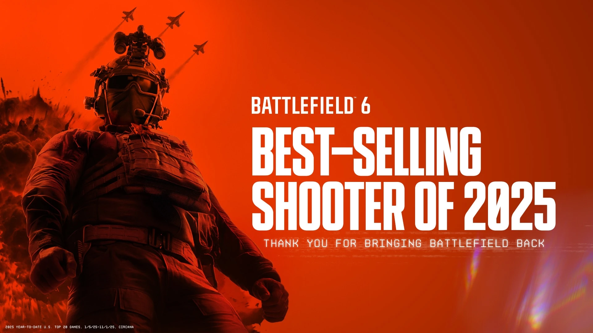
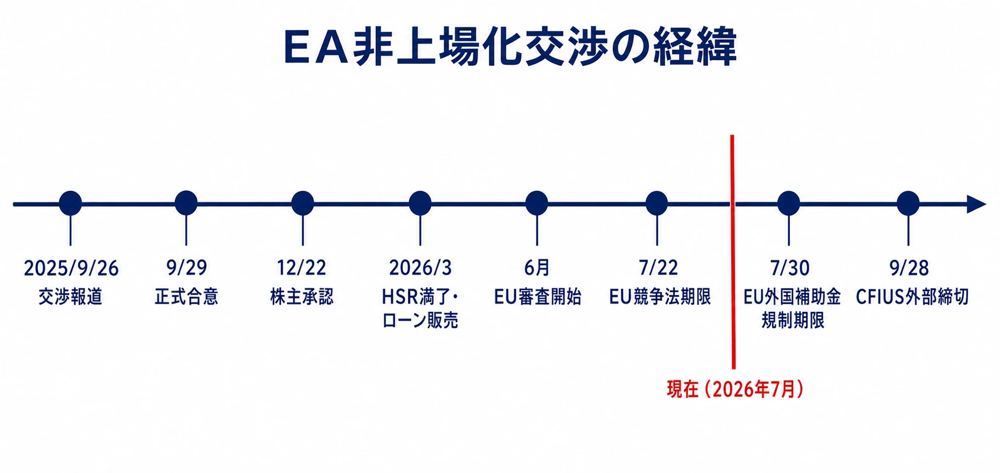
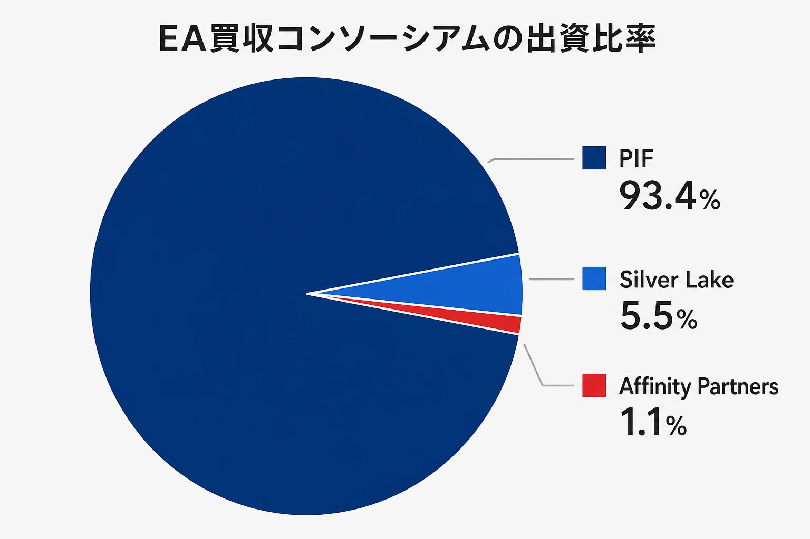
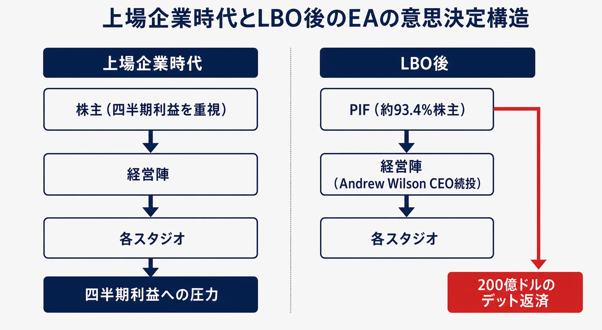
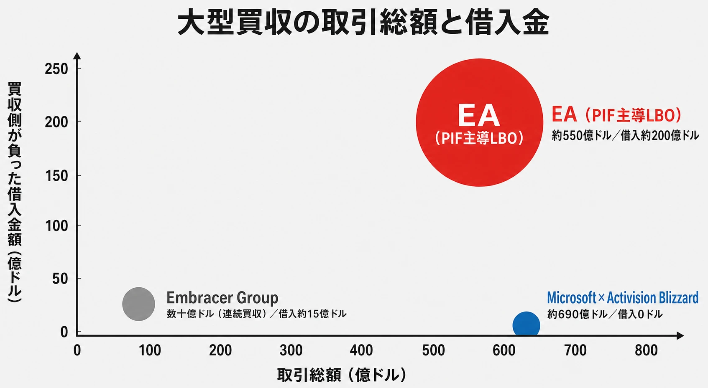

# EA非上場化（LBO）完全解説：史上最大のゲーム業界買収とパブリッシャー経営構造の変化

> **注意：本稿は、2026年7月時点で進行中のEA非上場化案件を扱っている。**
>
> 規制審査、契約条件、クロージング時期、各社の発表内容は今後急速に変化する可能性がある。本稿の状況整理や見通しは執筆時点のものであり、最新情報と一致しない場合がある。

## エグゼクティブサマリー

2025年9月29日、エレクトロニック・アーツ（EA）はサウジアラビアの政府系ファンド「PIF（Public Investment Fund）」、テクノロジー特化型プライベートエクイティ「Silver Lake」、そしてジャレッド・クシュナー（トランプ大統領の娘婿）が率いる「Affinity Partners」のコンソーシアムに対し、 **総額約550億ドル（企業価値ベース）** での売却に合意した。これは史上最大のLBO（レバレッジド・バイアウト）として記録されており、2007年の米電力会社TXUの買収（企業価値ベースで約450億ドル）を更新するものである[[1](#ref-1)][[2](#ref-2)]。

本稿では、この取引の構造・背景・出資比率・負債の仕組み・ゲーム開発への影響・過去の比較事例・業界再編の波及効果を、ゲームプランナー視点で解説する。

***

## 第1章：「LBO（レバレッジド・バイアウト）」とは何か

LBOとは「借りたお金で会社を買う手法」である。買収対象の会社自体を担保・返済原資として大量の借入を行い、少ない自己資金で大きな会社を手に入れる財務テクニックだ。

**日常的な例えで言えば**、3,000万円の家を頭金600万円・住宅ローン2,400万円で買うようなものである。ただしこの場合は買った家が毎月ローンを返し続けなければならない、という点で通常の住宅ローンとは異なる。

EA買収のケースでは以下の構造となっている。

| 項目 | 金額 |
|------|------|
| 企業価値（EV） | 約550億ドル |
| 株主への提示価格 | 1株210ドル（2025年9月25日終値168.32ドル比で約25%のプレミアム） |
| コンソーシアムの現金・株式出資（エクイティ） | 約364億ドル |
| 借入金（デット） | 約200億ドル（JPモルガン単独でコミット） |
| レバレッジ比率（負債/EBITDA） | 約6倍（FY2027予想EBITDA約31億ドル基準） |

この200億ドルの借金は、EAという会社が自ら背負って返済し続けなければならない負債である。年間EBITDAの試算約31億ドルに対して200億ドルの負債は、財務的に非常に高い負荷を意味する。なお、算出基準によっては調整後レバレッジを7.4倍とする分析機関の試算もあり、見積もり方法によって幅がある点には留意が必要だ[[3](#ref-3)][[4](#ref-4)]。

***

## 第2章：買収の経緯と時系列

### 2.1 なぜこのタイミングだったのか

EAは2024〜2025年にかけてゲーム開発の苦境を経験していた。2024年2月には約670名の人員削減を実施し、Respawnのスター・ウォーズFPS新作をキャンセル、BioWareも縮小した[[5](#ref-5)]。

一方で2025年10月には **Battlefield 6の発売** が控えており、市場では「このタイミングで売却するのは株価上昇前の機会損失ではないか」という声も上がった。実際にBattlefield 6は発売から3日で700万本を売り上げてシリーズ史上最大のローンチとなり、同年12月に締めた四半期（2026年度第3四半期）の純売上高（ネットブッキング）は前年比38%増の30.5億ドルを記録するなど、LBO発表後にEAの業績は大きく改善した[[6](#ref-6)][[7](#ref-7)]。


*画像出典（引用）：Electronic Arts公式 [Battlefield 6公式ページ](https://www.ea.com/en/games/battlefield/battlefield-6/buy) の配布画像。内容無改変・WebP変換。*

### 2.2 交渉から現在までの経緯

- **2025年9月26日（金）**：Bloombergなどが、EAがSilver Lake・PIF・Affinity Partnersと非公開化交渉中と報道。EA株が発表直後に約15%急騰した[[8](#ref-8)]
- **2025年9月29日（月）**：EAが取締役会承認のもと正式合意を発表[[1](#ref-1)]
- **2025年12月22日**：EA株主総会で買収案が承認される（賛成票約99%）[[9](#ref-9)]
- **2026年2月〜3月**：米国HSR（独占禁止法事前申告）待機期間が満了し、JPモルガン主導で57.5億ドルの国際協調ローンの販売が開始された[[10](#ref-10)]
- **2026年6月**：EU競争当局が審査を開始し、7月22日を一次審査の期限として設定。並行してEU外国補助金規則（FSR）の審査も7月30日を期限として進行中[[11](#ref-11)][[12](#ref-12)]
- **当初のクロージング期限は2026年6月30日だったが、CFIUS（対米外国投資委員会）による国家安全保障審査が長引いたため未達成に終わり、契約上の外部締切は2026年9月28日へ延長された。規制上の理由で取引が不成立になった場合、コンソーシアム側からEAへ10億ドルの逆解約金（リバース・ブレークフィー）が支払われる契約になっている**[[13](#ref-13)]
- **2026年7月現在**：米国HSRは通過済み。CFIUSは9月28日の外部締切に向けて審査継続中。EUの最終判断待ちの状態[[13](#ref-13)]


*図：交渉報道からCFIUS外部締切までの主要イベントと、2026年7月現在の位置。*

***

## 第3章：出資コンソーシアムの構成と各プレイヤーの戦略

### 3.1 所有比率の詳細

ブラジルの独占禁止当局（CADE）への申請書類から、内訳が明らかになっている[[14](#ref-14)]。

| 出資者 | 所有比率 |
|--------|---------|
| PIF（サウジアラビア公共投資ファンド） | 約93.4%（既存9.9%株のロールオーバーを含む） |
| Silver Lake（シルバーレイク） | 5.5% |
| Affinity Partners | 1.1% |


*図：PIFが約93.4%を占める出資構成。*

この内訳から明らかなのは、実質的にEAはサウジアラビア国家ファンドの傘下に入るという点である。Silver LakeとAffinity Partnersは財務的・戦略的知見をもたらす少数株主の立場だ[[14](#ref-14)]。

### 3.2 PIFの戦略的意図：「Vision 2030」とゲーム産業

PIFによるゲーム投資は、サウジアラビアが石油依存から脱却しデジタル・エンターテインメント大国を目指す「Saudi Vision 2030」の中核事業である。その傘下のSavvy Games Groupは2021年設立で、ゲーム・eスポーツへの投資に総額380億ドルを割り当てている[[15](#ref-15)]。

PIF・関連会社が保有する主なゲーム関連投資（EAを除く）は次の通りである。ただし、いずれも売買が継続しており、比率は変動する点に注意が必要だ。

| 会社 | 保有比率（目安） | 備考 |
|------|---------|--------------|
| 任天堂 | 数％台まで縮小傾向 | 2022年に約5%で取得後、2024年後半から段階的に売却を継続。2024年11月時点で7.54%→6.3%、同年12月に5.26%、直近では4%台まで低下している[[16](#ref-16)][[17](#ref-17)] |
| ネクソン／コーエーテクモホールディングス／NCSoft／スクウェア・エニックス・ホールディングス | いずれも約10% | 2026年1月、PIFはこれらの株式を含む約120億ドル相当をSavvy Games Groupへ移管すると発表[[18](#ref-18)] |
| カプコン | PIF本体で約5%、別法人EGDC（Electronic Gaming Development Company）で約6.04% | PIFとEGDCはいずれもサウジアラビア系の投資主体だが別法人であり、2026年4月時点でEGDCが5%から6.04%へ持ち分を引き上げたことが関東財務局への大量保有報告書で判明している[[19](#ref-19)] |
| Scopely（Savvy Games Groupの100%子会社） | 100% | 2023年に49億ドルで完全買収[[20](#ref-20)] |

国民の中央値年齢が比較的若いサウジアラビアの人口構成もあり、ゲーム・eスポーツへの親和性は高く、EA買収はその「旗艦投資」と位置づけられる[[21](#ref-21)]。

### 3.3 Silver Lakeの位置づけ

Silver Lakeは運用資産1,000億ドルを超えるテクノロジー特化型PE（プライベートエクイティ）である。Unityへの戦略投資や、2025年3月に完了したEndeavorの完全買収などの実績があり、EA買収ではオペレーション改革と「ライブサービス最適化」の知見を提供する役割を担うとみられる[[22](#ref-22)]。

### 3.4 Affinity Partnersの位置づけ

2021年にジャレッド・クシュナーが設立したフロリダ拠点のファンドで、テクノロジー・成長株投資を行う。PEとしての実績よりもトランプ政権との政治的コネクションが価値の一部とされており、CFIUS審査において規制上の摩擦を和らげる戦略的資産として見られているという分析もある[[21](#ref-21)]。

***

## 第4章：LBOによる負債構造の詳細と返済プレッシャー

### 4.1 200億ドルの負債が意味するもの

JPモルガンが全額コミットした200億ドルの負債は、ゲーム・テック企業に対する単一金融機関による史上最大規模のLBO資金供与とされる。このうち約180億ドルがクロージング時に実行される予定で、シンジケートローン・ハイイールド債と2億ドルの流動性ファシリティで構成される。格付けはシングルB（投機的格付け）想定である[[3](#ref-3)][[23](#ref-23)]。

### 4.2 返済プレッシャーがゲーム開発にどう伝わるか

EAのFY2027予想EBITDA約31億ドルに対して200億ドルの負債は約6倍の負債倍率となる（分析機関により7.4倍とする試算もある）。年間の利息負担だけでも数億ドル規模になるとみられ、この財務負担はゲーム開発の意思決定構造に直接影響しうる。

**上場企業時代の決定構造：**
```
株主（四半期利益を重視） → 経営陣 → 各スタジオ
```
→ 「今年・来年の売上」への圧力

**LBO後の決定構造：**
```
PIF（約93.4%株主）→ 経営陣（Andrew Wilson CEO続投） → 各スタジオ
           ↑
     200億ドルのデット返済（JPモルガン主導のシンジケート）
```
→ 「キャッシュフローを生み続ける証明済みIPへの集中」圧力

WPI（ウースター工科大学）ゲーム開発プログラムの研究者は、経営層の変化はゲームを実際に作っている人々から遠い場所で起きるものであり、直接的な影響はどのスタジオにどれだけ予算が配分されるか、どのプロジェクトがグリーンライトされどれがキャンセルされるかという形で現れる、と指摘している[[21](#ref-21)]。


*図：上場企業時代とLBO後で異なる、経営陣・各スタジオへの圧力の経路。*

***

## 第5章：ゲーム開発・グリーンライト判断への影響

### 5.1 上場時代の「四半期の暴政」

上場企業は3ヶ月ごとの決算発表で株主への説明責任を負う。AAA（大作）ゲームの開発には3〜6年かかることも珍しくなく、例えばBattlefield 6はローンチまでに数年の投資が続いていた。この長期開発サイクルは四半期型の株主ガバナンスと根本的に相性が悪く、EA自身も四半期の要求から解放されることで長期的な賭けができると強調している[[1](#ref-1)]。

### 5.2 非上場化で何が変わるか（楽観論）

- 開発サイクルの延長が許容されやすくなる可能性がある。次の決算を意識せずに開発できるようになれば、ゲーム会社に余裕が生まれ、より多くの・より良いゲームにつながりうるという見方がある[[21](#ref-21)]
- 株式市場からの短期収益最大化プレッシャーから解放されれば、過度なマネタイズを見直せるとする見方もある[[21](#ref-21)]
- PIFの資本力を使い、資金に困っている中小スタジオを取り込む積極的な買収が想定される

### 5.3 非上場化で何が変わるか（悲観論・実際に起きていること）

理論と現実のギャップが、すでに表れている。

#### レイオフの波

- **2026年3月**：DICE、Criterion、Ripple Effect、Motiveを含むBattlefieldスタジオ群から約300人が削減された。これはBattlefield 6が発売直後で、シリーズ史上最大の成功を収めた直後でもある[[24](#ref-24)]
- **2026年6月**：カスタマーサポート（Fan Care）・トラスト＆セーフティ・IT・採用チームに、2026年で3度目となるレイオフが実施された[[25](#ref-25)]
- EAはFY2026（2026年3月期）に記録的なネットブッキングを達成したにもかかわらず、年内に複数回のレイオフが断行されている

これは「成果を上げても削減される」という、デット返済を優先するLBO的コスト構造の一つの現れと解釈できる。

#### グリーンライトの傾向変化

ここでいう「グリーンライト」とは、企画やプロジェクトについて、会社が正式に開発継続や本制作への移行を承認する判断を指す。したがって「グリーンライトされる」とは、単にアイデアが評価されることではなく、予算や人員を投入して開発を進める承認が出るという意味である。

投資家・アナリストの多くは、実績あるライブサービスIPへの集中と、新規IPや実験的プロジェクトの縮小を予測している。実際の動向として、マーベル『ブラックパンサー』ゲームを開発していたCliffhanger Gamesがクローズされた一方、BioWareのMass Effect 5はプリプロダクション段階で継続しているとされる[[21](#ref-21)][[5](#ref-5)]。

EAの公式声明では「クリエイティブの独立性は維持される」「コンソーシアムはEAのクリエイティビティへの投資だ」と繰り返し強調されているが、現場開発者からは懸念の声も上がっている[[26](#ref-26)][[27](#ref-27)]。

### 5.4 AIとコスト削減の連動

EAは生成AIを使ったゲーム開発ワークフローの効率化を積極的に表明しており、「Battlefield Labs」という形でAI活用の実験プラットフォームも立ち上げている。LBO後はAIによる自動化を使った開発コスト削減が加速するとみられており、クリエイティブな判断が数値管理・AI効率化に置き換えられる可能性を懸念する声が業界にはある[[28](#ref-28)]。

***

## 第6章：過去のPEによるゲーム業界買収事例との比較

### 6.1 Embracer Group：「LBOの教訓」

EAのLBOを考えるうえで示唆的な先行事例が、スウェーデンのEmbracer Group（旧THQ Nordic）である。

Embracer Groupは2019年〜2022年の超低金利時代にかけて、Gearbox（Borderlands）、Saber Interactive（KOTOR Remake）、Crystal Dynamics（Tomb Raider）など900以上のIPを次々と買収した。この過程で初めて本格的に借入に踏み切り、2023年末には負債残高15億ドルを抱えるに至った[[29](#ref-29)]。

ところが2023年に予定していた大型の戦略的パートナーシップが破談になったことで資金計画が崩壊。その後18ヶ月で以下が起きた。

- ゲーム29本（未発表）をキャンセル
- 複数スタジオを閉鎖し、1,400人以上を解雇
- Saber Interactive、Gearboxを売却して負債圧縮
- 最終的に3社に分割・上場（2024年4月）[[29](#ref-29)][[30](#ref-30)]

Embracer GroupのCEOは事後的に、ゲーム会社、特にAAAゲーム会社には負債が不向きだという趣旨の発言をしている[[29](#ref-29)]。

**EmbracerとEAの比較**

| 項目 | Embracer Group | EA（LBO後） |
|------|---------------|------------|
| 負債残高 | 約15億ドル | 約200億ドル |
| 負債/EBITDA比率 | 約3〜4倍（崩壊時） | 約6倍（分析により7.4倍） |
| 主要資本源 | 公開市場中心 | PIFとJPモルガン |
| 収益の安定性 | 多様なIPだが不安定 | ライブサービス中心で比較的安定 |
| 取引規模 | 数十億ドル規模の連続買収 | 一括550億ドルのLBO |
| 帰結 | 分割・再上場 | 現在進行中 |

最大の差異は収益の安定性である。EAの売上の大部分はライブサービス（マイクロトランザクション、サブスクリプション）から得られる定常収益であり、これがEmbracerとは根本的に異なる点だ。JPモルガンがこの規模の貸付を単独で引き受けた背景には、EAのこの予測可能なキャッシュフローがあるとみられる[[3](#ref-3)]。

### 6.2 MicrosoftによるActivision Blizzard買収（2023年）との比較

もう一つの主要な比較対象が、Microsoftが2023年10月に完了した約690億ドルのActivision Blizzard買収である[[31](#ref-31)][[32](#ref-32)]。

| 比較軸 | Microsoft × Activision Blizzard | PIF × EA |
|--------|--------------------------------|----------|
| 総額 | 約690億ドル | 約550億ドル |
| 買収形態 | 戦略的M&A（株式取得） | LBO（借入主導の非公開化） |
| 負債構造 | Microsoftが全額現金出資（借入なし） | 200億ドルの借入をEAが負担 |
| 買収目的 | Game PassとモバイルIPの強化 | PIF Vision 2030・ライブサービス投資 |
| 規制障壁 | FTC・CMA・EU（2年超） | CFIUS（国家安保）・EU（継続中） |

Microsoftの場合はMicrosoft自身がコストを負担するため、Activision Blizzardに財務的な返済負荷は生じない。一方EAのLBOでは、買収された側が借金を背負う構造が根本的に異なる。

### 6.3 過去の主要なゲーム業界の財務的転換点一覧

| 年 | 事例 | 金額 | 影響 |
|----|------|------|------|
| 2007 | Vivendi → Activision合併（ATVI設立） | 約180億ドル | CoD・Blizzard統合の礎 |
| 2023 | Microsoft → Activision Blizzard | 約690億ドル | 最大規模の戦略買収 |
| 2022〜2023 | Embracer Group連続買収 | 数十億ドル | LBO失敗事例 |
| 2023 | Savvy Games → Scopely | 49億ドル | PIF系初の完全子会社化 |
| 2025 | PIF/Silver Lake/Affinity → EA | 約550億ドル | 史上最大のLBO |


*図：EA、Microsoft×Activision Blizzard、Embracer Groupの取引総額と買収側の借入金額の比較。*

***

## 第7章：業界再編への波及効果

### 7.1 残存上場パブリッシャーの地殻変動

EAが非上場化すると、EA株を通じてゲーム業界に投資していた大口投資家は、投資先をTake-Two Interactiveなど別の上場パブリッシャーへ移すか、ゲーム業界への投資自体を減らすかを判断することになる。発表直後、Take-Two Interactiveの株価は約4.6%上昇したと報じられており、市場では同社がEAに代わる「NASDAQ最大のピュアプレイ（純粋な）大手ゲームパブリッシャー」というポジションを引き継いだという見方が出ている[[33](#ref-33)]。ただしTake-TwoはGrand Theft Auto VIの発売延期（2026年11月19日へ）を経験しており、ゲーム一作の遅延がいかに株価に影響するかを示す事例でもある[[34](#ref-34)][[35](#ref-35)]。

**Ubisoft** は長期的な株価下落に苦しんでいる。2018年半ばに付けた過去最高値（約108ユーロ）から2026年7月時点までに時価総額ベースで約93%が失われており、2025年単年でも約43%下落した。Tencentとの合弁会社「Vantage Studios」（Assassin's Creed、Far Cry、Rainbow Sixの開発・運営を担う新会社）を設立するなど再建策を打っているが、市場では「次のPE買収ターゲット」として名前が挙がることもある[[36](#ref-36)][[37](#ref-37)]。

### 7.2 市場構造の変化とメガLBOの復活

EAが上場廃止されることで、投資家がゲーム業界に触れるための公開株式が希少化する。これは残存銘柄（Take-Two、Roblox等）の評価倍率を押し上げる方向に働きうるという分析がある。

同時に、大型PE・政府系ファンドに買収された巨大パブリッシャーと、独立系の中規模パブリッシャー（上場株式市場の四半期プレッシャー・高金利にさらされ続ける）との間で、資本力の差が開発規模・人材獲得力に直結する構造が強まる可能性がある。

2020〜2023年の高金利環境でLBOは停滞していたが、2025年以降は複数の分析機関が「プライベートエクイティ業界が数兆ドル規模の未投資資金（ドライパウダー）を抱えている」と指摘しており、その規模の推計は１兆ドル台後半から3兆ドル台まで、集計方法によって幅がある。EA案件の成功が、類似のソフトウェア・エンターテインメント企業への大型LBOが連続する契機になりうるとの見方があり、この文脈でUbisoft・スクウェア・エニックスなどが潜在的な次の対象として観測されている。

### 7.3 地政学的リスクと批判

PIFのゲーム業界への大量投資に対しては、人権団体が「スポーツウォッシング（人権問題から注意をそらす目的での文化投資）」だと批判している[[21](#ref-21)]。

CFIUSの審査も、単なる独占禁止法審査ではなく、外国政府系ファンドが数億人のプレイヤーのデータと文化的インフラを支配することへの安全保障上の懸念という次元を含むとされる。米議会関係者からも、外国の影響と国家安全保障上のリスクを懸念する声が上がっている[[21](#ref-21)]。

これはゲームという文化産業が持つ地政学的側面を鮮明に示す事例であり、ゲームプランナーとしても「ゲームはソフトパワーである」という視点を持つ重要性が改めて浮き彫りになっている。

***

## 第8章：ゲームプランナーへの示唆

### 8.1 グリーンライト判断が変わる

LBO下では「期待値が計算しやすいプロジェクト」が優先されやすくなる。具体的には次のような傾向が予想される。

グリーンライトされやすくなると見られるのは、実績あるIPの続編、ライブサービス型コンテンツ追加、高確度のアップデートである。逆にグリーンライトされにくくなると見られるのは、新規IP、実験的なゲームプレイ、多年度にわたる長期開発だ。

ゲームプランナーとして企画立案をする際、この企画はいつ・どのくらいのリターンを生むかを財務的に示す能力の重要性が、上場時代よりも高まる可能性がある。

### 8.2 「ライブサービス」への傾斜がさらに強まる

EAの収益の大部分はライブサービスから得られている。LBO後は継続的なキャッシュフローを生み続けるゲームデザインが最重視されやすく、パッケージ型の一回売り切りゲームは投資回収の確実性が低いとみなされやすくなる可能性がある。

### 8.3 スタジオ規模・機能の変化を理解する

2026年に続いているEAのレイオフは、成果が出ているタイトルのスタジオさえも縮小されうるという現実を示している。新米プランナーにとっては、スタジオの所有構造と資本構造を理解したうえでキャリアを選択することが、これまで以上に重要な時代になっている。

***

## 第9章：取引の現状（2026年7月時点）

| 規制 | 状況 |
|------|------|
| 株主承認 | 完了（2025年12月22日、賛成約99%） |
| 米国HSR（独禁法） | 通過済み |
| CFIUS（米国安全保障審査） | 契約上の外部締切2026年9月28日まで継続中 |
| EU競争法 | 7月22日に一次審査期限 |
| EU外国補助金規制（FSR） | 7月30日に期限 |
| 総合見通し | 規制上不成立の場合、コンソーシアムからEAへ10億ドルの逆解約金が支払われる契約 |

Andrew WilsonはCEOとして続投する予定で、本社はカリフォルニア州レッドウッドシティに留まる。FY2026（2026年3月期）は記録的なネットブッキングを記録しており、Battlefield 6の成功によって財務基盤は比較的良好な状態でLBO完了に向かっている[[1](#ref-1)]。

***

## まとめ：「ゲームを作ること」と「ゲーム産業の資本構造」の交点

EAの非上場化は、ゲーム史上最大の財務トランザクションであると同時に、誰がゲームの意思決定を行うのかという根本的な問いを突きつける出来事である。

四半期ごとの株主圧力から解放されることは、長期的に見ればゲーム開発の自由度を高める可能性を秘めている。しかし実際には、200億ドルという前例のない負債が、リターンの確実性を最優先する別種の圧力を生み出している。

Embracerの事例が示すように、ゲームはヒットを予測できない産業であり、負債による財務的強制力はクリエイティブなリスクテイクと根本的に相性が悪い側面がある。一方でEAの場合、ライブサービスによる定常収益がその緩衝材になるかどうかが、今後数年の観察ポイントとなる。

ゲームプランナーにとってこの一連の動きは、作りたいゲームを作るという理想と、投資回収ができる企画かという現実の間で常に意思決定をしているという、この産業の本質を改めて浮かび上がらせる事例である。業界が資本化・グローバル化する中で、財務・経営構造の理解はゲームプランナーの必須教養になりつつある。

## References

<a id="ref-1"></a>1. [EA Announces Agreement to be Acquired by PIF, Silver Lake, and Affinity Partners for $55 Billion][1] - EA公式IR、買収合意の一次発表。

<a id="ref-2"></a>2. [TXU agrees to record $45 billion private equity buyout][2] - CNN Moneyによる2007年TXU買収の当時の報道。企業価値ベースの金額を確認するために参照した。

<a id="ref-3"></a>3. [Electronic Arts LBO backed by $20B debt financing commitment][3] - PitchBookによる資本構成・レバレッジ比率の分析。

<a id="ref-4"></a>4. [Electronic Arts Agrees to Be Taken Private...][4] - Octusによる調整後レバレッジ7.4倍の代替試算。

<a id="ref-5"></a>5. [Amid nearly 700 layoffs at EA, Mass Effect 5 reportedly remains in pre-production][5] - GamesRadarによる2024年の人員削減とプロジェクト動向の報道。

<a id="ref-6"></a>6. [Battlefield 6 Shatters Records Becoming the Biggest Launch in Franchise History][6] - EA公式IR、発売後3日間の販売実績発表。

<a id="ref-7"></a>7. [EA Posts Record $3 Billion Quarter on Battlefield 6 Dominance][7] - fintoolによる2026年度第3四半期決算の報道。

<a id="ref-8"></a>8. [Electronic Arts Nears Takeover by Silver Lake, Saudi's PIF][8] - Bloombergによる2025年9月26日の交渉報道と株価反応。

<a id="ref-9"></a>9. [Electronic Arts Shareholders Approve $55 Billion Sale to Saudis][9] - Bloombergによる2025年12月22日の株主総会承認の報道。

<a id="ref-10"></a>10. [Banks launch sale of EA buyout's $5.75 billion cross-border loan][10] - Reutersによる2026年3月のローン販売開始の報道。

<a id="ref-11"></a>11. [Saudis seek EU approval for $55 billion EA deal, decision by July 22][11] - ReutersによるEU競争法審査期限の報道。

<a id="ref-12"></a>12. [Saudi Public Investment Fund files EA takeover for EU foreign subsidy review][12] - MLexによるEU外国補助金規制審査の報道。

<a id="ref-13"></a>13. [Electronic Arts Stock Trades $9 Below Its $210 Buyout Price][13] - TIKRによる、クロージング期限延長と逆解約金条項の分析。

<a id="ref-14"></a>14. [Saudi Arabia's PIF set to own 93.4% of EA in proposed takeover][14] - PocketGamer.bizによる、ブラジル独禁当局への申請書類に基づく出資比率の報道。

<a id="ref-15"></a>15. [Saudi Arabia Gaming & Esports Strategy][15] - Vision 2030公式サイトによるSavvy Games Groupの投資規模の説明。

<a id="ref-16"></a>16. [Saudi Arabia's Sovereign Wealth Fund PIF Trims Nintendo Stake Again][16] - Bloombergによる2024年11月の任天堂株売却報道。

<a id="ref-17"></a>17. [The Public Investment Fund reduces its holdings in Japanese Nintendo from 5.26% to 4.19%][17] - PIFによる任天堂株の継続的な売却を報じた記事。

<a id="ref-18"></a>18. [Saudi Arabia's PIF to transfer $12bn in gaming shares to Savvy Games Group][18] - PocketGamer.bizによる、ネクソン・コーエーテクモホールディングス等の株式のSavvy Games Groupへの移管報道。

<a id="ref-19"></a>19. [Saudi Arabia's Electronic Gaming Development Company Ups Its Capcom Stake][19] - thisweekinvideogamesによる、EGDC（PIFとは別法人）のカプコン出資比率引き上げの報道。

<a id="ref-20"></a>20. [Savvy Games Group Completes Acquisition of Scopely for $4.9 Billion][20] - PIF公式によるScopely完全子会社化の発表。

<a id="ref-21"></a>21. [How Electronic Arts' $55 billion go-private deal could impact the video game industry][21] - ABC Newsによる、業界関係者・専門家への取材を含む包括的な影響分析記事。

<a id="ref-22"></a>22. [Endeavor Announces Completion of Acquisition by Silver Lake][22] - Silver Lake公式による、Endeavor買収完了と自社ファンド規模の説明。

<a id="ref-23"></a>23. [JPMorgan Starts Selling a Chunk of $20 Billion EA Buyout Debt][23] - Bloombergによる2026年1月の債務販売報道。

<a id="ref-24"></a>24. [EA laid off staffers across Battlefield studios to 'better align' its teams][24] - Engadgetによる2026年3月のBattlefieldスタジオ群のレイオフ報道。

<a id="ref-25"></a>25. [EA Lays Off Unknown Number of Individuals in Fan Care and Recruitment][25] - Kotakuによる2026年6月の3度目のレイオフ報道。

<a id="ref-26"></a>26. [EA claims "our creative freedom and player-first values will remain intact" after buyout][26] - GamesRadarによるEA公式声明の報道。

<a id="ref-27"></a>27. [EA says buyout won't result in loss of creative control][27] - Game Developerによる同様のEA公式見解の報道。

<a id="ref-28"></a>28. [What the US$55 billion Electronic Arts takeover means for video game workers and the industry][28] - The Conversationによる、AI活用とコスト削減に関する分析記事。

<a id="ref-29"></a>29. [Embracer Group is coming to an end – lessons abound for games industry][29] - upptic.comによるEmbracer Groupの経営破綻分析。

<a id="ref-30"></a>30. [Swedish gaming group Embracer to split into three listed companies][30] - Reutersによる2024年4月の3社分割報道。

<a id="ref-31"></a>31. [Microsoft acquires Activision Blizzard in $69-billion gaming deal][31] - LA Timesによる2023年のMicrosoft-Activision Blizzard買収完了報道。

<a id="ref-32"></a>32. [Microsoft completes $69bn deal to buy Call of Duty maker Activision Blizzard][32] - The Guardianによる同買収の規制クリアランス報道。

<a id="ref-33"></a>33. [EA Leveraged buyout: CFIUS Timeline, Post-Close Margin Analysis][33] - pressplayfinanceによる、Take-Two株価への波及効果を含む分析。

<a id="ref-34"></a>34. [GTA 6 is locked in for November 19, 2026, according to Take-Two Interactive][34] - TechRadarによるGrand Theft Auto VIの発売日確定報道。

<a id="ref-35"></a>35. [Play on or game over? A look back at 2025 for the video game industry][35] - CNBCによる2025年のゲーム業界振り返り記事。

<a id="ref-36"></a>36. [Ubisoft Stock Crash 2026: $1.4B Record Loss, 93% Down][36] - shattered.ioによる、Ubisoft株価の下落幅・ピーク時期の分析。

<a id="ref-37"></a>37. [Ubisoft launches its new Tencent-backed subsidiary][37] - Engadgetによる、Vantage Studios設立の報道。

[1]: https://ir.ea.com/press-releases/press-release-details/2025/EA-Announces-Agreement-to-be-Acquired-by-PIF-Silver-Lake-and-Affinity-Partners-for-55-Billion/default.aspx
[2]: https://money.cnn.com/2007/02/26/news/companies/txu/
[3]: https://pitchbook.com/news/articles/electronic-arts-lbo-backed-by-20b-debt-financing-commitment
[4]: https://octus.com/resources/articles/electronic-arts-agrees-to-be-taken-private/
[5]: https://www.gamesradar.com/amid-nearly-700-layoffs-at-ea-mass-effect-5-reportedly-remains-in-pre-production-as-bioware-focuses-on-dragon-age-dreadwolf/
[6]: https://ir.ea.com/press-releases/press-release-details/2025/Battlefield-6-Shatters-Records-Becoming-the-Biggest-Launch-in-Franchise-History/default.aspx
[7]: https://fintool.com/news/ea-battlefield-6-record-quarter-final-earnings
[8]: https://www.bloomberg.com/news/articles/2025-09-26/electronic-arts-is-said-to-near-takeover-by-silver-lake-pif
[9]: https://www.bloomberg.com/news/articles/2025-12-22/electronic-arts-shareholders-approve-55-billion-sale-to-saudis
[10]: https://www.reuters.com/business/banks-launch-sale-ea-buyouts-575-billion-cross-border-loan-2026-03-16/
[11]: https://www.reuters.com/legal/litigation/saudis-seek-eu-approval-55-billion-ea-deal-decision-by-july-22-2026-06-17/
[12]: https://www.mlex.com/mlex/mergers-acquisitions/articles/2493190/saudi-public-investment-fund-files-ea-takeover-for-eu-foreign-subsidy-review
[13]: https://www.tikr.com/blog/electronic-arts-stock-trades-9-below-its-210-buyout-price-what-the-deal-spread-and-record-fy26-results-tell-investors
[14]: https://www.pocketgamer.biz/saudi-arabias-pif-set-to-own-934-of-ea-in-proposed-takeover/
[15]: https://vision2030.ai/vision/programmes/gaming-esports-strategy/
[16]: https://www.bloomberg.com/news/articles/2024-11-13/saudi-arabia-s-sovereign-wealth-fund-pif-trims-nintendo-stake-again
[17]: https://www.arabictrader.com/en/news/stock-market/174926/the-public-investment-fund-reduces-its-holdings-in-japanese-nintendo-from-526-to-419
[18]: https://www.pocketgamer.biz/saudi-arabias-pif-to-transfer-12bn-in-gaming-shares-to-savvy-games-group/
[19]: https://thisweekinvideogames.com/news/saudi-arabia-electronic-gaming-development-company-ups-its-capcom-stake/
[20]: https://www.pif.gov.sa/en/news-and-insights/newswire/2023/savvy-games-group-completes-acquisition-of-scopely-for-fourty-nine-billion/
[21]: https://abcnews.go.com/Technology/wireStory/electronic-arts-55-billion-private-deal-impact-video-126055787
[22]: https://www.silverlake.com/endeavor-announces-completion-of-acquisition-by-silver-lake/
[23]: https://www.bloomberg.com/news/articles/2026-01-30/jpmorgan-starts-selling-a-chunk-of-20-billion-ea-buyout-debt
[24]: https://www.engadget.com/gaming/ea-laid-off-staffers-across-battlefield-studios-to-better-align-its-teams-173617672.html
[25]: https://kotaku.com/ea-layoffs-fan-care-recruitment-hyderabad-2000708971
[26]: https://www.gamesradar.com/games/ea-claims-our-creative-freedom-and-player-first-values-will-remain-intact-after-buyout-and-even-with-the-new-debt-of-usd20-billion-it-will-work-to-grow-the-company/
[27]: https://www.gamedeveloper.com/business/ea-says-it-will-retain-creative-control-under-new-private-owners
[28]: https://theconversation.com/what-the-us-55-billion-electronic-arts-takeover-means-for-video-game-workers-and-the-industry-267206
[29]: https://upptic.com/embracer-group-is-coming-to-an-end-lessons-abound-for-games-industry/
[30]: https://www.reuters.com/technology/embracer-split-into-three-listed-companies-2024-04-22/
[31]: https://www.latimes.com/entertainment-arts/business/story/2023-10-13/microsoft-activision-blizzard-acquisition-deal
[32]: https://www.theguardian.com/business/2023/oct/13/microsoft-deal-to-buy-call-of-duty-maker-activision-blizzard-cleared-by-uk
[33]: https://pressplayfinance.com/ea-pif-acquisition-cfius-2026/
[34]: https://www.techradar.com/gaming/gta-6-is-locked-in-for-november-19-2026-according-to-take-two-interactive-despite-delay-rumors-and-marketing-starts-soon
[35]: https://www.cnbc.com/2025/12/28/play-on-or-game-over-a-look-back-at-2025-for-the-video-game-industry.html
[36]: https://shattered.io/ubisoft-stock-crash-2026/
[37]: https://www.engadget.com/gaming/ubisoft-launches-its-new-tencent-backed-subsidiary-194750403.html

----

この文書は、Perplexity、Claude、OpenAI Codex の3つのAIの支援を受けて著述されたものです。引用画像を除き、MIT License にて提供されています。
