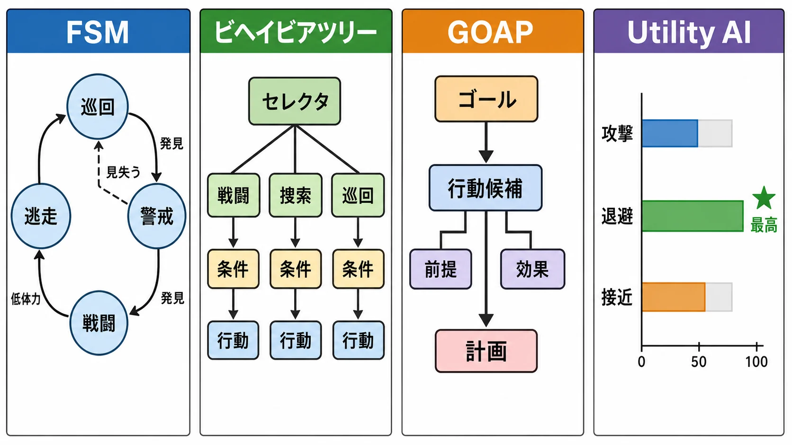
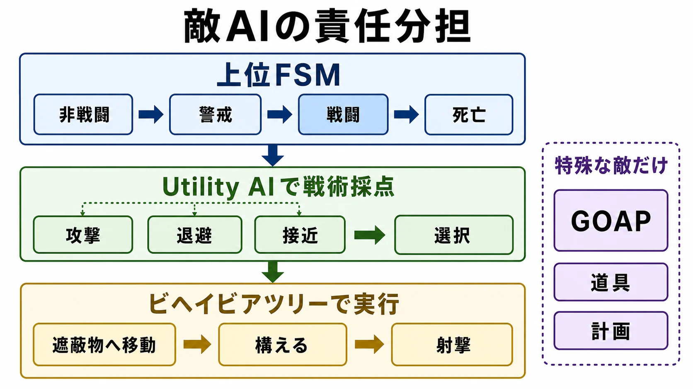

# 敵AI設計の実務――FSM・ビヘイビアツリー・GOAP・Utility AIをどう選び、どう運用するか

敵がこちらを見つけ、遮蔽物へ走り、仲間と挟み撃ちをする。文章にすれば簡単だ。しかし実装では、視認に必要な時間、遮蔽物が埋まった場合の代案、手榴弾が来たときの中断まで決めなければならない。

敵AI（Artificial Intelligence、ここではゲーム内キャラクターの知覚・判断・行動制御）の難しさは、最適な行動を計算することだけではない。こちらの位置を正確に把握して集中砲火する敵は、透視や後出しに見えやすい。反対に、味方につかえ、同じ壁へ走り続ける敵は故障に見える。

つまり必要なのは、単純な「頭の良さ」ではない。**プレイヤーが観察し、予測し、対処できる賢さ** である。ゲームAIの目的は知能そのものの再現ではなく、狙った体験を成立させることだという整理は、実務を考える出発点になる。[[1](#ref-1)]

本記事は、有限状態機械（FSM：Finite State Machine）、ビヘイビアツリー、GOAP（Goal-Oriented Action Planning、目標指向型アクションプランニング）、Utility AI（効用ベースAI）を、歴史ではなく制作手段として比較する。各方式の歴史的な経緯は別記事「[コンピューターゲームにおけるAIの歴史](history-of-ai-in-video-games.md)」で扱っている。ここでは、何をデータにし、誰が調整し、どう壊れ方を見つけるかに集中する。

***

## 「複雑なら賢く見える」という誤解

新人プランナーが最初に外したい誤解がある。内部の推論が複雑であるほど、敵が賢く見えるとは限らない。

プレイヤーが観測できるのは、アルゴリズムではなく結果である。「発見したので叫ぶ」「被弾したので伏せる」「仲間が倒れた方向を見る」「弾切れなので隠れて装填する」。このように、状況と反応の因果が画面、音、台詞、アニメーションでつながると、単純な規則でも意図があるように見える。反応の意味が伝わらなければ、高度な計画を立てても偶然の移動に見える。ゲームAIでは、実際の知能だけでなく **知能らしさをどう見せるか** が重要だと指摘されている。[[2](#ref-2)]

したがって、意思決定方式を選ぶ前に、敵AIを次の流れへ分けて考えた方がよい。

1. **知覚**：何が見え、何が聞こえ、何を記憶しているか。
2. **意思決定**：攻撃、退避、捜索など、何を選ぶか。
3. **行動実行**：移動、照準、射撃、アニメーションをどう完了させるか。
4. **表現**：敵の判断をプレイヤーへどう伝えるか。
5. **監視**：なぜその判断になったかを開発者が追えるか。

FSMなどの4方式は、主に2番目を組み立てる方法である。経路探索、衝突回避、アニメーション制御、集団の役割分担まで自動的に解決する魔法ではない。AIが壁で詰まったとき、意思決定ではなくナビゲーション用データや当たり判定が原因ということも珍しくない。

***

## 4つの設計パターンを構造で比べる

まず全体像を並べる。ここでいう「向く」は絶対評価ではない。同じ方式でも、ツールとチーム経験によって制作コストは大きく変わる。

| 方式 | 判断の中心 | 得意なこと | 壊れやすいところ | 調整時に見たい情報 |
|---|---|---|---|---|
| FSM | 現在の状態と遷移条件 | 少数の明確なモード、強い演出制御 | 状態と遷移の組み合わせが膨張する | 現在状態、直前状態、遷移理由 |
| ビヘイビアツリー | 優先順位付きの条件分岐と処理列 | 反応的な行動、処理の再利用、可視化 | 巨大ツリー、条件の重複、中断の連鎖 | 実行中ノード、失敗箇所、共有値 |
| GOAP | ゴール、世界状態、行動の前提条件と効果 | 状況に応じた行動列の組み立て | 探索量、世界モデルの食い違い、再計画 | 選択ゴール、候補計画、棄却理由、コスト |
| Utility AI | 候補ごとの効用スコア | 複数要因の滑らかな優先順位づけ | 尺度の不統一、数値干渉、頻繁な心変わり | 全候補の内訳、曲線、最終スコア |

*4方式の判断構造を、状態遷移・木構造・計画・スコア比較として並べた概念図。*

### FSM――現在の状態を一つに絞る

**FSM** は、「巡回中」「警戒中」「戦闘中」「逃走中」のような状態と、状態を切り替える遷移条件を定義する方式である。

たとえば巡回中にプレイヤーを一定時間視認したら戦闘中へ移る。戦闘中にプレイヤーを見失い、最後に見た地点へ着いたら捜索中へ移る。現在何をしているかが明確で、ボスのフェーズやステルスゲームの警戒段階のように、モードの境界を厳密に見せたい場面と相性がよい。

問題は、状態が増えたときである。「被弾した」「仲間を発見した」「足場から落ちた」という割り込みを全状態から扱おうとすると、遷移線が急増する。似た処理も状態ごとに複製されやすい。単純な基盤であっても規模が大きくなると管理しにくい、というFSMの性質は実務上の重要な制約である。[[3](#ref-3)]

対策は、状態名を細かい動作まで分解しすぎないことだ。「右へ一歩」「二発撃つ」は上位の「戦闘中」の内部処理へ寄せる。階層化もできるが、親子のどちらが遷移を握るかという規約が必要になる。

### ビヘイビアツリー――優先順位と手順を木にする

**ビヘイビアツリー（Behavior Tree）** は、条件と行動を木構造に並べる方式である。代表的なノードは次のとおりだ。

- **セレクタ**：子を優先順に試し、成功できるものを一つ選ぶ。
- **シーケンス**：子を順番に実行し、必要な手順をつなぐ。
- **デコレータ**：体力や視認状態など、枝へ入る条件を付ける。
- **アクション／タスク**：移動、射撃、待機などを実行する。
- **サービス**：実行中の枝に必要な情報を定期的に更新する実装もある。

たとえば最上位のセレクタに「死亡処理」「手榴弾から退避」「戦闘」「捜索」「巡回」を左から並べる。戦闘の枝では「射線がある→構える→射撃する」というシーケンスを作る。セレクタとシーケンスが成功・失敗を返しながら枝を選ぶ基本構造は、公式ドキュメントでも明示されている。[[4](#ref-4)]

処理をサブツリーとして再利用しやすく、実行中の枝を示しやすい。ブラックボードと呼ばれる共有データ領域に、標的、最終目撃地点、残弾などを置く構成もある。ビジュアルエディタがあれば、プランナーも反復調整へ参加しやすい。[[5](#ref-5)]

ただし、線が見えることと、設計が読みやすいことは別である。巨大な一本のツリー、同じ条件のコピー、何段も重なったデコレータは、結局読めない。さらに、ツリーは基本的に「今の条件ならどの枝を実行するか」を書くのが得意である。複数手段から数手先の行動列を自動で組み立てるには、別の仕組みをノード内へ入れる必要がある。

### GOAP――行動の前提条件と効果から計画を探す

**GOAP** は、達成したいゴールと現在の世界状態を比較し、利用可能なアクションをつないで計画を作る考え方である。

各アクションには、少なくとも次の情報を持たせる。

| アクション | 前提条件 | 効果 | コストの例 |
|---|---|---|---:|
| 武器を拾う | 武器の位置を知っている | 武装している | 移動距離 |
| 装填する | 弾倉が空、予備弾あり | 射撃可能 | 所要時間 |
| 射撃する | 武装、弾あり、射線あり | 標的へダメージ | 露出リスク |
| 遮蔽物へ移動 | 到達可能な遮蔽物あり | 身を隠している | 経路コスト |

「標的を無力化する」というゴールに対し、現在は武器がないなら、「武器を拾う→射線を取る→射撃する」という列が候補になる。プランニングは、ゴールを満たす行動列を探索する正式な処理であり、アクションの前提条件と効果で世界状態の変化を表す。[[6](#ref-6)] ただし「ゴールから逆算する」は設計上の理解であり、実際の探索アルゴリズムが必ず後ろ向きにたどるという意味ではない。

GOAPの強みは、アクションを追加すると既存ゴールの新しい達成手段になり得ることだ。設計者が全状況の手順を一本ずつ書かなくても、組み合わせが生まれる。

前提条件を書き忘れたアクションが近道として多用されることもある。ゲーム内では扉が閉じたのに、世界モデルでは通行可能という食い違いも起きる。再計画を増やせば計算が増え、減らせば古い計画へ固執する。探索上限、破棄条件、失敗時の安全な行動までが製品仕様になる。

### Utility AI――候補を数値で比較する

**Utility AI** は、攻撃、退避、回復、接近などの候補行動へスコアを付け、現在もっとも望ましいものを選ぶ方式である。

たとえば「退避」の評価に、体力の低さ、敵との距離、近くの遮蔽物、味方の人数を使う。距離10メートルと体力30％は単位が違うため、まず共通の範囲へ正規化する。次に **応答曲線** を通し、「体力が半分を切ると急に退避意欲が上がる」といった設計意図を数値へ変換する。Utility AIでは、どの入力を判断材料に選び、どう曲線へ通すかが中核になる。[[7](#ref-7)]

簡略化した例は次のようになる。

| 候補 | 主な判断材料 | スコア例 | 選択を抑える条件 |
|---|---|---:|---|
| 攻撃 | 射線、残弾、距離、命中見込み | 0.72 | 味方が射線上にいる |
| 退避 | 低体力、被弾頻度、遮蔽物の近さ | 0.81 | 安全な経路がない |
| 接近 | 距離、武器の適正距離、味方の支援 | 0.48 | 接近先が危険 |

優先順位を連続値で調整できるので、「体力が49％なら逃げ、50％なら急に攻撃」という境界を滑らかにしやすい。一方、スコアを足すのか掛けるのか、必須条件を評価前に除外するのかで結果が変わる。候補ごとの評価項目数が違うだけで有利不利が生じることもある。

毎回最高点を選ぶだけでは、0.70と0.71が入れ替わるたびに攻撃と退避を往復する。現在行動への加点、切り替え差、最低継続時間などで **心変わりの頻度** を設計する。計算式は短くても、妥当な入力、曲線、重みをそろえる作業は職人芸になりやすい。

***

## 方式は対戦相手ではなく、部品である

実製品では、4方式を排他的に選ぶ必要はない。ビヘイビアツリーのセレクタへUtility AIの評価を組み込む実装例も公開されている。[[8](#ref-8)] 組み合わせるなら、各方式の責任範囲を先に決める。

たとえば、リアルタイムシューターの敵を次のように分けられる。

- 上位FSMが「非戦闘・警戒・戦闘・死亡」を管理する。
- 戦闘中の戦術候補をUtility AIで採点する。
- 選んだ「遮蔽物から射撃」の手順をビヘイビアツリーで実行する。
- 特殊な敵だけ、利用可能な道具を組み合わせる部分にGOAPを使う。

*上位FSMが大枠を管理し、Utility AIが候補を選び、ビヘイビアツリーが具体的な手順を実行する責任分担の例。*

この構成なら、高価な計画探索を全員へ入れずに済む。ただし、責任範囲が曖昧だと「FSMは戦闘中、Utility AIは退避を選択、ツリーは射撃ノードを継続」という矛盾が起きる。最終的に中断権を持つ層、共有データの書き手、失敗を上位へ返す規則を文書化したい。

***

## 採用判断は「表現力」だけで決めない

方式の比較では、つい高度な機能へ目が向く。しかし制作では、その仕組みを最後まで調整できるかの方が重要である。

| 判断軸 | 確認する問い | 選択への影響 |
|---|---|---|
| 体験 | 敵の手順を演出通りに見せたいか、意外な組み合わせを許すか | 強い演出制御ならFSM／ツリー、組み合わせ重視なら計画・採点を検討 |
| ジャンル | 反応の速さ、長期計画、集団数のどれが重要か | ステルスは警戒状態、シューターは割り込み、群像戦闘は処理予算が重くなる |
| 敵の種類 | 雑魚、ボス、味方NPC（Non-Player Character、プレイヤーが操作しないキャラクター）で同じ基盤が必要か | 共通部品と固有ロジックの境界を決める |
| チーム | AIプログラマーとテクニカルプランナーが何人いるか | 独自プランナーの保守能力がなければ導入リスクが上がる |
| ツール | 実行中の判断、共有値、スコアを見られるか | 観測不能な高度機能は反復速度を下げる |
| 期間 | 量産開始までに基盤と編集環境を安定させられるか | 短期なら既存機能と単純な構造が有利になりやすい |
| 性能 | 同時稼働数と対象機のCPU（Central Processing Unit、処理装置）予算はどれくらいか | 探索・採点・感覚更新の頻度と対象数を制限する |

ジャンル名だけで方式は決まらない。ステルスでは警戒度をFSMで明確に管理しつつ、捜索地点だけUtility AIで選べる。格闘ゲームでは、フレーム単位の反応が必要でも、敵が入力を読んで常に最適反撃する設計が面白いとは限らない。大量戦闘では個体の深い思考より、攻撃参加枠や隊列の管理が体験を左右することもある。

計画の違いが同じ走行と射撃にしか見えなければ、プレイヤーには伝わらない。専用モーション、台詞、レベル側の情報、QA（Quality Assurance、品質保証）項目まで含めて投資を見積もる必要がある。

***

## プランナーとプログラマーの協業は、形容詞を条件へ翻訳する仕事

ビジュアルエディタがあっても、プランナーが構造を知らなくてよいわけではない。「臆病に動く」「賢く回り込む」という企画意図は、そのままでは実装できない。

まず形容詞を観測可能な条件へ分解する。

| 企画意図 | 条件への翻訳例 | 調整値の例 | 画面での伝え方 |
|---|---|---|---|
| 臆病 | 低体力、孤立、短時間の連続被弾で退避候補を上げる | 体力比、味方距離、被弾集計時間 | 悲鳴、後ずさり、遮蔽物を見る |
| 回り込む | 正面射線が悪く、側面経路が到達可能なら移動する | 経路長上限、再試行間隔 | 仲間への合図、横方向への走行 |
| しつこく探す | 最終目撃地点から周辺候補を順に調べる | 記憶時間、捜索半径、地点数 | 呼びかけ、ライト、視線移動 |

この表を作ると、「賢い」に知覚、判断、移動、表現が混ざっていたことが分かる。視覚や聴覚の刺激を受け、その更新を意思決定用の値へ渡す構成は、エンジンの公式AI機能でも分離されている。[[9](#ref-9)]

プランナーだけが数値を触ると技術的な副作用を見落としやすい。プログラマーだけが調整すると変更待ちが増え、体験意図がコードへ埋もれやすい。現実的には、次の分担が考えやすい。

- プログラマーは、センサー、移動、行動ノード、ログ、性能上限を保証する。
- プランナーは、優先順位、閾値、応答曲線、敵種ごとの差を調整する。
- 両者で、中断規則、異常時の退避行動、編集可能範囲を決める。
- QAは、再現条件と期待結果だけでなく、実際に選ばれた判断理由を記録する。

どちらが主導するかは職種名ではなく、誰が毎日プレイし、数値変更の影響を追えるかで決める。少なくとも、値の単位、許容範囲、初期値、変更理由はデータ上で読めるようにしたい。

***

## 「勝てる敵」ではなく「戦って納得できる敵」にする

強さの調整で触るべきなのは、命中率や体力だけではない。

- **知識の制限**：画面外のプレイヤー位置をいつまで覚えるか。
- **反応猶予**：発見から照準、発砲までにどれだけ時間を置くか。
- **同時圧力**：何体まで攻撃へ参加し、何体を牽制に回すか。
- **失敗の演出**：外した射撃や見失った反応をどう自然に見せるか。
- **予告**：大技、突進、投擲の前に何を見せ、何を聞かせるか。
- **役割差**：全員が同じ最適行動を取らず、敵種ごとに何を優先するか。

プレイヤーが「敵は自分を発見した」「今は装填中だ」と理解できれば、次の一手を選べる。逆に、反応時間ゼロ、視界外追跡、アニメーションを無視した方向転換は、数値上は強くても不公平に見えやすい。

ここでは、多少の非効率が製品価値になる。あえて声を出して仲間へ知らせる、危険を見て一瞬ためらう、同時に殴りかからない。こうした余白は「馬鹿にするため」ではなく、情報と反撃機会をプレイヤーへ渡すためにある。

***

## デバッグは「なぜ」を時間ごと残す

AIの不具合報告は「敵が変な動きをした」になりやすい。映像だけでは、視界判定、経路、乱数、行動の中断理由まで分からない。再現時には、少なくとも次を同じ時刻で見られるようにする。

- 現在位置、目的地、経路、移動速度。
- 視認対象、最終目撃地点、聴覚刺激、記憶の残り時間。
- FSMの状態、ツリーの実行ノード、GOAPの計画、Utility AIの全候補スコア。
- 実行中アニメーション、攻撃参加枠、予約中の遮蔽物。
- 乱数シード、難易度、敵設定、レベル名、ビルド番号。

実行中の枝と共有値を表示し、ノードで停止できるAIデバッガは、判断しなかった理由を追う助けになる。[[10](#ref-10)] また、状態を時系列で記録して後から巻き戻せる仕組みは、一瞬だけ値が変わる再現困難な不具合に有効である。[[11](#ref-11)]

症状ごとに、見る場所も変わる。

| 症状 | 主な確認先 | よくある設計上の原因 |
|---|---|---|
| 壁や味方に詰まる | 経路、占有予約、衝突回避 | 同じ目的地の奪い合い、到達不能時の代替なし |
| 行動を無限に繰り返す | 状態遷移、ノード結果、中断条件 | 成功条件が成立しない、失敗が上位へ返らない |
| 攻撃と退避を往復する | Utilityスコアの時系列 | 切り替え差や最低継続時間がない |
| 味方を巻き込む | 射線、危険範囲、予約 | 発射時の再確認なし、予測位置と実位置のずれ |
| 何もしなくなる | 候補一覧、計画探索、既定行動 | 全候補が無効、計画なし時のフォールバックなし |

修正後は、同じ保存データ、同じ乱数シード、同じ入力列で再試験する。さらに「標的を失ったら一定時間内に捜索か巡回へ戻る」「到達不能地点を永遠に選び続けない」といった不変条件は、自動テストへ寄せられる。すべての面白さを自動判定することはできないが、停止や無限ループを早期に落とす価値は大きい。

***

## 大量稼働では、全員を毎フレーム考えさせない

敵が一体なら問題にならない処理も、数十体が視界判定、経路探索、候補採点を同じフレームに行うと跳ね上がる。対策の基本は **重要な敵へ予算を寄せること** である。

- 近くて画面内の敵は、高頻度で知覚と判断を更新する。
- 遠距離や画面外の敵は、更新間隔を延ばす。
- 音の発生や被弾など、変化が起きたときだけ再評価する。
- 経路探索やGOAPの再計画を複数フレームへ分散する。
- 遠方の集団は個体行動を簡略化し、必要になったら詳細状態へ戻す。
- 評価途中で勝ち目のないUtility候補を打ち切るなど、無駄な計算を減らす。

これはグラフィックスのLOD（Level of Detail、距離や重要度に応じて表示・処理の詳細度を変える考え方）と同じく、AIの詳細度を重要度に応じて変える発想である。AI LOD（AI Level of Detail、AI処理の詳細度制御）では、距離だけでなく、プレイヤーから見た重要性と、簡略化が露見する危険を考えて処理資源を配る設計が提案されている。[[12](#ref-12)]

ただし、簡略化から復帰した敵が瞬間移動したり、忘れていた標的を突然知ったりすれば破綻する。簡略状態でも保持する記憶、復帰時の位置、進行中アニメーション、ネットワーク同期を決めておく必要がある。性能対策もまた、単なる最適化ではなく体験仕様である。

***

## AIの穴は、不具合にも攻略にもなる

プレイヤーは反復によってAIの規則を学ぶ。角から一瞬だけ顔を出すと全員が同じ場所へ集まる。一定距離を越えると追跡をやめる。特定の柱を回ると近接攻撃が当たらない。

これを一律に塞ぐべきではない。判断軸は、プレイヤーの理解と選択を豊かにするかである。

**攻略として残しやすいもの** は、規則が一貫し、観察で発見でき、実行に腕やリスクが要る。敵の聴覚範囲を利用して誘導する、装填の隙を覚える、といった行為である。

**修正を優先しやすいもの** は、進行不能を起こす、敵が一方的に無力化される、演出や設定と矛盾する、オンラインで他者の体験を壊す、処理負荷を増幅する、といった穴である。

低難度では残し、高難度では再試行回数や捜索範囲を増やす手もある。正解は「穴をなくす」ではなく、どの学習を攻略として認めるかにある。

***

## 小さく作り、観測可能にしてから賢くする

初期版で4方式の全機能をそろえる必要はない。まず一体の敵で巡回、発見、攻撃、見失い、復帰を通す。次に移動不能、標的消失などの異常系を作り、判断理由を画面とログで読めるようにする。

同じ条件分岐が増えたならツリー化する。優先順位の閾値が増えたならUtility AIを検討する。道具から手順を組み立てる価値が見えたときにGOAPを限定導入する。破綻を解く最小の構造を選ぶ方が、完成まで調整を続けやすい。

敵AIに唯一の正解はない。ジャンル、敵の役割、同時稼働数、体制、期間を踏まえた選択の積み重ねである。最後に品質を決めるのは、反応が伝わること、安全に失敗すること、開発者が判断理由を追えることだ。賢さは遊びと制作の両方で破綻しない形にして、初めて価値になる。

## References

1. [What is Game AI?][1] - ゲームAIの目的を、真の知能の再現ではなく、狙ったプレイヤー体験の実現として整理している。

2. [The Illusion of Intelligence][2] - 内部の知能だけでなく、プレイヤーに知能らしく知覚されるための設計が必要だと論じている。

3. [What is Game AI? - Simplicity and Scalability][3] - FSMは基盤が単純でも、状態増加に伴う遷移の増大によって規模拡張が難しくなると説明している。

4. [Behavior Tree Node Reference: Composites][4] - セレクタとシーケンスの実行規則、デコレータやサービスとの関係を説明する公式資料。

5. [Behavior Tree Overview][5] - ビジュアルなツリー編集、ブラックボードによる共有情報、デバッグ上の考え方を説明する公式資料。

6. [Three States and a Plan: The A.I. of F.E.A.R.][6] - プランニングを、ゴール、世界状態、アクションの前提条件と効果から行動列を探索する仕組みとして説明した講演資料。

7. [Choosing Effective Utility-Based Considerations][7] - Utility AIにおける判断材料の選択、入力値、応答曲線によるスコア設計を実例とともに解説している。

8. [Building Utility Decisions into Your Existing Behavior Tree][8] - ビヘイビアツリーの選択処理へUtility方式を組み込む設計と、制作ツール上の利点を説明している。

9. [AI Perception in Unreal Engine][9] - 視覚・聴覚などの刺激を知覚し、意思決定用の値へ渡す仕組みを説明する公式資料。

10. [AI Debugging in Unreal Engine][10] - 実行中のビヘイビアツリー、ブラックボード、知覚、環境クエリを確認するデバッグ機能の公式資料。

11. [Visual Logger in Unreal Engine][11] - ゲーム状態を時系列で記録し、再現しにくいAI不具合を後から確認する方法を説明する公式資料。

12. [Phenomenal AI Level-of-Detail Control with the LOD Trader][12] - キャラクターの重要度と簡略化が露見する危険を考慮し、AI処理の詳細度を配分する手法を論じている。

[1]: https://www.gameaipro.com/papers/what-is-game-ai.html
[2]: https://www.gameaipro.com/GameAIPro3/GameAIPro3_Chapter01_The_Illusion_of_Intelligence.pdf
[3]: https://www.gameaipro.com/papers/what-is-game-ai.html
[4]: https://dev.epicgames.com/documentation/en-us/unreal-engine/unreal-engine-behavior-tree-node-reference-composites
[5]: https://dev.epicgames.com/documentation/en-us/unreal-engine/behavior-tree-in-unreal-engine---overview
[6]: https://www.gamedevs.org/uploads/three-states-plan-ai-of-fear.pdf
[7]: https://www.gameaipro.com/GameAIPro3/GameAIPro3_Chapter13_Choosing_Effective_Utility-Based_Considerations.pdf
[8]: https://www.gameaipro.com/GameAIPro/GameAIPro_Chapter10_Building_Utility_Decisions_into_Your_Existing_Behavior_Tree.pdf
[9]: https://dev.epicgames.com/documentation/en-us/unreal-engine/ai-perception-in-unreal-engine
[10]: https://dev.epicgames.com/documentation/en-us/unreal-engine/ai-debugging-in-unreal-engine
[11]: https://dev.epicgames.com/documentation/en-us/unreal-engine/visual-logger-in-unreal-engine
[12]: https://www.gameaipro.com/GameAIPro/GameAIPro_Chapter14_Phenomenal_AI_Level-of-Detail_Control_with_the_LOD_Trader.pdf

----

この文書は、Perplexity、Claude、OpenAI Codex の3つのAIの支援を受けて著述されたものです。引用画像を除き、MIT License にて提供されています。
