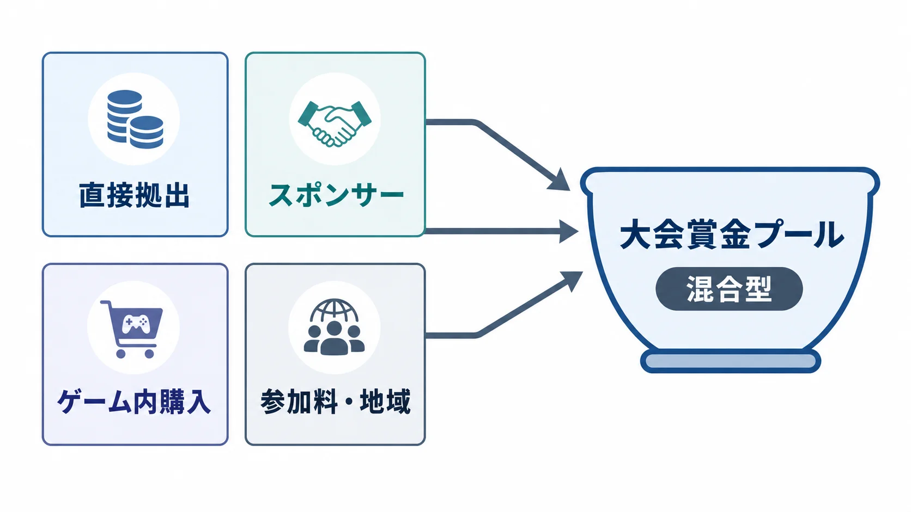
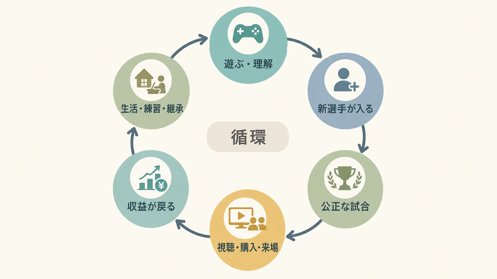

# eスポーツの歴史とビジネス構造――賞金、リーグ、配信、選手を支える仕組み

> **注意：** 本稿は法的助言ではありません。eスポーツ大会の賞金、参加条件、配信、選手契約に関する具体的な法的判断は、必ず弁護士・法務部門に確認してください。法令、行政解釈、業界団体の整理は更新されることがあるため、特に景品表示法と大会運営に関する最新の行政資料を参照してください。

eスポーツを、ゲームの上手い人へ単純に高額賞金を出す競技だと思っていないだろうか。

競技を続けるには、ルール、予選、審判、通信環境、配信、スポンサー営業、選手契約まで要る。しかもサッカーや野球と違い、競技に使うゲームには権利者がいる。パブリッシャーは大会でのゲーム利用を許諾し、アップデートで競技環境を変え、最上位大会を自ら運営することもできる。大会映像の配信にも、ゲーム、選手、チームなど複数の権利処理が関わる。[[1](#ref-1)]

つまり、eスポーツは競技であると同時に、 **一社の知的財産を核にした興行** でもある。この構造を外すと、「視聴者が多いのになぜチームは苦しいのか」「賞金総額が大きいのになぜ選手は安定しないのか」が見えなくなる。

本稿では、格闘ゲームに限らず、RTS、FPS、MOBA、バトルロイヤルへ競技が広がった過程をたどる。そのうえで、賞金、リーグ、放映・配信権、チーム運営、選手のキャリアがどうつながるかを、企画と運営の判断材料として整理する。

----

## 「元祖」は一つに決められない

eスポーツの起源は、何を成立条件にするかで変わる。

- コンピューターゲームの対戦会を起点にするのか。
- 店舗をまたぐ記録競争を起点にするのか。
- 賞金付きの興行を起点にするのか。
- プロチームと定期放送を備えたリーグを起点にするのか。

記録に残る早い例としては、1972年にスタンフォード大学の人工知能研究所で開かれた『Spacewar!』の大会がある。当時の記事には、個人戦とチーム戦、賞品、観客を伴う競技の様子が残されている。[[2](#ref-2)] ただし、これは研究施設のコンピューター文化から生まれたイベントであり、現在の産業構造まで備えたものではない。

1980年代のアーケードでは、別の形が育った。プレイヤーは同時対戦だけでなく、筐体に残るハイスコアを競った。米国のTwin Galaxiesは100以上の店舗からスコアを集め、共通の記録表を作った。競技規則をそろえ、離れた場所の成績を比較し、記録保持者を認定する仕組みである。[[3](#ref-3)] これは、ランキング、審判、記録管理という競技運営の起点として見られる。

格闘ゲームの草の根大会は、店舗や地域コミュニティが対面対戦を支える系譜を作った。Evoの成長史や梅原大吾氏の伝説的シーンは、別記事「対戦格闘ゲームの歴史」で詳しく扱っているため、ここでは深入りしない。

そして1990年代末から2000年代初頭の韓国では、『StarCraft』、PC房、ゲーム専門ケーブルチャンネル、プロリーグが結びついた。 **PC房** は、ネットワークゲームを遊べる時間貸しのPC店舗である。研究では、初期の韓国eスポーツを、PC通信、『StarCraft』とPC房、放送と観戦の制度化という段階で捉えている。[[4](#ref-4)] ここで重要なのは、単発大会の規模ではない。定期的に試合を制作し、実況・解説を付け、スター選手とチームを継続して見せる、 **放送コンテンツとしての競技** が成立したことだ。

したがって、「最初の大会」「記録競技の制度化」「地域コミュニティ」「放送型プロリーグ」は別々の起点である。現代のeスポーツは、そのどれか一つではなく、複数の系譜が合流したものと考えるほうが実務に役立つ。

----

## ジャンルが違えば、競技の見せ方も変わる

### RTS――戦略を観戦可能にする

**RTS（リアルタイムストラテジー）** は、資源採集、施設建設、部隊操作を同時進行する戦略ゲームである。『StarCraft』では、選手の操作速度だけでなく、偵察、資源配分、技術選択が勝敗を分けた。

ただし、選手が見ている画面だけでは、相手側の準備が分からない。放送では両者の情報を見られる観戦画面、リプレイ、実況・解説が必要になる。競技ルールだけでなく、 **隠れた判断を視聴者へ翻訳する制作技術** が発達した点が大きい。

### FPS――チームの役割と大会回路を作る

**FPS（ファーストパーソン・シューター）** は、一人称視点で射撃するゲームである。『Counter-Strike』は1999年に『Half-Life』のMod、つまりユーザー制作の改造版として始まり、製品化後も複数世代にわたって地域大会と国際大会のコミュニティを維持した。[[5](#ref-5)]

チームFPSでは、狙う技術だけでなく、役割分担、情報共有、装備購入、マップごとの作戦が要る。一方、観戦では複数選手の視点が同時に動く。運営側は、どの視点を映すか、全体マップをいつ見せるか、音声情報をどう扱うかを設計しなければならない。

### MOBA――ゲーム運営と年間リーグを接続する

**MOBA（マルチプレイヤー・オンライン・バトル・アリーナ）** は、複数人のチームが役割の異なるキャラクターを操り、相手の本拠地を目指すゲームである。『Dota』系譜やLeague of Legendsは、継続アップデートされるゲーム本体と、地域リーグ、国際大会、ゲーム内アイテム販売を強く接続した。

この方式では、新キャラクターやバランス調整が一般プレイヤー向けの更新であると同時に、競技ルールの変更にもなる。大会用バージョンをいつ固定するか、重大な不具合が出たキャラクターを使用禁止にするか、地域間で日程をどう合わせるかが運営業務になる。

### バトルロイヤル――多数参加を公平なシリーズへ変える

**バトルロイヤル** は、多数の選手・チームが同じ試合に入り、生存順位や撃破などを競う形式である。FortniteやApex Legendsでは、オンライン予選と大規模イベントが結びついた。Epic Gamesは2019年のFortnite競技全体に1億ドル、World Cup Finalsに3,000万ドルの賞金プールを発表している。これはパブリッシャーが競技への直接投資で注目を集めた、公式資料で確認できる例である。[[6](#ref-6)]

しかし、一試合の勝者だけでは安定した実力を測りにくい。複数試合のポイント、同点処理、マップや開始位置の偏り、敗退条件を設計する必要がある。観戦側でも、数十人の戦況から重要な衝突を選び、全体順位と目の前の戦闘を同時に伝える難しさがある。

ジャンル横断で見ると、競技化とは単に「対戦モードを付けること」ではない。 **実力差を結果へ反映するルールと、その理由を観客へ見せる情報設計を一緒に作ること** である。

----

## 賞金はどこから来るのか

賞金の出どころは、大きく分けてパブリッシャーなどの直接拠出と、プレイヤーの購入に連動する方式がある。後者はコミュニティ・クラウドファンディング型とも呼ばれる。スポンサー、開催地、放送事業者などが加わる場合もあるため、実際の大会は混合型になりやすい。

| 資金調達モデル | 仕組み | 強み | 主なリスク |
| --- | --- | --- | --- |
| パブリッシャー直接拠出 | 宣伝・競技育成費として賞金を用意 | 金額と日程を早く決めやすい | 会社の方針変更、タイトル業績、予算削減に左右される |
| スポンサー拠出 | 露出、企画、命名権などの対価 | ゲーム外の資金を呼び込める | 業種制限、独占カテゴリ、景気、炎上リスクに左右される |
| ゲーム内購入連動 | 対象アイテム売上の一部を賞金へ加算 | ファンの参加感と売上を結びやすい | 賞金が販売規模に振れ、支出を過度にあおる設計にもなり得る |
| 参加料・地域コミュニティ | 参加料や地域スポンサーで運営費・賞金を組み立てる | 小規模でも自走しやすい | 資金の流れによって法的評価が変わり、決済、返金、会場費も重い |

代表的な購入連動型として、Valveは2015年の『Dota 2』The Internationalで、Compendium売上の25％を賞金プールへ加えると明記した。[[7](#ref-7)] プレイヤーは観戦企画やゲーム内報酬を買い、その一部が大会の注目度をさらに高める。この循環は強力だが、毎年同じ売上が続く保証はない。

ここで新人プランナーが誤解しやすいのは、 **賞金総額を競技シーンの売上や選手の年収と同一視すること** だ。

賞金は上位へ偏る。チーム競技なら分配され、契約によってチーム取り分やボーナスの扱いも変わる。予選敗退者は受け取れないことがあり、渡航、宿泊、練習設備、コーチの給与、配信制作費は別に発生する。大きな決勝賞金は話題を作れても、下位大会、固定給、医療・心理支援、引退支援を直接は保証しない。

健全性を見るなら、賞金総額より次を分けて見る必要がある。

- 何チーム・何選手まで分配されるか。
- 給与と賞金のどちらが生活の基礎か。
- 年間に何回、実力に応じて参加できる大会があるか。
- 主催者、チーム、選手が負担する費用は何か。
- 翌年も続けられる原資と契約があるか。

----

## オープン大会とフランチャイズリーグ

競技への入口は、 **オープン型** と **固定枠型** の間にある。完全な二択ではなく、公開予選と招待枠、下部リーグとパートナーチームを組み合わせる例も多い。

| 判断軸 | 昇降格・公開予選のあるオープン型 | 固定枠・パートナー型 |
| --- | --- | --- |
| 参加資格 | 成績で上位へ進みやすい | 審査、契約、参加料などで枠を得る |
| 投資回収 | 降格で露出を失うリスクがある | 長期の露出を前提に営業・採用しやすい |
| 実力主義 | 新チームが結果で上がりやすい | 枠外の強豪が最上位へ入りにくい |
| チームの安定 | 成績不振が収入へ直結しやすい | 複数年契約や育成へ投資しやすい |
| リーグ側の負担 | 参加者増に応じて予選運営が膨らむ | パートナー審査と収益分配の説明責任が重い |

フランチャイズに近い固定枠型の狙いは、単に参入料を集めることではない。翌年も同じ舞台へ出られる見込みを作り、チームが複数年のスポンサー契約、選手契約、施設投資をしやすくすることにある。

League of Legendsでは2018年以降、一部地域で長期参加枠を持つパートナーモデルが導入された。Riot Gamesの説明では、当初はチームが約1,000万ドルを支払い、対象となるリーグ収益の50％を受け取る仕組みだった。しかし、スポンサーやメディア権収入の成長が費用増に追いつかず、同社は2024年に固定給とゲーム内デジタル商品の収益分配を重視する新モデルを提示した。[[8](#ref-8)]

この変更は、固定枠が安定を **約束するものではない** と示している。枠を固定しても、リーグ全体に分けられる収益が小さければ、チームの赤字は消えない。反対に、昇降格は競争の入口を開くが、降格リスクが高いほど長期投資は難しくなる。

### 放映・配信権とスポンサー収益をどう戻すか

リーグの収入候補には、スポンサー、放映・配信権、チケット、物販、ゲーム内商品、ライセンスがある。そこから制作費や会場費を引き、契約に基づいてチームへ分配する。

難しいのは、リーグとチームが同じスポンサー業種を売ると権利が衝突することだ。たとえばリーグ全体の周辺機器スポンサーと、個別チームの周辺機器スポンサーは競合し得る。映像へ出せるロゴ、選手個人の配信、会場内ブース、ゲーム内広告を誰が売れるかを先に区切らないと、営業してから契約不能になる。

企画時には「総収入の何％」だけでなく、 **分配前に控除する費用、最低保証、支払時期、対象地域、対象商品** まで確認する必要がある。売上分配と利益分配も別物である。

----

## 配信プラットフォームは、会場であり流通網でもある

韓国の専門テレビ局が定期番組を作った時代から、TwitchやYouTube Gamingの時代になると、世界同時配信の費用と参入障壁は下がった。Twitchは2011年に始まり、ゲーム企業やイベントが配信機能と提携する場へ急速に成長した。[[9](#ref-9)] YouTubeは2015年、ゲーム別ページ、ライブ配信、チャンネル通知をまとめたYouTube Gamingを発表した。[[10](#ref-10)]

配信はテレビの代用品ではない。チャット、投票、ドロップ、複数視点、巻き戻し、共同視聴により、観客を参加者へ近づけた。人気配信者による **コストリーミング（co-streaming）** 、つまり公式映像を許諾の範囲で同時視聴・解説する形式は、既存コミュニティへ大会を届けられる。

一方で、無料配信を広く開けば到達人数は増えるが、独占放映権の価格は付けにくくなる。独占契約はまとまった収入を得やすいが、視聴者が普段使わないサービスへ移る摩擦を生む。アルゴリズム、広告単価、利用規約、地域制限の変更も、主催者だけでは制御できない。

さらに、配信で見られることと、権利が自由に使えることは同じではない。大会映像の切り抜き、選手の顔やハンドルネーム、ゲーム内音楽、スポンサー素材には別々の条件がある。WIPOも、放送・配信には大会主催者だけでなく、パブリッシャー、チーム、選手を含む必要な権利の確保が要ると整理している。[[1](#ref-1)]

見るべき指標も同時接続数だけではない。平均視聴時間、再訪率、地域・言語別の到達、スポンサー表示の品質、短尺動画への再利用、ゲーム本体への復帰まで含めて、配信の役割を決める必要がある。

----

## チームは「選手を集める箱」ではない

競技規模によるが、継続運営するチームには次の役割がある。

- **選手** ：試合、練習、メディア出演、配信、スポンサー企画を担う。
- **コーチ** ：戦術、練習計画、対戦相手への準備、試合中の意思決定を支える。
- **アナリスト** ：映像や試合データから傾向を整理する。利用できるデータの範囲はタイトルごとに違う。
- **マネージャー** ：日程、渡航、ビザ、宿泊、機材、主催者との連絡を処理する。
- **事業・制作担当** ：スポンサー営業、SNS、動画、物販、イベントを運営する。
- **法務・経理・ケア担当** ：契約、税務、保険、健康、心理面を支える。専任を置けない規模では外部へ委託する。

勝つための部門と、勝利を事業へ変える部門の両方が必要になる。選手へ練習以外の負担を集中させると競技力が落ちる。反対に、競技部門だけを厚くしても、スポンサーへの報告やファン向け発信が止まれば収入が細る。

### 契約と移籍は、競技ルールの外側にある

選手契約では、固定給、賞金分配、配信収益、肖像・ハンドルネームの利用、スポンサー出演、契約期間、解除、移籍金、負傷時の扱い、機密保持などを分ける必要がある。未成年なら、保護者同意、学業、労働時間、渡航も問題になる。

リーグ登録と雇用契約も同じではない。大会へ登録できても、就労資格がなければ海外拠点で働けない場合がある。逆に契約が残っていても、出場枠から外れれば競技実績を積めない。ロスター変更期限、控え選手の扱い、貸出、移籍交渉の権限を、タイトルの規則と各国法の両方で確かめなければならない。

韓国では2020年、文化体育観光部がeスポーツ選手、育成選手、未成年選手向けの標準契約書を導入した。[[11](#ref-11)] 世界共通の答えではないが、競技が成熟するほど「強ければ口約束でよい」から、権利義務を文書化する方向へ進む例である。

### キャリアが短くなりやすい理由

eスポーツ選手の現役期間を一つの平均値で語るのは危険だ。個人競技とチーム競技、タイトルの寿命、役割、地域で条件が違い、長く活躍する選手もいる。

それでも、キャリアが不安定になりやすい構造はある。ゲームの更新で得意分野の価値が変わる。チーム枠は少なく、成績不振で編成が変わる。長時間練習と遠征は心身へ負担をかける。競技タイトルやリーグ自体の方針変更も、選手には制御できない。引退移行を扱った研究も、選手の技能転換、心理支援、リハビリテーションを競技中から用意する必要性を指摘している。[[12](#ref-12)]

引退後の道は、配信者、実況・解説、コーチ、アナリスト、チーム運営、大会制作、ゲーム開発などが考えられる。ただし、有名選手なら誰でも配信で暮らせるわけではない。話す技術、企画、編集、営業は競技力とは別である。

チーム側は、現役中から発信、指導、分析、語学などを経験させるかを判断する必要がある。練習時間を削りすぎれば競技成績に響くが、競技だけへ全振りすれば引退時の選択肢が狭くなる。これは福利厚生だけでなく、人材を長く業界へ残す投資でもある。

----

## 日本の景品表示法は「賞金10万円まで」という単純な壁ではない

日本のeスポーツ賞金では、景品表示法がしばしば「高額賞金を一律に禁止する法律」のように語られる。しかし、まず見るべきなのは金額ではなく、提供する金品が同法上の **景品類** に当たるかである。

消費者庁は、景品類を、顧客を誘引するための手段として、事業者が自己の供給する商品・サービスの取引に付随して提供する物品や金銭などと説明している。[[13](#ref-13)] 有料ゲームの購入者を対象に、販売促進として賞金を出すような設計では、この「取引への付随」が論点になり得る。

一方、消費者庁の現行Q&Aは、eスポーツ大会の賞金について、個々の大会の実態から **仕事の報酬等** と認められるなら景品類に当たらず、景品規制の対象にならないと明記している。[[14](#ref-14)] したがって、プロライセンスを持つ人だけが高額賞金を受け取れる、あるいは無条件に一定額までしか出せない、と一律には整理できない。

日本eスポーツ協会、JeSUは2018年に活動を始め、プロライセンスと公認大会の仕組みを整えた。[[15](#ref-15)] その後の法令適用事前確認手続では、ライセンス選手に限定しない大会でも、参加者が審査で限定され、高い技術による実演を観客・視聴者へ見せて競技性と興行性を高める仕事であるなど、具体的な条件の下で賞金を仕事の報酬とする整理が示された。反対に、観戦・配信もなく、ゲームプレイの魅力に見合わない賞金を専ら販促目的で出すような場合は、個別判断になる。[[16](#ref-16)]

実務で必要なのは、「ライセンスがあるから大丈夫」「参加料を別会社が集めるから大丈夫」と部品だけで判断することではない。

- 誰が賞金を提供するのか。
- ゲーム購入や課金と参加資格がどう結びつくのか。
- 参加者をどのように選ぶのか。
- 観戦・配信を含む興行として、どのような実演を求めるのか。
- 参加料、スポンサー賞、出演料をどう区別するのか。
- 景品表示法以外に、賭博、風営適正化法、税務、未成年者、消費者契約などの論点がないか。

これらを大会規約、告知、応募条件、契約、会計処理まで通して整合させる必要がある。ここは個別事案で結論が変わる法務領域であり、具体的な大会は最新の行政資料と専門家の確認を前提に設計すべきである。

----

## 企画者が見るべきものは「大会の大きさ」ではなく循環である

競技シーンを作るとき、決勝会場や賞金額から考え始めると危うい。先に見るべきなのは、次の循環が一年後も回るかである。

1. 一般プレイヤーがゲームを遊び、競技を理解する。
2. 公開予選や下部大会から、新しい選手が入る。
3. 運営が公正な試合を作り、配信が判断の意味を伝える。
4. ファンの視聴、購入、来場が、スポンサーやゲーム内売上につながる。
5. 収益がリーグ、チーム、選手、制作現場へ戻る。
6. 選手が生活と練習を続け、引退後も知識を次世代へ渡す。

どこか一つだけ太くても、循環は続かない。賞金だけが大きければ上位以外が残れない。固定枠だけがあれば新規参入が閉じる。視聴者だけが多くても、権利商品と営業設計がなければ収益にならない。競技性を守っても、配信で状況が読めなければ観客が育ちにくい。

eスポーツは、ゲームがうまい人の祭典から始められる。しかし産業として続けるには、 **賞金設計、参加経路、知的財産、放送・配信、チーム経営、選手の労働とキャリア** を一つのシステムとして扱わなければならない。

正解はタイトルごとに違う。だからこそ企画者は、派手な成功例の金額をコピーするのではなく、「誰が権利を持ち、誰が費用を負担し、誰へ収益と機会が戻るのか」を図にしてから大会を設計する必要がある。

## References

1. [Intellectual Property in Esports][1] - WIPOによる、パブリッシャー、主催者、チーム、選手、放送事業者の権利と許諾関係の整理。

2. [SPACEWAR: Fanatic Life and Symbolic Death Among the Computer Bums][2] - 1972年の『Spacewar!』大会を同時代に記録したRolling Stone記事のアーカイブ。

3. [Oldest videogame adjudication service][3] - Twin Galaxiesによる複数店舗のハイスコア収集と記録認定の概要。

4. [Historiography of Korean Esports: Perspectives on Spectatorship][4] - 韓国初期eスポーツをPC通信、PC房、『StarCraft』、放送と観戦の制度化から分析した研究。

5. [Counter-Strike: Global Offensive - History][5] - 1999年のModから国際的な競技コミュニティへ続く系譜を示すValveの公式ページ。

6. [Fortnite World Cup Details and 2019 Prize Pool Info][6] - 2019年の競技賞金プールとWorld Cup Finalsの賞金を示すEpic Gamesの発表。

7. [Dota 2 - The International Compendium 2015][7] - Compendium売上の25％を賞金プールへ加える仕組みを示すValveの公式ページ。

8. [LoL Esports戦略の軌道調整][8] - 長期参加枠、リーグ収益分配の課題、デジタル商品中心の収益モデルへの変更を説明するRiot Gamesの公式発表。

9. [Twitch Announces Record Breaking Growth][9] - Twitchの2011年開始と、ゲーム企業・イベントとの配信連携を伝える公式発表。

10. [A YouTube built for gamers][10] - YouTube Gamingのゲーム別ページ、ライブ配信、通知などの機能を示す公式発表。

11. [이스포츠 표준계약서 도입으로 선수 보호 나선다][11] - 韓国文化体育観光部によるeスポーツ選手向け標準契約書導入の発表。

12. [The Continuity of eSports Athletes' Careers: Skill Transformation, Personal Development, and Well-Being][12] - 引退後の技能転換、個人の成長、ウェルビーイングを扱った研究。

13. [景品規制の概要][13] - 景品表示法上の「景品類」と取引への付随性を説明する消費者庁資料。

14. [景品に関するQ&A][14] - eスポーツ大会の賞金が仕事の報酬等と認められる場合の考え方を示す消費者庁Q54。

15. [日本eスポーツ連合（JeSU）設立記者会見を行いました。][15] - 2018年の活動開始、公認大会、プロライセンス制度の目的を示すJeSUの発表。

16. [eスポーツに関する法的課題への取組み状況のご報告][16] - 法令適用事前確認手続を踏まえ、ライセンスの有無、興行性、仕事の報酬等の考え方を整理したJeSUの報告。

[1]: https://www.wipo.int/en/web/sports/esports
[2]: https://archive.computerhistory.org/resources/access/text/2021/05/102711733-05-01-acc.pdf
[3]: https://www.guinnessworldrecords.com/world-records/384665-oldest-videogame-adjudication-service
[4]: https://ijoc.org/index.php/ijoc/article/view/13795
[5]: https://blog.counter-strike.net/index.php/history/
[6]: https://www.fortnite.com/news/fortnite-world-cup-details?lang=en-US
[7]: https://www.dota2.com/international2015/compendium/
[8]: https://www.riotgames.com/ja/news/lol-esports-strategy-adjustments-2024-ja
[9]: https://blog.twitch.tv/en/2013/03/12/twitch-announces-record-breaking-growth-632d61a2bfc1/
[10]: https://blog.youtube/news-and-events/a-youtube-built-for-gamers/
[11]: https://www.mcst.go.kr/site/s_notice/press/pressView.jsp?pSeq=18262
[12]: https://doi.org/10.1177/21582440241249263
[13]: https://www.caa.go.jp/policies/policy/representation/fair_labeling/premium_regulation
[14]: https://www.caa.go.jp/policies/policy/representation/fair_labeling/faq/premium/assets/representation_cms220_250620_01.pdf
[15]: https://jesu.or.jp/contents/news/news_detail_180201-2/
[16]: https://jesu.or.jp/contents/news/news_0912/

----

この文書は、Perplexity、Claude、OpenAI Codex の3つのAIの支援を受けて著述されたものです。引用画像を除き、MIT License にて提供されています。
